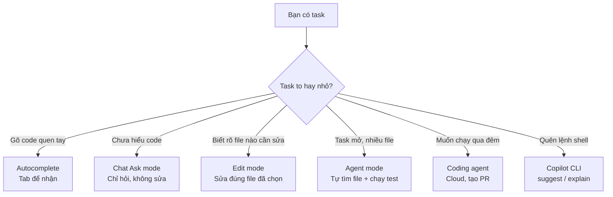

# 00 — Tổng Quan Copilot: Từ Autocomplete Tới Agent

> **Dành cho:** người mới dùng GitHub Copilot, và dev đã quen gõ autocomplete nhưng chưa thử agent.
> **Vấn đề:** một tài khoản có nhiều cách làm việc khác nhau — cái nào dùng khi nào, vòng lặp agent chạy ra sao, tốn bao nhiêu AI Credits.
> **Đọc xong:** phân biệt được 5 chế độ, giải thích được vòng lặp agent cho đồng nghiệp trong 2 phút, ước lượng được AI Credits, và làm xong task đầu tiên.
> **Thời gian:** ~25 phút.

## Mục lục

1. [Copilot là gì? 5 chế độ một tài khoản](#1-copilot-là-gì-5-chế-độ-một-tài-khoản)
2. [Vòng lặp agent — chuyện gì xảy ra bên trong](#2-vòng-lẶp-agent-chuyện-gì-xảy-ra-bên-trong)
3. [4 họ tool Copilot](#3-4-họ-tool-copilot)
4. [Tiền đi đâu — AI Credits hoạt động thế nào](#4-tiền-đi-đâu-ai-credits-hoạt-động-thế-nào)
5. [Copilot làm được gì (thực tế)](#5-copilot-làm-được-gì-thực-tế)
6. [Dùng ở đâu — chọn bề mặt nào?](#6-dùng-ở-đâu-chọn-bề-mặt-nào)
7. [Bản đồ extension: 7 thứ hay bị nhầm lẫn](#7-bản-đồ-extension-7-thứ-hay-bị-nhầm-lẫn)
8. [Walkthrough 5 bước cho người mới](#8-walkthrough-5-bước-cho-người-mới)
9. [Hiểu nhầm thường gặp + Pitfalls + cách fix](#9-hiểu-nhầm-thường-gặp--pitfalls--cách-fix)
10. [Bài tập thực hành](#10-bài-tập-thực-hành)
11. [Đi tiếp tới đâu?](#11-đi-tiếp-tới-đâu-link-chéo)

---

## 1. Copilot là gì? 5 chế độ một tài khoản

**Câu trả lời nhanh:** GitHub Copilot là dev AI bên cạnh bạn. Nó không phải 1 công cụ duy nhất, mà là 5 "động cơ" khác nhau chạy chung 1 tài khoản. Bạn chọn động cơ phù hợp với kích thước việc.

| Chế độ | Bạn làm gì | Nó làm gì | Ví dụ |
|---|---|---|---|
| **Autocomplete** | Gõ code bình thường | Gợi ý dòng tiếp theo, bấm Tab nhận | Gõ `def fetch_user(` → hiện gợi ý thân hàm |
| **Chat (Ask)** | Hỏi trong ô Chat | Trả lời bằng chữ, không sửa file | "Giải thích hàm này cho tôi" |
| **Edit** | Chọn vài files + ra lệnh | Sửa đúng các file bạn chọn | "Thêm null check cho 3 chỗ này" |
| **Agent** | Giao task mở | Tự tìm file, sửa, chạy test, lặp tới khi xong | "Thêm rate-limit cho POST /login" |
| **Coding agent** (github.com) | Assign issue cho `copilot` | Code trên cloud, mở PR sau ~10 phút | Assign issue #123 → có PR sẵn |

> **Nhớ ngay:** autocomplete đoán **dòng tiếp theo**. Agent giải **cả việc**.
> Khác nhau: bạn có cần nó tự đi tìm file và chạy test không? Có → Agent. Không → chế độ khác.

### 1.0. Mỗi chế độ là gì (nôm na + ví dụ)

> Quy tắc của series này: mọi khái niệm đều có 3 lớp — **1 câu định nghĩa**, **so sánh đời thường**, **ví dụ code thật**. Không thấy đủ 3 lớp = chưa đủ rõ.

**Autocomplete (ghost text)**
- 1 câu: copilot đoán dòng code tiếp theo, hiện mờ phía con trỏ.
- Nôm na: như gợi ý từ trên bàn phím điện thoại, nhưng cho code.
- Ví dụ: gõ `def fetch_user(user_id:` → hiện `try: return db.query(...) except NotFound: raise ...` → bấm `Tab` nhận, `Esc` bỏ.

**Chat — Ask mode**
- 1 câu: bạn hỏi, copilot trả lời chữ + snippet, không đụng file.
- Nôm na: hỏi thầy giáo "đoạn này nghĩa là gì?" — thầy giảng, thầy không cầm tay bạn sửa.
- Ví dụ: bôi đen hàm `login()` → hỏi "Giải thích từng nhánh if trong hàm này?".

**Edit mode**
- 1 câu: bạn chọn 2–3 file, copilot sửa đúng trong đó.
- Nôm na: đưa thợ 3 viên gạch cụ thể, nói "trát lại 3 viên này".
- Ví dụ: chọn `login.ts` + `auth.ts` → "Thêm null check cho `customerId`".

**Agent mode**
- 1 câu: bạn giao task, copilot tự tìm file, sửa, chạy terminal, lặp lại tới khi xong.
- Nôm na: giao chìa khóa nhà cho thợ — tự tìm phòng hỏng, tự mua vật liệu, tự nghiệm thu.
- Ví dụ: "Trong `apps/api`, POST /orders crash khi thiếu `customerId`. Tìm nguyên nhân, fix, thêm test, chạy `npm test`."

**Coding agent (github.com)**
- 1 câu: bạn assign issue cho bot `copilot`, nó code trên cloud rồi mở PR.
- Nôm na: thuê đội thi công qua đêm — sáng dậy chỉ cần xem PR.
- Ví dụ: assign issue #123 "Fix crash POST /orders" → 10 phút sau có PR `copilot/fix-123`.

**Copilot CLI** (bổ sung, chạy trong terminal)
- 1 câu: trợ lý lệnh shell: `gh copilot suggest` / `explain`.
- Nôm na: từ điển lệnh Linux biết nói tiếng Việt.
- Ví dụ: `gh copilot suggest "xóa branch đã merge"` → sinh `git branch --merged | grep -v main | xargs git branch -d`.

### 1.1. Chọn chế độ nào?



### 1.2. Prompt tệ = kết quả tệ

Cùng 1 task, 2 cách viết khác nhau hoàn toàn:

```text
# TỆ — hỏi như chatbot (dùng Ask mode, không context):
"TypeError: Cannot read properties of undefined nghĩa là gì?"

# TỐT — giao việc như agent (dùng Agent mode, có scope + lệnh check):
"Trong apps/api, endpoint POST /orders crash khi payload thiếu customerId.
Tìm root cause, fix, thêm regression test, chạy npm test -- --filter api.
Đừng sửa gì ngoài phạm vi này."
```

> Khác nhau duy nhất: câu 2 có **nơi nào** (apps/api), **làm gì** (fix + test),
> **check bằng gì** (npm test), và **ranh giới** (đừng sửa ngoài phạm vi).

### 1.3. Vì sao 2026 khác 2023?

- 2023: copilot = autocomplete + chat đơn giản.
- 2024–2025: thêm Edit, Agent mode, coding agent.
- 2026: đổi model được ngay trong Chat (GPT/Claude/Gemini), thêm Skills, MCP, custom agents, prompt files.

**Hệ quả:** cùng 1 prompt, model khác + chế độ khác = kết quả khác hẳn.
Học cách chọn chế độ đúng *trước* khi học tối ưu prompt.

---

## 2. Vòng lặp agent — chuyện gì xảy ra bên trong

> **Câu hỏi then chốt:** khi bạn giao task cho Agent mode, nó *thực sự* làm gì trong 30 giây tiếp theo?

### 2.1. Một vòng lặp = 4 bước

```
BƯỚC 1 — NGHĨ (reasoning)
   Model tự hỏi: "Cần đọc file nào? Cần chạy lệnh gì để xác nhận?"

BƯỚC 2 — LÀM (tool call)
   Model gọi 1 hoặc nhiều tool cùng lúc:
   read(auth.ts) + search("customerId") + terminal(npm test)

BƯỚC 3 — THẤY (observation)
   VS Code thực thi tool, trả kết quả về: nội dung file / stdout / exit code

BƯỚC 4 — KIỂM TRA (đủ chưa?)
   Model tự đánh giá: chưa xong → quay lại BƯỚC 1. Xong → báo cáo + diff.
```

> **Điểm quan trọng nhất:** model không *chạm* disk. VS Code (harness) mới là cái
> thực sự mở file, chạy lệnh, rồi đưa kết quả về model.
>
> Nôm na: model = kiến trúc sư vẽ bản vẽ. VS Code = đội thợ cầm búa + máy khoan.
> Kiến trúc sư không bao giờ tự ra công trường.

### 2.2. Vì sao phải tách model và VS Code?

- **An toàn:** policy (cấm chạy lệnh nguy hiểm, ẩn file bí mật) đặt ở VS Code — model không lách được.
- **Nhất quán:** cùng model, chạy trên VS Code / JetBrains / Neovim → hành xử giống nhau (chỉ đổi "đội thợ").
- **Kiểm soát được:** bạn bật/tắt tool, giới hạn phạm vi — tất cả ở phía harness.

### 2.3. Ví dụ trace thật

Task: *"Thêm rate-limit cho POST /login"* (Agent mode, VS Code):

```
Turn 1: "Tìm code login"        → search *login* + grep "POST.*login"
Turn 2: "Đọc route + middleware" → read 2 file
Turn 3: "Có library chưa?"       → read package.json + grep "rate-limit"
Turn 4: "Có plan"               → hiện plan cho bạn duyệt
Turn 5: (bạn bấm Duyệt)         → edit route.ts + edit route.test.ts
Turn 6: "Chạy test"             → npm test → FAIL (import sai) → fix
Turn 7: "Chạy lại"              → npm test → PASS → báo cáo diff
```

Tổng: 7 turns, bạn chỉ gõ 1 prompt + bấm 1 lần duyệt.

### 2.4. Khi nào agent làm hỏng? (3 nguyên nhân)

| Trạng thái | Dấu hiệu | Cách fix |
|---|---|---|
| Không tìm ra file đúng | Đọc lung tung, sửa sai chỗ | Viết instructions rõ + prompt files (bài 03, 05) |
| Báo "xong" nhưng test fail | Không chạy verify | Bắt agent chạy lệnh test *mỗi task* |
| Càng sửa càng nát (sau turn 15+) | Context đầy, quên đầu bài | Mở chat mới, chia nhỏ task |

> **Quy tắc vàng:** agent 15 turns không tiến triển → dừng, mở chat mới, chia task nhỏ hơn.

---

## 3. 4 họ tool Copilot

> Khi Agent mode "nghĩ", nó có 4 nhóm công cụ trong tay. Biết trước sẽ không ngạc nhiên khi thấy nó chạy lệnh gì.

### Nhóm 1 — Đọc & tìm (nhanh, rẻ, chạy local)

| Tool | Việc | Ví dụ |
|---|---|---|
| `read` / `#file` | Đọc file vào context | `#file:src/routes/login.ts` |
| `search` | Tìm nội dung cross-file | `customerId trong apps/api` |
| `list` / `#folder` | Liệt kê thư mục | Hiểu layout repo |

> **Mẹo tiết kiệm:** luôn `search` trước, `read` sau. File >300 dòng → bảo agent đọc từng phần.

### Nhóm 2 — Sửa & chạy (có thể phá thứ, cần review)

| Tool | Việc | Cách dùng an toàn |
|---|---|---|
| `edit` | Sửa file, hiện diff | Duyệt từng hunk trước khi Accept |
| `create` | Tạo file mới | Check path đúng folder |
| `terminal` | Chạy shell (`npm test`, `git diff`) | Có confirm trước khi chạy lệnh nguy hiểm |

> **Sai lầm phổ biến:** Accept all không đọc diff. Đúng: duyệt từng hunk, chạy test, rồi mới accept tiếp.

### Nhóm 3 — Mở rộng context (hỏi rộng hơn file đang mở)

| Tool | Việc |
|---|---|
| `@workspace` | Hỏi cả repo: "Hàm này dùng ở đâu?" |
| `@terminal` | Hỏi về output terminal vừa chạy |
| `@vscode` | Hỏi API/settings của VS Code |
| `#fetch` | Đọc URL/docs ngoài |

### Nhóm 4 — MCP (công cụ ngoài, động)

> **MCP là gì (3 lớp):**
> - 1 câu: MCP server là chương trình ngoài repo, phơi ra các "tools" để agent gọi khi cần dữ liệu ngoài.
> - Nôm na: ki-ốt dịch vụ trong siêu thị — siêu thị (VS Code) có sẵn quầy thịt/rau (read/edit/terminal), ki-ốt (MCP) cho thêm: GitHub, Postgres, Slack.
> - Ví dụ: MCP server `github` có tool `create_pr` → agent gọi `mcp__github__create_pr` → PR được tạo thật trên GitHub.

```json
// .vscode/mcp.json — mẫu tối thiểu (copy-paste, sửa path)
{
  "servers": {
    "github": { "command": "npx", "args": ["-y", "@modelcontextprotocol/server-github"] }
  }
}
```

> Quy tắc: giữ **3–6 servers**. Càng nhiều tool → model càng dễ chọn nhầm.

---

## 4. Tiền đi đâu — AI Credits hoạt động thế nào

> **Câu hỏi:** 1 task agent tốn bao nhiêu tiền, và làm sao không bị cháy túi?

### 4.1. Bốn điều cần biết (không cần nhớ gì thêm)

1. **1 AI Credit = 0,01 USD.** Chi phí = (giá token model × số token) quy đổi ra credits.
2. **Autocomplete KHÔNG trừ AI Credits** — thoải mái dùng.
3. **Mỗi turn agent = 1+ lượt gọi model** — model mạnh tốn nhiều hơn model rẻ.
4. **Instructions nạp lại MỖI turn** — instructions 600 dòng × 20 turns = 12.000 dòng "học lại".

### 4.2. Giá các gói (10/2026 — *check lại trước khi trả tiền*)

| Gói | Giá | Credits kèm | Hợp với ai |
|---|---|---|---|
| Pro | 10 USD/tháng | 1.500 | Cá nhân, code nhẹ |
| Pro+ | 39 USD/tháng | 7.000 | Cá nhân code nặng |
| Max | 100 USD/tháng | 20.000 | Dùng agent cả ngày |
| Business | 19 USD/seat | 1.900/seat | Team cần quản trị |
| Enterprise | 39 USD/seat | 3.900/seat | Corp, compliance |

> Số credits đổi theo thời gian. Luôn check `github.com/settings/copilot` làm chuẩn.

### 4.3. Ví dụ tính nhẩm (thay số cho repo bạn)

```text
Giả định:
- copilot-instructions.md = 150 dòng ≈ 2.500 tokens
- Task 10 turns → instructions nạp lại 10 lần = 25.000 tokens input

Nếu instructions phình lên 600 dòng (~10.000 tokens):
- 10 turns × 10.000 = 100.000 tokens → chênh lệch 75.000 tokens/task
- 20 tasks/tuần × 75.000 = 1,5 triệu tokens/tuần vứt qua cửa sổ

Kết luận: 1 giờ don instructions gọn (bài 03) tiết kiệm hơn 1 tuần tối ưu prompt.
Kiểm chứng: xem dashboard ở github.com/settings/copilot
```

### 4.4. Checklist tiết kiệm (dán vào wiki team)

- [ ] `copilot-instructions.md` < 200 dòng (`wc -l .github/copilot-instructions.md`)
- [ ] Checklist dài → tách sang prompt file, không nhét vào instructions
- [ ] MCP ≤ 6 servers
- [ ] Task mới → chat mới (không nối vào history cũ)
- [ ] Model rẻ cho task dễ (giải thích), model mạnh cho task khó (refactor)
- [ ] Mọi task code phải có lệnh verify chạy thật

---

## 5. Copilot làm được gì (thực tế)

Danh sách việc *có thể giao ngay hôm nay*:

- **Fix bug đa file** (Agent mode): mô tả triệu chứng, nó tìm file, sửa, chạy test.
- **Việc nhàm chán**: viết test thiếu, fix lint, resolve conflict, upgrade dep.
- **Git/GitHub**: commit message, tạo branch, mở PR, đọc PR comments.
- **Kết nối hệ thống ngoài** (MCP): query DB, post Slack, mở PR tự động.
- **Terminal**: `gh copilot suggest "xóa branch đã merge"` → sinh lệnh shell.

### 5.1. Ba prompt mẫu copy-paste chạy được

**Fix bug đa file (Agent mode, ~10 phút):**
```text
"Trong packages/auth, test `npm test -- --filter auth` đang fail 2 cases.
Tìm root cause, fix source (không sửa test để cho pass ảo), chạy lại test,
báo cáo: file nào đổi, vì sao, còn rủi ro gì."
```

**Viết test thiếu (Edit mode, ~5 phút):**
```text
"Trong apps/api/src/routes/, file nào chưa có test tương ứng thì viết test
mới theo mẫu login.test.ts. Chạy test sau mỗi file. Báo cáo sau 5 file
để review trước khi làm tiếp."
```

**Terminal (CLI, tức thì):**
```bash
gh copilot suggest "xóa các git branch local đã merge vào main"
gh copilot explain "docker run -p 5432:5432 -e POSTGRES_PASSWORD=secret postgres:16"
```

---

## 6. Dùng ở đâu — chọn bề mặt nào?

| Dùng ở | Code chạy | Dùng config repo? | Khi nào dùng |
|---|---|---|---|
| **VS Code** | Máy bạn | Có (`.github/`, `.vscode/`) | Mặc định — agent mode đầy đủ nhất |
| **JetBrains** | Máy bạn | Có | Dev .NET / Python / C++ |
| **Neovim** | Máy bạn | Có | Fan terminal, `:Copilot status` |
| **github.com** (coding agent) | Cloud GitHub | Chỉ repo config | Giao issue qua đêm, không cần local |
| **Copilot CLI** | Terminal bạn | Không | Gợi ý lệnh shell, explain |

> **Tin tốt:** hành vi agent *giống nhau mọi nơi*. Bạn học 1 lần, dùng ở bất cứ đâu.
> Chi tiết so sánh từng bề mặt: [bài 02](./02-cac-be-mat-vscode-ide-web-cli.md).

---

## 7. Bản đồ extension: 7 thứ hay bị nhầm lẫn

> Đây là 7 khái niệm "mở rộng" copilot. Nghe na ná nhau, nhưng mỗi thứ có *một* công việc riêng.

| Thứ | Là gì (nôm na) | Ví dụ | Dùng khi nào |
|---|---|---|---|
| **`copilot-instructions.md`** | Giấy dán đầu tủ lạnh — agent đọc *mọi* lần vào bếp | "Dùng pnpm. Test: `npm test -- --filter api`." | Quy ước mọi chat đều phải nhớ |
| **`*.instructions.md`** | Giấy dán riêng cho từng phòng | `applyTo: apps/api/**` → "Route không query DB trực tiếp" | Quy tắc chỉ đúng 1 thư mục |
| **Prompt files** | Công thức nấu ăn in sẵn, lôi ra khi cần | Gõ `/deploy` chạy checklist 15 bước | Việc lặp lại >3 lần |
| **Custom agents** | Thợ chuyên việc: thợ điện chỉ sửa điện | Agent `reviewer` chỉ đọc + comment, cấm sửa code | Task chuyên biệt, hẹp |
| **Agent Skills** | Sổ tay nghề chuẩn, agent nào cũng đọc | `SKILL.md` của skill `deploy-prod` | Knowledge cần khi đúng context |
| **MCP** | Ki-ốt dịch vụ ngoài (DB, Slack, GitHub) | `mcp__github__create_pr` mở PR thật | Cần dữ liệu ngoài repo |
| **Extensions** | Combo đóng gói (prompts + agents + MCP) để share | Extension `security-review` cho cả team | Share cho nhiều repo |

**Quy tắc chọn nhanh:**

- Mọi chat phải nhớ → `copilot-instructions.md` (bài 03)
- 1 thư mục cụ thể → `*.instructions.md` (bài 03)
- Workflow lặp lại, gọi khi cần → prompt file (bài 05)
- Persona chuyên biệt → custom agent (bài 06)
- Hệ thống ngoài → MCP (bài 08)

---

## 8. Walkthrough 5 bước cho người mới

> Yêu cầu: đã cài xong (chưa cài → [bài 01](./01-cai-dat-va-xac-thuc.md)). 30 phút đầu nên làm đúng thứ tự này.

**Bước 1 — Mở Chat trong repo thật (2 phút)**

```bash
# Mở VS Code tại repo của bạn, rồi:
# Ctrl+Shift+P → "Chat: New Chat" (hoặc Ctrl+Alt+I)
# Chọn Agent mode
code /path/to/repo-cua-ban
```

**Bước 2 — Kiểm tra copilot đọc đúng repo (5 phút)**

Mục tiêu: *không phải hỏi cho vui*, mà kiểm tra copilot biết repo bạn trước khi bạn tin nó.

```text
Gõ trong Chat:
"Đọc README + package.json, tóm tắt: project này là gì,
chạy dev bằng lệnh nào, test bằng lệnh nào. Không sửa gì, chỉ trả lời."
```

Nếu câu trả lời sai → copilot chưa đọc đúng. Fix trước khi đi tiếp.

**Bước 3 — Viết instructions tối thiểu (5 phút)**

Đừng copy wiki 500 dòng. Mẫu tối thiểu đủ dùng:

```markdown
<!-- .github/copilot-instructions.md — mẫu tối thiểu (copy-paste, sửa lại) -->
# Project: Acme API — Node 20 + Express + Postgres

## Commands (đã xác minh 2026-10)
- Dev: `npm run dev` (cần `.env` từ 1Password "Acme dev")
- Test: `npm test -- --filter api`
- Lint: `npm run lint`

## Rules
- ALWAYS chạy focused test sau khi sửa.
- NEVER commit trực tiếp main.
```

**Bước 4 — Giao task nhỏ có lệnh check (10 phút)**

```text
"Chạy linter của repo, fix 3 lỗi đầu tiên, chạy lại lint để xác nhận.
Chỉ sửa files liên quan, không động config."
```

Quan sát: nó đọc file → sửa → chạy lệnh → đọc output → sửa tiếp. Đây chính là vòng lặp ở mục 2.

**Bước 5 — Đóng session sạch (3 phút)**

```bash
# Xem usage: github.com/settings/copilot (số AI credits đã dùng)
# Mở chat mới cho task kế tiếp: Ctrl+Shift+P → "Chat: New Chat"
# Không nối task mới vào history cũ (tốn + nhiễu)
```

### Bạn đã hiểu bài 00 khi:

- [ ] Phân biệt được 5 chế độ + kể 1 ví dụ mỗi chế độ
- [ ] Giải thích được vòng lặp agent cho đồng nghiệp trong 2 phút
- [ ] Kể được 4 họ tools + 1 ví dụ mỗi họ
- [ ] Biết *vì sao* instructions dài tốn credits
- [ ] Chạy xong 5 bước walkthrough, có 1 task pass thật

---

## 9. Hiểu nhầm thường gặp + Pitfalls + cách fix

> Nguyên tắc: khi copilot làm sai, **đây thường là do bạn setup**, không phải nó "dở".

### 9.1. Năm hiểu nhầm hay gặp nhất

| Hiểu nhầm | Sự thật |
|---|---|
| "Copilot là chatbot, hỏi gì đáp nấy" | Có 5 chế độ. Ask mode = chỉ chữ. Muốn sửa file → Edit/Agent. |
| "Agent tự nghĩ tự làm, không cần kiểm tra" | Agent = junior dev nhanh nhưng ẩu. Bạn là reviewer bắt buộc. |
| "MCP cài vào là xong" | MCP server chạy *ngoài* VS Code, có thể rớt mạng, sai key. Check `/mcp` mỗi lần. |
| "Instructions càng dài càng khôn" | Nạp lại *mỗi turn*. Dài = tốn tiền + loãng trọng tâm. Giữ <200 dòng. |
| "Model mạnh nhất luôn tốt nhất" | Mạnh = đắt. Giải thích code → model rẻ. Refactor khó → model mạnh. |

### 9.2. Chẩn đoán nhanh: gặp triệu chứng → đọc cột fix

| Triệu chứng | Fix |
|---|---|
| Agent sửa sai file, sai scope | Prompt phải có: mục tiêu + files nào + lệnh check + "đừng đụng gì" |
| Càng về sau càng nát (sau turn 15+) | Mở chat mới, chia nhỏ task, thêm gate review giữa các phase |
| Agent báo "xong" nhưng test fail | Bắt chạy lệnh verify thật, không tin lời "xong" |
| Cháy credits nhanh | Cắt instructions, dùng model rẻ cho task dễ, mở chat mới mỗi task |
| MCP `disconnected` | Kiểm tra `npx` chạy được không, check key/token |

---

## 10. Bài tập thực hành

**Bài 1 (15 phút) — Trace 1 vòng lặp thật**

Giao task nhỏ ở Agent mode. Khi xong, hỏi copilot:
*"Liệt kê từng turn: bạn nghĩ gì, gọi tool gì, thấy kết quả gì."*
So sánh với sơ đồ mục 2. Ghi lại số turns + tool calls.

**Bài 2 (15 phút) — Đo tiền đã đốt**

Mở `github.com/settings/copilot`, xem usage *trước* và *sau* 1 task dài.
Tìm model nào tốn nhất. Đề xuất 1 thay đổi cụ thể (cắt instructions / đổi model rẻ).

**Bài 3 (20 phút) — Phân loại 7 extension**

Lấy 5 nhu cầu thật của team bạn, điền bảng:
Mỗi nhu cầu thuộc `instructions` / `prompt file` / `custom agent` / `MCP` / `extension`?
Giải thích 1 câu mỗi ô.

**Bài 4 (20 phút) — Walkthrough chuẩn**

Làm đủ 5 bước mục 8 trên 1 repo thật. Lưu chat lại. Liệt kê 3 điều bạn *hiểu sai* trước khi đọc bài này.

---

## 11. Đi tiếp tới đâu?

| Bạn muốn... | Đọc bài |
|---|---|
| Chưa cài / chưa rõ pricing | [01 — Cài đặt + xác thực](./01-cai-dat-va-xac-thuc.md) |
| Biết dùng ở đâu cho đúng | [02 — Các bề mặt](./02-cac-be-mat-vscode-ide-web-cli.md) |
| Viết instructions hiệu quả | [03 — Instructions + memory + rules](./03-instructions-memory-rules.md) |
| Tra lệnh `/`, `@`, `#` | [04 — Chat commands toàn tập](./04-chat-commands-toan-tap.md) |
| Đóng gói việc lặp lại thành `/deploy` | [05 — Prompt files](./05-prompt-files-custom-instructions.md) |
| Nối DB / Slack / GitHub vào agent | [08 — MCP](./08-mcp-ket-noi-cong-cu-ngoai.md) |
| Coding agent trên cloud | [11 — Git worktrees & checkpoints](./11-git-worktrees-checkpoints.md) (scope agent) + [12 — SDK/CI (mục 5.1 assign issue)](./12-copilot-sdk-ci-cd-automation.md) |
| Hub Customizations 2026 (mới) | [17 — Agent Customizations Hub](./17-agent-customizations-hub.md) |
