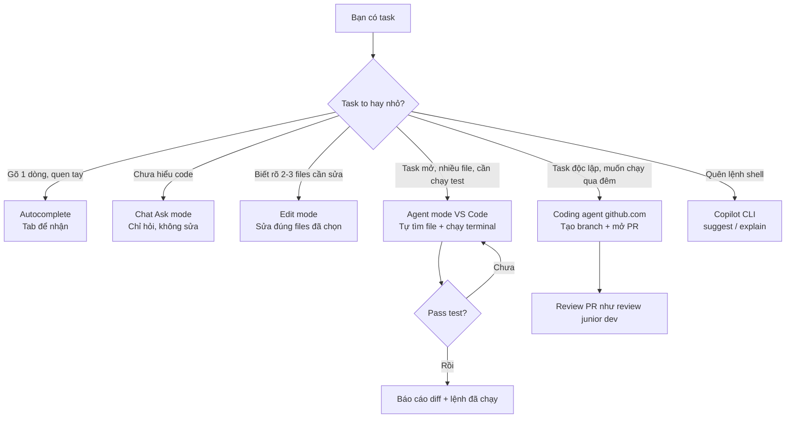
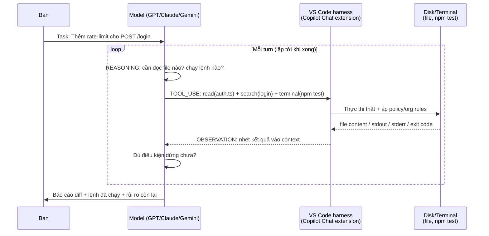
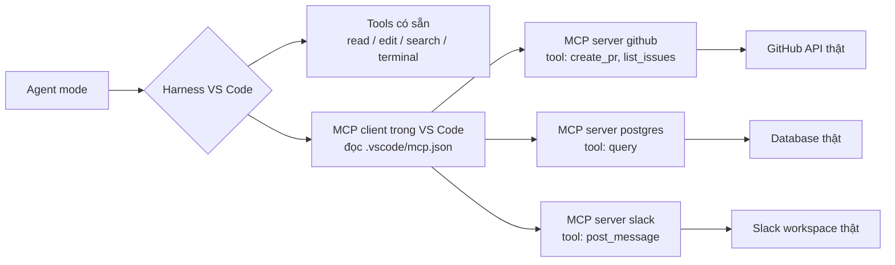

# 00 — Tổng Quan Copilot: Từ Autocomplete Tới Agent

> **Dành cho:** người mới dùng GitHub Copilot, và dev đã quen gõ autocomplete nhưng chưa thử agent.
> **Vấn đề:** một tài khoản có nhiều cách làm việc khác nhau — cái nào dùng khi nào, vòng lặp agent chạy ra sao, tốn bao nhiêu AI Credits.
> **Đọc xong:** phân biệt được 5 chế độ, giải thích được vòng lặp agent cho đồng nghiệp trong 2 phút, ước lượng được AI Credits, và làm xong task đầu tiên.
> **Thời gian:** ~25 phút.

## Mục lục

1. [Copilot là gì? 5 chế độ một tài khoản](#1-copilot-là-gì-5-chế-độ-một-tài-khoản)
2. [Agentic loop của Copilot deep-dive](#2-agentic-loop-của-copilot-deep-dive-why-không-chỉ-what)
3. [4 họ tool Copilot](#3-4-họ-tool-copilot)
4. [Token economics — premium requests đi đâu?](#4-token-economics--premium-requests-đi-đâu)
5. [Copilot làm được gì (thực tế)](#5-copilot-làm-được-gì-thực-tế)
6. [Các bề mặt sử dụng — chọn cái nào?](#6-các-bề-mặt-sử-dụng--chọn-cái-nào)
7. [Bản đồ extension](#7-bản-đồ-extension-instructions--prompts--agents--skills--mcp--extensions)
8. [Walkthrough 5 bước cho người mới](#8-walkthrough-5-bước-cho-người-mới-từ-0-tới-task-đầu-tiên)
9. [Hiểu nhầm thường gặp + Pitfalls + cách fix](#9-hiểu-nhầm-thường-gặp--pitfalls--cách-fix)
10. [Bài tập thực hành](#10-bài-tập-thực-hành)
11. [Đi tiếp tới đâu?](#11-đi-tiếp-tới-đâu-link-chéo)

---

## 1. Copilot là gì? 5 chế độ một tài khoản

Section này trả lời: mở một tài khoản Copilot ra được những cách làm việc nào, và phân biệt chúng bằng ví dụ thật.

**GitHub Copilot** là AI pair programmer của GitHub. Năm 2026 nó chạy nhiều model (GPT, Claude, Gemini...), và bạn đổi model ngay trong Chat. Một subscription mở cho bạn những chế độ sau:

| Chế độ | Bạn gõ | Nó làm | Ví dụ |
|---|---|---|---|
| **Autocomplete (ghost text)** | Gõ code bình thường | Đoán dòng/block tiếp theo, bấm Tab nhận | Gõ `def fetch_user(` → gợi cả hàm |
| **Chat (Ask mode)** | Hỏi trong Chat panel | Trả lời text + snippet, không sửa file | "Giải thích hàm này" |
| **Edit mode** | Prompt + chọn files | Sửa trực tiếp files bạn đã chọn | "Thêm null check ở 3 chỗ này" |
| **Agent mode** | Giao task mở | Tự đọc/sửa/chạy terminal, lặp tới khi xong | "Thêm rate-limit cho POST /login" |
| **Coding agent (github.com)** | Assign issue cho `copilot` | Tạo branch, code, mở PR trên cloud | Assign issue #123 → có PR sau 10 phút |
| **Copilot CLI** | `gh copilot suggest` trong terminal | Gợi ý/explain lệnh shell, chạy task terminal | `gh copilot suggest "xóa branch đã merge"` |

> Tư duy đúng: autocomplete đoán **dòng tiếp theo** trong file bạn mở.
> Agent giải **task đóng**: tự tìm file, lập plan, sửa, chạy test, lặp lại.
>
> Bảng trên liệt kê 6 dòng vì có thêm **Copilot CLI** — đó là công cụ chạy trong terminal, dùng riêng lẻ, không nằm trong 5 chế độ trên.

### 1.0. Hiểu nôm na từng chế độ (định nghĩa + ví dụ đời thường + ví dụ kỹ thuật)

> Quy tắc của toàn bộ series: mỗi khái niệm mới đều có 3 lớp: **định nghĩa 1 câu**,
> **ví dụ đời thường**, **ví dụ kỹ thuật**. Nếu bạn thấy thuật ngữ lạ mà không có
> 3 lớp này, đó là chỗ cần báo lại cho editor.

- **Autocomplete (ghost text).**
  Là gì: Copilot đoán dòng code tiếp theo dựa trên file bạn đang gõ.
  Hiểu nôm na: như gợi ý từ trên bàn phím điện thoại, nhưng cho code.
  Ví dụ kỹ thuật: bạn gõ `def fetch_user(user_id:` thì nó gợi cả thân hàm
  `try: return db.query(...) except ...`. Bấm `Tab` để nhận, `Esc` để bỏ.

- **Chat — Ask mode.**
  Là gì: bạn hỏi, Copilot trả lời bằng chữ + snippet, không đụng vào file.
  Hiểu nôm na: như hỏi thầy giáo "đoạn này nghĩa là gì", thầy chỉ giảng, không cầm tay bạn sửa.
  Ví dụ kỹ thuật: bôi đen hàm `login()` rồi hỏi "Giải thích hàm này, mỗi nhánh if làm gì?".

- **Edit mode.**
  Là gì: bạn chỉ rõ 2–3 files, Copilot sửa trực tiếp trong đó.
  Hiểu nôm na: như đưa thợ 3 viên gạch cụ thể và nói "trát lại 3 viên này".
  Ví dụ kỹ thuật: chọn `login.ts` + `auth.ts` rồi ra lệnh "Thêm null check cho `customerId`".

- **Agent mode.**
  Là gì: bạn giao task mở, Copilot tự tìm file, sửa, chạy terminal, lặp lại.
  Hiểu nôm na: như giao chìa khóa nhà cho thợ sửa: tự tìm phòng hỏng, mua vật liệu, sửa, nghiệm thu.
  Ví dụ kỹ thuật: "Thêm rate-limit cho POST /login, chạy `npm test` để chứng minh".

- **Coding agent (trên github.com).**
  Là gì: bạn assign issue cho bot `copilot`, nó code trên máy cloud rồi mở PR.
  Hiểu nôm na: như thuê đội thi công qua đêm: sáng dậy bạn chỉ cần nghiệm thu PR.
  Ví dụ kỹ thuật: assign issue #123 "Fix crash POST /orders" → 10 phút sau có PR `copilot/fix-123`.

- **Copilot CLI.**
  Là gì: trợ lý lệnh shell trong terminal (`gh copilot suggest/explain`).
  Hiểu nôm na: như từ điển lệnh Linux biết nói tiếng Việt.
  Ví dụ kỹ thuật: `gh copilot suggest "xóa branch đã merge"` → nó sinh `git branch --merged | grep -v main | xargs git branch -d`.

Chọn chế độ nào? Sơ đồ dưới đây trả lời đúng 1 câu: task nhỏ tới lớn thì đi theo nhánh nào.



Prompt viết tệ thì kết quả tệ. Hai dòng dưới đây là cách phân biệt nhanh nhất giữa hỏi chuyện và giao việc:

```text
# TE — hoi nhu chatbot (Ask mode, khong context):
"loi TypeError: Cannot read properties of undefined nghia la gi?"

# TOT — giao task nhu agent (Agent mode, co scope + verify):
"Trong apps/api, endpoint POST /orders crash khi payload thieu customerId.
Tim root cause, fix, them regression test, chay npm test -- --filter api.
Dung sua gi ngoai scope nay."
```

### 1.1. Vì sao 2026 khác 2023? (why)

Hiểu mốc thời gian giúp bạn không áp dụng tư duy 3 năm trước vào công cụ của hôm nay.

- 2023: Copilot = autocomplete + chat đơn giản.
- 2024–2025: thêm Edit mode, agent mode trong VS Code, coding agent trên github.com.
- 2026: multi-model picker (bạn đổi model ngay trong Chat), Agent Skills
  (`.github/skills/*/SKILL.md`), `AGENTS.md` support, MCP tools trong agent mode,
  custom agents (`.github/agents/*.agent.md`), prompt files (`.github/prompts/*.prompt.md`).

Hệ quả: cùng 1 prompt, model khác + mode khác = kết quả khác hẳn.
Bài này dạy bạn chọn đúng mode trước khi tối ưu prompt.

---

## 2. Agentic loop của Copilot deep-dive (why, không chỉ what)

Section này trả lời: bên trong Agent mode thực sự xảy ra gì giữa bạn và model, để bạn biết chỗ nào can thiệp được.

### 2.1. Giải phẫu 1 vòng lặp (Agent mode trong VS Code)

Mỗi vòng lặp gồm 4 pha — giống mọi agent, chỉ khác harness là VS Code:

```text
1. REASONING (model nghi):
   "Can doc file nao? Len terminal nao xac nhan gia thiet?"
2. TOOL_USE (model goi 1..n tools song song):
   read(auth.ts) + search("customerId") + terminal(npm test)
3. OBSERVATION (VS Code harness tra ket qua ve):
   file content / stdout / stderr / exit code
4. DIEU KIEN DUNG? (model tu danh gia):
   Chua xong -> quay lai (1). Xong -> bao cao + diff.
```

Điểm mấu chốt: **model không chạm disk trực tiếp**. VS Code harness
(Copilot Chat extension) mới là thứ thực thi read/edit/search/terminal,
áp policy (org policy, content exclusion), rồi nhét kết quả vào context.

- Là gì (1 câu): harness là "tay chân" của model — model chỉ ra lệnh bằng chữ, harness mới làm thật.
- Hiểu nôm na: model như kiến trúc sư vẽ bản vẽ, harness như đội thợ cầm búa, máy khoan.
- Ví dụ kỹ thuật: model sinh `read(auth.ts)` → harness mở file thật, đọc 200 dòng, trả lại text cho model.

Sơ đồ chuỗi dưới đây cho thấy 2 luồng giao tiếp: bạn ↔ model, và model ↔ harness ↔ disk.



> **Kỳ vọng / Verify:** sau khi đọc sơ đồ này, bạn phải kể lại được cho đồng nghiệp
> trong 2 phút: "model không chạm disk, harness mới chạm". Test nhanh: mở Agent mode,
> giao task nhỏ, quan sát panel hiện từng tool call `read → edit → terminal` đúng thứ tự trên.

Vì sao phải tách model và harness thành 2 thứ?

- Policy enforce được **kể cả khi model muốn lách** (model chỉ sinh tool calls).
- Cùng 1 model hành xử nhất quán trên VS Code/JetBrains/Neovim (chỉ đổi harness).
- Gắn determinism (instructions, policy, MCP allowlist) vào vòng xác suất (LLM).

### 2.2. Ví dụ trace 1 task thật

Đọc trace dưới đây để hình dung 1 task chạy thực tế mất bao nhiêu turn.

Task: *"Thêm rate-limit cho POST /login"* (Agent mode, VS Code):

```text
Turn 1: reasoning "tim code login" -> search files *login* + grep "POST.*login"
Turn 2: observation tra 3 files -> reasoning "doc route + middleware" -> read 2 files
Turn 3: reasoning "chua co limiter, check lib" -> read package.json + grep "rate-limit"
Turn 4: reasoning "dung express-rate-limit, trinh plan" -> hien plan cho ban duyet
Turn 5: (duyet xong) edit route.ts + edit route.test.ts
Turn 6: terminal(npm test) -> FAIL (import sai) -> reasoning doc loi -> edit fix
Turn 7: terminal(npm test) -> PASS -> bao cao diff + lenh da chay
```

Tổng 7 turns, bạn chỉ gõ 1 prompt + 1 lần duyệt.

### 2.3. Khi nào loop thất bại? (3 nguyên nhân gốc)

Bảng này trả lời: agent đang sai thì thật ra là khuyết ở khâu nào, và học bài nào để fix.

| Nguyên nhân | Dấu hiệu | Fix ở bài nào |
|---|---|---|
| Thiếu context (không tìm ra file đúng) | Đọc lung tung, sửa sai chỗ | Instructions + prompt files (bài 03, 05) |
| Thiếu verification (tự tin sai) | Báo "xong" nhưng test fail | Bắt verify bằng terminal mỗi task |
| Loop quá dài (context đầy rác) | Càng sửa càng nát sau turn 15+ | New chat, chia nhỏ task, custom agent hẹp |

> Quy tắc vàng: task >15 turns không tiến triển → dừng, mở chat mới
> (`Ctrl+Shift+P > New Chat`), chia nhỏ task, giao lại. Đừng argue với agent.

### 2.4. Agentic loop vs autocomplete

Hai khái niệm này hay bị nhầm sang nhau vì cùng hiện trong chung một IDE. Khác nhau ở chỗ ai quyết định bước tiếp theo:

```text
Autocomplete = goi y dong tiep theo (re, khong tinh AI credits tren plan tra phi).
Agent mode   = tu quyet dinh buoc tiep theo (linh hoat, tien AI credits theo model x tokens).
```

Kinh nghiệm: việc gõ code quen tay → để autocomplete. Việc lặp >3 lần
(deploy checklist, review format) → đóng thành prompt file (bài 05).

---

## 3. 4 họ tool Copilot

Section này trả lời: khi Agent mode "nghĩ", nó thực sự được cầm những thứ gì trong tay.

Agent mode trong VS Code 2026 có 4 họ tool. Học thuộc để biết khi nào cái gì chạy:

### 3.1. Họ 1 — Đọc & tìm kiếm (local, nhanh, rẻ)

| Tool (hiển thị trong UI) | Việc | Ví dụ |
|---|---|---|
| `read / #file` | Đọc file vào context | `#file:src/routes/login.ts` |
| `search / #searchResults` | Tìm nội dung cross-file | `customerId trong apps/api` |
| `list / #folder` | Liệt kê cây thư mục | Hiểu layout repo |
| `#selection`, `#editor` | Lấy vùng chọn / file đang mở | Gắn đúng scope |

Cơ chế sâu: luôn **tìm file trước (search), đọc sau (read)** để đỡ ngốn context.
File >300 dòng → bảo agent đọc từng phần, đừng dump cả cục.

Prompt dưới đây là cách ép agent tiết kiệm context ngay từ câu đầu:

```text
# Prompt mau tiet kiem context (copy-paste):
"Dung search tim moi file ten *login* trong apps/ truoc,
roi chi doc 2 file lien quan nhat. Giai thich vi sao chon 2 file do."
```

### 3.2. Họ 2 — Sửa code (edit/create)

| Tool | Việc | Guardrail |
|---|---|---|
| `edit` (apply in editor) | Sửa string trong file, hiện diff để bạn duyệt | Review diff trước khi Accept |
| `create` (new file) | Tạo file mới | Check path đúng folder |
| `terminal` (run command) | Chạy shell: `npm test`, `git diff`, `docker` | Policy + confirm trước khi chạy |

> Sai lầm phổ biến: Accept all không đọc diff. Đúng: duyệt từng hunk,
> chạy test rồi mới accept file tiếp theo.

### 3.3. Họ 3 — Suy luận mở rộng (context multipliers)

| Tool | Việc | Khi dùng |
|---|---|---|
| `@workspace` | Hỏi toàn repo (index codebase) | "Hàm này dùng ở đâu?" |
| `@terminal` | Hỏi về output terminal | Giải thích lỗi vừa chạy |
| `@vscode` | Hỏi về API/settings VS Code | Viết extension, config |
| `#fetch` | Đọc URL/docs ngoài | Tra docs mới nhất |
| `Todo-ish prompt` | Checklist trong prompt | Task >3 bước để khỏi quên |

Ví dụ kết hợp `@workspace` + `@terminal` trong 1 prompt:

```text
# Vi du @workspace + @terminal (copy-paste):
"@workspace tim moi noi goi POST /orders, liet ke file + dong.
Sau do chay npm test va dung @terminal giai thich 3 loi dau."
```

### 3.4. Họ 4 — MCP tools (động, từ server ngoài)

Tên dạng `mcp__<server>__<tool>`, ví dụ `mcp__github__create_pr`.
Cài trong VS Code `mcp.json`, bật tool nào thì agent thấy tool đó.
Càng nhiều tools visible → model càng dễ chọn nhầm → giữ 3–6 servers.

```json
// .vscode/mcp.json — mau toi thieu (copy-paste, sua lai path)
{
  "servers": {
    "github": { "command": "npx", "args": ["-y", "@modelcontextprotocol/server-github"] }
  }
}
```

---

## 4. Token economics — premium requests đi đâu?

Section này trả lời: tiền của bạn đi theo đường nào, và làm sao ước lượng được 1 task tốn bao nhiêu.

### 4.1. Vì sao phải quan tâm?

Từ 01/06/2026, GitHub Copilot chuyển sang tính tiền theo mô hình **AI Credits** (usage-based billing). Hiểu 4 quy tắc này là đủ để tự ước lượng chi phí:

- **1 AI Credit = 0,01 USD.**
- Chi phí 1 lượt = giá per-token của model × số token, quy đổi ra credits.
- **Code completion và next edit suggestions KHÔNG trừ AI Credits** — không giới hạn trên mọi plan trả phí.
- Dùng auto model selection (Copilot Chat, CLI, app, cloud agent) trên plan trả phí được **giảm 10%**.
- Mỗi turn agent mode = 1+ lượt gọi model. Model mạnh → token nhiều → credits nhanh cháy.
- Plan **Free**: chỉ auto model selection, inline suggestions giới hạn 2.000 completions/tháng, mức credits hàng tháng cần verify.

Mỗi turn agent mode = 1+ requests tùy model (model mạnh như Claude/GPT-5-class
tốn nhiều credits hơn). Task 20 turns × instructions dài = cháy credits tháng.

| Gói (giá 10/2026 — luôn check lại) | Credits kèm theo | Ai hợp |
|---|---|---|
| Pro — 10 USD/tháng | 1.500 credits (1.000 base + 500 flex) | Cá nhân |
| Pro+ — 39 USD/tháng | 7.000 credits (3.900 base + 3.100 flex) | Cá nhân code nặng |
| Max — 100 USD/tháng | 20.000 credits (10.000 base + 10.000 flex) | Cá nhân dùng agent cả ngày |
| Business — 19 USD/seat/tháng | 1.900 credits/seat/tháng, dùng chung cả org | Team cần quản trị |
| Enterprise — 39 USD/seat/tháng | 3.900 credits/seat/tháng, dùng chung | Corp, compliance |

> Con số quota đổi theo thời gian — luôn check `github.com/settings/copilot`
> làm chuẩn cuối, đừng tin số trong tutorial này.

### 4.2. Bảng chi phí context của từng thứ

Bảng này trả lời: thứ nào trong repo của bạn bị nạp lại mỗi turn (tức là trả tiền lặp đi lặp lại).

| Feature | Load khi nào | Chi phí | Chiến lược |
|---|---|---|---|
| `muse-instructions.md` | Đầu chat, giữ suốt mọi turn | **Cao — trả tiền mỗi turn** | <200 dòng, chỉ pitfalls + conventions khác default |
| Prompt files | Khi gọi `/ten` hoặc agent tự load | **Thấp tới khi dùng** | Tách checklist dài thành file riêng |
| MCP servers | Lazy khi tool được gọi | Thấp, nhưng >10 tools giảm accuracy | 3–6 servers, prune định kỳ |
| Custom agents | Khi chọn agent trong picker | Trung bình (system prompt riêng) | Agent hẹp cho việc hẹp |
| Image attach | Khi paste ảnh | Cao | Chỉ attach ảnh cần thiết |

> Hệ quả: instructions phình = trả tiền mọi turn. Prompt file để không = rẻ.
> Agent mode chạy 20 turns không gate = đắt. Rule quan trọng → nâng thành
> instructions đầu file (front-load).

### 4.3. Ví dụ tính nhẩm (copy-paste được)

Dán block dưới đây, đổi số cho khớp repo bạn. Mục tiêu: thấy được chênh lệch giữa instructions gọn và instructions phình.

```text
Gia dinh (lam tron de nham nhanh; 1 AI credit = 0,01 USD):
- muse-instructions.md 150 dong ~ 2.500 tokens.
- 1 task 10 turns -> instructions ton 10 x 2.500 = 25.000 tokens input.
- Neu instructions phinh 600 dong (~10.000 tokens) -> 10 x 10.000 = 100.000 tokens.
- Chenh lech 75.000 tokens/task x 20 tasks/tuan = 1,5M tokens/tuan vut qua cua so.
- Instructions duoc nạp lai MOI turn, nen phinh = tra lai lien tuc, khong phai tra 1 lan.

Ket luan: 1 gio don instructions (bai 03) tiet kiem nhieu hon 1 tuan toi uu prompt.
Kiem chung: xem Copilot usage dashboard o github.com/settings/copilot.
```

### 4.4. Checklist tiết kiệm quota (dán vào team wiki)

Đánh dấu từng dòng sau mỗi sprint — dòng nào còn sót là chỗ đang rò rỉ credits.

- [ ] `muse-instructions.md` <200 dòng (`wc -l .github/muse-instructions.md`).
- [ ] Checklist dài → prompt file `.github/prompts/*.prompt.md`, không nhét instructions.
- [ ] MCP ≤6 servers.
- [ ] Task mới → chat mới (đừng nối task mới vào history cũ).
- [ ] Model rẻ cho task rẻ (Haiku/GPT-mini cho giải thích, model mạnh cho agent).
- [ ] Mọi task code phải có lệnh verify chạy thật (test/lint/build).

---

## 5. Copilot làm được gì (thực tế)

Section này trả lời: sau khi đọc hết lý thuyết, việc nào giao được cho Copilot ngay hôm nay.

- **Build feature / fix bug đa file** (Agent mode): mô tả ý định, nó tìm file, sửa, chạy test.
- **Việc nhàm chán**: viết test thiếu, fix lint, resolve conflict, upgrade dep, viết release notes.
- **Git/GitHub**: commit message, tạo branch, mở PR, đọc PR comments, coding agent tự làm PR.
- **Kết nối ngoài qua MCP**: query DB, post Slack, điều khiển browser.
- **Terminal**: `gh copilot suggest/explain` gợi ý lệnh shell khó nhớ.

### 5.1. 3 ví dụ end-to-end (copy-paste prompt mẫu)

Mỗi ví dụ dưới đây đã kèm scope + lệnh verify — dán vào là chạy được.

```text
# Vi du 1 — Fix bug da file, Agent mode (10 phut):
"Trong packages/auth, test `npm test -- --filter auth` dang fail 2 cases.
Tim root cause, fix source (khong sua test de cho pass ao), chay lai focused test,
roi bao cao: file nao doi, vi sao, con rui ro gi."
```

```text
# Vi du 2 — Viec nham chan, Edit mode (viet test thieu):
"Trong apps/api/src/routes/, file nao chua co test tuong ung thi viet test moi
theo mau cua login.test.ts. Chay test sau moi file.
Dung lai bao cao sau 5 files dau de tao review truoc khi lam tiep."
```

```bash
# Vi du 3 — Terminal (gh copilot CLI):
gh copilot suggest "xoa cac git branch local da merge vao main"
gh copilot explain "docker run -p 5432:5432 -e POSTGRES_PASSWORD=secret postgres:16"
```

---

## 6. Các bề mặt sử dụng — chọn cái nào?

Section này trả lời: mở Copilot ở đâu cho đúng việc — và vì sao hành vi agent gần như giống nhau ở mọi nơi.

| Surface | Code chạy ở đâu | Dùng repo config? | Khi nào dùng |
|---|---|---|---|
| **VS Code** (mạnh nhất) | Máy bạn | Có (`.github/`, `.vscode/`) | Mặc định, agent mode full tools |
| **Visual Studio** | Máy bạn | Có | Dev .NET/C++ trên Windows |
| **JetBrains** | Máy bạn | Có | IntelliJ/PyCharm/WebStorm |
| **Neovim** | Máy bạn | Có | Fan terminal, `:Copilot status` |
| **github.com chat + coding agent** | GitHub cloud | Chỉ repo | Giao issue → branch → PR, không cần setup local |
| **Copilot CLI** (`gh copilot`) | Terminal bạn | Không | Gợi ý lệnh shell, explain, task terminal |
| **github.dev / Mobile** | Browser/điện thoại | Chỉ repo | Review nhanh, check PR ngoài giờ |

> Hành vi agent **giống nhau mọi nơi** — chỉ khác nơi code chạy và config nào dùng.
> Chi tiết từng surface + bảng so sánh full: xem bài 02.

---

## 7. Bản đồ extension: instructions / prompts / agents / skills / MCP / extensions

Section này trả lời: 6 khái niệm "mở rộng" trông na ná nhau thì phân biệt bằng cách nào, và cái nào chọn khi nào.

> **MCP server là gì?** Định nghĩa 1 câu: MCP server là chương trình nhỏ đứng ngoài
> repo, phơi ra các "tools" (hàm có input/output schema) để agent gọi khi cần dữ liệu ngoài.
> Hiểu nôm na: như ki-ốt dịch vụ trong siêu thị — siêu thị (VS Code) có sẵn quầy thịt/rau
> (read/edit/terminal), ki-ốt (MCP server GitHub, Postgres, Slack) cho thuê thêm dịch vụ.
> Ví dụ kỹ thuật: MCP server `github` phơi tool `create_pr(input: {title, body, base})`;
> agent muốn mở PR thì gọi `mcp__github__create_pr`, server chạy GitHub API thật rồi trả kết quả về.

Sơ đồ dưới đây cho thấy MCP không nằm trong VS Code — nó chạy ngoài, VS Code chỉ là khách gọi.



> **Kỳ vọng / Verify:** sau khi cài mẫu `mcp.json` ở mục 3.4, mở Chat gõ `/mcp`
> phải thấy server `github` hiện `connected`. Nếu thấy `disconnected`, check `command: npx`
> có chạy được không.

| Thuật ngữ | Là gì (hiểu nôm na) | Ví dụ cụ thể | Khi nào dùng |
|---|---|---|---|
| **muse-instructions.md** | Giấy dặn dò dán đầu tủ lạnh, agent đọc mỗi lần vào bếp | "Dùng pnpm, không dùng npm. Test: `npm test -- --filter api`." | Quy ước cần mọi chat đều nhớ |
| **\*.instructions.md** | Giấy dặn riêng cho từng phòng, chỉ đọc khi vào phòng đó | `applyTo: apps/api/**` → "Route không query DB trực tiếp" | Quy tắc chỉ đúng 1 subtree |
| **Prompt files** | Công thức nấu ăn in sẵn, cần thì lôi ra làm theo | Gõ `/deploy` chạy checklist 15 bước deploy | Việc lặp lại >3 lần |
| **Custom agents** | Thuê thợ chuyên việc: thợ điện chỉ sửa điện | Agent `reviewer` chỉ đọc + comment, cấm sửa code | Task chuyên biệt, hẹp scope |
| **Agent Skills** | Sổ tay nghề chuẩn mở, agent nào cũng đọc được | `SKILL.md` của skill `deploy-prod` | Knowledge agent tự load khi cần |
| **MCP** | Ki-ốt dịch vụ ngoài siêu thị (DB, Slack, GitHub) | `mcp__github__create_pr` mở PR thật | Cần dữ liệu ngoài repo |
| **Extensions** | Combo đóng gói sẵn (prompts + agents + MCP) để share | Extension `security-review` cho cả team | Share cho team / nhiều repo |

Quy tắc chọn nhanh:

- Fact cần **mọi chat** → `muse-instructions.md` (bài 03).
- Quy tắc cho **1 subtree** → `*.instructions.md` có `applyTo` (bài 03).
- Workflow **tái dùng, gọi khi cần** → prompt files (bài 05).
- Persona **chuyên biệt** → custom agents (bài 06 trong README).
- Hệ thống ngoài → MCP (bài 08 trong README).

---

## 8. Walkthrough 5 bước cho người mới (từ 0 tới task đầu tiên)

Section này trả lời: 30 phút đầu tiên nên làm gì theo đúng thứ tự, để có 1 task pass thật.

> Yêu cầu: đã cài xong (nếu chưa, xem bài 01). Dưới đây là 30 phút đầu chuẩn.

**Bước 1 — Mở Chat trong repo thật (2 phút):**

```bash
# Mo VS Code tai repo cua ban, roi:
# Ctrl+Shift+P > "Chat: New Chat" (hoac Ctrl+Alt+I mo Copilot Chat panel)
# Chon model + mode (khuyen nghi: Agent mode cho task dau tien)
code /path/to/repo-cua-ban
```

**Bước 2 — Viết instructions nháp (5 phút):**

Mục tiêu bước này không phải là "hỏi cho vui" — mà là kiểm tra Copilot đọc đúng repo trước khi bạn tin nó.

```text
Trong Chat go:
"Doc README + package.json, tom tat: project nay la gi,
chay dev bang lenh nao, test bang lenh nao. Khong sua gi, chi tra loi."
# Muc dich: kiem tra Copilot doc dung repo.
# Sau do luu ket qua vao .github/muse-instructions.md (chi tiet bai 03).
```

**Bước 3 — Giao task nhỏ đầu tiên (10 phút):**

Đây là mẫu instructions tối thiểu. Đừng copy wiki 500 dòng vào đây.

```markdown
<!-- .github/muse-instructions.md — mau toi thieu (copy-paste, sua lai) -->
# Project: Acme API — Node 20 + Express + Postgres

## Commands (VERIFIED 2026-10)
- Dev: `npm run dev` (can `.env` tu 1Password "Acme dev")
- Test: `npm test -- --filter api`
- Lint: `npm run lint`

## Rules
- ALWAYS chay focused test sau khi sua.
- NEVER commit truc tiep main.
```

**Bước 4 — Task sửa thật có verify (10 phút):**

Task này có sẵn lệnh verify, nên bạn không cần tin lời "xong" của agent.

```text
"Chay linter cua repo, fix 3 loi dau tien, chay lai lint de xac nhan.
Chi sua files lien quan, khong dung config."
# Quan sat: no doc file -> sua -> chay lenh -> doc output -> sua tiep.
```

**Bước 5 — Đóng session sạch (3 phút):**

```bash
# Xem usage tai: github.com/settings/copilot (so AI credits da dung)
# Mo chat moi cho task moi: Ctrl+Shift+P > "Chat: New Chat"
# Khong noi task moi vao history cu (do ton credits + nhieu).
```

Checklist bạn đã hiểu bài 00 khi:

- [ ] Phân biệt được 5 chế độ + kể ví dụ mỗi chế độ.
- [ ] Giải thích được agentic loop cho đồng nghiệp trong 2 phút.
- [ ] Kể được 4 họ tools + ví dụ mỗi họ.
- [ ] Biết vì sao instructions phình gây tốn credits.
- [ ] Chạy xong 5 bước walkthrough và có 1 task pass thật.

---

## 9. Hiểu nhầm thường gặp + Pitfalls + cách fix

Section này trả lời: tại sao Copilot làm sai thường là do mình setup, không phải do nó "dở".

### 9.1. Hiểu nhầm thường gặp (đọc kỹ trước khi trách Copilot)

| Hiểu nhầm | Sự thật | Ví dụ |
|---|---|---|
| "Copilot là 1 con chatbot, hỏi gì đáp nấy" | Copilot có 5 chế độ, mỗi chế độ là 1 cách làm việc khác nhau | Hỏi ở Ask mode thì chỉ có chữ; muốn sửa file phải sang Edit/Agent |
| "Agent tự nghĩ tự làm, không cần kiểm tra" | Agent là junior dev nhanh nhưng ẩu, bạn là reviewer bắt buộc | Luôn duyệt diff từng hunk + bắt chạy test thật |
| "MCP là plugin cài vào là xong" | MCP server là tiến trình riêng chạy ngoài VS Code, có thể rớt mạng, sai key | Phải `/mcp` kiểm tra `connected`, test tool thật |
| "Instructions càng dài càng khôn" | Instructions nạp lại mỗi turn, dài = tốn credits + loãng trọng tâm | Giữ <200 dòng, checklist dài tách sang prompt file |
| "Model mạnh nhất luôn tốt nhất" | Model mạnh đắt (token giá cao), task dễ dùng model rẻ là đủ | Giải thích code → model rẻ; refactor khó → model mạnh |

### 9.2. Pitfalls + cách fix

Bảng này là bản "chẩn đoán nhanh": gặp triệu chứng ở cột 1 thì đọc sang cột 3.

| Pitfall | Vì sao xảy ra | Fix |
|---|---|---|
| Prompt như chatbot, agent làm sai scope | Không cho tiêu chí xong + ranh giới | Prompt luôn có: mục tiêu + files scope + lệnh verify + "đừng đụng X" |
| Giao task 50 bước 1 lúc, càng về sau càng nát | Context đầy, model quên đầu bài | Chia phase, mỗi phase 1 gate review |
| muse-instructions.md 500 dòng copy wiki | Nghĩ "càng nhiều càng tốt" | Cắt <200 dòng, checklist dài → prompt file |
| Agent mode chạy 20 turns không gate | Không duyệt plan giữa chừng | Bắt trình plan trước khi edit, review diff từng hunk |
| MCP cài 15 servers "cho chắc" | Nghĩ thừa còn hơn thiếu | Giữ 3–6, prune cái 2 tuần không gọi |
| Tin agent báo "xong" mà không verify | Thiếu gate | Mọi task code phải có lệnh verify chạy thật |
| Dùng model mạnh nhất cho mọi task | Mặc định không đổi model | Task rẻ (giải thích) → model rẻ; task khó → model mạnh |
| Nối 5 tasks vào 1 chat dài | Lười mở chat mới | Chat mới mỗi task, instructions giữ context chung |

---

## 10. Bài tập thực hành

Section này trả lời: làm 4 bài dưới đây để biến phần lý thuyết thành phản xạ.

**Bài 1 (15 phút) — Trace agentic loop:**
Giao 1 task nhỏ ở Agent mode, sau khi xong hỏi: *"liệt kê từng turn mày đã làm:
nghĩ gì, gọi tool gì, thấy gì"*. So sánh với sơ đồ mục 2.1. Ghi số turns + tool calls.

**Bài 2 (15 phút) — Đo token economics:**
Mở `github.com/settings/copilot` xem usage trước/sau 1 task dài. Tìm xem model nào
ngốn AI Credits nhất. Đề xuất 1 thay đổi (cắt instructions / đổi model rẻ).

**Bài 3 (20 phút) — Phân loại extension:**
Lấy 5 nhu cầu thật của team bạn, điền bảng: mỗi nhu cầu thuộc instructions /
prompt file / custom agent / MCP / extension? Giải thích 1 câu mỗi ô.

**Bài 4 (20 phút) — Walkthrough chuẩn:**
Làm đủ 5 bước mục 8 trên 1 repo thật. Lưu chat lại (copy ra file).
Liệt kê 3 điều bạn hiểu sai trước khi đọc bài này.

---

## 11. Đi tiếp tới đâu? (link chéo)

Section này trả lời: bài nào đọc tiếp theo nhu cầu của bạn ngay lúc này.

- **Bài 01 — Cài đặt + xác thực + plans**: nếu bạn chưa cài được hoặc chưa rõ trial/quota.
- **Bài 02 — Từng surface dùng sao cho đúng**: VS Code vs JetBrains vs github.com vs CLI.
- **Bài 03 — Instructions + memory + rules**: file quan trọng nhất, quyết định 50% chất lượng.
- **Bài 04 — Chat commands toàn tập**: tra cứu `/`, `@`, `#` và công thức 5 lệnh đầu.
- **Bài 05 — Prompt files & custom instructions**: đóng gói việc lặp lại thành `/deploy`.
- **Bài 08 (README) — MCP**: nối GitHub/DB/browser vào agent.
- **Bài 10 (README) — Policies & BYOK**: quota, model gating, content exclusion.
- **Bài 11 (README) — Coding agent & GitHub flow**: giao issue cho agent trên cloud.
