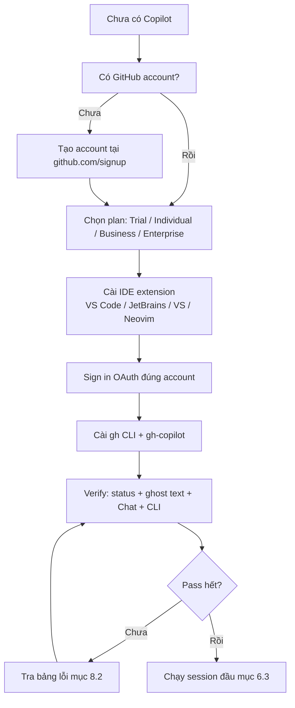

# 01 — Cài Đặt, Xác Thực & Kiểm Tra Sức Khỏe Copilot

> **Dành cho:** người mới bắt đầu dùng GitHub Copilot, hoặc đã cài nhưng chưa xác thực/hoạt động được.
> **Vấn đề:** chọn sai plan, cài nhầm bề mặt, login sai tài khoản → Copilot báo lỗi hoặc không gợi ý code.
> **Đọc xong:** chọn đúng plan, cài được Copilot trên VS Code / JetBrains / Visual Studio / Neovim, cài Copilot CLI, login thành công và fix được 90% lỗi setup.
> **Thời gian:** ~30 phút đọc + 15 phút làm theo. *(Bài 01 của series)*

## Mục lục

1. [Vì sao Copilot 2026 khác trước? (why)](#1-vì-sao-copilot-2026-khác-trước-why)
2. [Plans + trial: chọn gói nào?](#2-plans--trial-chọn-gói-nào)
3. [VS Code setup (mạnh nhất)](#3-vs-code-setup-mạnh-nhất)
4. [JetBrains / Visual Studio / Neovim](#4-jetbrains--visual-studio--neovim)
5. [Copilot CLI (`gh copilot`)](#5-copilot-cli-gh-copilot)
6. [Login, verify, session đầu tiên](#6-login-verify-session-đầu-tiên-walkthrough)
7. [Duplicate install + update](#7-duplicate-install--update)
8. [Checklist + pitfalls + bài tập](#8-checklist-pitfalls-bài-tập)
9. [Link chéo](#9-link-chéo)

---

## 1. Vì sao Copilot 2026 khác trước? (why)

- **Là gì (1 câu):** Copilot 2026 là hệ multi-model + multi-surface, không còn là 1 extension gợi ý code.
- **Nôm na:** ngày xưa là xe số 1 tốc độ; nay là xe tay ga có 3 chế độ lái (GPT/Claude/Gemini) + chạy được cả đường phố (IDE) lẫn cao tốc (cloud).
- **Ví dụ kỹ thuật:** cùng prompt "thêm rate-limit", chọn GPT-mini ra code đơn giản, chọn Claude ra code + test + giải thích trade-off.



> **Kỳ vọng / Verify:** đọc xong sơ đồ, bạn biết mình đang ở bước nào. Chạy
> `gh auth status` phải thấy `Logged in to github.com as <tên-bạn>`. Sai tên là sai account.

Trước 2024: Copilot = extension autocomplete + chat đơn giản, 1 model duy nhất.

Từ 2025–2026:

- **Multi-model picker**: cùng 1 Chat panel, bạn đổi giữa GPT / Claude / Gemini.
  Model mạnh tốn AI Credits nhiều hơn (chi phí tính theo token) — chọn model = chọn giá.
- **Agent mode mặc định trong VS Code**: tự đọc/sửa/chạy terminal, không còn
  chỉ gợi ý text.
- **Coding agent trên github.com**: assign issue → cloud tự code → PR.
- **`AGENTS.md` + Agent Skills support**: 1 file instructions chạy nhiều agent.
- **Copilot CLI** (`gh extension install copilot`): mang chat xuống terminal.

> Hệ quả thực tế: cài extension thôi chưa đủ — phải hiểu plan/quota (mục 2),
> chọn đúng IDE setup (mục 3–4), và verify status bar + CLI (mục 6).

---

## 2. Plans + trial: chọn gói nào?

### 2.1. Bảng quyết định (why)

> **Plan là gì (3 lớp)?**
> - 1 câu: plan là gói trả phí quyết định bạn có bao nhiêu AI Credits (hạn mức dùng) + dùng được model nào.
> - Nôm na: như gói cước điện thoại — gói rẻ nghe gọi cơ bản, gói doanh nghiệp có thêm roaming + quản lý.
> - Ví dụ: Pro hết AI Credits giữa tháng thì agent mode báo quota; Business thì admin mua thêm seats cho team.

| Bạn là ai | Chọn | Được gì | Lưu ý |
|---|---|---|---|
| Cá nhân thử lần đầu | Trial (check github.com/copilot) | Dùng thử giới hạn | Hết trial phải chọn plan trả phí |
| Sinh viên / giáo viên | Student / Teacher | Free + credits allowance | Không thấy ưu đãi thì xác thực email trường |
| Dev cá nhân | Pro / Pro+ / Max | AI Credits cá nhân + full IDE + CLI | Credits nhiều nhất ở Max; mua thêm nếu cháy |
| Team 5–50 người | Business | Credits pooled team + org policy + usage dashboard | Admin quản lý seats, content exclusion |
| Corp / compliance | Enterprise | BYOK, audit log, policy chi tiết | Cần admin setup SSO + policy |

> **Giá tham khảo tính theo tháng (10/2026):** 1 AI credit ≈ $0.01, chi phí = giá mỗi token của model × số token.
> Free: $0 (autocomplete giới hạn 2.000 completions/tháng).
> Pro: $10 (1.500 credits) · Pro+: $39 (7.000 credits) · Max: $100 (20.000 credits).
> Business: $19/seat · Enterprise: $39/seat (credits pooled theo tổ chức).
> Hai dòng Free/Student có hạn mức credits không công bố số cụ thể (cần verify).

> **Kỳ vọng / Verify:** sau khi đăng ký, vào `https://github.com/settings/copilot`
> phải thấy dòng plan + ngày hết hạn trial. Không thấy = chưa active, đừng cài tiếp.

> Giá và quota đổi theo quý — luôn check `github.com/pricing` và
> `github.com/settings/copilot` làm chuẩn cuối, đừng tin số trong tutorial.

### 2.2. Đăng ký trial (copy-paste flow)

Dành cho người mới chưa có plan trả phí. Dán từng bước bên dưới.

```bash
# 1. Mở trình duyệt, vào trang đăng ký:
# https://github.com/copilot -> "Start free trial" (cần GitHub account + payment method)
# 2. Chọn plan phù hợp (Pro để bắt đầu).
# 3. Sau khi active, verify tại:
# https://github.com/settings/copilot
```

```bash
# Kiểm tra trial/plan bằng CLI (sau khi cài gh + copilot extension, mục 5):
gh auth login
gh copilot --help
# Kỳ vọng: hiện help, không báo "no Copilot subscription".
```

### 2.3. Ai trả tiền cho AI Credits?

Khi nào Copilot "tốn" AI Credits, khi nào gõ thoải mái. Từ 01/06/2026 GitHub chuyển sang usage-based billing (tính theo AI Credits).

- Agent mode với model mạnh (Claude / GPT-5.5+ / GPT-6-class...) tốn nhiều AI Credits hơn: chi phí = giá mỗi token của model × số token, quy đổi sang credits.
- Coding agent trên github.com cũng trừ credits (mỗi task cloud = nhiều lượt truy cập).
- Autocomplete (ghost text) + next edit suggestions **không tốn AI Credits** — từng lượt gõ được miễn phí, không giới hạn trên mọi plan trả phí.
- Plan Free: inline suggestions giới hạn 2.000 completions/tháng.
- Hết credits trong gói → chạy tiếp sẽ tính vào additional usage budget (admins cài spend cap nếu muốn giới hạn).
- Plan trả phí được giảm 10% khi dùng auto model selection (Copilot Chat, CLI, app, cloud agent).
- Admin Business/Enterprise xem usage theo user tại org settings → ai cháy credits
  nhiều nhất lộ ngay (chi tiết bài 10 trong README).

---

## 3. VS Code setup (mạnh nhất)

VS Code là bề mặt mạnh nhất 2026: agent mode full tools + MCP + custom agents
+ prompt files. Cài theo thứ tự dưới đây.

### 3.1. Step-by-step (copy-paste)

> **OAuth login là gì (3 lớp)?**
> - 1 câu: OAuth là cách VS Code nhờ GitHub xác nhận "đúng là bạn" mà không cần bạn gõ mật khẩu vào VS Code.
> - Nôm na: như dùng CCCD để lễ tân cấp thẻ thang máy — lễ tân (GitHub) xác nhận, VS Code chỉ giữ thẻ (token).
> - Ví dụ: click "Sign in" → browser mở `github.com/login/oauth` → bấm Allow → VS Code nhận token lưu local.

```bash
# 1. Cài VS Code mới nhất (>= 1.90 để có agent mode ổn định):
# Tải tại https://code.visualstudio.com/ (dùng bản Stable, không dùng Insiders trừ khi cần test).

# 2. Kiểm tra version:
code --version
# Kỳ vọng / Verify: hiện 3 dòng, ví dụ:
# 1.90.2
# commit hash...
# arm64 (hoặc x64). Nếu < 1.90 → tải bản mới, đừng cố dùng agent mode.
```

```text
3. Trong VS Code: Ctrl+Shift+X (Extensions) → tìm "GitHub Copilot" → Install.
   (Kèm theo "GitHub Copilot Chat" nếu bản của bạn tách 2 extensions — cài cả 2.)
4. Reload VS Code khi được yêu cầu.
5. Status bar góc dưới-phải phải hiện icon Copilot (chưa login thì hiện "Sign in").
6. Click icon → "Sign in to GitHub" → duyệt OAuth trong browser → Allow.
7. Quay lại VS Code, icon chuyển sang trạng thái active.
```

### 3.2. Verify VS Code (copy-paste)

```bash
# Trong VS Code, mở Command Palette (Ctrl+Shift+P) và chạy lần lượt:
# > "Copilot: Check Status"       -> kỳ vọng: Active, đúng account
# > "Chat: New Chat"              -> kỳ vọng: mở Chat panel bên phải
# > "Copilot: Open Completions Log" (nếu có) -> xem ghost text có chạy không
```

```text
Verify bằng mắt (3 giây):
1. Status bar: icon Copilot không báo lỗi.
2. Gõ code trong file .ts/.py: có ghost text mờ (bấm Tab nhận được).
3. Mở Chat panel (Ctrl+Alt+I): chọn được Model + Mode (Ask/Edit/Agent).
4. Gõ "@workspace repo này làm gì?" -> trả lời đúng (chứng tỏ index chạy).
```

### 3.3. Settings nên bật ngay

```json
// .vscode/settings.json — mẫu team (copy-paste, sửa lại)
{
  "github.copilot.enable": { "*": true },
  "github.copilot.chat.localeOverride": "en",
  "github.copilot.chat.codeGeneration.useInstructionFiles": true,
  "github.copilot.chat.agent.thinkingTool": true
}
```

> `useInstructionFiles: true` là quan trọng nhất — bật thì
> `.github/copilot-instructions.md` mới được load (chi tiết bài 03).

---

## 4. JetBrains / Visual Studio / Neovim

### 4.1. JetBrains (IntelliJ / PyCharm / WebStorm...)

```text
1. Settings (Ctrl+Alt+S) → Plugins → Marketplace → tìm "GitHub Copilot" → Install.
2. Restart IDE khi được yêu cầu.
3. Tools → "Sign in to GitHub" → duyệt OAuth.
4. Verify: gõ code → ghost text hiện; mở Copilot Chat tool window bên phải.
```

```bash
# Lưu ý JetBrains 2026:
# - Agent mode có nhưng không full tools như VS Code (terminal tool hạn chế hơn).
# - Repo config (.github/copilot-instructions.md) vẫn dùng được.
# - Task phức tạp (multi-file + terminal) -> làm trên VS Code hoặc github.com agent.
```

### 4.2. Visual Studio (Windows, .NET/C++)

```text
1. Extensions → Manage Extensions → tìm "GitHub Copilot" → Install (cần VS 2022 17.8+).
2. Restart Visual Studio.
3. Help → "Sign in to GitHub" (hoặc Copilot badge góc trên-phải).
4. Verify: mở file .cs → ghost text; View → "Copilot Chat" mở panel.
```

### 4.3. Neovim

```bash
# Cài plugin copilot.vim (phổ biến nhất):
git clone https://github.com/github/copilot.vim.git ~/.config/nvim/pack/github/start/copilot.vim

# Mở nvim, login:
# :Copilot setup
# (mở browser OAuth, paste code về nvim)

# Verify:
# :Copilot status
# Kỳ vọng: "Copilot: Enabled" (nếu "Not authenticated" -> chạy lại :Copilot setup)
```

```bash
# Phím tắt cơ bản trong nvim (thử ngay sau cài):
# Tab        -> nhận ghost suggestion (nếu không trùng plugin khác)
# :Copilot status   -> kiểm tra trạng thái
# :Copilot enable   -> bật lại khi bị tắt
# :Copilot disable  -> tắt tạm (khi muốn gõ tay 100%)
```

> Neovim mạnh autocomplete + chat cơ bản, yếu agent mode (không có terminal tool
> full như VS Code). Dùng Neovim để gõ nhanh, chuyển VS Code khi cần agent.

---

## 5. Copilot CLI (`gh copilot`)

### 5.1. Vì sao cần CLI? (why)

IDE Copilot giúp lúc gõ code. CLI giúp lúc ở terminal: quên flag `docker`,
quên cú pháp `git rebase`, muốn explain pipeline dài — hỏi ngay không cần
mở browser.

### 5.2. Cài đặt (copy-paste)

```bash
# 1. Cài GitHub CLI trước (nếu chưa có):
# macOS:
brew install gh
# Ubuntu/Debian:
sudo apt update && sudo apt install -y gh
# Windows: tải installer từ https://cli.github.com/

# 2. Login gh:
gh auth login
# Chọn: GitHub.com -> HTTPS -> Login with a web browser -> paste code.

# 3. Cài Copilot extension cho gh:
gh extension install github/gh-copilot

# 4. Update khi có bản mới:
gh extension upgrade github/gh-copilot

# 5. Verify:
gh copilot --help
gh copilot --version
```

### 5.3. Hai lệnh dùng 90% thời gian

```bash
# suggest: gợi ý lệnh shell (copy-paste dùng được):
gh copilot suggest "xoa cac git branch local da merge vao main"
gh copilot suggest "tim file >100MB trong repo hien tai"

# explain: giải thích lệnh khó (học 1 lần nhớ mãi):
gh copilot explain "docker run -p 5432:5432 -e POSTGRES_PASSWORD=secret postgres:16"
gh copilot explain "git rebase -i HEAD~3"
```

```bash
# Alias cho gọn (thêm vào ~/.zshrc hoặc ~/.bashrc):
alias cps='gh copilot suggest'
alias cpe='gh copilot explain'

# Dùng:
cps "nen thu muc dist thanh dist.tar.gz loai tru node_modules"
cpe "awk '{print $2}' access.log | sort | uniq -c | sort -rn | head"
```

---

## 6. Login, verify, session đầu tiên (walkthrough)

### 6.1. Login đúng cách

```text
VS Code / JetBrains / Visual Studio:
- Click Copilot status bar (hoặc badge) → "Sign in to GitHub" → OAuth browser → Allow.
- Nếu có 2 account (cá nhân + công ty): login sai account = sai quota/policy.
  Fix: sign out (click icon → Sign out) → sign in lại đúng account.

Neovim:
- :Copilot setup → OAuth → paste code.

CLI:
- gh auth login (chọn đúng account trước khi cài copilot extension).
```

### 6.2. Verify tổng (copy-paste checklist lệnh)

```bash
# Terminal:
gh auth status          # kỳ vọng: Logged in to github.com as <bạn>
gh copilot --help       # kỳ vọng: hiện suggest/explain
code --version          # kỳ vọng: VS Code >= 1.90
```

```text
Trong VS Code (mắt thấy):
[ ] Status bar: icon Copilot active, không báo lỗi.
[ ] Ghost text: gõ code có gợi ý mờ, Tab nhận được.
[ ] Chat panel: mở được, chọn được Model + Mode.
[ ] @workspace hỏi đúng repo (chứng tỏ index chạy).
[ ] Chạy "Chat: New Chat" + prompt thử mục 6.3 pass.
```

### 6.3. Walkthrough 15 phút: session đầu chuẩn

```text
Bước 1 (2 phút): mở repo thật trong VS Code, mở Chat mới (Ctrl+Alt+I).
Bước 2 (3 phút): chọn Mode = Agent, chọn model mặc định team dùng.
Bước 3 (5 phút): gõ prompt khôn:
"Đọc README + package.json, tóm tắt: project này là gì,
chạy dev bằng lệnh nào, test bằng lệnh nào. Không sửa gì, chỉ trả lời."
Bước 4 (3 phút): lưu kết quả vào .github/copilot-instructions.md (mẫu ở bài 00 mục 8).
Bước 5 (2 phút): mở chat mới, hỏi lại câu cũ để kiểm tra instructions có load không.
```

---

## 7. Duplicate install + update

### 7.1. Duplicate install (2 bản song song)

```bash
# Triệu chứng: ghost text lúc có lúc không, Chat panel báo version lệch.
# Kiểm tra:
code --list-extensions | grep -i copilot
gh extension list | grep -i copilot

# Kỳ vọng: mỗi dòng chỉ 1 bản "github.copilot" + "github.copilot-chat".
# Nếu thấy 2 bản (vd stable + nightly/pre-release) -> gỡ 1 bản:
code --uninstall-extension github.copilot-nightly
# (thay slug bằng bản thừa mà bạn thấy)
```

### 7.2. Update (copy-paste)

```bash
# VS Code extensions: tự động update theo setting; bật tay khi cần gấp:
# Ctrl+Shift+X -> "GitHub Copilot" -> Update (nếu có nút).

# gh CLI + copilot extension:
gh extension upgrade github/gh-copilot
gh extension upgrade --all

# Neovim (copilot.vim):
# chạy lại git pull trong thư mục plugin:
git -C ~/.config/nvim/pack/github/start/copilot.vim pull
```

```bash
# Sau update, verify lại 30 giây:
gh copilot --version
# Trong VS Code: "Copilot: Check Status" -> Active.
# Nếu Chat panel trắng sau update: Reload Window (Ctrl+Shift+P > Reload Window).
```

---

## 8. Checklist, pitfalls, bài tập

### 8.1. Checklist sau cài đặt (copy-paste)

- [ ] `gh auth status` đúng account (cá nhân vs công ty).
- [ ] `gh copilot --help` hiện suggest/explain.
- [ ] VS Code: status bar active + ghost text Tab nhận được.
- [ ] Chat panel: chọn được Model + Mode (Ask/Edit/Agent).
- [ ] `@workspace` trả lời đúng repo (index chạy).
- [ ] `.vscode/settings.json` bật `useInstructionFiles`.
- [ ] Neovim (nếu dùng): `:Copilot status` = Enabled.
- [ ] Đã chạy walkthrough mục 6.3 trên 1 repo thật.

### 8.1b. Bảng thuật ngữ cài đặt (tra nhanh khi quên)

Tra cứu nhanh, không cần đọc từ đầu.

| Thuật ngữ | Là gì (hiểu nôm na) | Ví dụ cụ thể | Khi nào dùng |
|---|---|---|---|
| **Plan / Trial** | Gói cước quyết định AI Credits | Pro hết credits giữa tháng | Khi chọn gói, khi hết credits |
| **OAuth / Sign in** | Nhờ GitHub cấp thẻ thang máy (token) | Click Sign in → Allow trong browser | Mỗi lần login / đổi account |
| **Ghost text** | Chữ mờ gợi ý, Tab để nhận | Gõ `for` → hiện cả vòng lặp mờ | Khi gõ code hàng ngày |
| **Model picker** | Nút chọn "động cơ" GPT/Claude/Gemini | Task dễ chọn model rẻ, task khó chọn model mạnh | Đầu mỗi task |
| **Duplicate install** | Cài 2 bản đè nhau (stable + nightly) | Ghost text lúc có lúc không | Khi extension chập chờn sau update |

### 8.1c. Hiểu nhầm thường gặp khi cài đặt

| Hiểu nhầm | Sự thật |
|---|---|
| "Cài extension là xong, không cần login đúng account" | Sai account = sai quota/policy cả buổi. Luôn `gh auth status` trước |
| "Ghost text không hiện là Copilot hỏng" | Thường do file >2000 dòng, extension tắt cho ngôn ngữ đó, hoặc duplicate install |
| "`gh copilot: command not found` là máy hỏng" | Chỉ là chưa chạy `gh extension install github/gh-copilot` |
| "Trial hết thì dùng chùa tiếp được" | Hết trial phải mua plan, CLI sẽ báo `no Copilot subscription` |

### 8.2. Lỗi cài đặt hay gặp

| Triệu chứng | Nguyên nhân likely | Fix (copy-paste) |
|---|---|---|
| Status bar báo "Sign in" mãi sau OAuth | Login sai account / token hết hạn | Sign out → sign in lại đúng account; `gh auth login` lại |
| Ghost text không hiện | Extension tắt cho ngôn ngữ này / file quá lớn | Check `github.copilot.enable`, thử file <2000 dòng |
| `@workspace` trả lời sai repo | Index chưa xong / mở sai folder | Mở đúng root (`code .` tại root), đợi index, hỏi lại |
| `gh copilot: command not found` | Chưa cài extension cho gh | `gh extension install github/gh-copilot` |
| `no Copilot subscription` trong CLI | `gh` login sai account / trial hết | `gh auth login` đúng account; check `github.com/settings/copilot` |
| 2 bản Copilot xung đột | Còn cả stable + nightly | `code --list-extensions`, gỡ bản thừa |
| Neovim `:Copilot status` = Not authenticated | Chưa `:Copilot setup` | Chạy `:Copilot setup`, OAuth lại |
| Chat panel trắng sau update | Version lệch extension vs VS Code | Reload Window; update VS Code Stable mới nhất |

### 8.3. Bài tập thực hành

**Bài 1 (10 phút) — Verify cài đặt:**
Chạy hết lệnh mục 6.2 + check list bằng mắt. Chụp output `gh auth status`
(che token), giải thích từng dòng cho đồng nghiệp. Fix hết lỗi trước khi sang bài 2.

**Bài 2 (15 phút) — Multi-IDE check:**
Nếu team có cả VS Code + JetBrains, lập bảng: mỗi IDE cài bằng cách nào,
verify bằng nút/lệnh nào, agent mode mạnh tới đâu. Ghi vào team wiki.

**Bài 3 (20 phút) — CLI drill:**
Dùng `gh copilot suggest` giải 3 việc thật của bạn (git cleanup, docker, ffmpeg...).
Chạy thử lệnh được gợi ý trong thư mục test trước. Alias `cps/cpe` vào shell config.

**Bài 4 (15 phút) — Session đầu chuẩn:**
Trên 1 repo thật, chạy đủ walkthrough mục 6.3. Lưu `copilot-instructions.md` nháp
đầu tiên. Liệt kê 3 rules bạn đã viết.

---

## 9. Link chéo

- **Bài 00 — Tổng quan**: nếu chưa phân biệt Ask/Edit/Agent, quay lại đọc trước.
- **Bài 02 — Surfaces**: chọn VS Code/JetBrains/github.com/CLI cho từng task.
- **Bài 03 — Instructions**: file `copilot-instructions.md` vừa tạo cần cắt <200 dòng.
- **Bài 04 — Chat commands**: tra cứu `/`, `@`, `#` và công thức 5 lệnh đầu.
- **Bài 05 — Prompt files**: đóng gói checklist lặp lại thành `/deploy`.
- **Bài 10 (README) — Policies & BYOK**: quota, model gating, content exclusion.
- **FAQ (repo này, khi có)**: lỗi lạ không có trong bảng mục 8 → tra FAQ trước khi hỏi.
