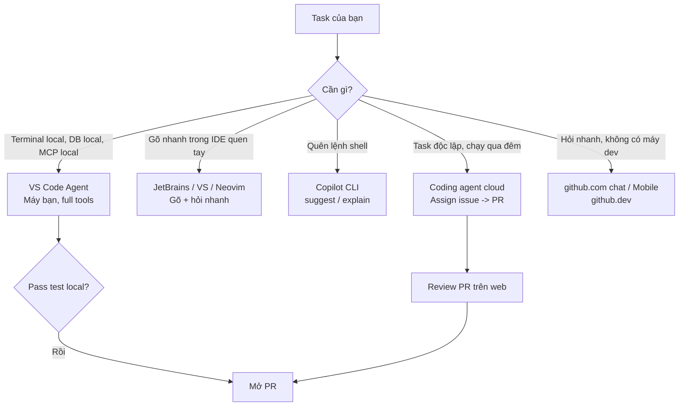
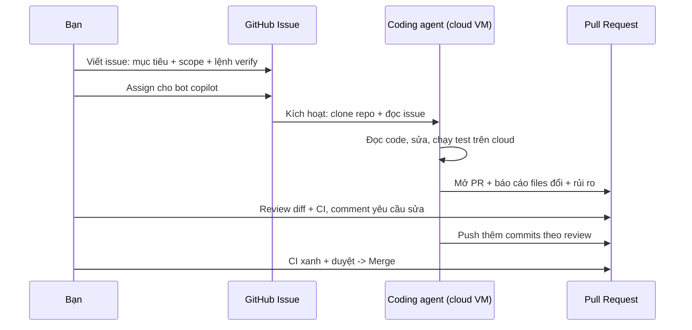

# 02 — Các Bề Mặt Copilot: VS Code, IDE, Web, CLI

> Bài 02 của series. Đọc xong bạn chọn đúng surface cho từng task, biết code chạy
> ở đâu + config nào được dùng, setup được coding agent trên github.com và Copilot
> trong Windows Terminal/GH Desktop. Thời gian: ~30 phút.

## Mục lục

1. [Vì sao nhiều bề mặt? (why)](#1-vì-sao-nhiều-bề-mặt-why)
2. [VS Code — bề mặt mạnh nhất](#2-vs-code--bề-mặt-mạnh-nhất)
3. [Visual Studio + JetBrains + Neovim](#3-visual-studio--jetbrains--neovim)
4. [github.com chat + coding agent](#4-githubcom-chat--coding-agent-cloud)
5. [github.dev / Mobile / GH Desktop / Windows Terminal](#5-githubdev--mobile--gh-desktop--windows-terminal)
6. [Copilot CLI deep-dive](#6-copilot-cli-deep-dive)
7. [Bảng so sánh tổng + walkthrough chọn surface](#7-bảng-so-sánh-tổng--walkthrough-chọn-surface-theo-task)
8. [Pitfalls + bài tập](#8-pitfalls--bài-tập)
9. [Link chéo](#9-link-chéo)

---

## 1. Vì sao nhiều bề mặt? (why)

- Là gì (1 câu): "bề mặt" (surface) là nơi bạn gặp Copilot — VS Code, web, terminal, điện thoại.
- Hiểu nôm na: như cùng 1 đầu bếp nhưng có nhiều quầy: quầy tại bàn (VS Code), giao tận nhà (coding agent cloud), quầy take-away (CLI).
- Ví dụ kỹ thuật: cùng lệnh "thêm rate-limit", làm ở VS Code thì chạy `npm test` local; giao coding agent thì nó chạy CI trên cloud.



```text
VS Code / Visual Studio / JetBrains / Neovim / CLI -> code chay TREN MAY BAN,
  dung .github/ + .vscode/ repo + settings local cua ban.
github.com chat + coding agent -> code chay TREN GITHUB CLOUD,
  chi dung repo (khong thay settings local, env phai cau hinh lai).
```

Vì sao GitHub tách? Task 5 phút (fix typo) cần latency thấp → local.
Task 2 giờ (migrate, refactor 50 files) cần máy chạy tiếp khi bạn gập laptop
→ cloud coding agent. Không có surface nào thắng mọi trường hợp.

---

## 2. VS Code — bề mặt mạnh nhất

### 2.1. Vì sao mạnh nhất? (why)

- Agent mode full tools: read/edit/search/terminal/MCP trong 1 loop.
- Model picker + mode picker (Ask/Edit/Agent) ngay trong Chat panel.
- Đọc repo config đầy đủ: `.github/muse-instructions.md`,
  `*.instructions.md`, `.github/prompts/`, `.github/agents/`, `.vscode/mcp.json`.
- Inline diff + Accept/Reject từng hunk, `#file/#selection` gắn scope chính xác.

### 2.2. 3 modes trong Chat (học thuộc)

> **Ask / Edit / Agent khác nhau thế nào?**
> Định nghĩa: 3 mức "quyền" bạn cấp cho Copilot trong 1 phiên chat.
> Hiểu nôm na: Ask = hỏi thầy (chỉ nghe), Edit = thuê thợ sửa 2 viên gạch bạn chỉ, Agent = giao cả nhà cho thầu.
> Ví dụ kỹ thuật: Ask không tạo diff; Edit tạo diff trong files bạn chọn; Agent tự mở thêm files + chạy `npm test`.

| Mode | Sửa file? | Chạy terminal? | Khi dùng |
|---|---|---|---|
| **Ask** | Không | Không | Hỏi, giải thích, tra cứu (`@workspace` + `#file`) |
| **Edit** | Có (files bạn chọn) | Không/hạn chế | Sửa có scope rõ, bạn kiểm soát files |
| **Agent** | Có (tự tìm files) | Có | Task mở, multi-file, cần verify bằng test |

```text
# Flow khuyen nghi (copy-paste tu duy):
# 1. Chua ro -> Ask: "@workspace ham login chay qua nhung file nao?"
# 2. Ro scope -> Edit: chon 2-3 files + "them null check, giu nguyen API".
# 3. Viec mo -> Agent: "them rate-limit cho POST /login, chay test xac nhan."
```

### 2.3. Ví dụ thực tế (copy-paste)

```text
# Ask (khong sua gi, hieu truoc):
"@workspace @file:package.json repo nay chay dev/test/lint bang lenh nao?
Tra loi ngan gon, khong sua file."

# Edit (scope hep, duyet diff):
"#file:src/routes/login.ts #file:src/middleware/auth.ts
Them rate-limit 5 req/phut cho POST /login dung express-rate-limit.
Giu nguyen response shape { code, message, requestId }."

# Agent (task mo, co verify):
"Trong apps/api, endpoint POST /orders crash khi thieu customerId.
Tim root cause, fix, them regression test, chay npm test de xac nhan.
Dung sua gi ngoai scope nay."
```

### 2.4. Phím tắt đáng nhớ

```text
Ctrl+Alt+I            mo Copilot Chat panel
Ctrl+Shift+P > Chat   lenh chat (New Chat, Attach File...)
Tab                   nhan ghost text (autocomplete)
/  @  #              trong Chat input: lenh / participant @ / bien #
Up/Down trong input   lich su prompt (dung lai prompt cu sua nhanh)
```

---

## 3. Visual Studio / JetBrains / Neovim

### 3.1. Visual Studio (Windows, .NET/C++)

```text
Manh: ghost text + Chat cho solution .NET lon, hieu MSBuild/C# context tot.
Yeu hon VS Code: agent mode han che terminal tools; MCP/custom agents ho tro cham hon.
Khi dung: dev .NET/WinForms/WPF/C++ hang ngay.
Khi chuyen: task multi-file + terminal phuc tap -> sang VS Code.
```

```text
Verify 30 giay:
1. Mo file .cs -> ghost text hien, Tab nhan duoc.
2. View -> Copilot Chat -> hoi "@workspace solution nay co may projects?"
3. Thu Edit nho: chon 1 method + "them null check cho params".
```

### 3.2. JetBrains (IntelliJ / PyCharm / WebStorm / GoLand...)

```text
Manh: ghost text + Chat hieu project model JetBrains (module indexes).
Yeu hon VS Code: agent terminal tool han che; prompt files/agents co the cham ho tro.
Khi dung: Java/Kotlin/Python/Go hang ngay trong IDE quen tay.
Khi chuyen: can MCP + custom agents day du -> sang VS Code.
```

### 3.3. Neovim

```bash
# Manh: go nhanh, nhe, ghost text ngay trong buffer.
# Yeu: khong co agent mode full (khong terminal tool nhu VS Code).
# Khi dung: edit nhanh, fix nho, gõ code toc do cao.
# Khi chuyen: task can doc nhieu file + chay test -> sang VS Code.

# Lennh hang ngay:
# :Copilot status    -> kiem tra
# :Copilot enable    -> bat lai
# Tab                -> nhan goi y
```

> Quy tắc team: Neovim/VS/JetBrains để gõ + hỏi nhanh. VS Code để agent.
> Đừng cố ép agent mode ở IDE yếu — chuyển surface rẻ hơn cãi với tool.

---

## 4. github.com chat + coding agent (cloud)

### 4.1. github.com Chat (hỏi trên web)

```text
Vao repo tren github.com -> nhan icon Copilot (goc phai) -> hoi bang tieng Viet/Anh.
Dung duoc: "@workspace" tuong duong (hoi toan repo), doc file/PR/issue.

Manh: khong can setup local, hoi tu dien thoai duoc.
Yeu: khong thay settings local, khong chay terminal local, khong MCP local.
Khi dung: review PR ngoai gio, hoi code khi khong co may dev.
```

### 4.2. Coding agent (assign issue → branch → PR)

- Là gì (1 câu): coding agent là Copilot chạy trên máy cloud của GitHub, tự code rồi mở PR khi bạn assign issue cho nó.
- Hiểu nôm na: như gửi xe vào gara qua đêm: tối giao chìa khóa (issue), sáng nhận xe đã sửa (PR).
- Ví dụ kỹ thuật: issue "Fix crash POST /orders" → agent tạo branch `copilot/fix-orders-422`, sửa `orders.ts`, chạy CI, mở PR link về issue.



> **Kỳ vọng / Verify:** sau khi assign 2–5 phút, issue phải hiện dòng "Copilot started work..."
> và có branch `copilot/...` mới. Không thấy = assign nhầm người, hoặc repo chưa bật coding agent.

```text
Flow chuan (copy-paste tung buoc):
1. Tao issue mo ta ro: muc tieu + scope files + lenh verify + "dung dung X".
   Vi du: "POST /orders crash khi thieu customerId. Fix + regression test.
   Verify: npm test -- --filter api. Dung doi schema DB."
2. Trong issue, Assign -> chon "copilot" (bot) nhu assign dev.
3. Agent tu: tao branch `copilot/fix-...`, doc code, sua, chay test, mo PR + link ve issue.
4. Ban review PR nhu review cua junior dev: doc diff, xem CI, comment yeu cau sua.
5. Agent tu push them commits theo review comments (neu ban tag no).
6. CI xanh + duyet -> merge.
```

```text
# Mau issue giao cho coding agent (copy-paste, sua lai):
## Muc tieu
Fix crash POST /orders khi payload thieu customerId (tra 422 + { code, message }).

## Scope
- Chi sua: apps/api/src/routes/orders.ts + test tuong ung.
- Dung sua: schema DB, auth middleware.

## Verify (agent phai chay that tren cloud)
- npm test -- --filter api (pass)
- npm run lint (pass)

## Bao cao trong PR
- File nao doi, vi sao; con rui ro gi.
```

### 4.3. Khi nào dùng coding agent vs local agent?

| Tiêu chí | Local Agent (VS Code) | Coding agent (github.com) |
|---|---|---|
| Chạy trên | Máy bạn | GitHub cloud VM |
| Config dùng | `.github/` + settings local + MCP local | Chỉ repo + cloud env |
| Cần setup local | Có | Không |
| Chạy tiếp khi gập laptop | Không | Có |
| Hợp task | Task cần terminal local, DB local, MCP local | Task độc lập, verify bằng CI, việc qua đêm |

---

## 5. github.dev / Mobile / GH Desktop / Windows Terminal

### 5.1. github.dev (VS Code trên browser)

```text
Nhan "." (cham) khi dang xem repo tren github.com -> mo github.dev (VS Code web).
Dang nhap Copilot -> co ghost text + Chat co ban.
Khi dung: sua nhanh khong can clone, demo, may la.
Gioi han: khong terminal that, khong MCP local.
```

### 5.2. Mobile (iOS/Android)

```text
GitHub Mobile app -> mo repo/PR/issue -> icon Copilot -> hoi.
Khi dung: doc giai thich PR khi dang di duong, duyet coding-agent PR.
Khong dung: viet code nghiem tuc (man hinh nho, khong diff tot).
```

### 5.3. GitHub Desktop

```text
GH Desktop 2026 co tich hop Copilot: goi y commit message + mo PR body summary.
Khi dung: ban thich GUI git, muon commit message tu dong theo diff.
Verify: stage files -> nut "Generate commit message" (icon Copilot) -> duyet truoc khi commit.
```

```bash
# Tuong duong CLI (khi khong dung GUI):
git diff --staged --stat
gh copilot suggest "viet commit message conventional commits cho diff hien tai"
```

### 5.4. Copilot trong Windows Terminal

```text
Windows Terminal + GitHub Copilot CLI ho tro goi y lenh ngay trong terminal.
Khi dung: dev Windows khong dung WSL, muon suggest lenh PowerShell.
Cai: Windows Terminal moi nhat + gh + gh-copilot (muc 6) + dang nhap.
Gioi han: PowerShell suggestion kem hon bash/zsh (test ky truoc khi Enter).
```

---

## 6. Copilot CLI deep-dive

### 6.1. Hai lệnh gốc (dùng hàng ngày)

```bash
# suggest: sinh lenh shell tu mo ta tieng Viet/Anh:
gh copilot suggest "xoa cac git branch local da merge vao main"
gh copilot suggest "tim 10 file lon nhat trong thu muc hien tai"
gh copilot suggest "backup folder data sang data-$(date +%F).tar.gz"

# explain: giai thich lenh kho hieu truoc khi chay:
gh copilot explain "find . -type f -name '*.log' -mtime +7 -delete"
gh copilot explain "git rebase --onto main feature-old feature-new"
```

### 6.2. Flow an toàn với lệnh nguy hiểm (copy-paste)

```bash
# NGUYEN TAC: explain truoc, chay sau. Dac biet voi rm/find/docker prune.
gh copilot explain "find . -type f -name '*.log' -mtime +7 -delete"
# Doc ky: co dung folder khong? co -delete nham khong?
# Test kho truoc (them echo / chay tren folder test):
find . -type f -name '*.log' -mtime +7 | head
# Dung moi chay that (bo | head, them -delete).
```

### 6.3. Kết hợp CLI + IDE (pattern hay)

```bash
# Pattern: CLI soan lenh kho -> paste vao VS Code terminal -> agent mode chay + verify.
gh copilot suggest "chay migration prisma tren staging (dry-run truoc)"
# Copy lenh duoc goi y -> dua cho agent mode VS Code:
# "Chay lenh nay o terminal, doc output, neu loi thi fix config thieu."
```

---

## 7. Bảng so sánh tổng + walkthrough chọn surface theo task

### 7.1. Bảng so sánh (nơi code chạy, config nào dùng, khi nào dùng)

### 7.1b. Bảng thuật ngữ bề mặt (tra nhanh)

| Thuật ngữ | Là gì (hiểu nôm na) | Ví dụ cụ thể | Khi nào dùng |
|---|---|---|---|
| **Surface** | Quầy gặp đầu bếp: VS Code, web, CLI, mobile | VS Code = quầy tại bàn, CLI = quầy take-away | Khi chọn nơi làm việc |
| **Local agent** | Thợ làm tại nhà bạn, thấy tủ lạnh (`.env`, DB) | VS Code agent chạy `npm test` local | Task cần env/DB/MCP local |
| **Coding agent** | Đội thi công qua đêm trên xưởng cloud | Assign issue → sáng có PR `copilot/fix-...` | Task độc lập, verify bằng CI |
| **github.dev** | VS Code chạy trong browser (nhấn `.`) | Sửa typo không cần clone | Sửa nhanh, máy lạ, demo |
| **Copilot CLI** | Từ điển lệnh shell biết nói tiếng Việt | `gh copilot suggest "nén folder dist"` | Quên flag docker/git/ffmpeg |

> **Kỳ vọng / Verify:** đọc xong bảng, bạn trả lời được trong 10 giây cho mỗi task:
> "code chạy ở đâu + config nào được dùng". Test: hỏi "task này cần `.env` local không?"
> Có → local agent; Không, CI đủ → coding agent.

| Surface | Nơi code chạy | Config nào dùng | Khi nào dùng |
|---|---|---|---|
| **VS Code** | Máy bạn | `.github/` + `.vscode/` + MCP local | Mặc định; agent multi-file + terminal |
| **Visual Studio** | Máy bạn | `.github/` (agent hạn chế) | Dev .NET/C++ hàng ngày |
| **JetBrains** | Máy bạn | `.github/` (agent hạn chế) | Java/Kotlin/Python/Go hàng ngày |
| **Neovim** | Máy bạn | `.github/` (chủ yếu autocomplete) | Gõ nhanh, fix nhỏ |
| **github.com chat** | Cloud (chỉ đọc/hỏi) | Chỉ repo | Hỏi/review khi không có máy dev |
| **Coding agent** | GitHub cloud VM | Chỉ repo + cloud env/CI | Task độc lập, chạy qua đêm → PR |
| **github.dev** | Browser | Chỉ repo | Sửa nhanh không clone |
| **Mobile** | Điện thoại | Chỉ repo | Đọc/giải thích PR ngoài giờ |
| **Copilot CLI** | Terminal bạn | Không (hỏi đáp shell) | Gợi ý/explain lệnh shell |
| **GH Desktop** | Máy bạn (GUI git) | Không | Commit message/PR summary nhanh |
| **Win Terminal** | Máy bạn | Qua gh CLI | Suggest lệnh PowerShell |

### 7.2. Walkthrough: 5 task mẫu chọn surface nào?

```text
Task 1: "Giai thich ham nay" (5 phut) -> Ask mode o IDE ban dang mo (VS/JetBrains/nvim).
Task 2: "Them rate-limit + test + chay verify" -> Agent mode VS Code (manh nhat).
Task 3: "Fix issue doc lap, tao PR, toi di ngu" -> Coding agent (assign issue).
Task 4: "Quen flag docker/git" -> gh copilot suggest/explain ngay trong terminal.
Task 5: "Review PR cua coding agent luc dang cafe" -> github.com chat / Mobile.
```

```bash
# Kiem tra ban dang o surface nao (tu hoi 10 giay):
# - Co terminal local + MCP local khong? Co -> VS Code. Khong -> cloud.
# - Can chay tiep khi gap laptop khong? Co -> coding agent.
# - Chi quen lenh shell? -> CLI, dung mo IDE.
```

---

## 8. Hiểu nhầm thường gặp + Pitfalls + bài tập

### 8.0. Hiểu nhầm thường gặp về bề mặt

| Hiểu nhầm | Sự thật | Ví dụ |
|---|---|---|
| "VS Code và github.com agent giống hệt nhau" | Local thấy `.env`/DB/MCP local; cloud chỉ thấy repo + CI | Task cần DB local mà giao cloud là fail chắc |
| "Neovim agent yếu là do Copilot dở" | Do harness Neovim thiếu terminal tool full, không phải model dở | Chuyển task khó sang VS Code là xong |
| "github.dev có terminal thật" | github.dev chạy trên browser, không có terminal local | Cần chạy test thật → về VS Code local |
| "CLI suggest luôn đúng" | Suggest là gợi ý, có thể sai flag nguy hiểm (`rm`, `find -delete`) | Luôn `explain` + chạy khô (`head`/dry-run) trước |

### 8.1. Lưu ý config theo surface

```text
- .github/muse-instructions.md + *.instructions.md: VS Code/JetBrains/VS/nvim doc duoc;
  coding agent chi doc phan trong repo (khong thay settings local cua ban).
- .vscode/mcp.json (MCP local): chi VS Code local thay; cloud phai cau hinh MCP cloud rieng.
- Env secrets (.env local): cloud KHONG thay -> task can DB local dung lam tren VS Code.
- Model picker: moi surface co list model hoi khac (theo plan) -> het quota model manh
  thi doi model re hon thay vi doi surface.
```

| Pitfall | Vì sao xảy ra | Fix |
|---|---|---|
| Ép agent mode ở IDE yếu rồi chê "Copilot dở" | JetBrains/VS terminal tool hạn chế | Task khó → sang VS Code, IDE kia để gõ/hỏi |
| Giao coding agent task cần DB local | Cloud không thấy `.env`/DB máy bạn | Task cần local → local agent; cloud chỉ task CI-verify được |
| Hỏi github.com chat rồi trách "không sửa file" | Web chat chủ yếu hỏi/review | Muốn sửa → coding agent (assign) hoặc về VS Code |
| Chạy lệnh CLI gợi ý mà không explain | Tin suggest 100% | Luôn `explain` + test khô (`head`/dry-run) trước |
| Mở task mới trên chat coding-agent cũ | History dài làm agent loạn | Issue mới cho task mới, PR riêng từng task |

### 8.2. Bài tập thực hành

**Bài 1 (15 phút) — So sánh Ask/Edit/Agent:**
Cùng 1 task nhỏ ("thêm null check cho hàm login"), chạy lần lượt 3 modes trong
VS Code. Ghi lại: mode nào sửa đúng nhất, tốn mấy turns, diff khác nhau ra sao.

**Bài 2 (20 phút) — Coding agent end-to-end:**
Tạo 1 issue test (scope 1–2 files, có lệnh verify), assign cho copilot, review PR
nó mở. Liệt kê 3 điểm nó làm tốt + 3 điểm bạn phải sửa tay.

**Bài 3 (15 phút) — CLI drill:**
Giải 3 việc terminal thật bằng `suggest` + `explain` (git cleanup, tìm file lớn,
nén backup). Ghi lại lệnh nào chạy được ngay, lệnh nào phải sửa tay.

**Bài 4 (15 phút) — Chọn surface:**
Lấy 5 tasks thật của team bạn tuần này, điền vào bảng mục 7.1: mỗi task hợp
surface nào? Vì sao? Đối chiếu với đồng nghiệp xem có đồng thuận không.

---

## 9. Link chéo

- **Bài 00 — Tổng quan**: nếu chưa phân biệt Ask/Edit/Agent/coding agent, đọc lại.
- **Bài 01 — Cài đặt**: surface nào chưa cài/login được thì quay lại bài 01.
- **Bài 03 — Instructions**: repo config nào đi theo surface nào (local vs cloud).
- **Bài 04 — Chat commands**: `@`, `#`, `/` dùng trên từng surface.
- **Bài 05 — Prompt files**: mang checklist theo mọi surface qua repo files.
- **Bài 11 (README) — Coding agent & GitHub flow**: giao issue → PR chi tiết.
- **Bài 12 (README) — CLI & Terminal automation**: `gh copilot` trong pipeline.
