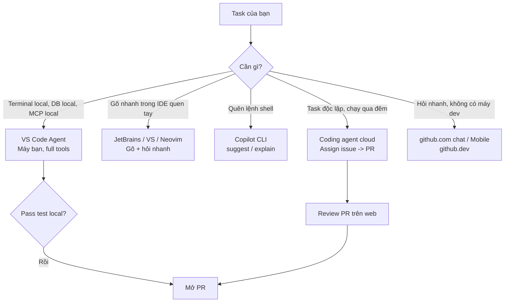
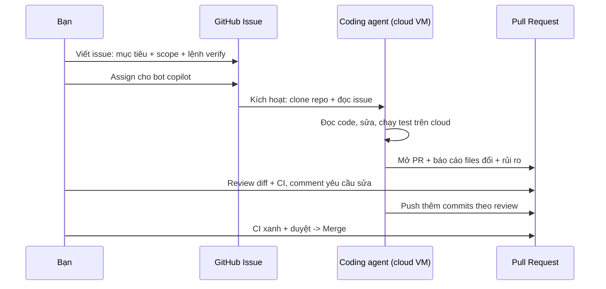

# 02 — Các Bề Mặt Copilot: VS Code, IDE, Web, CLI

> **Dành cho:** dev đã cài xong Copilot (bài 01), muốn biết task nào nên làm ở surface nào.
> **Vấn đề:** không biết code chạy ở đâu (máy bạn hay cloud), config nào được dùng, khi nào nên giao việc cho coding agent.
> **Đọc xong:** chọn đúng surface cho từng task, biết code chạy ở đâu + config nào được dùng, setup được coding agent trên github.com và Copilot trong Windows Terminal/GH Desktop.
> **Thời gian:** ~30 phút. *(Bài 02 của series)*

## Mục lục

1. [Vì sao nhiều bề mặt? (why)](#1-vì-sao-nhiều-bề-mặt-why)
2. [VS Code — bề mặt mạnh nhất](#2-vs-code--bề-mặt-mạnh-nhất)
3. [Visual Studio + JetBrains + Neovim](#3-visual-studio--jetbrains--neovim)
4. [github.com chat + coding agent (cloud)](#4-githubcom-chat--coding-agent-cloud)
5. [github.dev / Mobile / GH Desktop / Windows Terminal](#5-githubdev--mobile--gh-desktop--windows-terminal)
6. [Copilot CLI deep-dive](#6-copilot-cli-deep-dive)
7. [Bảng so sánh tổng + walkthrough chọn surface theo task](#7-bảng-so-sánh-tổng--walkthrough-chọn-surface-theo-task)
8. [Pitfalls + bài tập](#8-pitfalls--bài-tập)
9. [Link chéo](#9-link-chéo)

---

## 1. Vì sao nhiều bề mặt? (why)

Section này trả lời: "bề mặt" (surface) là gì, và vì sao bạn phải chọn surface theo task thay vì chỉ dùng một nơi duy nhất.

- Là gì (1 câu): "bề mặt" (surface) là nơi bạn gặp Copilot — VS Code, web, terminal, điện thoại.
- Hiểu nôm na: như cùng 1 đầu bếp nhưng có nhiều quầy: quầy tại bàn (VS Code), giao tận nhà (coding agent cloud), quầy take-away (CLI).
- Ví dụ kỹ thuật: cùng lệnh "thêm rate-limit", làm ở VS Code thì chạy `npm test` local; giao coding agent thì nó chạy CI trên cloud.



```text
VS Code / Visual Studio / JetBrains / Neovim / CLI -> code chạy TRÊN MÁY BẠN,
  dùng .github/ + .vscode/ repo + settings local của bạn.
github.com chat + coding agent -> code chạy TRÊN GITHUB CLOUD,
  chỉ dùng repo (không thấy settings local, env phải cấu hình lại).
```

Vì sao GitHub tách? Task 5 phút (fix typo) cần latency thấp → local.
Task 2 giờ (migrate, refactor 50 files) cần máy chạy tiếp khi bạn gập laptop
→ cloud coding agent. Không có surface nào thắng mọi trường hợp.

---

## 2. VS Code — bề mặt mạnh nhất

Section này trả lời: vì sao VS Code mạnh nhất, đọc thuộc 3 modes Ask/Edit/Agent, xem ví dụ thật và phím tắt hay dùng.

### 2.1. Vì sao mạnh nhất? (why)

- Agent mode full tools: read/edit/search/terminal/MCP trong 1 loop.
- Model picker + mode picker (Ask/Edit/Agent) ngay trong Chat panel.
- Đọc repo config đầy đủ: `.github/muse-instructions.md`,
  `*.instructions.md`, `.github/prompts/`, `.github/agents/`, `.vscode/mcp.json`.
- Inline diff + Accept/Reject từng hunk, `#file/#selection` gắn scope chính xác.

### 2.2. 3 modes trong Chat (học thuộc)

> **Ask / Edit / Agent khác nhau thế nào?**
> Định nghĩa: 3 mức "quyền" bạn cấp cho Copilot trong 1 phiên chat.
> Hiểu nôm na: Ask = hỏi thầy (chỉ nghe), Edit = thuê thợ sửa 2 viên gạch bạn chỉ, Agent = giao cả nhà cho thầu.
> Ví dụ kỹ thuật: Ask không tạo diff; Edit tạo diff trong files bạn chọn; Agent tự mở thêm files + chạy `npm test`.

| Mode | Sửa file? | Chạy terminal? | Khi dùng |
|---|---|---|---|
| **Ask** | Không | Không | Hỏi, giải thích, tra cứu (`@workspace` + `#file`) |
| **Edit** | Có (files bạn chọn) | Không/hạn chế | Sửa có scope rõ, bạn kiểm soát files |
| **Agent** | Có (tự tìm files) | Có | Task mở, multi-file, cần verify bằng test |

```text
# Flow khuyến nghị (copy-paste tư duy):
# 1. Chưa rõ -> Ask: "@workspace hàm login chạy qua những file nào?"
# 2. Rõ scope -> Edit: chọn 2-3 files + "thêm null check, giữ nguyên API".
# 3. Việc mở -> Agent: "thêm rate-limit cho POST /login, chạy test xác nhận."
```

### 2.3. Ví dụ thực tế (copy-paste)

```text
# Ask (không sửa gì, hiểu trước):
"@workspace @file:package.json repo này chạy dev/test/lint bằng lệnh nào?
Trả lời ngắn gọn, không sửa file."

# Edit (scope hẹp, duyệt diff):
"#file:src/routes/login.ts #file:src/middleware/auth.ts
Thêm rate-limit 5 req/phút cho POST /login dùng express-rate-limit.
Giữ nguyên response shape { code, message, requestId }."

# Agent (task mở, có verify):
"Trong apps/api, endpoint POST /orders crash khi thiếu customerId.
Tìm root cause, fix, thêm regression test, chạy npm test để xác nhận.
Đừng sửa gì ngoài scope này."
```

### 2.4. Phím tắt đáng nhớ

```text
Ctrl+Alt+I            mở Copilot Chat panel
Ctrl+Shift+P > Chat   lệnh chat (New Chat, Attach File...)
Tab                   nhận ghost text (autocomplete)
/  @  #              trong Chat input: lệnh / participant @ / biến #
Up/Down trong input   lịch sử prompt (dùng lại prompt cũ sửa nhanh)
```

---

## 3. Visual Studio / JetBrains / Neovim

Section này dành cho bạn dùng IDE khác VS Code: biết điểm mạnh/yếu của từng nơi, khi nào nên ở lại và khi nào chuyển sang VS Code.

### 3.1. Visual Studio (Windows, .NET/C++)

```text
Mạnh: ghost text + Chat cho solution .NET lớn, hiểu MSBuild/C# context tốt.
Yếu hơn VS Code: agent mode hạn chế terminal tools; MCP/custom agents hỗ trợ chậm hơn.
Khi dùng: dev .NET/WinForms/WPF/C++ hàng ngày.
Khi chuyển: task multi-file + terminal phức tạp -> sang VS Code.
```

```text
Verify 30 giây:
1. Mở file .cs -> ghost text hiện, Tab nhận được.
2. View -> Copilot Chat -> hỏi "@workspace solution này có mấy projects?"
3. Thử Edit nhỏ: chọn 1 method + "thêm null check cho params".
```

### 3.2. JetBrains (IntelliJ / PyCharm / WebStorm / GoLand...)

```text
Mạnh: ghost text + Chat hiểu project model JetBrains (module indexes).
Yếu hơn VS Code: agent terminal tool hạn chế; prompt files/agents có thể hỗ trợ chậm.
Khi dùng: Java/Kotlin/Python/Go hàng ngày trong IDE quen tay.
Khi chuyển: cần MCP + custom agents đầy đủ -> sang VS Code.
```

### 3.3. Neovim

```bash
# Mạnh: gõ nhanh, nhẹ, ghost text ngay trong buffer.
# Yếu: không có agent mode full (không terminal tool như VS Code).
# Khi dùng: edit nhanh, fix nhỏ, gõ code tốc độ cao.
# Khi chuyển: task cần đọc nhiều file + chạy test -> sang VS Code.

# Lệnh hàng ngày:
# :Copilot status    -> kiểm tra
# :Copilot enable    -> bật lại
# Tab                -> nhận gợi ý
```

> Quy tắc team: Neovim/VS/JetBrains để gõ + hỏi nhanh. VS Code để agent.
> Đừng cố ép agent mode ở IDE yếu — chuyển surface rẻ hơn cãi với tool.

---

## 4. github.com chat + coding agent (cloud)

Section này dành cho bạn muốn làm việc không cần máy dev: hỏi anh bằng web chat, hoặc giao hẳn việc cho coding agent trên cloud để nó mở PR.

### 4.1. github.com Chat (hỏi trên web)

```text
Vào repo trên github.com -> nhấn icon Copilot (góc phải) -> hỏi bằng tiếng Việt/Anh.
Dùng được: "@workspace" tương đương (hỏi toàn repo), đọc file/PR/issue.

Mạnh: không cần setup local, hỏi từ điện thoại được.
Yếu: không thấy settings local, không chạy terminal local, không MCP local.
Khi dùng: review PR ngoài giờ, hỏi code khi không có máy dev.
```

### 4.2. Coding agent (assign issue → branch → PR)

- Là gì (1 câu): coding agent là Copilot chạy trên máy cloud của GitHub, tự code rồi mở PR khi bạn assign issue cho nó.
- Hiểu nôm na: như gửi xe vào gara qua đêm: tối giao chìa khóa (issue), sáng nhận xe đã sửa (PR).
- Ví dụ kỹ thuật: issue "Fix crash POST /orders" → agent tạo branch `copilot/fix-orders-422`, sửa `orders.ts`, chạy CI, mở PR link về issue.



> **Kỳ vọng / Verify:** sau khi assign 2–5 phút, issue phải hiện dòng "Copilot started work..."
> và có branch `copilot/...` mới. Không thấy = assign nhầm người, hoặc repo chưa bật coding agent.

```text
Flow chuẩn (copy-paste từng bước):
1. Tạo issue mô tả rõ: mục tiêu + scope files + lệnh verify + "đừng dùng X".
   Ví dụ: "POST /orders crash khi thiếu customerId. Fix + regression test.
   Verify: npm test -- --filter api. Đừng đổi schema DB."
2. Trong issue, Assign -> chọn "copilot" (bot) như assign dev.
3. Agent tự: tạo branch `copilot/fix-...`, đọc code, sửa, chạy test, mở PR + link về issue.
4. Bạn review PR như review của junior dev: đọc diff, xem CI, comment yêu cầu sửa.
5. Agent tự push thêm commits theo review comments (nếu bạn tag nó).
6. CI xanh + duyệt -> merge.
```

```text
# Mẫu issue giao cho coding agent (copy-paste, sửa lại):
## Mục tiêu
Fix crash POST /orders khi payload thiếu customerId (trả 422 + { code, message }).

## Scope
- Chỉ sửa: apps/api/src/routes/orders.ts + test tương ứng.
- Đừng sửa: schema DB, auth middleware.

## Verify (agent phải chạy thật trên cloud)
- npm test -- --filter api (pass)
- npm run lint (pass)

## Báo cáo trong PR
- File nào đổi, vì sao; còn rủi ro gì.
```

### 4.3. Khi nào dùng coding agent vs local agent?

| Tiêu chí | Local Agent (VS Code) | Coding agent (github.com) |
|---|---|---|
| Chạy trên | Máy bạn | GitHub cloud VM |
| Config dùng | `.github/` + settings local + MCP local | Chỉ repo + cloud env |
| Cần setup local | Có | Không |
| Chạy tiếp khi gập laptop | Không | Có |
| Hợp task | Task cần terminal local, DB local, MCP local | Task độc lập, verify bằng CI, việc qua đêm |

---

## 5. github.dev / Mobile / GH Desktop / Windows Terminal

Section này dành cho các bề mặt phụ: VS Code trên browser, điện thoại, GitHub Desktop, Windows Terminal — dùng đúng lúc sẽ tiết kiệm thời gian.

### 5.1. github.dev (VS Code trên browser)

```text
Nhấn "." (chấm) khi đang xem repo trên github.com -> mở github.dev (VS Code web).
Đăng nhập Copilot -> có ghost text + Chat cơ bản.
Khi dùng: sửa nhanh không cần clone, demo, máy lạ.
Giới hạn: không terminal thật, không MCP local.
```

### 5.2. Mobile (iOS/Android)

```text
GitHub Mobile app -> mở repo/PR/issue -> icon Copilot -> hỏi.
Khi dùng: đọc giải thích PR khi đang đi đường, duyệt coding-agent PR.
Không dùng: viết code nghiêm túc (màn hình nhỏ, không diff tốt).
```

### 5.3. GitHub Desktop

```text
GH Desktop 2026 có tích hợp Copilot: gợi ý commit message + mở PR body summary.
Khi dùng: bạn thích GUI git, muốn commit message tự động theo diff.
Verify: stage files -> nút "Generate commit message" (icon Copilot) -> duyệt trước khi commit.
```

```bash
# Tương đương CLI (khi không dùng GUI):
git diff --staged --stat
gh copilot suggest "viet commit message conventional commits cho diff hien tai"
```

### 5.4. Copilot trong Windows Terminal

```text
Windows Terminal + GitHub Copilot CLI hỗ trợ gợi ý lệnh ngay trong terminal.
Khi dùng: dev Windows không dùng WSL, muốn suggest lệnh PowerShell.
Cài: Windows Terminal mới nhất + gh + gh-copilot (mục 6) + đăng nhập.
Giới hạn: PowerShell suggestion kém hơn bash/zsh (test kỹ trước khi Enter).
```

---

## 6. Copilot CLI deep-dive

Section này dành cho bạn muốn dùng CLI thành thạo: 2 lệnh gốc, quy trình an toàn với lệnh nguy hiểm, và pattern kết hợp CLI + IDE.

### 6.1. Hai lệnh gốc (dùng hàng ngày)

```bash
# suggest: sinh lệnh shell từ mô tả tiếng Việt/Anh:
gh copilot suggest "xoa cac git branch local da merge vao main"
gh copilot suggest "tim 10 file lon nhat trong thu muc hien tai"
gh copilot suggest "backup folder data sang data-$(date +%F).tar.gz"

# explain: giải thích lệnh khó hiểu trước khi chạy:
gh copilot explain "find . -type f -name '*.log' -mtime +7 -delete"
gh copilot explain "git rebase --onto main feature-old feature-new"
```

### 6.2. Flow an toàn với lệnh nguy hiểm (copy-paste)

```bash
# NGUYÊN TẮC: explain trước, chạy sau. Đặc biệt với rm/find/docker prune.
gh copilot explain "find . -type f -name '*.log' -mtime +7 -delete"
# Đọc kỹ: đúng folder không? có -delete nhầm không?
# Test khô trước (thêm echo / chạy trên folder test):
find . -type f -name '*.log' -mtime +7 | head
# Đúng mới chạy thật (bỏ | head, thêm -delete).
```

### 6.3. Kết hợp CLI + IDE (pattern hay)

```bash
# Pattern: CLI soạn lệnh khó -> paste vào VS Code terminal -> agent mode chạy + verify.
gh copilot suggest "chay migration prisma tren staging (dry-run truoc)"
# Copy lệnh được gợi ý -> đưa cho agent mode VS Code:
# "Chạy lệnh này ở terminal, đọc output, nếu lỗi thì fix config thiếu."
```

---

## 7. Bảng so sánh tổng + walkthrough chọn surface theo task

Section này trả lời nhanh: mỗi surface code chạy ở đâu, dùng config gì, hợp task nào — để bạn chọn được trong 10 giây.

### 7.1. Bảng so sánh (nơi code chạy, config nào dùng, khi nào dùng)

### 7.1b. Bảng thuật ngữ bề mặt (tra nhanh)

Tra cứu nhanh, không cần đọc từ đầu.

| Thuật ngữ | Là gì (hiểu nôm na) | Ví dụ cụ thể | Khi nào dùng |
|---|---|---|---|
| **Surface** | Quầy gặp đầu bếp: VS Code, web, CLI, mobile | VS Code = quầy tại bàn, CLI = quầy take-away | Khi chọn nơi làm việc |
| **Local agent** | Thợ làm tại nhà bạn, thấy tủ lạnh (`.env`, DB) | VS Code agent chạy `npm test` local | Task cần env/DB/MCP local |
| **Coding agent** | Đội thi công qua đêm trên xưởng cloud | Assign issue → sáng có PR `copilot/fix-...` | Task độc lập, verify bằng CI |
| **github.dev** | VS Code chạy trong browser (nhấn `.`) | Sửa typo không cần clone | Sửa nhanh, máy lạ, demo |
| **Copilot CLI** | Từ điển lệnh shell biết nói tiếng Việt | `gh copilot suggest "nén folder dist"` | Quên flag docker/git/ffmpeg |

> **Kỳ vọng / Verify:** đọc xong bảng, bạn trả lời được trong 10 giây cho mỗi task:
> "code chạy ở đâu + config nào được dùng". Test: hỏi "task này cần `.env` local không?"
> Có → local agent; Không, CI đủ → coding agent.

| Surface | Nơi code chạy | Config nào dùng | Khi nào dùng |
|---|---|---|---|
| **VS Code** | Máy bạn | `.github/` + `.vscode/` + MCP local | Mặc định; agent multi-file + terminal |
| **Visual Studio** | Máy bạn | `.github/` (agent hạn chế) | Dev .NET/C++ hàng ngày |
| **JetBrains** | Máy bạn | `.github/` (agent hạn chế) | Java/Kotlin/Python/Go hàng ngày |
| **Neovim** | Máy bạn | `.github/` (chủ yếu autocomplete) | Gõ nhanh, fix nhỏ |
| **github.com chat** | Cloud (chỉ đọc/hỏi) | Chỉ repo | Hỏi/review khi không có máy dev |
| **Coding agent** | GitHub cloud VM | Chỉ repo + cloud env/CI | Task độc lập, chạy qua đêm → PR |
| **github.dev** | Browser | Chỉ repo | Sửa nhanh không clone |
| **Mobile** | Điện thoại | Chỉ repo | Đọc/giải thích PR ngoài giờ |
| **Copilot CLI** | Terminal bạn | Không (hỏi đáp shell) | Gợi ý/explain lệnh shell |
| **GH Desktop** | Máy bạn (GUI git) | Không | Commit message/PR summary nhanh |
| **Win Terminal** | Máy bạn | Qua gh CLI | Suggest lệnh PowerShell |

### 7.2. Walkthrough: 5 task mẫu chọn surface nào?

```text
Task 1: "Giải thích hàm này" (5 phút) -> Ask mode ở IDE bạn đang mở (VS/JetBrains/nvim).
Task 2: "Thêm rate-limit + test + chạy verify" -> Agent mode VS Code (mạnh nhất).
Task 3: "Fix issue độc lập, tạo PR, tối đi ngủ" -> Coding agent (assign issue).
Task 4: "Quên flag docker/git" -> gh copilot suggest/explain ngay trong terminal.
Task 5: "Review PR của coding agent lúc đang cafe" -> github.com chat / Mobile.
```

```bash
# Kiểm tra bạn đang ở surface nào (tự hỏi 10 giây):
# - Có terminal local + MCP local không? Có -> VS Code. Không -> cloud.
# - Cần chạy tiếp khi gập laptop không? Có -> coding agent.
# - Chỉ quên lệnh shell? -> CLI, đừng mở IDE.
```

---

## 8. Hiểu nhầm thường gặp + Pitfalls + bài tập

Section này dành cho bạn muốn tránh 5 nhầm lẫn phổ biến nhất về bề mặt, nắm lưu ý config theo từng surface, rồi luyện bằng 4 bài tập.

### 8.0. Hiểu nhầm thường gặp về bề mặt

| Hiểu nhầm | Sự thật | Ví dụ |
|---|---|---|
| "VS Code và github.com agent giống hệt nhau" | Local thấy `.env`/DB/MCP local; cloud chỉ thấy repo + CI | Task cần DB local mà giao cloud là fail chắc |
| "Neovim agent yếu là do Copilot dở" | Do harness Neovim thiếu terminal tool full, không phải model dở | Chuyển task khó sang VS Code là xong |
| "github.dev có terminal thật" | github.dev chạy trên browser, không có terminal local | Cần chạy test thật → về VS Code local |
| "CLI suggest luôn đúng" | Suggest là gợi ý, có thể sai flag nguy hiểm (`rm`, `find -delete`) | Luôn `explain` + chạy khô (`head`/dry-run) trước |

### 8.1. Lưu ý config theo surface

```text
- .github/muse-instructions.md + *.instructions.md: VS Code/JetBrains/VS/nvim đọc được;
  coding agent chỉ đọc phần trong repo (không thấy settings local của bạn).
- .vscode/mcp.json (MCP local): chỉ VS Code local thấy; cloud phải cấu hình MCP cloud riêng.
- Env secrets (.env local): cloud KHÔNG thấy -> task cần DB local đừng làm trên VS Code.
- Model picker: mỗi surface có list model hơi khác (theo plan) -> hết AI Credits của model mạnh
  thì đổi model rẻ hơn thay vì đổi surface.
```

| Pitfall | Vì sao xảy ra | Fix |
|---|---|---|
| Ép agent mode ở IDE yếu rồi chê "Copilot dở" | JetBrains/VS terminal tool hạn chế | Task khó → sang VS Code, IDE kia để gõ/hỏi |
| Giao coding agent task cần DB local | Cloud không thấy `.env`/DB máy bạn | Task cần local → local agent; cloud chỉ task CI-verify được |
| Hỏi github.com chat rồi trách "không sửa file" | Web chat chủ yếu hỏi/review | Muốn sửa → coding agent (assign) hoặc về VS Code |
| Chạy lệnh CLI gợi ý mà không explain | Tin suggest 100% | Luôn `explain` + test khô (`head`/dry-run) trước |
| Mở task mới trên chat coding-agent cũ | History dài làm agent loạn | Issue mới cho task mới, PR riêng từng task |

### 8.2. Bài tập thực hành

**Bài 1 (15 phút) — So sánh Ask/Edit/Agent:**
Cùng 1 task nhỏ ("thêm null check cho hàm login"), chạy lần lượt 3 modes trong
VS Code. Ghi lại: mode nào sửa đúng nhất, tốn mấy turns, diff khác nhau ra sao.

**Bài 2 (20 phút) — Coding agent end-to-end:**
Tạo 1 issue test (scope 1–2 files, có lệnh verify), assign cho copilot, review PR
nó mở. Liệt kê 3 điểm nó làm tốt + 3 điểm bạn phải sửa tay.

**Bài 3 (15 phút) — CLI drill:**
Giải 3 việc terminal thật bằng `suggest` + `explain` (git cleanup, tìm file lớn,
nén backup). Ghi lại lệnh nào chạy được ngay, lệnh nào phải sửa tay.

**Bài 4 (15 phút) — Chọn surface:**
Lấy 5 tasks thật của team bạn tuần này, điền vào bảng mục 7.1: mỗi task hợp
surface nào? Vì sao? Đối chiếu với đồng nghiệp xem có đồng thuận không.

---

## 9. Link chéo

- **Bài 00 — Tổng quan**: nếu chưa phân biệt Ask/Edit/Agent/coding agent, đọc lại.
- **Bài 01 — Cài đặt**: surface nào chưa cài/login được thì quay lại bài 01.
- **Bài 03 — Instructions**: repo config nào đi theo surface nào (local vs cloud).
- **Bài 04 — Chat commands**: `@`, `#`, `/` dùng trên từng surface.
- **Bài 05 — Prompt files**: mang checklist theo mọi surface qua repo files.
- **Bài 11 (README) — Coding agent & GitHub flow**: giao issue → PR chi tiết.
- **Bài 12 (README) — CLI & Terminal automation**: `gh copilot` trong pipeline.