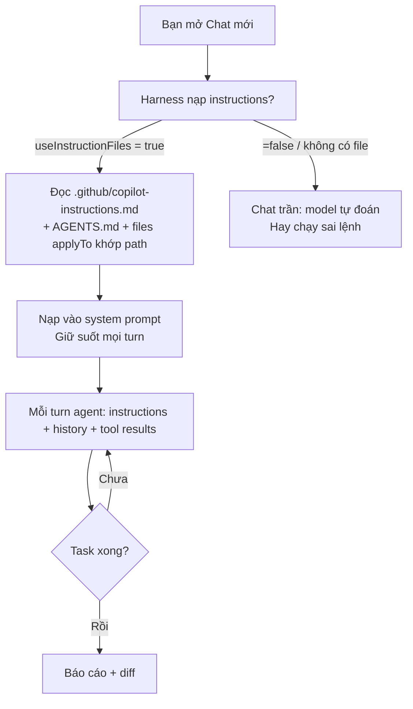
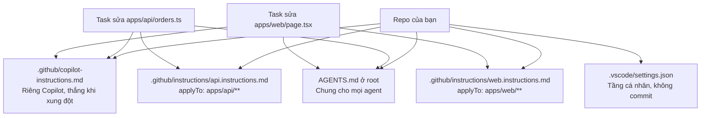

# 03 — Instructions, Memory & Rules (File Quan Trọng Nhất Copilot)

> **Dành cho:** dev đã dùng Copilot Chat nhưng chưa có file instructions chuẩn cho repo.
> **Vấn đề:** agent đoán lệnh sai, chạy sai style, đụng vào file generated — vì repo không có file hướng dẫn.
> **Đọc xong:** viết được `.github/copilot-instructions.md` <200 dòng, tách rules theo `applyTo` globs,
> tương thích `AGENTS.md`, và hiểu instruction hierarchy. **Thời gian:** ~35 phút.

## Mục lục

1. [Vì sao instructions là file quan trọng nhất? (why)](#1-vì-sao-instructions-là-file-quan-trọng-nhất-why)
2. [copilot-instructions.md là gì và đặt ở đâu](#2-copilot-instructionsmd-là-gì-và-đặt-ở-đâu)
3. [3 instructions mẫu hoàn chỉnh (copy-paste)](#3-3-instructions-mẫu-hoàn-chỉnh-copy-paste)
4. [Rules patterns + applyTo globs](#4-rules-patterns--applyto-globs)
5. [AGENTS.md portability — viết 1 lần, chạy mọi agent](#5-agentsmd-portability--viết-1-lần-chạy-mọi-agent)
6. [Import, front-load và tách nhỏ (đừng phình file)](#6-import-front-load-và-tách-nhỏ-đừng-phình-file)
7. [VS Code settings custom instructions deep-dive](#7-vs-code-settings-custom-instructions-deep-dive)
8. [Walkthrough viết instructions từ 0](#8-walkthrough-viết-instructions-từ-0)
9. [Hiểu nhầm thường gặp + Pitfalls + bài tập](#9-hiểu-nhầm-thường-gặp--pitfalls--bài-tập)
10. [Link chéo](#10-link-chéo)

---

## 1. Vì sao instructions là file quan trọng nhất? (why)

- **Là gì (1 câu):** instructions là file markdown do bạn viết. Copilot đọc nó ở đầu mỗi chat và nhớ suốt phiên.
- **Nôm na:** như tờ dặn dò dán trên tủ lạnh cho người giúp việc: "chó ăn 2 bữa, đừng mở cửa sau".
- **Ví dụ kỹ thuật:** dòng `Test focused: npm test -- --filter api` giúp agent không chạy nhầm `pnpm test` full 20 phút.



> **Kỳ vọng / Verify:** mở chat mới, hỏi "Liệt kê 3 lệnh dev/test/lint + 2 thứ NEVER".
> Nếu trả lời khớp file bạn viết = instructions đã load. Sai = check `useInstructionFiles`.

- Viết tốt → mọi task sau tự đúng: lệnh test đúng, style đúng, không đụng file generated.
- Viết tệ (500 dòng wiki) → mọi task sau đều trả AI Credits cho rác.

Cơ chế sâu (hiểu 1 lần, khỏi thắc mắc sau này):

- Instructions được inject vào system prompt ở đầu chat.
- Mỗi turn, agent mode nạp lại toàn bộ context: instructions + history + tool results.
- Nghĩa là: 1 dòng thừa trong instructions = trả tiền N lần (N = số turns).

> Quy tắc 200 dòng không phải thẩm mỹ — là token economics (bài 00 mục 4).
> 150 dòng ~ 2.500 tokens × N turns. Cắt 1 dòng thừa tiết kiệm N lần.

---

## 2. copilot-instructions.md là gì và đặt ở đâu

- **Là gì (1 câu):** `copilot-instructions.md` là file repo-wide. Copilot đọc nó đầu mỗi Chat khi bật setting.
- **Nôm na:** như nội quy chung của cả nhà — ai vào cũng phải đọc.
- **Ví dụ kỹ thuật:** ghi `Dev: npm run dev (cần .env từ 1Password)` thì mọi task sau agent tự biết, không hỏi lại.

### 2.0. Phân biệt 3 loại file (chỗ hay rối nhất — đọc kỹ)

Bảng này là xương sống của cả bài. Đọc kỹ 3 cột "Hiểu nôm na" và "Khi nào dùng".

| Loại file | Nằm ở đâu | Là gì (hiểu nôm na) | Ví dụ cụ thể | Khi nào dùng |
|---|---|---|---|---|
| **1. `copilot-instructions.md`** | `.github/copilot-instructions.md` (1 file duy nhất, commit git) | Nội quy cả nhà, đọc mọi lần vào nhà | "Dùng pnpm. Test: `pnpm vitest run...`. NEVER commit thẳng main." | Quy ước mọi task đều cần (<200 dòng) |
| **2. `*.instructions.md`** | `.github/instructions/<ten>.instructions.md` (nhiều files, mỗi file có `applyTo`) | Nội quy từng phòng, chỉ đọc khi vào phòng đó | `applyTo: "apps/api/**"` → "Route không query DB trực tiếp" | Quy tắc chỉ đúng 1 subtree (mỗi file <50 dòng, tối đa ~8 files) |
| **3. `AGENTS.md`** | `AGENTS.md` ở repo root (chuẩn mở, nhiều agent đọc được) | Nội quy khu phố, đội thợ nào cũng hiểu | "Dev: `npm run dev`. Test: `npm test`." | Viết 1 lần để Copilot + Claude Code + Codex đều dùng được |



```bash
# Copy-paste: tạo đủ 3 loại file trong 1 phút
mkdir -p .github/instructions
touch .github/copilot-instructions.md AGENTS.md .github/instructions/api.instructions.md
ls -la .github/copilot-instructions.md .github/instructions/ AGENTS.md 2>&1
# Kỳ vọng / Verify: ls hiện đủ 3 paths, không báo "No such file".
# Sau đó paste nội dung mẫu ở mục 3 (file chung) và mục 4.2 (file applyTo).
```

### 2.1. Vị trí files (học thuộc)

```text
.github/copilot-instructions.md      repo-wide, commit git cho team (QUAN TRONG NHAT)
.github/instructions/*.instructions.md   path-scoped, co applyTo globs
AGENTS.md                          chuan mo 2026, Copilot + nhieu agent khac doc duoc
.vscode/settings.json              custom instructions dang settings (may ca nhan)
```

```bash
# Kiem tra dang load gi (copy-paste):
ls -la .github/copilot-instructions.md .github/instructions/ AGENTS.md 2>&1
wc -l .github/copilot-instructions.md .github/instructions/*.instructions.md 2>/dev/null
# Muc tieu: repo-wide file <200 dong.
```

```json
// .vscode/settings.json — bat buoc de instructions duoc load:
{
  "github.copilot.chat.codeGeneration.useInstructionFiles": true
}
```

### 2.2. Instruction hierarchy (thứ tự thắng khi xung đột)

```text
user settings < org policy < repo copilot-instructions.md < *.instructions.md (applyTo cu the)
```

Hiểu nhanh thứ tự thắng thua:

- File **cụ thể hơn thắng**: rule trong `api.instructions.md` (`applyTo: apps/api/**`)
  thắng rule chung trong `copilot-instructions.md` khi bạn sửa file trong `apps/api/`.
- Org policy (Business/Enterprise) thắng mọi thứ — admin cấm thì repo không mở được.
- Quy tắc team: personal preferences (ngôn ngữ trả lời) để ở user settings.
- Mọi thứ team dùng chung phải vào repo files + commit.

---

## 3. 3 instructions mẫu hoàn chỉnh (copy-paste)

> Mỗi mẫu <100 dòng, verified-commands, rules check được. Thay `<...>` bằng project bạn.

### 3.1. Mẫu A — Web app (Next.js + Postgres + pnpm)

```markdown
# Project: Acme Shop Web — Next.js 15 storefront + API routes

## Tech Stack
- Next.js 15 (App Router), TypeScript strict, Tailwind, Prisma + Postgres 16
- Auth: NextAuth v5. Tests: Vitest + Playwright

## Commands (VERIFIED 2026-10 — chay lai neu doi toolchain)
- Dev: `pnpm dev` (web :3000, can `.env.local` tu 1Password "Acme dev")
- DB migrate: `pnpm prisma migrate dev`
- Test focused: `pnpm vitest run apps/web/src/app/login/`
- Test full: `pnpm test` (khong chay khi chi sua 1 file — dung focused)
- Lint: `pnpm eslint apps/web/src --max-warnings 0`
- Full check truoc PR: `pnpm lint && pnpm test && pnpm build`

## Architecture
- `apps/web/src/app/` routes (server components mac dinh)
- `apps/web/src/server/` owns DB access; client KHONG import prisma truc tiep
- `packages/ui/` design system; `packages/contracts/` zod schemas dung chung

## Code Style (cu the, check duoc)
- API errors shape `{ code, message, requestId }`, status dung (400/401/403/404/422/500)
- Server actions validate bang zod schema tu `packages/contracts/`
- File >300 dong thi tach; component >150 dong thi tach
- Khong `any`; ep kieu phai co comment `// why: ...`

## Rules
- ALWAYS chay focused test sau khi sua; paste output vao bao cao
- ALWAYS `pnpm prisma migrate dev --name <ten>` khi doi schema, KHONG sua SQL tay
- NEVER commit truc tiep main, NEVER sua `src/generated/` va migration da merge
- DB seed chi tu `prisma/seed.ts`, khong insert tay roi quen seed
```

### 3.2. Mẫu B — API (Node Express + Postgres + npm)

```markdown
# Project: Acme API — Express + Postgres 16 + TypeScript

## Commands (VERIFIED 2026-10)
- Dev: `npm run dev` (api :4000, can `.env` tu 1Password "Acme dev")
- Test focused: `npm test -- --filter api --testPathPattern=orders`
- Test full: `npm test -- --filter api`
- Lint: `npm run lint`

## Architecture
- `src/routes/` HTTP layer mong; `src/services/` business logic; `src/db/` query only
- Route KHONG query DB truc tiep — goi qua service
- Zod schemas o `src/contracts/`, dung chung validator + test fixtures

## Rules
- ALWAYS tra loi loi dang `{ code, message }`, KHONG leak stack trace ra client
- ALWAYS them regression test khi fix bug (test mo ta bug, khong chi assert output moi)
- NEVER doi schema DB trong cung PR voi logic (tach 2 PRs: migrate truoc, logic sau)
- Migration chi tien (forward-only), KHONG viet down migration pha du lieu
```

### 3.3. Mẫu C — Monorepo Python (FastAPI + Postgres)

```markdown
# Project: Acme Data API — FastAPI + Postgres + ruff + pytest

## Commands (VERIFIED 2026-10)
- Dev: `uv run uvicorn app.main:app --reload` (can `.env` tu 1Password)
- Test focused: `uv run pytest tests/test_orders.py -x -q`
- Test full: `uv run pytest -q`
- Lint: `uv run ruff check . && uv run ruff format --check .`

## Rules
- ALWAYS chay `ruff` truoc `pytest` (fix style truoc, do mat cong doc loi test ban)
- ALWAYS dung timezone-aware datetime (`datetime.now(timezone.utc)`), KHONG naive
- NEVER commit file `.env`, NEVER in secret ra log (dung `settings` tu env)
- DB session per-request qua dependency, KHONG global session
```

---

## 4. Rules patterns + applyTo globs

### 4.1. `*.instructions.md` là gì? (why)

- **Là gì (1 câu):** file rules theo đường dẫn. Đầu file có dòng `applyTo: "glob"`. File chỉ load khi task chạm vào path đó.
- **Nôm na:** như biển báo trong phòng thí nghiệm — chỉ ai vào phòng đó mới cần đọc "không mang nước vào đây".
- **Ví dụ kỹ thuật:** file `api.instructions.md` với `applyTo: "apps/api/**"` chỉ load khi bạn sửa file trong `apps/api/`. Sửa web thì không load → tiết kiệm tokens.

> **Kỳ vọng / Verify:** sửa 1 file trong `apps/api/` rồi hỏi agent "rules nào đang áp cho folder này?".
> Phải kể ra nội dung file `api.instructions.md`. Sửa file ngoài `apps/api/` mà nó vẫn áp = glob quá rộng.

### 4.2. Giải phẫu file `*.instructions.md` (copy-paste)

```markdown
---
applyTo: "apps/api/**"
---

# API rules — chi ap dung khi sua file trong apps/api/

- Route KHONG query DB truc tiep, goi qua `src/services/`.
- Moi endpoint POST phai co zod schema o `src/contracts/` + test 400-case.
- Verify: `npm test -- --filter api --testPathPattern=<ten-file>`.
```

```markdown
---
applyTo: "apps/web/src/app/**"
---

# Web routes rules

- Server components mac dinh; `"use client"` chi khi can interactivity.
- KHONG import prisma trong component — goi qua server actions.
- Moi form phai co loading + error state, khong de trang trang khi fetch loi.
```

```markdown
---
applyTo: "db/migrations/**"
---

# Migration rules (nguy hiem — doc ky)

- Forward-only, KHONG sua migration da merge.
- Moi migration phai chay duoc ca up lan 2 (idempotent) hoac fail ro rang.
- Truoc khi tao: `pnpm prisma migrate dev --name <ten-mo-ta>`.
```

### 4.3. Patterns hay dùng

| Pattern | `applyTo` | Khi dùng |
|---|---|---|
| `apps/api/**` | Backend only | Rules DB/service/validation |
| `apps/web/src/app/**` | Routes only | Rules server/client component |
| `tests/**/*.test.ts` | Tests only | Rules fixtures, không mock quá tay |
| `db/migrations/**` | Migrations | Rules forward-only, idempotent |
| `*.md` | Docs | Rules giọng văn, heading style |

> Giới hạn: đừng tạo >8 files `*.instructions.md` — nhiều quá model khó chọn,
> gộp các subtree nhỏ lại. Mỗi file <50 dòng.

---

## 5. AGENTS.md portability — viết 1 lần, chạy mọi agent

### 5.1. AGENTS.md là gì? (why)

- **Là gì (1 câu):** `AGENTS.md` là file chuẩn mở ở root repo. Mọi coding agent (Copilot, Claude Code, Codex, Gemini) đều biết đọc.
- **Nôm na:** như ổ cắm điện chuẩn quốc tế — mang máy sấy tóc đi nước nào cũng cắm được.
- **Ví dụ kỹ thuật:** ghi `Test: npm test -- --filter api` vào `AGENTS.md` thì đổi từ Copilot sang Claude Code vẫn chạy đúng lệnh, không phải viết lại.

### 5.2. Thứ tự load khi có cả 2 files

```text
AGENTS.md (chung, portable) -> .github/copilot-instructions.md (rieng Copilot, thang khi xung dot)
```

- Để thứ **chung** (commands, architecture, style) vào `AGENTS.md`.
- Để thứ **riêng Copilot** (`@workspace` hints, MCP usage, prompt-file refs) vào
  `copilot-instructions.md`.
- Không copy-paste nguyên văn 2 files — trùng lặp = trả tiền 2 lần mỗi turn.

```markdown
<!-- AGENTS.md — mau toi thieu (copy-paste) -->
# AGENTS.md — Acme API

## Commands (VERIFIED 2026-10)
- Dev: `npm run dev` (can `.env`)
- Test: `npm test -- --filter api`
- Lint: `npm run lint`

## Rules
- ALWAYS chay focused test sau khi sua.
- NEVER commit truc tiep main.
```

```bash
# Kiem tra trung lap (copy-paste, chay moi thang):
diff <(sort AGENTS.md) <(sort .github/copilot-instructions.md) | head -30
# Ky vong: khac nhau nhieu (chung o AGENTS, rieng o instructions). Trung >50% -> gop bot.
```

---

## 6. Import, front-load và tách nhỏ (đừng phình file)

### 6.1. Front-load: rule quan trọng lên đầu (why)

Model đọc instructions từ trên xuống, chú ý đầu file hơn cuối file.
Rule bị miss 2 lần → chuyển lên top 20 dòng đầu. Thứ tự gợi ý:

```text
1. Commands verify (dau tien — agent can chay dung lenh truoc khi nghi gi khac)
2. NEVER list (ranh gioi cung — chan sai lam nghiem trong)
3. ALWAYS list (gate verify — dam bao moi task co kiem chung)
4. Architecture + style (sau cung — tham khao khi can)
```

### 6.2. Tách nhỏ: khi nào tách file mới?

Bảng này dùng khi file >200 dòng. Cột trái là dấu hiệu, cột phải là đích đến.

| Dấu hiệu file phình | Tách thành |
|---|---|
| Checklist deploy 40 dòng trong instructions | `.github/prompts/deploy.prompt.md` (bài 05) |
| Rules chỉ đúng cho `apps/api/**` | `.github/instructions/api.instructions.md` |
| Persona review riêng (chỉ đọc, không sửa) | `.github/agents/reviewer.agent.md` |
| Schema/format dài (endpoints, error codes) | File `docs/` + 1 dòng link trong instructions |
| Quy ước team chung nhiều repo | Org-level instructions (Business/Enterprise) |

```markdown
<!-- Mau 1 dong link thay vi paste ca tai lieu (copy-paste pattern): -->
## Tham khao (khong paste noi dung vao day)
- Error codes: xem `docs/error-codes.md` (agent tu doc khi can).
- Deploy checklist: goi `/deploy` (prompt file, khong chay tay tung buoc).
```

---

## 7. VS Code settings custom instructions deep-dive

Ngoài repo files, VS Code cho phép instructions ở tầng settings (máy cá nhân):

```json
// ~/.config/Code/User/settings.json — tang ca nhan (khong commit):
{
  "github.copilot.chat.codeGeneration.useInstructionFiles": true,
  "github.copilot.chat.codeGeneration.instructions": [
    { "text": "Tra loi bang tieng Viet, ngan gon. Code comments khong dau." }
  ]
}
```

| Tầng | File | Commit? | Khi dùng |
|---|---|---|---|
| Personal | User `settings.json` + `instructions[].text` | Không | Ngôn ngữ trả lời, style cá nhân |
| Repo | `.github/copilot-instructions.md` | Có | Team dùng chung (quan trọng nhất) |
| Path | `.github/instructions/*.instructions.md` | Có | Rules subtree |
| Org | Org policy/instructions (Business+) | Admin giữ | Quy ước nhiều repo |

> Quy tắc team: personal chỉ để preferences cá nhân. Mọi thứ team cần giống nhau
> phải vào repo files + commit — đừng để trong settings máy riêng rồi trách
> "sao Copilot máy bạn khôn hơn máy tôi".

---

## 8. Walkthrough viết instructions từ 0

> 30 phút, làm 1 lần/repo. Chuẩn bị: repo thật + Copilot Chat (Agent mode).

**Bước 1 — Thu thập sự thật (10 phút):**

```text
Trong Chat (Ask mode), go:
"Doc README + package.json, tra loi: (1) project la gi, (2) dev/test/lint bang lenh nao,
(3) cay thu muc 2 tang dau, (4) file nao la generated (khong duoc sua tay)."
# Luu output ra file tam, CHUA ghi vao instructions.
```

**Bước 2 — Verify lệnh (10 phút, quan trọng nhất):**

```bash
# Chay TAY tung lenh Chat vua noi, giu lai lenh PASS, xoa lenh FAIL:
npm run dev -- --help    # kiem tra dev chay duoc
npm test -- --filter api # kiem tra test chay duoc (doi ten filter theo repo ban)
npm run lint             # kiem tra lint chay duoc
# Chi ghi lenh PASS + ngay verify vao instructions. Lenhn FAIL -> bo, khong ghi "co le".
```

**Bước 3 — Viết file <200 dòng (7 phút):**

```bash
mkdir -p .github/instructions
# Viet .github/copilot-instructions.md theo mau A/B/C muc 3 (sua lai cho repo ban).
# Dem dong:
wc -l .github/copilot-instructions.md
# >200 dong -> cat bot cau chung chung ("project uses TypeScript"), giu lenh + NEVER/ALWAYS.
```

**Bước 4 — Test (3 phút):**

```text
Mo chat MOI (de load instructions moi), go:
"Liet ke 3 lenh dev/test/lint cua repo + 2 thu NEVER duoc lam."
# Ky vong: tra loi khop file vua viet. Sai -> sua file, lap lai.
```

Checklist xong khi:

- [ ] `wc -l` <200 dòng, không có đoạn copy wiki.
- [ ] Mọi lệnh trong file đều PASS khi chạy tay (có ngày VERIFIED).
- [ ] Chat mới trả lời đúng 3 lệnh + 2 NEVER.
- [ ] Không trùng >50% với `AGENTS.md` (nếu có).

---

## 9. Hiểu nhầm thường gặp + Pitfalls + bài tập

### 9.0. Hiểu nhầm thường gặp (90% team dính)

| Hiểu nhầm | Sự thật | Ví dụ |
|---|---|---|
| "3 loại file là 1, viết vào đâu cũng được" | 3 phạm vi khác nhau: cả nhà / từng phòng / cả khu phố | Lệnh test chung → `copilot-instructions.md`; rule DB riêng api → `api.instructions.md` |
| "`applyTo: **` cho chắc ăn" | Glob rộng = load mọi lúc = tốn quota + dễ áp sai chỗ | Luôn glob hẹp nhất (`apps/api/**`), tối đa ~8 files |
| "Copy nguyên `AGENTS.md` sang instructions cho chắc" | Trùng lặp = trả tiền 2 lần mỗi turn | Chung → AGENTS, riêng Copilot → instructions, chạy `diff` kiểm tra |
| "Ghi lệnh đoán, agent tự sửa khi fail" | Agent chạy sai lệnh 3 lần là cháy quota + loạn context | Mọi lệnh phải PASS tay + ghi ngày VERIFIED |
| "Viết 1 lần là xong mãi mãi" | Toolchain đổi là instructions thành rác | Mỗi lần đổi test/lint/build → verify lại + ghi ngày mới |

| Pitfall | Vì sao xảy ra | Fix |
|---|---|---|
| Instructions 500 dòng copy wiki | Nghĩ "càng nhiều càng tốt" | Cắt <200 dòng, checklist dài → prompt file (bài 05) |
| Ghi lệnh chưa verify, agent chạy fail | Tin README mà không chạy tay | Mọi lệnh phải PASS tay + ghi ngày VERIFIED |
| Cùng rule viết 2–3 nơi (drift) | Copy giữa AGENTS/instructions/settings | 1 sự thật 1 nơi: chung → AGENTS, riêng → instructions |
| Rules chung chung ("viết code sạch") | Không check được | Viết lại dạng check được ("file >300 dòng thì tách") |
| Personal để trong repo (và ngược lại) | Không phân tầng | Cá nhân → settings máy; team → repo + commit |
| `applyTo` quá rộng (`**`) | Lười nghĩ glob | Glob hẹp nhất có thể (`apps/api/**`), tối đa ~8 files |
| Tắt `useInstructionFiles` rồi trách agent "ngu" | Setting tắt mà không biết | Check `.vscode/settings.json` đầu tiên khi debug |
| Để secret trong instructions + commit | Tiện tay paste `.env` mẫu | Chỉ ghi "lấy từ 1Password <tên>", KHÔNG paste giá trị |

### Bài tập thực hành

**Bài 1 (20 phút) — Cắt file phình:**
Lấy `copilot-instructions.md` hiện tại (hoặc viết nháp 300 dòng), cắt xuống <200.
Mỗi dòng xóa ghi lý do 5 chữ ("Claude tự suy ra được", "chuyển sang prompt file"...).

**Bài 2 (15 phút) — Tách applyTo:**
Tìm 3 rules trong file chung mà chỉ đúng 1 subtree. Tách thành
`.github/instructions/*.instructions.md` với glob hẹp. Test: sửa file trong/ngoài
subtree, xem rule có áp đúng chỗ không.

**Bài 3 (15 phút) — AGENTS.md dedupe:**
Nếu repo có cả `AGENTS.md` + `copilot-instructions.md`, chạy `diff` mục 5.2.
Gộp trùng lặp, giữ mỗi sự thật 1 nơi. Đo lại `wc -l` cả 2 files.

**Bài 4 (15 phút) — Verify drill:**
Xóa ngày VERIFIED, chạy tay lại toàn bộ lệnh trong instructions. Lệnh nào FAIL
thì sửa ngay. Ghi ngày mới. (Làm định kỳ mỗi khi đổi toolchain.)

---

## 10. Link chéo

- **Bài 00 — Tổng quan**: token economics — vì sao 200 dòng là giới hạn tiền.
- **Bài 01 — Cài đặt**: bật `useInstructionFiles` thì instructions mới load.
- **Bài 02 — Surfaces**: config nào đi theo surface nào (local vs cloud).
- **Bài 04 — Chat commands**: công thức 5 lệnh session đầu (verify → instructions → mcp...).
- **Bài 05 — Prompt files**: checklist dài tách từ instructions sang `/deploy`.
- **Bài 10 (README) — Policies**: org-level instructions cho nhiều repo.
- **Bài 15 (README) — Security**: đừng commit secret vào instructions.
