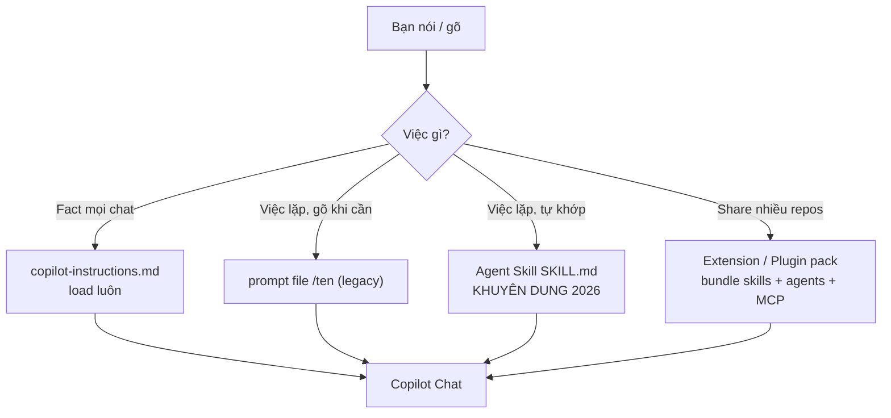
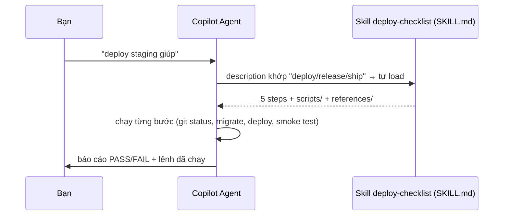

# 05 — Agent Skills & Custom Instructions (Tái Dùng Workflow Lặp Lại — Chuẩn 2026)

> **Dành cho:** dev đã dùng Copilot Chat ở mức cơ bản (xong bài 03–04) và muốn bớt gõ prompt lặp — không cần biết DevOps hay tự xây tool.
> **Vấn đề:** việc lặp lại (deploy, review, migrate, sinh test) giờ phải paste lại checklist dài mỗi lần → tốn token, dễ quên bước, team mỗi người một kiểu.
> **Đọc xong:** viết được Agent Skill `.github/skills/<ten>/SKILL.md` (chuẩn khuyến nghị 2026), đặt custom instructions đúng chỗ không loạn, biết khi nào mới cần đóng Copilot Extension. **Thời gian:** ~45 phút (bản mở rộng); chỉ cần tra mục 5–6 thì ~15 phút.
>
> **Lưu ý 2026:** `.prompt.md` (prompt files) **deprecated cho Agent Host sessions** (Copilot/Cloud) — vẫn chạy trên Local/VS Code nhưng việc mới nên ưu tiên **Agent Skills** (`SKILL.md`, chuẩn mở, port mọi nơi). Bài này dạy cả 2, khuyến nghị skill cho việc mới.

## Mục lục

1. [Agent Skill là gì — why, không chỉ what (prompt file: legacy)](#1-agent-skill-là-gì--why-không-chỉ-what-prompt-file-legacy)
2. [Sơ đồ: instructions vs skill vs agent vs extension](#2-sơ-đồ-instructions-vs-skill-vs-agent-vs-extension)
3. [Giải phẫu SKILL.md (2026 — khuyến nghị)](#3-giải-phẫu-skillmd-2026-khuyến-nghị)
4. [3 Agent Skills mẫu hoàn chỉnh (copy-paste, 2026)](#4-3-agent-skills-mẫu-hoàn-chỉnh-copy-paste-2026)
5. [Custom instructions + skills đặt ở đâu (không loạn)](#5-custom-instructions--skills-đặt-ở-đâu-không-loạn)
6. [Agent Skills — vì sao là chuẩn 2026](#6-agent-skills--vì-sao-là-chuẩn-2026)
7. [Agent Plugins: đóng gói skill + agent + MCP để share](#7-agent-plugins-đóng-gói-skill--agent--mcp-để-share)
8. [Walkthrough tạo Agent Skill từ 0 (5 bước, 2026)](#8-walkthrough-tạo-agent-skill-từ-0-5-bước-2026)
9. [Hiểu nhầm thường gặp](#9-hiểu-nhầm-thường-gặp)
10. [Pitfalls + bài tập](#10-pitfalls--bài-tập)
11. [Link chéo](#11-link-chéo)

---

## 1. Agent Skill là gì — why, không chỉ what (prompt file: legacy)

*Section này trả lời: Agent Skill dùng cho việc gì, và khi nào nên viết 1 skill thay vì gõ prompt tự nhiên hoặc dùng prompt file cũ.*

**Nôm na 1 câu:** Agent Skill là **sổ tay nghề chuẩn, tự động** — việc nào lặp lại (deploy, review, migrate) thì ghi công thức 1 lần trong `SKILL.md`. Agent tự "ngửi" thấy bạn nói "deploy" là tự mở đúng trang sổ, khỏi dặn lại, khỏi gõ `/`.

**Analogie đời thường:** Prompt file như tin nhắn ghim trong nhóm (phải chủ động mở xem). Skill như trợ lý đứng cạnh — nghe bạn nói "nấu phở" là tự mở đúng trang phở, không cần bạn gọi tên.

**Ví dụ kỹ thuật copy-paste:**

```text
KHÔNG skill (paste tay mỗi lần):
Bạn: "deploy staging giúp anh. Nhớ: check git status, migration dry-run,
  deploy, smoke test endpoints docs/endpoints.md, báo cáo PASS/FAIL..."
  → 100 tokens mỗi lần, dễ quên bước 2.

CÓ skill (.github/skills/deploy-checklist/SKILL.md):
Bạn: "deploy staging giúp" (không cần gõ /)
Agent: tự load SKILL.md đúng ngữ cảnh → chạy 5 bước → báo cáo.
```

**Ai dùng lúc nào:**

- Việc lặp >3 lần (deploy/review/migrate/sinh test) → đóng Agent Skill.
- Việc 1 lần, hỏi cho biết → prompt tự nhiên, đừng đóng file (phí).

**Agent Skill = workflow + knowledge đóng gói**, sống trong 1 folder `.github/skills/<ten>/SKILL.md`:

- **Dạng file:** folder chứa **`SKILL.md`** (frontmatter `name` + `description` + markdown) + files hỗ trợ (`scripts/`, `references/`, `examples/`).
- **Cách gọi:** agent **tự load khi ngữ cảnh khớp** (không cần gõ lệnh) — khác prompt file cũ phải gõ `/ten` tường minh.
- **Khác instructions ở chỗ:** instructions load cho **mọi chat**; skill chỉ load **khi khớp từ khóa** → rẻ hơn.

**"Frontmatter" là gì?** (khái niệm dùng lại từ bài 03)

1. **Định nghĩa 1 câu:** khối YAML đặt ở đầu file, khai báo metadata của file đó.
2. **Đời thường:** như nhãn dán trên hồ sơ bệnh án — ghi "thuốc này uống khi nào, ai kê".
3. **Kỹ thuật:** `name`, `description`, `tools`, `model` — từng field được phân tích ở mục 6.2.

**Agent Skill không làm được gì** (để khỏi nhầm với MCP/extension):

- Không tự chạy, không kết nối ra ngoài — nó là văn bản + scripts Copilot đọc và làm theo.
- Agent tự load khi ngữ cảnh khớp → kết quả ổn định hơn prompt tự nhiên (cùng input thì đi cùng quy trình — "deterministic").

**Vị trí chuẩn 2026:**

```text
.github/skills/<ten>/SKILL.md        team dùng chung, commit git (KHUYÊN DUNG — chuẩn mở)
~/.copilot/skills/<ten>/SKILL.md     cá nhân (nếu IDE hỗ trợ)
<plugin>/skills/<ten>/SKILL.md       theo Agent Plugin (mục 7, bài 09)

# Legacy (vẫn chạy trên Local/VS Code, deprecated cho Agent Host):
.github/prompts/<ten>.prompt.md       cũ — port sang skill (bài 17 mục migration)
```

```bash
# Verify skills repo đang có (copy-paste):
ls -R .github/skills/ 2>&1
# Kỳ vọng: thấy folder <ten>/SKILL.md team đã có. Trống → bạn là người viết skill đầu tiên (mục 8).
# Prompt file cũ (legacy):
ls .github/prompts/*.prompt.md 2>&1   # còn nào thì port sang skill
```

### 1.1. Vì sao Agent Skill là nâng cấp lớn nhất cho việc lặp lại? (why)

*Section này trả lời: đầu tư 1 lần cho Agent Skill, bạn được gì so với việc viết prompt mới mỗi ngày hay dùng prompt file cũ?*

**Trước skill:** mỗi lần deploy/review/migrate, bạn paste lại checklist dài vào prompt (hoặc gõ `/ten` cho prompt file). Tốn token, và dễ quên bước giữa chừng. Prompt file `.prompt.md` giờ deprecated cho Agent Host (Copilot/Cloud) — chỉ còn chạy Local.

**Sau:** checklist sống trong `SKILL.md`. Bạn chỉ cần nói "deploy staging" (không cần gõ `/`) — agent tự load, làm đủ các bước, bạn chỉ duyệt. Chạy được trên mọi harness (Local, Copilot, Cloud, CLI, app) nhờ chuẩn mở.

So sánh với các thứ khác (bài 00):

| Thứ | Nôm na | Khi nào Agent Skill thắng? | Ai dùng lúc nào |
|---|---|---|---|
| `copilot-instructions.md` | Nội quy dán tường (đọc mọi ngày) | Checklist chỉ cần lúc deploy → skill rẻ hơn | Fact cần mọi chat → instructions |
| Custom agent | Đầu bếp chuyên món (persona + tools) | Skill là *nội dung* agent chạy; agent là "ai chạy" | Cần persona riêng → agent (bài 06) |
| MCP | Cánh tay vươn ra ngoài (GitHub/DB) | Skill chứa *cách dùng* MCP (schema, format) — cặp bài trùng | Cần gọi ngoài → MCP (bài 08) |
| Extension | Combo đóng hộp bán siêu thị | Skill là đơn vị nhỏ nhất trong extension | Share ≥3 repos → extension (bài 09) |

---

## 2. Sơ đồ: instructions vs skill vs agent vs extension

*Section này trả lời: 4 khái niệm trên khác nhau ở đâu, để bạn chọn đúng thứ ngay từ câu đầu tiên.*





Đọc 2 sơ đồ theo 4 nhánh:

- **Fact cần mọi chat** → `copilot-instructions.md`, load ngay khi mở chat.
- **Việc lặp, gọi khi cần (legacy)** → prompt file `/ten` — vẫn chạy trên Local, nhưng deprecated cho Agent Host (Cloud).
- **Việc lặp, tự động (2026)** → Agent Skill `SKILL.md`, agent tự nạp khi khớp từ khóa — chuẩn khuyến nghị.
- **Share nhiều repo** → extension/plugin pack, gom cả skill + agent + MCP thành 1 hộp.

---

## 3. Giải phẫu SKILL.md (2026 — khuyến nghị)

*Section này trả lời: 1 Agent Skill gồm những phần nào, và field nào quyết định cách nó tự load.*

**Nôm na 1 câu:** Mỗi Agent Skill là **1 folder** gồm **`SKILL.md` (frontmatter: tên + description = khi nào khớp) + thân markdown (Steps)** + files phụ trợ (`scripts/`, `references/`, `examples/`). Agent *tự* mở folder này khi thấy từ khóa khớp description.

**Analogie:** như gói mì ăn liền có cả gói mì + gói nước mắm + muỗng — bạn không phải lôi từng món ra, chỉ cần nói "ăn phở" là gói phở đúng được chọn.

```markdown
---
name: deploy-checklist
description: 'Deploy staging/prod voi checklist migrate + smoke test.
  Dung khi user noi deploy, release, ship, xuat ban.'
---

# Deploy checklist

## Steps

1. `git status --short` phai sach, neu khong dung va bao.
2. Chay migration dry-run: `scripts/migrate.sh --dry-run $ARG`.
3. Deploy bang lenh da verify trong `.github/copilot-instructions.md`.
4. Smoke test endpoints trong `references/endpoints.md`.
5. Ghi ket qua theo `examples/output.md`.
```

**Biến + files hỗ trợ (ai dùng lúc nào):**

- `${input}` — args sau câu trigger. Vd user nói "deploy staging" → `input=staging`.
- `${workspaceFolder}` — repo root; dùng khi cần đường dẫn tuyệt đối.
- `scripts/` — lệnh chạy được (bash/python), agent gọi trực tiếp.
- `references/` — tài liệu dài (spec, API docs) agent đọc khi cần.
- `examples/` — output mẫu để agent làm theo đúng format.

```text
# Verify skill đã load (copy-paste test):
# Tạo .github/skills/deploy-checklist/SKILL.md + scripts/migrate.sh.
# Chat: "deploy staging giúp" (KHÔNG gõ /).
# Kỳ vọng: agent tự load skill, chạy 5 bước, báo cáo theo examples/output.md.
# Không trigger → description thiếu từ khóa "deploy" (sửa câu đầu).
```

### 3.1. Từng field frontmatter SKILL.md (khi nào dùng)

*Đọc bảng này để trả lời nhanh: field nào quyết định hành vi, và khi nào phải sửa nó.*

| Field | Nôm na | Ý nghĩa | Ví dụ | Ai dùng lúc nào |
|---|---|---|---|---|
| `name` | Tên gói mì (duy nhất) | `kebab-case`, khớp tên folder | `deploy-checklist` | Đặt 1 lần, không đổi (skill trigger theo name) |
| `description` | **Nhãn dán ngoài hộp (quan trọng nhất)** | Câu đầu = **trigger từ khóa** user nói thật; quyết định agent tự load hay không | `"Deploy staging/prod. Dung khi user noi deploy/release/ship."` | Luôn cập nhật khi thêm từ khóa mới user hay nói |
| Thân `SKILL.md` | Công thức nấu ăn | Steps đánh số + NEVER + Output mẫu (<100 dòng) | Mục 6.2 | Việc có >3 steps |
| `scripts/` | Dụng cụ đi kèm gói mì | Lệnh chạy được (bash) cho agent gọi | `scripts/migrate.sh` | Có step chạy lệnh lặp |
| `references/` | Sách tra cứu | Tài liệu dài agent đọc khi cần | `references/endpoints.md` | Checklist dài > 50 dòng |
| `examples/` | Món ăn mẫu | Output mẫu agent làm theo đúng format | `examples/output.md` | Cần output nhất quán |

### 3.2. Ma trận việc × chọn thứ nào (10 giây)

*Table này để bạn chọn giữa skill / prompt file (legacy) / instructions không cần suy nghĩ.*

| Việc | 2026 (khuyến nghị) | Legacy (vẫn chạy Local) | Ai dùng lúc nào |
|---|---|---|---|
| Fact mọi chat | `copilot-instructions.md` | cùng trái | Quy ước team |
| Việc lặp, gọi khi cần (chạy Local) | **Agent Skill** (khuyến nghị) | prompt file `/ten` | Deploy, review, migrate |
| Việc lặp, cần chạy Cloud/Agent Host | **Agent Skill** (bắt buộc) | prompt file (KHÔNG chạy Cloud) | Coding agent, Copilot harness |
| Persona chuyên biệt | Custom agent `.agent.md` (bài 06) | cùng trái | Reviewer, tester |
| Share 3+ repos | Agent Plugin (bài 09) | Extension pack | Team đa repo |

### 3.3. Port prompt file cũ sang skill (migration 5 phút)

*Đọc nếu repo bạn còn `.github/prompts/*.prompt.md` — port sang skill để chạy được Cloud/Agent Host.*

```bash
# Bước 1: tạo folder skill mới (đặt cạnh prompt cũ):
mkdir -p .github/skills/deploy-checklist
touch .github/skills/deploy-checklist/SKILL.md

# Bước 2: copy body .github/prompts/deploy.prompt.md vào SKILL.md,
# giữ frontmatter `description` (đây là trigger). Đổi tên file → `name: deploy-checklist`.

# Bước 3: tách steps dài >50 dòng vào references/ (nếu có):
mkdir -p .github/skills/deploy-checklist/{scripts,references,examples}
# copy docs/endpoints.md → references/endpoints.md (nếu skill tham khảo)

# Bước 4: xóa prompt file cũ (sau khi skill pass test):
rm .github/prompts/deploy.prompt.md

# Verify: chat "deploy staging" (KHÔNG gõ /) → skill tự load? Prompt file cũ thì không.
# Kỳ vọng: skill load + chạy đủ steps. Không load → description thiếu từ khóa.
```

---

## 4. 3 Agent Skills mẫu hoàn chỉnh (copy-paste, 2026)

*Section này trả lời: skill thật trông ra sao — 3 mẫu dưới đây chạy được ngay trên Local + Cloud + CLI, chỉ cần thay `<...>` bằng repo của bạn.*

> Mỗi mẫu là **1 folder** `.github/skills/<ten>/` chứa `SKILL.md` + (tuỳ chọn) `scripts/`, `references/`, `examples/`. Giữ `SKILL.md` <100 dòng. Mỗi mẫu kèm Verify.

### 4.1. Mẫu A — Skill `review-pr` (agent tự load khi user nói "review PR")

**Nôm na:** thuê ông giám khảo chỉ đọc bài, không được sửa bài. Khi user nói "review PR #123" → agent tự load skill này (không cần gõ `/`).

```markdown
# .github/skills/review-pr/SKILL.md
---
name: review-pr
description: 'Review PR tim bug + security + missing test.
  Dung khi user noi review, phan tich PR, kiem tra diff, "review #123".'
---

# Review PR

## Input

User noi "review PR <số>" hoac "phan tich diff branch <tên>".

## Steps

1. Doc diff (PR hoac branch hien tai): files nao doi, muc dich la gi.
2. Tim: (a) bug logic, (b) loi security (injection, authz, leak secret),
   (c) thieu test cho logic moi, (d) pha vo quy uoc trong `.github/copilot-instructions.md`.
3. KHONG nitpick style (linter lo). Chi bao loi that + file:line cu the.
4. Ket luan: APPROVE / REQUEST_CHANGES + top 3 van de theo thu tu nghiem trong.

## Cam

- NEVER sua code trong luoc review (chi doc + comment).
- NEVER de secret trong output (mat token / key).

## Output mau

- [file:line] Mo ta loi — vi sao sai — goi y sua 1-2 dong.
```

```text
# Verify mẫu A (copy-paste):
# Chat: "review PR 123 giup" (KHÔNG gõ /).
# Kỳ vọng: agent tự load skill, trả APPROVE/REQUEST_CHANGES + findings file:line,
# KHÔNG sửa code. Nếu agent sửa code → skill không rõ "chi doc" (sửa Steps).
```

### 4.2. Mẫu B — Skill `add-table` (migration an toàn + script đi kèm)

**Nôm na:** công thức thêm bàn mới vào quán — chỉ được kê thêm, cấm đập bàn cũ. Script `migrate.sh` đi kèm giúp agent chạy đúng lệnh.

```
.github/skills/add-table/
├── SKILL.md
└── scripts/
    └── migrate.sh
```

```markdown
# .github/skills/add-table/SKILL.md
---
name: add-table
description: 'Them table/column moi (forward-only migration + model + test).
  Dung khi user noi "them bang", "them cot", "them table", "migration moi".'
---

# Add table

## Input

User noi "them table <tên> cot <danh sách>".

## Steps

1. Doc schema hien tai + 1 migration mau gan nhat (copy convention).
2. Tao migration forward-only (KHONG sua migration da merge).
3. Update model + zod schema + seed neu can.
4. Chay: `scripts/migrate.sh dev` + focused test + lint. Paste output vao bao cao.
5. Dung lai: liet ke files doi + lenh verify da chay (PASS/FAIL).

## Cam

- NEVER doi schema DB trong cung PR voi logic phuc tap (tach 2 PRs).
- NEVER viet down migration pha du lieu.
```

```bash
# .github/skills/add-table/scripts/migrate.sh (chmod +x)
#!/bin/sh
# Dung luon team da verify trong copilot-instructions.md.
case "$1" in
  dev)  pnpm migrate:dev ;;     # chay local
  dry)  pnpm migrate:dry ;;     # dry-run truoc khi chay that
  *)    echo "Dung: $0 dev|dry" ; exit 1 ;;
esac
```

```text
# Verify mẫu B (copy-paste):
# Chat: "them bang orders co cot status" (KHÔNG gõ /).
# Kỳ vọng: agent load skill → chạy scripts/migrate.sh dev → migration mới + test PASS.
# Nếu agent chạy sai lệnh → check script còn `chmod +x` không.
```

### 4.3. Mẫu C — Skill `ship` (checklist xuất xưởng, có `references/`)

**Nôm na:** checklist xuất xưởng như kiểm xe trước khi giao — máy, phanh, giấy tờ đủ mới cho ra đường. Tài liệu dài nằm trong `references/`.

```
.github/skills/ship/
├── SKILL.md
└── references/
    └── changelog-format.md
```

```markdown
# .github/skills/ship/SKILL.md
---
name: ship
description: 'Xuat xuong: lint + test + review + changelog.
  Dung khi user noi ship, release, xuat ban, "can ship", "gap release".'
---

# Ship

## Steps

1. `git status --short` sach? Chua sach -> dung, bao user commit/stash truoc.
2. Chay full check theo instructions: lint + focused/full test + build.
3. Neu FAIL: fix toi da 2 vong, van fail -> dung, bao cao loi (khong co sua mai).
4. Goi noi dung review (nhu skill review-pr): tu review diff truoc khi mo PR.
5. Viet changelog entry theo `references/changelog-format.md`.
6. Bao cao: lenh da chay (PASS/FAIL) + files doi + command mo PR (khong tu merge).

## Cam

- NEVER tu merge (chi de command mo PR cho user).
- NEVER sua duinh chay qua 2 vong (dừng báo cáo).
```

```markdown
# .github/skills/ship/references/changelog-format.md
<!-- Mau changelog entry (copy-paste): -->
## [ten-doan]
- **Giới thiệu (1 câu):** ...
- **Ảnh hưởng:** ... (user nao, module nao)
- **Verify:** `pnpm test -- <module>` + `pnpm lint` (dán log PASS).
```

```text
# Verify mẫu C (copy-paste):
# Chat: "can ship branch feat/refund" (KHÔNG gõ /).
# Kỳ vọng: agent load skill → lint+test thật → FAIL dừng sau 2 vong → báo cáo
# kèm changelog đúng format. KHÔNG tự merge.
```

---

## 5. Custom instructions + skills đặt ở đâu (không loạn)

*Section này trả lời: mỗi loại file (instructions, skill, agent, prompt legacy) nằm ở đâu, commit hay không, và chọn cái nào trong 10 giây.*

**Nôm na 1 câu:** nhiều chỗ dán nội quy → phải biết tờ nào dán ở đâu, không thì loạn như nhà 5 remote TV.

| Nơi | File/setting | Commit? | Trạng thái 2026 | Khi dùng (ai dùng lúc nào) |
|---|---|---|---|---|
| Repo-wide | `.github/copilot-instructions.md` | Có | Chính thức | Quy ước mọi task (bài 03) |
| Path-scoped | `.github/instructions/*.instructions.md` | Có | Chính thức | Rules subtree (`applyTo`) |
| **Tái dùng 2026** | **`.github/skills/<ten>/SKILL.md`** | Có | **KHUYÊN DUNG (chạy Local + Cloud + CLI + app)** | Workflow lặp, agent tự load |
| Persona | `.github/agents/*.agent.md` | Có | Chính thức | Custom agent chuyên biệt |
| Tái dùng (legacy) | `.github/prompts/*.prompt.md` | Có | **Deprecated cho Agent Host** (Local vẫn chạy) | Repo cũ chưa port → giữ Local |
| Portable | `AGENTS.md` | Có | Chính thức (chuẩn mở) | Chung nhiều agent (bài 03 mục 5) |
| Personal | User settings `instructions[].text` | Không | Chính thức | Ngôn ngữ, style cá nhân |
| Org | Org policy/instructions (Business+) | Admin | Chính thức | Nhiều repo 1 chuẩn |

Quy tắc chọn nhanh (10 giây):

```text
- Fact can MOI chat -> copilot-instructions.md.
- Quy tac cho 1 SUBTREE -> *.instructions.md (applyTo).
- Viec lap lai (2026) -> Agent Skill (.github/skills/<ten>/SKILL.md).
  + Viec lap lai (việc cũ Local) -> prompt file (/ten) — vẫn chạy, port dần.
- Persona chuyen biet (reviewer chi doc) -> custom agent.
- Thu team share nhieu repo -> extension/plugin (muc 7).
```

```bash
# Kiem tra do phu (copy-paste, chay moi thang):
ls .github/copilot-instructions.md .github/instructions/ .github/skills/ .github/agents/ .github/prompts/ 2>&1
wc -l .github/copilot-instructions.md
# Ky vong: instructions <200 dong; moi SKILL.md <100 dong; moi prompt/agent <80 dong.
# Vượt -> tách checklist dài từ instructions sang skill (muc 8).
```

**Lưu ý thêm: IDE/harness nào hỗ trợ loại file nào.** Không phải harness nào cũng chạy đủ — bảng dưới lấy từ bảng tính năng Copilot 2026 (✓ đầy đủ, P một phần, ✗ không hỗ trợ):

| Tính năng | VS Code Local | Copilot/Cloud (Agent Host) | CLI | Copilot app | JetBrains |
|---|---|---|---|---|---|
| Custom instructions (`copilot-instructions.md`) | ✓ | ✓ | ✓ | ✓ | P |
| **Agent Skills (`SKILL.md`)** | ✓ | ✓ | ✓ | ✓ | P |
| Prompt files (`.prompt.md`) | ✓ | **✗ (deprecated)** | ✗ | ✗ | P |
| Custom agents (`.agent.md`) | ✓ | ✓ | ✓ | ✓ | P |

Ý nghĩa thực tế: **việc mới nên ưu tiên Agent Skill** (chạy được mọi harness, chuẩn mở). Prompt file chỉ còn giá trị khi bạn chỉ chạy Local/VS Code và chưa kịp port.

---

## 6. Agent Skills — vì sao là chuẩn 2026

### 6.1. Skill khác prompt file cũ ở đâu (bảng so sánh)

*Section này trả lời: đã có prompt file, vì sao 2026 vẫn cần skill, và chọn cái nào khi nào.*

**Nôm na 1 câu:** Skill là **prompt file tự động + chuẩn mở** — bạn khỏi gõ `/`, agent tự ngửi thấy từ khóa ("deploy", "ship") là tự mở công thức ra làm. Chạy được trên Local, Cloud, CLI, app (vì chuẩn mở, không phải riêng Copilot).

**Analogie:** Prompt file như sách nấu ăn trên kệ (cần với tay lấy, chỉ bếp nhà bạn dùng được). Skill như công ty F&B bán công thức — bếp nào cũng đọc được (VS Code, CLI, app, agent cloud), và tự động mở đúng trang khi nghe "nấu phở".

Chuẩn mở (Anthropic khởi xướng, ~40 tools hỗ trợ — Copilot 2026 đã đọc):
1 folder `.github/skills/<ten>/SKILL.md` (frontmatter `name` + `description` + markdown)
+ files hỗ trợ (`scripts/`, `references/`, `examples/`). Copilot tự dò folder skills trong repo (kể cả `.claude/skills/`), nạp khi tới lúc chứ không load từ đầu phiên. Khác prompt file ở chỗ:

| Tiêu chí | Prompt file (`.prompt.md`, legacy) | Agent Skill (`SKILL.md`, 2026) | Ai dùng lúc nào |
|---|---|---|---|
| Gọi | `/ten` tường minh (hoặc agent match) | Agent **tự load khi ngữ cảnh khớp** (không cần gõ `/`) | Muốn gõ tay chắc ăn → prompt; muốn tự động → skill |
| Chạy trên | Local/VS Code (deprecated Cloud) | **Local + Cloud + CLI + app** (chuẩn mở) | Việc cần chạy coding agent → skill |
| Chuẩn | Riêng Copilot/VS Code | Chuẩn mở — 1 skill chạy nhiều agent | Team đa-agent → skill |
| Phụ kiện | Ít (chủ yếu markdown) | `scripts/` + `references/` + `examples/` đi kèm | Cần script mẫu → skill |
| Trạng thái 2026 | **Deprecated cho Agent Host** | **Khuyến nghị** (ported mọi nơi) | Việc mới → skill; việc cũ Local → prompt file vẫn OK |

### 6.2. Giải phẫu SKILL.md (copy-paste)

> Chi tiết cấu trúc + 3 mẫu hoàn chỉnh: xem mục 3 + mục 4 (bài này).

```bash
# Cau truc folder chuan (copy-paste):
mkdir -p .github/skills/deploy-checklist/{scripts,references,examples}
touch .github/skills/deploy-checklist/SKILL.md
# Viet SKILL.md (<100 dong) + scripts/migrate.sh + references/endpoints.md + examples/output.md.
# Quy tac: description 1-2 cau (cau dau = khi nao trigger); chi tiet don vao body.
# Verify: ls .github/skills/deploy-checklist/ → phải thấy SKILL.md + 3 folders.
```

### 6.3. Khi nào skill, khi nào giữ prompt file cũ?

*Đọc block này trước khi viết: tránh viết 2 thứ cùng việc rồi chúng lệch nhau.*

```text
- Viec MOI (tinh tu nay) -> Agent Skill (chay moi harness, chuan mo).
- Viec cu Local (prompt file .prompt.md da ton tai) -> giu Local, port thang sau (muc 3.3).
- Muon agent TU load khi noi "deploy" ma khong can go / -> skill (description match).
- Can scripts/references di kem + chay da-agent -> skill.
- Chi chay Local VS Code, thich don gian, chua port -> prompt file van du.
# Verify: nói "deploy staging giúp anh" (KHÔNG gõ /) → skill tự load? Prompt file cũ thì không.
# Quy tắc: MỘT việc MỘT nơi — skill hoặc prompt file, không viết 2 bản drift nhau.
```

---

## 7. Agent Plugins: đóng gói skill + agent + MCP để share

### 7.1. Plugin là gì? (why)

*Section này trả lời: khi 3 skill/agent lẻ đã đủ, lúc nào mới phải đóng thành plugin để chia sẻ team?*

**Nôm na 1 câu:** Agent Plugin là **hộp bữa trưa đóng sẵn** (skills + agents + MCP config) để share 1 phát cho 10 repos, khỏi copy tay từng folder.

**Analogie:** Skill lẻ như gói mì 1 gói. Plugin như thùng mì 30 gói + tặng kèm bát đũa (agents, MCP) — phát cho cả team ăn cùng vị.

Plugin = đóng gói skills + agents (+ MCP config) thành 1 unit chuẩn mở (Agent Plugins 1.0, `plugin.json`),
share cho team/nhiều repo, chạy trên VS Code / Copilot CLI / app / SDK. Skill lẻ giải quyết 1 repo;
plugin giải quyết 10 repos cùng chuẩn (review format, deploy checklist, security rules).

```text
Plugin chua gi (2026 — Agent Plugins 1.0, chuan mo):
- plugin.json    (manifest: ten, version, danh sach skills/agents/MCP)
- skills/        (n SKILL.md — giong muc 3-4)
- agents/        (custom agents team — .agent.md)
- mcp.json       (MCP servers di kem, secrets qua ${input} - KHONG hardcode)
- .copilot/      (phần riêng của Copilot: rules/, hooks/ — client khác bỏ qua)
# Ai dùng lúc nào: team ≥3 repos cùng checklist → đóng plugin. 1 repo → skill lẻ đủ.
# Chi tiết plugin + governance: bai 09 + bai 17 muc Plugins.
```

### 7.2. Dùng plugin như skill (flow team)

*5 bước dưới đây để team dùng chung 1 plugin, không mỗi người cài 1 kiểu.*

```text
Buoc 1: tim plugin team can (Marketplace hoac repo noi bo).
Buoc 2: cai trong Agent Customizations hub (bai 17) hoac chat.customizations.marketplace.enabled.
Buoc 3: noi tu khoa trigger (vd "review PR", "deploy") -> agent tu load skill trong plugin.
Buoc 4: chay tren repo that, so voi skill noi bo: cai nao dung hon?
Buoc 5: chot 1 chuan (khong giu 2 workflow song song gay loan).
# Verify: noi "review PR" (KHONG go /) -> skill trong plugin co tu load?
```

```bash
# Quan ly plugin bang CLI / hub (copy-paste):
# Hub: gear icon Chat → Chat: Open Customizations → Plugins card (bai 17).
# Toggle plugin ON/OFF -> toan bo skill/agent/MCP cua plugin bi mat/hiện ra.
# Verify: plugin tat -> moi skill cua plugin biem khoi agent.
```

### 7.3. Tự đóng plugin nội bộ (khi nào đáng?)

*Bảng này để tech lead quyết: đóng plugin ngay, hay dùng cách tạm trước.*

| Dấu hiệu nên đóng plugin | Giải pháp tạm (chưa cần plugin) | Ai quyết |
|---|---|---|
| 3+ repos cùng checklist deploy | Copy skill (`.github/skills/`) qua 3 repos trước | Tech lead |
| Team >10 người, drift workflow | 1 repo template + copy files | Tech lead |
| Cần version + update có kiểm soát | Git tag cho `.github/` (chưa cần plugin.json) | Platform team |
| Onboard người mới liên tục "không biết gọi gì" | README team + hub Customizations tour 10 phút | Mentor |

> Đừng đóng plugin khi chỉ có 1 repo — skills + instructions đủ.
> Plugin đáng khi team/scale, không phải khi "cho oai".

---

## 8. Walkthrough tạo Agent Skill từ 0 (5 bước, 2026)

> 30 phút, làm 1 lần cho việc team bạn lặp >3 lần (deploy/review/migrate...).
> 5 bước dưới đây chạy đúng thứ tự: ghi lại → folder → SKILL.md + frontmatter → test → commit.

**Bước 1 — Ghi lại lần làm tay cuối (5 phút):**

```text
Mo chat, lam viec do 1 lan HOAN TOAN bang prompt tu nhien (khong dung skill).
Luu lai: ban da hoi gi, agent lam may turns, quen buoc nao, sai dau.
# Output: 1 list buoc that (ke ca buoc quen) — day la chat lieu tho.
```

**Bước 2 — Tạo folder skill (5 phút):**

```bash
mkdir -p .github/skills/<ten>/{scripts,references,examples}
touch .github/skills/<ten>/SKILL.md
# Bien ten kebab-case (vd deploy-checklist). Folder + ten phai giong hệt.
# Verify: ls .github/skills/<ten>/ → phải thấy SKILL.md + 3 folders.
```

**Bước 3 — Viết SKILL.md + frontmatter đúng (10 phút):**

```markdown
---
name: <ten-kebab-case>
description: '<viec>. Dung khi user noi <tu khoa 1>, <tu khoa 2>, <tu khoa 3>.'
---

# <Ten doc duoc>

## Steps
1. ...
2. ...

## Cam
- NEVER ...
```

```text
<!-- Check: description cau dau co chua TU KHOA user se noi THAT khong? (triet suc trigger) -->
<!-- Body <100 dong: Steps danh so + Cam (NEVER) + Output mau. Chi tiet dai -> references/. -->
```

**Bước 4 — Test 2 vòng (7 phút):**

```text
# Vong 1: noi tu khoa (VD "deploy staging") tren repo that, quan sat.
# Ghi lai: agent co TU load skill (khong go /)? buoc nao bo qua? output co dung mau khong?
# Sua SKILL.md (them buoc quen, cham description nen trigger, lam ro output mau).
# Vong 2: mo chat MOI, noi tu khoa lan nua. Ky vong: pass khong can sua gi.
```

**Bước 5 — Commit + onboard team (3 phút):**

```bash
git add .github/skills/<ten>/
git commit -m "feat(skills): them skill <ten> cho <viec>"
git push origin feat/skill-<ten>
# Nhan team review nhu code: co buoc thua? co thieu NEVER nao khong?
# Sau merge: bao team 1 cau "tu nay noi '<tu khoa>' la agent tu lam, khong can paste checklist".
# Verify: teammate khác checkout branch, nói từ khóa → skill chạy (không chỉ máy bạn).
```

Checklist xong khi:

- [ ] `SKILL.md` <100 dòng, frontmatter đủ `name` + `description` (trigger từ khóa).
- [ ] 2 vòng test pass (nói từ khóa, KHÔNG gõ `/`) không cần sửa giữa chừng.
- [ ] Team review + merge, có 1 người ngoài bạn chạy được.

---

## 9. Hiểu nhầm thường gặp

*6 câu "nghe hợp lý nhưng sai" dưới đây — đọc trước khi viết skill đầu tiên để khỏi sửa lại.*

| Hiểu nhầm | Sự thật |
|---|---|
| "Prompt file `.prompt.md` vẫn là chuẩn, skill là tuỳ chọn" | Đổi. 2026: **skill là khuyến nghị**, prompt file deprecated cho Agent Host (Cloud). Việc mới → skill |
| "Skill càng dài càng kỹ" | Sai. `SKILL.md` >100 dòng → agent bỏ bước. Steps gọn + chi tiết dài → `references/` |
| "`description` viết cho hay là được" | Sai. Description = **trigger**: câu đầu phải = từ khóa user nói thật ("deploy/release/ship"). Thiếu → skill không bao giờ load |
| "Skill thay được custom agent" | Sai. Skill = nội dung (làm gì, tự load), agent = người chạy (persona + tools + scope). Cần persona riêng → agent (bài 06) |
| "Để secret trong skill cho tiện" | Sai. Chỉ ghi "lấy từ 1Password <tên>", KHÔNG paste giá trị (bài 07). Secret trong repo = lộ |
| "Đóng plugin ngay cho chuyên nghiệp" | Sai. 1 repo → skill lẻ đủ. Plugin chỉ đáng khi ≥3 repos cùng chuẩn (mục 7.3) |

---

## 10. Pitfalls + bài tập

*Section này trả lời: skill thường hỏng ở đâu (8 pitfall), và 4 bài tập để bạn luyện tay trong ~70 phút.*

| Pitfall | Vì sao xảy ra | Fix |
|---|---|---|
| `SKILL.md` 200 dòng copy wiki | Nhét cả tài liệu vào body | Body <100 dòng, tài liệu dài → `references/` + 1 dòng link |
| `description` chung chung ("hỗ trợ deploy") | Agent không biết khi nào load | Câu đầu = trigger: "Dùng khi user nói deploy/release/ship" |
| Skill + prompt file cũ cùng 1 việc, drift | Viết 2 nơi không sync | Port prompt file → skill (mục 3.3), xóa bản cũ sau khi pass test |
| 2 skill trùng tên/khác nội dung | Mỗi người viết 1 kiểu | 1 việc 1 skill, review như code, xóa bản thua |
| Skill không bao giờ trigger | `description` thiếu từ khóa thật | Thêm đúng từ user nói ("deploy", "ship", "release") vào câu đầu |
| Script trong skill thiếu `chmod +x` | Agent gọi `scripts/x.sh` báo "command not found" | `chmod +x .github/skills/<ten>/scripts/*` + commit |
| Để secret trong skill + commit | Paste `.env` mẫu cho "tiện" | Chỉ ghi "lấy từ 1Password <tên>", KHÔNG paste giá trị |
| Chạy skill trên Cloud nhưng skill chỉ viết cho Local | Prompt file cũ không chạy Cloud (deprecated) | Port sang skill chuẩn mở (mục 3.3) — skill chạy mọi harness |

### Bài tập thực hành

**Bài 1 (20 phút) — Skill đầu tay:**
Lấy việc team bạn lặp >3 lần (deploy/review/migrate...), tạo `.github/skills/<ten>/SKILL.md`
theo mẫu mục 4. Test: nói từ khóa (KHÔNG gõ `/`) xem agent có tự load không. Ghi số turns trước/sau.

**Bài 2 (15 phút) — Description trigger drill:**
Lấy skill bài 1, cố tình xóa 1 từ khóa trigger trong `description`, chạy lại → ghi khác biệt.
Đổi lại đúng + thêm 1 từ khóa user hay nói. Giải thích 2 câu vì sao description quan trọng nhất.

**Bài 3 (20 phút) — Port prompt file cũ sang skill:**
Lấy 1 `.github/prompts/<ten>.prompt.md` sẵn có, port thành `.github/skills/<ten>/SKILL.md` (mục 3.3).
Xóa prompt file cũ sau khi skill pass test. Test cả Local + (nếu có) Cloud.

**Bài 4 (15 phút) — Dedupe:**
Chạy lệnh mục 5, liệt kê mọi skills/prompts/agents trong repo. Tìm trùng lặp
(2 files cùng việc). Gộp hoặc xóa, giữ 1 chuẩn duy nhất (skill cho việc 2026) cho team.

---

## 11. Link chéo

*Đi tiếp các bài dưới đây nếu bạn cần phần còn lại của bức tranh.*

- **[Bài 00 — Tổng quan](./00-tong-quan-copilot.md)**: bản đồ extension — skill/agent/plugin nằm đâu.
- **[Bài 03 — Instructions](./03-instructions-memory-rules.md)**: tách checklist dài từ instructions sang skill.
- **[Bài 04 — Chat commands](./04-chat-commands-toan-tap.md)**: `/skills`, `/agents` — commands mở card trong hub (bài 17).
- **[Bài 06 — Custom agents](./06-custom-agents-parallel.md)**: `.agent.md` — persona + tools; skill là *nội dung* agent chạy.
- **[Bài 08 — MCP](./08-mcp-ket-noi-cong-cu-ngoai.md)**: skill chứa *cách dùng* MCP tools (schema, format).
- **[Bài 09 — Agent Plugins](./09-extensions-marketplaces.md)**: đóng gói skill + agent + MCP thành plugin chuẩn mở.
- **[Bài 10 — Policies](./10-modes-permissions-availability.md)**: org duyệt plugin/skill nào được cài.
- **[Bài 17 — Agent Customizations Hub](./17-agent-customizations-hub.md)**: hub quản lý Skills/Plugins/Agents/MCP/Hooks + migrations (prompt→skill).
