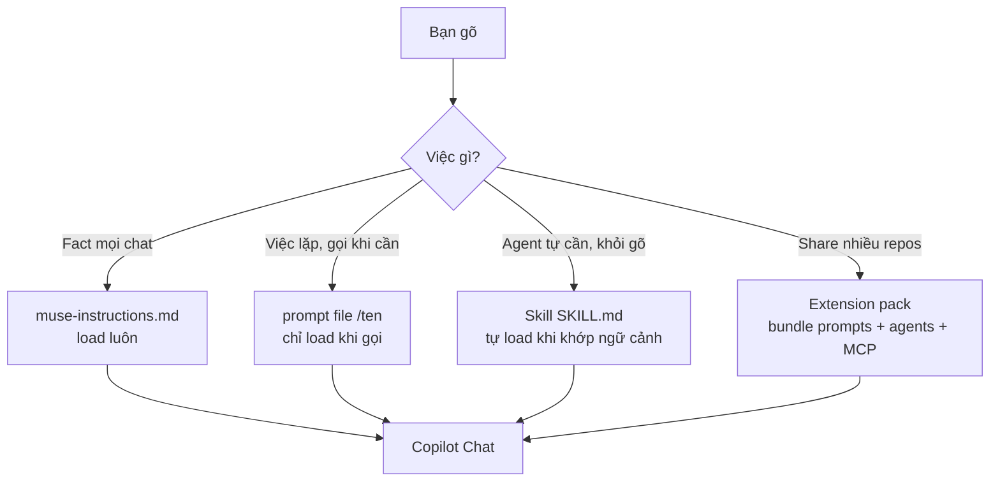
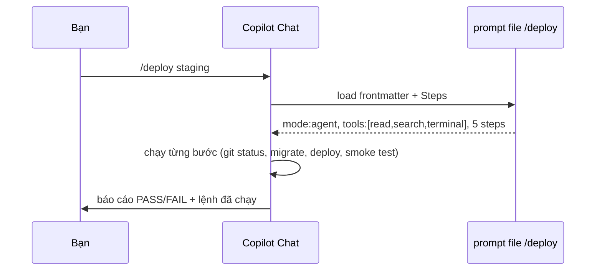

# 05 — Prompt Files & Custom Instructions (Tái Dùng Workflow Lặp Lại)

> Bài 05 của series (tương đương Skills bên Claude Code). Đọc xong bạn viết được
> `.github/prompts/*.prompt.md` chuẩn (mode/agent/tools frontmatter), custom
> instructions đúng chỗ, Agent Skills (`.github/skills/*/SKILL.md` 2026), và dùng
> Copilot Extensions như skills. Thời gian: ~45 phút (bản mở rộng).

## Mục lục

1. [Prompt file là gì — why, không chỉ what](#1-prompt-file-là-gì--why-không-chỉ-what)
2. [Sơ đồ: instructions vs prompt file vs skill vs extension](#2-sơ-đồ-instructions-vs-prompt-file-vs-skill-vs-extension)
3. [Giải phẫu .prompt.md (mode/agent/tools frontmatter)](#3-giải-phẫu-promptmd-modeagenttools-frontmatter)
4. [3 prompt files mẫu hoàn chỉnh](#4-3-prompt-files-mẫu-hoàn-chỉnh-copy-paste)
5. [Custom instructions đặt ở đâu (không loạn)](#5-custom-instructions-đặt-ở-đâu-không-loạn)
6. [Agent Skills (.github/skills/*/SKILL.md 2026)](#6-agent-skills-githubskills-skillmd-2026)
7. [Copilot Extensions as skills](#7-copilot-extensions-as-skills)
8. [Walkthrough tạo prompt file từ 0 (5 bước)](#8-walkthrough-tạo-prompt-file-từ-0-5-bước)
9. [Hiểu nhầm thường gặp](#9-hiểu-nhầm-thường-gặp)
10. [Pitfalls + bài tập](#10-pitfalls--bài-tập)
11. [Link chéo](#11-link-chéo)

---

## 1. Prompt file là gì — why, không chỉ what

**Nôm na 1 câu:** Prompt file là **công thức nấu ăn dán trên tủ lạnh** — việc nào lặp lại (deploy, review, migrate) thì viết công thức 1 lần, lần sau gọi `/tên` là Copilot nấu đúng 8 bước, khỏi dặn lại.

**Analogie đời thường:** Như tin nhắn ghim trong nhóm chat gia đình: "đi chợ mua: rau, thịt, mắm..." — thay vì mỗi lần gọi điện dặn lại 10 món (tốn pin, dễ quên), ghim 1 tin là mọi người tự xem.

**Ví dụ kỹ thuật copy-paste:**

```text
KHÔNG prompt file (paste tay mỗi lần):
Bạn: "deploy staging giúp anh. Nhớ: check git status, migration dry-run,
  deploy, smoke test endpoints docs/endpoints.md, báo cáo PASS/FAIL..."
  → 100 tokens mỗi lần, dễ quên bước 2.

CÓ prompt file (.github/prompts/deploy.prompt.md):
Bạn: "/deploy staging"
Copilot: tự chạy đúng 5 bước trong file → báo cáo.
```

**Ai dùng lúc nào:**

- Việc lặp >3 lần (deploy/review/migrate/sinh test) → đóng prompt file.
- Việc 1 lần, hỏi cho biết → prompt tự nhiên, đừng đóng file (phí).

Prompt file = **workflow đóng gói**: 1 file `.github/prompts/<ten>.prompt.md`
(frontmatter YAML + markdown hướng dẫn). Gọi bằng `/ten` trong Chat, hoặc agent
tự load khi ngữ cảnh khớp. Khác instructions ở chỗ: instructions load **mọi chat**,
prompt file chỉ load **khi gọi** → rẻ.

- Không tự chạy, không kết nối ra ngoài (khác MCP/extension).
- Gọi tường minh `/deploy`, `/review-pr` — determinism cao hơn prompt tự nhiên.
- Vị trí chuẩn 2026:

```text
.github/prompts/<ten>.prompt.md     team dung chung, commit git (QUAN TRONG NHAT)
~/.copilot/prompts/<ten>.prompt.md  ca nhan, moi repo (neu IDE ho tro)
<extension>/prompts/<ten>.prompt.md theo extension (namespaced)
```

```bash
# Verify prompt files repo đang có (copy-paste):
ls -R .github/prompts/ 2>&1
# Kỳ vọng: thấy *.prompt.md team đã có. Trống → bạn là người viết file đầu tiên (mục 8).
```

### 1.1. Vì sao đây là nâng cấp lớn nhất cho việc lặp lại? (why)

Trước prompt files: mỗi lần deploy/review/migrate bạn paste lại checklist dài vào
prompt (tốn tokens, dễ quên bước). Sau: checklist sống trong repo, gọi `/deploy`
1 phát — Copilot tự làm đúng 8 bước, bạn chỉ duyệt.

So sánh với các thứ khác (bài 00):

| Thứ | Nôm na | Khi nào prompt file thắng? | Ai dùng lúc nào |
|---|---|---|---|
| `muse-instructions.md` | Nội quy dán tường (đọc mọi ngày) | Checklist chỉ cần lúc deploy → prompt file rẻ hơn | Fact cần mọi chat → instructions |
| Custom agent | Đầu bếp chuyên món (persona + tools) | Prompt file là nội dung agent chạy; agent là "ai chạy" | Cần persona riêng → agent (bài 06) |
| MCP | Cánh tay vươn ra ngoài (GitHub/DB) | Prompt file chứa *cách dùng* MCP (schema, format) — cặp bài trùng | Cần gọi ngoài → MCP (bài 08) |
| Extension | Combo đóng hộp bán siêu thị | Prompt file là đơn vị nhỏ nhất trong extension | Share ≥3 repos → extension (bài 09) |

---

## 2. Sơ đồ: instructions vs prompt file vs skill vs extension





---

## 3. Giải phẫu .prompt.md (mode/agent/tools frontmatter)

**Nôm na 1 câu:** Mỗi prompt file gồm **đầu (frontmatter: mode là gì, được dùng tools nào, khi nào dùng)** + **thân (Steps đánh số + Cấm + Output mẫu)**.

**Analogie:** Như đơn thuốc: đầu ghi "thuốc này uống khi nào, ai kê" (description), thân ghi "sáng 1 viên, tối 1 viên, kiêng gì" (steps + NEVER).

```markdown
---
mode: agent
model: default
tools: ['read', 'search', 'terminal']
description: 'Deploy staging/prod voi checklist migrate + smoke test.'
---

# Deploy

Nhan `${input}` (vd `/deploy staging`).

## Steps

1. `git status --short` phai sach, neu khong dung va bao.
2. Chay migration dry-run truoc, doc output xac nhan khong co destructive change.
3. Deploy bang lenh team da verify trong `.github/muse-instructions.md`.
4. Smoke test endpoints trong `docs/endpoints.md`.
5. Ghi ket qua theo mau `Dung [PASS/FAIL] + lenh da chay + output tom tat`.

Tham khao: `docs/endpoints.md`. Repo root: `${workspaceFolder}`.
```

**Biến dùng được (ai dùng lúc nào):** `${input}` (args sau `/ten`, vd `/deploy staging` → input=staging), `${workspaceFolder}` (repo root để đường dẫn tuyệt đối), `${file}` (file đang mở — dùng khi review file hiện tại), `${selection}` (vùng bôi đen — dùng khi fix đoạn chọn).

```text
# Verify biến (copy-paste test):
# Tạo file test .github/prompts/echo.prompt.md với nội dung "Input là ${input}, root là ${workspaceFolder}".
# Chat: "/echo hello" → phải thấy "hello" + path repo thật.
# Kỳ vọng: biến expand đúng. Không expand → bản VS Code cũ, update.
```

### 3.1. Từng field frontmatter (khi nào dùng)

| Field | Nôm na | Ý nghĩa | Ví dụ | Ai dùng lúc nào |
|---|---|---|---|---|
| `mode` | Chế độ lái (số sàn/số tự động) | `ask` / `edit` / `agent` — mode khi chạy file này | `agent` cho deploy, `ask` cho review đọc | Deploy/sửa → agent; chỉ đọc → ask |
| `model` | Chọn xe nào chạy | Ép model (`default` = theo picker) | Model mạnh cho review sâu | Review khó → model mạnh; việc dễ → default rẻ |
| `tools` | Chìa khóa trao cho giúp việc | Allowlist tools trong lượt gọi | `['read', 'search']` cho review read-only | Chỉ đọc → khóa terminal; cần chạy → mở terminal |
| `description` | Nhãn dán ngoài hộp (**quan trọng nhất**) | Khi nào dùng file này (quyết định gợi ý + auto-load) | `"Deploy staging/prod. Dung khi user noi deploy/release/ship."` | Câu đầu phải chứa từ user nói thật |
| `input-hint` | Gợi ý hiện trong `/` menu | `<staging\|prod>` | Thấy ngay cần truyền gì |

### 3.2. Ma trận `mode` × việc (chọn 10 giây)

| Việc | `mode` | `tools` gợi ý | Ai dùng lúc nào |
|---|---|---|---|
| Deploy/ship (sửa + chạy) | `agent` | `read, search, terminal` | Cần chạy lệnh thật |
| Review PR (chỉ đọc + comment) | `ask` | `read, search` | Sợ agent sửa nhầm → khóa ở ask |
| Fix nhỏ có scope | `edit` | `read, search` | Sửa 1-3 files đã biết |
| Sinh test theo mẫu | `agent` | `read, search, terminal` (chạy test verify) | Sinh xong phải chạy test chứng minh pass |

---

## 4. 3 prompt files mẫu hoàn chỉnh (copy-paste)

> Mỗi mẫu chạy được ngay sau khi thay `<...>` bằng repo bạn. Giữ <80 dòng/file.
> Mỗi mẫu kèm Verify để test ngay.

### 4.1. Mẫu A — `/review-pr` (ask, read-only)

**Nôm na:** Thuê ông giám khảo chỉ đọc bài, không được sửa bài.

```markdown
---
mode: ask
tools: ['read', 'search']
description: 'Review PR tim bug + security. Dung khi user noi review/pr.'
---

# Review PR

## Input

Nhan `${input}` (PR number hoac branch, vd `/review-pr 123`).

## Steps

1. Doc diff (PR hoac branch hien tai): files nao doi, muc dich la gi.
2. Tim: (a) bug logic, (b) loi security (injection, authz, leak secret),
   (c) thieu test cho logic moi, (d) pha vo quy uoc trong `.github/muse-instructions.md`.
3. KHONG nitpick style (linter lo). Chi bao loi that + file:line cu the.
4. Ket luan: APPROVE / REQUEST_CHANGES + top 3 van de theo thu tu nghiem trong.

## Output mau

- [file:line] Mo ta loi — vi sao sai — goi y sua 1-2 dong.
```

```text
# Verify mẫu A: Chat "/review-pr 123" (PR thật).
# Kỳ vọng: trả APPROVE/REQUEST_CHANGES + findings có file:line, KHÔNG sửa code.
# Nếu agent sửa code → mode sai (phải ask, không phải agent).
```

### 4.2. Mẫu B — `/add-table` (agent, migration an toàn)

**Nôm na:** Công thức thêm bàn mới vào quán — chỉ được kê thêm, cấm đập bàn cũ.

```markdown
---
mode: agent
tools: ['read', 'search', 'terminal']
description: 'Them table/column moi (forward-only migration + model + test).'
---

# Add table

## Input

Nhan `${input}` (vd `/add-table orders them column status`).

## Steps

1. Doc schema hien tai + 1 migration mau gan nhat (copy convention).
2. Tao migration forward-only (KHONG sua migration da merge).
3. Update model + zod schema + seed neu can.
4. Chay: migrate dev + focused test + lint. Paste output vao bao cao.
5. Dung lai: liet ke files doi + lenh verify da chay (PASS/FAIL).

## Cam

- NEVER doi schema DB trong cung PR voi logic phuc tap (tach 2 PRs).
- NEVER viet down migration pha du lieu.
```

```text
# Verify mẫu B: chạy trên DB dev, check migration mới tạo + focused test PASS.
# Kỳ vọng: không sửa migration cũ (git diff migrations/ chỉ thêm file mới).
```

### 4.3. Mẫu C — `/ship` (agent, checklist xuất xưởng)

**Nôm na:** Checklist xuất xưởng như kiểm xe trước khi giao: máy, phanh, giấy tờ đủ mới cho ra đường.

```markdown
---
mode: agent
tools: ['read', 'search', 'terminal']
description: 'Xuat xuong: lint + test + review + changelog. Dung khi user noi ship/release.'
---

# Ship

## Steps

1. `git status --short` sach? Chua sach -> dung, bao user commit/stash truoc.
2. Chay full check theo instructions: lint + focused/full test + build.
3. Neu FAIL: fix toi da 2 vong, van fail -> dung, bao cao loi (khong co sua mai).
4. Goi noi dung review (mau A): tu review diff truoc khi mo PR.
5. Viet changelog entry (1-3 dong: lam gi, anh huong ai, cach verify).
6. Bao cao: lenh da chay (PASS/FAIL) + files doi + command mo PR (khong tu merge).
```

```text
# Verify mẫu C: chạy /ship trên branch test.
# Kỳ vọng: lint+test chạy thật, FAIL thì dừng sau 2 vòng (không sửa vô hạn), không tự merge.
```

---

## 5. Custom instructions đặt ở đâu (không loạn)

**Nôm na 1 câu:** Nhiều chỗ dán nội quy → phải biết tờ nào dán ở đâu, không thì loạn như nhà 5 remote TV.

Nhiều nơi để được instructions → loạn nếu không có quy ước. Học thuộc bảng này:

| Nơi | File/setting | Commit? | Khi dùng (ai dùng lúc nào) |
|---|---|---|---|
| Repo-wide | `.github/muse-instructions.md` | Có | Quy ước mọi task (bài 03) |
| Path-scoped | `.github/instructions/*.instructions.md` | Có | Rules subtree (`applyTo`) |
| Tái dùng | `.github/prompts/*.prompt.md` | Có | Workflow gọi bằng `/ten` (bài này) |
| Persona | `.github/agents/*.agent.md` | Có | Custom agent chuyên biệt |
| Portable | `AGENTS.md` | Có | Chung nhiều agent (bài 03 mục 5) |
| Personal | User settings `instructions[].text` | Không | Ngôn ngữ, style cá nhân |
| Org | Org policy/instructions (Business+) | Admin | Nhiều repo 1 chuẩn |

Quy tắc chọn nhanh (10 giây):

```text
- Fact can MOI chat -> muse-instructions.md.
- Quy tac cho 1 SUBTREE -> *.instructions.md (applyTo).
- Viec lap lai, goi KHI CAN -> prompt file (/ten).
- Persona chuyen biet (reviewer chi doc) -> custom agent.
- Thu team share nhieu repo -> extension (muc 7).
```

```bash
# Kiem tra do phu (copy-paste, chay moi thang):
ls .github/muse-instructions.md .github/instructions/ .github/prompts/ .github/agents/ 2>&1
wc -l .github/muse-instructions.md
# Ky vong: instructions <200 dong; prompts/agents moi file <80 dong.
# Vượt → tách checklist dài từ instructions sang prompt file (bài này).
```

---

## 6. Agent Skills (.github/skills/*/SKILL.md 2026)

### 6.1. Skill là gì? (why cần khi đã có prompt files?)

**Nôm na 1 câu:** Skill là **prompt file tự động** — bạn khỏi gõ `/`, agent tự ngửi thấy từ khóa ("deploy", "ship") là tự mở công thức ra làm.

**Analogie:** Prompt file như sách nấu ăn trên kệ (cần với tay lấy). Skill như trợ lý đứng cạnh, nghe bạn nói "nấu phở" là tự mở đúng trang phở.

Chuẩn mở cuối 2025 (Anthropic khởi xướng, ~40 tools hỗ trợ — Copilot 2026 đã đọc):
1 folder `.github/skills/<ten>/SKILL.md` (frontmatter `name` + `description` + markdown)
+ files hỗ trợ (`scripts/`, `references/`, `examples/`). Khác prompt file ở chỗ:

| Tiêu chí | Prompt file (`.prompt.md`) | Agent Skill (`SKILL.md`) | Ai dùng lúc nào |
|---|---|---|---|
| Gọi | `/ten` tường minh (hoặc agent match) | Agent **tự load khi ngữ cảnh khớp** (không cần gõ `/`) | Muốn gõ tay chắc ăn → prompt; muốn tự động → skill |
| Chuẩn | Riêng Copilot/VS Code | Chuẩn mở — 1 skill chạy nhiều agent | Team đa-agent → skill |
| Phụ kiện | Ít (chủ yếu markdown) | `scripts/` + `references/` + `examples/` đi kèm | Cần script mẫu → skill |
| Khi dùng | Workflow bạn chủ động gọi | Knowledge agent tự cần (style-guide, checklist ngầm) | Checklist ngầm → skill |

### 6.2. Giải phẫu SKILL.md (copy-paste)

```markdown
---
name: deploy-checklist
description: Deploy staging/prod voi checklist migrate + smoke test. Dung khi user noi deploy/release/ship.
---

# Deploy checklist

## Steps

1. `git status --short` phai sach, neu khong dung va bao.
2. Chay migration dry-run: `scripts/migrate.sh --dry-run $ARG` (script trong skill folder).
3. Deploy + smoke test endpoints trong `references/endpoints.md`.
4. Ghi ket qua theo `examples/output.md`.
```

```bash
# Cau truc folder chuan (copy-paste):
mkdir -p .github/skills/deploy-checklist/{scripts,references,examples}
touch .github/skills/deploy-checklist/SKILL.md
# Viet SKILL.md (<100 dong) + scripts/migrate.sh + references/endpoints.md + examples/output.md.
# Quy tac: description 1-2 cau (cau dau = khi nao trigger); chi tiet don vao body.
# Verify: ls .github/skills/deploy-checklist/ → phải thấy SKILL.md + 3 folders.
```

### 6.3. Khi nào skill, khi nào prompt file?

```text
- User chu dong go /ten moi lan -> prompt file (deterministic, de nho).
- Muon agent TU load khi noi "deploy" ma khong can go / -> skill (description match).
- Can scripts/references di kem + chay da-agent -> skill.
- Team chi dung Copilot, thich don gian -> prompt file du.
- Team dung 2-3 agent khac nhau -> skill (viet 1 lan, chay moi noi).
# Verify: nói "deploy staging giúp anh" (KHÔNG gõ /) → skill tự load? Prompt file thì không.
```

---

## 7. Copilot Extensions as skills

### 7.1. Extension là gì? (why)

**Nôm na 1 câu:** Extension là **combo đóng hộp** (prompts + agents + MCP) để share 1 phát cho 10 repos, khỏi copy tay từng file.

**Analogie:** Prompt file lẻ như gói mì 1 gói. Extension như thùng mì 30 gói + tặng kèm bát đũa (agents, MCP) — phát cho cả team ăn cùng vị.

Extension = đóng gói prompts + agents (+ MCP config) thành 1 unit cài được,
share cho team/nhiều repo. Prompt file lẻ giải quyết 1 repo; extension giải quyết
10 repos cùng chuẩn (review format, deploy checklist, security rules).

```text
Extension chua gi (2026):
- prompts/   (n .prompt.md — giong muc 3-4)
- agents/    (custom agents team — .agent.md)
- docs/      (references link tu prompts)
- README + version (de update co kiem soat)
# Ai dùng lúc nào: team ≥3 repos cùng checklist → đóng extension. 1 repo → prompt lẻ đủ.
```

### 7.2. Dùng extension như skill (flow team)

```text
Buoc 1: tim extension team can (Marketplace hoac repo noi bo).
Buoc 2: cai vao VS Code / approve o org (Business+: admin duyet).
Buoc 3: go / trong Chat -> thay /ten tu extension (vd /team-review).
Buoc 4: chay tren repo that, so voi prompt file noi bo: cai nao dung hon?
Buoc 5: chot 1 chuan (khong giu 2 workflow song song gay loan).
# Verify: gõ / trong Chat → phải thấy /team-review từ extension.
```

```bash
# Quan ly extensions bang CLI (copy-paste):
code --list-extensions | grep -i copilot
# Verify: phải thấy extension team. Thấy 2 /review khác nhau → giữ 1, gỡ kia.
# Go bot khi 2 extensions cung cap 1 lenh (vd 2 /review khac nhau):
# -> giu 1, go cai kia. 2 skill trung ten = agent chon beu.
```

### 7.3. Tự đóng extension nội bộ (khi nào đáng?)

| Dấu hiệu nên đóng extension | Giải pháp tạm (chưa cần extension) | Ai quyết |
|---|---|---|
| 3+ repos cùng checklist deploy | Copy prompt file qua 3 repos trước | Tech lead |
| Team >10 người, drift workflow | 1 repo template + copy files | Tech lead |
| Cần version + update có kiểm soát | Git submodule/tag cho `.github/prompts/` | Platform team |
| Onboard người mới liên tục "không biết gọi gì" | README team + `/prompts` tour 10 phút | Mentor |

> Đừng đóng extension khi chỉ có 1 repo — prompt files + skills đủ.
> Extension đáng khi team/scale, không phải khi "cho oai".

---

## 8. Walkthrough tạo prompt file từ 0 (5 bước)

> 30 phút, làm 1 lần cho việc team bạn lặp >3 lần (deploy/review/migrate...).

**Bước 1 — Ghi lại lần làm tay cuối (5 phút):**

```text
Mo chat, lam viec do 1 lan HOAN TOAN bang prompt tu nhien (khong prompt file).
Luu lai: ban da hoi gi, agent lam may turns, quen buoc nao, sai dau.
# Output: 1 list buoc that (ke ca buoc quen) — day la chat lieu tho.
```

**Bước 2 — Viết file nháp (10 phút):**

```bash
mkdir -p .github/prompts
# Chon mau A/B/C muc 4 gan nhat, copy, sua lai cho viec cua ban.
# Giu <80 dong: Steps danh so + Cam (NEVER) + Output mau. Khong viet van.
# Verify: wc -l .github/prompts/<ten>.prompt.md → phải <80.
```

**Bước 3 — Gắn frontmatter đúng (5 phút):**

```markdown
---
mode: agent
tools: ['read', 'search', 'terminal']
description: '<viec> . Dung khi user noi <tu khoa kich hoat>.'
---

<!-- Check: mode dung chua (muc 3.2)? tools co thua (cho phep terminal khi chi can doc)? -->
<!-- description cau dau co chua tu khoa user se noi that khong? -->
```

**Bước 4 — Test 2 vòng (7 phút):**

```text
# Vong 1: go /ten (vd /deploy staging) tren repo that, quan sat.
# Ghi lai: buoc nao agent bo qua? tools nao goi thua? output co dung mau khong?
# Sua file (them buoc quen, chat tools thua, lam ro output mau).
# Vong 2: mo chat MOI, go /ten lan nua. Ky vong: pass khong can sua prompt.
```

**Bước 5 — Commit + onboard team (3 phút):**

```bash
git add .github/prompts/<ten>.prompt.md
git commit -m "feat(prompts): them /<ten> cho <viec>"
git push origin feat/prompt-<ten>
# Nhan team review nhu code: co buoc thua? co thieu NEVER nao khong?
# Sau merge: bao team 1 cau "tu nay <viec> go /<ten>, dung prompt tay nua".
# Verify: teammate khác checkout branch, gõ /ten chạy được (không chỉ máy bạn chạy được).
```

Checklist xong khi:

- [ ] File <80 dòng, frontmatter đủ `mode/tools/description`.
- [ ] 2 vòng test pass không cần sửa prompt giữa chừng.
- [ ] Team review + merge, có 1 người ngoài bạn chạy được.

---

## 9. Hiểu nhầm thường gặp

| Hiểu nhầm | Sự thật |
|---|---|
| "Prompt file càng dài càng kỹ" | Sai. >80 dòng → agent bỏ bước. Steps gọn + link sang `docs/` |
| "`description` viết cho hay là được" | Sai. Description quyết định gợi ý/auto-load. Câu đầu phải = từ khóa user nói thật ("deploy/release/ship") |
| "Prompt file thay được custom agent" | Sai. Prompt = nội dung (làm gì), agent = người chạy (ai + tools nào). Việc cần persona riêng → vẫn cần agent (bài 06) |
| "Skill và prompt file là 1" | Sai. Prompt gọi tay `/ten`, skill tự load khi khớp ngữ cảnh. Chọn theo mục 6.3 |
| "Để secret trong prompt file cho tiện" | Sai. Chỉ ghi "lấy từ 1Password <tên>", KHÔNG paste giá trị (bài 07) |
| "Đóng extension ngay cho chuyên nghiệp" | Sai. 1 repo → prompt lẻ đủ. Extension chỉ đáng khi ≥3 repos (mục 7.3) |

---

## 10. Pitfalls + bài tập

| Pitfall | Vì sao xảy ra | Fix |
|---|---|---|
| Prompt file 200 dòng copy wiki | Nhét cả tài liệu vào Steps | Steps <80 dòng, tài liệu dài → file `docs/` + 1 dòng link |
| `description` chung chung ("hỗ trợ deploy") | Agent không biết khi nào load | Câu đầu = trigger: "Dùng khi user nói deploy/release/ship" |
| `mode: agent` + `tools` full cho việc chỉ đọc | Copy frontmatter mẫu không sửa | Việc đọc → `mode: ask`, `tools: ['read','search']` |
| 2 prompt files trùng tên/khác nội dung | Mỗi người viết 1 kiểu | 1 việc 1 file, review như code, xóa bản thua |
| Skill không bao giờ trigger | `description` thiếu từ khóa thật | Thêm đúng từ user nói ("deploy", "ship", "release") vào câu đầu |
| Skill + prompt file cùng việc, drift nhau | Viết 2 nơi không sync | Chọn 1 (mục 6.3), xóa hoặc link bản kia về bản chính |
| Để secret trong prompt file + commit | Paste `.env` mẫu cho "tiện" | Chỉ ghi "lấy từ 1Password <tên>", KHÔNG paste giá trị |
| Đóng extension khi chỉ có 1 repo | "Cho oai" | 1 repo → prompt files/skills đủ; extension để khi scale |

### Bài tập thực hành

**Bài 1 (20 phút) — Đóng gói việc lặp:**
Lấy việc team bạn lặp >3 lần (deploy/review/migrate...), viết 1 prompt file
theo mẫu A/B/C. Test 2 vòng mục 8 bước 4. Ghi số turns trước/sau khi dùng file.

**Bài 2 (15 phút) — Frontmatter drill:**
Lấy file bài 1, thử đổi `mode: agent → ask` rồi chạy lại. Ghi khác biệt:
tools nào mất, output khác gì. Đổi lại đúng mode + giải thích 2 câu vì sao.

**Bài 3 (20 phút) — Skill đầu tay:**
Chuyển 1 prompt file sẵn có thành `.github/skills/<ten>/SKILL.md` + 1 file
`references/` đi kèm. Test: nói từ khóa (không gõ `/`) xem agent có tự load không.

**Bài 4 (15 phút) — Dedupe:**
Chạy lệnh mục 5, liệt kê mọi prompts/skills/agents trong repo. Tìm trùng lặp
(2 files cùng việc). Gộp hoặc xóa, giữ 1 chuẩn duy nhất cho team.

---

## 11. Link chéo

- **Bài 00 — Tổng quan**: bản đồ extension — prompt file/skill/extension nằm đâu.
- **Bài 03 — Instructions**: tách checklist dài từ instructions sang prompt file.
- **Bài 04 — Chat commands**: `/prompts`, `/skills`, `/agents` — commands gọi files bài này.
- **Bài 06 (README) — Custom agents**: `.agent.md` dùng prompt files làm nội dung chạy.
- **Bài 08 (README) — MCP**: prompt file chứa *cách dùng* MCP tools.
- **Bài 09 (README) — Extensions**: đóng gói bài này thành unit phân phối team.
- **Bài 10 (README) — Policies**: org duyệt extension nào được cài.
