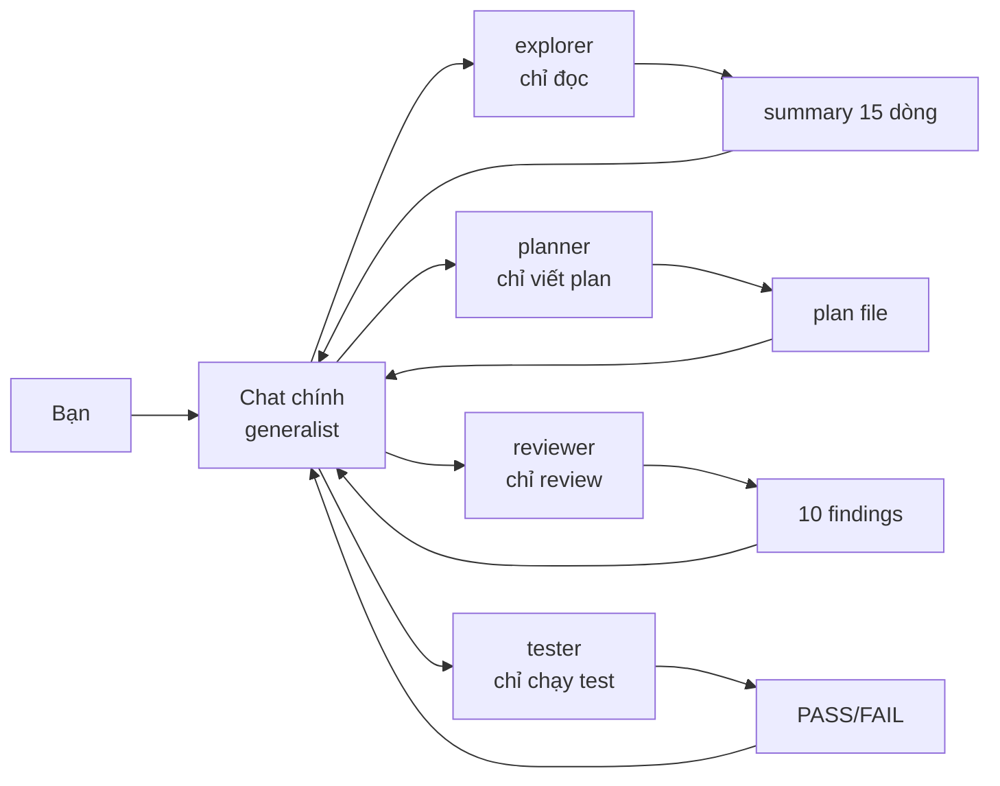
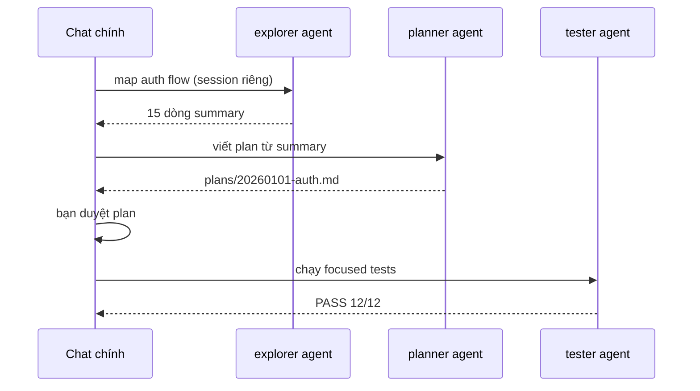

# 06 — Custom Agents & Chạy Song Song (Parallel Copilot)

> Bài 06 của series. Đọc xong bạn viết được 4 custom agents hoàn chỉnh,
> biết khi nào dùng `@workspace` vs custom agent, và chạy song song 3 sessions
> mà không giẫm chân. Thời gian: ~45 phút (bản mở rộng).

## Mục lục

1. [Vì sao cần custom agent? (why)](#1-vì-sao-cần-custom-agent-why)
2. [`@workspace` vs custom agent — chọn 30 giây](#2-workspace-vs-custom-agent--chọn-30-giây)
3. [Sơ đồ: generalist vs custom agents vs song song](#3-sơ-đồ-generalist-vs-custom-agents-vs-song-song)
4. [Anatomy file `.agent.md`](#4-anatomy-file-agentmd-frontmatter--body)
5. [4 agents mẫu hoàn chỉnh (copy-paste)](#5-4-agents-mẫu-hoàn-chỉnh-copy-paste)
6. [Chạy song song: 3 cách](#6-chạy-song-song-3-cách-copy-paste)
7. [Orchestration patterns + cost math](#7-orchestration-patterns--cost-math-premium-requests)
8. [Hiểu nhầm thường gặp](#8-hiểu-nhầm-thường-gặp)
9. [Walkthrough + pitfalls + bài tập](#9-walkthrough-step-by-step)
10. [Link chéo](#10-link-chéo)

---

## 1. Vì sao cần custom agent? (why)

**Nôm na 1 câu:** Custom agent là **thuê chuyên gia theo việc** — thay vì 1 ông tổng quát vừa đọc vừa sửa vừa test (rối + ồn), bạn thuê ông trinh sát (chỉ đọc), ông kiến trúc sư (chỉ vẽ plan), ông kiểm định (chỉ test).

**Analogie đời thường:** Như sửa nhà: bạn (chat chính) là chủ nhà. Thay vì tự leo trèo đo đạc 50 phòng (bẩn + mệt), bạn thuê đội khảo sát (explorer) đo xong đưa bạn tờ giấy 15 dòng "phòng nào nứt, phòng nào an toàn". Phần ồn (bụi, số đo) ở lại bên đội khảo sát, nhà bạn (context chat chính) vẫn sạch.

**Ví dụ kỹ thuật copy-paste:**

```text
KHÔNG agent (chat chính đọc 50 files):
Bạn: "auth flow hoạt động thế nào?"
Copilot đọc 50 files → context đầy → câu sau hỏi tiếp bị quên/quá tải.

CÓ agent (explorer làm ồn thay):
Bạn: "dùng agent explorer map auth flow, trả summary 15 dòng"
Explorer đọc 50 files ở session riêng → trả bạn 15 dòng.
→ Chat chính còn chỗ để implement.
```

**Ai dùng lúc nào:**

- Task phụ **đọc nhiều, ồn nhiều, không cần nhớ lâu** → ném sang agent chuyên để chat chính sạch.
- Task 1 bước ("đọc file X") → hỏi trực tiếp, spawn agent là lỗ (overhead).

Muse mặc định là generalist: bạn hỏi gì nó làm nấy. Custom agent là
generalist + **persona hẹp + tools hẹp + instructions hẹp**. Xong việc nó trả
**tóm tắt**, phần ồn ở lại bên nó.

Lợi ích bạn cảm nhận ngay:

- **Giữ context sạch:** explorer đọc 50 files, chat chính chỉ nhận 15 dòng summary.
- **Enforce chuẩn team:** reviewer luôn check OWASP, tester luôn chạy `pnpm test` focused.
- **Tái dùng cross-repo:** agents để ở repo hoặc org-level, teammate mới dùng ngay.
- **Tiết kiệm premium requests:** việc dễ route sang model rẻ, việc khó giữ model mạnh.

Giá phải trả: mỗi lần spawn agent tốn overhead (nạp instructions + tools defs).
Task 1 bước ("đọc file X") spawn agent = lỗ. Task research 50 files = lời.
Trần thực tế: **3 sessions song song**, quá là bạn không review nổi.

```text
So sánh nhanh + Verify:
- Hỏi trực tiếp: "giải thích file auth.ts" → làm luôn, rẻ, nhanh.
- Custom agent: "research toàn bộ auth module (30 files) rồi tóm tắt" → đáng spawn.
- Quy tắc: <5 files → hỏi trực tiếp. >10 files hoặc cần persona riêng → custom agent.
# Verify: đếm files task bạn sắp làm (search đếm). <5 → đừng spawn.
```

---

## 2. `@workspace` vs custom agent — chọn 30 giây

**Nôm na 1 câu:** `@workspace` là **hỏi anh bảo vệ tòa nhà** (biết hết, hỏi gì đáp nấy, nhanh). Custom agent là **thuê thám tử** (giao việc 3 ngày, trả báo cáo gọn, có chuẩn riêng).

**Analogie:** Cần biết "phòng 302 ở đâu?" → hỏi bảo vệ (`@workspace`). Cần "điều tra toàn bộ lịch sử 30 hộ tầng 3 trong 1 tuần" → thuê thám tử (explorer agent).

| Cách | Nôm na là gì | Khi nào | Ví dụ copy-paste | Ai dùng lúc nào |
|---|---|---|---|---|
| `@workspace` | Bảo vệ biết hết tòa nhà | Hỏi nhanh, task 1 lần | `@workspace auth flow hoạt động thế nào?` | Task 1 lần, cần đáp ngay |
| Custom agent | Thám tử thuê theo vụ | Việc lặp lại, cần chuẩn cố định | `dùng agent explorer map auth flow` | Việc lặp mỗi ngày theo chuẩn team |
| Prompt files (`.prompt.md`) | Tờ checklist in sẵn | Quy trình ngắn, 1 bước | `/review-pr` | Quy trình 1 bước (bài 05) |
| Coding agent (GitHub) | Đội thi công gửi đi xa | Task độc lập, không cần trông | `Fix issue #123` giao cho agent | Task 30 phút, ra PR draft (bài 11/12) |

```text
Cây quyết định 30 giây (dán lên màn hình):
Task 1 lần, hỏi cho biết? → @workspace.
Việc lặp mỗi ngày theo chuẩn team? → custom agent.
Quy trình ngắn 1 bước? → prompt file (bài 05).
Task độc lập 30 phút, không cần trông? → coding agent (bài 11/12).
Chỉ là "làm theo chuẩn X"? → instructions (bài 03), đừng spawn agent.
# Verify: task hiện tại của bạn rơi vào nhánh nào? Gọi đúng 1 loại, đừng spawn thừa.
```

Điểm khác load-bearing: `@workspace` dùng tools mặc định của bạn. Custom agent
**khóa tools** trong frontmatter — dù bạn dụ "sửa luôn giúp anh" thì agent
read-only vẫn không sửa được.

---

## 3. Sơ đồ: generalist vs custom agents vs song song





---

## 4. Anatomy file `.agent.md` (frontmatter + body)

**Nôm na 1 câu:** File `.agent.md` gồm **thẻ căn cước (frontmatter: tên, khi nào gọi, được dùng tools gì, model nào, trả về kiểu gì)** + **bản mô tả công việc (body: làm mấy bước, output mẫu, cấm gì)**.

**Analogie:** Như hồ sơ nhân viên: frontmatter là "tên, chức vụ, quyền hạn (được vào kho nào), lương (model rẻ/đắt)". Body là "JD: mỗi sáng làm gì, báo cáo mẫu nào, việc gì cấm".

Vị trí (theo thứ tự ưu tiên, 2026):

```text
.github/agents/<ten>.agent.md     # repo-level, commit cho team (khuyên dùng)
.vscode/agents/<ten>.agent.md     # legacy VS Code, vẫn chạy
~/.copilot/agents/<ten>.agent.md  # personal, mọi repo (tùy bản VS Code)
# Ai dùng lúc nào: team → .github/agents (commit). Cá nhân → ~/.copilot.
```

Frontmatter đầy đủ (copy-paste khung):

```yaml
---
name: explorer
description: Research codebase read-only, trả summary gọn. Dùng khi cần map module trước khi sửa.
tools: [search, read, grep]       # allowlist — ngoài list không gọi được
model: gpt-4o                     # hoặc claude-sonnet-4, gemini-2.5-pro
handoff: summary-only             # summary-only | full | plan-file
target: vscode                    # vscode | github-coding-agent | cli
---
```

| Field | Nôm na | Bắt buộc? | Ý nghĩa | Ai dùng lúc nào |
|---|---|---|---|---|
| `name` | Tên nhân viên | Có | Slug gọi agent (`dùng agent explorer ...`) | Đặt ngắn, động từ rõ (explorer, tester) |
| `description` | Khi nào gọi anh này | Có | Quyết định auto-trigger. 1–2 câu, nhiều từ khóa task | Câu đầu chứa từ user nói thật ("research", "review security") |
| `tools` | Chìa khóa kho | Nên có | Allowlist. Read-only agents khóa `edit` | Sợ sửa nhầm → chỉ cho search/read/grep |
| `model` | Lương (rẻ/đắt) | Nên có | Route việc dễ → model rẻ, việc khó → model mạnh | Tester/explorer → rẻ; reviewer/planner → mạnh |
| `handoff` | Cách bàn giao | Tùy | `summary-only` = chỉ trả tóm tắt (giữ chat chính sạch) | Muốn sạch → summary-only; muốn plan file → plan-file |
| `target` | Làm ở công trường nào | Tùy | Agent chạy ở đâu (VS Code vs coding agent cloud) | Local → vscode; giao cloud → github-coding-agent |

Body = persona + quy trình + output format. Viết như viết skill (bài 05):
steps numbered, lệnh cụ thể, output format bắt buộc, non-goals rõ ràng.

```markdown
<!-- Khung body chuẩn (copy khung này cho mọi agent mới) -->
Bạn là <vai trò>. <1 câu tôn chỉ>.

Quy trình:
1. <bước 1 + lệnh cụ thể>
2. <bước 2>
3. <bước 3>

Output (bắt buộc, tối đa N dòng):
- <mục 1>
- <mục 2>

Cấm:
- <việc không được làm 1>
- <việc không được làm 2>
```

```text
# Verify anatomy (copy-paste):
# Sau khi tạo .agent.md, mở Chat mới, gõ "/" hoặc "@" → phải thấy agent mới.
# Chat: "dùng agent <ten> làm <việc>" → check: tools ngoài allowlist có bị chặn? Model đúng?
# Kỳ vọng: agent chỉ dùng tools cho phép, output đúng format body.
```

---

## 5. 4 agents mẫu hoàn chỉnh (copy-paste)

> Đặt vào `.github/agents/`. Commit. Mở Chat view mới để load.
> Mỗi agent kèm nôm na + verify.

### 5.1. Agent 1 — Explorer (read-only research)

**Nôm na:** Ông trinh sát chỉ nhìn, cấm sờ hiện trường.

```markdown
---
name: explorer
description: Research codebase read-only, trả summary gọn. Dùng khi cần tìm files liên quan, hiểu module, map dependencies trước khi sửa.
tools: [search, read, grep]
model: gpt-4o
handoff: summary-only
---

Bạn là explorer. Chỉ đọc, KHÔNG sửa.

Nhiệm vụ: với yêu cầu của user, tìm TẤT CẢ files liên quan và trả summary.

Quy trình:
1. Bắt đầu bằng search tên file/symbol → grep nội dung → read top 5-10 files liên quan nhất.
2. Không đọc cả file 1000 dòng — đọc phần liên quan (symbol, function).
3. Ghi lại: mỗi file 1 dòng (path + vai trò + có cần sửa không).

Output (bắt buộc, tối đa 30 dòng):
- **Files sẽ sửa**: path + 1 câu vì sao
- **Files chỉ đọc tham khảo**: path + 1 câu
- **Rủi ro**: chỗ nào dễ vỡ nếu sửa

Cấm: lan man lịch sử, paste cả file vào report, đề xuất refactor ngoài scope.
```

```text
# Gọi mẫu (Chat view):
@workspace / dùng agent explorer tìm mọi file liên quan tới POST /login rate-limit, trả summary theo format của nó
# Verify: summary ≤30 dòng? Có lan man paste cả file? Có sửa code (phải KHÔNG)?
```

### 5.2. Agent 2 — Planner (viết plan, không đụng source)

**Nôm na:** Ông kiến trúc sư chỉ vẽ bản vẽ, cấm cầm búa đóng.

```markdown
---
name: planner
description: Viết implementation plan chi tiết (goals/files/steps/verify). Dùng khi task multi-file cần duyệt trước khi code.
tools: [search, read, grep]
model: claude-sonnet-4
handoff: plan-file
---

Bạn là planner. Viết plan, KHÔNG sửa source.

Quy trình:
1. Đọc code liên quan (search → grep → read như explorer).
2. Viết plan vào `plans/<YYYYMMDD>-<ten-task>.md` theo khung:
   - Goals (đo được) / Non-goals (nói rõ không làm gì)
   - Files (sửa file nào, thêm file nào, mỗi file làm gì)
   - Steps (từng bước + lệnh verify sau mỗi bước)
   - Risks (chỗ dễ vỡ + rollback)
3. Trình plan, chờ duyệt. Không tự implement.

Output: path plan file + tóm tắt 10 dòng để chat chính duyệt nhanh.
```

```text
# Gọi mẫu:
dùng agent planner viết plan migrate auth từ JWT sang session, ghi vào plans/, không code
# Verify: có file plans/*.md? Có Goals/Non-goals/Files/Steps/Risks? Có sửa source (phải KHÔNG)?
```

### 5.3. Agent 3 — Security reviewer (read-only + git diff)

**Nôm na:** Ông thanh tra chỉ soi lỗi, cấm sửa hộ (để người viết tự sửa mà nhớ).

```markdown
---
name: security-reviewer
description: Review code tìm lỗ hổng bảo mật. Dùng khi có diff chạm auth/input/crypto/payment.
tools: [read, grep, search]
model: claude-sonnet-4
handoff: summary-only
---

Bạn là security reviewer. Chỉ đọc, không sửa.

1. Đọc diff (`git diff main...HEAD`) → liệt kê thay đổi.
2. Check theo: injection, authZ, secrets, crypto yếu, SSRF, mass assignment, rate-limit thiếu.
3. Trả về: [SEVERITY] file:line — mô tả — gợi ý fix. Không lan man.

Quy trình chi tiết:
1. `git diff --stat` → scope. Diff >20 files → báo quá lớn, review theo batch.
2. Đọc từng file đổi + file test kèm (có test cho path mới?).
3. Calibration: nếu repo có lịch sử findings, so để bớt dễ dãi/khắt khe.

Output: tối đa 10 findings `[CRITICAL|HIGH|MED|LOW] file:line — mô tả — fix`.
Không finding = nói rõ "đã check X, Y, Z — không thấy issue" (đừng im lặng).
```

```text
# Verify: cho reviewer xem PR cố ý có SQL injection → phải bắt được + gắn CRITICAL + file:line.
```

### 5.4. Agent 4 — Tester (chạy test, báo pass/fail)

**Nôm na:** Ông kiểm định chỉ bấm máy test rồi dán tem PASS/FAIL, cấm sửa máy.

```markdown
---
name: tester
description: Chạy tests liên quan, báo pass/fail + root-cause guess. Dùng sau mỗi change để verify.
tools: [run-terminal, read]
model: gpt-4o-mini
handoff: summary-only
---

Bạn là tester. Chạy test, báo cáo, không sửa source.

Quy trình:
1. Đọc muse-instructions.md lấy lệnh test focused (vd `pnpm --filter @acme/api test <path>`).
2. Chạy focused trước, full chỉ khi được yêu cầu rõ.
3. Test flaky (pass/fail ngẫu nhiên) → ghi "FLAKY" + dừng đoán, không argue.
4. Fail → báo: lệnh chạy, failures (tối đa 10 dòng log quan trọng), 1-line root-cause guess.

Output:
- `PASS (n/n)` hoặc `FAIL (x/y)` + failures gọn
- Root-cause guess 1 dòng (ghi rõ là guess, không chắc chắn)
- Lệnh đã chạy (để chat chính reproduce)
```

```bash
# Cài 4 agents (copy-paste):
mkdir -p .github/agents
# Tạo explorer.agent.md, planner.agent.md, security-reviewer.agent.md, tester.agent.md
# với nội dung trên. Commit + push.
git add .github/agents && git commit -m "chore: add 4 copilot custom agents" && git push
# Verify: mở VS Code Chat → gõ "/" hoặc "@" → phải thấy agents mới.
# Kỳ vọng: 4 agents hiện. Không thấy → chưa mở Chat view mới (cần reload để load).
```

> `description` quá dài (>500 ký tự) → auto-trigger kém. Giữ 1–2 câu,
> chi tiết dồn vào body.

---

## 6. Chạy song song: 3 cách (copy-paste)

**Nôm na:** Như mở 3 bếp cùng nấu: bếp 1 hầm xương (explorer), bếp 2 xào rau (planner), bạn đứng nêm chính (code tay). Gom lại thành mâm.

### 6.1. Cách 1 — VS Code multi-chat (nhanh nhất, local)

**Ai dùng lúc nào:** Task research local, cần nhanh, không cần cloud.

```text
Chat 1 (explorer): "dùng agent explorer map auth flow, trả 15 dòng"
Chat 2 (planner):  "dùng agent planner viết plan cho billing refactor"
Chat 3 (bạn code tay): phần critical

Mở: Ctrl+Shift+I (mở thêm Chat view) → "+" new session.
Mỗi chat 1 nhiệm vụ, không paste output chat này sang chat kia (giữ sạch).
Gom: copy 2 summaries vào chat chính → viết plan → implement.
# Verify: 3 chats độc lập? Chat chính chỉ nhận summaries (không bị ồn 50 files)?
```

### 6.2. Cách 2 — Multi coding-agent sessions (cloud, cho task độc lập)

**Ai dùng lúc nào:** 2 issues độc lập, giao cloud chạy qua đêm, sáng review PRs.

```bash
# Giao 2 issues độc lập cho 2 coding agents (chạy trên github.com):
gh issue list --repo acme/api --label "ready" --limit 5

# Cách A — từ web: mở issue → Assign to Copilot (button) → mỗi issue 1 session.
# Cách B — từ CLI (cần gh + extension coding agent):
gh copilot assign 123 --repo acme/api
gh copilot assign 124 --repo acme/api

# Theo dõi:
gh copilot status --repo acme/api
# Mỗi session ra 1 branch copilot/* + 1 PR draft riêng (xem bài 11).
# Verify: 2 PR drafts riêng? Không chung branch (giẫm nhau)?
```

### 6.3. Cách 3 — Agent Tasks / multi-terminal (local, cho fan-out nhỏ)

**Ai dùng lúc nào:** Việc ồn nền (đọc logs 2000 dòng) mà bạn vẫn muốn code tay tiếp.

```text
VS Code 2026: Chat view → "New Agent Task" (background task) cho việc ồn:
- Task 1: "đọc toàn bộ logs CI 2000 dòng + tóm tắt 10 dòng"
- Task 2: "quét docs/ tìm API conventions lỗi thời"
Bạn tiếp tục code tay, tasks chạy nền, ping khi xong.

Nguyên tắc: N ≤ 3 concurrent. Quá là bạn không review nổi + bill premium nổ.
# Verify: bạn vẫn code được trong lúc tasks chạy? Kết quả tasks chỉ 10 dòng gọn?
```

```bash
# Quy ước branch cho parallel (tránh giẫm — chi tiết bài 11):
git fetch origin
git checkout -b feat/login-rate-limit origin/main   # session 1
git worktree add ../api-worktrees/feat-billing -b feat/billing origin/main  # session 2
git worktree list  # xác nhận mỗi session 1 checkout riêng
# Kỳ vọng: 2 worktrees riêng. Chung branch → conflict chắc chắn.
```

---

## 7. Orchestration patterns + cost math (premium requests)

### 7.1. 4 patterns thực chiến (nôm na + ai dùng lúc nào)

```text
Pattern A — Parallel research (nhanh nhất cho task mới):
Chat 1: explorer map auth flow. Chat 2: explorer map DB schema.
→ gom 2 summaries → viết plan → implement.
Lời khi research >10 files (làm trực tiếp sẽ pollute chat chính).
Ai dùng: task mới, chưa biết gì về codebase.

Pattern B — Chain (chắc nhất cho task khó):
explorer → planner → (bạn duyệt) → implement (Agent mode) → tester → reviewer
→ mỗi stage gate 1 lần. Chậm nhưng ít sai nhất.
Ai dùng: task khó, multi-file, cần duyệt từng nấc.

Pattern C — Adversarial review (chất nhất cho PR quan trọng):
implementer (viết code) || reviewer fresh-chat (review diff + plan, không biết implementer nghĩ gì)
→ reviewer không mang định kiến → bắt được lỗi implementer tự mù.
Reviewer quá khắt → dặn "chỉ flag lỗi thực sự, đừng over-engineer".
Ai dùng: PR quan trọng chạm auth/payment.

Pattern D — Isolation (sạch nhất cho task ồn):
"đọc logs CI 2000 dòng + tóm tắt 10 dòng" → ném sang agent/task nền.
Chat chính chỉ nhận 10 dòng, không bao giờ thấy 2000 dòng gốc.
Ai dùng: task ồn, đọc nhiều mà nhớ ít.
```

### 7.2. Cost math — premium requests multiplier (tính trước khi fan-out)

> Copilot tính **premium requests**: model mạnh (Claude Sonnet/GPT-5/o-series)
> tốn multiplier (x1–x10 tùy model), model rẻ (GPT-4o-mini) tốn ít hoặc 0.
> Số liệu chính xác xem billing dashboard — công thức dưới để nhẩm.

```text
Công thức nhẩm:
  cost_session ≈ số turns × multiplier_model
  total        ≈ N_sessions × cost_session + cost_gom (bạn đọc N summaries)

Ví dụ 1 — 3 sessions song song (2 explorer rẻ + 1 implement mạnh):
  2 × (5 turns × x0.3 mini) + 1 × (10 turns × x1 sonnet) ≈ 3 + 10 = ~13 đơn vị.
  Single-chat đọc 50 files trực tiếp: ~15 turns × x1 = ~15 + pollute context.
  → Multi rẻ tương đương nhưng chat chính sạch → còn chỗ implement.

Ví dụ 2 — Task 1 bước ("đọc file X"):
  spawn agent: overhead + 1 turn. Hỏi trực tiếp: 1 turn.
  → ĐỪNG spawn. Hỏi @workspace luôn.

Ví dụ 3 — 5 coding agents overnight:
  5 × (20 turns × x1) = ~100 đơn vị + 5 PRs cần review sáng mai.
  → Đắt tiền + đắt thời gian review. Đáng khi deadline dí, không đáng ngày thường.

Quy tắc:
- N ≤ 3 concurrent (trần review của con người).
- Task <5 files → hỏi trực tiếp, đừng spawn.
- Luôn route việc dễ (tester, explorer) sang model rẻ trong frontmatter.
- Check bill: github.com → Settings → Billing → Copilot usage. Hỏi "tuần rồi
  sessions nào đáng, sessions nào phí?" mỗi thứ 6.
```

```bash
# Kiểm tra model + usage (copy-paste):
# VS Code: Chat view → model picker (góc dưới) → xem multiplier tag (x1, x3...).
# Web: github.com/settings/copilot → Usage → premium requests theo ngày/user.
# CLI: gh copilot usage --since 2026-09-01  # tùy extension version
# Verify: tuần rồi model nào ngốn nhất? Có session nào dùng sonnet cho việc dễ (phí)?
```

---

## 8. Hiểu nhầm thường gặp

| Hiểu nhầm | Sự thật |
|---|---|
| "Spawn agent luôn nhanh hơn" | Sai. Task <5 files spawn lỗ overhead. Chỉ spawn khi >10 files hoặc cần persona riêng |
| "`@workspace` và custom agent là 1" | Sai. `@workspace` = hỏi nhanh tools mặc định. Agent = khóa tools + persona + chuẩn team |
| "Cho agent full tools cho mạnh" | Sai. Read-only agents phải khóa `edit` — dù bạn dụ "sửa luôn" cũng không sửa được (đây là guard) |
| "Chạy 5 sessions cho nhanh" | Sai. Trần 3 — quá là bill nổ + bạn review không xuể + conflict branch |
| "Description viết dài cho kỹ" | Sai. >500 ký tự → auto-trigger kém. 1-2 câu nhiều từ khóa, chi tiết dồn body |
| "Reviewer fresh-chat là phí" | Sai. Reviewer không biết implementer nghĩ gì → bắt lỗi mù mà implementer miss (pattern C) |

---

## 9. Walkthrough step-by-step

### 9.1. Walkthrough: agent đầu tiên tới parallel (30 phút)

```text
Bước 1 (10 phút): mkdir -p .github/agents, copy 2 agents (explorer + tester, mục 5).
  Commit + push. Mở Chat mới, gọi: "dùng agent explorer tìm files liên quan tới
  [module bạn đang làm]". Kiểm tra: summary ≤30 dòng? Có lan man?
  # Verify: summary gọn? Không sửa code?

Bước 2 (10 phút): test parallel research:
  Mở 2 Chat views. Chat 1: explorer map auth flow. Chat 2: explorer map DB schema.
  Gom 2 summaries vào chat 3 → viết plan.
  # Verify: chat 3 sạch (chỉ summaries, không ồn)?

Bước 3 (10 phút): test chain + reviewer:
  "dùng agent planner viết plan cho [task], rồi dùng agent security-reviewer
  review plan đó". Duyệt plan. Rồi: Agent mode implement → tester chạy focused tests.
  # Verify: mỗi stage có gate duyệt? Tester báo PASS/FAIL + lệnh reproduce?
```

### 9.2. Khi nào KHÔNG dùng custom agent

| Tình huống | Chọn | Vì sao | Ai dùng lúc nào |
|---|---|---|---|
| "Deploy theo checklist" | Prompt file `/deploy` | Knowledge, không cần persona riêng | Việc lặp đơn giản (bài 05) |
| "Đọc file X giải thích" | `@workspace` trực tiếp | 1 turn, spawn phí overhead | Task 1 file |
| "Hỏi nhanh giữa task" | Chat inline (`Ctrl+I`) | Giữ context, không cần session mới | Fix nhỏ giữa dòng |
| "Research 30 files" | Explorer agent | Ồn, cần cô lập | Research lớn |
| "Review PR quan trọng" | Reviewer fresh-chat | Không định kiến người viết | PR chạm auth/payment |
| "Task độc lập 30 phút" | Coding agent cloud | Không cần trông, ra PR draft | Việc giao qua đêm |

### 9.3. Pitfalls + fix

| Pitfall | Vì sao | Fix |
|---|---|---|
| Spawn 5 sessions → bill nổ + review không xuể | Không tính cost trước | Trần 3, tính theo mục 7.2 |
| `description` dài → agent không auto-trigger | Từ khóa chìm trong câu dài | 1–2 câu, nhiều từ khóa task |
| Reviewer quá khắt (flag mọi thứ) | Không định nghĩa "finding" | Dặn "chỉ flag lỗi thực sự" + calibration |
| Agent sửa lung tung ngoài scope | `tools` quá rộng | Read-only agents khóa `edit`, chỉ cho `search/read/grep` |
| 2 sessions cùng branch → conflict | Không quy ước branch | Mỗi session 1 branch `feat/*` + worktree riêng (bài 11) |
| Tester chạy full suite 20 phút | Không dặn focused | Body tester: focused trước, full chỉ khi yêu cầu rõ |

### 9.4. Bài tập thực hành

**Bài 1 (20 phút):** Cài 4 agents mục 5. Test explorer + tester lên repo thật.
So sánh số turns vs hỏi trực tiếp — khi nào spawn lời?

**Bài 2 (20 phút):** Chạy pattern B (chain) cho 1 task multi-file:
explorer → planner → implement → tester. Ghi output mỗi stage.

**Bài 3 (15 phút):** Chạy pattern C (adversarial): implementer viết,
reviewer fresh-chat review. Đếm findings reviewer bắt được mà implementer miss.

**Bài 4 (15 phút, cost):** Fan-out 2 explorers model rẻ, ghi usage dashboard.
Tính theo công thức mục 7.2: có đáng không? Thử lại với 1 session — chênh bao nhiêu?

---

## 10. Link chéo

- **Bài 03 — Instructions, Memory, Rules:** `muse-instructions.md` vs agent body — cái nào cho facts, cái nào cho persona.
- **Bài 04 — Chat commands:** `@workspace`, `/`, `#file`, model picker dùng kèm agents.
- **Bài 05 — Prompt files:** prompt file 1 bước vs custom agent multi-bước — khi nào nâng cấp.
- **Bài 07 — Policies & guardrails:** khóa `tools` agent + MCP allowlist + content exclusion (defense in depth).
- **Bài 08 — MCP:** agents gọi MCP tools (github, postgres) — prune servers để agents chọn đúng.
- **Bài 10 — Modes & permissions:** Ask/Edit/Agent modes + tool approval khi agents chạy.
- **Bài 11 — Worktrees & checkpoints:** mỗi session 1 worktree + 1 branch `copilot/*`, rewind khi đi sai.
- **Bài 12 — SDK & CI:** coding agent assign, `gh copilot` CLI, Actions auto-review.

---
*(Hết bài 06 — bản mở rộng. Tiếp theo: Bài 07 — Policies & guardrails tự động hóa.)*
