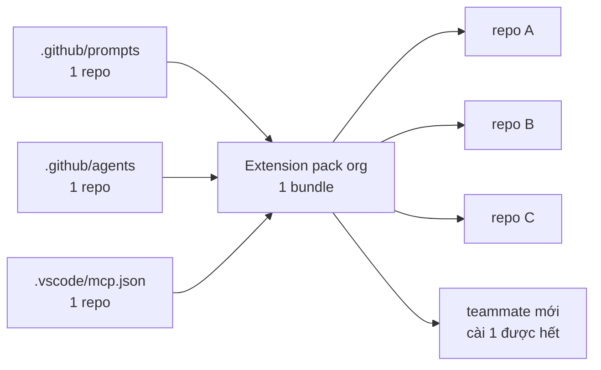
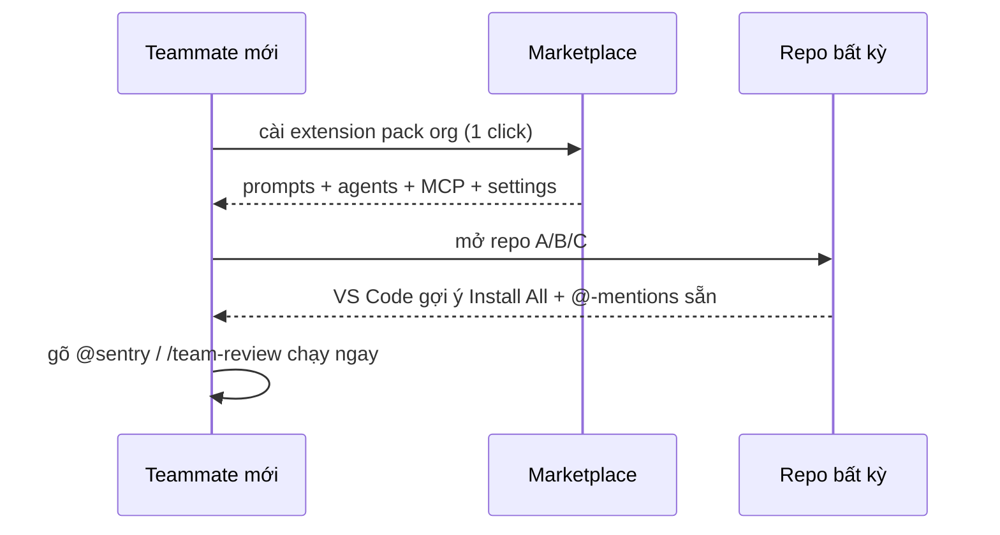

# 09 — Extensions & Marketplaces (Đóng Gói Cho Team)

> Bài 09 của series. Đọc xong bạn phân biệt được Copilot Extensions vs VS Code
> extensions, cài đúng cách, set org policy allow/block + version pin cho team.
> Thời gian: ~40 phút (bản mở rộng).

## Mục lục

1. [Vì sao extensions? (why)](#1-vì-sao-extensions-why)
2. [Sơ đồ: từ file lẻ tới extension pack](#2-sơ-đồ-từ-file-lẻ-tới-extension-pack)
3. [2 loại extensions — đừng nhầm](#3-2-loại-extensions--đừng-nhầm)
4. [Copilot Extensions: GitHub Apps expose skills cho @-mention](#4-copilot-extensions-github-apps-expose-skills-cho--mention)
5. [VS Code extensions: Copilot-related packs](#5-vs-code-extensions-copilot-related-packs)
6. [Cài + pin version (copy-paste)](#6-cài--pin-version-copy-paste)
7. [Org-level extension policy: allow/block](#7-org-level-extension-policy-allowblock)
8. [Hiểu nhầm thường gặp](#8-hiểu-nhầm-thường-gặp)
9. [Walkthrough + pitfalls + bài tập](#9-walkthrough--pitfalls--bài-tập)
10. [Link chéo](#10-link-chéo)

---

## 1. Vì sao extensions? (why)

**Nôm na 1 câu:** File `.github/` lẻ giải quyết 1 repo. Extension là **thùng combo đóng sẵn** để 10 repos + người mới đều có cùng 1 chuẩn, update 1 nơi là cả team sync.

**Analogie đời thường:** Như quán phở mở chuỗi: 1 quán thì đầu bếp nêm tay (file lẻ). 10 quán thì phải có gói gia vị đóng sẵn từ trung tâm (extension) — quán nào nấu cũng cùng vị, đổi công thức thì đổi 1 nơi.

```text
Không extensions: teammate mới → clone 5 repos → mỗi repo setup MCP tay +
  hỏi "prompt review ở đâu?" + cài lẻ từng VS Code extension.
Có extensions:   teammate mới → cài 1 extension pack org → 5 repos đều có
  @-mention participants, prompt files, MCP servers kèm.
Update:          bump extension version 1 nơi → cả team sync.
# Verify: đếm repos team bạn. ≥3 repos cùng checklist → đáng đóng extension (mục 6).
```

Ngưỡng đóng gói extension: cùng 1 bundle dùng ở ≥3 repos HOẶC onboarding
≥1 người/tháng. Dưới ngưỡng → commit `.github/` thẳng rẻ hơn.

**Ai dùng lúc nào:**

- 1 repo, team nhỏ → commit `.github/` thẳng (bài 05/06), đừng đóng extension.
- ≥3 repos + onboard liên tục → đóng extension pack / repo template (mục 6).

---

## 2. Sơ đồ: từ file lẻ tới extension pack





---

## 3. 2 loại extensions — đừng nhầm

**Nôm na 1 câu:** Có 2 chợ khác nhau: **chợ GitHub** bán "người phục vụ biết gọi SaaS" (`@linear`, `@sentry`), **chợ VS Code** bán "đồ nghề cho editor" (lint, format, MCP local).

**Analogie:** Như siêu thị có quầy đồ ăn chín (mua về ăn ngay = Copilot Extension gọi SaaS từ Chat) và quầy dụng cụ bếp (mua về nấu = VS Code extension cài vào editor).

| Loại | Nôm na là gì | Cài ở đâu | Ví dụ copy-paste | Ai dùng lúc nào |
|---|---|---|---|---|
| **Copilot Extensions** | Nhân viên gọi món SaaS (`@linear`) | github.com → Org/Repo → Installed Apps + VS Code Chat `@` | `@linear tạo task Y`, `@sentry list issues` | Cần gọi Linear/Jira/Sentry từ Chat |
| **VS Code extensions** | Đồ nghề bếp (dao, thớt) | VS Code Marketplace / `.vscode/extensions.json` | Copilot pack, ESLint, Prettier, GitLens | Cần lint/format/snippets/MCP local |

```text
Quan hệ:
- Copilot Extension (@linear) → gọi từ Chat bằng @-mention, chạy trên GitHub infra.
- VS Code extension (pack) → cài local, có thể TỰ THÊM MCP servers + participants.
- 1 VS Code extension có thể wrap 1 Copilot Extension (cài 1 được 2).

Cây quyết định (dán lên wiki):
Cần gọi SaaS (Linear/Jira/Sentry) từ Chat? → Copilot Extension @-mention.
Cần tooling editor (lint, format, snippets, MCP local)? → VS Code extension.
Share chuẩn team cross-repo? → cả 2 + org policy (mục 7).
# Verify: gõ @ trong Chat → thấy @-mentions nào? Thiếu → chưa cài Copilot Extension.
```

---

## 4. Copilot Extensions: GitHub Apps expose skills cho @-mention

**Nôm na 1 câu:** Copilot Extension là **GitHub App đăng ký quầy riêng** trong Chat — gõ `@tên-quầy` là gọi đúng nhân viên quầy đó (Sentry tra lỗi, Linear tạo task).

Copilot Extension = GitHub App đăng ký với Copilot → hiện thành `@-mention`
trong Chat (VS Code, github.com, mobile).

### 4.1. Cài + dùng (copy-paste flow)

```text
Bước 1: github.com → Marketplace → tìm extension (vd "Sentry", "Linear").
Bước 2: Install → chọn Org/Repos được phép (đừng chọn All repos nếu chưa tin).
Bước 3: VS Code Chat → gõ "@" → phải thấy @sentry/@linear mới.
Bước 4: Test: "@sentry list unresolved issues của project X" / "@linear tạo task Y".
Bước 5: Không hợp → github.com → Settings → Applications → Uninstall/Restrict.
# Verify: bước 3 phải thấy @-mention mới. Không thấy → reload window + check repo được phép (bước 2).
# Ai dùng lúc nào: team dùng Linear/Sentry mỗi ngày → cài. Không dùng tracker đó → bỏ (đỡ rác @ list).
```

```bash
# Kiểm tra extensions đã cài cho org (cần admin, copy-paste):
gh api orgs/{org}/installations --jq '.installations[] | {app: .app.slug, repo_selection}'
# Liệt kê repos được phép:
gh api orgs/{org}/installations/{id}/repositories --jq '.repositories[] | .full_name'
# Verify: app.slug có tên extension? repo_selection có gồm repo bạn? Không → admin chưa cấp.
```

### 4.2. 5 extensions team hay dùng (2026)

| Extension | `@-mention` | Nôm na để làm gì | Khi prune (ai quyết) |
|---|---|---|---|
| GitHub (built-in) | `@workspace` | Hỏi code, PR, issues trong repo | Không bao giờ |
| Linear/Jira | `@linear` | Tạo/xem tasks từ Chat, khỏi mở web | Team không dùng tracker đó |
| Sentry/Datadog | `@sentry` | Tra lỗi prod + stack trace từ Chat | Không có observability SaaS |
| LaunchDarkly/PostHog | `@flags` | Check feature flags đang bật/tắt gì | Không dùng flags |
| Notion/Confluence | `@docs` | Tra docs team từ Chat | Docs đã local hết |

```text
Quy tắc: ≤5 Copilot Extensions. Quá → "@" list dài, Copilot chọn sai participant.
Mỗi extension sâu nên có 1 prompt file kèm (vd .github/prompts/triage-sentry.prompt.md
dạy format "lỗi → root cause → fix" để output đồng đều).
# Verify: đếm @-mentions team đang có. >5 → prune 1 cái ít dùng nhất.
```

### 4.3. Viết Copilot Extension đơn giản (khi nào + khung)

**Nôm na:** Tự mở quầy riêng trong chợ — chỉ đáng khi nhà bạn có món độc quyền (API/runbook nội bộ) mà chợ chưa bán, và ≥3 teams ăn.

```text
Khi nào viết extension riêng (thay vì dùng sẵn)?
- Internal API/docs chỉ org bạn có (vd tra runbook nội bộ, deploy staging riêng).
- Dưới ngưỡng → prompt file + MCP http server là đủ (bài 05/08). Viết extension
  là GitHub App (manifest, OAuth, hosting) — overhead lớn, chỉ đáng khi ≥3 teams dùng.
  Ai dùng lúc nào: platform team phục vụ nhiều teams → viết. Team lẻ → dùng sẵn.

Khung (high-level, chi tiết xem docs GitHub "Building Copilot Extensions"):
1. Tạo GitHub App → enable "Copilot Chat" permission → định nghĩa skills (name,
   description, input schema — giống agent frontmatter bài 06).
2. Host endpoint (vd https://copilot-ext.acme.example) nhận Chat requests.
3. Install vào org test → "@acme ..." → verify → publish private marketplace org.
4. Secrets (APP_PRIVATE_KEY, WEBHOOK_SECRET) qua hosting env, KHÔNG commit.
# Verify: "@acme ..." trả lời được trên org test? Chưa → check permission + hosting logs.
```

---

## 5. VS Code extensions: Copilot-related packs

### 5.1. Pack chuẩn team (copy-paste)

**Nôm na:** Pack là **danh sách đồ nghề bắt buộc** dán ở cửa bếp — ai vào bếp (mở repo) là VS Code nhắc "cài đủ dao thớt này".

```json
// .vscode/extensions.json — VS Code tự gợi ý cài khi mở repo (commit cho team):
{
  "recommendations": [
    "github.copilot",
    "github.copilot-chat",
    "dbaeumer.vscode-eslint",
    "esbenp.prettier-vscode",
    "eamodio.gitlens",
    "ms-playwright.playwright-vscode",
    "github.vscode-github-actions"
  ],
  "unwantedRecommendations": [
    "some.noisy-theme",
    "some.conflicting-formatter"
  ]
}
// Ai dùng lúc nào: mọi repo team → commit file này. Personal theme/keymap → không commit.
```

```jsonc
// .vscode/settings.json — settings đi kèm pack (format/lint on save):
{
  "editor.formatOnSave": true,
  "editor.defaultFormatter": "esbenp.prettier-vscode",
  "editor.codeActionsOnSave": {
    "source.fixAll.eslint": "explicit"
  },
  "github.copilot.enable": { "*": true },
  "github.copilot.chat.toolAutoRun": "ask"
}
```

```bash
# Cài pack từ CLI (copy-paste, onboarding máy mới):
cat .vscode/extensions.json | jq -r '.recommendations[]' | while read -r ext; do
  code --install-extension "$ext"
done
code --list-extensions | grep -i "copilot\|eslint\|prettier"  # verify
# Kỳ vọng: list hiện đủ copilot + eslint + prettier. Thiếu → cài tay ID đó.
```

### 5.2. Khi nào extension vs dotfiles?

| Tình huống | Nôm na chọn gì | Ví dụ | Ai dùng lúc nào |
|---|---|---|---|
| 1–2 prompt files, 1 repo | Dán giấy nhớ thẳng lên tủ (commit `.github/`) | Prompt review của 1 project | Team nhỏ, 1 repo |
| Tooling editor (lint/format/git) | Mua bộ dao thớt (VS Code pack) | ESLint + Prettier + GitLens | Mọi dev |
| Gọi SaaS từ Chat | Thuê nhân viên quầy (`@-mention`) | `@sentry`, `@linear` | Team dùng SaaS đó |
| Chuẩn cross-repo (instructions+agents+MCP) | Mở chuỗi nhượng quyền (template + pack) | Org template repo + pack | Org nhiều repos |
| Preferences cá nhân | Đũa riêng (personal, không commit) | Theme, keymap riêng bạn | Cá nhân |

---

## 6. Cài + pin version (copy-paste)

### 6.1. Pin version (tránh breaking giữa sprint)

**Nôm na 1 câu:** Pin version như **chốt công thức không đổi giữa tuần bán hàng** — update để cuối tuần (cuối sprint), test xong mới đổi.

```bash
# Cài version cụ thể (không lấy latest mù):
code --install-extension github.copilot-chat@0.26.0
code --install-extension dbaeumer.vscode-eslint@3.0.0

# Xem versions có sẵn:
code --list-extensions --show-versions | grep -i "copilot\|eslint"
# Kỳ vọng: hiện version đang cài. Khác wiki table → lệch version, sync lại.

# Update có kiểm soát (cuối sprint, không giữa sprint):
code --list-extensions | xargs -I{} code --install-extension {} --force
# → test 1 ngày trên repo thử trước khi announce team.
```

```text
Quy ước team (dán vào wiki — ai giữ: tech lead):
- Pin versions trong wiki table (extension → version → ngày verify).
- Update cuối sprint. Breaking change (hooks/behavior đổi) → giữ version cũ
  cho repos production, note lý do.
- Teammate mới: cài theo table, không cài latest mù.
# Verify: wiki table có đủ 3 cột? Version local khớp table?
```

### 6.2. Repo template (share chuẩn team — thực tế hơn viết extension mới)

**Nôm na:** Template là **khuôn nhà mẫu** — làm nhà mới (repo mới) thì đúc từ khuôn, có sẵn điện nước (instructions, agents, mcp, pack).

```text
acme-copilot-template/           # repo template org (Template repository: ON)
  .github/muse-instructions.md
  .github/instructions/*.instructions.md
  .github/agents/*.agent.md
  .github/prompts/*.prompt.md
  .vscode/{mcp.json,settings.json,extensions.json}
  .husky/pre-commit
  README.md (onboarding 10 phút)

Teammate: New repo → "Use template" → có ngay chuẩn team.
Update chuẩn: PR vào template → announce → các repos cherry-pick (hoặc script sync).
# Ai dùng lúc nào: org nhiều repos mới mỗi tháng → dựng template 1 lần, dùng mãi.
```

```bash
# Tạo repo từ template (copy-paste):
gh repo create acme/new-service --template acme/acme-copilot-template --private --clone
cd new-service && cat .vscode/extensions.json  # verify pack đi kèm
# Kỳ vọng: repo mới có đủ .github/ + .vscode/ + .husky/. Thiếu → template chưa bật Template repository.
```

---

## 7. Org-level extension policy: allow/block

**Nôm na 1 câu:** Org policy là **bảo vệ cổng chợ** — quầy nào sạch (đã vet) thì cho vào, quầy lạ chạy shell/đọc files thì chặn.

```text
Admin (github.com → Org Settings → Copilot → Policies → Extensions):
- Allowed extensions: github, linear, sentry (list rõ, còn lại block).
- VS Code marketplace: restrict (chỉ extensions đã review) — Enterprise.
- Audit log: ai cài extension nào, khi nào (review hàng tháng).
# Ai làm: admin org (Business+). Dev thường chỉ xem + request.

Admin (VS Code marketplace org):
- Private marketplace/allowlist: chỉ pack org + extensions đã vet.
- Block categories: themes lạ không sao, block extensions chạy shell/network chưa vet.
```

```bash
# Audit extensions team đang dùng (mỗi tháng, copy-paste):
code --list-extensions --show-versions > /tmp/exts.txt
cat /tmp/exts.txt
# So với allowlist wiki: cái nào ngoài list? Hỏi owner: còn dùng không?
# Ngoài list + không ai nhận → uninstall: code --uninstall-extension <id>
# Kỳ vọng: list khớp allowlist. Lệch → prune.
```

| Checklist review extension lạ (trước khi cài) | Vì sao |
|---|---|
| Đọc permissions (chạy shell? đọc files? gọi mạng?) | Extension chạy với quyền bạn — đọc `.env` được nếu bạn cho |
| Nguồn: official / org / cá nhân lạ? | Lạ → test repo thử trước |
| MCP servers kèm: URL lạ? secrets qua env? | Tránh exfiltrate (bài 08) |
| Version pinned? CHANGELOG có breaking? | Tránh gãy giữa sprint |
| 2 extensions cùng chức năng? | Chọn 1, gỡ kia (đỡ conflict) |

---

## 8. Hiểu nhầm thường gặp

| Hiểu nhầm | Sự thật |
|---|---|
| "Copilot Extension và VS Code extension là 1" | Sai. Copilot Extension = GitHub App gọi qua `@` từ Chat. VS Code extension = plugin editor (có thể bundle MCP). Cài 1 đôi khi được 2 |
| "Cài càng nhiều extensions càng mạnh" | Sai. >5 `@-mentions` → Copilot chọn sai. Pack phình 30 extensions → VS Code chậm. Giữ pack core 7-10 |
| "Extension lạ cài thử, sao đâu" | Sai. Extension chạy với quyền bạn (đọc files, chạy shell, gọi mạng). Review permissions + test repo thử trước |
| "Update latest luôn cho mới" | Sai. Update giữa sprint dễ gãy workflow. Pin version, update cuối sprint + test 1 ngày |
| "Repo template dựng 1 lần là xong" | Sai. Template 6 tháng không sync → lỗi thời. Cuối sprint sync PR template → repos |
| "MCP server và extension khác nhau hoàn toàn" | Sai. Extension có thể bundle MCP servers — cài extension là có thêm MCP (review URL/secrets như bài 08) |

---

## 9. Walkthrough + pitfalls + bài tập

### 9.1. Walkthrough: setup extensions chuẩn (25 phút)

```text
Bước 1 (5 phút): commit .vscode/extensions.json + settings.json (mục 5.1).
  Teammate mở repo → VS Code gợi ý cài → bấm Install All.
  # Verify: mở repo fresh → có popup gợi ý? Không → check file path .vscode/extensions.json.

Bước 2 (10 phút): cài 1 Copilot Extension (@linear hoặc @sentry, mục 4.1).
  Test @-mention 2 prompts. Ghi output có đúng format team?
  # Verify: gõ @ thấy extension? 2 prompts trả về đúng format?

Bước 3 (5 phút): pin versions (mục 6.1). Ghi table wiki: extension → version.
  # Verify: table đủ 3 cột (tên, version, ngày verify)?

Bước 4 (5 phút): admin set allowlist org (mục 7). Verify extension lạ bị block.
  # Verify: cài extension ngoài list → bị block + log audit?
```

### 9.2. Pitfalls + fix

| Pitfall | Vì sao | Fix |
|---|---|---|
| Cài extension lạ, nó đọc `.env` | Không review permissions | Checklist mục 7; content exclusion vẫn lưng (bài 07) |
| 2 formatters conflict (Prettier vs Beautify) | Cài pack + extension lạ | `unwantedRecommendations` + `defaultFormatter` rõ ràng |
| Update extension giữa sprint gãy workflow | Latest mù | Pin version, update cuối sprint |
| 10 `@-mentions` → Copilot chọn sai | Tham extensions | ≤5, prune định kỳ |
| Extension pack phình (30 extensions) → VS Code chậm | Bundle quá nhiều | Tách pack core (7–10) + optional theo role (frontend/backend) |
| Repo template lỗi thời (6 tháng không sync) | Không lịch sync | Cuối sprint: PR sync template → repos (hoặc script) |

### 9.3. Bài tập thực hành

**Bài 1 (15 phút):** Commit `.vscode/extensions.json` (mục 5.1) vào 1 repo.
Clone fresh trên máy khác (hoặc profile mới) → verify VS Code gợi ý cài.

**Bài 2 (20 phút):** Cài 1 Copilot Extension (`@linear`/`@sentry`/tương đương).
Test 3 prompts. Viết 1 prompt file kèm để output đúng format team.

**Bài 3 (15 phút):** Pin versions (mục 6.1). Lập table wiki. Thử update 1 extension
lên latest trên repo thử → có breaking không? Ghi lại.

**Bài 4 (15 phút):** Audit extensions team (`code --list-extensions`).
So với allowlist — cái nào thừa? Gỡ 1 cái và ghi khác biệt startup time.

**Bài 5 (20 phút):** Tạo repo từ template (mục 6.2) hoặc dựng template tối thiểu
(instructions + agents + mcp.json + extensions.json). Onboard 1 teammate thử.

---

## 10. Link chéo

- **Bài 03 — Instructions:** instructions đi kèm extensions (format output `@sentry`).
- **Bài 05 — Prompt files:** prompt kèm extension (review/triage) cho output đồng đều.
- **Bài 06 — Custom agents:** agents gọi `@-mention` extensions trong quy trình.
- **Bài 07 — Guardrails:** allowlist MCP/extensions + content exclusion (defense in depth).
- **Bài 08 — MCP:** extension bundle MCP — cài 1 được 2, review URL/secrets.
- **Bài 10 — Modes & permissions:** tool approval cho extension tools + plan differences.
- **Bài 12 — SDK & CI:** extensions trong Actions runners (cài CLI extensions cho CI).

---
*(Hết bài 09 — bản mở rộng. Tiếp theo: Bài 10 — Modes, permissions & availability.)*
