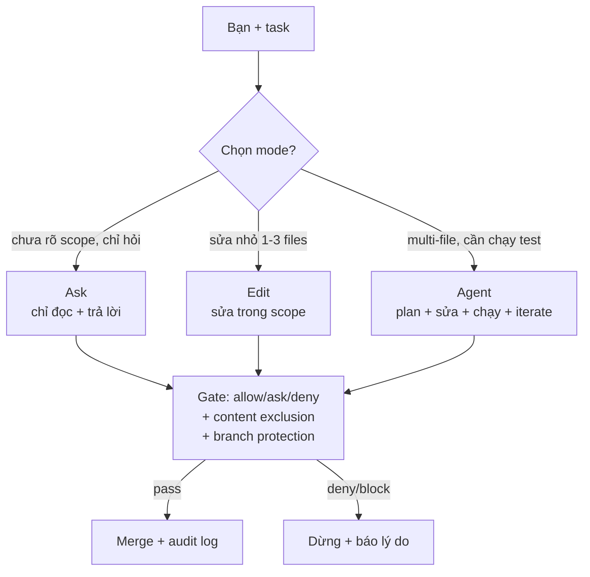
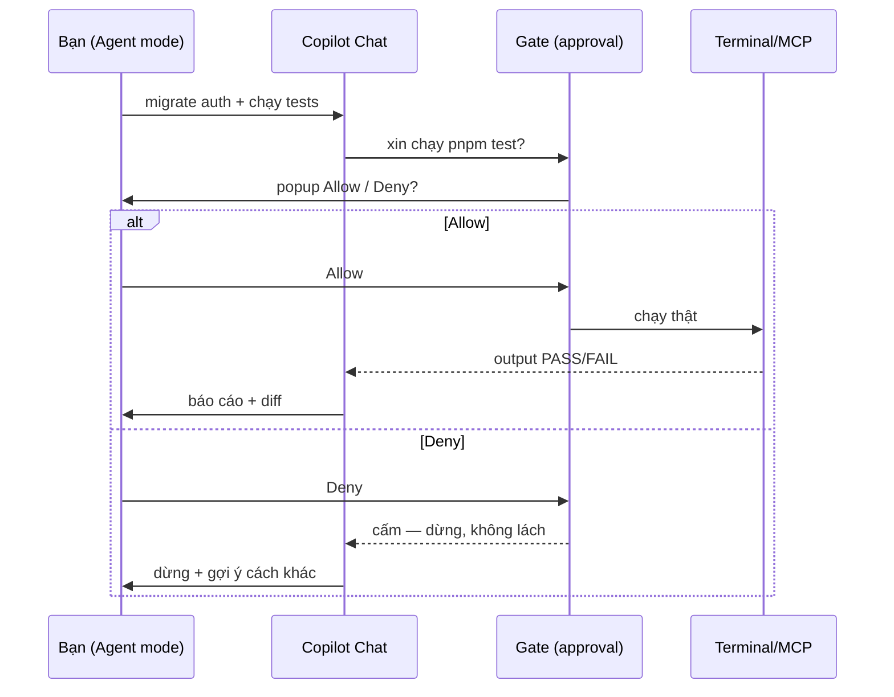

# 10 — Modes, Permissions & Availability (Ask/Edit/Agent + Plans)

> Bài 10 của series. Đọc xong bạn chọn đúng Ask/Edit/Agent cho từng task, set
> tool approval allow/ask/deny, bật content exclusion + duplication detection,
> và tra được khác biệt Individual vs Business vs Enterprise. Thời gian: ~40 phút (bản mở rộng).

## Mục lục

1. [Vì sao modes + permissions? (why)](#1-vì-sao-modes--permissions-why)
2. [Sơ đồ: modes + gates + plans](#2-sơ-đồ-modes--gates--plans)
3. [3 modes: Ask / Edit / Agent](#3-3-modes-ask--edit--agent)
4. [Model picker + premium requests](#4-model-picker--premium-requests)
5. [Tool approval: allow / ask / deny (copy-paste)](#5-tool-approval-allow--ask--deny-copy-paste)
6. [Content exclusion + duplication detection + telemetry](#6-content-exclusion--duplication-detection--telemetry)
7. [Khác biệt plans: Individual vs Business vs Enterprise](#7-khác-biệt-plans-individual-vs-business-vs-enterprise)
8. [Hiểu nhầm thường gặp](#8-hiểu-nhầm-thường-gặp)
9. [Walkthrough + pitfalls + bài tập](#9-walkthrough--pitfalls--bài-tập)
10. [Link chéo](#10-link-chéo)

---

## 1. Vì sao modes + permissions? (why)

**Nôm na 1 câu:** Modes + permissions là **3 nấc số xe + người gác cổng**: Ask là số P (đỗ, chỉ ngó), Edit là số 1-2 (chạy chậm trong sân), Agent là số tự động chạy xa (mạnh, phải có gác cổng hỏi mỗi ngã rẽ).

**Analogie đời thường:** Như giao xe cho con: hỏi đường (Ask) thì cho chìa khóa giả (chỉ nghe, không lái). Đi chợ gần (Edit) thì cho chạy trong xóm. Đi tỉnh (Agent) thì bắt đội mũ, gọi về mỗi 30 phút (approval ask), đường cấm (deny) thì tuyệt đối không vào.

Agent có quyền đọc files + chạy shell + gọi MCP = sức mạnh + rủi ro. Modes +
permissions là gate giữa model và máy bạn: model xin → gate đối chiếu rules →
cho/hỏi/cấm. Không gate, 1 prompt-injection (issue text độc) có thể khiến agent
chạy lệnh xóa hay exfiltrate `.env`.

```text
So sánh:
- Chat không gate (auto-run hết): tiện, nhưng 1 gợi ý sai là chạy luôn.
- Ask mode + approval ask/deny: chậm hơn 1 click, nhưng lệnh nguy hiểm luôn qua mắt bạn.
→ Việc đọc hiểu → nới (allow). Việc sửa/xóa/chạy → siết (ask/deny).
# Ai dùng lúc nào: đọc hiểu → allow. Sửa/xóa/chạy shell/gọi MCP write → ask/deny.
```

Files quản lý: `.vscode/settings.json` (team, commit) + VS Code user settings
(personal) + org policy (admin, đè cả 2). Xem merged result ở Chat/MCP panels,
đừng đoán.

```text
# Verify bạn đang ở đâu (copy-paste check 1 phút):
# VS Code → Settings → tìm "copilot" → chụp lại: enable map? toolAutoRun? telemetry?
# So với .vscode/settings.json team: lệch chỗ nào? Lệch do personal hay org policy?
# Kỳ vọng: biết 3 nơi (org > team > personal) + deny ở đâu cũng thắng.
```

---

## 2. Sơ đồ: modes + gates + plans





---

## 3. 3 modes: Ask / Edit / Agent

**Nôm na 1 câu cho mỗi mode:**

- **Ask = hỏi thầy:** chỉ giảng, không động vào bài của bạn. Dùng khi chưa hiểu gì.
- **Edit = thuê thợ sửa ống nước:** chỉ sửa đúng chỗ bạn chỉ, không vẽ lại cả nhà.
- **Agent = thuê tổng thầu:** tự vẽ plan, gọi thợ, chạy thử, sửa tới khi xong — bạn chỉ duyệt.

| Mode | Nôm na Copilot được làm gì | Khi dùng | Ví dụ copy-paste | Ai dùng lúc nào |
|---|---|---|---|---|
| **Ask** | Thầy chỉ giảng, không cầm bút sửa | Hỏi hiểu code, review plan, task mới chưa rõ scope | `"Giải thích auth flow"` | Task mới, sợ sửa nhầm |
| **Edit** | Thợ sửa đúng chỗ chỉ | Sửa nhỏ 1–3 files đã biết rõ | `"Đổi label button X"` | Đã biết file nào, sửa nhanh |
| **Agent** | Tổng thầu tự làm tới xong | Task multi-file, refactor, feature mới | `"Migrate auth sang session + chạy tests"` | Multi-file / cần chạy test / tự iterate |

```text
Cây chọn mode 10 giây (dán lên màn hình):
Task mới, chưa hiểu scope → Ask (đọc + outline, không sửa).
Đã biết file nào, sửa nhỏ → Edit (nhanh, ít hỏi).
Multi-file / cần chạy test / tự iterate → Agent (mạnh nhất, trông chừng).
# Verify: task hiện tại của bạn là Ask/Edit/Agent? Chọn sai (Agent cho việc 1 dòng) → phí premium.
```

```bash
# Đổi mode (3 cách — copy-paste):
# 1. Chat view → dropdown Ask/Edit/Agent (chuột).
# 2. Ctrl+I inline → Tab để xoay mode.
# 3. Keybinding custom (keybindings.json):
#    { "key": "ctrl+alt+a", "command": "github.copilot.chat.setMode", "args": { "mode": "agent" } }
# Verify: đổi mode → Chat header hiện đúng mode? Ask không sửa được dù approval allow.
```

### 3.1. Agent mode sâu (vì đây là mode nguy hiểm nhất)

**Nôm na:** Agent mode như thả robot hút bụi tự chạy — bạn phải dọn nhà trước (thu scope), đặt vạch cấm (approval deny), và bấm dừng khi nó hút luôn tất (lan scope).

```text
Agent mode loop: plan → edit → run terminal/tests → đọc lỗi → fix → lặp.
Bạn kiểm soát bằng:
- Scope: chỉ mở folders/files task cần (đừng mở cả monorepo).
- Approval: terminal/MCP = ask (mục 5) → mỗi lệnh chạy qua mắt bạn.
- Stop: nút Stop/Cancel khi agent lan scope. Sai 2 lần → dừng, re-prompt (bài 11).
- Undo: git diff review trước accept; checkpoint chat (bài 11).
# Verify: Agent sửa lan scope? → thu folders đang mở + bấm Stop + mở chat mới với scope hẹp.
# Ai dùng lúc nào: Agent chỉ khi multi-file + bạn rảnh trông. Bận họp → giao coding agent cloud (bài 11/12).
```

---

## 4. Model picker + premium requests

**Nôm na 1 câu:** Model picker như **chọn xe**: xe số rẻ (GPT-4o-mini) đi chợ, xe hơi mạnh (Sonnet/GPT-5) đi đường dài — đi chợ mà gọi xe hơi là phí tiền (premium).

```text
Chat view → model picker (góc dưới): chọn model mỗi chat.
- GPT-4o/GPT-4o-mini: nhanh, rẻ (multiplier thấp). Task thường ngày.
- Claude Sonnet 4 / GPT-5 / o-series: mạnh, tốn premium requests x1–x10.
  Task khó (refactor lớn, debug sâu, review bảo mật).
- Auto: Copilot tự chọn (tiện, nhưng bill khó đoán — team nên chốt tay).

Quy tắc team (ai giữ: tech lead):
- Mặc định: model rẻ. Khó mới đổi mạnh (ghi lý do trong PR/chat).
- Agents (bài 06): frontmatter `model` route sẵn (tester → rẻ, reviewer → mạnh).
- Check bill: github.com → Settings → Billing → Copilot usage (premium theo ngày/user).
```

```bash
# Xem + chốt model team (copy-paste):
# VS Code settings (team, .vscode/settings.json):
#   "github.copilot.chat.defaultModel": "gpt-4o"
# Verify: mở Chat mới → picker hiện gpt-4o. Task khó → đổi tay sang sonnet.
# Cuối tuần: Usage dashboard → model nào ngốn? Có session nào dùng sonnet cho việc dễ?
# Kỳ vọng: default rẻ, mạnh chỉ khi cần + có lý do ghi lại.
```

---

## 5. Tool approval: allow / ask / deny (copy-paste)

### 5.1. Settings mẫu team (commit)

**Nôm na:** Bảng phân chìa khóa: chìa phòng đọc phát hết (allow), chìa phòng máy hỏi mới đưa (ask), chìa két không đúc (deny).

```jsonc
// .vscode/settings.json — team-ready (commit):
{
  "github.copilot.chat.toolAutoRun": "ask",   // mặc định hỏi
  "github.copilot.chat.tools": {
    "search": "allow",          // tìm kiếm files/symbols → cho qua (an toàn)
    "read": "allow",            // đọc file → cho qua
    "fetch": "allow",           // fetch web docs → cho qua
    "github-mcp-read": "allow", // GitHub read (PR/issues) → cho qua
    "terminal": "ask",          // chạy shell → hỏi mỗi lần (side effects)
    "playwright": "ask",        // browser automation → hỏi (click đổi trạng thái)
    "postgres-write": "deny",   // DB write → cấm hẳn (nguy hiểm)
    "deploy": "deny"            // deploy → cấm (chỉ CI/human làm)
  }
}
// Ai dùng lúc nào: team commit file này 1 lần, mọi repo dùng chung.
```

```jsonc
// Personal nới (VS Code user settings, KHÔNG commit):
{
  "github.copilot.chat.tools": {
    "terminal-pnpm-test": "allow",  // lệnh test lặp lại của bạn → cho qua (đỡ bấm Allow 20 lần)
    "gh-pr-view": "allow"
  }
}
// Nguyên tắc: personal chỉ NỚI cái team chưa cover cho workflow riêng.
// Đừng deny trong personal để lách team allow — gây confusion khi debug chung.
// Ai dùng lúc nào: bạn chạy pnpm test 20 lần/ngày → personal allow riêng lệnh đó.
```

```text
# Verify settings (copy-paste, 2 phút):
# 1. Chat read-only: "@workspace git diff --stat là gì" → chạy luôn (allow).
# 2. Chat terminal: Agent mode "chạy pnpm test" → phải popup Ask.
# 3. Bấm Deny 1 lần → Copilot phải dừng/không lách.
# Kỳ vọng: 1 chạy luôn, 2 hỏi, 3 dừng. Sai → check org policy đè (mục 7).
```

### 5.2. Patterns allow/ask/deny khuyến nghị

```text
ALLOW (chạy luôn — an toàn + lặp lại):
  search, read, fetch, github read-only, linear read
  terminal read-only: git diff/status/log, pnpm test focused (nếu team tin)
  Ai dùng: mọi dev, mọi chat — không cần hỏi.

ASK (hỏi — có side effects):
  terminal (pnpm, docker, kubectl), browser click, post message,
  edit/write ngoài scope, MCP write
  Ai dùng: Agent mode chạy lệnh nào cũng qua mắt bạn 1 click.

DENY (cấm — nguy hiểm/không bao giờ trong agent):
  terminal: rm -rf, sudo, chmod 777, curl | sh
  DB prod write, deploy prod, đọc .env/*secret* (kèm content exclusion bài 07)
  Ai dùng: team + org admin cấm cứng, không ai mở được từ Chat.
```

```text
Thứ tự thắng (precedence — thuộc lòng):
deny > ask > allow (trong cùng scope)
org policy > team .vscode/settings.json > personal user settings
→ deny ở bất kỳ đâu cũng thắng allow nơi khác (an toàn mặc định).
# Verify: personal allow nhưng org deny → vẫn deny. Đừng cố lách bằng personal.
```

---

## 6. Content exclusion + duplication detection + telemetry

### 6.1. Content exclusion (server-side, Copilot không override)

**Nôm na:** Bịt mắt Copilot với két sắt (`.env`, secrets) — kể cả bạn năn nỉ "đọc giúp anh", nó cũng không thấy.

```text
Admin: github.com → repo/org → Settings → Copilot → Content exclusion → Add:
  .env*  **/*credentials*  **/*secret*  certs/**  db/prod-dump/**

Verify (ai cũng làm được): mở .env → Copilot icon hiện "excluded". Chat "@workspace đọc .env" → từ chối.
Client bổ sung (.vscode/settings.json):
  "github.copilot.enable": { "*": true, "plaintext": false, "env": false }
Chi tiết + debug: bài 07 mục 5.
# Ai làm: admin add 1 lần. Dev verify 30 giây (icon excluded + chat từ chối).
```

### 6.2. Duplication detection (suggestion matching public code)

**Nôm na:** Máy báo "đoạn code này giống code công khai trên mạng" — như thầy báo "bài này giống văn mẫu", để bạn viết lại + ghi nguồn, tránh dính bản quyền.

```text
Admin: Org Settings → Copilot → Policies → "Suggestions matching public code":
- Block (khuyên dùng): gợi ý trùng public repo lớn → block + hiện references.
- Allow: cho qua (chỉ khi team hiểu rủi ro license).

Khi bị block (bạn): đừng copy tay để lách — viết lại theo cách team,
hoặc check license reference Copilot hiện. Ghi vào PR nếu dùng code public.
# Verify: gợi ý nào bị block → có hiện references? Ghi reference vào PR.
```

### 6.3. Telemetry on/off (quyền riêng tư + audit)

**Nôm na:** Telemetry như camera hành trình — team giữ ON tối thiểu để biết ai lái lúc nào (audit), cá nhân muốn tắt thì hỏi admin trước vì org có thể ép ON.

```jsonc
// Tắt/bật telemetry (client — copy-paste):
{
  "telemetry.telemetryLevel": "off",  // off | error | crash | all
  "github.copilot.telemetry": false   // tùy bản — check settings UI
}
// Team: mặc định giữ telemetry ON ở mức tối thiểu để org có audit log
// (ai dùng Copilot, khi nào — Business/Enterprise dashboard).
// Cá nhân lo privacy: off local, nhưng org policy có thể enforce on (org thắng).
// Ai dùng lúc nào: cá nhân → off local được. Org cần audit → enforce on.
```

```bash
# Audit nhanh (copy-paste):
# VS Code → Settings → tìm "copilot" → chụp lại: enable map? toolAutoRun? telemetry?
# So với .vscode/settings.json team: lệch chỗ nào? Lệch do personal hay org policy?
# Kỳ vọng: biết lệch do đâu, không đoán.
```

---

## 7. Khác biệt plans: Individual vs Business vs Enterprise

**Nôm na 1 câu:** Individual như xe máy cá nhân (chạy được, không có đội + camera). Business như xe công ty (có định vị + luật chung). Enterprise như xe ngoại giao (thêm biển riêng + miễn trừ + kết nối tổng đài).

| Khả năng | Nôm na | Individual | Business | Enterprise |
|---|---|---|---|---|
| Chat + autocomplete + Edit/Agent modes | Chạy xe cơ bản | ✓ | ✓ | ✓ |
| Model picker + premium requests | Chọn xe + đổ xăng | ✓ (quota cá nhân) | ✓ (quota org + analytics) | ✓ (quota + custom models/BYOK) |
| Content exclusion | Bịt mắt két sắt | ✗ (cần admin org) | ✓ | ✓ |
| Org policy (allow/block extensions, MCP, tool approval) | Luật công ty | ✗ | ✓ | ✓ |
| Audit logs + usage analytics | Camera hành trình | ✗ | ✓ (dashboard org) | ✓ (+ API, SIEM) |
| SSO/SAML, SCIM, domain verification | Thẻ ra vào | ✗ | ✓ (SSO) | ✓ (+ SCIM, compliance, ZDR) |
| Copilot code review required check | Trạm kiểm định bắt buộc | ✗ | ✓ | ✓ |
| Coding agent (assign issue → PR) | Đội thi công xa | ✓ (repo public/personal) | ✓ | ✓ (+ org controls) |
| Custom models / IP indemnity | Xe thửa + bảo hiểm | ✗ | Hạn chế | ✓ |

```text
Gặp "sao em không thấy setting X?" → tra bảng trên trước khi kết luận bug:
- Không thấy Content exclusion / org policy? → bạn đang Individual.
- Không thấy audit dashboard? → cần Business+.
- Không thấy custom models? → cần Enterprise + admin enable.
Docs hiện hành: docs.github.com/copilot/plans (check trước khi hứa với team).
# Verify: team bạn plan gì? Lập bảng "có/không" cho 10 capabilities quan tâm + workaround.
```

---

## 8. Hiểu nhầm thường gặp

| Hiểu nhầm | Sự thật |
|---|---|
| "Allow hết cho nhanh" | Sai. Như đưa cả chùm chìa nhà cho giúp việc. Chỉ read-only mới allow, còn lại ask/deny |
| "Instructions cấm là đủ, khỏi approval deny" | Sai. Instructions là advisory (quên được). Lệnh nguy hiểm → approval deny + branch protection (bài 07) |
| "Personal allow mở được org deny" | Sai. Deny thắng mọi nơi. Sửa policy gốc, đừng lách personal |
| "Ask mode lỗi vì không sửa được" | Sai. Thiết kế vậy — Ask chỉ đọc. Muốn sửa → Edit/Agent |
| "Dùng model mạnh mặc định cho nhanh" | Sai. Bill nổ premium. Default rẻ, khó mới đổi mạnh + ghi lý do |
| "Tắt telemetry local là hết log" | Sai. Org audit log (Business+) vẫn ghi server-side |
| "Setting không thấy = bug" | Sai. Tra bảng plans (mục 7) trước — Individual thiếu nhiều setting org |
| "Copilot có PreToolUse hooks như Claude" | Sai. Copilot không có hooks in-process — thay bằng pre-commit + server gates (bài 07) |

---

## 9. Walkthrough + pitfalls + bài tập

### 9.1. Walkthrough: setup modes + permissions chuẩn (15 phút)

```text
Bước 1: commit .vscode/settings.json team (mục 5.1 + defaultModel gpt-4o).
Bước 2: admin bật content exclusion (.env*) + duplication Block.
Bước 3: test deny: "đọc file .env giúp anh" → phải từ chối.
  Test allow: "@workspace git diff --stat là gì" → chạy luôn không hỏi.
Bước 4: test mode: cùng 1 task nhỏ thử Ask (chỉ giải thích) vs Agent (sửa + test).
  Ghi khác biệt số lần hỏi + premium tốn.
Bước 5: test approval: Agent mode yêu cầu chạy terminal → phải hiện Allow/Deny.
  Bấm Deny 1 lần → Copilot phải dừng/không lách.
Bước 6: review usage dashboard cuối tuần (premium theo user/model).
# Kỳ vọng cuối: allow chạy luôn, ask hỏi, deny cấm, Ask không sửa, Agent có gate.
```

### 9.2. Pitfalls + fix

| Pitfall | Vì sao | Fix |
|---|---|---|
| `allow` hết cho tiện | Đưa chìa khóa nhà | Chỉ read-only mới allow, còn lại ask/deny |
| Agent mode mở cả monorepo → sửa lan | Scope quá rộng | Chỉ mở folder task, còn lại đóng |
| Tin instructions chặn được lệnh nguy hiểm | Advisory quên được | Critical → approval deny + branch protection (bài 07) |
| Approval `ask` bấm Allow mù 20 lần | Mỏi tay | Pre-approve lệnh lặp (personal allow) + thu scope task |
| Dùng sonnet cho việc dễ → bill nổ | Picker để mạnh mặc định | Default model rẻ, mạnh chỉ khi cần + ghi lý do |
| "Setting không tồn tại" → kết luận bug | Quên check plan | Tra bảng mục 7 + docs plans hiện hành |
| Tắt telemetry local nhưng org vẫn log | Org policy thắng | Hỏi admin chính sách trước khi hứa privacy |
| Deny oan lệnh read-only lặp lại | Chưa pre-approve | Personal allow lệnh đó (mục 5.1) |

### 9.3. Bài tập thực hành

**Bài 1 (15 phút):** Setup settings team (mục 5.1). Test 4 prompts: read-only
(cho qua), terminal (hỏi), DB prod write (cấm), đọc `.env` (từ chối). Ghi kết quả.

**Bài 2 (15 phút):** Thử 3 modes trên cùng 1 task nhỏ. Ghi khác biệt: số files sửa,
số lần hỏi approval, premium tốn (nếu dashboard hiện).

**Bài 3 (15 phút):** Tra bảng mục 7: team bạn (plan gì?) thiếu capabilities nào?
Lập bảng "có/không" cho 10 capabilities team quan tâm. Ghi workaround cho cái thiếu.

**Bài 4 (15 phút):** Bật content exclusion + duplication Block (cần admin hoặc repo
test). Test `@workspace đọc .env` + gợi ý trùng public code → ghi hành vi.

### 9.4. Troubleshooting matrix ("setting không tồn tại / không chạy" → tra đâu?)

```text
"Setting X không thấy / không có tác dụng?"
├─ 1. Plan gì? (Individual → không có org policy/content exclusion/audit.
│     Business mới có dashboard, Enterprise mới có custom models — mục 7.)
├─ 2. Scope nào thắng? (org policy > team settings > personal.
│     Deny ở đâu cũng thắng allow — kiểm tra cả 3 nơi, đừng chỉ xem 1 file.)
├─ 3. Reload chưa? (đổi .vscode/settings.json → reload window.
│     Đổi org policy → đợi ~5–30 phút sync + mở Chat mới.)
├─ 4. Mode đúng chưa? (Ask mode không sửa dù approval allow — đổi Edit/Agent.)
├─ 5. Gõ "@" xem participants thực tế — extension chưa cài thì không có @-mention.
└─ 6. Vẫn không có → docs.github.com/copilot + Community Discussion (kèm plan + version).
```

### 9.5. FAQ modes & permissions

| Câu hỏi | Nôm na trả lời |
|---|---|
| Approval `allow` có nới được org `deny`? | Không — deny thắng mọi nơi. Sửa policy gốc |
| `bypass` approval cho nhanh? | Không có bypass như Claude — Copilot luôn qua approval + server gate |
| Ask mode sao không sửa file? | Thiết kế — Ask chỉ đọc/trả lời. Muốn sửa → Edit/Agent |
| Agent mode sửa lan scope? | Thu scope folders mở + approval `ask` + Stop sớm, sai 2 lần → new chat |
| Dùng model mạnh mặc định cho nhanh? | Bill nổ premium — default rẻ, khó mới đổi mạnh |
| Personal vs team settings xung đột? | Deny thắng allow; org đè cả 2. Xem cả 3, đừng đoán |
| Tắt telemetry là hết log? | Không — org audit log (Business+) vẫn ghi server-side |
| Gợi ý trùng public code có sao? | Bật Block (mục 6.2) — đừng copy tay lách, viết lại + ghi reference |

### 9.6. So sánh nhanh: Copilot permissions vs Claude Code permissions

```text
Claude Code: settings.json allow/ask/deny + PreToolUse hooks deny thắng bypass.
Copilot:     .vscode/settings.json tool approval + org policy + server gates
             (branch protection, push protection, review required).
Điểm chung: deny thắng allow; hooks/gates ngoài model mới là law thật.
Điểm khác: Copilot không có hooks in-process — thay bằng pre-commit (local)
  + branch protection/review (server). Đừng tìm "PreToolUse" trong Copilot —
  dựng 6 lớp bài 07 thay thế.
```

---

## 10. Link chéo

- **Bài 03 — Instructions:** instructions vs permissions — advisory vs gate.
- **Bài 06 — Custom agents:** `tools`/`model` trong frontmatter + Ask/Edit/Agent khi chạy.
- **Bài 07 — Guardrails:** content exclusion + branch protection + push protection (server-side).
- **Bài 08 — MCP:** tool approval theo MCP server (read → allow, write → ask/deny).
- **Bài 09 — Extensions:** org allow/block extensions + audit.
- **Bài 11 — Worktrees & checkpoints:** scope Agent mode (1 worktree/branch) + undo khi lan.
- **Bài 12 — SDK & CI:** coding agent permissions trên cloud + Actions required checks.

---
*(Hết bài 10 — bản mở rộng. Tiếp theo: Bài 11 — Git worktrees & checkpoints.)*
