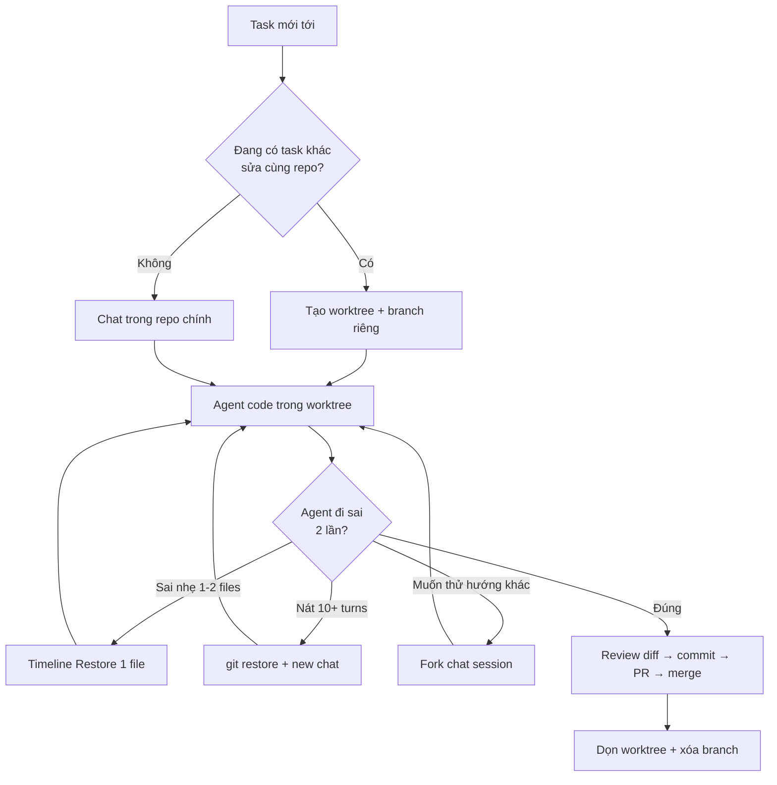

# 11 — Git Worktrees & Checkpoints: Chạy Agent Song Song Không Giẫm Chân Nhau

> **Dành cho:** dev đã quen Copilot trong VS Code, muốn chạy nhiều agent song song không giẫm chân, và muốn "quay lại" khi agent đi sai.
> **Vấn đề:** 2 sessions cùng sửa 1 working dir → conflict, đè file, test flaky; hoặc agent sửa 15 turns vẫn sai, càng sửa càng nát mà bạn tiếc turns đã đốt.
> **Đọc xong:** chạy được worktree cho parallel agents, undo đúng lúc bằng timeline/fork/git restore, và theo đúng branch strategy `copilot/*`.
> **Thời gian:** ~30 phút.

## Mục lục

1. [Giới ngố 5 thuật ngữ (2 phút)](#0-giới-ngố-5-thuật-ngữ-2-phút)
2. [Vì sao worktrees + checkpoints? (2 vấn đề, 3 lớp công cụ)](#1-vì-sao-worktrees--checkpoints-2-vấn-đề-3-lớp-công-cụ)
3. [Checkpoints trong VS Code: 3 cơ chế undo](#2-checkpoints-trong-vs-code-3-cơ-chế-undo)
4. [Worktrees deep-dive (lệnh thuộc lòng)](#3-worktrees-deep-dive-lệnh-thuộc-lòng)
5. [Branch strategy của coding agent (`copilot/*`)](#4-branch-strategy-coding-agent-copilot)
6. [3 worktree workflows copy-paste](#5-3-worktree-workflows-copy-paste)
7. [Rewind = git restore + new chat (bảng quyết định)](#6-rewind--git-restore--new-chat-bảng-quyết-định)
8. [Walkthrough + gotchas + pitfalls + bài tập](#7-walkthrough--gotchas--pitfalls--bài-tập)
9. [Link chéo](#8-link-chéo)

---

## 0. Giới ngố 5 thuật ngữ (2 phút)

Mỗi khái niệm đủ 3 lớp: **1 câu định nghĩa**, **so sánh đời thường**, **ví dụ lệnh thật**. Cột Verify để bạn tự kiểm chứng thay vì tin lời.

| Thuật ngữ | 1 câu định nghĩa | So sánh nôm na | Ví dụ lệnh thật | Verify |
|---|---|---|---|---|
| **Git worktree** | 1 repo mở được nhiều thư mục làm việc song song, mỗi thư mục gắn 1 branch. | 1 căn nhà (repo) nhiều phòng (worktree) — mỗi người 1 phòng, không giẫm chân. | `git worktree add ../myrepo-worktrees/feat-login -b feat/login` | `git worktree list` → 2+ dòng (main + worktree mới). |
| **Checkpoint (Timeline)** | Nút undo của VS Code: quay 1 file về trước khi agent sửa, không tạo commit. | Ctrl+Z nhưng nhớ được nhiều giờ trước, kể cả đã tắt máy. | Explorer → chuột phải file → Timeline → Restore bản 9h sáng. | `git diff HEAD -- <file>` → trống sau restore. |
| **Chat session fork** | Rẽ nhánh chat cũ để thử hướng khác, giữ mạch chính. | Save game ở ngã ba: thử đường A, chết thì load lại đi đường B. | Chat view → History (đồng hồ) → Restore/Fork session. | Session cũ hiện lại, chat hiện tại vẫn nguyên. |
| **Branch `copilot/*`** | Branch do coding agent cloud tự tạo; bạn chỉ review qua PR. | Robot thuê ngoài có phòng riêng — bạn kiểm hàng ở cửa, không vào phòng nó. | `git branch -r | grep "copilot/"` thấy `origin/copilot/issue-123-x`. | `gh pr list --author "app/copilot"` → thấy PR draft. |
| **Git restore (rewind thật)** | Xóa hết sửa đổi sai, về bản sạch, chat mới từ đầu. | Lật bàn cờ khi đánh sai 10 nước — đánh ván mới nhanh hơn cố gỡ. | `git restore src/auth/login.ts` + mở chat mới. | `git diff --stat` → gọn lại (hết 10 files lan man). |

> **Nhớ ngay:** worktree cách ly **nơi làm việc**. Checkpoint/quay lại cứu **kết quả sai**. Hai thứ không thay thế nhau.

---

## 1. Vì sao worktrees + checkpoints? (2 vấn đề, 3 lớp công cụ)

> **Câu hỏi then chốt:** 2 nỗi đau lớn nhất khi chạy agent — giẫm chân và đi sai đường — mỗi nỗi đau dùng công cụ nào vá?

```text
Vấn đề 1 — Giẫm chân: 2 sessions cùng sửa 1 working dir → conflict, đè file, test flaky.
  → Vá bằng worktrees: mỗi session 1 checkout riêng, branch riêng.

Vấn đề 2 — Đi sai đường: agent sửa 15 turns vẫn sai, càng sửa càng nát.
  → Vá bằng checkpoints: undo code + conversation về điểm trước khi nát.
```

3 lớp công cụ phối hợp, không thay thế nhau:

| Lớp | Vai trò | Nôm na |
|---|---|---|
| **Git** (commit/PR) | Nguồn sự thật cuối cùng | Sổ cái kế toán — có gì ghi nấy |
| **Checkpoints** (VS Code) | Undo local nhanh, không commit | Ctrl+Z của IDE |
| **Worktrees** | Cách ly không gian làm việc | Mỗi thợ 1 phòng riêng |

> **Ví dụ tiền (AI Credits):** argue với agent 10 turns mỗi turn tốn 1+ lượt gọi model;
> `git restore` + chat mới tốn ~0 credits thêm. Sai 2 lần vẫn sai → rewind luôn, đừng tiếc turns.

### 1.1. Sơ đồ luồng (nhìn 30 giây là hiểu)



Đi từng bước cho người mới:

1. **A → B:** mọi task bắt đầu bằng câu hỏi "có ai đang sửa cùng repo không?" — có là tạo worktree ngay, đừng tiếc 30 giây.
2. **B → C:** `git worktree add ../repo-worktrees/ten -b feat/ten` — mỗi session 1 phòng, 1 branch.
3. **C/D → E:** mở 1 window VS Code riêng cho từng worktree — 1 window = 1 branch, nhìn title biết đang ở đâu.
4. **E → F:** agent fix 2 lần vẫn fail cùng lỗi → dừng, không argue turn 3.
5. **F → G:** sai 1–2 files → Timeline Restore đúng file (rẻ nhất, giữ chat).
6. **F → H:** nát 10+ turns / lan 10 files → `git restore` + new chat (rewind thật).
7. **F → I:** muốn thử hướng B mà giữ mạch A → Fork chat.
8. **F → J:** đúng → `git diff --stat` gọn → commit → push → PR → merge.
9. **J → K:** merge xong xóa worktree + branch ngay — worktree tồn sau merge là nợ.

> ✅ **Kỳ vọng:** sau bước C, `git worktree list` hiện 2+ dòng. Sau bước J, `git diff --stat` ≤5 files đúng scope.

---

## 2. Checkpoints trong VS Code: 3 cơ chế undo

> **Câu hỏi:** undo code + chat trong VS Code bằng cơ chế nào, mỗi cái dùng khi nào?
> **Lưu ý quan trọng:** Copilot KHÔNG có lệnh `/rewind` như Claude Code. Bạn undo bằng đúng 3 cơ chế của VS Code dưới đây — đừng nhầm với hooks (bài 10) hay `/branch` (bài 04).

| Cơ chế | Hiểu nôm na | Ví dụ thật | Khi nào dùng |
|---|---|---|---|
| **Timeline** (file history) | Undo từng file — quay 1 file về bản trước. | Agent phá `login.ts` → Timeline → Restore bản 9h sáng. | Sai 1–2 files, còn lại đúng |
| **Chat session fork** | Rẽ nhánh hội thoại — thử đường mới, giữ đường cũ. | Fork chat ở turn 5 để thử JWT thay vì session. | Muốn thử hướng khác, giữ mạch chính |
| **Git restore + new chat** | Lật bàn cờ — xóa hết, đánh ván mới. | `git restore src/auth/` + chat mới với prompt đủ ý. | Agent nát 10+ turns (rewind thật) |

```bash
# 3 cách xem "đã hỏng gì" trước khi quyết định undo (copy-paste):
git diff HEAD -- src/auth/login.ts   # Verify: file này agent sửa gì chưa commit?
git diff --stat                      # Verify: scope phình chưa? (>5 files khi chỉ cần 2 = lan)
git log --oneline -5 -- src/auth/login.ts  # Verify: điểm restore nào an toàn?
# Kỳ vọng: diff hiện đỏ/xanh từng dòng; --stat ra "2 files changed, 30 insertions(+)"
# (ra "10 files changed" là agent đang lan scope → rewind).
```

> **Nguyên tắc 30 giây:** sửa 2 lần vẫn sai → đừng argue, `git restore` + chat mới.
> Rẻ hơn 10 turns cãi nhau + tốn AI Credits, và prompt mới có context sạch.

---

## 3. Worktrees deep-dive (lệnh thuộc lòng)

> **Câu hỏi:** lệnh nào để tạo, liệt kê, mở, dọn worktree — và vì sao đặt tên theo 1 quy ước?
> **Bản chất:** mỗi session 1 git checkout riêng → 2 agents sửa cùng repo không conflict file.

```bash
# Tạo (branch mới từ HEAD):
git worktree add ../myrepo-worktrees/feat-login -b feat/login
# Verify: git worktree list → thêm 1 dòng "feat-login [feat/login]"

# Tạo từ main mới nhất (đảm bảo không dựa trên code cũ):
git fetch origin
git worktree add ../myrepo-worktrees/feat-pay -b feat/pay origin/main

# Mở session trong worktree (VS Code: File → Open Folder):
code ../myrepo-worktrees/feat-login
# Verify: title window hiện "feat-login" — 1 window = 1 branch.

# Dọn sau merge (3 lệnh):
git worktree remove ../myrepo-worktrees/feat-login          # worktree sạch
git worktree remove --force ../myrepo-worktrees/feat-login  # có changes chưa commit (cẩn thận!)
git worktree prune                                           # dọn metadata đã xóa tay
# Verify: git worktree list → mất dòng feat-login.
```

### 3.1. Vì sao đặt tên theo quy ước? (why)

```text
../<repo>-worktrees/<ten>  → đặt NGOÀI repo chính (git status sạch, không cần sửa .gitignore).
feat/<ten>                  → branch tách main, PR riêng từng worktree (local).
copilot/<issue>-<slug>      → prefix coding agent cloud dùng (mục 4) — đừng đặt tay trùng.
Dọn sau merge               → worktree tồn = branch tồn = nợ. Merge xong xóa cả 2.
```

> **Ví dụ disk (hiểu vì sao worktree rẻ hơn clone):** `du -sh ../myrepo-worktrees/feat-x`
> → chỉ hiện working files (vài trăm MB). Trong khi `git clone` mới tốn gấp 5–10x vì copy cả `.git`.
> Worktree **chia sẻ** thư mục `.git` objects của repo gốc.

---

## 4. Branch strategy coding agent (`copilot/*`)

> **Câu hỏi:** coding agent trên github.com tạo branch kiểu gì, bạn đụng vào được không, review PR của nó ra sao?

```text
Luồng coding agent chuẩn (ai làm gì lúc nào):
1. BẠN: mở issue (mục tiêu + acceptance criteria + label "ready") → Assign to Copilot.
2. AGENT (cloud): tạo branch copilot/issue-123-<slug> từ main → code → push →
   mở PR draft (gắn issue, checklist tests, session log).
3. BẠN: review PR (diff + Copilot review + CI) → request changes (agent iterate)
   hoặc approve → merge → branch tự xóa (auto-delete head branches: ON).
```

**Quy tắc branch (dán vào CONTRIBUTING):**

- `copilot/*` → của agent. Bạn KHÔNG push tay vào (trừ hotfix, phải báo agent trước).
- `feat/*` → của bạn local (worktrees). Không đặt `feat/copilot-*` gây nhầm.
- `main` → protected: không ai push trực tiếp, kể cả agent (bài 07).

```bash
# Theo dõi + review coding agent (copy-paste, sửa repo name):
git fetch origin
git branch -r | grep "copilot/"                     # Verify: agent đang làm branches nào?
gh pr list --repo acme/api --author "app/copilot" --state open
gh pr view 45 --json title,headRefName,reviews,state --jq .

# Checkout PR về local để test (KHÔNG sửa trên branch của nó):
gh pr checkout 45 --branch review-45
pnpm install --frozen-lockfile && pnpm test
# Verify: test pass, bạn chưa push gì lên copilot/*.

# Dọn sau merge:
git branch -d feat/my-done-task
git worktree remove ../api-worktrees/feat-my-done-task
git worktree prune && git worktree list             # Verify: sạch
# Branch copilot/* merged → GitHub tự xóa nếu bật auto-delete (Settings → General).
```

---

## 5. 3 worktree workflows copy-paste

> **Câu hỏi:** khi nào dùng pattern nào — 2 features song song, thử 2 phương án, hay bạn code + agent cloud fan-out?

### Pattern A — 2 features song song (phổ biến nhất)

```bash
# Setup 5 phút (1 lần):
git fetch origin
git worktree add ../myrepo-worktrees/feat-a -b feat/a origin/main
git worktree add ../myrepo-worktrees/feat-b -b feat/b origin/main
git worktree list   # Verify: 3 entries (main + 2 worktrees)

# Window 1 (feat-a) — Agent mode:
#   "implement login rate-limit theo plan plans/xxx.md, chạy focused test"
# Window 2 (feat-b) — Agent mode:
#   "migrate users table thêm last_login_at, test local"

# Xong mỗi bên: review diff → commit → push → gh pr create → merge → dọn:
git worktree remove ../myrepo-worktrees/feat-a
git branch -d feat/a
# Kỳ vọng: 2 PR merge riêng lẻ, không conflict nhau.
```

### Pattern B — Thử 2 phương án, giữ cái thắng (spike)

```bash
git worktree add ../myrepo-worktrees/spike-1 -b spike/option-1 origin/main
git worktree add ../myrepo-worktrees/spike-2 -b spike/option-2 origin/main
# Window 1: JWT-blacklist. Window 2: server-sessions.
# Mỗi bên: implement + test + đo perf/complexity → so sánh.

# Giữ spike-2, bỏ spike-1:
git worktree remove --force ../myrepo-worktrees/spike-1
git branch -D spike/option-1
git branch -m spike/option-2 feat/sessions
# Verify: git branch → còn feat/sessions, mất spike/*.
```

### Pattern C — Bạn code local + coding agent fan-out cloud

```text
# Bạn KHÔNG tạo worktree cho agent cloud — nó chạy trên hạ tầng GitHub, branch copilot/*.
# 1. Giao 2 issues độc lập cho 2 coding agents (gh copilot assign hoặc web "Assign to Copilot").
# 2. Bạn code task chính ở worktree local feat/main-work.
# 3. Agent mở PR drafts → bạn review từng PR (checkout về local test như mục 4).
# 4. Merge từng PR → dọn worktree local khi xong.
# Kill khi agent đi sai: comment "stop, wrong direction — [hướng đúng]"
# hoặc close PR + delete branch copilot/*. Đừng để agent iterate quá 3 rounds không tiến.
```

---

## 6. Rewind = git restore + new chat (bảng quyết định)

> **Câu hỏi:** rewind khi nào, bằng cái gì? Đọc 4 scenario, rồi tra bảng cuối.
> **Quy tắc ngắn:** sửa 2 lần vẫn sai → đừng argue, restore + chat mới.

**Scenario 1 — Agent sửa 3 turns vẫn fail cùng 1 test**

```text
Dấu hiệu: cùng 1 lỗi, 3 fixes khác nhau đều fail.
→ REWIND: git restore <files> (hoặc Timeline) + chat mới:
"Test X fail với [paste lỗi đầy đủ]. Lần trước thử A, B, C đều fail.
 Đọc [file] lại từ đầu, đề xuất root cause KHÁC trước khi sửa."
```

**Scenario 2 — Agent refactor lan man ngoài scope (đụng 10 files khi chỉ cần 2)**

```text
Dấu hiệu: git diff --stat phình, files ngoài scope xuất hiện.
→ REWIND: git restore <8 files ngoài scope> + chat mới:
"Chỉ sửa [2 files]. KHÔNG đụng [8 files kia]. Xong chạy focused test."
```

**Scenario 3 — Prompt ban đầu thiếu thông tin (agent đoán sai hướng)**

```text
Dấu hiệu: agent làm "đúng" theo prompt nhưng sai ý bạn.
→ REWIND: git restore . (hoặc checkout lại worktree sạch) + prompt đủ
(mục tiêu + scope + verify + non-goals). Đừng "sửa dần" từ code sai hướng.
```

**Scenario 4 — Chỉ sai 1 bước nhỏ, còn lại đúng**

```text
Dấu hiệu: 9/10 steps đúng, 1 step sai (ví dụ sai tên column).
→ KHÔNG rewind — Edit 1 dòng hoặc bảo agent "sửa dòng X thành Y".
Rewind ở đây phí: mất 9 steps đúng + tốn thêm AI Credits.
```

### Bảng quyết định 30 giây

| Tình huống | Hiểu nôm na | Ví dụ | Rewind? | Bằng gì? |
|---|---|---|---|---|
| Cùng lỗi fail 2–3 lần | Cãi hoài 1 lỗi không xong. | Test login đỏ 3 lần cùng `TypeError normalize`. | Có | `git restore` + new chat (S1) |
| Lan scope, diff phình | Nhờ sửa 2, đụng 10 files. | `--stat` hiện `auth/ + cart/ + legacy/`. | Có | Restore files ngoài scope + chat hẹp |
| Hiểu nhầm yêu cầu từ đầu | Prompt thiếu ý, đúng chữ sai nghĩa. | Bảo "thêm refund" nhưng quên giới hạn 30 ngày. | Có | Restore hết + viết lại prompt đủ |
| Sai 1 dòng, còn đúng | 9/10 đúng, sai 1 tên cột. | `user_id` thành `users_id`. | Không | Edit trực tiếp / Timeline 1 file |
| Thử hướng khác song song | Giữ A đúng 50%, thử B. | A dùng JWT, B dùng session. | Không | Worktree mới + branch mới |
| Task đã commit PR | Đã push lên GitHub. | PR #45 đã 2 người review. | Không | `git revert` / PR mới (checkpoints là local) |
| Coding agent sai trên cloud | Robot cloud sai hướng. | `copilot/issue-123` sai spec. | Không | Comment redirect / close + delete `copilot/*` |

### Hiểu nhầm thường gặp (đừng vấp)

| Hiểu nhầm | Sự thật | Verify |
|---|---|---|
| "Worktree là clone mới, tốn disk gấp đôi" | Chia sẻ `.git` objects, chỉ thêm working files — nhẹ hơn clone 5–10x. | `du -sh` worktree vs `git clone` mới |
| "Checkpoint = commit" | Checkpoint chỉ ở máy bạn, mất khi xóa cache IDE; muốn bền phải `git commit`. | Restore xong `git log` không có commit mới |
| "Restore xong chat cũng quay lại" | Timeline chỉ quay code, chat giữ nguyên — quay cả chat phải Fork session. | Fork session cũ xem có giữ mạch chính không |

---

## 7. Walkthrough + gotchas + pitfalls + bài tập

> **Câu hỏi:** làm sao luyện tay cho phản xạ — 1 walkthrough 20 phút, 4 gotchas, 6 pitfalls, 4 bài tập.

### 7.1. Walkthrough kết hợp (20 phút)

```bash
# Bước 1 (3 phút): tạo 2 worktrees (pattern B):
git fetch origin
git worktree add ../myrepo-worktrees/opt-1 -b feat/opt-1 origin/main
git worktree add ../myrepo-worktrees/opt-2 -b feat/opt-2 origin/main
# Verify: git worktree list → 3 entries.

# Bước 2 (10 phút): window 1 = Agent mode research phương án 1;
# window 2 = bạn thử phương án 2. Mỗi bên focused test + review diff.

# Bước 3 (3 phút): so sánh (perf, complexity, số lines). Chọn thắng.

# Bước 4 (4 phút): merge PR thắng + dọn:
git worktree remove ../myrepo-worktrees/<thua>
git branch -D feat/<thua>
git worktree list   # Verify: 2 entries (main + opt thắng)
```

### 7.2. Worktree gotchas (4 cái ai cũng vấp 1 lần)

**1. Untracked files không theo worktree:**

```bash
# Worktree mới chỉ có tracked files từ branch base. WIP chưa commit ở main KHÔNG sang.
git stash push -m "wip-main" && git worktree add ../myrepo-worktrees/feat-x -b feat/x
# Verify: git stash list → hiện stash; mở worktree không thấy file WIP cũ.
```

**2. Dependencies phải cài lại mỗi worktree:**

```bash
cd ../myrepo-worktrees/feat-x
pnpm install --frozen-lockfile   # Node
# hoặc: python -m venv .venv && pip install -r requirements.txt
# Mẹo: pnpm store shared + Docker layer cache để đỡ tải lại nặng.
# Verify: pnpm ls → dep đủ, không chạy lại tải từ mạng.
```

**3. Env files + ports đụng nhau:**

```bash
# .env thường untracked → copy tay sang worktree (KHÔNG commit .env!):
cp /path/to/main/.env ../myrepo-worktrees/feat-x/.env
# Ports: 2 sessions cùng :3000 → đụng. Đổi PORT mỗi worktree:
PORT=3001 pnpm dev   # worktree A :3000, worktree B :3001
# Verify: 2 tab browser chạy cùng lúc không conflict.
```

**4. Đừng mở 2 worktrees trong 1 window VS Code:**

```text
Mỗi worktree 1 window riêng. Đặt settings:
  "window.title": "${rootName} — ${activeEditorShort}"
# Verify: nhìn title window biết đang ở worktree nào, không commit nhầm branch.
```

### 7.3. Pitfalls + fix (khi gặp triệu chứng → tra cột fix)

| Pitfall | Vì sao | Fix |
|---|---|---|
| Quên dọn worktree → 10 worktrees tồn | Không quy ước | Merge xong `remove` ngay; cuối tuần `git worktree list` kiểm tra |
| 2 sessions cùng dir (không worktree) → conflict | Lười tạo worktree | Task song song = worktree riêng, không ngoại lệ |
| Restore sau khi đã push | Checkpoints là local only | Đã push → `git revert` / PR mới, không restore mù |
| Push tay vào `copilot/*` của agent | Không biết quy ước | `copilot/*` là của agent — review qua PR |
| Xóa worktree đang có window mở | Window mất folder | Đóng window trước, hoặc `cd` ra rồi `remove` |
| Agent lan scope mà vẫn argue 10 turns | Tiếc turns đã tốn (AI Credits) | Sai 2 lần → restore + new chat, rẻ hơn argue |

### 7.4. Bài tập (có thời gian)

**Bài 1 (15 phút):** Tạo 2 worktrees (pattern A). Mở 2 windows, mỗi bên 1 task nhỏ. Merge + dọn. Ghi thời gian so với làm tuần tự.

**Bài 2 (15 phút):** Giao task sai hướng cho agent, để nó chạy 5 turns, rồi restore + new chat (scenario 3). Ghi so sánh AI Credits/turns rewind-sớm vs argue-tiếp (xem dashboard usage).

**Bài 3 (10 phút):** Thử Timeline restore 1 file + fork chat history. Khi nào Timeline đủ, khi nào cần `git restore` + new chat?

**Bài 4 (15 phút):** Giao 1 issue test cho coding agent. Review branch `copilot/*` + PR draft: checkout local, comment 1 request changes, merge, verify auto-delete.

---

## 8. Link chéo

| Bạn muốn... | Đọc bài |
|---|---|
| Chạy nhiều agent local song song | [06 — Custom agents (parallel)](./06-custom-agents-parallel.md) |
| Branch protection + auto-delete cho `copilot/*` | [07 — Guardrails](./07-policies-guardrails-tu-dong-hoa.md) |
| Scope Agent mode (1 worktree/branch) + approval | [10 — Modes & permissions](./10-modes-permissions-availability.md) |
| Coding agent assign, auto-fix CI, review trên PR | [12 — SDK & CI/CD](./12-copilot-sdk-ci-cd-automation.md) |
| Chat history + model picker khi mở chat mới sau rewind | [04 — Chat commands](./04-chat-commands-toan-tap.md) |

---
*(Hết bài 11. Tiếp theo: [bài 12 — Copilot SDK & CI/CD automation](./12-copilot-sdk-ci-cd-automation.md).)*
