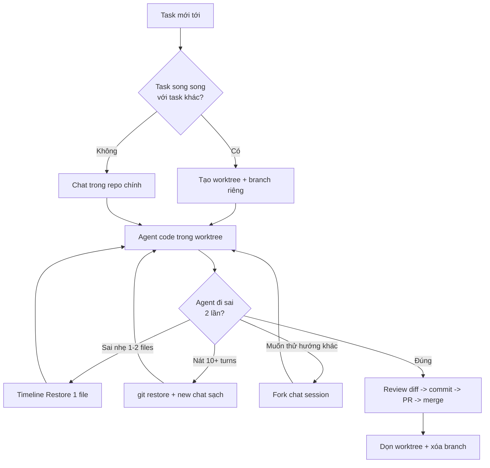

# 11 — Git Worktrees & Checkpoints (Song Song Không Giẫm + Undo)

> Bài 11 của series 01. **Dành cho:** bạn đã quen Copilot trong VS Code và muốn
> chạy nhiều agent song song không giẫm chân nhau. **Vấn đề:** 2 sessions cùng
> sửa 1 working dir → conflict, đè file; hoặc agent sửa 15 turns mà vẫn sai,
> càng sửa càng nát. **Đọc xong:** chạy được worktree workflows cho parallel
> coding agents, dùng VS Code checkpoints/timeline undo đúng lúc, và theo đúng
> branch strategy `copilot/*`. **Thời gian:** ~30 phút.

## Mục lục

1. [Vì sao worktrees + checkpoints? (why)](#1-vì-sao-worktrees--checkpoints-why)
2. [VS Code checkpoints: timeline + chat session restore](#2-vs-code-checkpoints-timeline--chat-session-restore)
3. [Worktrees deep-dive (lệnh thuộc lòng)](#3-worktrees-deep-dive-lệnh-thuộc-lòng)
4. [Branch strategy của coding agent (`copilot/*`)](#4-branch-strategy-của-coding-agent-copilot)
5. [3 worktree workflows (copy-paste)](#5-3-worktree-workflows-copy-paste)
6. [Rewind = git restore + new chat (bảng quyết định)](#6-rewind--git-restore--new-chat-bảng-quyết-định)
7. [Walkthrough + pitfalls + bài tập](#7-walkthrough--pitfalls--bài-tập)
8. [Link chéo](#8-link-chéo)

---

## 0. Giải ngố thuật ngữ (đọc 2 phút là hiểu hết bài)

Section này trả lời: 5 khái niệm xuyên suốt bài — worktree, checkpoint, session fork, branch `copilot/*`, git restore — nghĩa là gì và gõ lệnh gì để tự kiểm chứng. Đọc xong 2 phút là vào bài không bị ngợp.

| Thuật ngữ | Hiểu nôm na (1 câu) | Analogie đời thường | Ví dụ kỹ thuật thật | Verify (gõ để kiểm chứng) |
|---|---|---|---|---|
| **Git worktree** | 1 repo nhưng mở được nhiều thư mục làm việc song song, mỗi thư mục 1 branch riêng. | Như 1 căn nhà (repo) có nhiều phòng (worktree) — mỗi người 1 phòng, không giẫm chân. | `git worktree add ../myrepo-worktrees/feat-login -b feat/login` tạo phòng mới cho branch `feat/login`. | `git worktree list` → phải thấy 2+ dòng (main + worktree mới). |
| **Checkpoint (Timeline restore)** | Nút Undo của VS Code: quay 1 file về bản trước khi agent phá. | Như Ctrl+Z nhưng nhớ được nhiều giờ trước, kể cả đã đóng máy. | Explorer → Timeline → chọn điểm trước khi agent sửa → Restore `src/auth/login.ts`. | `git diff HEAD -- <file>` → trống sau restore (đã về cũ). |
| **Chat session restore / Fork** | Mở lại đoạn chat cũ để thử hướng khác mà không mất mạch chính. | Như rẽ nhánh trong game: save ở ngã ba, thử đường A, chết thì load lại đi đường B. | Chat view → History (đồng hồ) → Restore/Fork session hôm qua. | Session cũ hiện lại, chat hiện tại vẫn còn nguyên. |
| **Branch `copilot/*`** | Branch do coding agent trên cloud tự tạo, bạn chỉ review không push tay. | Như robot thuê ngoài có phòng riêng — bạn kiểm hàng ở cửa, không vào phòng nó sửa. | `git branch -r \| grep "copilot/"` thấy `origin/copilot/issue-123-x`. | `gh pr list --author "app/copilot"` → thấy PR draft của agent. |
| **Git restore (rewind thật)** | Xóa sửa đổi sai, quay code về bản sạch rồi chat mới từ đầu. | Như lật bàn cờ khi đánh sai 10 nước — xếp lại đánh ván mới nhanh hơn cố gỡ. | `git restore src/auth/login.ts` + mở chat mới sạch. | `git diff --stat` → gọn lại (không còn 10 files lan man). |

---

## 1. Vì sao worktrees + checkpoints? (why)

Section này trả lời: 2 vấn đề song song của agent work là gì, và 3 lớp công cụ nào dùng để vá — trước khi đi vào lệnh cụ thể.

```text
Vấn đề 1 — Giẫm chân: 2 sessions cùng sửa 1 working dir → conflict, đè file, test flaky.
  → Giải pháp: worktrees (mỗi session 1 checkout riêng, branch riêng).

Vấn đề 2 — Đi sai đường: agent sửa 15 turns vẫn sai, càng sửa càng nát.
  → Giải pháp: checkpoints (undo cả code + conversation về điểm trước khi nát).
```

- **Git** = nguồn sự thật cuối cùng (commit/PR).
- **Checkpoints** = undo local nhanh, không tạo commit.
- **Worktrees** = cách ly không gian làm việc.

3 lớp này phối hợp với nhau, không thay thế nhau.

### 1.1. Sơ đồ luồng (nhìn 30 giây hiểu)



Giải thích từng bước (người mới đọc ở đây là đủ):

1. **A → B:** Mọi task bắt đầu bằng câu hỏi "có ai đang sửa cùng repo không?" — có là worktree ngay, đừng tiếc 30 giây.
2. **B → C:** `git worktree add ../repo-worktrees/ten -b feat/ten` — mỗi session 1 phòng riêng, branch riêng.
3. **C/D → E:** Mở VS Code window riêng cho từng worktree — 1 window = 1 branch, nhìn title biết đang ở đâu.
4. **E → F:** Sau mỗi 2 lần agent fix vẫn fail cùng lỗi → dừng, không argue turn 3.
5. **F → G:** Sai 1–2 files → Timeline Restore đúng file đó (rẻ nhất, giữ chat).
6. **F → H:** Nát 10+ turns / lan 10 files → `git restore` + new chat sạch (rewind thật).
7. **F → I:** Muốn thử hướng B mà giữ mạch A → Fork chat, không mất cái đang đúng 50%.
8. **F → J:** Đúng → `git diff --stat` gọn → commit → push → PR → merge.
9. **J → K:** Merge xong xóa worktree + branch ngay — worktree tồn tại sau merge là nợ.

> ✅ **Kỳ vọng thấy gì:** sau bước C, `git worktree list` hiện 2+ dòng. Sau bước J, `git diff --stat` ≤5 files đúng scope.

---

## 2. VS Code checkpoints: timeline + chat session restore

Section này trả lời: undo code + chat trong VS Code bằng cơ chế nào, và mỗi cơ chế dùng khi nào. Copilot không có `/rewind` như Claude Code — bạn undo bằng 3 cơ chế VS Code:

| Cơ chế | Hiểu nôm na | Ví dụ | Khi nào |
|---|---|---|---|
| **Timeline** (file history) | Nút Undo từng file — quay 1 file về hôm qua. | Agent phá `login.ts` → Timeline → Restore bản 9h sáng. | Sai 1–2 files, còn lại đúng |
| **Chat session restore** | Rẽ nhánh hội thoại — thử đường mới giữ đường cũ. | Fork chat ở turn 5 để thử JWT thay vì session. | Muốn thử hướng khác giữ mạch chính |
| **Git restore + new chat** | Lật bàn cờ — xóa hết đánh ván mới. | `git restore src/auth/` + chat mới với prompt đủ ý. | Agent nát 10+ turns (rewind thật) |

```text
Timeline (nhanh nhất):
VS Code → Explorer → chuột phải file → Timeline → chọn điểm trước khi agent sửa → Restore.
→ chỉ restore 1 file, chat giữ nguyên (khác rewind cả conversation).

Chat session restore:
Chat view → History (đồng hồ) → chọn session cũ → Restore/Fork.
→ thử hướng khác mà không mất mạch đang đúng 50% (tương đương /branch).

Nguyên tắc: sửa 2 lần vẫn sai → đừng argue tiếp, git restore + new chat sạch
(rẻ hơn 10 turns cãi nhau + tốn AI credits).
```

```bash
# Xem timeline từ CLI (khi cần diff nhanh trước khi restore):
git diff HEAD -- <file>              # agent đã sửa gì chưa commit?
git diff --stat                      # scope có phình không? (>5 files khi chỉ cần 2 → lan)
git log --oneline -5 -- <file>       # lịch sử file (điểm restore nào an toàn?)
```

> ✅ **Kỳ vọng thấy gì:**
> - `git diff HEAD -- src/auth/login.ts` hiện đỏ/xanh từng dòng agent sửa (hoặc trống = chưa sửa gì).
> - `git diff --stat` ra `2 files changed, 30 insertions(+)` — nếu ra `10 files changed` là agent đang lan scope → rewind.
> - `git log --oneline -5` ra 5 dòng hash + message gần nhất của file đó.

---

## 3. Worktrees deep-dive (lệnh thuộc lòng)

Section này trả lời: lệnh nào để tạo, liệt kê, mở và dọn worktree, và vì sao đặt tên thư mục/branch theo 1 quy ước. Trước hết, bản chất: mỗi session 1 git checkout riêng → 2 agents sửa cùng repo không conflict file.

```bash
git worktree add ../myfeature-worktrees/feat-x -b feat/x
# mở session trong worktree (VS Code: File → Open Folder → ../myfeature-worktrees/feat-x)
# xong việc:
git worktree remove ../myfeature-worktrees/feat-x
```

Quy ước team: thư mục `../<repo>-worktrees/<ten>`, branch `feat/<ten>`
(local) hoặc `copilot/<issue>-<slug>` (coding agent cloud, mục 4). Dọn worktree sau merge.

### 3.1. Lệnh căn bản (thuộc lòng)

```bash
# Tạo (branch mới từ HEAD hiện tại):
git worktree add ../myrepo-worktrees/feat-login -b feat/login

# Tạo từ main mới nhất:
git fetch origin
git worktree add ../myrepo-worktrees/feat-pay -b feat/pay origin/main

# Liệt kê + kiểm tra:
git worktree list
git worktree list --porcelain

# Mở session trong worktree:
cd ../myrepo-worktrees/feat-login && code .
# Hoặc mở thêm folder trong cùng window (đa-root) — nhưng khuyên 1 window/worktree cho sạch.

# Dọn (sau merge):
git worktree remove ../myrepo-worktrees/feat-login        # worktree sạch
git worktree remove --force ../myrepo-worktrees/feat-login # có changes chưa commit (cẩn thận!)
git worktree prune    # dọn metadata worktree đã xóa tay
```

> ✅ **Kỳ vọng thấy gì:** `git worktree list` in 2–3 dòng đường dẫn + branch + commit, ví dụ `/path/myrepo-worktrees/feat-login  abc1234 [feat/login]`. Lệnh `remove` xong chạy `list` lại → mất dòng đó.

### 3.2. Vì sao quy ước folder/branch? (why)

```text
../<repo>-worktrees/<ten>  → ngoài repo chính (không pollute git status, .gitignore không cần sửa).
feat/<ten> (local)         → branch tách main, PR riêng từng worktree.
copilot/* (cloud)          → prefix coding agent dùng (mục 4) — đừng đặt tay trùng.
dọn sau merge              → worktree tồn tại = branch tồn tại = nợ. Merge xong xóa cả 2.
```

---

## 4. Branch strategy của coding agent (`copilot/*`)

Section này trả lời: coding agent cloud tạo branch kiểu gì, bạn đụng vào được không, và review PR của nó ra sao. Coding agent (github.com, assign issue → agent làm → ra PR) dùng branch prefix riêng. Bạn cần biết để không giẫm + review đúng.

```text
Luồng coding agent chuẩn:
1. Bạn: mở issue (mô tả + acceptance criteria + labels "ready") → Assign to Copilot.
2. Agent (cloud): tạo branch copilot/issue-123-<slug> từ main → implement → push →
   mở PR draft (linked issue, checklist tests, session log).
3. Bạn: review PR (diff + Copilot review + CI) → request changes (comment → agent iterate)
   hoặc approve → merge → branch tự xóa (auto-delete head branches: ON).

Quy tắc branch:
- copilot/* → của agent, BẠN KHÔNG push tay vào (trừ hotfix, phải báo agent).
- feat/* → của bạn local (worktrees). Không đặt feat/copilot-* gây nhầm.
- main → protected (bài 07): không ai push trực tiếp, kể cả agent.
```

```bash
# Theo dõi + review coding agent branches (copy-paste):
git fetch origin
git branch -r | grep "copilot/"              # agent đang làm branches nào?
gh pr list --repo acme/api --author "app/copilot" --state open
gh pr view 45 --json title,headRefName,reviews,state --jq .
# Checkout PR agent về local để test (không sửa trên branch nó):
gh pr checkout 45 --branch review-45   # hoặc: git fetch origin copilot/issue-123-x
pnpm install --frozen-lockfile && pnpm test
```

```bash
# Dọn sau merge (copy-paste):
git branch -d feat/my-done-task                    # local đã merge
git worktree remove ../api-worktrees/feat-my-done-task
git worktree prune && git worktree list            # xác nhận sạch
# Branch copilot/* merged → GitHub tự xóa nếu bật auto-delete (Settings → General).
```

---

## 5. 3 worktree workflows (copy-paste)

Section này trả lời: khi nào dùng pattern nào — làm 2 features song song, thử 2 phương án giữ cái thắng, hay bạn code + agent cloud fan-out. Ba pattern dưới copy-paste thẳng vào terminal.

### Pattern A — Solo 2 features song song (phổ biến nhất)

```bash
# Setup (5 phút, 1 lần):
git fetch origin
git worktree add ../myrepo-worktrees/feat-a -b feat/a origin/main
git worktree add ../myrepo-worktrees/feat-b -b feat/b origin/main
git worktree list   # xác nhận 3 entries (main + 2 worktrees)

# Window 1 (feature A): mở ../myrepo-worktrees/feat-a → Agent mode:
# > "implement login rate-limit theo plan plans/xxx.md, chạy focused test"

# Window 2 (feature B): mở ../myrepo-worktrees/feat-b → Agent mode:
# > "migrate users table thêm last_login_at, test local"

# Xong mỗi bên: review diff → commit → push → gh pr create → merge → dọn:
git worktree remove ../myrepo-worktrees/feat-a
git branch -d feat/a
```

### Pattern B — Thử 2 phương án, giữ cái thắng (spike)

```bash
git worktree add ../myrepo-worktrees/spike-1 -b spike/option-1 origin/main
git worktree add ../myrepo-worktrees/spike-2 -b spike/option-2 origin/main

# Window 1: thử JWT-blacklist. Window 2: thử server-sessions.
# Mỗi bên implement + test + đo (perf/complexity). So sánh:

# Giữ spike-2, bỏ spike-1:
git worktree remove --force ../myrepo-worktrees/spike-1
git branch -D spike/option-1
# Đổi tên spike-2 thành feat/: git branch -m spike/option-2 feat/sessions
```

### Pattern C — Local + coding agent fan-out (bạn code, agent làm task độc lập)

```text
# Bạn KHÔNG tạo worktree cho agent cloud — nó chạy trên GitHub infra, branch copilot/*.
# Bạn làm:
# 1. Giao 2 issues độc lập cho 2 coding agents (gh copilot assign / web Assign).
# 2. Bạn code task chính ở worktree local feat/main-work.
# 3. Agent mở PR drafts → bạn review từng PR (checkout về local test như mục 4).
# 4. Merge từng PR → dọn worktree local khi xong.
# Kill khi agent đi sai: comment "stop, wrong direction — see [hướng đúng]" hoặc
# close PR + delete branch copilot/*. Đừng để agent iterate quá 3 rounds không tiến.
```

---

## 6. Rewind = git restore + new chat (bảng quyết định)

Section này trả lời: rewind khi nào và bằng cái gì? Đọc 4 scenario rồi tra bảng quyết định 30 giây ở cuối. Quy tắc ngắn: sửa 2 lần vẫn sai → đừng argue, restore + chat mới.

### Scenario 1 — Agent sửa 3 turns vẫn fail cùng 1 test

```text
Dấu hiệu: cùng 1 lỗi, 3 fixes khác nhau đều fail.
Quyết định: REWIND (restore về trước fix 1 + chat mới) + re-prompt với thông tin mới.
  git restore <files> (hoặc Timeline → Restore) → new chat:
  "Test X fail với [paste lỗi đầy đủ]. Lần trước thử A, B, C đều fail.
   Hãy đọc [file] lại từ đầu, đề xuất root cause KHÁC trước khi sửa."
```

### Scenario 2 — Agent refactor lan man ngoài scope (đụng 10 files khi chỉ cần 2)

```text
Dấu hiệu: git diff --stat phình, files ngoài scope xuất hiện.
Quyết định: REWIND + giao lại scope hẹp:
  git restore <8 files ngoài scope> → new chat:
  "Chỉ sửa [2 files]. KHÔNG đụng [8 files kia]. Xong chạy focused test."
```

### Scenario 3 — Prompt ban đầu thiếu thông tin (agent đoán sai hướng)

```text
Dấu hiệu: agent làm "đúng" theo prompt nhưng sai ý bạn.
Quyết định: REWIND + viết lại prompt đầy đủ (mục tiêu + scope + verify + non-goals).
  git restore . (hoặc checkout lại worktree sạch) → new chat với prompt đủ.
  Đừng "sửa dần" từ code sai hướng — rẻ hơn làm lại sạch.
```

### Scenario 4 — Chỉ sai 1 bước nhỏ, còn lại đúng

```text
Dấu hiệu: 9/10 steps đúng, 1 step sai (vd sai tên column).
Quyết định: KHÔNG rewind — sửa trực tiếp (Edit 1 dòng) hoặc bảo agent "sửa dòng X thành Y".
  Rewind ở đây phí (mất 9 steps đúng + tốn AI credits).
```

### Bảng quyết định 30 giây

| Tình huống | Hiểu nôm na | Ví dụ | Rewind? | Bằng gì? |
|---|---|---|---|---|
| Cùng lỗi fail 2–3 lần | Cãi hoài 1 lỗi không xong. | Test login đỏ 3 lần cùng `TypeError normalize`. | Có | `git restore` + new chat (scenario 1) |
| Lan scope, diff phình | Nhờ sửa 2 files, agent đụng 10 files. | `git diff --stat` hiện `auth/` + `cart/` + `legacy/`. | Có | Restore files ngoài scope + chat mới hẹp |
| Hiểu nhầm yêu cầu từ đầu | Prompt thiếu ý, agent làm đúng chữ sai ý. | Bảo "thêm refund" nhưng quên nói giới hạn 30 ngày. | Có | Restore hết + viết lại prompt đủ |
| Sai 1 dòng, còn lại đúng | 9/10 đúng, sai 1 tên cột. | Sai `user_id` thành `users_id`. | Không | Edit trực tiếp / Timeline 1 file |
| Muốn thử hướng khác song song | Giữ A đang đúng 50%, thử B. | A dùng JWT, muốn thử B dùng session. | Không (dùng worktree mới) | Worktree + branch mới, giữ mạch chính |
| Task đã commit PR rồi | Đã push lên GitHub rồi. | PR #45 đã review 2 người. | Không (dùng git/PR) | `git revert` / PR mới — checkpoints là local |
| Coding agent đi sai trên cloud | Robot cloud làm sai hướng. | Branch `copilot/issue-123` implement sai spec. | Không (dùng PR flow) | Comment redirect / close PR + delete `copilot/*` |

### Hiểu nhầm thường gặp (đừng vấp)

- **Hiểu nhầm:** "Worktree là clone mới tốn disk gấp đôi." → **Thật ra:** worktree chia sẻ `.git` objects, chỉ tốn thêm working files (nhẹ hơn clone 5–10x). Verify: `du -sh ../myrepo-worktrees/feat-x` so với `git clone` mới.
- **Hiểu nhầm:** "Checkpoint = commit." → **Thật ra:** checkpoint chỉ ở máy bạn, mất khi xóa IDE cache; muốn bền phải `git commit`. Verify: restore xong `git log` không có commit mới nào.
- **Hiểu nhầm:** "Restore xong chat cũng quay lại." → **Thật ra:** Timeline chỉ quay code, chat giữ nguyên — muốn quay cả chat phải Fork session cũ.

---

## 7. Walkthrough + pitfalls + bài tập

Section này trả lời: làm sao luyện tay cho phản xạ — 1 walkthrough 20 phút, 4 gotchas ai cũng vấp, 6 pitfalls và 4 bài tập cuối bài.

### 7.1. Walkthrough kết hợp (20 phút)

```bash
# Bước 1: tạo 2 worktrees (pattern A):
git fetch origin
git worktree add ../myrepo-worktrees/opt-1 -b feat/opt-1 origin/main
git worktree add ../myrepo-worktrees/opt-2 -b feat/opt-2 origin/main

# Bước 2: window 1 (opt-1) Agent mode research phương án 1, window 2 bạn thử phương án 2.
# Bước 3: so sánh (focused test + review diff). Chọn thắng.
# Bước 4: merge + dọn:
# PR thắng → merge → git worktree remove <thua> + git branch -D <thua>
git worktree list   # xác nhận sạch
```

### 7.2. Worktree gotchas (4 cái ai cũng vấp 1 lần)

**1. Untracked files không theo worktree:**

```bash
# Worktree mới chỉ có tracked files từ branch base. File chưa commit ở main KHÔNG sang.
# → Trước khi tạo worktree: commit WIP hoặc stash:
git stash push -m "wip-main" && git worktree add ../myrepo-worktrees/feat-x -b feat/x
```

**2. Dependencies phải cài lại mỗi worktree:**

```bash
cd ../myrepo-worktrees/feat-x
pnpm install --frozen-lockfile   # Node
# hoặc: python -m venv .venv && pip install -r requirements.txt
# Mẹo: pnpm store shared + Docker layer cache để đỡ tải lại nặng.
```

**3. Env files + ports đụng nhau:**

```bash
# .env thường untracked → copy tay sang worktree mới (KHÔNG commit .env!):
cp /path/to/main/.env ../myrepo-worktrees/feat-x/.env
# Ports: 2 sessions cùng chạy :3000 → đụng. Đổi PORT mỗi worktree:
PORT=3001 pnpm dev   # worktree A :3000, worktree B :3001
```

**4. Đừng mở 2 worktrees cùng VS Code window rồi nhầm:**

```text
Mỗi worktree 1 window riêng (màu/window title khác nhau). Đặt:
settings: "window.title": "${rootName} — ${activeEditorShort}"
→ nhìn title biết đang ở worktree nào, không commit nhầm branch.
```

### 7.3. Pitfalls + fix

| Pitfall | Vì sao | Fix |
|---|---|---|
| Quên dọn worktree → 10 worktrees tồn | Không quy ước dọn | Merge xong remove ngay; `git worktree list` cuối tuần |
| 2 sessions cùng dir (không worktree) → conflict | Lười tạo worktree | Task song song = worktree riêng, không ngoại lệ |
| Restore sau khi đã push | Local only | Đã push → `git revert`/PR mới, không restore mù |
| Push tay vào `copilot/*` của agent | Không biết quy ước | `copilot/*` là của agent — review qua PR, không push trực tiếp |
| Xóa worktree đang có window mở | Window mất folder | Đóng window trước, hoặc `cd` ra rồi thử lại |
| Agent lan scope mà vẫn argue 10 turns | Tiếc turns đã tốn | Sai 2 lần → restore + new chat (rẻ hơn argue) |

### 7.4. Bài tập thực hành

**Bài 1 (15 phút):** Tạo 2 worktrees (pattern A). Mở 2 windows, mỗi bên 1 task nhỏ.
`git worktree list` + merge + dọn. Ghi thời gian so với làm tuần tự.

**Bài 2 (15 phút):** Cố ý giao task sai hướng, để agent làm 5 turns, rồi restore +
new chat sạch (scenario 3). So sánh AI credits/turns rewind-sớm vs argue-tiếp.

**Bài 3 (10 phút):** Thử Timeline restore 1 file + Chat history fork. Khi nào
Timeline đủ, khi nào cần `git restore` + new chat?

**Bài 4 (15 phút):** Giao 1 issue test cho coding agent (repo thử). Review branch
`copilot/*` + PR draft: checkout về local test, comment 1 request changes, merge, verify auto-delete.

---

## 8. Link chéo

Các bài khác trong series liên quan trực tiếp — đọc sâu khi cần.

- **Bài 06 — Custom agents:** parallel sessions (local multi-chat + cloud multi-agent) — worktrees là cách ly.
- **Bài 07 — Guardrails:** branch protection + auto-delete + push protection cho `copilot/*`.
- **Bài 10 — Modes & permissions:** scope Agent mode (1 worktree/branch) + approval.
- **Bài 12 — SDK & CI:** coding agent assign, auto-fix CI, review workflow trên PR.
- **Bài 04 — Chat commands:** Chat history, model picker khi mở chat mới sau rewind.

---
*(Hết bài 11 — tổng ~440 dòng. Tiếp theo: Bài 12 — Copilot SDK & CI/CD automation.)*