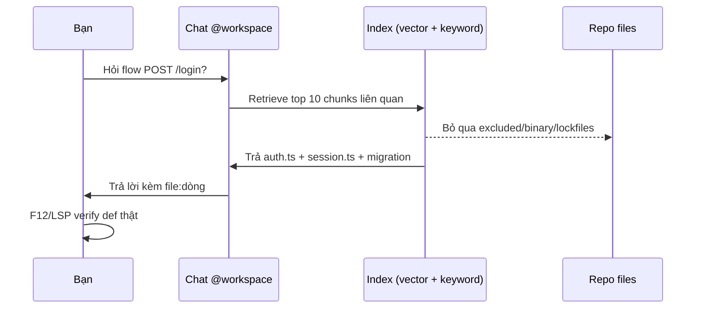

# 13 — Code Intelligence, Indexing & Telemetry: `@workspace` Hiểu Cả Repo Bạn

> **Dành cho:** dev đã dùng Copilot Chat nhưng `@workspace` hay trả lời chung chung, và admin/tech lead muốn đọc được index + usage của team (bài 13 series 01).
> **Vấn đề:** repo lớn mà không index thì chat chỉ đoán từ vài file đang mở; AI Credits hết mà không nhìn dashboard thì chỉ đoán ai ngốn cái gì.
> **Đọc xong:** bật được codebase indexing (Business/Enterprise), dùng `@workspace` + semantic search đúng cách, nối knowledge base, hiểu synergy LSP + Copilot, và đọc được audit log + usage dashboard.
> **Thời gian:** ~45 phút.

## Mục lục

1. [Giới ngố 9 khái niệm (2 phút)](#0-giới-ngố-9-khái-niệm-2-phút)
2. [Vì sao index + telemetry? (why)](#1-vì-sao-index--telemetry-why)
3. [`@workspace` hoạt động thế nào](#2-workspace-hoạt-động-thế-nào)
4. [Bật codebase indexing Business/Enterprise (copy-paste)](#3-bật-codebase-indexing-businessenterprise-copy-paste)
5. [Semantic search: hỏi cả repo đúng cách](#4-semantic-search-hỏi-cả-repo-đúng-cách)
6. [Knowledge bases: ký ức team dùng chung](#5-knowledge-bases-ký-ức-team-dùng-chung)
7. [LSP + Copilot synergy](#6-lsp--copilot-synergy)
8. [Audit logs + usage dashboards](#7-audit-logs--usage-dashboards)
9. [Walkthrough end-to-end (20 phút)](#8-walkthrough-end-to-end-20-phút)
10. [Pitfalls + fix](#9-pitfalls--fix)
11. [Bài tập](#10-bài-tập)
12. [Link chéo](#11-link-chéo)

---

## 0. Giới ngố 9 khái niệm (2 phút)

Mỗi khái niệm đủ 3 lớp: **1 câu định nghĩa**, **so sánh đời thường**, **ví dụ kỹ thuật thật** — kèm cột Verify để bạn tự kiểm chứng thay vì tin lời.

| Khái niệm | 1 câu định nghĩa | So sánh nôm na | Ví dụ kỹ thuật thật | Verify |
|---|---|---|---|---|
| **Codebase indexing** | Đánh mục lục cả repo để Copilot tìm đúng 5–10 đoạn liên quan thay vì đọc bừa. | Mục lục + index cuối sách: hỏi là lật đúng trang. | Repo 500 files → `@workspace flow POST /login?` trả đúng `auth.ts + session.ts + migration`. | Hỏi `@workspace` 1 flow thật → liệt kê ≤10 files kèm `file:dòng` đúng. |
| **`@workspace`** | Câu hỏi gửi cho cả repo, nhờ index tìm giúp. | Hỏi thủ thư "sách nào nói về refund?" thay vì tự lục kệ. | `@workspace trong apps/api auth dùng session hay JWT?` | Trả về files + dòng trích dẫn thật, không bịa. |
| **Semantic search** | Tìm theo ý nghĩa, không theo chữ khớp 100%. | Tìm "chỗ nuốt lỗi" ra cả `catch{}`, `catch(log)` dù chữ khác nhau. | `@workspace tìm mọi chỗ catch mà chỉ console.log rồi nuốt` | So với `grep catch` → ít hơn 5–10x mà trúng hơn. |
| **Knowledge base** | Tủ docs team (ADR, runbook) để Copilot trích quy ước, không bịa. | Sổ tay gia đình: code nói "làm gì", sổ nói "vì sao làm thế". | `@workspace theo base backend-conventions, viết API mới cần gì?` | Câu trả lời kèm link file docs nguồn. |
| **LSP** | Thầy kiểm chính tả types/symbols live trong IDE. | Gia sư đứng cạnh: viết sai type là gạch đỏ ngay. | F12 jump định nghĩa, F2 rename cả repo, Problems panel báo lỗi. | Chèn sai type → Problems đỏ đúng dòng trong 5 giây. |
| **Audit log / usage dashboard** | Camera + hóa đơn: ai làm gì, AI Credits đi đâu. | Sao kê ngân hàng: top user/model nào ngốn nhiều nhất. | Filter `action:copilot_policy`, metric `AI credits / user` (tên cũ: Premium requests). | Chỉ ra được top 1 model ngốn + actor đổi policy gần nhất. |
| **AI Credits** | Đơn vị tính tiền Copilot từ 01/06/2026 — 1 credit = 0,01 USD. | Thẻ nạp điện: xài hết credit tháng thì nạp thêm. | 1 lượt = giá per-token model × số token, quy đổi ra credits. | Mở `github.com/settings/copilot` xem credits đã dùng. |
| **Content exclusion** | Danh sách path bị cấm khỏi index — Copilot không thấy, không retrieve. | Dán băng đen lên camera: máy quay không ghi chỗ đó. | Admin đặt `**/.env*`, `**/secrets/**` trên github.com (mục 3.3). | Hỏi `@workspace` chuỗi trong `.env` → phải trả "excluded". |
| **OpenTelemetry export** | Tiêu chuẩn bắn số liệu (logs/metrics) ra hệ giám sát riêng. | Camera gửi phim về đầu ghi của khách, không để trong thẻ nhớ máy. | `managed-settings.json` → `telemetry.endpoint` (OTLP), `protocol`, `captureContent` (mục 7.4). | Admin trỏ endpoint của mình → thấy dòng telemetry đến. |

---

## 1. Vì sao index + telemetry? (why)

> **Câu hỏi then chốt:** vì sao phải bật index và đọc telemetry, thay vì để hai thứ chạy tự nhiên rồi chịu kết quả?

Không index, Copilot chỉ đọc 2–3 file bạn đang mở. Hỏi "auth flow chạy qua mấy lớp?" nó đoán thiếu domain/db layer. Hệ quả: bạn phải paste file từng cái vào chat, context phình, trả lời vẫn thiếu.

Hai lớp giải quyết 2 vấn đề khác nhau:

| Vấn đề | Công cụ | Nôm na |
|---|---|---|
| `@workspace` trả lời chung chung | **Codebase indexing** (Business/Enterprise): vector index cả repo → retrieve đúng 5–10 chunks | Thư viện có mục lục thay vì đọc bừa cả kho |
| AI Credits hết nhanh mà không biết vì sao | **Telemetry** (audit logs + usage dashboards): ai dùng gì, model nào ngốn | Sao kê thay vì đoán mò |

```text
Không index:     mở 3 files → hỏi @workspace → trả lời chung chung, thiếu db layer
Có index:        hỏi 1 câu → retrieve auth.ts + session.ts + migration → trả lời đúng graph

Không telemetry: "sao credits hết nhanh?" → đoán (model dở? ai đó spam agent?)
Có telemetry:    dashboard: agent mode × model mạnh = 70% AI Credits → biết kẻ ngốn
```

> **Quy tắc:** repo > 50 files mà chưa bật indexing là tự handicap. AI Credits hết mà chưa nhìn dashboard là đoán mò.

### 1.1. Sơ đồ `@workspace` retrieve



Đi 6 bước:

1. **Bạn hỏi:** luôn kèm scope hẹp (`trong apps/api`, `bỏ *.test.ts`) để giảm nhiễu 5x.
2. **Chat retrieve:** không đọc cả repo, chỉ xin index top-K chunks (embeddings + keyword hybrid).
3. **Index lọc:** files trong content exclusion, binary, `dist/*.min.js` bị bỏ qua — hỏi `.env` phải ra "excluded".
4. **Trả chunks:** kỳ vọng ≤10 files, mỗi file 1 dòng vì sao liên quan — nhiều hơn là prompt quá rộng.
5. **Trả lời + verify:** Copilot trả `file:dòng`, bạn F12 jump + Problems panel chéo — tin retrieve nhưng verify bằng LSP.
6. **Trễ index:** vừa push <5 phút thì index cũ → hỏi lại sau hoặc `#file` file mới trực tiếp.

> ✅ **Kỳ vọng:** hỏi mẫu mục 4.1 → trả đúng graph 3 lớp (handler → domain → db) trong 10–30 giây, không chung chung.

---

## 2. `@workspace` hoạt động thế nào

> **Câu hỏi:** `@workspace` lấy dữ liệu từ đâu, khi nào nó thắng `#file`, và giới hạn bạn phải chấp nhận?

**1 câu định nghĩa:** `@workspace` là chat participant đại diện cho cả repo — bạn gõ `@workspace <câu hỏi>`, Copilot KHÔNG đọc toàn bộ repo mà retrieve top chunks liên quan từ index (embeddings + keyword hybrid), rồi đưa vào context trả lời.

**So sánh nôm na:** hỏi thư viện "sách nào nói về refund?" — thư viện không cầm cả kho sách ra, chỉ tra mục lục rồi bưng đúng 3 cuốn liên quan tới.

**Ví dụ thật:**

```text
@workspace trong apps/api, flow POST /login chạy qua những files nào?
# Kỳ vọng: trả ≤10 files, mỗi file 1 dòng lý do, kèm file:dòng.
# (nếu trả "không thấy gì" → xem debug checklist mục 4.3)
```

**Index ở đâu?** Local embeddings (Individual: index trên máy bạn) hoặc GitHub-hosted index (Business/Enterprise: index phía GitHub, cập nhật khi push). Enterprise có thêm knowledge bases (docs ngoài code).

### 2.1. Khi nào `@workspace` thắng `#file` (bảng)

| Nhu cầu | Hiểu nôm na | `#file` / mở tay | `@workspace` |
|---|---|---|---|
| Hỏi 1 file cụ thể | Hỏi 1 trang sách. | ✓ nhanh, chính xác | Thừa (retrieve nhiễu) |
| Hàm này ai gọi, flow xuyên mấy lớp? | Hỏi cả đường đi qua 3 nhà. | Mở tay 10 files | ✓ retrieve theo graph thật |
| Tìm pattern lặp (error handling, logging) | Tìm mọi chỗ làm ẩu giống nhau. | Grep tay từng chỗ | ✓ semantic search cả repo |
| Repo JS thuần nhỏ (<20 files) | Sách mỏng đọc hết cũng được. | ✓ đủ | Không cần index |
| Monorepo 500+ files | Thư viện lớn không mục lục là chết. | Mở tay là chết | ✓ bắt buộc index |

### 2.2. Giới hạn bạn phải biết

```text
- Index có độ trễ: push xong chờ ~5 phút mới có code mới.
- Files trong content exclusion KHÔNG được index (mục 3.3).
- Binary + lockfiles bị bỏ qua khỏi retrieve.
# Verify: git log --oneline -3 → xem giờ push; file mới chưa kịp index thì hỏi bằng #file.
```

### 2.3. Hiểu nhầm thường gặp (mục 2)

| Hiểu nhầm | Sự thật |
|---|---|
| "`@workspace` đọc cả repo nên hỏi càng rộng càng hay" | Chỉ lấy top-K chunks — hỏi "giải thích cả repo" là nhận đáp án thiếu. Chia nhỏ mỗi câu 1 flow. |
| "Index là realtime" | Push xong chờ ~5 phút. Verify: `git log --oneline -3` xem giờ push, file mới dùng `#file`. |

---

## 3. Bật codebase indexing Business/Enterprise (copy-paste)

> **Câu hỏi:** bật index ở đâu, cấu hình gì TRƯỚC khi bật, và verify exclusion có thật sự hiệu lực? Mục 3.2–3.3 cho admin/org owner; mục 3.4 dev tự làm trên máy.

### 3.1. Kiểm tra plan + trạng thái index

```bash
# 1. Kiểm tra plan org bạn (admin hoặc settings):
# github.com → Settings → Copilot → Policies → xem Codebase indexing: on/off
# Individual: indexing local tự động khi mở VS Code (không có switch org).

# 2. Kiểm tra trong VS Code (máy bạn):
# Chat view → gõ @workspace → nếu hiện "indexing..." là đang build lần đầu.
# Chờ xong mới hỏi (repo lớn: lần đầu 10–30 phút).
# Verify: hỏi lại sau 30 phút → trả lời cụ thể file:dòng, không còn "indexing...".
```

### 3.2. Bật cho org (admin, checklist)

```text
# Checklist admin (github.com → Org Settings → Copilot → Policies):
[ ] Codebase indexing: ON (chọn repos nào được index — đừng index cả org ngày đầu)
[ ] Content exclusion: cấu hình TRƯỚC khi bật index (không index .env, secrets/)
[ ] Repos thí điểm: 2–3 repos core trước, đo hit rate rồi mở rộng
[ ] Thông báo team: "push xong chờ ~5 phút index mới có code mới"
```

### 3.3. Content exclusion + index (cấu hình trước, hối hận sau)

```jsonc
// Ví dụ ý tưởng exclusion (admin cấu hình trên github.com, không phải file local):
// Paths bị exclude KHỎI index (Copilot không thấy, không retrieve):
//   - **/.env*          → secrets local
//   - **/secrets/**     → thư mục nhạy cảm
//   - **/*.pem, **/*.key → private keys
//   - vendor/, dist/, *.min.js → nhiễu build output
```

```bash
# Verify exclusion có hiệu lực (máy dev, làm 1 lần):
# Hỏi trong Chat: "@workspace tìm chuỗi trong .env (ví dụ STRIPE_KEY)?"
# Kỳ vọng: trả "không thấy / excluded". Nếu đọc được key thật → exclusion hỏng, sửa paths.
```

### 3.4. Repo settings tối ưu index (máy bạn)

```bash
# 1. .vscode/settings.json — loại nhiễu khỏi workspace (index sạch hơn):
#    thêm files.exclude + search.exclude cho build output:
#    node_modules, dist, .next, coverage → exclude khỏi search/index local.

# 2. .gitignore sạch = index sạch (index theo git-tracked files):
git check-ignore -v dist/bundle.js node_modules/.package-lock.json
# Verify: phải ra "ignored". File nào chưa ignore mà to → index phình, thêm vào .gitignore.

# 3. Monorepo: chỉ mở package bạn làm (đừng mở root 5000 files):
#    VS Code → File → Add Folder to Workspace → chỉ apps/api (index nhanh ~10x).
```

---

## 4. Semantic search: hỏi cả repo đúng cách

> **Câu hỏi:** hỏi `@workspace` thế nào để trả lời đúng ngay lần đầu, và debug ở đâu khi nó trả lời sai?

### 4.1. Công thức hỏi (4 mẫu copy-paste)

```text
# Mẫu 1 — flow xuyên lớp (thay grep mù):
@workspace flow POST /login chạy qua những files nào (handler → domain → db)?
Trả về ≤10 files + 1 dòng/file vì sao liên quan.

# Mẫu 2 — find references ngữ nghĩa (thay grep 200 kết quả):
@workspace liệt kê mọi call sites thật của refreshToken trong src/,
bỏ test snapshot, comment và log. Chỉ code chạy thật.

# Mẫu 3 — pattern audit (việc grep không làm được):
@workspace tìm mọi chỗ catch error mà chỉ console.log rồi nuốt (swallowed errors)
trong apps/api. Liệt kê file:dòng.

# Mẫu 4 — impact analysis trước refactor:
@workspace nếu tôi đổi signature loginWithSSO, những files nào vỡ?
Xếp theo rủi ro (trực tiếp → gián tiếp qua re-export).
```

> **Mẹo:** mỗi câu ≤1 flow. "Giải thích cả repo" là câu hỏi không có đáp án đúng.

### 4.2. Thu hẹp scope khi repo lớn (3 kỹ thuật)

```text
# Kỹ thuật 1 — kèm đường dẫn (giảm nhiễu 5x):
@workspace trong apps/api (bỏ apps/web) auth flow dùng session hay JWT?

# Kỹ thuật 2 — 2 bước: @workspace định vị → #file đọc sâu:
# Bước 1: "@workspace file nào định nghĩa retry policy?"
# Bước 2: "#file src/lib/retry.ts giải thích backoff params" (đọc sâu 1 file)

# Kỹ thuật 3 — loại test khỏi đáp án khi không cần:
@workspace (bỏ qua **/*.test.ts) middleware nào chạy trước mọi route /admin?
```

### 4.3. Khi `@workspace` trả lời sai (debug checklist)

```bash
# 1. Index cũ? (vừa push code mới)
git log --oneline -3
# → push < 5 phút thì index chưa kịp → hỏi lại sau, hoặc #file file mới.

# 2. File bị excluded?
# → hỏi "@workspace có thấy file X không?" — không thấy thì check exclusion (mục 3.3).

# 3. Câu hỏi quá rộng ("giải thích cả repo")?
# → chia nhỏ: flow auth trước, flow payment sau (mỗi câu ≤1 flow).

# 4. Monorepo mở cả root?
# → đóng bớt folder, chỉ mở package liên quan (mục 3.4).
```

---

## 5. Knowledge bases: ký ức team dùng chung

> **Câu hỏi:** khi nào cần một tủ docs riêng cho Copilot trích, và tạo/triển khai theo thứ tự nào? Dành cho admin Enterprise.

**1 câu định nghĩa:** knowledge base (Enterprise) là tập docs ngoài code (markdown, wiki, ADRs, runbooks) được index riêng — Copilot retrieve khi bạn hỏi. Code trả lời "làm gì", knowledge base trả lời "vì sao làm thế".

**So sánh nôm na:** tủ hồ sơ công ty: khi nhân viên mới hỏi "quy định refund thế nào?", không cần đọc lại toàn bộ code — chỉ bưng ra đúng 1 ADR.

**Khi nào cần?** Team > 5 người, có ADRs/conventions, onboarding tốn 2 tuần vì "quy ước nằm trong đầu senior". Không có docs thì knowledge base rỗng — viết docs trước (ít nhất `copilot-instructions.md`, bài 03).

```bash
# Tạo knowledge base (admin, github.com → Copilot → Knowledge bases):
# 1. New knowledge base → chọn repos chứa docs (vd docs/, .github/, wiki)
# 2. Đặt tên rõ: "backend-conventions", "payment-domain"
# 3. Gán repos nào được dùng base này (đừng gán all — nhiễu chéo domain)
```

```text
# Dùng trong chat (copy-paste):
@workspace theo knowledge base backend-conventions, viết API mới phải tuân thủ
những quy ước nào (error format, logging, auth)? Liệt kê checklist.
# Kỳ vọng: Copilot trích docs team (kèm link file), không bịa quy ước chung chung.
```

```text
# Quy tắc docs để knowledge base hữu ích (viết 1 lần, dùng mãi):
# - Mỗi ADR ≤1 trang: context → quyết định → hậu quả (đừng viết tiểu thuyết)
# - copilot-instructions.md ≤150 dòng, chỉ quy ước BẮT BUỘC (bài 03)
# - Runbook incident: symptom → fix → verify (Copilot retrieve khi oncall hỏi)
```

---

## 6. LSP + Copilot synergy

> **Câu hỏi:** vì sao bật Language Server song song với Copilot lại cho kết quả chính xác hơn, và workflow 5 bước trông ra sao?

**1 câu định nghĩa:** Copilot completions + chat đọc text; Language Server (LSP) hiểu types/symbols. Bật cả hai = Copilot gợi ý khớp type, `@workspace` jump chính xác.

**So sánh nôm na:** Copilot là bạn đồng nghiệp giỏi gợi ý nhanh; LSP là thầy kiểm tra chính tả. Bạn giỏi nhưng thầy mới bắt được lỗi type — thiếu 1 trong 2 là hỏng.

| Nhu cầu | Chỉ Copilot | Copilot + LSP (VS Code) |
|---|---|---|
| Jump to definition | Đoán theo text | ✓ chính xác (F12 qua server) |
| Rename hàm an toàn | Sửa tay từng chỗ | ✓ F2 rename symbol cả repo |
| Diagnostics sau sửa | Chờ chạy test | ✓ gạch đỏ live trong editor |
| Copilot hỏi "còn lỗi type?" | Không biết | ✓ đọc Problems panel |

```bash
# Bật LSP theo stack (máy dev, cài 1 lần):
# TypeScript: có sẵn trong VS Code (không cần cài thêm)
# Python: extension Pylance hoặc Pyright
# Go: extension Go (tự kéo gopls) · Rust: rust-analyzer · Java: Extension Pack for Java
code --list-extensions | grep -i -E "pylance|go|rust-analyzer|redhat.java"
# Verify: thiếu extension nào thì cài đúng cái đó; grep ra tên = đã có.
```

```text
# Workflow chuẩn task typed (5 bước, dán lên tường):
# 1. @workspace định vị (files nào) → 2. F12 jump (def thật, LSP) →
# 3. Edit (Copilot inline giúp) → 4. Problems panel xanh? (LSP) →
# 5. Chạy focused test file đổi (không full suite mỗi turn)
# Full typecheck + full suite để CI, không chạy tay mỗi lần sửa.
```

```text
# Prompt kết hợp LSP + Copilot (copy-paste):
"@workspace find references của refreshToken, rồi với mỗi ref cho biết
type signature tại đó (dùng hover/LSP info). Chỗ nào truyền sai type?"
# Kỳ vọng: Copilot retrieve refs + bạn verify bằng LSP hover, 2 lớp chéo nhau.
```

---

## 7. Audit logs + usage dashboards

> **Câu hỏi:** đọc dữ liệu nào để biết ai làm gì (audit log) và AI Credits đi đâu (dashboard), rồi biến thành hành động hằng tuần? Dành cho admin/org owner + tech lead.

### 7.1. Audit logs: ai làm gì (admin)

```bash
# Xem ở: github.com → Org/Enterprise Settings → Audit log
# Filter gợi ý (gõ vào ô search audit log):
#   action:copilot           (mọi sự kiện Copilot)
#   action:copilot_policy    (ai đổi policy/exclusion)
#   action:copilot_seat      (ai được thêm/bớt seat)

# Ví dụ ca thực tế: "ai tắt content exclusion tuần trước?"
# → filter action:copilot_policy + time range 7 ngày → ra actor + diff thay đổi.
# Kỳ vọng: thấy tên user + thời gian + trước/sau của policy.
```

### 7.2. Usage dashboards: tiền đi đâu (metrics đáng nhìn)

| Metric | Câu hỏi | Ngưỡng action |
|---|---|---|
| AI credits / user (tên cũ: Premium requests) | Ai ngốn nhiều credits? | Top 5 user > 3x median → coaching (agent + model đắt?) |
| Requests by model | Model nào ngốn? | Model đắt > 50% requests → gate lại (bài 14) |
| Agent mode % | Agent có bị lạm dụng? | Agent cho task 1 dòng → training lại modes (bài 10) |
| Exclusion blocks | Exclusion chặn nhầm? | Block tăng đột biến → paths sai (bài 15) |
| Seats vs active | Thừa seats? | Active < 50% seats 2 tháng → thu hồi |

```bash
# Export metrics phân tích local (admin, API audit log):
gh api /orgs/<ORG>/audit-log --paginate -f per_page=100 \
  -f phrase="action:copilot" --jq '.[] | [.actor, .action, .created_at] | @tsv' \
  > /tmp/copilot-audit.tsv
# Kỳ vọng: file TSV 3 cột (actor, action, created_at) — pivot count by actor/action/tuần.
```

### 7.3. Vòng lặp tối ưu hàng tuần (15 phút/tuần, admin + team lead)

```text
# Thứ 2 hàng tuần (calendar block 15 phút):
# 1. Dashboard: top model ngốn + top user ngốn (5 phút)
# 2. Hỏi 1 câu: "ngốn có chính đáng không?" (agent refactor lớn: ok;
#    ask typo bằng model đắt: coaching) (5 phút)
# 3. Fix 1 cái: gate model, hẹp scope, hoặc training (5 phút — bài 14 + 15)
# Quy tắc: metrics không action là sưu tầm. Mỗi tuần fix đúng 1 cái.
# Kỳ vọng: sau 4 tuần, top model ngốn giảm ≥20%.
```

### 7.4. Telemetry/OpenTelemetry + budget controls (admin/org owner)

> **Câu hỏi:** ngoài dashboard sẵn có, số liệu còn gửi về hệ thống giám sát của bạn bằng cách nào, và chặn chi phí vượt kế hoạch bằng công tắc nào?

**a) Giới hạn của audit log (biết trước để khỏi kỳ vọng sai):**

```bash
# Audit log lưu 180 ngày → cần giữ lâu hơn thì stream sang SIEM.
# Log KHÔNG chứa session data/prompt của client.
# Muốn log prompt/agent thì tự hook (vd: CLI events → logging của riêng bạn).
# Verify: filter action:copilot → không thấy nội dung prompt nào.
```

**b) OpenTelemetry export qua `managed-settings.json`:**

```jsonc
// "telemetry" = cách Copilot bắn số liệu ra endpoint OTLP của bạn:
// {
//   "telemetry": {
//     "enabled": true,
//     "endpoint": "https://otel.example.com/v1/traces",   // OTLP endpoint
//     "protocol": "http/json",        // hoặc "http/protobuf"
//     "captureContent": false,        // có muốn gửi cả nội dung prompt?
//     "lockCaptureContent": true,     // khóa lại để user không override
//     "serviceName": "copilot-cli",
//     "resourceAttributes": { "team": "payments" },
//     "headers": { "Authorization": "Bearer <token>" }
//   }
// }
// Áp dụng cho: Copilot CLI, VS Code, GitHub Copilot app, cloud agent, JetBrains IDEs.
// Verify: sau 1 phiên chạy, log phải về đúng endpoint bạn khai.
```

**c) Budget controls — chặn AI Credits chạy vượt (checklist):**

```text
# Checklist admin (FACT-PACK 10/2026):
[ ] Paid usage policy (cho phép chi vượt credit kèm theo) = BẬT mặc định.
    Muốn cap chi phí → phải TẮT đi, không tắt là team xài tự do.
[ ] Sau khi hết credit kèm theo: "additional usage budget" áp dụng
    (spend cap cấu hình được; cá nhân có thể bị giới hạn theo usage history).
[ ] User hết limit → gửi yêu cầu tăng budget; owner/billing manager duyệt
    Adjust/Deny trong settings (GA trên Business/Enterprise dùng usage-based
    billing, KHÔNG gồm enterprise managed users — thay đổi 09/2026).
[ ] Ưu tiên lệnh trong managed settings: deny > ask > allow.
    "ask" không thể bị bypass/YOLO mode hay approval đã lưu làm thỏa.
[ ] Tiết kiệm hợp pháp: auto model selection (Chat, CLI, Copilot app, cloud agent)
    giảm 10% cho plan trả phí → dashboard cháy credits chậm hơn.
```

---

## 8. Walkthrough end-to-end (20 phút)

> **Câu hỏi:** thứ tự 20 phút nào biến mọi lý thuyết ở trên thành kết quả thật trên repo của bạn?

**Phút 0–5 (verify index):**

```bash
# Hỏi thử trong Chat:
# "@workspace flow POST /login chạy qua những files nào? ≤10 files."
# Kỳ vọng: đúng graph 3 lớp (sai → chạy debug checklist mục 4.3).
git log --oneline -3
# Verify: code mới đã push > 5 phút chưa.
```

**Phút 5–10 (semantic search + thu hẹp):**

```text
# Chạy mẫu 3 (swallowed errors) ở mục 4.1, thêm scope "trong apps/api".
# So số kết quả với grep tay "catch" — kỳ vọng ít hơn 5–10x mà trúng hơn.
# Lấy 1 hit → #file đọc sâu file đó.
```

**Phút 10–15 (LSP synergy):**

```bash
# F12 jump vào 1 hàm @workspace vừa tìm → F2 rename thử (Ctrl+Z sau đó).
# Mở Problems panel: 0 errors? → workflow 5 bước mục 6 đã chạy được.
code --list-extensions | grep -i -E "pylance|go|rust-analyzer"
```

**Phút 15–20 (telemetry 1 metric):**

```bash
# Admin (hoặc nhờ admin): mở usage dashboard → ghi top model ngốn tuần này.
# Dev: mở audit log filter action:copilot_policy → exclusion ai đổi lần cuối?
# Ghi 1 dòng team log: "index hit ok / model X ngốn Y% / exclusion sạch".
```

---

## 9. Pitfalls + fix

> **Câu hỏi:** 7 lỗi hay gặp nhất khi dùng index + telemetry, và fix từng cái bằng gì?

| Pitfall | Vì sao | Fix |
|---|---|---|
| Hỏi `@workspace` ngay sau push | Index trễ vài phút, code mới chưa có | Chờ ~5 phút hoặc `#file` file mới trực tiếp |
| Exclusion chặn file cần | Admin exclude cả `src/` nhầm, retrieve rỗng | Verify bằng câu hỏi `.env` (mục 3.3), sửa paths |
| Mở cả monorepo root | Index/retrieve nhiễu, context phình | Chỉ mở package đang làm (mục 3.4) |
| Câu hỏi cả repo 1 lúc | Retrieve top-K không cover, trả lời thiếu | Chia nhỏ theo flow, mỗi câu ≤1 flow |
| Không docs mà đòi knowledge base | Base rỗng, retrieve ra chung chung | Viết `copilot-instructions.md` + ADRs trước (bài 03) |
| Tin `@workspace` thay LSP verify | Retrieve sai file, sửa nhầm chỗ | F12/LSP jump + Problems panel verify trước khi sửa |
| Dashboard đẹp không action | AI Credits vẫn hết, ngốn vẫn ngốn | Mỗi tuần fix top 1 ngốn (mục 7.3) |

---

## 10. Bài tập

> **Câu hỏi:** làm 3 bài nào để tự mình thấy index + LSP + telemetry hiệu quả, thay vì chỉ tin lời bài viết?

**Bài 1 (20 phút — `@workspace` + scope):**

1. Chạy mẫu 1 + mẫu 3 (mục 4.1) trên repo bạn, kèm scope package hẹp.
2. So số files đọc với cách grep/mở tay — ghi tỉ lệ giảm (kỳ vọng 5–10x).
3. Lấy 1 hit sai/nhiễu → debug bằng checklist mục 4.3, ghi nguyên nhân.

**Bài 2 (15 phút — LSP synergy):**

1. F12 jump 3 hàm `@workspace` tìm được — có đúng def thật không?
2. F2 rename 1 symbol thử (rồi undo), `git diff --stat` xem đổi đúng files không.
3. Cố tình chèn 1 lỗi type → Problems panel bắt đúng dòng trong bao lâu?

**Bài 3 (20 phút — telemetry):**

1. (Admin/cùng admin) Mở usage dashboard: top model + top 3 user ngốn là ai?
2. Audit log filter `action:copilot_policy`: policy/exclusion đổi lần cuối khi nào, ai đổi?
3. Đề xuất 1 fix (gate model / training / exclusion) + metric verify sau 1 tuần.

> **Đạt:** task xuyên 3 lớp chỉ đọc ≤10 files (nhờ index) + chỉ ra được top ngốn AI Credits bằng dashboard, không đoán.

---

## 11. Link chéo

| Bạn muốn... | Đọc bài |
|---|---|
| `copilot-instructions.md` là docs tối thiểu để knowledge base có gì retrieve | [03 — Instructions/Memory/Rules](./03-instructions-memory-rules.md) |
| `@workspace`, `#file`, `#selection` tra cứu đầy đủ + công thức 5 lệnh đầu | [04 — Chat commands toàn tập](./04-chat-commands-toan-tap.md) |
| Content exclusion cấu hình ở đâu, ai được đổi | [07 — Policies/guardrails](./07-policies-guardrails-tu-dong-hoa.md) |
| Nối tools ngoài khi `@workspace` không đủ (DB, browser, GitHub) | [08 — MCP](./08-mcp-ket-noi-cong-cu-ngoai.md) |
| Ask/Edit/Agent + approval gate trước khi agent chạy lệnh retrieve | [10 — Modes/Permissions](./10-modes-permissions-availability.md) |
| Model nào ngốn AI Credits trên dashboard → gate lại | [14 — Models](./14-models-chon-model-dung.md) |
| Exclusion là tầng 1, secret scanning là tầng 2 | [15 — Security 5 tầng](./15-security-stack-5-tang.md) |
| Tools retrieve thêm có đáng tin không (validate) | [16 — Extensions/MCP validate](./16-extensions-mcp-bao-mat-validate.md) |
