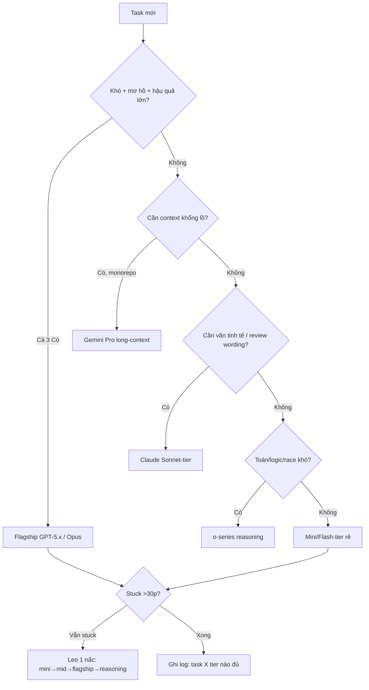

# 14 — Models: Chọn Model Đúng (GPT-5.x / Claude / Gemini / o-series Trên Copilot)

> **Bài 14 series 01.** · **Dành cho:** dev đang chọn model trong picker mỗi ngày, và tech lead/admin muốn gate model + kiểm soát AI Credits cho team.
> **Vấn đề:** model mạnh nhất không phải lúc nào cũng là model đúng — chọn sai là đốt AI Credits hoặc refactor 3 lần vẫn sai.
> **Đọc xong:** chọn đúng model cho từng task, hiểu cách tính tiền AI Credits (thay cho "premium requests multiplier"), cấu hình BYOK/policy gate model cho team, và không trả model đắt cho việc model rẻ làm được.
> **Thời gian:** ~40 phút.

## Mục lục

1. [Vì sao chọn model? (why)](#1-vì-sao-chọn-model-why)
2. [Bản đồ models trên Copilot 2026](#2-bản-đồ-models-trên-copilot-2026)
3. [Model picker: đổi ở đâu, ảnh hưởng gì](#3-model-picker-đổi-ở-đâu-ảnh-hưởng-gì)
4. [Premium requests multiplier (tiền thật)](#4-premium-requests-multiplier-tiền-thật)
5. [BYOK + enterprise policy: gate model cho team](#5-byok--enterprise-policy-gate-model-cho-team)
6. [Khi nào dùng model nào (bảng dán tường)](#6-khi-nào-dùng-model-nào-bảng-dán-tường)
7. [Route theo phase + agent routing](#7-route-theo-phase--agent-routing)
8. [Walkthrough end-to-end (20 phút)](#8-walkthrough-end-to-end-20-phút)
9. [Pitfalls + fix](#9-pitfalls--fix)
10. [Bài tập](#10-bài-tập)
11. [Link chéo](#11-link-chéo)

---

## 0. Giải ngố thuật ngữ (1 câu + analogie + verify)

Section này trả lời: 5 khái niệm lõi của bài này (cộng 4 khái niệm bổ sung: AI Credits, auto model selection, auto tier, deprecation) nghĩa là gì, và tự kiểm chứng từng cái ở đâu?

Mỗi dòng có đủ 3 lớp: **hiểu nôm na**, **ví dụ đời thường**, **ví dụ kỹ thuật thật** — cộng cột **verify** để bạn tự kiểm tra.

| Thuật ngữ | Hiểu nôm na (1 câu) | Analogie | Ví dụ kỹ thuật thật | Verify |
|---|---|---|---|---|
| **Model picker** | Nút chọn "bộ não" cho từng chat (rẻ/đắt khác nhau). | Như chọn xe: xe đạp (mini) đi chợ, xe tải (flagship) chở nhà. | Chat view → dropdown góc dưới → `GPT-5.x / Claude Sonnet / Gemini Pro / mini`. | Đổi model → chat mới hiện tên model mới trên header. |
| **Premium request multiplier** | Hệ số nhân tiền kiểu cũ: model đắt tốn gấp nhiều lần model rẻ. Từ 01/06/2026 chuyển sang AI Credits (mục 4). | Như giá điện giờ cao điểm ×3 — bật điều hòa flagship là hóa đơn bốc. | Mini ×0–0.5, Mid ×1, Flagship ×2–3, Reasoning ×3–5 (khung, tra billing exact). | Billing → Copilot usage xem % đã dùng + tốc độ hết tháng. |
| **Flagship (GPT-5.x / Opus-tier)** | Bộ não mạnh nhất, hợp việc khó mơ hồ. | Như giáo sư: hỏi khó mới cần, hỏi đường thì phí. | Thiết kế migrate auth 5 files, debug stuck 1h. | Task khó: flagship 1 lần đúng; mini thử 3 lần vẫn sai. |
| **Reasoning (o-series)** | Bộ não nghĩ lâu, hợp toán/logic/race khó. | Như ngồi thiền 30 phút để giải toán khó — đừng nhờ mua rau. | Tối ưu query, race condition, thuật toán. | Latency cao rõ (chờ lâu) nhưng chain-of-thought dài. |
| **BYOK / Model gating** | Công ty tự mang chìa khóa + khóa tủ: ai được dùng model nào. | Như bố giữ két: con nhỏ chỉ lấy ngăn mini, anh lớn mới mở ngăn flagship. | Interns chỉ mini+mid, seniors mới flagship (Org Settings → Policies). | Mở picker → model bị cấm phải không hiện. |
| **AI Credits** | Đơn vị tính tiền của Copilot từ 01/06/2026 — 1 credit = 0,01 USD. | Như thẻ nạp xăng: xài theo lít, không theo số lần bơm. | Chi phí 1 lượt = giá per-token của model × số token, quy đổi ra credits. | `github.com/settings/copilot` xem credits đã dùng và tốc độ cháy. |
| **Auto model selection** | Để Copilot tự chọn model cho mỗi lượt thay vì bạn bấm picker. | Như taxi tự chọn tuyến: avoids đường đang kẹt, bạn không phải lái. | 2 hệ thống: health thời gian thực + đánh giá độ phức tạp task → route model. | Trong Chat để model ở "Auto" → terminal/chat in ra model đã dùng. |
| **Auto tier** | 3 hướng route trong auto selection: Efficiency (rẻ), Balance (cân), Intelligence (đẹp). | Như chọn chế độ quạt: Eco / Auto / Turbo — cùng cái quạt, khác mục tiêu. | `efficiency` / `balance` / `intelligence` (ra mắt 14/09/2026). | Đổi tier → bill vẫn tính theo model auto chọn, không đổi giá (mục 3.1). |
| **Deprecation** | Model bị gỡ khỏi Copilot — picker sẽ không còn, phải đổi sang bản thay thế. | Như siêu thị ngưng bán loại nước mắm cũ → nhãn mới thay vào chỗ đó. | 10/02/2026: Gemini 3.5/3.6 Flash, Kimi K2.7 Code, Claude Opus 4.7 bị deprecated. | Mở picker tìm model cũ → không thấy, thấy bản thay thế (mục 2.6). |

---

## 1. Vì sao chọn model? (why)

Section này trả lời: chọn model ảnh hưởng tới tiền và chất lượng thế nào, và quy tắc vàng nào quyết định model nào?

Model mạnh nhất không phải lúc nào cũng là model đúng. Mỗi task có 3 chiều cần cân: **chất lượng suy luận — tốc độ — chi phí (AI Credits)**. Dùng sai chiều là mất credits hoặc mất thời gian:

- Dùng model reasoning đắt sửa typo → tốn gấp 5–10 lần mà kết quả y hệt model rẻ.
- Dùng model mini thiết kế kiến trúc → thiếu depth, refactor 3 lần vẫn sai, tổng credits cao hơn 1 lần model mạnh đúng ngay.
- Không hiểu cách tính tiền → shock khi credit tháng hết sau 1 tuần agent mode (mục 4).

Nguyên tắc vàng:

```text
Task khó, mơ hồ, hậu quả lớn → model mạnh (GPT-5.x / Claude Sonnet-Opus / Gemini Pro).
Task rõ ràng, lặp lại, khối lượng lớn → model rẻ + nhanh (mini/flash/haiku-tier).
Không bao giờ default model đắt nhất — chỉ gọi đích danh khi cần reasoning sâu.
```

### 1.1. Sơ đồ route model 30 giây (mermaid)



Giải thích từng bước:

1. **A → B:** Checklist 3✓ mục 2.2 (nhiều steps + đã thử rẻ mà fail + sai là đau) — đủ 3 mới flagship.
2. **B → C:** Flagship cho thiết kế/refactor multi-file, migration prod, debug stuck.
3. **D → E:** Monorepo hỏi rộng ("tóm tắt cả package") → Gemini long-context thay vì nhét 20 files vào flagship.
4. **F → G:** Docs, PR description, review wording bị GPT chê "quá máy" → đổi Claude.
5. **H → I:** Thuật toán/query/race cần thinking dài → o-series, chấp nhận chờ lâu.
6. **Mặc định J:** Autocomplete, rename, CRUD, test, explore 5 hướng song song → mini rẻ nhất.
7. **K → L:** Stuck thì leo thang, không nhảy cóc mini→reasoning (đốt credits).
8. **M:** Ghi 1 dòng team wiki để lần sau route đúng ngay.

> ✅ **Kỳ vọng thấy gì:** đổi model ở picker → header chat hiện tên mới. Billing usage sau 1 tuần cho thấy flagship <30% requests (nếu >50% là routing hỏng).

- Quản lý: model picker đổi mỗi chat; org policy gate models cho team (mục 5);
  cost thực tế: usage dashboard (bài 13) sau mỗi tuần.

---

## 2. Bản đồ models trên Copilot 2026

Section này trả lời: tháng 10/2026 Copilot có những model nào, model nào vừa bị gỡ, và phân loại theo vai trò để route nhanh là thế nào?

> Danh sách model đổi theo quý — tra model picker thực tế, đừng học thuộc lòng.
> Bảng dưới là khung phân loại để bạn route đúng, không phải catalog bất biến.

### 2.1. Bảng tổng (vai trò, không phải giá tuyệt đối)

| Nhóm | Hiểu nôm na | Ví dụ trên picker | Ví dụ task nên dùng | Vai trò |
|---|---|---|---|---|
| **GPT-5.x (flagship)** | Giáo sư toàn diện — khó gì cũng nghĩ được. | GPT-5.5, GPT-6.1 Sol, GPT-6 Astra | Plan migrate auth 5 files; debug stuck 1h. | Suy luận sâu, agent multi-step, refactor lớn |
| **o-series (reasoning)** | Nhà toán học trầm ngâm — chậm mà sâu. | Lớp reasoning (tên picker 10/2026 cần verify — xem mục 2.6) | Tối ưu query N+1, race condition retry. | Toán/logic khó, debug stuck, cần chain-of-thought dài |
| **Claude trên Copilot** | Nhà văn tinh tế — viết hay, review khéo. | Claude Sonnet 5.5, Claude Opus 5.5 | Viết docs, PR description, review wording giữ style. | Viết + giải thích code dài, docs, review tinh tế |
| **Gemini trên Copilot** | Thủ thư nhớ cả thư viện — context khổng lồ. | Gemini 3.1 Pro, Gemini 3.8 Flash | Tóm tắt cả `apps/api`, hỏi xuyên monorepo. | Context rất dài, retrieve monorepo, task đa ngữ |
| **Mini/Flash-tier (rẻ)** | Xe ôm nhanh rẻ — việc nhỏ gọi ngay. | GPT-5.4 mini, Claude Haiku 4.5, Gemini 3.8 Flash | Autocomplete, rename, CRUD, 5 chats explore song song. | Việc hàng ngày: complete, test, CRUD, explore |

### 2.2. GPT-5.x — flagship mặc định khi cần depth

```text
GPT-5.x: mạnh toàn diện, hợp agent mode multi-step (plan → edit → test → fix).
Dùng cho: thiết kế, refactor multi-file, debug khó, review quan trọng.
Giá quota: multiplier cao (mục 4) — đừng dùng sửa typo.
```

Khi nào gọi flagship (checklist):

```text
✓ Task kéo dài nhiều steps, cần coherence xuyên suốt?
✓ Đã thử model rẻ mà stuck / quality chưa đạt?
✓ Hậu quả sai cao (migration prod, security-critical)?
→ Cả 3 ✓ thì flagship. Thiếu 1 thì thử tier giữa trước đã.
```

### 2.3. o-series — reasoning, chậm mà sâu

```text
o-series: thinking dài, latency cao, hợp bài toán logic/toán/constraints khó
(thuật toán, query tối ưu, debug race condition). KHÔNG hợp: chat nhanh, sửa
lặt vặt (chờ lâu, tốn credits), task cần đọc context khổng lồ.
```

### 2.4. Claude / Gemini trên Copilot — khi nào đổi nhà

```text
Claude-tier: mạnh viết lách + giải thích (docs, PR description, review comments
tinh tế, refactor giữ style). Đổi sang khi GPT trả lời cộc/quá "máy".

Gemini-tier: context window rất dài → monorepo khổng lồ, "tóm tắt cả package",
task cross-file rộng. Đổi sang khi model khác kêu thiếu context.
```

### 2.5. Mini/Flash-tier — việc nhỏ + fan-out

```text
Mini/Flash: rẻ nhất, nhanh nhất. Việc nhỏ (autocomplete, rename, grep/explore,
tóm tắt, classify) + fan-out: 5 prompt explore song song rẻ hơn 1 flagship mà
cover rộng hơn. Lưu ý: context + reasoning yếu hơn — đừng giao kiến trúc.
```

### 2.6. Danh sách model 10/2026 + model ngừng hỗ trợ (10/02/2026)

Section này trả lời: tên model chính xác đang có trên picker, và 4 model nào vừa bị gỡ để bạn đừng dùng nữa?

```text
# Danh sách model trên Copilot — tháng 10/2026 (tra picker thực tế, đổi theo quý)
# OpenAI: GPT-5 mini, GPT-5.3-Codex, GPT-5.4, GPT-5.4 mini, GPT-5.4 nano
#   (Codex VS Code ext only, Pro+ only), GPT-5.5, GPT-5.6 Luna / Sol / Terra,
#   GPT-6 Astra, GPT-6 Luna, GPT-6 Sol, GPT-6.1 Sol.
# Anthropic: Claude Fable 5, Claude Fable 5.1, Claude Haiku 4.5,
#   Claude Opus 4.5 / 4.6 / 4.7 / 4.8 (+ fast mode preview) / 5 / 5.5,
#   Claude Sonnet 4.5 / 4.6 / 5 / 5.5.
# Google: Gemini 3.1 Pro (public preview), Gemini 3.5 / 3.6 / 3.7 / 3.8 Flash.
# Microsoft: MAI-Code-1-Flash, MAI-Code-1.1-Flash, Raptor mini (fine-tuned GPT-5 mini).
# Other: Kimi K2.7 Code, Kimi K3, Grok 4.5, Grok 4.6 (Grok 4.7 thấy trong bảng giá — cần verify).
# Lưu ý: roster 10/2026 không có dòng "o-series" riêng — lớp reasoning trong bài
#   ám chỉ nhóm model mạnh nhất (GPT-5.5 / GPT-6.x / Claude Opus 5.x). (cần verify)
```

Model deprecated ngày **02/10/2026** — tất cả trải nghiệm Copilot:

| Model | Deprecated | Replacement |
|---|---|---|
| Gemini 3.5 Flash | 2026-10-02 | Gemini 3.8 Flash |
| Gemini 3.6 Flash | 2026-10-02 | Gemini 3.8 Flash |
| Kimi K2.7 Code | 2026-10-02 | Kimi K3 |
| Claude Opus 4.7 | 2026-10-02 | Claude Opus 5.5 |

Sự thật model đáng nhớ (dùng khi review bill + chọn model):

```text
# GPT-6 Astra: GA 04/09/2026 — coding tự chủ dài hơi, tự validate đầu ra.
# GPT-6.1 Sol: GA 29/09/2026 — thiên về agentic/terminal, ít token + ít bước hơn
#   mỗi task (theo GitHub).
# Giá per-token (standard context, $/M tokens): input 0,20 USD (MAI-Code-1.1-Flash,
#   GPT-5.6 Luna) → 5,00 USD (GPT-5.5, Claude Opus 4.8, Claude Opus 5);
#   output 1,20 USD → 30,00 USD (GPT-5.5 cao nhất; Claude ở mức 25 USD).
#   Chênh lệch ~25× giữa 2 đầu bảng.
# Ví dụ cache: Claude Opus 5 đọc cache 0,50 USD/M, ghi cache 6,25 USD/M (12,5×).
# "Goldeneye": model thấy trong log Reddit dưới Auto — chỉ là lời kể, KHÔNG có
#   trong docs GitHub (UNVERIFIED).
# Evaluation models: auto có thể trả về model thử nghiệm cho người dùng plan cá
#   nhân, hiện theo tên bí danh; GitHub nói có thể kém hơn với prompt liên quan
#   bảo mật; tắt được trong tab AI controls (chỉ cá nhân).
# Free/Student: chỉ auto model selection, không có model picker tay.
```

---

## 3. Model picker: đổi ở đâu, ảnh hưởng gì

Section này trả lời: đổi model ở 3 chỗ nào, nếu để Auto thì chuyện gì xảy ra với 3 tier, và 3 quy tắc giữ nguyên khi đổi?

```bash
# Đổi model (3 chỗ):
# 1. Chat view → model picker (dropdown góc dưới) → chọn mỗi chat mới.
# 2. Inline completions: model riêng (settings: github.copilot.completions model).
# 3. Agent coding (github.com assign issue): model chọn lúc tạo job.
```

### 3.1. Auto model selection + 3 tier (efficiency / balance / intelligence)

Để "Auto" là bạn giao quyền chọn model cho Copilot. Hiểu 2 khối dưới đây để không bất ngờ khi bill về.

```text
# Auto model selection — 2 hệ thống chạy song song:
# 1. Sức khoẻ/availability thời gian thực → tránh model đang gặp sự cố.
# 2. Đánh giá độ phức tạp của task → route tới model tối ưu.
# Route theo ranh giới cache tự nhiên (đổi model giữa chừng phiên tốn hơn là lợi).
# Không phụ thuộc ngôn ngữ lập trình — route theo task, không theo ngôn ngữ.
# GA ở: Copilot Chat trên github.com, IDE được hỗ trợ, Copilot CLI,
#   Copilot cloud agent, Copilot app.
# Tôn trọng plan + policy org (allowlist, data residency, FedRAMP, eval-model policy).
```

```text
# 3 tier (ra mắt 14/09/2026) — chọn hướng route trong auto selection:
# - Efficiency:   ưu tiên chi phí.
# - Balance:      cân chi phí + chất lượng + độ trễ.
# - Intelligence: ưu tiên chất lượng.
# CÙNG một model pool ở cả 3 tier — tier đổi hướng route, KHÔNG đổi danh sách
#   model, không đổi giá.
# Tiền vẫn tính theo model auto chọn, KHÔNG phụ thuộc tier.
# Plan trả phí vẫn được giảm 10% khi dùng auto model selection.
# Surface hỗ trợ tier: VS Code, Copilot CLI, GitHub Copilot app (đang rollout).
# GitHub chưa document đường dẫn UI chọn tier + chưa có policy tier cấp org
#   (cần verify, 10/2026).
```

### 3.2. Quy tắc đổi model tay (giữ 3 điều)

```text
# Quy tắc đổi model (giữ 3 điều):
# 1. Đổi theo PHASE, không đổi giữa chừng 1 phase (đỡ mất context/cache).
#    plan (mạnh) → implement (rẻ) → stuck thì leo lên (mục 7).
# 2. Mỗi chat mới = cơ hội chọn lại (đừng để flagship dính từ chat cũ sang typo mới).
# 3. Sau 1 tuần: dashboard model nào ngốn % (bài 13) → adjust default team.
```

```jsonc
// .vscode/settings.json — default gợi ý cho team (commit, copy-paste khung):
{
  // Model completions rẻ cho inline (tiết kiệm credits):
  // "github.copilot.chat.model": "gpt-mini-tier", // tên exact tra picker thực tế
  // "github.copilot.completions.model": "gpt-mini-tier"
}
```

> Tên model exact đổi theo quý — mở picker copy tên thật, đừng gõ từ trí nhớ
> rồi kêu "model not found".

---

## 4. Premium requests multiplier (tiền thật)

Section này trả lời: tiền tính ra sao kể từ 01/06/2026, vì sao "multiplier" giờ chỉ là cách nghĩ nhanh, và làm sao giữ credits sống hết tháng?

> Tên mục giữ theo mục lục. Cơ chế tính tiền hiện hành là **AI Credits**
> (usage-based billing từ 01/06/2026) — đọc mọi chữ "quota/multiplier" bên dưới
> theo nghĩa credits.

### 4.1. Vì sao quota hết nhanh hơn bạn nghĩ

```text
Từ 01/06/2026 Copilot tính tiền theo AI Credits — "premium requests multiplier"
là tên mechanism trước đó, cùng cách nghĩ "model đắt tốn gấp nhiều lần model rẻ":
- 1 AI credit = 0,01 USD. Chi phí 1 lượt = giá per-token của model × số token.
- Model flagship/reasoning giá per-token cao gấp nhiều lần mini-tier → cùng 1 câu
  hỏi tốn nhiều credits hơn.
- Agentic = mỗi step 1 lượt gọi → agent 50 steps × flagship = credits bốc hơi.
- Code completion + next edit suggestions KHÔNG trừ credits (không giới hạn plan trả phí).
- Dùng auto model selection được giảm 10% (mục 3.1) → cùng task rẻ hơn 10%.
- Không hiểu cách tính → hết credit tuần 1, 3 tuần còn lại phải dùng model rẻ.
```

### 4.2. Bảng multiplier minh họa (khung — tra docs hiện hành)

| Tier | Hiểu nôm na | Ví dụ model | Multiplier minh họa | Ví dụ task nên dùng | Nghĩa thực tế |
|---|---|---|---|---|---|
| Mini/Flash-tier | Trà đá — uống tẹt không xót. | GPT-mini, Flash, Haiku | ×0 – ×0.5 | Sửa typo, rename, explore 5 hướng. | Hỏi tẹt ga, tốn ít |
| Mid-tier (Sonnet/Pro/GPT-4o-class) | Cơm văn phòng — ngày nào cũng ăn. | Sonnet, GPT-4o-class, Pro | ×1 | Implement theo plan, CRUD, test. | Chuẩn 1 request = 1 |
| Flagship (GPT-5.x / Opus-tier) | Nhà hàng — ngon mà đắt, tuần 1 lần. | GPT-5.x, Opus-tier | ×2 – ×3+ | Plan kiến trúc, refactor 5 files. | Mỗi câu đắt gấp 2–3 lần |
| Reasoning (o-series deep) | Tiệc cưới — chỉ khi đại sự. | o-series deep | ×3 – ×5+ | Race condition, thuật toán khó. | Suy luận dài, đắt nhất |

> Số trên là KHUNG minh họa để hiểu cơ chế — tra docs/billing page số exact quý
> hiện tại. Cơ chế (đắt theo tier + agentic nhân steps) thì không đổi.

> Từ 01/06/2026 bill thực tế tính bằng AI Credits: giá per-token × số token.
> Bảng trên chỉ là cách ước lượng tương đối giữa các tier. Tier auto
> (efficiency/balance/intelligence) KHÔNG đổi giá — xem mục 3.1.

### 4.3. Giữ quota sống hết tháng (thực hành)

```text
1. Default chat = tier giữa/rẻ. Flagship chỉ đích danh khi checklist mục 2.2 đủ 3 ✓.
2. Agent mode + flagship là combo đốt credits nhanh nhất → agent thì tier giữa trước,
   stuck mới leo (mục 7).
3. Explore fan-out bằng mini (5 prompt rẻ) thay vì nhét 20 files vào flagship chat.
4. Cuối tuần: dashboard AI credits by model (bài 13) → model nào > 50% thì gate.
```

```bash
# Kiểm tra credits còn bao nhiêu (đừng đoán — xem thật):
# VS Code → Copilot status bar / github.com → Settings → Billing → Copilot usage
# → ghi: đã dùng ?% AI credits, ngày ?/30. Tốc độ này có sống hết tháng không?
```

---

## 5. BYOK + enterprise policy: gate model cho team

Section này trả lời: admin gate model bằng những công tắc nào, verify ở đâu, và chặn chi phí vượt kế hoạch bằng gì? Dành cho admin/org owner; dev đọc để đối chiếu picker với policy.

- **BYOK (Bring Your Own Key) là gì?** Enterprise dùng Azure/OpenAI key riêng cho
  Copilot thay vì GitHub-hosted models — data residency + billing riêng + model
  allowlist công ty. Hỏi admin bạn có BYOK không trước khi assume data đi đâu.
- **Model gating (policy)**: admin cấm/bật models theo team (interns chỉ mini+mid,
  seniors mới flagship; team payments cấm model X...).

```text
# Checklist admin gate model (github.com → Org/Ent Settings → Copilot → Policies):
[ ] Model allowlist: team nào × models nào (đừng all-access ngày đầu)
[ ] Flagship: bật cho seniors/leads, tắt cho interns/bot accounts
[ ] Reasoning tier: tắt default, mở theo request (đắt + chậm, ít người cần)
[ ] Review hàng tháng: dashboard by-model (bài 13) → siết/nới 1 model
[ ] BYOK (nếu có): key rotation lịch + endpoint region đúng compliance
[ ] Paid usage policy (chi vượt credit kèm theo): MẶC ĐỊNH là BẬT.
    Muốn cap → tắt đi; user hết limit gửi yêu cầu tăng budget, bạn duyệt
    hoặc từ chối trong settings (GA Business/Enterprise usage-based billing,
    trừ enterprise managed users — 09/2026).
[ ] Managed settings: "model" (model mặc định) + "autoTier" (tier route mặc định,
    xem mục 3.1) — 2 khóa liên quan trực tiếp tới bill.
```

```bash
# Verify policy có hiệu lực (máy dev, làm 1 lần):
# 1. Mở model picker → model bị cấm phải KHÔNG hiện (hiện là policy hỏng).
# 2. Hỏi admin: "team tôi được models nào?" → đối chiếu picker (lệch thì báo).
```

```text
# Template đề xuất model cho team mới (paste vào team wiki):
# Default: mid-tier · Agent: mid-tier · Flagship: khi checklist 3✓ (mục 2.2)
# Mini: autocomplete + explore · Reasoning: debug stuck > 1h mới mở
# Review quota mỗi thứ 2 (15 phút, bài 13 mục 7.3).

# BYOK theo surface (feature matrix 10/2026): Visual Studio ✓ đầy đủ;
#   VS Code / JetBrains / Eclipse / Xcode một phần; NeoVim ✗.
# Hàng rào permissions trong managed settings: deny > ask > allow
#   (deny luôn thắng; "ask" không bị bypass/YOLO mode làm thỏa).
```

---

## 6. Khi nào dùng model nào (bảng dán tường)

Section này trả lời: với 10 nhóm task thường gặp nhất thì model nào đủ, vì sao? Cột "Model" là tên VAI TRÒ — tên chính thức tháng 10/2026 xem mục 2.6.

| Task | Hiểu nôm na | Ví dụ cụ thể | Model | Vì sao |
|---|---|---|---|---|
| Thiết kế kiến trúc, plan multi-file | Vẽ bản đồ trước khi xây nhà. | Plan migrate `auth.ts` 900 dòng → 3 modules. | Flagship (GPT-5.x / Opus-tier) | Quyết định đắt nhất → model mạnh |
| Debug stuck > 30 phút | Kẹt 1 chỗ 30 phút không ra. | `normalizeEmail` crash email có dấu, thử 3 cách fail. | Flagship → reasoning nếu vẫn stuck | Cần depth, không cần tốc độ |
| Implement theo plan đã duyệt | Bản đồ có rồi, chỉ việc xây. | Implement step 1–3 của `plan.md` refund. | Mid-tier | Rõ ràng → vừa đủ + tiết kiệm |
| Viết test, docs, CRUD | Việc tay chân lặp lại. | Viết 10 test CRUD `payments`. | Mini/Mid-tier | Cơ học, khối lượng lớn |
| Explore codebase, grep, tóm tắt | Đi trinh sát 5 hướng cùng lúc. | 5 chats mini mỗi chat 1 module `auth/db/api`. | Mini/Flash-tier | Rộng + nhanh + rẻ |
| Format, rename, classify | Dọn nhà, đổi tên nhãn. | Rename `userId` → `user_id` 20 files. | Mini-tier | Flagship làm cũng vậy mà đắt nhiều lần |
| Context khổng lồ (monorepo) | Đọc cả thư viện 1 lần. | Tóm tắt cả `apps/api` 500 files. | Gemini-tier (long context) | Cửa sổ context rộng nhất |
| Giải thích tinh tế, review wording | Viết thư xin việc, cần văn hay. | PR description refund + review comments. | Claude-tier | Văn + style tốt hơn |
| Thuật toán/logic khó | Giải toán Olympic. | Tối ưu query N+1, retry backoff. | o-series reasoning | Thinking dài, đừng vội |
| Demo live cần nhanh | Diễn sân khấu, không được ấp úng. | Demo sprint review 5 phút. | Mid-tier nhanh | Reasoning chậm làm demo chết |

> ✅ **Kỳ vọng thấy gì:** sau 1 tuần chạy bảng này, billing cho thấy mini/mid chiếm >70% requests, flagship <30% — credits sống hết tháng.

### Hiểu nhầm thường gặp (file 14)

- **Hiểu nhầm:** "Model mạnh nhất là tốt nhất cho mọi task." → **Thật ra:** flagship sửa typo cũng ra chữ y hệt mini mà tốn ×3. Verify: cùng task typo chạy mini vs flagship, so output + thời gian.
- **Hiểu nhầm:** "Tên model học thuộc 1 lần dùng mãi." → **Thật ra:** tên đổi theo quý. Luôn copy exact từ picker, đừng gõ từ trí nhớ.
- **Hiểu nhầm:** "Agent + flagship từ đầu cho chắc." → **Thật ra:** đây là combo đốt credits nhanh nhất (50 steps × ×3). Agent mid trước, stuck mới leo.

---

## 7. Route theo phase + agent routing

Section này trả lời: chia 1 task lớn thành các phase thì model nào đi phase nào, và 3 kịch bản mẫu dán được vào team wiki?

### 7.1. Nguyên tắc route (3 câu)

```text
1. Plan đắt, execute rẻ: flagship plan + mid/mini implement là default task > 3 files.
2. Fan-out rẻ, main đắt: explore đẩy mini, chat chính giữ mid/flagship.
3. Stuck thì leo thang: mini 2 lần → mid → flagship → reasoning. Ghi lý do để lần
   sau route đúng ngay.
```

### 7.2. Kịch bản route mẫu (copy-paste)

```text
# Kịch bản A — feature multi-file (default team):
# Chat 1 (flagship): "plan migrate auth sang session, steps + risks, KHÔNG code"
# Chat 2 mới (mid-tier): "implement step 1–3 của plan trên" (+ paste plan vào)
# Stuck > 30p → chat 3 (flagship/reasoning): "đang stuck ở X, log Y, gợi ý?"

# Kịch bản B — explore rẻ:
# 5 chat mini song song, mỗi chat 1 hướng (auth, db, api, tests, docs) →
# gom vào chat chính (mid) quyết định. Đừng nhét 20 files vào 1 flagship chat.

# Kịch bản C — review quan trọng:
# Claude-tier review wording + flagship review logic (2 pass, 2 điểm mạnh khác nhau)
```

---

## 8. Walkthrough end-to-end (20 phút)

Section này trả lời: 20 phút nào xác nhận được bạn đã route model đúng và credits đang sống khỏe?

**Phút 0–5 (baseline credits):**

```bash
# Mở billing usage → ghi % AI credits đã dùng + ngày hiện tại.
# Mở model picker → liệt kê models team bạn có (chụp màn hình cho team wiki).
```

**Phút 5–12 (cùng task, 3 tiers):**

```text
# Lấy 1 task nhỏ thật. Chạy 3 chats mới: mini → mid → flagship.
# Ghi quality + thời gian + (ước tính) credits mỗi tier.
# Kết luận: tier nào là "đủ"? (kỳ vọng: mini/mid đủ cho task rõ)
```

**Phút 12–17 (route theo phase):**

```text
# Lấy 1 task 3+ files: chat flagship plan (không code) → chat mới mid implement.
# So với lần trước làm full-flagship: quality tương đương? credits nhẹ hơn?
```

**Phút 17–20 (gate check):**

```bash
# Picker còn model nào team không nên có? → note đề xuất admin (mục 5).
# Ghi 1 dòng team log: "task X: mini đủ / mid đủ / cần flagship vì Y".
```

---

## 9. Pitfalls + fix

Section này trả lời: 9 lỗi hay gặp nhất khi chọn model, và fix từng cái bằng gì?

| Pitfall | Vì sao | Fix |
|---|---|---|
| Default flagship mọi chat | Credits nổ tuần 1, 3 tuần sau hẻo | Default mid/mini, flagship đích danh khi đủ 3✓ |
| Ở lì flagship cả task dài | Phần cơ học trả giá flagship | Chia phase: plan đắt + execute rẻ (mục 7) |
| Mini cho task kiến trúc | Thiếu depth, refactor 3 lần | Plan flagship trước, execute mới rẻ |
| Reasoning cho chat nhanh | Chờ lâu, tốn credits, cáu | Reasoning chỉ debug/logic khó, chat thường dùng mid |
| Gõ tên model từ trí nhớ | `model not found` (tên đổi theo quý) | Copy tên exact từ picker hiện tại |
| Agent + flagship từ đầu | Combo đốt credits nhanh nhất | Agent mid trước, stuck mới leo flagship |
| Nhìn tên model mà quên giá per-token | Shock bill (agentic × steps × giá per-token) | Xem usage dashboard hàng tuần (bài 13) |
| Policy gate nhưng không verify | Model cấm vẫn hiện, team dùng lậu | Check picker + hỏi admin đối chiếu (mục 5) |
| Không review credits hàng tuần | Ngốn cả tháng mới biết | Block 15 phút thứ 2 (bài 13 mục 7.3) |

---

## 10. Bài tập

Section này trả lời: làm 4 bài nào để tự mình thấy tier nào đủ cho task nào, và gate model đã thật sự hiệu lực?

**Bài 1 (15 phút — 3 tiers, 1 task):**

1. Cùng 1 task nhỏ, chạy 3 chats (mini → mid → flagship). Ghi quality + thời gian.
2. Tier nào là "đủ"? Viết 1 câu lý do vào team wiki.

**Bài 2 (15 phút — plan đắt/execute rẻ):**

1. Task 3+ files: chat flagship plan (không code) → chat mới mid implement.
2. So quality + cảm nhận credits với lần làm full-flagship trước đây.

**Bài 3 (15 phút — reasoning + long-context):**

1. Lấy 1 bug logic khó: thử mid 15 phút → stuck thì reasoning, ghi khác biệt.
2. Lấy 1 task monorepo rộng: thử Gemini-tier retrieve, so với mid (đủ context không?).

**Bài 4 (10 phút — credits audit):**

1. Mở billing usage: % đã dùng, tốc độ này sống hết tháng không?
2. Liệt kê models picker vs policy team (mục 5) — lệch chỗ nào thì báo admin.

> Đạt: nói được "task này tier nào đủ + vì sao" cho 5 task mẫu, credits sống hết
> tháng, team có default model bằng văn bản.

---

## 11. Link chéo

Section này trả lời: bài nào đọc tiếp khi cần đi sâu từng chủ đề dưới đây?

- **Bài 04 — Chat commands toàn tập**: model picker đổi ở đâu, công thức 5 lệnh đầu.
- **Bài 06 — Custom agents & Agent mode**: agent nào × model nào, fan-out mini rẻ.
- **Bài 07 — Policies/guardrails**: gate models + content exclusion cho org.
- **Bài 10 — Modes/Permissions**: Ask/Edit/Agent + approval trước khi agent đốt credits.
- **Bài 12 — Copilot SDK/CI**: pin model trong pipeline để CI không đổi behavior.
- **Bài 13 — Indexing & Telemetry**: dashboard by-model/by-user, vòng lặp 15 phút/tuần.
- **Bài 15 — Security 5 tầng**: model policy là tầng 5, exclusion là tầng 1.
- **Bài 16 — Extensions/MCP validate**: tools ngoài có tuân thủ model policy không?
