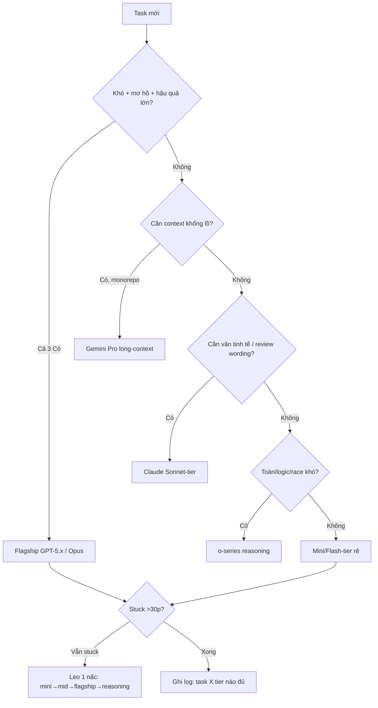

# 14 — Models: Chọn Model Đúng (GPT-5.x / Claude / Gemini Trên Copilot)

> **Bài 14 series 01.** · **Dành cho:** dev chọn model trong picker mỗi ngày + tech lead/admin muốn gate model và kiểm soát AI Credits cho team.
> **Vấn đề:** model mạnh nhất không phải lúc nào cũng là model đúng — chọn sai là đốt credits hoặc refactor 3 lần vẫn sai.
> **Đọc xong:** chọn đúng model cho từng task, hiểu cách tính AI Credits, cấu hình BYOK/policy gate model cho team, và không trả tiền model đắt cho việc model rẻ làm được.
> **Thời gian:** ~40 phút.

## Mục lục

1. [Vì sao chọn model? (why)](#1-vì-sao-chọn-model-why)
2. [Bản đồ models trên Copilot 2026](#2-bản-đồ-models-trên-copilot-2026)
3. [Model picker: đổi ở đâu, ảnh hưởng gì](#3-model-picker-đổi-ở-đâu-ảnh-hưởng-gì)
4. [Premium requests multiplier (tiền thật)](#4-premium-requests-multiplier-tiền-thật)
5. [BYOK + enterprise policy: gate model cho team](#5-byok--enterprise-policy-gate-model-cho-team)
6. [Khi nào dùng model nào (bảng dán tường)](#6-khi-nào-dùng-model-nào-bảng-dán-tường)
7. [Route theo phase + agent routing](#7-route-theo-phase--agent-routing)
8. [Walkthrough end-to-end (20 phút)](#8-walkthrough-end-to-end-20-phút)
9. [Pitfalls + fix](#9-pitfalls--fix)
10. [Bài tập](#10-bài-tập)
11. [Link chéo](#11-link-chéo)

---

## 0. Giải ngố thuật ngữ (1 câu + analogie + verify)

Section này trả lời: 5 khái niệm lõi (cộng 4 khái niệm bổ sung: AI Credits, auto model selection, auto tier, deprecation) nghĩa là gì, và tự kiểm chứng từng cái ở đâu?

Mỗi dòng đủ 3 lớp: **hiểu nôm na**, **ví dụ đời thường**, **ví dụ kỹ thuật thật** — kèm cột **verify** để bạn tự kiểm tra.

| Thuật ngữ | Hiểu nôm na (1 câu) | Analogie | Ví dụ kỹ thuật thật | Verify |
|---|---|---|---|---|
| **Model picker** | Nút chọn "bộ não" cho từng chat — model rẻ/đắt khác nhau. | Như chọn xe: xe đạp (mini) đi chợ, xe tải (flagship) chở nhà. | Chat view → dropdown góc dưới → `GPT-5.x / Claude Sonnet / Gemini Pro / mini`. | Đổi model → chat mới hiện tên model mới trên header. |
| **Premium request multiplier** | Cách nghĩ cũ về tiền: model đắt tốn gấp nhiều lần model rẻ. Từ 01/06/2026 chuyển sang AI Credits (mục 4). | Như giá điện giờ cao điểm ×3 — bật điều hòa flagship là hóa đơn bốc. | Mini ×0–0.5, Mid ×1, Flagship ×2–3, Reasoning ×3–5 (khung, tra billing exact). | Billing → Copilot usage: xem % đã dùng + tốc độ hết tháng. |
| **Flagship (GPT-5.x / Opus-tier)** | Bộ não mạnh nhất, hợp việc khó, mơ hồ. | Như giáo sư: hỏi khó mới cần, hỏi đường thì phí. | Thiết kế migrate auth 5 files, debug stuck 1h. | Task khó: flagship 1 lần đúng; mini thử 3 lần vẫn sai. |
| **Reasoning (o-series)** | Bộ não nghĩ lâu, hợp toán/logic/race khó. | Như ngồi thiền 30 phút giải toán khó — đừng nhờ đi mua rau. | Tối ưu query, race condition, thuật toán. | Chờ lâu rõ (latency cao) nhưng chain-of-thought dài. |
| **BYOK / Model gating** | Công ty tự mang chìa khóa + khóa tủ: ai được dùng model nào. | Như bố giữ két: con nhỏ chỉ lấy ngăn mini, anh lớn mới mở ngăn flagship. | Interns chỉ mini+mid, seniors mới flagship (Org Settings → Policies). | Mở picker → model bị cấm phải không hiện. |
| **AI Credits** | Đơn vị tính tiền của Copilot từ 01/06/2026 — 1 credit = $0.01. | Như thẻ nạp xăng: xài theo lít, không theo số lần bơm. | Chi phí 1 lượt = giá per-token của model × số token, quy đổi ra credits. | `github.com/settings/copilot`: xem credits đã dùng và tốc độ cháy. |
| **Auto model selection** | Để Copilot tự chọn model cho mỗi lượt, thay vì bạn bấm picker. | Như taxi tự chọn tuyến: né đường kẹt, bạn không phải lái. | 2 hệ thống: health thời gian thực + đánh giá độ phức tạp task → route model. | Để model ở "Auto" → terminal/chat in ra model đã dùng. |
| **Auto tier** | 3 hướng route trong auto selection: Efficiency (rẻ), Balance (cân), Intelligence (đẹp). | Như chọn chế độ quạt: Eco / Auto / Turbo — cùng cái quạt, khác mục tiêu. | `efficiency` / `balance` / `intelligence` (ra mắt 14/09/2026). | Đổi tier → bill vẫn tính theo model auto chọn, không đổi giá (mục 3.1). |
| **Deprecation** | Model bị gỡ khỏi Copilot — picker không còn, phải đổi sang bản thay thế. | Như siêu thị ngưng bán nước mắm cũ → nhãn mới thay vào chỗ đó. | 02/10/2026: Gemini 3.5/3.6 Flash, Kimi K2.7 Code, Claude Opus 4.7 bị deprecated. | Mở picker tìm model cũ → không thấy, thấy bản thay thế (mục 2.6). |

> **Ghi chú plan + credits (tra lại trước khi trả tiền):** 1 AI credit = $0.01.
> Gói kèm: Pro $10 → 1.500 · Pro+ $39 → 7.000 · Max $100 → 20.000 ·
> Business $19/seat → 1.900/seat · Enterprise $39/seat → 3.900/seat.
> Paid usage policy (chi vượt credit kèm theo): **mặc định BẬT** — muốn cap thì tắt.

---

## 1. Vì sao chọn model? (why)

Section này trả lời: chọn model ảnh hưởng tới tiền và chất lượng thế nào, và quy tắc vàng nào quyết model nào?

Model mạnh nhất không phải lúc nào cũng là model đúng. Mỗi task có 3 chiều cần cân: **chất lượng suy luận — tốc độ — chi phí (AI Credits)**. Dùng sai chiều là mất credits hoặc mất thời gian:

- Dùng model reasoning đắt sửa typo → tốn gấp 5–10 lần mà kết quả y hệt model rẻ.
- Dùng model mini thiết kế kiến trúc → thiếu depth, refactor 3 lần vẫn sai, tổng credits cao hơn chạy 1 lần model mạnh đúng ngay.
- Không hiểu cách tính tiền → shock khi credits tháng hết sau 1 tuần agent mode (mục 4).

Nguyên tắc vàng:

```text
Task khó, mơ hồ, hậu quả lớn → model mạnh (GPT-5.x / Claude Sonnet-Opus / Gemini Pro).
Task rõ ràng, lặp lại, khối lượng lớn → model rẻ + nhanh (mini/flash/haiku-tier).
Không bao giờ default model đắt nhất — chỉ gọi đích danh khi cần reasoning sâu.
```

### 1.1. Sơ đồ route model 30 giây (mermaid)



Giải thích từng bước:

1. **A → B:** Checklist 3✓ mục 2.2 (nhiều steps + đã thử rẻ mà fail + sai là đau) — đủ 3 mới flagship.
2. **B → C:** Flagship cho thiết kế/refactor multi-file, migration prod, debug stuck.
3. **D → E:** Monorepo hỏi rộng ("tóm tắt cả package") → Gemini long-context thay vì nhét 20 files vào flagship.
4. **F → G:** Docs, PR description, review wording bị GPT chê "quá máy" → đổi Claude.
5. **H → I:** Thuật toán/query/race cần thinking dài → o-series, chấp nhận chờ lâu.
6. **Mặc định J:** Autocomplete, rename, CRUD, test, explore 5 hướng song song → mini rẻ nhất.
7. **K → L:** Stuck thì leo thang từng nấc, không nhảy cóc mini→reasoning (đốt credits).
8. **M:** Ghi 1 dòng team wiki để lần sau route đúng ngay.

> ✅ **Kỳ vọng thấy gì:** đổi model ở picker → header chat hiện tên mới. Billing usage sau 1 tuần cho thấy flagship <30% requests (nếu >50% là routing hỏng).

- Quản lý: model picker đổi mỗi chat; org policy gate models cho team (mục 5);
  cost thực tế: usage dashboard (bài 13) sau mỗi tuần.

---

## 2. Bản đồ models trên Copilot 2026

Section này trả lời: tháng 10/2026 Copilot có những model nào, model nào vừa bị gỡ, và phân loại theo vai trò để route nhanh thế nào?

> Danh sách model đổi theo quý — tra model picker thực tế, đừng học thuộc lòng.
> Bảng dưới là khung phân loại để bạn route đúng, không phải catalog bất biến.

### 2.1. Bảng tổng (vai trò, không phải giá tuyệt đối)

| Nhóm | Hiểu nôm na | Ví dụ trên picker | Ví dụ task nên dùng | Vai trò |
|---|---|---|---|---|
| **GPT-5.x (flagship)** | Giáo sư toàn diện — khó gì cũng nghĩ được. | GPT-5.5, GPT-6.1 Sol, GPT-6 Astra | Plan migrate auth 5 files; debug stuck 1h. | Suy luận sâu, agent multi-step, refactor lớn |
| **o-series (reasoning)** | Nhà toán học trầm ngâm — chậm mà sâu. | Lớp reasoning (tên picker 10/2026 cần verify — xem mục 2.6) | Tối ưu query N+1, race condition retry. | Toán/logic khó, debug stuck, cần chain-of-thought dài |
| **Claude trên Copilot** | Nhà văn tinh tế — viết hay, review khéo. | Claude Sonnet 5.5, Claude Opus 5.5 | Viết docs, PR description, review wording giữ style. | Viết + giải thích code dài, docs, review tinh tế |
| **Gemini trên Copilot** | Thủ thư nhớ cả thư viện — context khổng lồ. | Gemini 3.1 Pro, Gemini 3.8 Flash | Tóm tắt cả `apps/api`, hỏi xuyên monorepo. | Context rất dài, retrieve monorepo, task đa ngữ |
| **Mini/Flash-tier (rẻ)** | Xe ôm nhanh rẻ — việc nhỏ gọi ngay. | GPT-5.4 mini, Claude Haiku 4.5, Gemini 3.8 Flash | Autocomplete, rename, CRUD, 5 chats explore song song. | Việc hàng ngày: complete, test, CRUD, explore |

### 2.2. GPT-5.x — flagship mặc định khi cần depth

```text
GPT-5.x: mạnh toàn diện, hợp agent mode multi-step (plan → edit → test → fix).
Dùng cho: thiết kế, refactor multi-file, debug khó, review quan trọng.
Giá quota: multiplier cao (mục 4) — đừng dùng sửa typo.
```

Khi nào gọi flagship (checklist):

```text
✓ Task kéo dài nhiều steps, cần coherence xuyên suốt?
✓ Đã thử model rẻ mà stuck / quality chưa đạt?
✓ Hậu quả sai cao (migration prod, security-critical)?
→ Cả 3 ✓ thì flagship. Thiếu 1 thì thử tier giữa trước đã.
```

### 2.3. o-series — reasoning, chậm mà sâu

```text
o-series: thinking dài, latency cao, hợp bài toán logic/toán/constraints khó
(thuật toán, query tối ưu, debug race condition). KHÔNG hợp: chat nhanh, sửa
lặt vặt (chờ lâu, tốn credits), task cần đọc context khổng lồ.
```

### 2.4. Claude / Gemini trên Copilot — khi nào đổi nhà

```text
Claude-tier: mạnh viết lách + giải thích (docs, PR description, review comments
tinh tế, refactor giữ style). Đổi sang khi GPT trả lời cộc/quá "máy".

Gemini-tier: context window rất dài → monorepo khổng lồ, "tóm tắt cả package",
task cross-file rộng. Đổi sang khi model khác kêu thiếu context.
```

### 2.5. Mini/Flash-tier — việc nhỏ + fan-out

```text
Mini/Flash: rẻ nhất, nhanh nhất. Việc nhỏ (autocomplete, rename, grep/explore,
tóm tắt, classify) + fan-out: 5 prompt explore song song rẻ hơn 1 flagship mà
cover rộng hơn. Lưu ý: context + reasoning yếu hơn — đừng giao kiến trúc.
```

### 2.6. Danh sách model 10/2026 + model ngừng hỗ trợ (02/10/2026)

Section này trả lời: tên model chính xác đang có trên picker, và 4 model nào vừa bị gỡ để bạn đừng dùng nữa?

```text
# Danh sach model tren Copilot — thang 10/2026 (tra picker thuc te, doi theo quy)
# OpenAI: GPT-5 mini, GPT-5.3-Codex, GPT-5.4, GPT-5.4 mini, GPT-5.4 nano
#   (Codex chi co tren VS Code ext, Pro+ only), GPT-5.5, GPT-5.6 Luna / Sol / Terra,
#   GPT-6 Astra, GPT-6 Luna, GPT-6 Sol, GPT-6.1 Sol.
# Anthropic: Claude Fable 5, Claude Fable 5.1, Claude Haiku 4.5,
#   Claude Opus 4.5 / 4.6 / 4.7 / 4.8 (+ fast mode preview) / 5 / 5.5,
#   Claude Sonnet 4.5 / 4.6 / 5 / 5.5.
# Google: Gemini 3.1 Pro (public preview), Gemini 3.5 / 3.6 / 3.7 / 3.8 Flash.
# Microsoft: MAI-Code-1-Flash, MAI-Code-1.1-Flash, Raptor mini (fine-tuned GPT-5 mini).
# Other: Kimi K2.7 Code, Kimi K3, Grok 4.5, Grok 4.6 (Grok 4.7 thay trong bang gia — can verify).
# Luu y: roster 10/2026 khong co dong "o-series" rieng — lop reasoning trong bai
#   am chi nhom model manh nhat (GPT-5.5 / GPT-6.x / Claude Opus 5.x). (can verify)
```

4 model bị deprecated ngày **02/10/2026** — áp mọi trải nghiệm Copilot:

| Model | Deprecated | Thay bằng |
|---|---|---|
| Gemini 3.5 Flash | 2026-10-02 | Gemini 3.8 Flash |
| Gemini 3.6 Flash | 2026-10-02 | Gemini 3.8 Flash |
| Kimi K2.7 Code | 2026-10-02 | Kimi K3 |
| Claude Opus 4.7 | 2026-10-02 | Claude Opus 5.5 |

Sự thật model đáng nhớ (dùng khi review bill + chọn model):

```text
# GPT-6 Astra: GA 04/09/2026 — coding tu chu dai hoi, tu validate dau ra.
# GPT-6.1 Sol: GA 29/09/2026 — thien ve agentic/terminal, it token + it buoc hon
#   moi task (theo GitHub).
# Gia per-token (standard context, $/M tokens): input 0,20 USD (MAI-Code-1.1-Flash,
#   GPT-5.6 Luna) → 5,00 USD (GPT-5.5, Claude Opus 4.8, Claude Opus 5);
#   output 1,20 USD → 30,00 USD (GPT-5.5 cao nhat; Claude o muc 25 USD).
#   Chenh lech ~25x giua 2 dau bang.
# Vi du cache: Claude Opus 5 doc cache 0,50 USD/M, ghi cache 6,25 USD/M (12,5x).
# "Goldeneye": model thay trong log Reddit duoi Auto — chi la loi ke, KHONG co
#   trong docs GitHub (UNVERIFIED).
# Evaluation models: auto co the tra ve model thich nghiem cho user plan ca nhan,
#   hien theo ten bi danh; GitHub noi co the kem hon voi prompt lien quan
#   bao mat; tat duoc trong tab AI controls (chi ca nhan).
# Free/Student: chi co auto model selection, khong co model picker tay.
```

---

## 3. Model picker: đổi ở đâu, ảnh hưởng gì

Section này trả lời: đổi model ở 3 chỗ nào, để Auto thì chuyện gì xảy ra với 3 tier, và 3 quy tắc giữ nguyên khi đổi?

```bash
# doi model (3 cho):
# 1. Chat view → model picker (dropdown goc duoi) → chon moi chat moi.
# 2. Inline completions: model rieng (settings: github.copilot.completions model).
# 3. Agent coding (github.com assign issue): model chon luc tao job.
# Verify: sau khi doi, header chat moi phai hien ten model moi.
```

### 3.1. Auto model selection + 3 tier (efficiency / balance / intelligence)

Để "Auto" là bạn giao quyền chọn model cho Copilot. Hiểu 2 khối dưới để không bất ngờ khi bill về.

```text
# Auto model selection — 2 he thong chay song song:
# 1. Suc khoe/availability thoi gian thuc → tranh model dang gap su co.
# 2. Danh gia do phuc tap cua task → route toi model tot nhat.
# Route theo ranh gioi cache tu nhien (doi model gia duoi phien ton hon la loi).
# Khong phu thuoc ngon ngu lap trinh — route theo task, khong theo ngon ngu.
# GA o: Copilot Chat tren github.com, IDE duoc ho tro, Copilot CLI,
#   Copilot cloud agent, Copilot app.
# Ton trong plan + policy org (allowlist, data residency, FedRAMP, eval-model policy).
```

```text
# 3 tier (ra mat 14/09/2026) — chon huong route trong auto selection:
# - Efficiency:   uu tien chi phi.
# - Balance:      can chi phi + chat luong + do tre.
# - Intelligence: uu tien chat luong.
# CUNG mot model pool o ca 3 tier — tier doi huong route, KHONG doi danh sach
#   model, khong doi gia.
# Tien van tinh theo model auto chon, KHONG phu thoc tier.
# Plan tra phis van duoc giam 10% khi dung auto model selection.
# Surface ho tro tier: VS Code, Copilot CLI, GitHub Copilot app (dang rollout).
# GitHub chua document duong dan UI chon tier + chua co policy tier cap org
#   (can verify, 10/2026).
```

### 3.2. Quy tắc đổi model tay (giữ 3 điều)

```text
# Quy tac doi model (giu 3 dieu):
# 1. DOI theo PHASE, khong doi gia duoi 1 phase (do mat context/cache).
#    plan (manh) → implement (re) → stuck thi leo len (muc 7).
# 2. Moi chat moi = co hoi chon lai (dung de flagship di can tu chat cu sang typo moi).
# 3. Sau 1 tuan: dashboard model nao ngon % (bai 13) → adjust default team.
# Verify: chay 1 task plan → implement voi 2 tier khac nhau, so credits + quality.
```

```jsonc
// .vscode/settings.json — default goi y cho team (commit, copy-paste khung):
{
  // Model completions re cho inline (tiet kiem credits):
  // "github.copilot.chat.model": "gpt-mini-tier", // ten exact tra picker thuc te
  // "github.copilot.completions.model": "gpt-mini-tier"
}
```

> Tên model exact đổi theo quý — mở picker copy tên thật, đừng gõ từ trí nhớ
> rồi kêu "model not found".

---

## 4. Premium requests multiplier (tiền thật)

Section này trả lời: tiền tính ra sao kể từ 01/06/2026, vì sao "multiplier" giờ chỉ là cách nghĩ nhanh, và làm sao giữ credits sống hết tháng?

> Tên mục giữ theo mục lục. Cơ chế tính tiền hiện hành là **AI Credits**
> (usage-based billing từ 01/06/2026) — đọc mọi chữ "quota/multiplier" bên dưới
> theo nghĩa credits.

### 4.1. Vì sao credits cháy nhanh hơn bạn nghĩ

```text
Tu 01/06/2026 Copilot tinh tien theo AI Credits — "AI Credits multiplier"
la ten mechanism truoc do, cung cach nghi "model dat ton gap nhieu lan model re":
- 1 AI credit = $0.01. Chi phi 1 luot = gia per-token cua model × so token.
- Model flagship/reasoning gia per-token cao gap nhieu lan mini-tier → cung 1 cau
  hoi ton nhieu credits hon.
- Agentic = moi step 1 luot goi → agent 50 steps × flagship = credits boc hơi.
- Code completion + next edit suggestions KHONG tru credits (khong gioi han plan tra phis).
- Dung auto model selection duoc giam 10% (muc 3.1) → cung task re hon 10%.
- Khong hieu cach tinh → het credit tuan 1, 3 tuan con lai phai dung model re.
# Verifying: github.com/settings/copilot → ghi % credits da dung + ngay hien tai.
# Ky vong: tai toc do hien tai, xem ra cuoi thang con bao nhieu credits.
```

### 4.2. Bảng multiplier minh họa (khung — tra docs hiện hành)

| Tier | Hiểu nôm na | Ví dụ model | Multiplier minh họa | Ví dụ task nên dùng | Nghĩa thực tế |
|---|---|---|---|---|---|
| Mini/Flash-tier | Trà đá — uống tẹt không xót. | GPT-mini, Flash, Haiku | ×0 – ×0.5 | Sửa typo, rename, explore 5 hướng. | Hỏi tẹt ga, tốn ít |
| Mid-tier (Sonnet/Pro/GPT-4o-class) | Cơm văn phòng — ngày nào cũng ăn. | Sonnet, GPT-4o-class, Pro | ×1 | Implement theo plan, CRUD, test. | Chuẩn 1 request = 1 |
| Flagship (GPT-5.x / Opus-tier) | Nhà hàng — ngon mà đắt, tuần 1 lần. | GPT-5.x, Opus-tier | ×2 – ×3+ | Plan kiến trúc, refactor 5 files. | Mỗi câu đắt gấp 2–3 lần |
| Reasoning (o-series deep) | Tiệc cưới — chỉ khi đại sự. | o-series deep | ×3 – ×5+ | Race condition, thuật toán khó. | Suy luận dài, đắt nhất |

> Số trên là KHUNG minh họa để hiểu cơ chế — tra docs/billing page số exact quý
> hiện tại. Cơ chế (đắt theo tier + agentic nhân steps) thì không đổi.

> Từ 01/06/2026 bill thực tế tính bằng AI Credits: giá per-token × số token.
> Bảng trên chỉ là cách ước lượng tương đối giữa các tier. Tier auto
> (efficiency/balance/intelligence) KHÔNG đổi giá — xem mục 3.1.

### 4.3. Giữ credits sống hết tháng (thực hành)

```text
1. Default chat = tier gia/re. Flagship chi dich dan khi checklist muc 2.2 du 3 ✓.
2. Agent mode + flagship la combo dot credits nhanh nhat → agent thi tier gia truoc,
   stuck moi leo (muc 7).
3. Explore fan-out bang mini (5 prompt re) thay vi nhét 20 files vao flagship chat.
4. Cuoi tuan: dashboard AI credits by model (bai 13) → model nao > 50% thi gate.
```

```bash
# Kiem tra credits con bao nhieu (dung doan — xem that):
# VS Code → Copilot status bar / github.com → Settings → Billing → Copilot usage
# → ghi: da dung ?% AI credits, ngay ?/30. Toc do nay co song het thang khong?
# Verify: neun % da dung tren 60% ma van tu tuan thu 2 → dat model thap lai.
```

---

## 5. BYOK + enterprise policy: gate model cho team

Section này trả lời: admin gate model bằng những công tắc nào, verify ở đâu, và chặn chi phí vượt kế hoạch bằng gì? Dành cho admin/org owner; dev đọc để đối chiếu picker với policy.

- **BYOK (Bring Your Own Key) là gì?** Enterprise dùng Azure/OpenAI key riêng cho
  Copilot thay vì GitHub-hosted models — data residency + billing riêng + model
  allowlist công ty. Hỏi admin bạn có BYOK không trước khi assume data đi đâu.
- **Model gating (policy)**: admin cấm/bật models theo team (interns chỉ mini+mid,
  seniors mới flagship; team payments cấm model X...).

```text
# Checklist admin gate model (github.com → Org/Ent Settings → Copilot → Policies):
[ ] Model allowlist: team nao × models nao (dung all-access ngay dau)
[ ] Flagship: bat cho seniors/leads, tat cho interns/bot accounts
[ ] Reasoning tier: tat default, mo theo request (dat + cham, it nguoi can)
[ ] Review hang thang: dashboard by-model (bai 13) → siét/nới 1 model
[ ] BYOK (neu co): key rotation lich + endpoint region dung compliance
[ ] Paid usage policy (chi vuot credit kem theo): MAC DINH la BAT.
    Muon cap → tat di; user het limit gui yeu cau tang budget, ban duyet
    hoach tu choi trong settings (GA Business/Enterprise usage-based billing,
    tru enterprise managed users — 09/2026).
[ ] Managed settings: "model" (model mac dinh) + "autoTier" (tier route mac dinh,
    xem muc 3.1) — 2 khoa lien quan truc tiep toi bill.
```

```bash
# Verify policy co hieu luc (may dev, lam 1 lan):
# 1. Mo model picker → model bi cam phai KHONG hien (hien la policy hong).
# 2. Ho admin: "team toi duoc models nao?" → doi chieu picker (lech thi bao).
# Verify xong: picker chi con model team duoc phep.
```

```text
# Template de xuat model cho team moi (paste vao team wiki):
# Default: mid-tier · Agent: mid-tier · Flagship: khi checklist 3✓ (muc 2.2)
# Mini: autocomplete + explore · Reasoning: debug stuck > 1h moi mo
# Review quota moi thu hai (15 phut, bai 13 muc 7.3).

# BYOK theo surface (feature matrix 10/2026): Visual Studio ✓ day du;
#   VS Code / JetBrains / Eclipse / Xcode mot phan; NeoVim ✗.
# Hang rao permissions trong managed settings: deny > ask > allow
#   (deny luan thang; "ask" khong bi bypass/YOLO mode lam thoa).
```

---

## 6. Khi nào dùng model nào (bảng dán tường)

Section này trả lời: với 10 nhóm task thường gặp nhất thì model nào đủ, vì sao? Cột "Model" là tên VAI TRÒ — tên chính thức tháng 10/2026 xem mục 2.6.

| Task | Hiểu nôm na | Ví dụ cụ thể | Model | Vì sao |
|---|---|---|---|---|
| Thiết kế kiến trúc, plan multi-file | Vẽ bản đồ trước khi xây nhà. | Plan migrate `auth.ts` 900 dòng → 3 modules. | Flagship (GPT-5.x / Opus-tier) | Quyết định đắt nhất → model mạnh |
| Debug stuck > 30 phút | Kẹt 1 chỗ 30 phút không ra. | `normalizeEmail` crash email có dấu, thử 3 cách fail. | Flagship → reasoning nếu vẫn stuck | Cần depth, không cần tốc độ |
| Implement theo plan đã duyệt | Bản đồ có rồi, chỉ việc xây. | Implement step 1–3 của `plan.md` refund. | Mid-tier | Rõ ràng → vừa đủ + tiết kiệm |
| Viết test, docs, CRUD | Việc tay chân lặp lại. | Viết 10 test CRUD `payments`. | Mini/Mid-tier | Cơ học, khối lượng lớn |
| Explore codebase, grep, tóm tắt | Đi trinh sát 5 hướng cùng lúc. | 5 chats mini mỗi chat 1 module `auth/db/api`. | Mini/Flash-tier | Rộng + nhanh + rẻ |
| Format, rename, classify | Dọn nhà, đổi tên nhãn. | Rename `userId` → `user_id` 20 files. | Mini-tier | Flagship làm cũng vậy mà đắt nhiều lần |
| Context khổng lồ (monorepo) | Đọc cả thư viện 1 lần. | Tóm tắt cả `apps/api` 500 files. | Gemini-tier (long context) | Cửa sổ context rộng nhất |
| Giải thích tinh tế, review wording | Viết thư xin việc, cần văn hay. | PR description refund + review comments. | Claude-tier | Văn + style tốt hơn |
| Thuật toán/logic khó | Giải toán Olympic. | Tối ưu query N+1, retry backoff. | o-series reasoning | Thinking dài, đừng vội |
| Demo live cần nhanh | Diễn sân khấu, không được ấp úng. | Demo sprint review 5 phút. | Mid-tier nhanh | Reasoning chậm làm demo chết |

> ✅ **Kỳ vọng thấy gì:** sau 1 tuần chạy bảng này, billing cho thấy mini/mid chiếm >70% requests, flagship <30% — credits sống hết tháng.

### Hiểu nhầm thường gặp (bài 14)

| Hiểu nhầm | Sự thật |
|---|---|
| "Model mạnh nhất là tốt nhất cho mọi task" | Flagship sửa typo cũng ra chữ y hệt mini mà tốn ×3. Verify: cùng task typo chạy mini vs flagship, so output + thời gian. |
| "Tên model học thuộc 1 lần dùng mãi" | Tên đổi theo quý. Luôn copy exact từ picker, đừng gõ từ trí nhớ. |
| "Agent + flagship từ đầu cho chắc" | Combo đốt credits nhanh nhất (50 steps × ×3). Agent mid trước, stuck mới leo. |

---

## 7. Route theo phase + agent routing

Section này trả lời: chia 1 task lớn thành các phase thì model nào đi phase nào, và 3 kịch bản mẫu dán được vào team wiki?

### 7.1. Nguyên tắc route (3 câu)

```text
1. Plan dat, execute re: flagship plan + mid/mini implement la default task > 3 files.
2. Fan-out re, main dat: explore day mini, chat chinh giu mid/flagship.
3. Stuck thi leo thang: mini 2 lan → mid → flagship → reasoning. Ghi ly do de lan
   sau route dung ngay.
# Verify: chay 1 task 3+ files theo kịch bản A, so credits voi lan full-flagship.
```

### 7.2. Kịch bản route mẫu (copy-paste)

```text
# Kich ban A — feature multi-file (default team):
# Chat 1 (flagship): "plan migrate auth sang session, steps + risks, KHONG code"
# Chat 2 moi (mid-tier): "implement step 1–3 cua plan tren" (+ paste plan vao)
# Stuck > 30p → chat 3 (flagship/reasoning): "dang stuck o X, log Y, goi y?"

# Kich ban B — explore re:
# 5 chat mini song song, moi chat 1 huong (auth, db, api, tests, docs) →
# gom vao chat chinh (mid) quyet dinh. Dung nhét 20 files vao 1 flagship chat.

# Kich ban C — review quan trong:
# Claude-tier review wording + flagship review logic (2 pass, 2 diem manh khac nhau)
```

---

## 8. Walkthrough end-to-end (20 phút)

Section này trả lời: 20 phút nào xác nhận được bạn đã route model đúng và credits đang sống khỏe?

**Phút 0–5 (baseline credits):**

```bash
# Mo billing usage → ghi % AI credits da dung + ngay hien tai.
# Mo model picker → liêt kê models team ban co (chup man hinh cho team wiki).
# Verify: so credits da dung phu hop voi ngay trong thang (khong chay bat thuong).
```

**Phút 5–12 (cùng task, 3 tiers):**

```text
# Lay 1 task nho that. Chay 3 chats moi: mini → mid → flagship.
# Ghi quality + thoi gian + (uoc tinh) credits moi tier.
# Ket luan: tier nao la "du"? (ky vong: mini/mid du cho task ro)
```

**Phút 12–17 (route theo phase):**

```text
# Lay 1 task 3+ files: chat flagship plan (khong code) → chat moi mid implement.
# So voi lan truoc lam full-flagship: quality tuong duong? credits nhe hon?
```

**Phút 17–20 (gate check):**

```bash
# Picker con model nao team khong nen co? → note de xuat admin (muc 5).
# Ghi 1 dong team log: "task X: mini du / mid du / can flagship vi Y".
# Verify xong: co 1 dong ghi nhan + 1 de xuat (neu picker con model thua).
```

---

## 9. Pitfalls + fix

Section này trả lời: 9 lỗi hay gặp nhất khi chọn model, và fix từng cái bằng gì?

| Pitfall | Vì sao | Fix |
|---|---|---|
| Default flagship mọi chat | Credits nổ tuần 1, 3 tuần sau hẻo | Default mid/mini, flagship đích danh khi đủ 3✓ |
| Ở lì flagship cả task dài | Phần cơ học trả giá flagship | Chia phase: plan đắt + execute rẻ (mục 7) |
| Mini cho task kiến trúc | Thiếu depth, refactor 3 lần | Plan flagship trước, execute mới rẻ |
| Reasoning cho chat nhanh | Chờ lâu, tốn credits, cáu | Reasoning chỉ debug/logic khó, chat thường dùng mid |
| Gõ tên model từ trí nhớ | `model not found` (tên đổi theo quý) | Copy tên exact từ picker hiện tại |
| Agent + flagship từ đầu | Combo đốt credits nhanh nhất | Agent mid trước, stuck mới leo flagship |
| Nhìn tên model mà quên giá per-token | Shock bill (agentic × steps × giá per-token) | Xem usage dashboard hàng tuần (bài 13) |
| Policy gate nhưng không verify | Model cấm vẫn hiện, team dùng lậu | Check picker + hỏi admin đối chiếu (mục 5) |
| Không review credits hàng tuần | Ngốn cả tháng mới biết | Block 15 phút thứ 2 (bài 13 mục 7.3) |

---

## 10. Bài tập

Section này trả lời: làm 4 bài nào để tự mình thấy tier nào đủ cho task nào, và gate model đã thật sự hiệu lực?

**Bài 1 (15 phút — 3 tiers, 1 task):**

1. Cùng 1 task nhỏ, chạy 3 chats (mini → mid → flagship). Ghi quality + thời gian.
2. Tier nào là "đủ"? Viết 1 câu lý do vào team wiki.

**Bài 2 (15 phút — plan đắt/execute rẻ):**

1. Task 3+ files: chat flagship plan (không code) → chat mới mid implement.
2. So quality + cảm nhận credits với lần làm full-flagship trước đây.

**Bài 3 (15 phút — reasoning + long-context):**

1. Lấy 1 bug logic khó: thử mid 15 phút → stuck thì reasoning, ghi khác biệt.
2. Lấy 1 task monorepo rộng: thử Gemini-tier retrieve, so với mid (đủ context không?).

**Bài 4 (10 phút — credits audit):**

1. Mở billing usage: % đã dùng, tốc độ này sống hết tháng không?
2. Liệt kê models picker vs policy team (mục 5) — lệch chỗ nào thì báo admin.

> Đạt: nói được "task này tier nào đủ + vì sao" cho 5 task mẫu, credits sống hết
> tháng, team có default model bằng văn bản.

---

## 11. Link chéo

Section này trả lời: bài nào đọc tiếp khi cần đi sâu từng chủ đề dưới đây?

- **Bài 04 — Chat commands toàn tập**: model picker đổi ở đâu, công thức 5 lệnh đầu.
- **Bài 06 — Custom agents & Agent mode**: agent nào × model nào, fan-out mini rẻ.
- **Bài 07 — Policies/guardrails**: gate models + content exclusion cho org.
- **Bài 10 — Modes/Permissions**: Ask/Edit/Agent + approval trước khi agent đốt credits.
- **Bài 12 — Copilot SDK/CI**: pin model trong pipeline để CI không đổi behavior.
- **Bài 13 — Indexing & Telemetry**: dashboard by-model/by-user, vòng lặp 15 phút/tuần.
- **Bài 15 — Security 5 tầng**: model policy là tầng 5, exclusion là tầng 1.
- **Bài 16 — Extensions/MCP validate**: tools ngoài có tuân thủ model policy không?
