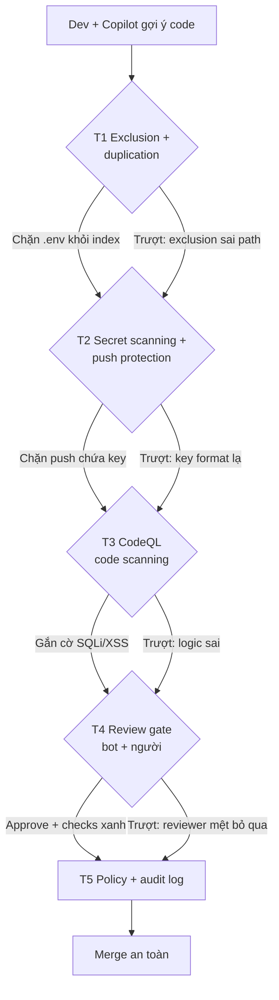

# 15 — Security Stack 5 Tầng Cho Copilot (Defense-in-Depth, Không Tin 1 Lớp Nào)

> **Dành cho:** dev đã dùng Copilot (tự verify từng tầng) + admin/org owner (rà policy).
> **Vấn đề:** 1 lớp bảo mật luôn có lỗ — exclusion sai 1 path là secret lọt vào index, alert bị dismiss không ai biết.
> **Đọc xong:** dựng + verify được 5 tầng phòng thủ (content exclusion → secret scanning → CodeQL → review gate → policy/audit), chỉ ra được tầng nào team đang yếu và vá thế nào.
> **Thời gian:** ~45 phút (walkthrough 20 phút ở cuối bài).

## Mục lục

1. [Vì sao 5 tầng? (why)](#1-vì-sao-5-tầng-why)
2. [Bản đồ 5 tầng (nhìn 1 phút hiểu hết)](#2-bản-đồ-5-tầng-nhìn-1-phút-hiểu-hết)
3. [Tầng 1 — Exclusion + duplication detection (copy-paste)](#3-tầng-1--exclusion--duplication-detection-copy-paste)
4. [Tầng 2 — Secret scanning + push protection](#4-tầng-2--secret-scanning--push-protection)
5. [Tầng 3 — Code scanning + CodeQL](#5-tầng-3--code-scanning--codeql)
6. [Tầng 4 — Copilot code review gate](#6-tầng-4--copilot-code-review-gate)
7. [Tầng 5 — Policy + audit (khóa cửa)](#7-tầng-5--policy--audit-khóa-cửa)
8. [Walkthrough end-to-end (20 phút)](#8-walkthrough-end-to-end-20-phút)
9. [Pitfalls + fix](#9-pitfalls--fix)
10. [Bài tập](#10-bài-tập)
11. [Link chéo](#11-link-chéo)

---

## 0. Giải ngố thuật ngữ (1 câu + analogie + verify)

*Section này trả lời: 5 thuật ngữ của 5 tầng + 3 khái niệm chính sách mới (managed settings, AI Credits, OTEL) nghĩa là gì. Gặp ở đâu trong bài cũng tra được. Tra cứu nhanh, không cần đọc từ đầu.*

| Thuật ngữ | Hiểu nôm na (1 câu) | Analogie | Ví dụ kỹ thuật thật | Verify |
|---|---|---|---|---|
| **Content exclusion** | Danh sách "cấm nhìn": Copilot không được đọc/index files này. | Như phòng khóa trong nhà — giúp việc (Copilot) không được vào. | `**/.env*`, `**/*.pem`, `secrets/**` trong Org Settings → Copilot. | Hỏi `@workspace tìm STRIPE_KEY?` → phải "không thấy/excluded". |
| **Duplication detection** | Chặn Copilot copy y nguyên code người ta có bản quyền. | Như chống đạo văn: gợi ý trùng là báo nguồn, team kín thì chặn luôn. | Chế độ `Block` cho closed-source, `Allow + cảnh báo` cho open-source. | Copilot gợi ý trùng → hiện `matching public code` + link gốc. |
| **Secret scanning + push protection** | Camera quét + bảo vệ cửa: phát hiện key lọt, chặn ngay lúc push. | Như máy soi chiếu sân bay: có dao (key) là tuýt còi tại chỗ. | Push chứa `sk-live-...` → bị chặn + hướng dẫn chuyển sang env. | Thử push fake key → phải bị chặn (mục 8 walkthrough). |
| **CodeQL / Code scanning** | Bác sĩ soi X-quang: tìm SQLi/XSS/path traversal trong PR. | Như kiểm định xe: chưa đạt là chưa cho lăn bánh (merge). | Alert `SQL query built from user input` tại `refund.ts:42`. | PR hiện check `CodeQL` đỏ/xanh; Security tab liệt kê alerts. |
| **Defense-in-depth** | Không tin 1 lớp nào — 5 lớp chồng nhau, trượt lớp này còn lớp sau đỡ. | Như nhà 5 khóa: cổng + cửa + két + camera + bảo vệ — trộm qua 1 lớp vẫn kẹt. | T1 trượt (exclusion sai) → T2 chặn push → T3 gắn flag → T4 reviewer thấy → T5 truy audit. | Mỗi incident trả lời được "tầng nào trượt + tầng nào đỡ". |
| **Managed settings (`managed-settings.json`)** | File JSON một nơi, admin siết luật cho mọi client Copilot. | Như nội quy ban quản lý dán ở sảnh — cư dân không tự sửa được. | `permissions.deny/ask/allow`, `allowedMcpServers`, `sandbox`, `telemetry`. | So key với mục 7.3; key sai kiểu dữ liệu thì validator báo lỗi. |
| **AI Credits** | Đơn vị tính tiền Copilot: 1 credit = $0.01, áp dụng từ 01/06/2026. | Như thẻ nạp phòng gym — mỗi lượt dùng trừ tiền, hết thì mua thêm. | Review Balanced tốn ~$0.25–$5 credit/lần (chưa kể Actions minutes). | github.com/settings/copilot → Usage xem credit theo ngày. |
| **OTEL (OpenTelemetry)** | Chuẩn mở để Copilot bắn telemetry về endpoint của công ty bạn. | Như camera nhà tự gửi hình về đầu ghi của nhà bạn, không của người khác. | Key `telemetry.endpoint` (OTLP) + `captureContent: false` trong managed settings. | Sau 1 phiên chạy, log phải về đúng endpoint bạn khai. |

---

## 1. Vì sao 5 tầng? (why)

*Section này trả lời: vì sao bật mỗi secret scanning là chưa đủ, và quy tắc nào quyết định cách team bạn ứng xử với mỗi sự cố.*

1 lớp bảo mật luôn có lỗ: exclusion cấu hình sai 1 path là secret lọt vào index;
secret scanning bỏ sót format lạ; CodeQL không bắt logic sai; review người thì
mệt bỏ qua; policy không audit thì trang trí. Defense-in-depth = lớp này trượt thì
lớp sau đỡ:

```text
Không stack:  Copilot đọc .env → gợi ý key vào code → push lên GitHub → lộ 6 tháng mới biết
Có stack:    T1 chặn .env khỏi index → trượt? T2 push protection chặn push →
             trượt? T3 CodeQL gắn flag → trượt? T4 reviewer thấy → trượt? T5 audit truy ra
```

> Quy tắc: **không tin bất kỳ 1 tầng nào. Mỗi incident phải trả lời "tầng nào
> trượt + tầng nào đỡ + vá tầng trượt thế nào".**

---

## 2. Bản đồ 5 tầng (nhìn 1 phút hiểu hết)

*Section này trả lời: 5 tầng là gì, mỗi tầng chặn thứ gì, nằm ở đâu trong GitHub, ai sở hữu. Đọc bảng dưới là đủ hình dung trước khi đi chi tiết.*

| Tầng | Hiểu nôm na | Ví dụ | Chặn gì | Ở đâu | Ai sở hữu |
|---|---|---|---|---|---|
| **1. Exclusion + duplication** | Khóa phòng + chống đạo văn. | `.env` không vào index; gợi ý trùng GPL bị block. | Copilot đọc file nhạy cảm; gợi ý copy code có license | Copilot settings (org/repo — Business/Enterprise) | Admin + team lead |
| **2. Secret scanning + push protection** | Máy soi + bảo vệ cửa. | Push `sk-live-FAKE` bị chặn tại chỗ. | Key/token lọt vào repo | GitHub Advanced Security | Admin (bật), dev (fix alert) |
| **3. Code scanning (CodeQL)** | Bác sĩ X-quang. | `query("SELECT ..."+input)` bị gắn cờ SQLi. | Lỗ hổng (SQLi, XSS, path traversal...) | PR checks + `github/codeql` | Team (fix), CI (chặn) |
| **4. Copilot code review gate** | 2 cặp mắt (máy + người). | Bot review + reviewer fresh verdict PASS. | Bug/logic mà máy + mắt người sót | PR review + required checks | Reviewer + maintainer |
| **5. Policy + audit** | Sổ trực + camera. | `action:copilot_policy` thấy ai tắt exclusion. | Ai đổi 4 tầng trên, ai dùng gì | Org/enterprise policy + audit log (giữ 180 ngày) | Admin |

```text
# Dòng chảy 1 PR an toàn (5 tầng đi qua):
# T1: Copilot không đọc secrets khi gợi ý → T2: push không mang key →
# T3: CodeQL quét xong xanh → T4: review (người + Copilot) approve →
# T5: mọi bước ghi audit log. Thiếu 1 tầng là mù 1 mắt.
```

Tầng 5 là tầng khóa chốt: 4 tầng trên chỉ sống được chừng nào policy còn đúng.
Nơi admin chốt luật là `managed-settings.json` (mục 7.3) và audit log (mục 7.2).

### 2.1. Sơ đồ defense-in-depth 5 lớp (mermaid — BẮT BUỘC)



Giải thích từng bước (kèm ví dụ tấn công mỗi lớp chặn được):

1. **A → T1:** Dev gõ code, Copilot gợi ý. T1 đảm bảo nó không "nhìn trộm" `.env` để gợi ý.
   - *Ví dụ tấn công bị chặn:* Copilot đọc `STRIPE_KEY=sk-live-...` trong `.env` rồi gợi ý `const key="sk-live-..."` vào code → T1 chặn vì `.env` excluded khỏi index.
   - *Ví dụ duplication:* Copilot gợi ý hàm trùng repo GPL → chế độ `Block` chặn, hiện `matching public code` + link gốc.
2. **T1 → T2:** Dù T1 trượt (admin exclude sai `src/` thay vì `secrets/`), push chứa key vẫn bị tuýt còi tại cửa.
   - *Ví dụ tấn công bị chặn:* Dev vô tình `git push` file chứa `AKIA...` (AWS key) → push protection chặn ngay, báo file:dòng.
   - *Verify:* thử push fake key ở mục 8 → phải thấy `BLOCKED`.
3. **T2 → T3:** Key format lạ lọt qua T2 (ví dụ token nội bộ không có pattern) thì CodeQL vẫn soi lỗ hổng code.
   - *Ví dụ tấn công bị chặn:* `db.query("SELECT * FROM users WHERE id=" + req.params.id)` → CodeQL báo `SQL query built from user input` (SQLi), check đỏ.
   - *Ví dụ khác:* `res.send("<div>"+comment+"</div>")` → báo XSS; `fs.readFile("./"+name)` → báo path traversal.
4. **T3 → T4:** CodeQL không bắt logic sai (refund sai 30 ngày) thì review 2 lớp (bot + người fresh) bắt.
   - *Ví dụ tấn công bị chặn:* PR "đúng" hết checks nhưng thiếu `auth check` ở route `/admin` (IDOR) → reviewer hỏi "auth ở đâu?" và Copilot review gắn `HIGH: missing auth`.
   - *Verify:* `git diff --stat main...HEAD` chạm `payments/auth` → review kỹ gấp đôi.
5. **T4 → T5 → M:** Mọi bước ghi audit. Reviewer mệt approve bừa, dismiss CodeQL không lý do → audit lôi ra.
   - *Ví dụ tấn công bị chặn/truy:* Nửa đêm ai đó tắt push protection → `action:secret_scanning` + `actor` hiện tên + giờ trong audit log.
   - *Vòng lặp quý:* rà dismiss không lý do + exclusion drift (repo mới chưa cover) + vá tầng yếu nhất.

> ✅ **Kỳ vọng thấy gì:** sau khi bật đủ 5 tầng, PR mẫu hiện 3 checks xanh (`Secret scanning`, `CodeQL`, `Copilot review`) + audit log filter ra được actor đổi policy gần nhất.

---

## 3. Tầng 1 — Exclusion + duplication detection (copy-paste)

*Section này trả lời: file nào Copilot không được đọc, và làm sao biết chắc nó không đọc. Dev tự verify được, admin dùng checklist.*

### 3.1. Content exclusion: Copilot không được thấy gì

**Dành cho admin.** Lưu ý plan trước khi làm: **content exclusion là tính năng của Copilot Business/Enterprise**. Cấu hình ở repo, org hoặc enterprise; cấp cha truyền xuống cấp con (repo kế thừa từ org). Role `Maintain` chỉ xem được, không sửa được; cần automate thì dùng REST API.

```text
# Checklist admin (github.com → Org Settings → Copilot → Content exclusion):
[ ] **/.env* (mọi biến thể: .env.local, .env.prod...)
[ ] **/secrets/**, **/*.pem, **/*.key, **/*credentials*
[ ] **/migrations/*seed* (data thật), dumps/*.sql
[ ] vendor/, dist/, *.min.js (nhiễu, không phải secret nhưng loại cho sạch index)
[ ] Repo payments/auth: exclude cả thư mục chứa HSM/cert configs
```

```bash
# Verify exclusion sống (dev làm 1 lần, 2 phút):
# Chat: "@workspace tìm chuỗi STRIPE_KEY trong repo?"
# → kỳ vọng: "không thấy / excluded". Thấy được key thật → báo admin NGAY.
git check-ignore -v .env .env.prod secrets/ 2>/dev/null
# → phải ignored (exclusion + gitignore song kiếm, thiếu 1 là hở 1 đường)
```

```bash
# .gitignore tối thiểu song hành exclusion (repo, commit — copy-paste khung):
# .env*
# secrets/
# *.pem
# *.key
# dumps/
git status --porcelain | grep -E "env|pem|key|secrets" || echo "sach: khong file nhay cam staged"
# → có hit là dừng lại, unstage trước khi commit
```

### 3.2. Duplication detection: không copy code người ta vào repo bạn

```text
# Bật: Org Settings → Copilot → Policies → Suggestions matching public code:
#   - Block (khuyến nghị team closed-source): chặn gợi ý trùng public code
#   - Allow: cho phép nhưng gắn cảnh báo (team open-source ok)
# Hỏi admin team bạn đang để Block hay Allow — đừng đoán.
```

**Theo mặc định 2026:** với **Copilot Business, chế độ này là `Blocked`** (chặn gợi ý
khớp public code). Muốn mở thì đổi ở phần **Privacy** của Org Settings — và phải
được legal đồng ý bằng văn bản. Cá nhân Free/Pro thì chọn được Block hay Allow.

```bash
# Khi Copilot báo "matching public code" (đừng click accept mù):
# 1. Đọc reference URL nó đưa (code gốc license gì? GPL → cân nhắc kỹ).
# 2. Viết lại theo style repo bạn (đừng paste y nguyên).
# 3. Thêm comment nguồn nếu giữ ý tưởng: "# adapted from <url> (MIT)".
```

---

## 4. Tầng 2 — Secret scanning + push protection

*Section này trả lời: bật 2 công tắc nào cho admin, và khi bị chặn thì dev xử lý ra sao — không bypass.*

### 4.1. Bật 2 công tắc (admin, 5 phút)

```text
# github.com → Org/Repo Settings → Code security → bật cả 2:
[ ] Secret scanning: quét repo (quá khứ + tương lai), alerts về Security tab
[ ] Push protection: chặn NGAY lúc push nếu phát hiện secret (đỡ hơn fix sau)
# Thứ tự ưu tiên: push protection trước (chặn mới), secret scanning sau (quét cũ).
```

### 4.2. Dev workflow khi bị chặn/fix alert (copy-paste)

```bash
# Ca A — push bị chặn (push protection): ĐỪNG bypass, fix đúng:
# 1. Đọc thông báo: loại secret gì, file nào, dòng nào
git diff --cached -- <file-bi-chan>
# 2. Xoá secret khỏi code → chuyển sang env/secrets manager:
#    code đọc process.env.STRIPE_KEY (không hardcode "sk-live-...")
# 3. Commit lại + push lại (protection pass là xong)

# Ca B — secret đã lọt (alert trong Security tab):
# 1. REVOKE key đó NGAY (Stripe/GitHub/AWS dashboard) — trước khi xoá code
# 2. Xoá khỏi history nếu cần (BFG/trợ giúp admin), rồi push fix
# 3. Đánh dấu alert resolved + ghi lý do (audit cần, mục 7)
```

```bash
# Phòng bệnh local: quét trước khi push (pre-commit hook khung):
# .git/hooks/pre-commit (chmod +x):
#!/bin/sh
git diff --cached --name-only | xargs grep -n -i -E "sk-live|ghp_|AKIA|xoxb-|-----BEGIN .*PRIVATE KEY" && {
  echo "BLOCKED: nghi secret staged — doi sang env truoc khi commit"; exit 1; }
echo "pre-commit secrets: sach"
```

---

## 5. Tầng 3 — Code scanning + CodeQL

*Section này trả lời: bật CodeQL kiểu nào cho hiệu quả/giờ cao nhất, và xử lý alert ra sao cho đúng — fix gốc chứ không suppress cho qua.*

### 5.1. Bật CodeQL default setup (5 phút, hiệu quả/giờ cao nhất)

```text
# github.com → Repo Settings → Code security → Code scanning → Set up →
#   Default setup → chọn query suite Extended (team payments/auth) hoặc
#   Default (team khác) → Create. PR sau tự có check "CodeQL".
```

```yaml
# Nâng cao: variant custom khi default chưa đủ (team payments — khung):
# .github/workflows/codeql.yml (codeql-action init + analyze cho js/ts + python):
# jobs.analyze.strategy.matrix.language: ['javascript-typescript', 'python']
# on: [pull_request, push (main), schedule: weekly] — weekly bắt debt cũ
```

### 5.2. Đọc + fix alert đúng cách (dev, copy-paste prompt)

```text
# Prompt fix CodeQL alert (paste alert message vào chat):
"CodeQL báo <dán alert: vd 'SQL query built from user input'> tại file X dòng Y.
Giải thích lỗ hổng 3 dòng, sửa bằng parameterized query, giữ behavior cũ,
không đổi signature hàm public."

# Quy tắc fix:
# - Fix ROOT (validate/escape/parameterize), không suppress alert cho qua.
# - Suppress (dismiss) chỉ khi: false positive CHỨNG MINH được + ghi lý do + reviewer đồng ý.
# - Alert severity high/critical: fix trước khi merge, không "để sprint sau".
```

```bash
# Verify fix local trước khi đẩy PR (đừng chờ CI 10 phút mới biết):
npm run lint && npm run typecheck 2>/dev/null || npx tsc --noEmit
# → xanh local rồi mới push (CodeQL CI là lưới cuối, không phải lưới đầu)
```

---

## 6. Tầng 4 — Copilot code review gate

*Section này trả lời: gắn 2 lớp review (máy + người) vào PR kiểu nào, và review tốn bao nhiêu AI Credits để admin budget được.*

### 6.1. Gắn review vào PR (2 lớp: máy + người)

```text
# Lớp máy — Copilot code review (github.com PR → Copilot review):
# - Bật: Repo Settings → Copilot code review → auto review mỗi PR (team mới nên bật)
# - Đọc review như junior nhiệt tình: đúng 70%, bịa 30% → verify từng comment.

# Lớp người — required reviewers + checks (Repo Settings → Branch protection):
[ ] Require pull request review (≥1 approve, team payments ≥2)
[ ] Require status checks: CodeQL + tests + secret scanning đều pass
[ ] Dismiss stale approvals khi push mới (đừng approve bản cũ, merge bản mới)
```

**Kinh tế của review gate (AI Credits — usage-based billing từ 01/06/2026):**

- **1 AI credit = $0.01.** Một lần review tốn **AI credits + GitHub Actions minutes** (Actions tính riêng, không nằm trong ước lượng credit).
- **Effort level:** `Lite` (nhắm đúng, nhanh) tốn **$0.05–$1 credit**; `Balanced` (model reasoning cao, hợp logic phức tạp + kiểm soát bảo mật) tốn **$0.25–$5 credit**.
- **`Balanced` là mặc định từ 28/09/2026** cho repo/org mới lẫn cũ. Chọn `Lite` tường minh vẫn được giữ.
- Review mặc định là kiểu **`Comment`** — **không tính là phê duyệt**. Muốn Copilot Approve thì phải cấu hình lại.
- Tự động review cấu hình được 3 mốc: lần đầu Copilot được gán vào PR, mỗi lần push mới, cả draft PR.
- Plan hỗ trợ: Pro/Pro+/Max/Business/Enterprise. Free chỉ có "Review selection" trong VS Code.
- Gọi từ CI: **API REST + GraphQL** (GA 02/10/2026) để request review và đặt effort.
- Repo-level: **"Allow Copilot to use MCP tools when reviewing pull requests" bật sẵn mặc định** — nghĩa là tool MCP trong repo có thể chạy lúc review.

### 6.2. Prompt review sâu cho PR nhạy cảm (copy-paste 3 mẫu)

```text
# Mẫu 1 — review bảo mật (route payments/auth):
"Review PR này theo góc bảo mật: input validation, auth checks, secrets handling,
SQL/NoSQL injection, XSS, IDOR. Mỗi finding: severity + file:dòng + fix gợi ý."

# Mẫu 2 — review logic (mọi PR multi-file):
"Review logic PR này: edge cases nào thiếu? error paths nào nuốt lỗi?
Behavior change nào không có trong PR description?"

# Mẫu 3 — đối chiếu Copilot review:
"Copilot review báo <dán comments>. Cái nào đúng/sai/false-positive?
Với cái đúng, sửa theo fix gợi ý; sai thì ghi lý do bác."
```

```bash
# Gate cuối trước merge (reviewer chạy 1 phút):
git diff --stat main...HEAD
# → files đổi có chạm secrets/payments/auth không? (có → review kỹ gấp đôi)
# Checks: CodeQL xanh? tests xanh? Copilot review đã đọc hết? (thiếu 1 → chưa merge)
```

---

## 7. Tầng 5 — Policy + audit (khóa cửa)

*Section này trả lời: admin chốt luật ở đâu, truy vết bằng cách nào, và tầng 5 có "sống" theo định kỳ không. Dev đọc để hiểu vì sao bị chặn; admin đọc để làm theo.*

### 7.1. Policy checklist (admin, rà hàng quý)

```text
# github.com → Org/Enterprise Settings → Copilot + Code security:
[ ] Content exclusion còn đúng paths? (repo mới thêm có được cover?)
[ ] Model allowlist còn hợp lý? (bài 14 — flagship ai được dùng)
[ ] Duplication detection: Block hay Allow? (đúng ý legal chưa?)
[ ] Push protection + secret scanning: ON cho MỌI repo (không sót repo mới)
[ ] CodeQL: default setup cho MỌI repo (repo nào đỏ mãn tính → tech debt ticket)
[ ] Branch protection main: reviews + checks bắt buộc (không repo nào merge thẳng)
[ ] managed-settings.json còn đúng? (deny > ask > allow; MCP allow/deny; sandbox)
[ ] Network allowlist + OTEL endpoint còn đúng? (firewall mở đủ, log về đúng chỗ)
```

### 7.2. Audit log: ai đổi gì (truy incident + rà định kỳ)

**Đọc để tra, không cần nhớ.** Filter mặc định của GitHub là `action:copilot` — ghi lại
thay đổi plan/settings/policy/license và agent activity trên github.com.

```bash
# Xem: github.com → Org/Enterprise Settings → Audit log. Filters dùng nhiều:
# action:copilot         → umbrella: plan/settings/policy/license + agent activity
# action:copilot_policy   → ai đổi exclusion/model policy
# action:secret_scanning  → ai dismiss alert (dismiss bừa là red flag)
# action:code_scanning    → ai dismiss CodeQL
# action:repo.policy      → ai nới branch protection

# Export rà quý (admin):
gh api /orgs/<ORG>/audit-log --paginate -f per_page=100 \
  -f phrase="action:copilot_policy OR action:secret_scanning" \
  --jq '.[] | [.actor, .action, .created_at] | @tsv' > /tmp/sec-audit.tsv
# → pivot: ai dismiss nhiều nhất? policy đổi lúc nửa đêm? (hỏi 1 câu là ra chuyện)
```

2 giới hạn phải thuộc lòng của audit log:

- **Giữ 180 ngày.** Sự cố cũ hơn thì phải đã stream sang SIEM từ trước.
- **Không chứa prompt hay session data của client.** Muốn log prompt thì tự gắn hook
  riêng (vd Copilot CLI events gửi về hệ thống logging của công ty).

### 7.3. Managed settings + network allowlist + OTEL (chốt bằng policy as code)

**Dành cho admin.** Settings local dev sửa được; `managed-settings.json` thì không.
File này áp cho Copilot CLI, VS Code, GitHub Copilot app, Copilot cloud agent và
JetBrains IDEs. Chi tiết bảng key ở bài 07 mục 4.3.

```jsonc
// managed-settings.json — chốt quyền. Thứ tự ưu tiên: deny > ask > allow.
{
  "permissions": {
    "deny": ["shell_exec", "git_push_force"],
    "ask": ["mcp_tool_call"],
    "allow": ["file_read"],
    "disableBypassPermissionsMode": true   // chặn bypass/YOLO mode
  },
  "allowedMcpServers": ["github", "playwright"],
  "deniedMcpServers": ["random-blog-mcp"]  // deny THẮNG allow
}
// - Ask không thỏa mãn được bằng bypass/YOLO hay approval đã lưu.
// - Lệnh chưa khớp rule nào → mặc định chuyển sang HỎI LẠI.
// - Allowlist hiệu lực = GIAO (intersection) của mọi nguồn cấu hình.
// - Cả hai danh sách khai [] rỗng = LOCKDOWN: cấm sạch MCP server.
```

```text
# Network allowlist (mở firewall đúng chỗ — thiếu domain là Copilot kẹt giữa chừng):
- https://*.githubcopilot.com/*                        (mọi plan)
- https://*.individual.githubcopilot.com               (cá nhân)
- https://*.business.githubcopilot.com                 (Business)
- https://*.enterprise.githubcopilot.com               (Enterprise)
- https://github.com/login/*  +  https://collector.github.com/*
- https://copilot-telemetry.githubusercontent.com/telemetry
- https://default.exp-tas.com  +  https://origin-tracker.githubusercontent.com   (dò public code)
- https://*.SUBDOMAIN.ghe.com                          (data residency GHE.com)
```

```jsonc
// managed-settings.json — telemetry OTEL: Copilot tự gửi log về hệ thống của bạn.
{
  "telemetry": {
    "enabled": true,
    "endpoint": "https://otel.yourco.internal/v1/logs",  // OTLP
    "protocol": "http/protobuf",          // hoặc "http/json"
    "captureContent": false,              // không nhồi nội dung prompt
    "lockCaptureContent": true,           // client không tự bật lại được
    "serviceName": "copilot-cli"
  }
}
```

### 7.4. Vòng lặp quý (admin + tech lead)

```text
# Vòng lặp quý (calendar block 30 phút, admin + tech lead):
# 1. Audit dismiss: secret/CodeQL dismiss nào thiếu lý do? (10 phút)
# 2. Exclusion drift: repo mới/thư mục mới chưa cover? (10 phút)
# 3. Vá 1 tầng yếu nhất quý này (10 phút — ghi team log, bài 13 mục 7.3 cùng nhịp)
```

---

## 8. Walkthrough end-to-end (20 phút)

*Section này trả lời: kiểm chứng cả 5 tầng trong 20 phút, theo đúng thứ tự từ verify local đến audit log. Làm hết là bạn có evidence viết vào báo cáo.*

**Phút 0–5 (tầng 1 — verify exclusion sống):**

```bash
git status --porcelain | grep -E "env|pem|key|secrets" || echo "sach"
# Chat: "@workspace tìm STRIPE_KEY trong repo?" → phải không thấy
# Hỏi admin: duplication detection team đang Block hay Allow?
```

**Phút 5–10 (tầng 2 — push protection thử lửa):**

```bash
# Thử an toàn: tạo file tạm chứa fake key, stage, commit → protection phải chặn/báo
echo 'STRIPE_KEY=sk-live-FAKEKEY123' > /tmp/fake.env && cp /tmp/fake.env ./fake-test.env
git add fake-test.env && git commit -m "test push protection" || echo "chan la DUNG"
git reset HEAD fake-test.env; rm fake-test.env /tmp/fake.env
# → bị chặn = tầng 2 sống. Không chặn → báo admin kiểm tra config
```

> ✅ **Kỳ vọng thấy gì:** `git commit` báo `Push protection / Secret detected: Stripe key at fake-test.env:1` (hoặc `chan la DUNG`). Sau `rm`, `git status --porcelain` trống (không còn file test).

**Phút 10–15 (tầng 3+4 — 1 PR mẫu):**

```text
# Mở 1 PR nhỏ → xem: CodeQL check chạy? Copilot review comment?
# Paste 1 alert (hoặc giả định) vào prompt mẫu 5.2/6.2 → đánh giá fix gợi ý.
# Reviewer check: branch protection có đòi đủ checks? (mục 6.1)
```

**Phút 15–20 (tầng 5 — audit 1 dòng):**

```bash
# Mở audit log filter action:copilot_policy → ai đổi lần cuối, khi nào?
# Ghi team log 1 dòng: "5 tầng: T1 ok / T2 ok / T3 _ / T4 _ / T5 _" (điền _ sau khi check)
```

---

## 9. Pitfalls + fix

*Section này trả lời: 10 sai lầm làm 5 tầng thành trang trí, và cách sửa ngay.*

| Pitfall | Vì sao | Fix |
|---|---|---|
| Exclude cả `src/` nhầm | Retrieve/index rỗng, team tắt luôn exclusion | Paths tối thiểu (mục 3.1), verify bằng câu hỏi `.env` |
| Bypass push protection cho nhanh | Secret lọt, revoke + xoá history tốn 10x | Không bypass; chuyển env rồi push lại (mục 4.2) |
| Dismiss secret/CodeQL bừa | Lỗ hổng sống trong main, audit đỏ | Dismiss cần lý do + reviewer đồng ý, rà quý (mục 7.2) |
| Tin Copilot review 100% | Nó bịa 30%, merge bug tưởng đã review | Đối chiếu mẫu 6.2: đúng thì sửa, sai ghi lý do bác |
| CodeQL default rồi quên | Debt cũ tích, alert mới chìm trong cũ | Schedule weekly + ticket debt, high/critical fix trước merge |
| Repo mới không cover policy | Exclusion/CodeQL sót, hở từ ngày đầu | Checklist new-repo: 5 tầng on trước commit đầu (bài tập 3) |
| Audit log không ai đọc | Incident không truy được, dismiss bừa không ai biết | Rà quý 30 phút + vòng 15 phút/tuần cùng nhịp bài 13 |
| Không biết thứ tự deny > ask > allow | Config 2 nơi mâu thuẫn, tưởng cấm mà lại cho qua | Thuộc lòng **deny > ask > allow**; verify bằng tool bị deny (mục 7.3) |
| Tưởng audit log chứa prompt | Điều tra mất buổi vì dữ liệu không nằm ở đó | Prompt phải tự gắn hook log riêng; audit giữ 180 ngày (mục 7.2) |
| Firewall chặn thiếu domain Copilot | Copilot kẹt giữa chừng, dev tự mở toang firewall | Dùng network allowlist chuẩn (mục 7.3), không mở wildcard |

---

## 10. Bài tập

*Section này trả lời: làm 3 bài dưới đây để có evidence rằng 5 tầng đang chạy thật, không chỉ nằm trên giấy.*

**Bài 1 (15 phút — tầng 1+2):**

1. Chạy verify exclusion (mục 3.1) + pre-commit hook mẫu (mục 4.2) trên repo bạn.
2. Thử lửa push protection bằng fake key (mục 8) — ghi pass/block.
3. Hỏi admin duplication mode team (Block/Allow) — có đúng ý legal không?

**Bài 2 (20 phút — tầng 3+4):**

1. Mở Security tab repo bạn: còn alerts secret/CodeQL nào unresolved? Liệt kê theo severity.
2. Lấy 1 alert → fix bằng prompt mẫu 5.2 → verify lint/typecheck local.
3. Mở 1 PR → Copilot review có comment? Dùng mẫu 6.2 phân loại đúng/sai.

**Bài 3 (15 phút — tầng 5 + new-repo checklist):**

1. Audit log filter 3 actions (mục 7.2): policy đổi/dismiss lần cuối khi nào, ai?
2. Viết new-repo checklist 5 tầng cho team (dán wiki): repo mới phải on gì trước commit đầu?
3. Đặt calendar rà quý 30 phút (mục 7.4) + owner từng tầng.

> Đạt: chỉ ra được tầng nào của team đang yếu nhất bằng evidence (alerts/audit/
> thử lửa), và có new-repo checklist + lịch rà quý bằng văn bản.

---

## 11. Link chéo

*Section này trả lời: bài nào trong series đi sâu vào từng tầng của bài này.*

- **Bài 03 — Instructions/Memory/Rules**: quy ước secrets (`chỉ đọc env`) viết vào
  instructions để Copilot không bao giờ hardcode key.
- **Bài 07 — Policies/guardrails**: content exclusion cấu hình chi tiết + ai được đổi;
  bảng key `managed-settings.json` (deny > ask > allow, sandbox, telemetry OTEL).
- **Bài 08 — MCP kết nối công cụ ngoài**: `allowedMcpServers` / `deniedMcpServers`,
  network allowlist, sandbox + OTEL — phần "siết tool" của tầng 5.
- **Bài 10 — Modes/Permissions**: approval ask/deny cho terminal/MCP (gate lúc agent chạy).
- **Bài 11 — Git/worktrees/checkpoints**: review diff + undo trước khi accept agent edits.
- **Bài 12 — SDK/CI**: CodeQL + secret scan + tests làm required checks trong pipeline.
- **Bài 13 — Indexing & Telemetry**: exclusion ảnh hưởng index; dashboard theo dõi blocks.
- **Bài 14 — Models**: model allowlist là 1 phần policy tầng 5.
- **Bài 16 — Extensions/MCP validate**: tools ngoài có tuân thủ 5 tầng không?
