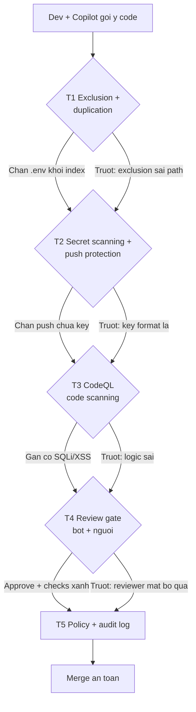

# 15 — Security Stack 5 Tầng Cho Copilot (Defense-in-Depth, Không Tin 1 Lớp Nào)

> **Bài 15 series 01.** · **Dành cho:** dev đã dùng Copilot (tự verify từng tầng) + admin/org owner (rà policy).
> **Vấn đề:** 1 lớp bảo mật luôn có lỗ — exclusion sai 1 path là secret lọt vào index, alert bị dismiss không ai biết.
> **Đọc xong:** dựng + verify được 5 tầng phòng thủ (content exclusion → secret scanning → CodeQL → review gate → policy/audit), chỉ ra được tầng nào team đang yếu và vá thế nào.
> **Thời gian:** ~45 phút (walkthrough 20 phút ở cuối bài).

## Mục lục

1. [Vì sao 5 tầng? (why)](#1-vì-sao-5-tầng-why)
2. [Bản đồ 5 tầng (nhìn 1 phút hiểu hết)](#2-bản-đồ-5-tầng-nhìn-1-phút-hiểu-hết)
3. [Tầng 1 — Exclusion + duplication detection (copy-paste)](#3-tầng-1--exclusion--duplication-detection-copy-paste)
4. [Tầng 2 — Secret scanning + push protection](#4-tầng-2--secret-scanning--push-protection)
5. [Tầng 3 — Code scanning + CodeQL](#5-tầng-3--code-scanning--codeql)
6. [Tầng 4 — Copilot code review gate](#6-tầng-4--copilot-code-review-gate)
7. [Tầng 5 — Policy + audit (khóa cửa)](#7-tầng-5--policy--audit-khóa-cửa)
8. [Walkthrough end-to-end (20 phút)](#8-walkthrough-end-to-end-20-phút)
9. [Pitfalls + fix](#9-pitfalls--fix)
10. [Bài tập](#10-bài-tập)
11. [Link chéo](#11-link-chéo)

---

## 0. Giải ngố thuật ngữ (1 câu + analogie + verify)

*Section này trả lời: 5 thuật ngữ của 5 tầng + 3 khái niệm chính sách (managed settings, AI Credits, OTEL) nghĩa là gì. Gặp ở đâu trong bài cũng tra được. Tra cứu nhanh, không cần đọc từ đầu.*

| Thuật ngữ | Hiểu nôm na (1 câu) | Analogie | Ví dụ kỹ thuật thật | Verify |
|---|---|---|---|---|
| **Content exclusion** | Danh sách "cấm nhìn": Copilot không được đọc/index files này. | Như phòng khóa trong nhà — giúp việc (Copilot) không được vào. | `**/.env*`, `**/*.pem`, `secrets/**` trong Org Settings → Copilot. | Hỏi `@workspace tìm STRIPE_KEY?` → phải "không thấy/excluded". |
| **Duplication detection** | Chặn Copilot copy y nguyên code người ta có bản quyền. | Như chống đạo văn: gợi ý trùng là báo nguồn, team kín thì chặn luôn. | Chế độ `Block` cho closed-source, `Allow + cảnh báo` cho open-source. | Copilot gợi ý trùng → hiện `matching public code` + link gốc. |
| **Secret scanning + push protection** | Camera quét + bảo vệ cửa: phát hiện key lọt, chặn ngay lúc push. | Như máy soi chiếu sân bay: có dao (key) là tuýt còi tại chỗ. | Push chứa `sk-live-...` → bị chặn + hướng dẫn chuyển sang env. | Thử push fake key → phải bị chặn (mục 8 walkthrough). |
| **CodeQL / Code scanning** | Bác sĩ soi X-quang: tìm SQLi/XSS/path traversal trong PR. | Như kiểm định xe: chưa đạt là chưa cho lăn bánh (merge). | Alert `SQL query built from user input` tại `refund.ts:42`. | PR hiện check `CodeQL` đỏ/xanh; Security tab liệt kê alerts. |
| **Defense-in-depth** | Không tin 1 lớp nào — 5 lớp chồng nhau, trượt lớp này còn lớp sau đỡ. | Như nhà 5 ổ khóa: cổng + cửa + két + camera + bảo vệ — trộm qua 1 lớp vẫn kẹt. | T1 trượt (exclusion sai) → T2 chặn push → T3 gắn flag → T4 reviewer thấy → T5 truy audit. | Mỗi incident trả lời được "tầng nào trượt + tầng nào đỡ". |
| **Managed settings (`managed-settings.json`)** | File JSON một nơi, admin siết luật cho mọi client Copilot. | Như nội quy ban quản lý dán ở sảnh — cư dân không tự sửa được. | `permissions.deny/ask/allow`, `allowedMcpServers`, `sandbox`, `telemetry`. | So key với mục 7.3; key sai kiểu dữ liệu thì validator báo lỗi. |
| **AI Credits** | Đơn vị tính tiền Copilot: 1 credit = $0.01, áp dụng từ 01/06/2026. | Như thẻ nạp phòng gym — mỗi lượt dùng trừ tiền, hết thì mua thêm. | Review Balanced tốn ~$0.25–$5 credit/lần (chưa kể Actions minutes). | github.com/settings/copilot → Usage xem credit theo ngày. |
| **OTEL (OpenTelemetry)** | Chuẩn mở để Copilot bắn telemetry về endpoint của công ty bạn. | Như camera nhà tự gửi hình về đầu ghi của nhà bạn, không của người khác. | Key `telemetry.endpoint` (OTLP) + `captureContent: false` trong managed settings. | Sau 1 phiên chạy, log phải về đúng endpoint bạn khai. |

---

## 1. Vì sao 5 tầng? (why)

*Section này trả lời: vì sao bật mỗi secret scanning là chưa đủ, và quy tắc nào quyết định cách team bạn ứng xử với mỗi sự cố.*

**1 câu:** 1 lớp bảo mật luôn có lỗ — defense-in-depth là xếp 5 lớp chồng nhau, lớp này trượt thì lớp sau đỡ.
**Nôm na:** như nhà 5 ổ khóa: trộm phá được cổng thì kẹt cửa, phá cửa thì kẹt két, phá két thì camera + bảo vệ vẫn thấy.
**Ví dụ:** Copilot đọc `.env` (T1 trượt) → gợi ý key vào code → push (T2 chặn) → CodeQL gắn cờ (T3) → reviewer thấy (T4) → audit truy ra (T5).

Mỗi lớp riêng lẻ đều bị xuyên được: exclusion cấu hình sai 1 path là secret lọt vào index;
secret scanning bỏ sót format lạ; CodeQL không bắt logic sai; review người thì
mệt bỏ qua; policy không audit thì trang trí. Vì vậy:

```text
Khong stack:  Copilot doc .env → goi y key vao code → push len GitHub → lo 6 thang moi biet
Co stack:    T1 chan .env khoi index → truot? T2 push protection chan push →
              truot? T3 CodeQL gan flag → truot? T4 reviewer thay → truot? T5 audit truy ra
```

> Quy tắc: **không tin bất kỳ 1 tầng nào. Mỗi incident phải trả lời "tầng nào
> trượt + tầng nào đỡ + vá tầng trượt thế nào".**

---

## 2. Bản đồ 5 tầng (nhìn 1 phút hiểu hết)

*Section này trả lời: 5 tầng là gì, mỗi tầng chặn thứ gì, nằm ở đâu trong GitHub, ai sở hữu. Đọc bảng dưới là đủ hình dung trước khi đi chi tiết.*

| Tầng | Hiểu nôm na | Ví dụ | Chặn gì | Ở đâu | Ai sở hữu |
|---|---|---|---|---|---|
| **1. Exclusion + duplication** | Khóa phòng + chống đạo văn. | `.env` không vào index; gợi ý trùng GPL bị block. | Copilot đọc file nhạy cảm; gợi ý copy code có license | Copilot settings (org/repo — Business/Enterprise) | Admin + team lead |
| **2. Secret scanning + push protection** | Máy soi + bảo vệ cửa. | Push `sk-live-FAKE` bị chặn tại chỗ. | Key/token lọt vào repo | GitHub Advanced Security | Admin (bật), dev (fix alert) |
| **3. Code scanning (CodeQL)** | Bác sĩ X-quang. | `query("SELECT ..."+input)` bị gắn cờ SQLi. | Lỗ hổng (SQLi, XSS, path traversal...) | PR checks + `github/codeql` | Team (fix), CI (chặn) |
| **4. Copilot code review gate** | 2 cặp mắt (máy + người). | Bot review + reviewer fresh verdict PASS. | Bug/logic mà máy + mắt người sót | PR review + required checks | Reviewer + maintainer |
| **5. Policy + audit** | Sổ trực + camera. | `action:copilot_policy` thấy ai tắt exclusion. | Ai đổi 4 tầng trên, ai dùng gì | Org/enterprise policy + audit log (giữ 180 ngày) | Admin |

```text
# Dong chay 1 PR an toan (5 tang di qua):
# T1: Copilot khong doc secrets khi goi y → T2: push khong mang key →
# T3: CodeQL quat xong xanh → T4: review (nguoi + Copilot) approve →
# T5: moi buoc ghi audit log. Thieu 1 tang la mu 1 mat.
```

Tầng 5 là tầng khóa chốt: 4 tầng trên chỉ sống được chừng nào policy còn đúng.
Nơi admin chốt luật là `managed-settings.json` (mục 7.3) và audit log (mục 7.2).

### 2.1. Sơ đồ defense-in-depth 5 lớp (mermaid)



Giải thích từng bước (kèm ví dụ tấn công mỗi lớp chặn được):

1. **A → T1:** Dev gõ code, Copilot gợi ý. T1 đảm bảo nó không "nhìn trộm" `.env` để gợi ý.
    - *Ví dụ tấn công bị chặn:* Copilot đọc `STRIPE_KEY=sk-live-...` trong `.env` rồi gợi ý `const key="sk-live-..."` vào code → T1 chặn vì `.env` excluded khỏi index.
    - *Ví dụ duplication:* Copilot gợi ý hàm trùng repo GPL → chế độ `Block` chặn, hiện `matching public code` + link gốc.
2. **T1 → T2:** Dù T1 trượt (admin exclude sai `src/` thay vì `secrets/`), push chứa key vẫn bị tuýt còi tại cửa.
    - *Ví dụ tấn công bị chặn:* Dev vô tình `git push` file chứa `AKIA...` (AWS key) → push protection chặn ngay, báo file:dòng.
    - *Verify:* thử push fake key ở mục 8 → phải thấy `BLOCKED`.
3. **T2 → T3:** Key format lạ lọt qua T2 (ví dụ token nội bộ không có pattern) thì CodeQL vẫn soi lỗ hổng code.
    - *Ví dụ tấn công bị chặn:* `db.query("SELECT * FROM users WHERE id=" + req.params.id)` → CodeQL báo `SQL query built from user input` (SQLi), check đỏ.
    - *Ví dụ khác:* `res.send("<div>"+comment+"</div>")` → báo XSS; `fs.readFile("./"+name)` → báo path traversal.
4. **T3 → T4:** CodeQL không bắt logic sai (refund sai 30 ngày) thì review 2 lớp (bot + người fresh) bắt.
    - *Ví dụ tấn công bị chặn:* PR "đúng" hết checks nhưng thiếu `auth check` ở route `/admin` (IDOR) → reviewer hỏi "auth ở đâu?" và Copilot review gắn `HIGH: missing auth`.
    - *Verify:* `git diff --stat main...HEAD` chạm `payments/auth` → review kỹ gấp đôi.
5. **T4 → T5 → M:** Mọi bước ghi audit. Reviewer mệt approve bừa, dismiss CodeQL không lý do → audit lôi ra.
    - *Ví dụ truy được:* Nửa đêm ai đó tắt push protection → `action:secret_scanning` + `actor` hiện tên + giờ trong audit log.
    - *Vòng lặp quý:* rà dismiss không lý do + exclusion drift (repo mới chưa cover) + vá tầng yếu nhất.

> ✅ **Kỳ vọng thấy gì:** sau khi bật đủ 5 tầng, PR mẫu hiện 3 checks xanh (`Secret scanning`, `CodeQL`, `Copilot review`) + audit log filter ra được actor đổi policy gần nhất.

---

## 3. Tầng 1 — Exclusion + duplication detection (copy-paste)

*Section này trả lời: file nào Copilot không được đọc, và làm sao biết chắc nó không đọc. Dev tự verify được, admin dùng checklist.*

### 3.1. Content exclusion: Copilot không được thấy gì

**Dành cho admin.** Lưu ý plan trước khi làm: **content exclusion là tính năng của Copilot Business/Enterprise**. Cấu hình ở repo, org hoặc enterprise; cấp cha truyền xuống cấp con (repo kế thừa từ org). Role `Maintain` chỉ xem được, không sửa được; cần automate thì dùng REST API.

```text
# Checklist admin (github.com → Org Settings → Copilot → Content exclusion):
[ ] **/.env* (moi bien the: .env.local, .env.prod...)
[ ] **/secrets/**, **/*.pem, **/*.key, **/*credentials*
[ ] **/migrations/*seed* (data that), dumps/*.sql
[ ] vendor/, dist/, *.min.js (nieu, khong phai secret nhung loai cho sach index)
[ ] Repo payments/auth: exclude ca thu muc chua HSM/cert configs
```

```bash
# Verify exclusion song (dev lam 1 lan, 2 phut):
# Chat: "@workspace tim chuoi STRIPE_KEY trong repo?"
# → ky vong: "khong thay / excluded". Thay duoc key that → bao admin NGAY.
git check-ignore -v .env .env.prod secrets/ 2>/dev/null
# → phai ignored (exclusion + gitignore song kiem, thieu 1 la ho 1 duong)
```

```bash
# .gitignore toi thieu song hanh exclusion (repo, commit — copy-paste khung):
# .env*
# secrets/
# *.pem
# *.key
# dumps/
git status --porcelain | grep -E "env|pem|key|secrets" || echo "sach: khong file nhay cam staged"
# → co hit la dung lai, unstage truoc khi commit
```

### 3.2. Duplication detection: không copy code người ta vào repo bạn

```text
# Bat: Org Settings → Copilot → Policies → Suggestions matching public code:
#   - Block (khuyen nghi team closed-source): chan goi y trung public code
#   - Allow: cho phep nhung gan can bao (team open-source ok)
# Ho admin team ban dang de Block hay Allow — dung doan.
```

**Theo mặc định 2026:** với **Copilot Business, chế độ này là `Blocked`** (chặn gợi ý
khớp public code). Muốn mở thì đổi ở phần **Privacy** của Org Settings — và phải
được legal đồng ý bằng văn bản. Cá nhân Free/Pro thì chọn được Block hay Allow.

```bash
# Khi Copilot bao "matching public code" (dung click accept mu):
# 1. Doc reference URL no dua (code goc license gi? GPL → can nac ky).
# 2. Viet lai theo style repo ban (dung paste y nguyen).
# 3. Them comment nguon neu giu y tuong: "# adapted from <url> (MIT)".
```

---

## 4. Tầng 2 — Secret scanning + push protection

*Section này trả lời: bật 2 công tắc nào cho admin, và khi bị chặn thì dev xử lý ra sao — không bypass.*

### 4.1. Bật 2 công tắc (admin, 5 phút)

```text
# github.com → Org/Repo Settings → Code security → bat ca 2:
[ ] Secret scanning: quat repo (qua khuc + tuong lai), alerts ve Security tab
[ ] Push protection: chan NGAY luc push neu phat hien secret (do hon fix sau)
# Thu tu uu tien: push protection truoc (chan moi), secret scanning sau (quat cu).
```

### 4.2. Dev workflow khi bị chặn/fix alert (copy-paste)

```bash
# Ca A — push bi chan (push protection): DUNG bypass, fix dung:
# 1. Doc thong bao: loai secret gi, file nao, dong nao
git diff --cached -- <file-bi-chan>
# 2. Xoa secret khoi code → chuyen sang env/secrets manager:
#    code doc process.env.STRIPE_KEY (khong hardcode "sk-live-...")
# 3. Commit lai + push lai (protection pass la xong)
# Verify: push lai thanh cong, khong bao secret.

# Ca B — secret da lot (alert trong Security tab):
# 1. REVOKE key do NGAY (Stripe/GitHub/AWS dashboard) — truoc khi xoa code
# 2. Xoa khoi history neu can (BFG/tru do admin), roi push fix
# 3. Danh hiệu alert resolved + ghi ly do (audit can, muc 7)
```

```bash
# Phong benh local: quat truoc khi push (pre-commit hook khung):
# .git/hooks/pre-commit (chmod +x):
#!/bin/sh
git diff --cached --name-only | xargs grep -n -i -E "sk-live|ghp_|AKIA|xoxb-|-----BEGIN .*PRIVATE KEY" && {
  echo "BLOCKED: nghi secret staged — doi sang env truoc khi commit"; exit 1; }
echo "pre-commit secrets: sach"
```

---

## 5. Tầng 3 — Code scanning + CodeQL

*Section này trả lời: bật CodeQL kiểu nào cho hiệu quả/giờ cao nhất, và xử lý alert ra sao cho đúng — fix gốc chứ không suppress cho qua.*

### 5.1. Bật CodeQL default setup (5 phút, hiệu quả/giờ cao nhất)

```text
# github.com → Repo Settings → Code security → Code scanning → Set up →
#   Default setup → chon query suite Extended (team payments/auth) hoach
#   Default (team khac) → Create. PR sau tu co check "CodeQL".
# Verify: mo 1 PR bat ky → check "CodeQL" phai hien va chay (xanh do chu).
```

```yaml
# Nang cao: variant custom khi default chua du (team payments — khung):
# .github/workflows/codeql.yml (codeql-action init + analyze cho js/ts + python):
# jobs.analyze.strategy.matrix.language: ['javascript-typescript', 'python']
# on: [pull_request, push (main), schedule: weekly] — weekly bat debt cu
```

### 5.2. Đọc + fix alert đúng cách (dev, copy-paste prompt)

```text
# Prompt fix CodeQL alert (paste alert message vao chat):
"CodeQL bao <dan alert: vd 'SQL query built from user input'> tai file X dong Y.
Giai thich lo hong 3 dong, sua bang parameterized query, giu behavior cu,
khong doi signature ham public."

# Quy tac fix:
# - Fix ROOT (validate/escape/parameterize), khong suppress alert cho qua.
# - Suppress (dismiss) chi khi: false positive CHUNG MINH duoc + ghi ly do + reviewer dong y.
# - Alert severity high/critical: fix truoc khi merge, khong "de sprint sau".
```

```bash
# Verify fix local truoc khi day PR (dung cho CI 10 phut moi biet):
npm run lint && npm run typecheck 2>/dev/null || npx tsc --noEmit
# → xanh local roi moi push (CodeQL CI la luoi cuoi, khong phai luoi dau)
```

---

## 6. Tầng 4 — Copilot code review gate

*Section này trả lời: gắn 2 lớp review (máy + người) vào PR kiểu nào, và review tốn bao nhiêu AI Credits để admin budget được.*

### 6.1. Gắn review vào PR (2 lớp: máy + người)

```text
# LOP may — Copilot code review (github.com PR → Copilot review):
# - Bat: Repo Settings → Copilot code review → auto review moi PR (team moi nen bat)
# - Doc review nhu junior nhiet tinh: dung 70%, bia 30% → verify tung comment.

# LOP nguoi — required reviewers + checks (Repo Settings → Branch protection):
[ ] Require pull request review (≥1 approve, team payments ≥2)
[ ] Require status checks: CodeQL + tests + secret scanning deu pass
[ ] Dismiss stale approvals khi push moi (dung approve ban cu, merge ban moi)
```

**Kinh tế của review gate (AI Credits — usage-based billing từ 01/06/2026):**

- **1 AI credit = $0.01.** Một lần review tốn **AI credits + GitHub Actions minutes** (Actions tính riêng, không nằm trong ước lượng credit).
- **Effort level:** `Lite` (nhắm đúng, nhanh) tốn **$0.05–$1 credit**; `Balanced` (model reasoning cao, hợp logic phức tạp + kiểm soát bảo mật) tốn **$0.25–$5 credit**.
- **`Balanced` là mặc định từ 28/09/2026** cho repo/org mới lẫn cũ. Chọn `Lite` tường minh vẫn được giữ.
- Review mặc định là kiểu **`Comment`** — **không tính là phê duyệt**. Muốn Copilot Approve thì phải cấu hình lại.
- Tự động review cấu hình được 3 mốc: lần đầu Copilot được gán vào PR, mỗi lần push mới, cả draft PR.
- Plan hỗ trợ: Pro/Pro+/Max/Business/Enterprise. Free chỉ có "Review selection" trong VS Code.
- Gọi từ CI: **API REST + GraphQL** (GA 02/10/2026) để request review và đặt effort.
- Repo-level: **"Allow Copilot to use MCP tools when reviewing pull requests" bật sẵn mặc định** — nghĩa là tool MCP trong repo có thể chạy lúc review.

### 6.2. Prompt review sâu cho PR nhạy cảm (copy-paste 3 mẫu)

```text
# Mau 1 — review bao mat (route payments/auth):
"Review PR nay theo goc bao mat: input validation, auth checks, secrets handling,
SQL/NoSQL injection, XSS, IDOR. Moi finding: severity + file: dong + fix goi y."

# Mau 2 — review logic (moi PR multi-file):
"Review logic PR nay: edge cases nao thieu? error paths nao nuoc loi?
Behavior change nao khong co trong PR description?"

# Mau 3 — doi chieu Copilot review:
"Copilot review bao <dan comments>. Cai nao dung/sai/false-positive?
Voi cai dung, sua theo fix goi y; sai thi ghi ly do bac."
```

```bash
# Gate cuoi truoc merge (reviewer chay 1 phut):
git diff --stat main...HEAD
# → files doi co cham secrets/payments/auth khong? (co → review ky gap doi)
# Checks: CodeQL xanh? tests xanh? Copilot review da doc het? (thieu 1 → chua merge)
```

---

## 7. Tầng 5 — Policy + audit (khóa cửa)

*Section này trả lời: admin chốt luật ở đâu, truy vết bằng cách nào, và tầng 5 có "sống" theo định kỳ không. Dev đọc để hiểu vì sao bị chặn; admin đọc để làm theo.*

### 7.1. Policy checklist (admin, rà hàng quý)

```text
# github.com → Org/Enterprise Settings → Copilot + Code security:
[ ] Content exclusion con dung paths? (repo moi them co duoc cover?)
[ ] Model allowlist con hop ly? (bai 14 — flagship ai duoc dung)
[ ] Duplication detection: Block hay Allow? (dung y legal chua?)
[ ] Push protection + secret scanning: ON cho MOI repo (khong sot repo moi)
[ ] CodeQL: default setup cho MOI repo (repo nao do man tinh → tech debt ticket)
[ ] Branch protection main: reviews + checks bat buoc (khong repo nao merge thang)
[ ] managed-settings.json con dung? (deny > ask > allow; MCP allow/deny; sandbox)
[ ] Network allowlist + OTEL endpoint con dung? (firewall mo du, log ve dung cho)
```

### 7.2. Audit log: ai đổi gì (truy incident + rà định kỳ)

**Đọc để tra, không cần nhớ.** Filter mặc định của GitHub là `action:copilot` — ghi lại
thay đổi plan/settings/policy/license và agent activity trên github.com.

```bash
# Xem: github.com → Org/Enterprise Settings → Audit log. Filters dung nhieu:
# action:copilot         → umbrella: plan/settings/policy/license + agent activity
# action:copilot_policy   → ai doi exclusion/model policy
# action:secret_scanning  → ai dismiss alert (dismiss dua la red flag)
# action:code_scanning    → ai dismiss CodeQL
# action:repo.policy      → ai noi branch protection

# Export ra quý (admin):
gh api /orgs/<ORG>/audit-log --paginate -f per_page=100 \
  -f phrase="action:copilot_policy OR action:secret_scanning" \
  --jq '.[] | [.actor, .action, .created_at] | @tsv' > /tmp/sec-audit.tsv
# → pivot: ai dismiss nhieu nhat? policy doi luc nua dem? (hoi 1 cau la ra chuyen)
```

2 giới hạn phải thuộc lòng của audit log:

- **Giữ 180 ngày.** Sự cố cũ hơn thì phải đã stream sang SIEM từ trước.
- **Không chứa prompt hay session data của client.** Muốn log prompt thì tự gắn hook
  riêng (vd Copilot CLI events gửi về hệ thống logging của công ty).

### 7.3. Managed settings + network allowlist + OTEL (chốt bằng policy as code)

**Dành cho admin.** Settings local dev sửa được; `managed-settings.json` thì không.
File này áp cho Copilot CLI, VS Code, GitHub Copilot app, Copilot cloud agent và
JetBrains IDEs. Chi tiết bảng key ở bài 07 mục 4.3.

```jsonc
// managed-settings.json — chot quyen. Thu tu uu tien: deny > ask > allow.
{
  "permissions": {
    "deny": ["shell_exec", "git_push_force"],
    "ask": ["mcp_tool_call"],
    "allow": ["file_read"],
    "disableBypassPermissionsMode": true   // chan bypass/YOLO mode
  },
  "allowedMcpServers": ["github", "playwright"],
  "deniedMcpServers": ["random-blog-mcp"]  // deny THANG allow
}
// - Ask khong thoa man duoc bang bypass/YOLO hay approval da luu.
// - Lenh chua khop rule nao → mac dinh chuyen sang HOI LAI.
// - Allowlist hieu luc = GIAO (intersection) cua moi nguon cau hinh.
// - Ca hai danh sach khai [] rong = LOCKDOWN: cam sach MCP server.
// Verify: goi 1 tool nam o dia deny → phai bao "blocked by policy".
```

```text
# Network allowlist (mo firewall dung cho — thieu domain la Copilot ket gia duoi):
- https://*.githubcopilot.com/*                        (moi plan)
- https://*.individual.githubcopilot.com               (ca nhan)
- https://*.business.githubcopilot.com                 (Business)
- https://*.enterprise.githubcopilot.com               (Enterprise)
- https://github.com/login/*  +  https://collector.github.com/*
- https://copilot-telemetry.githubusercontent.com/telemetry
- https://default.exp-tas.com  +  https://origin-tracker.githubusercontent.com   (do public code)
- https://*.SUBDOMAIN.ghe.com                          (data residency GHE.com)
```

```jsonc
// managed-settings.json — telemetry OTEL: Copilot tu gui log ve he thong cua ban.
{
  "telemetry": {
    "enabled": true,
    "endpoint": "https://otel.yourco.internal/v1/logs",  // OTLP
    "protocol": "http/protobuf",          // hoach "http/json"
    "captureContent": false,              // khong nhoi noi dung prompt
    "lockCaptureContent": true,           // client khong tu bat lai duoc
    "serviceName": "copilot-cli"
  }
}
// Verify: sau 1 phien chay, log phai ve dung endpoint ban khai.
```

### 7.4. Vòng lặp quý (admin + tech lead)

```text
# Vong lap quy (calendar block 30 phut, admin + tech lead):
# 1. Audit dismiss: secret/CodeQL dismiss nao thieu ly do? (10 phut)
# 2. Exclusion drift: repo moi/thu muc moi chua cover? (10 phut)
# 3. Va 1 tang yeu nhat quy nay (10 phut — ghi team log, bai 13 muc 7.3 cung nhiep)
```

---

## 8. Walkthrough end-to-end (20 phút)

*Section này trả lời: kiểm chứng cả 5 tầng trong 20 phút, theo đúng thứ tự từ verify local đến audit log. Làm hết là bạn có evidence viết vào báo cáo.*

**Phút 0–5 (tầng 1 — verify exclusion sống):**

```bash
git status --porcelain | grep -E "env|pem|key|secrets" || echo "sach"
# Chat: "@workspace tim STRIPE_KEY trong repo?" → phai khong thay
# Ho admin: duplication detection team dang Block hay Allow?
```

**Phút 5–10 (tầng 2 — push protection thử lửa):**

```bash
# Thu an toan: tao file tam chua fake key, stage, commit → protection phai chan/bao
echo 'STRIPE_KEY=sk-live-FAKEKEY123' > /tmp/fake.env && cp /tmp/fake.env ./fake-test.env
git add fake-test.env && git commit -m "test push protection" || echo "chan la DUNG"
git reset HEAD fake-test.env; rm fake-test.env /tmp/fake.env
# → bi chan = tang 2 song. Khong chan → bao admin kiem tra config
```

> ✅ **Kỳ vọng thấy gì:** `git commit` báo `Push protection / Secret detected: Stripe key at fake-test.env:1` (hoặc `chan la DUNG`). Sau `rm`, `git status --porcelain` trống (không còn file test).

**Phút 10–15 (tầng 3+4 — 1 PR mẫu):**

```text
# Mo 1 PR nho → xem: CodeQL check chay? Copilot review comment?
# Paste 1 alert (hoach gia dinh) vao prompt mau 5.2/6.2 → danh gia fix goi y.
# Reviewer check: branch protection co doi du checks? (muc 6.1)
```

**Phút 15–20 (tầng 5 — audit 1 dòng):**

```bash
# Mo audit log filter action:copilot_policy → ai doi lan cuoi, khi nao?
# Ghi team log 1 dong: "5 tang: T1 ok / T2 ok / T3 _ / T4 _ / T5 _" (dien _ sau khi check)
```

---

## 9. Pitfalls + fix

*Section này trả lời: 10 sai lầm làm 5 tầng thành trang trí, và cách sửa ngay.*

| Pitfall | Vì sao | Fix |
|---|---|---|
| Exclude cả `src/` nhầm | Retrieve/index rỗng, team tắt luôn exclusion | Paths tối thiểu (mục 3.1), verify bằng câu hỏi `.env` |
| Bypass push protection cho nhanh | Secret lọt, revoke + xoá history tốn 10x | Không bypass; chuyển env rồi push lại (mục 4.2) |
| Dismiss secret/CodeQL bừa | Lỗ hổng sống trong main, audit đỏ | Dismiss cần lý do + reviewer đồng ý, rà quý (mục 7.2) |
| Tin Copilot review 100% | Nó bịa 30%, merge bug tưởng đã review | Đối chiếu mẫu 6.2: đúng thì sửa, sai ghi lý do bác |
| CodeQL default rồi quên | Debt cũ tích, alert mới chìm trong cũ | Schedule weekly + ticket debt, high/critical fix trước merge |
| Repo mới không cover policy | Exclusion/CodeQL sót, hở từ ngày đầu | Checklist new-repo: 5 tầng on trước commit đầu (bài tập 3) |
| Audit log không ai đọc | Incident không truy được, dismiss bừa không ai biết | Rà quý 30 phút + vòng 15 phút/tuần cùng nhịp bài 13 |
| Không biết thứ tự deny > ask > allow | Config 2 nơi mâu thuẫn, tưởng cấm mà lại cho qua | Thuộc lòng **deny > ask > allow**; verify bằng tool bị deny (mục 7.3) |
| Tưởng audit log chứa prompt | Điều tra mất buổi vì dữ liệu không nằm ở đó | Prompt phải tự gắn hook log riêng; audit giữ 180 ngày (mục 7.2) |
| Firewall chặn thiếu domain Copilot | Copilot kẹt giữa chừng, dev tự mở toang firewall | Dùng network allowlist chuẩn (mục 7.3), không mở wildcard |

---

## 10. Bài tập

*Section này trả lời: làm 3 bài dưới đây để có evidence rằng 5 tầng đang chạy thật, không chỉ nằm trên giấy.*

**Bài 1 (15 phút — tầng 1+2):**

1. Chạy verify exclusion (mục 3.1) + pre-commit hook mẫu (mục 4.2) trên repo bạn.
2. Thử lửa push protection bằng fake key (mục 8) — ghi pass/block.
3. Hỏi admin duplication mode team (Block/Allow) — có đúng ý legal không?

**Bài 2 (20 phút — tầng 3+4):**

1. Mở Security tab repo bạn: còn alerts secret/CodeQL nào unresolved? Liệt kê theo severity.
2. Lấy 1 alert → fix bằng prompt mẫu 5.2 → verify lint/typecheck local.
3. Mở 1 PR → Copilot review có comment? Dùng mẫu 6.2 phân loại đúng/sai.

**Bài 3 (15 phút — tầng 5 + new-repo checklist):**

1. Audit log filter 3 actions (mục 7.2): policy đổi/dismiss lần cuối khi nào, ai?
2. Viết new-repo checklist 5 tầng cho team (dán wiki): repo mới phải on gì trước commit đầu?
3. Đặt calendar rà quý 30 phút (mục 7.4) + owner từng tầng.

> Đạt: chỉ ra được tầng nào của team đang yếu nhất bằng evidence (alerts/audit/
> thử lửa), và có new-repo checklist + lịch rà quý bằng văn bản.

---

## 11. Link chéo

*Section này trả lời: bài nào trong series đi sâu vào từng tầng của bài này.*

- **Bài 03 — Instructions/Memory/Rules**: quy ước secrets (`chỉ đọc env`) viết vào
  instructions để Copilot không bao giờ hardcode key.
- **Bài 07 — Policies/guardrails**: content exclusion cấu hình chi tiết + ai được đổi;
  bảng key `managed-settings.json` (deny > ask > allow, sandbox, telemetry OTEL).
- **Bài 08 — MCP kết nối công cụ ngoài**: `allowedMcpServers` / `deniedMcpServers`,
  network allowlist, sandbox + OTEL — phần "siết tool" của tầng 5.
- **Bài 10 — Modes/Permissions**: approval ask/deny cho terminal/MCP (gate lúc agent chạy).
- **Bài 11 — Git/worktrees/checkpoints**: review diff + undo trước khi accept agent edits.
- **Bài 12 — SDK/CI**: CodeQL + secret scan + tests làm required checks trong pipeline.
- **Bài 13 — Indexing & Telemetry**: exclusion ảnh hưởng index; dashboard theo dõi blocks.
- **Bài 14 — Models**: model allowlist là 1 phần policy tầng 5.
- **Bài 16 — Extensions/MCP validate**: tools ngoài có tuân thủ 5 tầng không?
