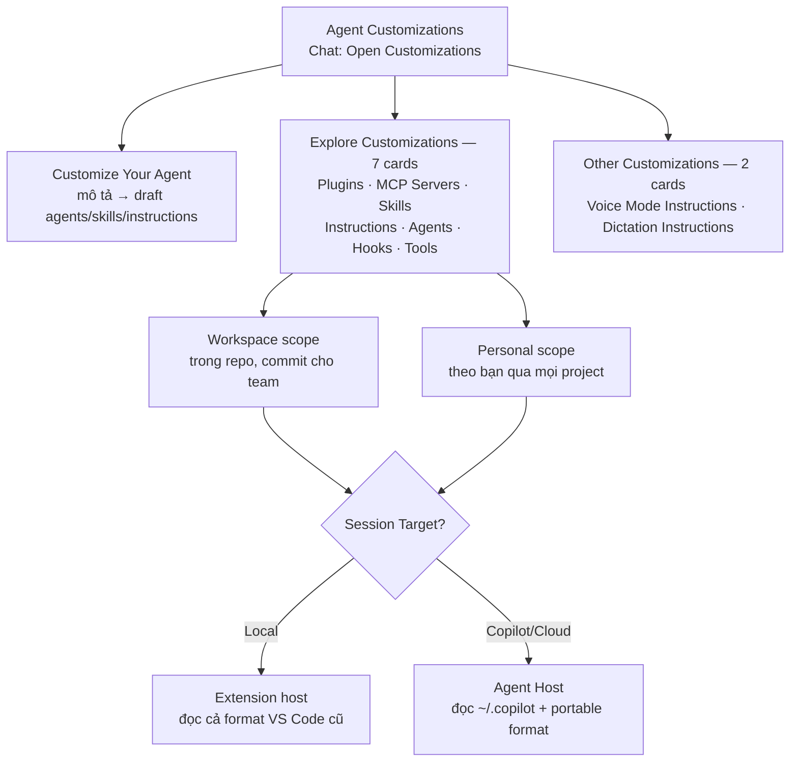

# 17 — Agent Customizations Hub (Customize + 7 cards + Voice/Dictation)

> **Dành cho:** dev/team muốn agent "hiểu nhà mình" thay vì trả lời chung chung — gom mọi tuỳ biến vào 1 màn hình (Bài 17 của series).
> **Vấn đề:** instructions/skills/agents/MCP/hooks nằm rải rác mỗi nơi một file, không biết cái nào đè cái nào, cài plugin lạ thì agent có quyền chạy code trên máy.
> **Đọc xong:** mở đúng hub (`Chat: Open Customizations`), dùng `Customize Your Agent` để draft, quản trị 7 cards Explore + 2 cards Voice/Dictation, phân biệt workspace (team) vs personal (theo bạn), và dựng governance plugin cho team.
> **Thời gian:** ~45 phút (bản mở rộng)

## Mục lục

1. [Vì sao cần 1 hub? (why)](#1-vì-sao-cần-1-hub-why)
2. [Sơ đồ: hub + 3 nhóm + 2 scope](#2-sơ-đồ-hub--3-nhóm--2-scope)
3. [Mở hub ở đâu + scope theo harness](#3-mở-hub-ở-đâu--scope-theo-harness)
4. [Customize Your Agent: mô tả → draft](#4-customize-your-agent-mô-tả--draft)
5. [Cần gì → dùng gì (bảng quyết định)](#5-cần-gì--dùng-gì-bảng-quyết-định)
6. [7 cards Explore chi tiết](#6-7-cards-explore-chi-tiết)
7. [Other: Voice Mode + Dictation Instructions](#7-other-voice-mode--dictation-instructions)
8. [Discover/Marketplace + governance team](#8-discovermarketplace--governance-team)
9. [Migrations + kiểm chứng (evaluations)](#9-migrations--kiểm-chứng-evaluations)
10. [Hiểu nhầm thường gặp](#10-hiểu-nhầm-thường-gặp)
11. [Walkthrough + pitfalls + bài tập](#11-walkthrough--pitfalls--bài-tập)
12. [Link chéo](#12-link-chéo)

---

## 1. Vì sao cần 1 hub? (why)

*Section này trả lời: vì sao không chỉnh từng file lẻ mà phải qua màn hình Agent Customizations.*

**Nôm na 1 câu:** Hub là **bảng điện tổng** của agent — thay vì đi mò từng ổ cắm (file instructions, skills, MCP, hooks rải khắp repo), bạn đứng 1 chỗ bật/tắt, xem cái nào đang cấp điện cho agent.

**Analogie đời thường:** Như setup bếp ăn công ty. Mỗi đầu bếp (agent) cần biết: thực đơn chuẩn (instructions), công thức món khó (skills), ai làm món nào (agents), chợ đầu mối ở đâu (MCP), chuông báo cháy đặt chỗ nào (hooks), dao thớt được dùng loại nào (tools). Không có bảng tổng thì mỗi người tự nhớ 1 kiểu.

Vấn đề hub giải quyết:

- Customizations nằm rải rác: `.github/`, `.claude/`, `~/.copilot/`, VS Code profile — không biết agent đang đọc cái nào.
- Mỗi harness (Local/Copilot/Cloud — bài 10 mục 3.3) đọc **định dạng + vị trí khác nhau** — file đặt sai chỗ = agent không thấy.
- Plugin lạ có thể mang theo **hooks + MCP chạy code trên máy bạn** — cần 1 chỗ review trước khi tin.

```text
# Verify bạn đang ở đâu (copy-paste check 1 phút):
# Chat view → icon bánh răng (Configure Chat) → mở Agent Customizations.
# Nhìn 3 nhóm: Customize Your Agent (draft) / Explore Customizations (7 cards)
# / Other Customizations (voice + dictation). Thiếu card nào → check harness đang chọn.
```

---

## 2. Sơ đồ: hub + 3 nhóm + 2 scope

*Section này trả lời: màn hình trong ảnh gồm những khối nào, và "workspace vs personal" nghĩa là gì.*



```text
Scope = ai được dùng + sống ở đâu:
- Workspace: file nằm trong repo (vd .github/), commit → cả team giống nhau.
- Personal: file nằm ở user level (vd ~/.copilot/), theo bạn qua mọi project.
- KHÔNG phải loại nào cũng có đủ 2 scope — mở đúng card, chọn New (Workspace/User)
  rồi xem list vị trí được hỗ trợ cho harness đang chọn.
# Verify: cùng 1 card, đổi Session Target Local ↔ Copilot → list vị trí đổi theo.
# Kỳ vọng: hiểu "đặt sai chỗ = agent không thấy" trước khi tạo file nào.
```

---

## 3. Mở hub ở đâu + scope theo harness

*Section này trả lời: mở màn hình trong ảnh bằng mấy cách, và vì sao cùng 1 màn hình mà nội dung đổi theo harness.*

**Nôm na:** Hub như quầy lễ tân — bạn phải **xưng danh harness trước** (Local hay Copilot) thì lễ tân mới đưa đúng chìa khóa phòng.

```text
Mở hub (4 cách — copy-paste):
1. Chat view → icon bánh răng (Configure Chat) → chọn card (Plugins/MCP/Skills/...).
2. Command Palette (Ctrl+Shift+P) → "Chat: Open Customizations".
3. Agents window → panel Customizations.
4. Trong chat: gõ /agents (mở card Agents, harness Copilot) hoặc /hooks (mở card Hooks).
   Local: /agents mở agent picker → Configure Custom Agents.
# Verify: mở hub → nhìn Session Target đang là gì. Đổi harness → nội dung card đổi theo.
```

```text
Luật scope theo harness (thuộc lòng):
- Editor hiện customizations của HARNESS ĐANG CHỌN. Chọn sai harness → tạo nhầm format/vị trí.
- Agent Host (Copilot/Cloud) đọc user-level từ ~/.copilot (Copilot) / ~/.claude (Claude),
  KHÔNG đọc VS Code profile user data cũ.
- Local đọc cả format VS Code cũ (.vscode/mcp.json, profile storage, locations settings).
- Editor có syntax highlighting + validation cho từng loại file — tạo file trong editor
  thay vì viết tay ngoài.
# Ai dùng lúc nào: trước khi tạo/sửa bất kỳ customization nào → check Session Target trước.
```

---

## 4. Customize Your Agent: mô tả → draft

*Section này trả lời: ô input "Prefer concise commits..." trong ảnh làm gì, và draft sinh ra đi đâu.*

**Nôm na:** Ô input là **người phiên dịch** — bạn nói tiếng người ("muốn commit ngắn gọn, review kỹ, code có test"), nó dịch ra file đúng chuẩn (agents/skills/instructions) để bạn duyệt rồi mới lưu.

```text
Cách chạy (copy-paste):
- Nhập mô tả vào ô Customize Your Agent → Enter → VS Code gửi "/init <mô tả>"
  vào 1 chat mới (Sessions window: "Generate agent customizations").
- Agent hỏi làm rõ → draft file (agents/skills/instructions) → BẠN REVIEW → save.
- Hoặc tạo từng loại trực tiếp: /create-prompt /create-instruction /create-skill
  /create-agent /create-hook + mô tả.
- /init đơn độc: phân tích repo → sinh .github/copilot-instructions.md (hoặc AGENTS.md
  nếu đã có) ghi lại build/test/architecture/conventions.
# Verify: draft xong mở file → check đúng format + vị trí của harness đang chọn.
# Quy tắc sắt: draft là bản nháp, KHÔNG phải bản chốt — đọc, sửa, rồi mới commit.
```

```text
Ví dụ copy-paste:
- "Prefer concise commits, thorough reviews, and tested code" → draft instructions
  (commit style) + skill (review checklist) + agent (reviewer read-only).
- "/init" trong repo mới → instructions ghi sẵn lệnh build/test + kiến trúc.
- "/create-hook chạy prettier sau mỗi lần agent sửa file" → hook PostToolUse.
# Ai dùng lúc nào: người mới (không biết template nào) → dùng ô draft.
# Người quen tay → /create-* nhanh hơn.
```

> **Draft-then-review là bất biến:** model biết schema (vì nó là kẻ đọc file lúc chạy) nên draft đúng chuẩn — nhưng schema có thể cũ theo version. Luôn cho draft đi qua validator của editor + review tay trước khi commit.

---

## 5. Cần gì → dùng gì (bảng quyết định)

*Section này trả lời: đứng trước 7 cards thì chọn card nào — tra bảng này trước khi tạo file.*

| Hiện tượng | Thay đổi nhỏ nhất nên thử |
|---|---|
| Agent quên yêu cầu 1 lần / thiếu 1 file | Ghi vào prompt hiện tại (đừng tạo file) |
| Agent lặp lại lỗi về lệnh/convention/kiến trúc toàn project | Thêm/sửa **Instructions** |
| Lỗi chỉ ở vài file/ngôn ngữ/task | **Instructions** nhắm mục tiêu (`applyTo`/`description`) |
| Team giải thích mãi 1 quy trình nhiều bước | Tạo **Skill** |
| 1 vai trò lặp lại cần tool giới hạn | Tạo custom **Agent** |
| Agent cần chạm hệ thống ngoài (DB, API, issue tracker) | Thêm **MCP server** |
| Việc PHẢI chạy ở 1 điểm trong vòng đời, bất kể model có nhớ không | Cấu hình **Hook** |
| Team muốn cài 1 bộ tuỳ biến đóng gói sẵn | Cài **Plugin** |
| Agent có quá nhiều/không đúng tool | Mở **Tools** rà soát |

```text
Luật tầng (nhớ 1 câu):
- Instructions dẫn dắt model (model có thể quên) — Hooks chạy tất định (deterministic,
  chạy bất kể model nhớ hay không).
- "Chạy prettier sau khi sửa file" viết trong instructions = nhờ model nhớ.
  Cùng việc đó làm bằng hook = máy tự chạy. Việc bắt buộc → hook, gợi ý → instructions.
# Verify: rule nào team phàn nàn "agent hay quên" → chuyển từ instructions sang hook.
```

---

## 6. 7 cards Explore chi tiết

*Section này trả lời: mỗi card trong ảnh là gì, file sống ở đâu (workspace/personal), và tạo/quản lý bằng gì. Đọc card nào mình cần, bỏ qua card chưa cần.*

### 6.1. Plugins — gói cài 1 lần

**Nôm na:** Plugin là **hộp cơm trưa đóng sẵn** — thay vì tự nấu từng món (skill + agent + MCP + hooks), bạn nhận 1 hộp có đủ món ăn khớp nhau.

- **Agent Plugins 1.0** là chuẩn mở, portable giữa VS Code / Copilot CLI / Copilot app / SDK: thư mục có `plugin.json` (manifest) + `skills/` + `mcp.json`. Phần riêng của Copilot nằm ở namespace `com.github.copilot/` (`agents/`, `commands/`, `rules/`, `hooks/`, `hooks.json`) — client khác bỏ qua.
- Cài: hub → Plugins → Discover/Browse Marketplace (bật `chat.customizations.marketplace.enabled` để dùng Discover hợp nhất; filter `@type:skill`, `@type:mcp`). Tắt/bật: plugin tắt → toàn bộ skill/agent/hook/MCP của nó biến mất khỏi agent.
- Settings: `chat.plugins.enabled`, `chat.plugins.marketplaces` (mặc định có copilot-plugins, awesome-copilot), `chat.pluginLocations` (đăng ký plugin clone tay).

```text
# Caution (copy-paste checklist trước khi Install):
# 1. Đọc plugin.json: trong hộp có gì (skills? MCP? hooks?).
# 2. Plugin có hooks/MCP = code chạy trên máy bạn → check publisher + source.
# 3. Marketplace lạ ≠ từng plugin an toàn — duyệt từng plugin, không duyệt theo tên chợ.
# 4. Ưu tiên plugin nhỏ: 1 skill rõ việc, tool hẹp. Mở rộng sau khi team giải thích
#    được "plugin này làm gì và vì sao an toàn".
```

### 6.2. MCP Servers — cửa ra hệ thống ngoài

**Nôm na:** MCP là **cổng giao hàng** — agent ở trong bếp vẫn lấy được nguyên liệu từ chợ ngoài (DB, API, browser) qua cổng chuẩn.

- Thêm: hub → MCP Servers, hoặc `MCP: Add Server` (guided flow). Prefer format portable để Agent Host đọc native.
- Vị trí: workspace `.mcp.json` (portable, root repo) — legacy `.vscode/mcp.json` (Agent Host KHÔNG đọc trực tiếp, VS Code forward hộ, trừ server cần `${input:...}`); user `~/.copilot/mcp-config.json`.
- Bật/tắt không đụng file config (state lưu riêng). `chat.mcp.autostart` điều khiển tự start; `chat.mcp.discovery.enabled` cho phép suy ra config từ tool.

```text
# Verify: MCP add xong → gõ # trong chat → thấy tool mới? Agent Host session thì
# check Agent Host đọc được (.mcp.json hoặc ~/.copilot/mcp-config.json).
# Chi tiết kết nối ngoài: bài 08. Bảo mật/validate: bài 16.
```

### 6.3. Skills — công thức món khó

**Nôm na:** Skill là **công thức + nguyên liệu đóng gói** — agent chỉ mở ra đọc khi gặp đúng món (task khớp), thay vì học thuộc lòng mọi công thức.

- Chuẩn mở (agentskills.io), portable qua VS Code / CLI / app / cloud agent / Codex (experimental): thư mục chứa `SKILL.md` (frontmatter + body) + scripts/templates/reference kèm theo.
- Frontmatter: `description` (BẮT BUỘC, ≤1024 ký tự — viết rõ "làm gì + khi nào dùng" để agent biết lúc nào load), `user-invocable` (hiện ở menu `/`?), `disable-model-invocation` (chỉ chạy khi gọi tay?), `context: fork` (experimental — chạy trong subagent riêng, chỉ trả kết quả về, giữ context chính sạch).
- Vị trí: workspace `.github/skills/<ten>/SKILL.md` (+ `.claude/skills/`, `.agents/skills/`); personal `~/.copilot/skills/`. Tên trong frontmatter PHẢI khớp tên thư mục.
- Settings: `chat.useAgentSkills` (mặc định bật), `chat.agentSkillsLocations`, `chat.agentCustomizationSkill.enabled` (skill dạy AI cách tạo agents/instructions/prompts/skills).
- Gọi: agent tự load khi task khớp, hoặc gõ `/<ten-skill>` trong chat.

```text
# Verify: hỏi task khớp skill → mở References trong câu trả lời → thấy skill được load?
# Skill từ plugin: KHÔNG tự thêm tiền tố namespace (plugin tự prefix, vd /my-plugin:test-runner).
```

### 6.4. Instructions — thực đơn chuẩn

**Nôm na:** Instructions là **nội quy bếp** dán trên tường — agent nào vào cũng đọc: always-on (áp mọi request) hoặc file-based (áp khi khớp file/task).

- Theo harness (chọn đúng trước khi tạo):

| Harness | Project (always-on) | Targeted |
|---|---|---|
| Copilot | `.github/copilot-instructions.md` hoặc `AGENTS.md` | `.github/instructions/**/*.instructions.md` |
| Claude | `CLAUDE.md` | Markdown trong `.claude/rules` |
| Codex | `AGENTS.md` | `AGENTS.md` trong subfolder |
| Local | 1 trong 3 trên | cả 2 họ trên |

- Personal: `~/.copilot/instructions` (Copilot) / `~/.claude/rules` (Claude); Local user = VS Code profile storage (cũ — nên migrate sang `~/.copilot`).
- Frontmatter `*.instructions.md`: `name`, `description` (để agent tự load theo task), `applyTo` (glob, `**` = mọi file; Claude rules dùng `paths` thay vì `applyTo`).
- Verify: mở References trong câu trả lời → thấy file instructions được kèm? `AGENTS.md` đặt ở root repo (cross-agent, nhiều harness đọc chung).

### 6.5. Agents — đầu bếp chuyên món

**Nôm na:** Custom agent là **đầu bếp chuyên 1 món** — gom instructions + tool + model thành 1 persona (reviewer, planner...), gọi là có ngay, khỏi dặn lại từ đầu.

- File `.agent.md`: frontmatter YAML + body Markdown (nhiệm vụ, guideline, output mong đợi). Tham chiếu tool trong body bằng `#tool:<ten>` (vd `#tool:web/fetch`).
- Frontmatter hay dùng: `description` (hiện ở ô chat), `name`, `argument-hint`, `tools` (built-in/MCP/extension; `server/*` = cả server), `agents` (`*` = cho dùng mọi subagent, `[]` = cấm; kèm tool `agent`), `model` (1 model hoặc list ưu tiên), `user-invocable: false` (ẩn khỏi dropdown, chỉ làm subagent), `handoffs` (nút gợi ý chuyển agent kèm prompt, `send: true` = tự gửi), `hooks` (preview, chỉ Local).
- Dùng: Session Target đúng harness → dropdown Agent → chọn agent → prompt theo vai trò. Subagent: agent cha gọi agent con (cần bật `chat.subagents.allowInvocationsFromSubagents` cho tự gọi đệ quy).
- Chi tiết agents song song/subagent: bài 06.

### 6.6. Hooks — chuông báo cháy tự động

**Nôm na:** Hook là **chuông báo cháy + vòi phun tự động** — tới điểm hẹn trong vòng đời agent là chạy, không cần model nhớ bấm nút.

- Harness nào chạy thì dùng hook implementation của harness đó (file giống nhau ≠ hành vi giống nhau — events/matchers/payloads khác nhau):

| Session target | Chạy ở đâu | Dùng tài liệu nào |
|---|---|---|
| Local | Extension host | Local hooks (bài này) |
| Copilot/Cloud | Agent Host / hạ tầng provider | GitHub Copilot hooks reference |
| Claude/Codex | Agent Host / extension | Reference của provider đó |

- Local locations: workspace `.github/hooks/*.json`; user `~/.copilot/hooks/*.json`; Claude format `.claude/settings.json` (cần `chat.useClaudeHooks`, mặc định tắt); agent-scoped trong frontmatter `.agent.md` (cần `chat.useHooks` + workspace trusted); plugin `hooks.json`/`hooks/hooks.json` theo format.
- Events hay dùng: `PreToolUse` (chặn lệnh nguy hiểm trước khi chạy), `PostToolUse` (lint/format sau khi sửa), `SessionStart`, `SubagentStart`, `PreCompact`, `Stop`, `UserPromptSubmit`.
- Tạo: `/create-hook <mô tả>` (sinh vào `.github/hooks/`) hoặc New trong card Hooks. Đối chiếu reference của harness đích trước khi dùng.

```text
# Verify: hook PostToolUse format → sửa 1 file → hook có chạy? Bị chặn oan →
# check matcher/event name đúng schema của harness đang dùng (Local vs Copilot khác nhau).
```

### 6.7. Tools — dao thớt được phép dùng

**Nôm na:** Tools là **bộ dao trong bếp** — card này cho xem agent được cầm con nào, cất con nào đi. Cất dao ≠ khóa cửa (xem bảng dưới).

- 3 họ: built-in (đọc/ghi file, terminal, search — có sẵn), MCP (từ server đã cài), extension (từ extension qua Language Model Tools API).
- Local: tools picker trong Chat (`Configure Tools`) — chọn theo **từng request**. Gõ `#` trong chat để duyệt/gắn tool, tool set (`#edit`, `#search`), context.
- Copilot harness: card **Tools** trong hub — chọn theo **profile** (giữ qua các session). Có search, checkbox theo nhóm (mixed state khi bật 1 phần), đếm enabled/total. Nhóm Copilot (built-in của harness) là read-only.
- Tool set tái dùng: `Chat: Configure Tool Sets` → file `.jsonc` (`tools`, `description`, `icon`) → dùng chung cho prompt/agent.
- Giới hạn: tối đa **128 tools/request** — vượt thì tắt bớt tool/server trong picker, hoặc bật virtual tools (`github.copilot.chat.virtualTools.threshold`).

```text
# Luật sắt: availability ≠ approval. Bật tool = cho agent THẤY, không phải cho CHẠY
# tự do — chạy hay không do permission level + approval (bài 10 mục 5.3/5.4) quyết.
# Tool ít + đúng việc → agent chọn chuẩn hơn, ít hành động thừa, đỡ tốn context.
```

---

## 7. Other: Voice Mode + Dictation Instructions

*Section này trả lời: 2 cards cuối trong ảnh (`voice.md`, `dictation.md`) là gì, file ở đâu, bật bằng setting nào.*

**Nôm na:** 2 cards này là **phiên dịch viên nói** — một lo cách agent NÓI với bạn (voice), một lo cách máy HIỂU lời bạn nói (dictation).

| Card | File | Tác dụng |
|---|---|---|
| **Voice Mode Instructions** | User `~/.copilot/voice.md` / workspace `.github/voice.md` | Tuỳ biến hành vi + thuật ngữ của Voice Mode (đọc câu trả lời thành tiếng, nghe follow-up). Mở: `Voice: Configure Voice Mode Instructions` |
| **Dictation Instructions** | User `~/.copilot/dictation.md` / workspace `.github/dictation.md` (workspace phải trusted) | Dặn model dọn transcript: thuật ngữ ưa thích, format. Mở: `Voice: Configure Dictation Instructions`. Chỉ có tác dụng khi bật `dictation.experimental.llmCleanup` |

```text
# Điều kiện + giới hạn (copy-paste check):
# - Voice Mode: bật agents.voice.enabled → nút Voice Mode ở ô chat (Shift+Ctrl+Space).
#   handsFree (agents.voice.handsFree): nói xong tự nghe tiếp; Shift+Ctrl+M mute mic.
# - Voice Mode rollout dần + cần plan Copilot cá nhân đủ điều kiện; KHÔNG có trên
#   Business/Enterprise (org có thể tắt preview features bằng policy).
# - voice.md điều chỉnh cách NÓI của voice (backend nhận voice_instructions),
#   KHÔNG phải transcript lời bạn — đừng nhầm với dictation.md.
# - Dictation chỉ dọn transcript (chính tả/thuật ngữ/format), giữ nguyên safety rules.
```

---

## 8. Discover/Marketplace + governance team

*Section này trả lời: team tìm/cài plugin ở đâu, và admin khóa lại bằng gì để agent không thành "hộp đồ nghề vô chủ".*

**Nôm na:** Marketplace là **chợ đầu mối** — team ra chợ lấy hộp cơm (plugin) về. Admin là **ban quản lý chợ**: quyết chợ nào được họp, hộp nào được bán, dao nào được mang vào bếp.

```text
Tìm + cài (copy-paste):
1. Hub → Discover (bật chat.customizations.marketplace.enabled để có Discover hợp nhất).
2. Source menu: All hoặc nguồn cụ thể (vd GitHub Feed). Lọc @type:skill / @type:mcp.
3. Mở item → đọc publisher, source, file kèm theo, setup requirements.
4. Install → chọn đích (workspace hay user).
# Verify sau cài: skill mới hiện ở / menu? MCP mới hiện ở server list? Plugin tắt →
# toàn bộ đồ của nó biến mất?
```

```text
4 lớp governance (admin — copy-paste):
1. Marketplace trust: chat.plugins.marketplaces — chợ nào được họp (mặc định
   copilot-plugins, awesome-copilot; thêm chợ nội bộ đã review).
2. Plugin approval: enabledPlugins (chỉ bật plugin đã review) + blocklist plugin
   lạ/bỏ hoang/xin quyền quá rộng. Team override phải có owner + expiry.
3. Tool approval: MCP allowlist theo command/URL/name — ưu tiên server read-only,
   scoped, audit được (bài 10 mục 5 + bài 16).
4. Managed settings: enabledPlugins / extraKnownMarketplaces / strictKnownMarketplaces
   áp 1 lần cho VS Code + CLI + app + cloud agent (Business/Enterprise).
# Quy tắc: duyệt theo NỘI DUNG (manifest + skills + MCP + hooks), không duyệt theo tên.
# Plugin tên lành vẫn có thể mang MCP trỏ tool nhạy cảm.
```

```text
Monorepo (mở subfolder, không phải root):
- Bật chat.useCustomizationsInParentRepositories → VS Code leo từ folder đang mở
  lên tới .git root để nhặt AGENTS.md / copilot-instructions.md / instructions /
  prompts / agents / skills / hooks.
# Chỉ áp dụng khi folder mở không tự là git repo mà cha của nó có .git.
```

---

## 9. Migrations + kiểm chứng (evaluations)

*Section này trả lời: đồ cũ (prompt files, profile storage, locations settings) chuyển sang chuẩn mới thế nào, và làm sao biết customization có "ngấm" không.*

**Nôm na:** Như chuyển nhà — đồ cũ đóng thùng đúng nhãn (migration), sang nhà mới thử bật từng công tắc xem đèn có sáng không (evaluations).

| Migration | Dùng khi | Setting |
|---|---|---|
| Prompt files → Skills | Prompt files deprecated trên Agent Host (Local còn chạy, nhưng Local sẽ bị bỏ tương lai) | `chat.customizations.promptMigration.enabled` (mặc định `true`) |
| User data (profile) → `~/.copilot`/`~/.claude` | Agent Host không đọc profile storage cũ | `chat.customizations.userDataMigration.enabled` (mặc định `false`) |
| Locations settings → vị trí chuẩn | `chat.agentFilesLocations`/`chat.instructionsFilesLocations`/… chỉ Local dùng, đã deprecated | `chat.customizations.locationsMigration.enabled` (mặc định `false`) |
| MCP servers | Gom server hợp lệ về `.mcp.json`/`~/.copilot/mcp-config.json` portable | (không setting riêng) |

```text
Kiểm chứng customization có ngấm không (copy-paste):
1. Chạy task mẫu → mở References trong câu trả lời → đúng file instructions/skill
   được kèm? (instructions + skills check được ở đây)
2. Chat view → ... → Diagnostics: xem mọi agents/prompts/instructions/skills đang
   load + lỗi. Sâu hơn: Developer: Open Agent Debug Logs.
3. Kẹt không hiểu agent: gõ /troubleshoot + mô tả → phân tích debug logs ngay trong chat.
4. File viết xong: mở bằng editor trong hub (có validation) + extension
   "Chat Customizations Evaluations: Analyze" để bắt câu mơ hồ/mâu thuẫn.
   Skill lớn: scaffold Waza eval (Download Waza Binary → Create Eval Scaffold → Run).
# Quy tắc: test 1 task đại diện trước khi tin customization cho việc thật.
```

---

## 10. Hiểu nhầm thường gặp

*Bảng tra nhanh, không cần đọc từ đầu.*

| Hiểu nhầm | Sự thật |
|---|---|
| "Tạo file là xong, agent tự thấy" | Sai. Sai harness/vị trí/format = agent không thấy. Check Session Target + list vị trí của card |
| "Instructions cấm là đủ, khỏi hook" | Sai. Instructions là advisory (model quên được). Việc bắt buộc → hook (deterministic) |
| "Plugin = MCP server" | Sai. MCP là cổng tool; plugin là hộp đựng (có thể mang MCP + skills + agents + hooks) |
| "Bật tool trong card Tools là cho chạy tự do" | Sai. Availability ≠ approval — chạy hay không do permission level (bài 10) quyết |
| "Draft của Customize Your Agent chốt luôn được" | Sai. Draft là nháp — review + validate + sửa rồi mới commit |
| "Prompt files còn tốt, khỏi migrate" | Sai. Deprecated trên Agent Host — migrate sang skills sớm |
| "Đổi Session Target = đổi model" | Sai. Target đổi harness/nơi chạy; model đổi ở model picker |
| "voice.md sửa transcript lời mình" | Sai. voice.md chỉnh cách agent NÓI; transcript do dictation.md lo |
| "Marketplace nào cũng an toàn như nhau" | Sai. Duyệt từng plugin theo nội dung, không theo tên chợ |
| "Skill gắn prefix tên plugin cho chắc" | Sai. Plugin tự prefix (`/my-plugin:test-runner`) — tự prefix tay làm skill load lỗi câm |

---

## 11. Walkthrough + pitfalls + bài tập

*Section này trả lời: đi 1 vòng hub từ draft tới verify trong 20 phút, lỗi nào hay gặp, và bài tập nào để tự kiểm chứng.*

### 11.1. Walkthrough: từ số 0 tới agent hiểu nhà mình (20 phút)

```text
Bước 1 (3 phút): mở hub (gear icon → Chat: Open Customizations). Check Session Target
  (Local hay Copilot?) — mọi bước sau theo harness này.
Bước 2 (5 phút): ô Customize Your Agent → gõ 1 câu về team ("commit ngắn gọn tiếng Anh,
  review luôn hỏi về test, code theo kiến trúc trong README") → review draft →
  save đúng vị trí editor gợi ý.
Bước 3 (5 phút): card Instructions → verify file mới hiện + đúng scope (workspace/user).
  Hỏi agent 1 câu → mở References → file có được kèm?
Bước 4 (4 phút): card Tools → tắt 2 nhóm tool không bao giờ dùng. Hỏi lại task cũ →
  agent vẫn làm được (chứng minh tool thừa đã bị loại)?
Bước 5 (3 phút): card MCP Servers → review list server: server nào lạ/thừa → Disable.
  Ghi lại: server nào team giữ, vì sao.
# Kỳ vọng cuối: 1 instructions ngấm (References hiện) + tools gọn + MCP sạch.
```

### 11.2. Pitfalls + fix

| Pitfall | Vì sao | Fix |
|---|---|---|
| Tạo file xong agent không thấy | Sai harness/vị trí | Đổi Session Target đúng → tạo lại ở vị trí card gợi ý |
| Rule "agent hay quên" | Để rule bắt buộc trong instructions | Chuyển sang hook (Pre/PostToolUse) |
| Cài plugin xong agent có tool lạ | Không đọc manifest | Gỡ plugin → đọc kỹ plugin.json + MCP + hooks rồi cài lại |
| Skill không load | `description` chung chung / tên ≠ thư mục | Viết description "làm gì + khi nào" (≤1024 chars); tên khớp thư mục |
| Vượt 128 tools/request | Bật cả server MCP nặng | Tắt bớt trong picker hoặc bật virtual tools |
| Prompt files mất tác dụng trên Copilot | Deprecated trên Agent Host | Migrate sang skills |
| Monorepo mở subfolder mất customizations | Chỉ đọc folder đang mở | Bật `chat.useCustomizationsInParentRepositories` |
| Dictation không dọn transcript | Chưa bật cleanup | Bật `dictation.experimental.llmCleanup` + viết `dictation.md` |

### 11.3. Bài tập thực hành

**Bài 1 (15 phút):** Dùng ô Customize Your Agent draft 1 instructions cho repo đang mở. Review draft, sửa ít nhất 2 chỗ, save. Verify bằng References.

**Bài 2 (15 phút):** Viết 1 skill `SKILL.md` (vd `review-checklist`: checklist review + ví dụ). Gọi bằng `/review-checklist` và để agent tự load 1 lần. Ghi khác biệt.

**Bài 3 (15 phút):** Tạo 1 hook `PostToolUse` chạy formatter sau khi agent sửa file (Local). Test: agent sửa 1 file → hook có chạy? Ghi log.

**Bài 4 (15 phút):** Review toàn bộ MCP servers + plugins đang cài. Lập bảng "giữ/bỏ" kèm lý do. Server nào write/prod → ghi kế hoạch siết (allowlist/deny).

### 11.4. Troubleshooting matrix ("customization không ăn" → tra đâu?)

```text
"Agent không làm theo ý mình?"
├─ 1. Harness đúng chưa? (hub hiện đồ của harness đang chọn — Local vs Copilot khác nhau)
├─ 2. File đúng chỗ chưa? (mở card tương ứng → đối chiếu vị trí hỗ trợ)
├─ 3. Format đúng chưa? (frontmatter name/description/applyTo? tên skill khớp thư mục?)
├─ 4. References có kèm file? (không → applyTo/description chưa khớp task)
├─ 5. Diagnostics + Agent Debug Logs nói gì? (Chat ... → Diagnostics)
├─ 6. Vẫn kẹt → /troubleshoot + mô tả, hoặc chat mới (context cũ nhiễu).
└─ 7. Nghi policy/org chặn → hỏi admin (marketplace/plugin/tool allowlist).
```

---

## 12. Link chéo

*Tra cứu nhanh: nối bài này với các bài còn lại trong series.*

- **Bài 00 — Tổng quan:** model vs harness (tay chân) — nền khái niệm của cả bài này.
- **Bài 02 — Bề mặt:** Session Target Local/Copilot/Cloud — chọn harness trước khi mở hub.
- **Bài 03 — Instructions:** instructions sâu (advisory vs gate) — đọc khi viết nội quy.
- **Bài 05 — Prompt files:** `*.prompt.md` + `/create-prompt` — đọc trước khi migrate sang skills.
- **Bài 06 — Custom agents:** agents sâu + subagent song song — đọc khi làm đầu bếp chuyên món.
- **Bài 07 — Guardrails:** 6 lớp chặn (branch protection, push protection) — luật chặn cuối ngoài hooks.
- **Bài 08 — MCP:** kết nối công cụ ngoài sâu — đọc khi mở cổng giao hàng.
- **Bài 09 — Extensions:** extensions vs plugins — đừng nhầm hộp đồ nghề.
- **Bài 10 — Modes/Permissions:** personas, permission levels, sandbox, handoff — chạy hay không do đây quyết.
- **Bài 11 — Worktrees:** worktree cô lập — chạy Autopilot/plugin lạ trong chuồng riêng.
- **Bài 12 — SDK/CI:** Copilot harness + AHP — nền kỹ thuật của target Copilot.
- **Bài 16 — Validate:** review plugin/MCP trước khi cài — checklist an toàn.

---
*(Hết bài 17 — bản mở rộng. Hub này là "bảng điện tổng": nắm scope + harness + review-draft thì mọi card còn lại chỉ là thao tác.)*
