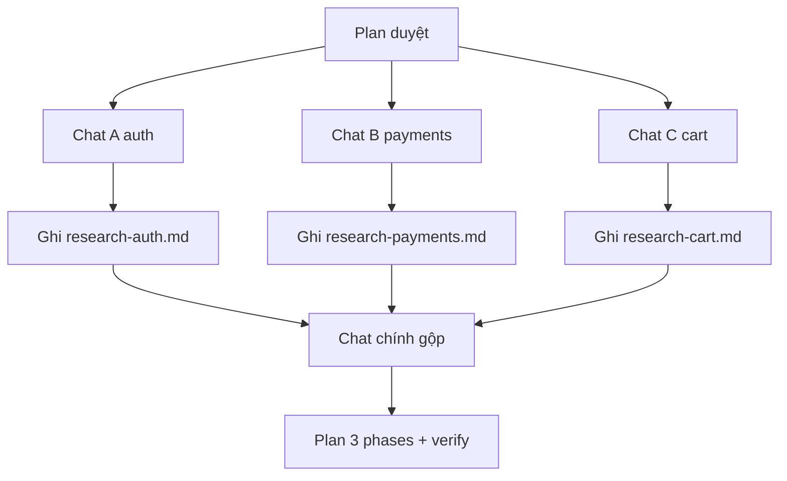

# Tips 05 — Parallel Agents: Chạy Song Song Multi-Chat, Coding Agent, Worktrees

> Copilot mạnh nhất khi bạn fan-out: multi-chat song song, multi Coding Agent sessions, worktrees cô lập, custom agents chia vai. Bài này dạy bạn khi nào song song, khi nào không, và 4 recipes copy-paste.

## Mục lục

- [1. Vì sao phải song song?](#1-vì-sao-phải-song-song)
- [2. Cơ chế: 4 kiểu song song Copilot](#2-cơ-chế-4-kiểu-song-song-copilot)
- [3. Kiểu 1: multi-chat song song (nhanh nhất)](#3-kiểu-1-multi-chat-song-song-nhanh-nhất)
- [4. Kiểu 2: multi Coding Agent sessions](#4-kiểu-2-multi-coding-agent-sessions)
- [5. Kiểu 3: worktrees cô lập](#5-kiểu-3-worktrees-cô-lập)
- [6. Kiểu 4: custom agents fan-out](#6-kiểu-4-custom-agents-fan-out)
- [7. Walkthrough theo phút: research 3 modules 30 phút](#7-walkthrough-theo-phút-research-3-modules-30-phút)
- [8. Bảng tra nhanh: chọn kiểu nào?](#8-bảng-tra-nhanh-chọn-kiểu-nào)
- [9. Pitfalls + cách fix](#9-pitfalls--cách-fix)
- [10. Bài tập cuối bài](#10-bài-tập-cuối-bài)
- [11. Tham khảo chéo](#11-tham-khảo-chéo)

---

## 0. Giải ngố thuật ngữ (1 câu + analogie + verify)

| Thuật ngữ | Hiểu nôm na | Analogie | Ví dụ kỹ thuật thật | Verify |
|---|---|---|---|---|
| **Fan-out / Fan-in** | Chia việc ra nhiều nhánh rồi gộp lại. | Như 3 người cùng nấu 3 món rồi dọn 1 mâm. | 3 chats research `auth/payments/cart` → chat thứ 4 gộp thành plan. | Chat chính chỉ nhận 3 files summary, không nhận log dài. |
| **Multi-chat** | Mở nhiều chat cùng lúc, mỗi chat 1 việc. | Như mở 3 cửa sổ chat với 3 trợ lý khác nhau. | Chat A `auth`, B `payments`, C `cart` chạy song song 20 phút. | 30 phút xong 3 modules (tuần tự mất 60 phút). |
| **Worktree** | Phòng riêng cho mỗi nhánh code. | Như mỗi đầu bếp 1 bếp riêng — không tranh dao. | `git worktree add ../proj-auth feature/auth-fix` + `code ../proj-auth`. | 2 VS Code windows, `git diff` mỗi bên chỉ scope mình. |
| **Output contract** | Quy định nhánh chỉ trả gì (3 bullet + evidence). | Như bắt shipper chỉ giao hóa đơn gọn, không chở cả kho. | Mỗi nhánh trả: quyết định 3 bullet + `file:line` + log xanh. | Chat chính không phình (>50% rác là vi phạm). |



Giải thích: 1) Chỉ fan-out việc độc lập + khác files. 2) Mỗi nhánh ghi ra file riêng (không dump vào chat chính). 3) Chat chính gộp + duyệt plan. 4) Merge tuần tự + full test sau mỗi merge. Cùng file thì cấm song song.

> ✅ **Kỳ vọng thấy gì:** 3 files `research-*.md` mỗi file ≤30 dòng; chat gộp ra table `Module/Flow/Risks` + plan duyệt.

---

## 1. Vì sao phải song song?

Làm tuần tự với Copilot rất phí:

- Bạn research auth 20 phút, xong mới research payments 20 phút, xong mới research cart 20 phút → 60 phút.
- Fan-out 3 chats cùng lúc → 20 phút xong cả 3, bạn chỉ việc gộp.
- Bạn chờ Coding Agent làm xong issue A mới giao issue B → mất 2× thời gian chờ.

Nguyên tắc:

```text
Việc độc lập → song song.
Việc phụ thuộc (B cần kết quả A) → tuần tự.
Việc cùng files → không song song (sẽ conflict).
```

> Rule: **song song theo module/files, không song song trên cùng 1 file.**

---

## 2. Cơ chế: 4 kiểu song song Copilot

| Kiểu | Cô lập gì | Tốn gì | Khi dùng |
|---|---|---|---|
| Multi-chat | Context mỗi chat | Thêm requests | Research, plan 2 phương án |
| Coding Agent sessions | Branch + CI riêng | Thêm minutes/requests | 2–3 issues độc lập |
| Worktrees | Thư mục + branch riêng | Disk + setup | Song song code local nặng |
| Custom agents | Vai (Planner/Reviewer/Tester) | Overhead nhỏ | Chia vai trong 1 task |

Sơ đồ fan-out chuẩn:

```text
[Plan duyệt] --fan-out--> [Chat A: auth] [Chat B: payments] [Chat C: cart]
             --gộp--> [Chat chính: gộp + verify + review]
```

Chat chính giữ gọn, chỉ nhận summary từ các nhánh (xem [Tips 01](./01-context-hygiene.md)).

---

## 3. Kiểu 1: multi-chat song song (nhanh nhất)

Không cần setup gì. Mở 2–3 chats VS Code (hoặc github.com + VS Code) cùng lúc.

**Ví dụ 1 — Research 3 modules (copy-paste 3 prompts):**

```text
Chat A: "@workspace Chỉ trong src/auth/*.ts: flow login hiện tại 5 bullet + file:line. Không sửa."
Chat B: "@workspace Chỉ trong src/payments/*.ts: flow refund hiện tại 5 bullet + file:line. Không sửa."
Chat C: "@workspace Chỉ trong src/cart/*.ts: flow voucher hiện tại 5 bullet + file:line. Không sửa."
```

Chạy 3 chats cùng lúc, mỗi chat ghi findings ra file riêng:

```text
Chat A → ghi ra docs/research-auth.md
Chat B → ghi ra docs/research-payments.md
Chat C → ghi ra docs/research-cart.md
```

Rồi mở chat chính thứ 4:

```text
Đọc docs/research-auth.md + research-payments.md + research-cart.md.
Gộp thành plan 3 phases, mỗi phase 1 module, verify từng phase. Chờ duyệt.
```

**Ví dụ 2 — Thử 2 phương án (copy-paste):**

```text
Chat A (phương án đơn giản): "Đề xuất fix bug voucher bằng if-guard tối thiểu, 3 steps, không đổi API."
Chat B (phương án refactor): "Đề xuất tách voucher thành module riêng, 5 steps, giữ API, kèm risks."
Chat chính: "So 2 phương án trong 2 files, chọn 1 theo tiêu chí: ít rủi ro + test dễ xanh nhất."
```

**Ví dụ 3 — Hỏi phụ không block mạch chính (copy-paste):**

```text
# Chat chính đang implement, bạn thắc mắc
# Mở chat phụ (Ask, không tools nặng):
"Giải thích hàm retryWithBackoff trong #file:src/payments/retry.ts, 3 bullet. Không sửa."
# Chat chính không bị bẩn, không phải chờ.
```

---

## 4. Kiểu 2: multi Coding Agent sessions

Dùng khi có 2–3 issues độc lập, spec rõ, khác modules.

**Ví dụ 1 — Giao 2 issues song song (copy-paste):**

```markdown
Issue #101 (auth): fix normalizeEmail dấu, scope src/auth/**, done = npm test -- auth xanh.
Issue #102 (cart): fix total voucher 0đ, scope src/cart/**, done = npm test -- cart xanh.
```

Assign cả 2 cho Copilot cùng lúc. Mỗi session tự:

- Tạo branch riêng (`copilot/fix-101`, `copilot/fix-102`).
- Chạy CI riêng, mở PR draft riêng.

Bạn chỉ việc review 2 PRs.

**Ví dụ 2 — Prompt giao để không conflict (copy-paste):**

```text
@copilot Implement issue #101.
TUYỆT ĐỐI chỉ sửa trong src/auth/**.
Không đụng src/cart/** (đang có session khác làm).
Mở PR draft, dán log test xanh vào mô tả.
```

Lặp lại cho #102 với scope ngược lại. Câu `Không đụng scope kia` là bắt buộc.

**Ví dụ 3 — Giám sát sessions (checklist):**

```text
- [ ] Mỗi session 1 issue + 1 scope không giao nhau?
- [ ] Mỗi PR có log xanh + diff --stat đúng scope?
- [ ] Session nào đỏ sau 3 lần → dừng, comment blocker?
- [ ] Merge tuần tự, chạy full test sau mỗi merge?
```

Chi tiết assign + CLI xem [Tips 11](./11-nang-cao-cli-web-coding-agent.md).

---

## 5. Kiểu 3: worktrees cô lập

Khi bạn muốn chạy 2 Agents local cùng lúc mà không conflict files.

```bash
# Tạo 2 worktrees từ main
git worktree add ../proj-auth feature/auth-fix
git worktree add ../proj-cart feature/cart-fix

# Mở mỗi worktree 1 cửa sổ VS Code riêng
code ../proj-auth
code ../proj-cart
```

**Ví dụ 1 — Chạy 2 Agents song song (copy-paste):**

```text
VS Code A (../proj-auth): "Đọc plan.md Phase auth. Chỉ làm trong worktree này. Chạy npm test -- auth, dán log."
VS Code B (../proj-cart): "Đọc plan.md Phase cart. Chỉ làm trong worktree này. Chạy npm test -- cart, dán log."
```

**Ví dụ 2 — Gộp worktrees (copy-paste lệnh):**

```bash
# Sau khi cả 2 xanh, gộp về main
git checkout main
git merge feature/auth-fix --no-ff -m "merge: auth fix (verified)"
npm test -- auth
git merge feature/cart-fix --no-ff -m "merge: cart fix (verified)"
npm test
git worktree remove ../proj-auth
git worktree remove ../proj-cart
```

**Ví dụ 3 — Khi nào KHÔNG cần worktrees:**

```text
KHÔNG cần khi:
- Chỉ research/hỏi (dùng multi-chat là đủ).
- Task <30 phút, 1 Agent làm nhanh hơn setup.
- Máy yếu, mở 2 VS Code nặng quá → dùng Coding Agent cloud thay.
```

---

## 6. Kiểu 4: custom agents fan-out

Chia 1 task thành vai: Planner lập plan, Tester viết test, Reviewer soi.

**Ví dụ 1 — Bộ 3 agents cho 1 feature (copy-paste):**

```markdown
---
name: Planner
description: Lập plan, không code.
---
---
name: Tester
description: Chỉ viết/chạy test cho payments.
---
---
name: Reviewer
description: Chỉ review, không sửa.
---
```

Chạy:

```text
@Planner Đọc src/payments/ + docs/payment-spec.md, trình plan 3 phases, chờ duyệt.
# Duyệt xong:
@Tester Viết regression tests cho Phase 2 theo plan.md, chạy npm test -- payments, dán log.
# Code xong:
@Reviewer Review diff vs plan.md, [SEVERITY] file:line, verdict PASS/NEEDS-FIX.
```

**Ví dụ 2 — Output contract để gộp rẻ (copy-paste):**

```text
Mọi agent nhánh chỉ trả về:
1. Quyết định (3 bullet)
2. Evidence (file:line + log xanh)
3. Blocker (nếu có, 1 dòng)
Không dump log dài, không paste code nguyên file.
```

Vì main chat chỉ nhận summary gọn → không phình context.

**Ví dụ 3 — Tester + Implementer song song có kiểm soát:**

```text
Chat Implementer: "Implement Phase 2 theo plan.md, không viết test mới."
Chat Tester: "Viết test mới cho Phase 2 theo plan.md, không sửa src/."
Gộp: chạy full test, nếu đỏ thì Tester + Implementer cùng đọc #testFailure.
```

> Cấm: 2 Implementers cùng sửa 1 file. Luôn chia files không giao nhau.

---

## 7. Walkthrough theo phút: research 3 modules 30 phút

**Bối cảnh:** repo lạ, cần hiểu auth + payments + cart để lập plan refactor.

| Phút | Việc | Prompt (copy-paste) |
|---|---|---|
| 0–2 | Mở 3 chats | Mỗi chat 1 module, prompt ví dụ 1 mục 3 |
| 2–20 | Chạy song song | 3 chats cùng research, mỗi chat ghi ra docs/research-*.md |
| 20–25 | Mở chat chính thứ 4 | `"Đọc 3 files research-*.md, gộp thành table Module / Flow / Risks."` |
| 25–30 | Lập plan | `"Từ table trên, trình plan 3 phases + verify từng phase, chờ duyệt."` |

Tuần tự sẽ mất 60 phút. Song song mất 30 phút, chất lượng tương đương vì modules độc lập.

Nếu có 2 issues độc lập: phút 30 assign 2 Coding Agent sessions, đi uống cà phê, quay lại review 2 PR drafts.

---

## 8. Bảng tra nhanh: chọn kiểu nào?

| Tình huống | Hiểu nôm na | Ví dụ | Kiểu đúng | Số lượng tối đa gợi ý |
|---|---|---|---|---|
| Research 2–4 modules độc lập | Trinh sát 3 nhà cùng lúc. | `auth + payments + cart`. | Multi-chat | 3 chats + 1 chat gộp |
| Thử 2 hướng fix | Thử 2 đường, giữ đường thắng. | If-guard vs tách module voucher. | 2 chats plan | 2 chats, chat chính chọn 1 |
| 2–3 issues độc lập, khác scope | Giao 2 khoán cho 2 thợ khác nhà. | #101 `auth/**` + #102 `cart/**`. | Multi Coding Agent | 2–3 sessions, scope không giao |
| Code local nặng, sợ conflict | Mỗi thợ 1 bếp riêng. | 2 Agents local `proj-auth/proj-cart`. | Worktrees | 2 worktrees, merge tuần tự |
| 1 task cần plan/test/review | 1 việc 3 vai: vẽ + xây + kiểm. | Feature payments cần plan/test/review. | Custom agents | 3 vai: Planner/Tester/Reviewer |
| Hỏi phụ khi đang implement | Hỏi chen không ngắt mạch chính. | Đang code hỏi `retryWithBackoff` là gì. | Chat phụ Ask | 1 chat phụ, không block chính |
| Cùng 1 file, cùng hàm | 2 thợ giành 1 dao. | 2 agents cùng sửa `login.ts`. | KHÔNG song song | Làm tuần tự, 1 người/agent 1 lúc |

> Quy tắc ngón tay: **độc lập + khác files → song song. Phụ thuộc hoặc cùng file → tuần tự.**

### Before / After — prompt dở vs tốt

**Before (song song ẩu — cùng file):**
```text
Chat A: "Fix login giúp tôi"
Chat B: "Thêm tính năng login giúp tôi"  # cùng file login.ts!
```
> Kết quả: 2 PRs conflict, mất code, `git merge` báo conflict 20 chỗ. Không scope, không output contract.

**After (song song chuẩn — khác scope + gộp):**
```text
Chat A: "@workspace Chỉ trong src/auth/*.ts: flow login 5 bullet + file:line. Không sửa. Ghi ra docs/research-auth.md"
Chat B: "@workspace Chỉ trong src/payments/*.ts: flow refund 5 bullet + file:line. Không sửa. Ghi ra docs/research-payments.md"
Chat chính: "Đọc 2 files research-*.md, gộp table Module/Flow/Risks + plan 2 phases, chờ duyệt."
```
> Kết quả: 20 phút xong cả 2 (tuần tự 40 phút), chat chính gọn, có plan duyệt. Verify: 2 files research + 1 plan.
> ✅ **Kỳ vọng thấy gì:** After có 2 files gọn + plan; Before có 2 PRs conflict.

---

## 9. Pitfalls + cách fix

| Pitfall | Triệu chứng | Fix |
|---|---|---|
| 2 agents cùng sửa 1 file | Conflict, mất code | Chia scope không giao nhau ngay trong prompt |
| Fan-out 5 chats không gộp | 5 findings rời rạc | Luôn có chat chính gộp + plan duyệt |
| Nhánh dump log 200 dòng | Chat chính phình | Output contract: 3 bullet + evidence, không dump |
| Giao 2 Coding Agents cùng scope | 2 PRs conflict nhau | Mỗi issue 1 scope, dặn KHÔNG đụng scope kia |
| Merge 2 nhánh cùng lúc | Main đỏ không biết do ai | Merge tuần tự, full test sau mỗi merge |
| Worktrees quên cleanup | Disk đầy, branch rác | Remove worktree + xóa branch sau merge |
| Song song task phụ thuộc | B làm sai vì A chưa xong | Vẽ dependency trước: B cần A → tuần tự |
| Quá nhiều sessions | Tốn requests/minutes, review không xuể | Tối đa 2–3 song song, review xong mới fan-out tiếp |
| Không save findings ra file | Chat gộp quên hết | Mỗi nhánh ghi ra docs/research-*.md |

---

## 10. Bài tập cuối bài

**Bài 1 (15 phút — fan-out research đầu tiên):**

1. Lấy repo bạn đang làm, chọn 2 modules độc lập.
2. Mở 2 chats, mỗi chat 1 prompt research hẹp + ghi ra file.
3. Mở chat thứ 3 gộp thành table + plan. So thời gian vs làm tuần tự.

**Bài 2 (30 phút — worktrees thử):**

1. Tạo 2 worktrees cho 2 branch fix khác scope.
2. Chạy 2 Agents song song, mỗi bên dán log xanh.
3. Merge tuần tự về main, full test, cleanup worktrees.

**Bài 3 (20 phút — custom agents):**

1. Tạo 1 Planner + 1 Reviewer theo mẫu mục 6.
2. Cho Planner lập plan 1 feature thật, bạn duyệt.
3. Cho Reviewer soi diff cũ, so findings với review người.

> Đạt: sau 1 tháng, mọi research >2 modules của bạn đều fan-out, không còn research tuần tự.

---

## 11. Tham khảo chéo

- Bài tips liên quan:
  - [Tips 01](./01-context-hygiene.md) — chat chính gọn, nhánh chỉ trả summary
  - [Tips 03](./03-plan-first-workflow.md) — có plan duyệt mới fan-out implement
  - [Tips 04](./04-verification-done-that.md) — mỗi nhánh đều phải dán log xanh
  - [Tips 08](./08-tiet-kiem-premium-requests.md) — fan-out tốn requests, khi nào đáng?
  - [Tips 11](./11-nang-cao-cli-web-coding-agent.md) — Coding Agent sessions + CLI

> Mẹo 1 dòng: _việc độc lập + khác files thì song song, cùng file hoặc phụ thuộc thì tuần tự — luôn có chat chính gộp._
