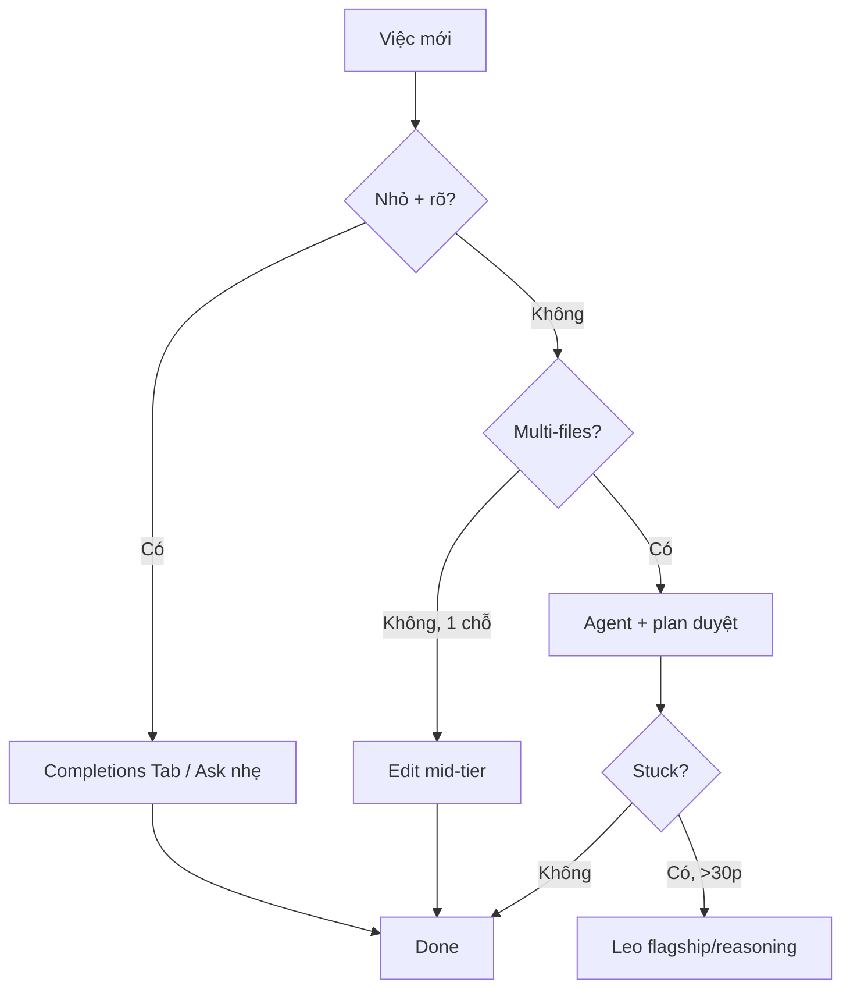

# Tips 08 — Tiết Kiệm Premium Requests: Dùng Copilot Rẻ Mà Vẫn Mạnh

> Copilot 2026 tính theo **AI Credits** (không phải premium requests cũ). Bài này dạy bạn model routing, phân biệt completions vs chat vs agent, prune MCP/extensions, dùng knowledge base để trả ít mà được nhiều.

## Mục lục

- [1. Vì sao tốn credits?](#1-vì-sao-tốn-credits)
- [2. Cơ chế: cái gì tốn credits?](#2-cơ-chế-cái-gì-tốn-credits)
- [3. Model routing: việc nào model nào?](#3-model-routing-việc-nào-model-nào)
- [4. Completions vs Chat vs Agent](#4-completions-vs-chat-vs-agent)
- [5. Prune MCP/extensions + chat gọn](#5-prune-mcpextensions--chat-gọn)
- [6. Knowledge base: trả 1 lần, dùng mãi](#6-knowledge-base-trả-1-lần-dùng-mãi)
- [7. Walkthrough theo phút: audit 1 tuần](#7-walkthrough-theo-phút-audit-1-tuần)
- [8. Bảng tra nhanh: tốn bao nhiêu?](#8-bảng-tra-nhanh-tốn-bao-nhiêu)
- [9. Pitfalls + cách fix](#9-pitfalls--cách-fix)
- [10. Bài tập cuối bài](#10-bài-tập-cuối-bài)
- [11. Tham khảo chéo](#11-tham-khảo-chéo)

---

## 0. Giải ngố thuật ngữ (1 câu + analogie + verify)

| Thuật ngữ | Hiểu nôm na | Analogie | Ví dụ kỹ thuật thật | Verify |
|---|---|---|---|---|
| **AI Credit** | Tiền lẻ trả theo lượt hỏi AI; 1 credit = 0,01 USD. | Như xu arcade: game xịn (model flagship) nuốt 5 xu, game thường (model nhẹ) 1 xu. | Agent 50 steps × flagship ×3 = 150 credits bốc hơi. | `# Verify:` Settings → Billing → Copilot usage xem % đã dùng. |
| **Model routing** | Việc nào xe đó: việc nhỏ xe đạp, việc lớn xe tải. | Như gọi Grab: đi chợ gọi xe máy, chuyển nhà gọi xe tải. | Hỏi vặt → model nhẹ; plan/refactor khó → flagship. | `# Verify:` cuối tuần flagship <30% tổng credits là đạt. |
| **Completions vs Chat vs Agent** | Gợi ý Tab (rẻ ~0) → hỏi (vừa) → tự làm nhiều bước (đắt). | Như gõ tắt (Tab) vs hỏi bạn (chat) vs thuê thợ (agent). | `function sum(` + Tab thay vì chat "viết hàm cộng". | `# Verify:` boilerplate Tab nhanh hơn chat 10x, tốn ~0 credit. |
| **Prune MCP** | Nhổ cây thừa cho vườn thoáng. | Như xóa app không dùng cho điện thoại nhẹ. | Giữ ≤6 MCP servers, tắt cái 2 tuần không dùng. | `# Verify:` mỗi turn nhẹ hơn, ít tool defs rác. |



Giải thích: Tab trước, Ask/Edit sau, Agent khi đáng, Coding Agent khi rảnh tay. 1 turn plan mạnh tránh 10 turns sửa sai (đáng tiền); hỏi vặt bằng Agent mạnh là đốt credits.

> ✅ **Kỳ vọng thấy gì:** sau routing 1 tuần, credits/tuần giảm 30–50% mà test xanh + review PASS giữ nguyên.

---

## 1. Vì sao tốn credits?

Ba cách đốt credits nhanh nhất:

- Mọi câu hỏi đều dùng model mạnh nhất + Agent mode, kể cả hỏi vặt.
- 1 chat nuôi 100 turns, mỗi turn gánh rác cũ → mỗi request đắt dần.
- Bật 12 MCP servers/extensions, mỗi request gánh tool defs không dùng.

Thực tế team:

```text
Truoc: 500 requests/tuan/nguoi, nua la hoi vat + retry code sai.
Sau routing + prune: 200 requests/tuan, chat luong tuong duong.
# Ky vong: co so 2 con so tren dashboard usage, xac nhan giam 60%.
```

> Rule: **việc rẻ thì dùng cách rẻ. Credits model mạnh để dành cho plan + implement khó.**

---

## 2. Cơ chế: cái gì tốn credits?

### Thang tốn (rẻ → đắt)

```text
[Rẻ] completions (gợi ý inline, Tab) → chat Ask → chat Edit → Agent → Coding Agent (cloud + CI)
# Ky vong: luon bat dau tu cot re, chi leo len khi cot truoc that luc.
```

- **Completions:** rẻ nhất, tính ít hoặc miễn phí theo gói. Gõ → gợi ý 3–5 dòng.
- **Chat Ask:** 1 request/chat turn, không sửa code.
- **Chat Edit/Agent:** 1 request + thêm tool calls (mỗi tool có thể tính thêm).
- **Coding Agent:** đắt nhất (requests + minutes + CI), nhưng làm bất đồng bộ.

### Công thức tốn

```text
Tổng = số turns × (prompt tokens + tools × overhead) × hệ số model
# Ky vong: giam duoc 1 trong 3 vi tri nen ton giam thuan tuyen.
```

Giảm 1 trong 3 là rẻ:

- Giảm turns: prompt tốt + plan-first (ít retry).
- Giảm tokens/turn: chat gọn + ít attachments + ít MCP.
- Giảm hệ số model: việc dễ dùng model nhẹ.

Xem chat gọn ở [Tips 01](./01-context-hygiene.md), prompt tốt ở [Tips 02](./02-prompt-engineering.md).

---

## 3. Model routing: việc nào model nào?

### Bảng routing gợi ý (điều chỉnh theo gói của bạn)

| Việc | Hiểu nôm na | Ví dụ cụ thể | Model | Mode | Vì sao |
|---|---|---|---|---|---|
| Gợi ý inline, boilerplate | Đánh vần hộ 3 chữ. | Gõ `function sum(` + Tab. | Nhẹ / auto | Completions | Rẻ, nhanh, đủ đúng |
| Giải thích hàm, hỏi docs | Hỏi đường đi chợ. | `retryWithBackoff` làm gì? 3 bullet. | Nhẹ | Ask | Không cần reasoning nặng |
| Fix 1 hàm rõ ràng | Vá 1 lỗ thủng. | Fix `normalizeEmail` crash dấu. | Trung bình | Edit | Đủ sức, ít tốn |
| Feature multi-files, refactor | Xây cả nhà. | Refactor auth 800 dòng 5 files. | Mạnh | Agent + plan | Đáng tiền, tránh retry |
| Review khó, kiến trúc | Thuê giám định. | Review PR payments HIGH bug. | Mạnh | Ask/Reviewer fresh | Cần reasoning tốt nhất |
| Việc nền độc lập 2 giờ | Giao khoán đi vắng. | Issue rate-limit 2h. | Coding Agent | Cloud | Đắt nhưng bạn làm việc khác |

### Before / After — đốt quota vs tiết kiệm

**Before (mọi việc Agent mạnh):**
```text
(Agent + flagship cho cả hỏi vặt) "@workspace thêm null-check giúp tôi" → quét cả repo
+ Mọi câu hỏi đều model mạnh nhất + 1 chat 100 turns + 12 MCP servers
```
> Kết quả: 500 requests/tuần, hết quota giữa tháng, 3 tuần cuối dùng model base hẻo. Mỗi request gánh 80K rác.

**After (routing rẻ mà mạnh):**
```text
Boi den 5 dong → Ctrl+I (Edit, model trung bình): "thêm null-check, giữ signature."
Hỏi vặt → chat Ask model nhẹ. Chỉ plan/refactor khó mới Agent mạnh + plan duyệt.
Completions Tab cho boilerplate. Prune MCP ≤6. 1 task 1 chat.
# Ky vong: dashboard usage tuan sau thap hon, chat luong (test/review) giu nguyen.
```
> Kết quả: 200 requests/tuần (−60%), chất lượng tương đương (test xanh + PASS giữ). Verify: Billing usage tuần sau giảm mà V3/V4 vẫn đạt.
> ✅ **Kỳ vọng thấy gì:** bảng routing dán wiki + default model nhẹ; completions Tab dùng trước khi chat.

### Ví dụ 1 — Đặt default nhẹ (copy-paste setup)

```text
VS Code → Settings → Copilot:
- Default chat model: nhẹ/auto (dùng hằng ngày).
- Chỉ chuyển sang mạnh khi: plan feature, refactor, review khó.
- Completions: luôn bật, Tab để nhận, Esc để bỏ.
# Ky vong: 80% chat hang ngay chay model nhe, chi thay khi that.
```

### Ví dụ 2 — Prompt tự chọn model (copy-paste)

```text
# Dau chat kho, ghi ro:
"Dùng model mạnh nhất của tôi cho task này (refactor auth 800 dòng).
Các câu hỏi phụ sau tôi sẽ mở chat khác model nhẹ."
# Ky vong: chi 1 lan xai model manh vao moi viec kho, ko lan ra hoi vat.
```

### Ví dụ 3 — Khi nào KHÔNG tiếc credits

```text
ĐÁNG tiền:
- 1 turn plan mạnh tránh 10 turns sửa sai.
- 1 review mạnh bắt được HIGH bug trước prod.
- Research repo lạ bằng model mạnh 1 lần rồi ghi file.

KHÔNG đáng:
- Hỏi vặt "hàm này là gì" bằng Agent mạnh.
- Retry lần 5 cho prompt ẩu (sửa prompt thay vì đốt tiếp).
- @workspace cả repo cho câu hỏi 1 file.
# Ky vong: 1 credit cho viec manh phai co 10 lan gia tri, nguoc lai la dot.
```

---

## 4. Completions vs Chat vs Agent

### Completions: Tab là vua

- Gõ tên hàm → Tab nhận gợi ý, không tốn chat turn.
- Viết test boilerplate, import, types → completions nhanh hơn chat 10×.

**Ví dụ 1 — Dùng completions thay chat (copy-paste thói quen):**

```text
Thay vì chat: "viết hàm cộng 2 số" (1 request)
Hãy gõ: `function sum(` → Tab → xong (rẻ).

Thay vì chat: "viết 10 test cases CRUD" (đắt)
Hãy gõ 1 case mẫu → Tab Tab Tab → sửa số liệu (rẻ).
# Ky vong: boi qua boi, khoi mo chat, credits gan bang 0.
```

### Chat: hỏi + sửa có kiểm soát

- Ask cho hỏi, Edit cho sửa 1 chỗ.
- Đừng dùng Agent cho việc Edit làm được.

**Ví dụ 2 — Chọn Chat thay vì Agent (copy-paste):**

```text
TỐT (Edit, rẻ): bôi đen 5 dòng → Ctrl+I → "thêm null-check, giữ signature."
TỆ (Agent, đắt): "@workspace thêm null-check giúp tôi" → quét cả repo.

TỐT (Ask, rẻ): "Giải thích #selection 3 bullet, không sửa."
TỆ (Agent, đắt): Agent đọc 20 files để giải thích 1 hàm.
# Ky vong: co chuon (nhe) thi dung chuon, co con dao (manh) thi dung con dao.
```

### Agent: chỉ khi đáng

- Multi-files, cần chạy test/lệnh, task >2 steps.
- Luôn kèm plan duyệt + scope hẹp để không đốt retry.

**Ví dụ 3 — Gate trước khi bật Agent (checklist):**

```text
- [ ] Có plan.md duyệt chưa? Chưa → Ask plan trước (rẻ hơn).
- [ ] Scope ≤5 files? Chưa → thu hẹp.
- [ ] Có verify + NEVER? Chưa → thêm vào prompt.
- [ ] Task <15 phút Edit xong? → đừng bật Agent.
# Ky vong: di qua het 4 o moi lan bat agent, tranh do credits vo von.
```

---

## 5. Prune MCP/extensions + chat gọn

### Audit extensions

**Ví dụ 1 — Prune checklist (copy-paste):**

```text
Mỗi tháng 1 lần:
1. Extensions → Copilot/MCP related: tắt cái 2 tuần không dùng.
2. MCP servers: giữ ≤6, tắt server không nhớ tác dụng.
3. Hỏi: thiếu thì bật lại, đừng bật sẵn "cho chắc".
# Ky vong: danhsach MCP co chi 6 ten, moi turn nhe hon that su.
```

### Chat gọn = rẻ

**Ví dụ 2 — 3 thói quen rẻ (copy-paste):**

```text
1. 1 task 1 chat, xong → New Chat (đừng nuôi 100 turns).
2. Ưu tiên #file/#selection, hạn chế @workspace cả repo.
3. Log dài → paste vào file, chat chính chỉ nhận summary 5 bullet.
# Ky vong: moi chat duoi 20 turns, co 1 lan new chat 1 lan task.
```

Chi tiết xem [Tips 01](./01-context-hygiene.md).

**Ví dụ 3 — Đo và so (copy-paste):**

```text
Tuần này ghi lại:
- Số chats, số turns/chat trung bình, số lần @workspace.
- Số retries vì prompt ẩu.
Tuần sau áp routing + prune, so 2 tuần: requests giảm? chất lượng giữ?
# Ky vong: 1 bang 3 cot (sotruoc/sau/truong), xem xuong la duoc.
```

---

## 6. Knowledge base: trả 1 lần, dùng mãi

Paste spec 200 dòng vào 20 chats = trả 20 lần.

Đưa vào knowledge base / instructions = trả 1 lần viết, dùng mãi.

**Ví dụ 1 — Knowledge base docs (copy-paste):**

```text
Repo → Settings → Copilot → Knowledge bases → New (docs/, wiki, ADRs).
Hỏi: `@payments-docs Chính sách refund 30 ngày? Kèm link nguồn, 3 bullet.`
→ Không cần paste spec, không cần @workspace quét code.
# Ky vong: tra 1 lan, dung mai, chi phi gan bang 0.
```

**Ví dụ 2 — Instructions thay paste (copy-paste):**

```markdown
# Thay vi paste 10 dong NEVER moi chat:
# Viet 1 lan vao .github/copilot-instructions.md:
- Không sửa src/generated/, không commit main, test xanh mới done.
# Moi chat tu ap, khoi go lai, khoi ton tokens nhac.
# Ky vong: ko co cai "nhac lai", moi chat tu dong biap luat.
```

**Ví dụ 3 — Prompt files thay gõ lại (copy-paste):**

```text
Thay vi go 15 dong prompt bug moi lan:
Luu `.github/skills/team-bug/SKILL.md` (chuan 2026, chay Local + Cloud) — hoac `.github/prompts/team-bug.prompt.md` (legacy, chi Local). Goi bang cach noi "fix bug" (skill tu load) hoac `/team-bug scope=... bug=...` (prompt legacy).
→ Prompt ngắn, output chuẩn, ít retry (retry cũng tốn credits).
# Ky vong: 1 ten lieu lai, output dong deu, retry giam, credits giam.
```

> Ghi chú (skill 2026 / prompt legacy): `.github/skills/<ten>/SKILL.md` là chuẩn 2026 (Agent Skills, chạy được cả local lẫn cloud coding agent); `.github/prompts/*.prompt.md` là format cũ (legacy), hiện chỉ chạy local — nên ưu tiên viết skill mới, giữ prompt cũ làm fallback.

Chi tiết xem [Tips 07](./07-thiet-ke-prompts-skills.md).

---

## 7. Walkthrough theo phút: audit 1 tuần

**Bối cảnh:** bạn thấy credits tăng vọt, không biết do đâu.

| Phút | Việc | Làm gì (copy-paste) |
|---|---|---|
| 0–5 | Xem usage | GitHub → Settings → Copilot → Usage: top ngày nào tốn? Model nào? Agent vs chat? |
| 5–15 | Phân loại | Ghi 10 turns gần nhất: mấy hỏi vặt bằng Agent? mấy retry vì prompt ẩu? mấy @workspace rộng? |
| 15–25 | Routing | Đặt default model nhẹ, completions ON, chỉ dùng mạnh cho plan/review/refactor. Viết bảng routing dán lên wiki |
| 25–35 | Prune | Tắt extensions/MCP thừa, bật tool approval, thu gọn instructions <200 dòng |
| 35–45 | Đóng gói | Lưu 2 prompt files/skills dùng nhiều nhất, tạo knowledge base cho docs hay paste |
| 45–50 | Đo lại | Tuần sau so credits/tuần + số retry + chất lượng (test xanh? review PASS?) |

> ✅ **Kỳ vọng thấy gì:** sau 50 phút audit, có bảng routing trên wiki + dashboard credits tuần sau thấp hơn 30–50% mà quality không tụt.

Mục tiêu: giảm 30–50% requests mà V3/V4 verify vẫn giữ (xem [Tips 04](./04-verification-done-that.md)).

---

## 8. Bảng tra nhanh: tốn bao nhiêu?

| Cách làm | Tốn tương đối | Khi dùng | Cách rẻ hơn |
|---|---|---|---|
| Completions Tab | ★☆☆☆☆ | Boilerplate, gợi ý dòng | Luôn ưu tiên trước |
| Chat Ask nhẹ | ★★☆☆☆ | Hỏi, giải thích | Dùng #selection, không @workspace |
| Chat Edit | ★★☆☆☆ | Fix 1 chỗ | Bôi đen hẹp, không Agent |
| Chat Agent | ★★★★☆ | Multi-files + test | Plan duyệt + scope hẹp + giới hạn 3 lần đỏ |
| Coding Agent cloud | ★★★★★ | Việc độc lập 1–2h | Chỉ khi spec rõ + done checklist |
| @workspace cả repo | +★★ | Explore | 1 lần rồi ghi file, sau đó đọc file |
| MCP 12 servers | +★★ | Mọi turn | Prune ≤6, tắt auto-approve write |
| Retry prompt ẩu ×5 | ×5 | — | Sửa prompt (scope+verify+NEVER) rồi mới retry |

> Quy tắc ngón tay: **Tab trước, Ask/Edit sau, Agent khi đáng, Coding Agent khi rảnh tay làm việc khác.**

---

## 9. Pitfalls + cách fix

| Pitfall | Triệu chứng | Fix |
|---|---|---|
| Mọi việc đều Agent mạnh | Hết quota giữa tháng | Routing mục 3, default nhẹ |
| Nuôi chat 100 turns | Mỗi request đắt dần | New chat mỗi task (Tips 01) |
| @workspace mọi câu | Tốn + chậm + lạc | #file/#selection, @workspace chỉ explore |
| Prompt ẩu → retry 5 lần | Đốt 5× cho 1 việc | Sửa prompt rồi retry, max 3 lần đỏ thì dừng |
| 12 MCP/extensions | Overhead mọi turn | Prune ≤6, audit monthly |
| Paste spec 20 lần | Trả 20 lần cho 1 nội dung | Knowledge base + instructions |
| Gõ lại prompt dài | Tốn + output khác nhau | Prompt files + /tên-file |
| Giao Coding Agent việc 15 phút | Đắt + chờ lâu | Edit local nhanh hơn |
| Tắt completions | Mọi việc đều thành chat | Bật completions, Tab trước khi chat |
| Không đo usage | Không biết tốn đâu | Xem usage weekly, audit 50 phút mục 7 |

---

## 10. Bài tập cuối bài

**Bài 1 (10 phút — phân loại việc):**

1. Liệt kê 10 lần dùng Copilot gần nhất.
2. Gắn mỗi lần 1 ô: completions / Ask / Edit / Agent / Coding Agent.
3. Đánh dấu: mấy lần dùng đắt hơn cần? Viết lại cách rẻ hơn.

**Bài 2 (20 phút — prune):**

1. Liệt kê MCP + extensions đang bật, tắt cái 2 tuần không dùng.
2. Rút gọn instructions <200 dòng, chuyển chi tiết sang applyTo files.
3. Đặt default model nhẹ, chỉ dùng mạnh cho plan/review.

**Bài 3 (15 phút — đóng gói 1 prompt):**

1. Lấy prompt dài bạn gõ >2 lần/tuần, lưu thành `.prompt.md`.
2. Tạo/đăng ký 1 knowledge base cho docs hay paste nhất.
3. Tuần sau so credits: giảm? retry giảm? chất lượng giữ?

> ✅ **Kỳ vọng đạt:** giảm 30–50% credits/tuần mà test xanh + review PASS không giảm.

---

## 11. Tham khảo chéo

- Bài tips liên quan:
  - [Tips 01](./01-context-hygiene.md) — chat gọn rẻ hơn 90%
  - [Tips 02](./02-prompt-engineering.md) — prompt tốt ít retry
  - [Tips 03](./03-plan-first-workflow.md) — 1 turn plan tránh 10 turns sai
  - [Tips 06](./06-policies-guardrails-recipes.md) — prune MCP + approval
  - [Tips 07](./07-thiet-ke-prompts-skills.md) — knowledge base + prompt files

- Bài hướng dẫn liên quan:
  - [00 — Tổng quan: AI Credits](../01-huong-dan-su-dung/00-tong-quan-copilot.md) — bảng giá + cách tính
  - [08 — MCP](../01-huong-dan-su-dung/08-mcp-ket-noi-cong-cu-ngoai.md) — prune ở đâu, giữ mấy servers
  - [17 — Agent Customizations Hub](../01-huong-dan-su-dung/17-agent-customizations-hub.md) — skill/agent M

> Mẹo 1 dòng: _việc rẻ thì dùng cách rẻ — Tab trước, Ask/Edit sau, Agent mạnh để dành cho plan khó._
