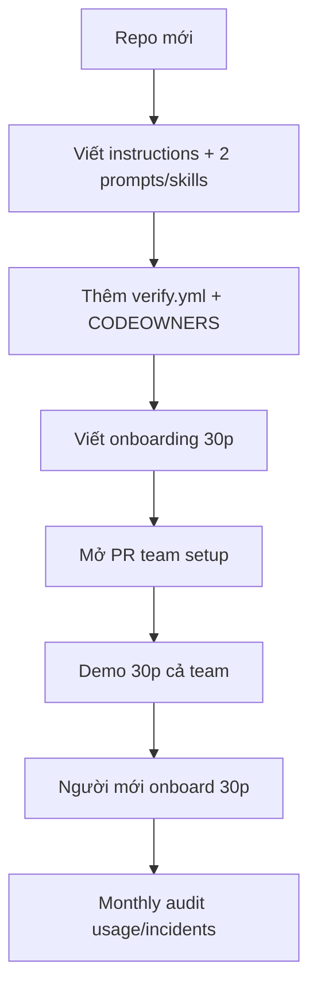

# Tips 09 — Teamwork Chuẩn Hóa: Cả Team Dùng Copilot Một Kiểu

> Copilot cá nhân nhanh, Copilot team mới mạnh. Bài này dạy bạn commit instructions/skills/prompts/agents vào repo, org policy, review workflow, và onboarding 30 phút cho người mới.

## Mục lục

- [1. Vì sao phải chuẩn hóa?](#1-vì-sao-phải-chuẩn-hóa)
- [2. Cơ chế: 4 tài sản commit vào repo](#2-cơ-chế-4-tài-sản-commit-vào-repo)
- [3. Commit instructions/skills/agents](#3-commit-instructionsskillsagents)
- [4. Org policy + branch protection](#4-org-policy--branch-protection)
- [5. Review workflow cho PR từ Copilot](#5-review-workflow-cho-pr-từ-copilot)
- [6. Onboarding 30 phút cho người mới](#6-onboarding-30-phút-cho-người-mới)
- [7. Walkthrough theo phút: chuẩn hóa 1 repo 60 phút](#7-walkthrough-theo-phút-chuẩn-hóa-1-repo-60-phút)
- [8. Bảng tra nhanh: ai giữ gì?](#8-bảng-tra-nhanh-ai-giữ-gì)
- [9. Pitfalls + cách fix](#9-pitfalls--cách-fix)
- [10. Bài tập cuối bài](#10-bài-tập-cuối-bài)
- [11. Tham khảo chéo](#11-tham-khảo-chéo)

---

## 0. Giải ngố thuật ngữ (1 câu + analogie + verify)

| Thuật ngữ | Hiểu nôm na | Analogie | Ví dụ kỹ thuật thật | Verify |
|---|---|---|---|---|
| **Chuẩn hóa team** | Cả đội đá 1 chiến thuật, không ai đá tự do. | Như quán phở: 5 chi nhánh cùng công thức, khách ăn đâu cũng giống. | `copilot-instructions.md + skills/ + prompts/ + verify.yml` commit vào repo. | `# Verify:` người mới clone là có, không setup miệng. |
| **CODEOWNERS** | Bảng phân công: đất ai người đó duyệt. | Như tổ trưởng: việc payments phải qua tổ payments ký. | `/src/payments/** @team-payments`. | `# Verify:` PR chạm payments tự tag đúng owner + SLA 24h. |
| **Review 3 lớp** | 3 cặp mắt: máy quét + bạn chấm + sếp chốt. | Như kiểm hàng: máy soi + nhân viên + quản lý. | Copilot review → `/team-review` fresh → người CODEOWNERS. | `# Verify:` PR merge có 2 reviews + CI xanh + Evidence logs. |
| **Onboarding 30 phút** | Học việc cấp tốc: 30 phút là làm được việc. | Như hướng dẫn xe mới: 30 phút là lái ra đường. | `docs/copilot-onboarding.md`: Ask 10p + Fix 10p + Plan 10p. | `# Verify:` người mới tự xong PR đầu không cần hỏi. |



Giải thích: luật nằm trong repo (không nằm trong đầu ai). Mọi đổi qua PR + lead review. Bắt đầu nhẹ (1 review + CI), chặt dần theo incidents.

> ✅ **Kỳ vọng thấy gì:** sau 60 phút (mục 7), repo có `.github/` + `verify.yml` + `CODEOWNERS` + `copilot-onboarding.md`; PR mới có Evidence logs.

---

## 1. Vì sao phải chuẩn hóa?

Không chuẩn hóa, team bạn sẽ:

- 5 người 5 kiểu prompt, output 5 kiểu, review mệt.
- Luật quan trọng nằm trong đầu 1 người, người mới không biết.
- Guardrails chỉ trên máy bạn, máy khác vẫn đi lạc.
- Người mới mất 2 tuần mò, hỏi ai cũng bận.

Chuẩn hóa xong:

```text
Nguoi moi vao → doc 1 README + chay 30 phut onboarding → dung Copilot dung kieu team.
Moi PR tu Copilot → cung format evidence + review checklist.
Luat doi → sua 1 file trong repo, ca team huong.
# Ky vong: 3 chuoi nay chay tu dong, ko can ai giet nhac.
```

> Rule: **cái gì team phải nhớ thì viết ra file và commit. Trí nhớ không phải hệ thống.**

---

## 2. Cơ chế: 4 tài sản commit vào repo

| Tài sản | Đường dẫn | Ai sửa | Review |
|---|---|---|---|
| Instructions | `.github/copilot-instructions.md` + `instructions/*.md` | Tech leads | PR + 1 lead |
| Agent Skills (2026) | `.github/skills/<ten>/SKILL.md` | Cả team đề xuất | PR + 1 reviewer |
| Prompt files (legacy) | `.github/prompts/*.prompt.md` | Cả team đề xuất | PR + 1 reviewer (Local only) |
| Custom agents | `.github/agents/*.md` hoặc `skills/*` | Leads + contributors | PR + test thử |
| Gates | `verify.yml`, `CODEOWNERS`, `pre-commit` | Leads / DevOps | PR + CI xanh |

Cấu trúc repo chuẩn:

```text
.github/
  copilot-instructions.md
  instructions/
    payments.instructions.md
    generated.instructions.md
  skills/
    team-bug/SKILL.md        # chuan 2026, chay Local + Cloud
    team-review/SKILL.md
  prompts/                   # legacy, chi Local
    team-bug.prompt.md
    research.prompt.md
    verify-feature.prompt.md
  agents/
    planner.md
    reviewer.md
  workflows/
    verify.yml
CODEOWNERS
CONTRIBUTING.md (co muc Copilot)
docs/
  copilot-onboarding.md (30 phut)
```

Tất cả commit vào git → clone repo là có, không cần setup miệng.

> ✅ **Kỳ vọng thấy gì:** `git clone` xong, mọi máy chạy Copilot đều có đủ bộ rules/skills/gates trên.

---

## 3. Commit instructions/skills/agents

### Ví dụ 1 — copilot-instructions.md team (copy-paste)

```markdown
# .github/copilot-instructions.md (team, <200 dòng)

## Stack + lệnh (bắt buộc nhớ)
- Node 20, TS strict, pnpm. Test: `npm test -- <scope>`.

## Luật team (front-load)
- Không sửa src/generated/, không commit main, không thêm dep chưa duyệt.
- Mọi PR phải có Evidence: test/lint/build logs + diff --stat.
- Task >2 steps → plan.md duyệt trước khi code.

## Chi tiết
- Payments: .github/instructions/payments.instructions.md
- Skills team: .github/skills/ (gọi "fix bug" / "review" tự load, hoặc /ten-skill)
- Onboarding: docs/copilot-onboarding.md
# Ky vong: moi chat mo ra duoc bao luat nay tu dong, chi ca ca 200 dong.
```

### Ví dụ 2 — Quy ước Agent Skills (chuẩn 2026) + prompt files (legacy)

```markdown
# .github/skills/README.md

| Skill | Khi dùng | Gọi |
|---|---|---|
| team-bug | Fix bug + regression | nói "fix bug" (tự load) hoặc /team-bug scope=... bug=... |
| team-review | Review trước merge | /team-review planFile=plan.md |
| research | Hiểu module lạ | /research glob=... outFile=... |
| verify-feature | Gate trước commit | /verify-feature scope=... |

## Thêm skill mới (chuẩn 2026)
1. Tạo `.github/skills/<ten>/SKILL.md` (metadata + nội dung).
2. Test trên task thật + 1 reviewer thử (local lẫn cloud agent).
3. PR với mô tả: khi nào dùng, ví dụ gọi, output mẫu.

## Prompt files (legacy, chỉ Local)
- `.github/prompts/*.prompt.md` vẫn chạy được trên Local Agent/Chat.
- Mới viết thì ưu tiên skill; prompt cũ giữ làm fallback, tag rõ "legacy".
```

> Ghi chú (skill 2026 / prompt legacy): chuẩn hiện hành là Agent Skills (`.github/skills/<ten>/SKILL.md`, chạy cả local + cloud coding agent). Prompt files (`.github/prompts/*.prompt.md`) là format cũ, 2026 chỉ còn chạy local — nên viết mới theo skill, không phải prompt file.

### Ví dụ 3 — Custom agents team (copy-paste)

```markdown
---
# .github/agents/planner.md
name: Planner
description: Lập plan, không code. Dùng khi task >2 steps.
tools: [search, read]
---
Bạn chỉ lập plan, không sửa code.
Output: files sửa/steps/risks/KHÔNG đụng/verify từng phase. Chờ duyệt.
```

```markdown
---
# .github/agents/reviewer.md
name: Reviewer
description: Review adversarial, verdict PASS/NEEDS-FIX.
tools: [search, read]
---
Finding = bug/correctness/security/test-gap. Bỏ qua style.
Output: [SEVERITY] file:line + verdict + 3 gaps ưu tiên.
# Ky vong: 2 agent nay luon chi doc, khong sua code, de an toan.
```

Versioning:

- Mọi thay đổi qua PR, mô tả lý do + ví dụ trước/sau.
- Tag `skills-v1.2` khi release để rollback nhanh.

---

## 4. Org policy + branch protection

### Ví dụ 1 — Org Copilot policy (copy-paste checklist)

```text
GitHub Org → Settings → Copilot → Policies:
- [ ] Coding Agent chỉ trên repo có verify.yml mẫu
- [ ] Chặn suggest cho *.pem, .env, secrets/
- [ ] Knowledge bases dùng chung: org-docs (ADRs, API specs)
- [ ] Mọi thay đổi instructions/skills/prompts phải qua PR + lead review
- [ ] Monthly audit: usage + MCP + incidents từ Copilot
# Ky vong: 5 o xanh thay, co bang loai "repo nao duoc giao Coding Agent".
```

### Ví dụ 2 — Branch protection team (copy-paste)

```text
Repo → Settings → Branches → main:
- Require PR + 1 review (CODEOWNERS cho scope nhạy cảm)
- Require checks: test / lint / build (verify.yml)
- Require Copilot code review PASS
- Block force push, dismiss stale reviews
# Ky vong: PR khong co 2 review + CI xanh khong merge duoc.
```

### Ví dụ 3 — CODEOWNERS + CONTRIBUTING (copy-paste)

```text
# CODEOWNERS
/src/payments/** @team-payments
/src/auth/** @team-auth
/.github/copilot-instructions.md @tech-leads
/.github/skills/** @tech-leads
/.github/prompts/** @tech-leads
```

```markdown
<!-- CONTRIBUTING.md them muc -->
## Dung Copilot (bat buoc)
1. Task >2 steps → /research hoac @Planner lap plan, duyet moi code.
2. Moi PR tu Copilot phai co Evidence (test/lint/build logs).
3. Review checklist: scope dung? NEVER giu? diff --stat gon? Reviewer fresh PASS?
4. Khong commit thang main, khong sua generated/.
# Ky vong: moi nguoi xem CONTRIBUTING.md thi deu co day du, khoi nhac.
```

> ✅ **Kỳ vọng thấy gì:** protection + CODEOWNERS + CONTRIBUTING đã commit; PR mới tự động tag owner và chặn merge thiếu review.

---

## 5. Review workflow cho PR từ Copilot

### 3 lớp review

```text
Lớp 1 (tự động): Copilot code review quét mỗi PR → fix MED/LOW trước.
Lớp 2 (fresh): chat Reviewer với /team-review → verdict PASS mới nhờ người.
Lớp 3 (người): reviewer theo CODEOWNERS chốt, chịu trách nhiệm merge.
# Ky vong: 3 lop cay nhau, HIGH bug bi bat tai lop 1 hoac 2, khong den lop 3.
```

### Ví dụ 1 — Prompt nhờ review (copy-paste cho tác giả PR)

```text
PR #123 đã có Copilot review PASS + /team-review PASS.
Nhờ @teammate review lớp 3:
- Scope: src/payments/** (diff --stat trong mô tả)
- Evidence: test/lint/build logs trong mô tả
- Focus: logic refund >30 ngày, idempotency
- SLA: 24h, comment [SEVERITY] nếu finding
# Ky vong: nguoi review chi can doc "scope + evidence + focus", ko thay do lai.
```

### Ví dụ 2 — Checklist reviewer (copy-paste)

```text
- [ ] Diff chỉ chạm scope issue? Không lọt generated/schema?
- [ ] Test/lint/build logs xanh thật (mở CI run kiểm tra)?
- [ ] Regression test cho bug? API mới có test?
- [ ] /team-review verdict PASS? Copilot review có HIGH chưa fix?
- [ ] Plan.md (nếu có) khớp implement?
- [ ] Sẵn sàng chịu trách nhiệm khi merge? (người merge là người chịu)
# Ky vong: 6 o tick het, moi PR co "cham chuan", tranh lai xuong.
```

### Ví dụ 3 — PR mẫu từ Coding Agent (copy-paste mô tả)

```markdown
## Issue
Closes #101 — refund quá 30 ngày bị 500.

## Scope
- src/payments/refund.ts + test (diff --stat bên dưới).

## Evidence
- test: [paste 10 dòng cuối log xanh]
- lint: [paste log] / build: [paste log]
- CI run: [link]

## Reviews
- Copilot review: PASS (link)
- /team-review: PASS, 0 HIGH

## Checklist
- [ ] Không đụng generated/schema/main
- [ ] Người review lớp 3: @...
```

---

## 6. Onboarding 30 phút cho người mới

Tạo `docs/copilot-onboarding.md`:

**Ví dụ copy-paste lịch 30 phút:**

```markdown
# Onboarding Copilot 30 phút

## 0–5p: Setup
- Cài Copilot + Copilot Chat, login org, clone repo.
- Mở .github/copilot-instructions.md, đọc 5 phút.

## 5–15p: Hỏi (Ask)
- Prompt: `@workspace Chỉ trong src/payments/*.ts: flow refund 5 bullet + file:line. Không sửa.`
- Mục tiêu: biết gắn scope hẹp, đọc output file:line.

## 15–25p: Fix (Edit + verify)
- Prompt: "fix bug" (skill team-bug tự load) với scope=src/cart bugDescription="test voucher 0đ"
- Chạy test, dán log, tick checklist done.
- Mục tiêu: biết verify + NEVER.

## 25–30p: Plan + review
- Prompt: "research" (skill /research glob=src/auth/* outFile=docs/research-auth.md)
- Prompt: /team-review planFile=plan.md trên PR mẫu.
- Mục tiêu: biết plan-first + review gate.

## Xong: checklist
- [ ] Biết gọi 4 skills/prompts team
- [ ] Biết new chat mỗi task, #selection vs @workspace
- [ ] Biết Evidence + review 3 lớp trước khi nhờ merge
```

> ✅ **Kỳ vọng thấy gì:** người mới chạy xong 30 phút, tự mở được PR đầu có log xanh, không cần ai chỉ tay.

Buddy:

- Ngày 1: buddy review 2 PR đầu của người mới (so prompt + evidence).
- Tuần 1: người mới đề xuất 1 cải tiến skills/prompts (tạo PR).

---

## 7. Walkthrough theo phút: chuẩn hóa 1 repo 60 phút

**Bối cảnh:** repo 5 người, mỗi người một kiểu, chưa có file team nào.

| Phút | Việc | Làm gì (copy-paste) |
|---|---|---|
| 0–10 | Instructions | Viết `.github/copilot-instructions.md` <200 dòng (ví dụ 1 mục 3) |
| 10–20 | Scoped | Tách 2 `*.instructions.md` cho 2 modules hay sai nhất |
| 20–35 | Skills/Prompts | Lưu `team-bug` + `team-review` theo chuẩn 2026 (skill), README index; giữ prompt cũ trong `prompts/` nếu còn dùng |
| 35–45 | Gates | Thêm `verify.yml` + CODEOWNERS + branch protection (Tips 06) |
| 45–55 | Onboarding | Viết `docs/copilot-onboarding.md` 30 phút (mục 6) |
| 55–60 | Share | Mở PR `chore: copilot team setup`, tag cả team, hẹn 30p demo |

> ✅ **Kỳ vọng thấy gì:** sau 60 phút, repo có đầy đủ `.github/` + gates + onboarding; tuần sau đo được "PR có evidence? review SLA?".

---

## 8. Bảng tra nhanh: ai giữ gì?

| Việc | Hiểu nôm na | Ví dụ | Ai | Ở đâu | Khi nào sửa |
|---|---|---|---|---|---|
| Luật chung | Hiến pháp cả nước. | Cấm sửa `generated/` mọi lúc. | Tech leads | copilot-instructions.md | Luật lặp lại >2 lần |
| Luật module | Luật làng. | Riêng `payments/` cần idempotency-key. | Owner module | *.instructions.md | Module đổi convention |
| Skills team | Đơn mẫu cả xã dùng. | Skill `team-bug` fix + regression. | Cả team PR | .github/skills/ | Skill dùng >2 lần/tuần |
| Agents/skills | Tổ chuyên môn. | Agent `reviewer` chỉ đọc. | Leads + contributors | agents/ skills/ | Procedure >5 bước |
| CI/gates | Cổng làng + camera. | `verify.yml` test/lint/build. | DevOps/leads | verify.yml, protection | Thêm check mới |
| Knowledge base | Thư viện làng. | `org-docs` ADRs + API specs. | Tech writers/leads | Org knowledge | Docs/spec đổi |
| Onboarding | Trường làng 30 phút. | `copilot-onboarding.md` Ask/Fix/Plan. | Buddy + leads | docs/copilot-onboarding.md | Người mới feedback |
| Usage/incidents | Sổ họp làng hàng tháng. | Report credits + retry + SLA. | Leads monthly | Wiki report | Monthly audit |

> Quy tắc ngón tay: **ai đau nhất vì thiếu luật thì người đó đề xuất PR, lead duyệt.**

### Before / After — mạnh ai nấy đá vs chuẩn hóa

**Before (mỗi người 1 kiểu):**
```text
An prompt: "fix giúp" — Bình prompt: "sửa code" — Chi không dùng skills.
Luat "dung dung generated/" nam trong dau An. Guardrails chi may An co.
Nguoi moi hoi 2 tuan, PR 5 kieu, review cai nhau vi khong co Evidence chuan.
```
> Kết quả: review mệt, incident 1 lần/tuần (sửa generated/commit main), onboard 2 tuần.

**After (chuẩn hóa 60 phút):**
```text
Moi nguoi goi: "fix bug" (skill team-bug) scope=... → cung format + Evidence.
Luat trong .github/copilot-instructions.md (<200 dòng). Gates: verify.yml + CODEOWNERS + protection.
Nguoi moi doc docs/copilot-onboarding.md 30 phut → PR dau co log xanh.
# Ky vong: "cung mot kieu" chay tu dong, khong can nhac.
```
> Kết quả: 100% PR có Evidence, onboard 30 phút, incident ~0. Verify: `git log -- .github/` thấy luật đổi qua PR + review.
> ✅ **Kỳ vọng thấy gì:** PR mẫu có `## Evidence` + 2 reviews (bot + người) + CI xanh.

---

## 9. Pitfalls + cách fix

| Pitfall | Triệu chứng | Fix |
|---|---|---|
| Chỉ 1 người giữ files | Người đó nghỉ là loạn | CODEOWNERS + backup, PR ai cũng đề xuất được |
| Instructions 600 dòng | Không ai đọc | <200 dòng + link chi tiết, onboarding 5p đọc xong |
| 10 prompts trùng nhau | Không biết dùng cái nào | Gộp, mỗi task 1 skill/prompt + README index |
| Gates quá chặt ngày đầu | Team bypass --no-verify | Bắt đầu nhẹ, chặt dần, đo incidents |
| Không onboarding | Người mới hỏi vặt 2 tuần | docs 30 phút + buddy 2 PR đầu |
| Không đo usage | Không biết chuẩn hóa có ích không | Monthly: credits, retry, incidents, SLA review |
| Knowledge base cũ | Copilot trả lời theo spec cũ | Owner + ngày review mỗi quarter |
| Review qua loa | PR Copilot lọt bug | Checklist mục 5 + ai merge người chịu |
| Sửa skills không PR | Mỗi máy một bản | Bắt buộc PR + CI + 1 review cho .github/** |

---

## 10. Bài tập cuối bài

**Bài 1 (20 phút — audit team):**

1. Hỏi 3 đồng nghiệp: prompt/skill Copilot hay dùng nhất là gì? Luật nào hay quên nhất?
2. Ghi top 3 prompt + top 3 luật → đó là 6 files đầu tiên cần đóng gói.
3. So với cấu trúc mục 2: repo bạn thiếu gì nhất?

**Bài 2 (30 phút — PR team setup đầu tiên):**

1. Tạo PR với: copilot-instructions.md gọn + 1 skill file (chuẩn 2026) + verify.yml.
2. Nhờ 1 đồng nghiệp dùng thử + review.
3. Merge xong, thông báo team: từ nay dùng /tên-skill + Evidence.

**Bài 3 (30 phút — chạy onboarding thử):**

1. Nhờ 1 người (mới hoặc khác team) chạy `docs/copilot-onboarding.md` 30 phút.
2. Quan sát: bước nào kẹt? Skill nào khó hiểu?
3. Sửa docs + skills theo feedback, ghi lại thời gian tới PR đầu tiên.

> ✅ **Kỳ vọng đạt:** sau 1 tháng, 100% PR từ Copilot có Evidence, người mới tự onboard 30 phút không cần hỏi.

---

## 11. Tham khảo chéo

- Bài tips liên quan:
  - [Tips 06](./06-policies-guardrails-recipes.md) — guardrails recipes
  - [Tips 07](./07-thiet-ke-prompts-skills.md) — thiết kế skills (chuẩn 2026)
  - [Tips 04](./04-verification-done-that.md) — review gate + Evidence
  - [Tips 08](./08-tiet-kiem-premium-requests.md) — usage + routing cho team
  - [Tips 03](./03-plan-first-workflow.md) — plan-first cho mọi task lớn

- Bài hướng dẫn liên quan:
  - [03 — Instructions + memory + rules](../01-huong-dan-su-dung/03-instructions-memory-rules.md) — viết instructions
  - [17 — Agent Customizations Hub](../01-huong-dan-su-dung/17-agent-customizations-hub.md) — hub skill/agent/MCP 2026

> Mẹo 1 dòng: _team mạnh khi luật nằm trong repo, không nằm trong đầu ai — commit hết, onboarding 30 phút._
