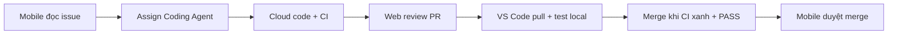

# Tips 11 — Nâng Cao: Copilot CLI, Web, Coding Agent, Mobile & Voice

> VS Code chỉ là 1 mặt của Copilot 2026. Bài này mở 4 mặt còn lại: Copilot CLI trong terminal (2 thứ: `gh copilot` và `copilot`), github.com chat, Coding Agent assign issue, và mobile/github.dev/voice khi xa máy — kèm recipes leo thang.

## Mục lục

- [1. Vì sao phải ra khỏi VS Code?](#1-vì-sao-phải-ra-khỏi-vs-code)
- [2. Cơ chế: 5 mặt của Copilot 2026](#2-cơ-chế-5-mặt-của-copilot-2026)
- [3. CLI trong terminal: gh copilot + copilot (2 CLI khác nhau)](#3-cli-trong-terminal-gh-copilot--copilot-2-cli-khác-nhau)
- [4. github.com chat + Coding Agent](#4-githubcom-chat--coding-agent)
- [5. Mobile, github.dev & voice](#5-mobile-githubdev--voice)
- [6. Leo thang đa mặt trận](#6-leo-thang-đa-mặt-trận)
- [7. Walkthrough theo phút: từ issue tới PR khi đang đi đường](#7-walkthrough-theo-phút-từ-issue-tới-pr-khi-đang-đi-đường)
- [8. Bảng tra nhanh: ở đâu làm gì?](#8-bảng-tra-nhanh-ở-đâu-làm-gì)
- [9. Pitfalls + cách fix](#9-pitfalls--cách-fix)
- [10. Bài tập cuối bài](#10-bài-tập-cuối-bài)
- [11. Tham khảo chéo](#11-tham-khảo-chéo)

---

## 0. Giải ngố thuật ngữ (1 câu + analogie + verify)

| Thuật ngữ | Hiểu nôm na | Analogie | Ví dụ kỹ thuật thật | Verify |
|---|---|---|---|---|
| **Copilot CLI (2 thứ)** | Terminal có 2 trợ lý: `gh copilot` hỏi lệnh shell; `copilot` agent chạy task cả đoạn. | Như 2 lơ xe: 1 chỉ đường (gh), 1 lái cả chuyến (copilot). | `gh copilot suggest "tìm 5 files lớn"` vs `copilot --plan "refactor auth"`. | `# Verify:` `gh copilot --version` + `copilot --help` mỗi cái chạy được. |
| **Web chat (`@copilot`)** | Hỏi Copilot ngay trên github.com (issue/PR). | Như hỏi thủ kho ngay tại kệ hàng, khỏi về văn phòng. | `@copilot Review diff PR này vs issue #101, [SEVERITY] file:line`. | `# Verify:` PR hiện comment review + verdict PASS/NEEDS-FIX. |
| **Coding Agent** | Robot cloud nhận issue → branch `copilot/*` → PR draft. | Như giao khoán cho thợ remote: sáng giao, chiều nhận hàng. | Issue có scope + done → Assign Copilot → 2h sau PR draft + CI. | `# Verify:` `gh pr list --author "app/copilot"` + branch `copilot/issue-123`. |
| **github.dev / Mobile / Voice** | VS Code trên web / app điện thoại / ra lệnh bằng miệng. | Như điều khiển từ xa: ở quán cà phê vẫn giao việc + duyệt. | Mobile assign issue; `github.dev/org/repo` fix typo; voice "tóm tắt 3 tasks P1". | `# Verify:` về máy pull branch agent, test local xanh mới merge. |



Giải thích: xa máy thì giao + duyệt nhẹ; ngồi máy thì code sâu + verify nặng (test/lint/build local + Reviewer fresh). Spec mờ thì chưa giao; task 15 phút thì Edit local nhanh hơn.

> ✅ **Kỳ vọng thấy gì:** `gh copilot --version` xanh; issue assign xong hiện branch `copilot/*` + PR draft + comment tiến độ agent.

---

## 1. Vì sao phải ra khỏi VS Code?

VS Code tuyệt vời khi bạn ngồi máy, nhưng:

- Bạn đang đi đường, sếp báo prod đỏ → cần xem issue + giao Coding Agent từ điện thoại.
- Bạn review PR trên github.com → muốn hỏi `@copilot` ngay trong PR, không cần pull về.
- Bạn sống trong terminal (ssh, server) → muốn CLI gợi ý lệnh + giải thích lỗi ngay.
- Bạn họp, tay bận → muốn voice ra lệnh, Copilot tóm tắt + tạo issue.

Mỗi mặt có sức mạnh riêng. Biết cả 5, bạn làm việc mọi lúc mà vẫn giữ guardrails.

> Rule: **nặng thì VS Code Agent, nhanh thì CLI/web, xa máy thì mobile + Coding Agent cloud.**

---

## 2. Cơ chế: 5 mặt của Copilot 2026

| Mặt | Ở đâu | Mạnh nhất | Yếu nhất |
|---|---|---|---|
| VS Code | Desktop IDE | Edit/Agent multi-files, debug sâu | Phải ngồi máy |
| CLI | Terminal (`gh copilot` + `copilot`) | `gh copilot`: gợi ý/explain lệnh shell. `copilot`: agent 3 chế độ Interactive/Plan/Autopilot | Không thay VS Code debug sâu |
| Web (github.com) | Repo/issues/PRs | Hỏi code, review PR, assign agent | Không chạy local |
| Coding Agent | Cloud sessions | Làm 1–2h bất đồng bộ, mở PR | Đắt, cần spec rõ |
| Mobile/dev/voice | App, github.dev, voice | Xem, giao việc, duyệt nhanh | Không code nặng |

Sơ đồ leo thang:

```text
[Mobile: đọc issue, giao agent] → [Cloud: agent code + CI] → [Web: review PR]
→ [VS Code/CLI: fix nhỏ + verify local] → [Mobile: duyệt merge]
# Ky vong: mot vong tron 5 mat, khong can oi laptop ca vong.
```

Bạn không cần ngồi máy cả vòng.

---

## 3. CLI trong terminal: `gh copilot` + `copilot` (2 CLI khác nhau)

> **2 CLI khác nhau, đừng nhầm:**
> - `gh copilot` (gh extension) — trợ lý lệnh shell: `suggest`/`explain`, không sửa code, trả lời tức thì.
> - `copilot` (Copilot CLI, binary riêng) — agent chạy cả task trong terminal, 3 chế độ (bài 10 mục 3.2 trong docs agent modes).

### 3.1. `gh copilot` — hỏi lệnh, giải thích lỗi (copy-paste)

```bash
gh extension install github/gh-copilot
gh copilot --help
# Ky vong: gh copilot --version in ra version, chan duoc 3 vi du duoi.
```

**Ví dụ 1 — Gợi ý lệnh:**

```bash
gh copilot suggest "tìm 5 files TS lớn nhất trong src, sắp xếp giảm dần"
# → gợi ý: find src -name "*.ts" -exec wc -l {} + | sort -rn | head -5
# Chon: Run / Revise / Cancel
# Ky vong: co lenh shell copy-paste chay duoc, de run thi check truoc.
```

**Ví dụ 2 — Giải thích lỗi:**

```bash
npm test -- payments 2>&1 | tail -30
gh copilot explain "TypeError normalizeEmail ở src/auth/login.ts:42"
# → 3 bullet nguyên nhân + gợi ý fix 1 file
# Ky vong: 3 bullet co file:line, biét lieu chi dua den.
```

**Ví dụ 3 — Script nhanh:**

```bash
gh copilot suggest "viết script bash chạy npm test cho từng package, dừng khi đỏ"
# → Duyệt script, lưu vào scripts/test-all.sh, chmod +x, chạy thử.
# Cam: chay script xoa/force khi chua doc ky.
# Ky vong: script dau co guard (dung khi do), doc rat moi chay.
```

Mẹo CLI:

- Mọi gợi ý nguy hiểm (`rm`, `reset --hard`, `push --force`) → Revise/Cancel, không Run mù.
- Kết hợp với worktrees ([Tips 05](./05-parallel-agents.md)) để test CLI không bẩn main.
- Alias hay dùng:

```bash
alias gcs='gh copilot suggest'
alias gce='gh copilot explain'
```

### 3.2. `copilot` — CLI đầy đủ: chế độ agent (Copilot CLI — khác `gh copilot`)

Đây là binary riêng, chạy agent cả task trong terminal (không phải gh extension):

```bash
# Cai + chay agent trong terminal (Copilot CLI, khong phai gh extension):
copilot "fix test failing ở packages/api, chỉ 2 files"   # Interactive: hoi tung tool (Shift+Tab de xoay che do)
copilot --plan "refactor module auth"                    # Plan truoc, duyet roi moi code
copilot --mode autopilot "tạo 3 unit test cho login.ts"  # Tu chay toi xong (coc sandbox)
Shift+Tab xoay standard → plan → autopilot; /goal "objective" --max-ai-credits N (cap chi phi)
# Ky vong: 3 che do lam viec trong terminal, duoc cap credits, khong lan ra file khac.
```

Khi nào dùng cái nào:

| Việc | Dùng |
|---|---|
| Quên lệnh shell, explain lỗi tức thì | `gh copilot suggest/explain` |
| Task 1–2h, agent tự chạy cả đoạn | `copilot --plan` hoặc `--mode autopilot` |
| Chỉ Edit 1–2 files, muốn duyệt từng tool | `copilot "task"` (Interactive) |

> ✅ **Kỳ vọng thấy gì:** `copilot --help` liệt kê 3 chế độ; chạy 1 task plan → duyệt plan → code → verify local.

---

## 4. github.com chat + Coding Agent

### Hỏi ngay trên web

Trên bất kỳ repo/issue/PR nào, bấm Copilot chat (góc phải) hoặc gõ `@copilot` trong comment.

**Ví dụ 1 — Hỏi code trên web (copy-paste):**

```text
@copilot Trong PR này, flow refund thay đổi gì so với main?
Tra ve 5 bullet + file:line + 2 ru loi lon nhat.
# Ky vong: 5 bullet co file:line, co thong tin moi di xem diff.
```

**Ví dụ 2 — Review PR trên web (copy-paste):**

```text
@copilot Review diff PR này với issue #101.
Finding = bug/correctness/security/test-gap, bo qua style.
[SEVERITY] file:line — mô tả — gợi ý fix. Verdict PASS/NEEDS-FIX.
# Ky vong: co verdict rang, danh sach finding theo SEVERITY.
```

### Assign Coding Agent cho issue

**Ví dụ 3 — Issue để giao (copy-paste):**

```markdown
## Mục tiêu
Thêm POST /api/payments/refund theo docs/payment-spec.md section 3.

## Scope
- Chỉ src/payments/refund.ts + test.
- Không đụng src/generated/, schema.

## Done
- [ ] npm test -- payments xanh (log trong PR)
- [ ] lint + build xanh
- [ ] PR draft + diff --stat chỉ chạm scope
# Ky vong: 3 don co du "moi thuc + rang gioi + xuan du", giao duoc.
```

Assign: Issue → Assignees → Copilot → nó tự tạo branch `copilot/issue-123` + PR draft + CI.

Theo dõi:

```text
- Agent comment tiến độ vào issue (đang đọc spec, đang code, đang chạy test).
- Test đỏ 3 lần → nó dừng, comment blocker, chờ bạn.
- Bạn review PR draft trên web, comment `@copilot sửa finding HIGH ở file X` → nó push tiếp.
# Ky vong: duoc hoi "dang lam gi" tai moi buoc, khong cay mu.
```

Khi nào giao / không giao:

```text
GIAO: spec rõ + scope 1 module + done checklist + việc 1–2h độc lập.
KHONG GIAO: spec mờ, đụng nhiều team, task 15 phút Edit xong.
```

Chi tiết plan-first ở [Tips 03](./03-plan-first-workflow.md), gates ở [Tips 06](./06-policies-guardrails-recipes.md).

---

## 5. Mobile, github.dev & voice

### Mobile (iOS/Android GitHub app)

- Đọc issue/PR, xem CI, duyệt merge.
- Giao Coding Agent: mở issue → Assign Copilot.
- Comment `@copilot` để hỏi/sửa nhỏ.

**Ví dụ 1 — Giao việc từ quán cà phê (copy-paste comment):**

```text
@copilot Implement issue này theo mô tả + plan.md trong branch plan/refund.
Chi sua src/payments/. Mo PR draft, dan log test xanh vao mo ta.
# Ky vong: moi comment giao co scope + done, agent moi PR thuc du.
```

### github.dev (VS Code trên trình duyệt)

- Mở `github.dev/<org>/<repo>` → VS Code nhẹ, có Copilot Chat.
- Sửa nhỏ, review, commit trực tiếp khi mượn máy.

**Ví dụ 2 — Fix typo từ máy mượn (copy-paste):**

```text
# Tren github.dev, boi den dong typo → Ctrl+I:
"Sua chinh ta, giu format. Khong dung logic."
# Commit thang branch fix-typo, mo PR, CI chay cloud.
# Ky vong: sua 1 dong, CI cloud chay xuan, co PR moi.
```

### Voice

- GitHub mobile / VS Code voice: nói → thành prompt text.
- Hợp nhất khi họp, tay bận, hoặc accessibility.

**Ví dụ 3 — Voice prompts (copy-paste câu nói):**

```text
Nói: "Copilot, tóm tắt 3 tasks P1 trong docs sprint 12 thành checklist,
moi dong ten cung done criteria, de toi giao viec."
Nói: "Tạo issue fix bug refund quá 30 ngày bị 500, scope payments, done là test xanh."
```

Mẹo voice: nói ngắn, 1 việc 1 lệnh, xong kiểm tra text trước khi gửi (voice hay nghe nhầm tên file).

---

## 6. Leo thang đa mặt trận

### Recipe A — Prod đỏ khi đang đi đường

```text
1. Mobile: đọc issue prod + CI log đỏ (5 phút).
2. Mobile: comment `@copilot` tóm tắt root cause giả thuyết 3 bullet (không fix vội nếu chưa rõ).
3. Nếu rõ + scope nhỏ: assign Coding Agent, nó mở PR draft.
4. Về tới máy: VS Code pull branch agent, chạy full test local, review fresh.
5. Web: merge khi CI xanh + review PASS.
# Ky vong: 5 buoc chay lan rac tren xe + ve may, prod du xanh.
```

### Recipe B — Review PR khi không có máy

```text
1. Web: đọc diff + Copilot review tự động.
2. Comment: `@copilot Review diff vs issue #X, [SEVERITY] file:line, PASS/NEEDS-FIX.`
3. Nếu NEEDS-FIX: `@copilot sửa 2 HIGH ở file A, B, push tiếp, dán log.`
4. Mobile duyệt merge khi CI xanh (branch protection đã bật).
# Ky vong: review xong khong can may, duyet duoc tren mobile.
```

### Recipe C — Terminal-first cho devops

```bash
# Tren server/ssh, khong co VS Code:
gh copilot suggest "backup DB trước migrate, ghi log ra /tmp/backup.log"
gh copilot explain "lỗi migrate ở step 3 trong /tmp/migrate.log"
# Migrate xong: gh pr create --draft, ve VS Code review ky.
# Ky vong: lenh + loi deu co tra loi, PR draft co, chi roi review.
```

---

## 7. Walkthrough theo phút: từ issue tới PR khi đang đi đường

**Bối cảnh:** 8h sáng trên xe, issue #123 bug refund, 10h bạn mới tới công ty.

| Phút | Ở đâu | Việc (copy-paste) |
|---|---|---|
| 0–5 | Mobile | Đọc issue #123 + spec link, xác nhận scope src/payments/**, done checklist rõ chưa? Nếu mờ → comment hỏi spec trước, chưa giao |
| 5–8 | Mobile | Assign Copilot cho #123: `"Implement theo mô tả, chỉ src/payments/, PR draft + log xanh."` |
| 8–40 | Cloud | Agent tự code + CI (bạn đi xe, nhận notification tiến độ) |
| 40–50 | Web (điện thoại) | Đọc PR draft: diff --stat đúng scope? log xanh? Copilot review PASS? Comment `@copilot sửa HIGH nếu có` |
| 50–70 | VS Code (tới cty) | Pull branch, chạy `npm test -- payments + lint + build` local, chat Reviewer fresh `/team-review` |
| 70–75 | Web | Merge khi V4 đủ (CI xanh + 2 reviews), đóng issue, comment cảm ơn + link PR |

> ✅ **Kỳ vọng thấy gì:** tổng bạn thao tác ~25 phút rải rác, agent làm 30 phút cloud; không cần ôm laptop trên xe; merge có đủ V4.

---

## 8. Bảng tra nhanh: ở đâu làm gì?

| Bạn đang ở | Hiểu nôm na | Ví dụ | Dùng | Làm được | Không nên |
|---|---|---|---|---|---|
| VS Code (ngồi máy) | Xưởng chính đủ đồ nghề. | Refactor 5 files + debug. | Agent/Edit | Code nặng, debug, test local | — |
| Terminal/ssh | Lơ xe đi cùng. | `find` 5 files lớn + explain lỗi. | gh copilot (gh ext) | Gợi ý lệnh, explain, script | Sửa multi-files phức tạp |
| Terminal (agent) | Thợ cả chuyến. | `copilot --plan "refactor auth"`. | copilot CLI | Task 1–2h, duyệt plan | Debug sâu hơn VS Code |
| github.com | Hỏi tại kệ hàng. | `@copilot review PR #123`. | Chat/@copilot | Hỏi code, review PR, giao agent | Chạy local, test nặng |
| Cloud | Thợ remote 2h. | Issue refund có criteria. | Coding Agent | Việc 1–2h độc lập, PR draft | Spec mờ, task 15 phút |
| Mobile | Điều khiển từ xa. | Trên xe assign #123. | App | Đọc, giao, duyệt nhanh | Code, review sâu |
| Máy mượn | Mượn bếp nấu mì. | Fix typo 1 dòng. | github.dev | Fix nhỏ, review | Setup nặng, secrets |
| Họp/tay bận | Sai vặt bằng miệng. | "Tạo issue refund 500". | Voice | Tóm tắt, tạo issue, giao việc | Prompt dài, tên file khó |

> Quy tắc ngón tay: **xa máy thì giao + duyệt, ngồi máy thì code + verify. Không cố code nặng trên điện thoại.**

### Before / After — ôm laptop trên xe vs giao cloud

**Before (ôm laptop + spec mờ):**
```text
Trên xe mở laptop, issue viết 1 dòng "fix refund", assign agent ngay, không scope, không done.
```
> Kết quả: 2h sau PR sai hướng, conflict scope, CI đỏ. Về công ty mất thêm 1h sửa + revert.

**After (mobile giao chuẩn + về máy verify):**
```text
Mobile (8h): doc issue #123, xac nhan scope src/payments/** + done checklist ro moi assign:
"@copilot Implement theo mô tả + plan.md, chỉ src/payments/, PR draft + log xanh."
Cloud (8h–10h): agent code + CI. Web (dien thoai): doc diff-stat + log + Copilot review.
VS Code (10h toi cty):
gh pr checkout 123 && npm test -- payments && npm run lint && npm run build
# Ky vong: 3 logs xuan + /team-review PASS moi merge.
```
> Kết quả: bạn thao tác ~25 phút rải rác, agent làm 30 phút cloud, merge V4 đủ. Verify: branch `copilot/issue-123` + PR draft + CI xanh.
> ✅ **Kỳ vọng thấy gì:** `gh copilot --version` + `gh pr list --author "app/copilot"` thấy PR; local 3 logs xanh.

---

## 9. Pitfalls + cách fix

| Pitfall | Triệu chứng | Fix |
|---|---|---|
| Giao agent khi spec mờ | PR sai hướng, mất 2h cloud | Chỉ giao khi có plan duyệt + done checklist |
| Review PR trên điện thoại qua loa | Lọt HIGH bug | Điện thoại chỉ duyệt khi Copilot + /team-review PASS, merge lớn để về máy |
| Chạy lệnh CLI mù | Mất data (rm, reset) | Revise trước khi Run, blocklist lệnh nguy hiểm |
| Nhầm `gh copilot` vs `copilot` | Gợi ý lỗi lại đi hỏi, agent lại chạy lệnh | 3.1 = gh ext (suggest/explain), 3.2 = copilot CLI (agent 3 chế độ) |
| Voice nghe nhầm tên file | Sửa nhầm file | Kiểm tra text sau voice, file quan trọng gõ tay |
| github.dev commit secret | Rò token trên máy mượn | Không mở .env trên máy lạ, dùng .env.example |
| 3 sessions cloud cùng scope | PRs conflict | Mỗi session 1 scope không giao (Tips 05) |
| Quên bật protection | Agent merge bừa | Require PR + checks + review (Tips 06) |
| Không theo dõi agent | Agent kẹt 2h không biết | Bật notification issue, check 30p/lần, dừng khi blocker |
| Dùng web cho task local nặng | Thiếu test local | Web để hỏi/review, VS Code để test/build cuối |

---

## 10. Bài tập cuối bài

**Bài 1 (15 phút — CLI 2 thứ):**

1. Cài `gh copilot`, chạy 3 lệnh: suggest 1 lệnh find, explain 1 lỗi cũ, suggest 1 script.
2. Tạo alias gcs/gce, ghi lại lệnh nào bạn sẽ dùng hàng ngày.
3. Thử `copilot --help` (Copilot CLI): chạy 1 task `copilot --plan` trên repo bạn.
4. Thử Revise 1 gợi ý nguy hiểm → Cancel thay vì Run.

**Bài 2 (20 phút — web + agent):**

1. Viết 1 issue theo mẫu mục 4 (mục tiêu + scope + done).
2. Hỏi `@copilot` 1 câu review trên PR cũ, so với review người.
3. Assign agent cho issue nhỏ, quan sát branch + PR draft + CI.

**Bài 3 (15 phút — xa máy):**

1. Trên điện thoại, đọc 1 issue + PR draft, thử comment `@copilot` hỏi 1 câu.
2. Mở github.dev repo bạn, sửa 1 typo bằng inline edit.
3. Thử 1 lệnh voice (tóm tắt hoặc tạo issue), kiểm tra text trước khi gửi.

> ✅ **Kỳ vọng đạt:** bạn làm được cả vòng issue→PR→merge mà không cần ngồi máy liên tục, guardrails vẫn giữ; phân biệt được `gh copilot` và `copilot`.

---

## 11. Tham khảo chéo

- Bài tips liên quan:
  - [Tips 03](./03-plan-first-workflow.md) — plan duyệt mới giao Coding Agent
  - [Tips 05](./05-parallel-agents.md) — multi Coding Agent sessions
  - [Tips 06](./06-policies-guardrails-recipes.md) — protection + approval cho cloud
  - [Tips 09](./09-teamwork-chuan-hoa.md) — review workflow + mobile duyệt
  - [Tips 10](./10-debugging-power-moves.md) — explain lỗi trên CLI/web

- Bài hướng dẫn liên quan:
  - [02 — Các bề mặt (CLI)](../01-huong-dan-su-dung/02-cac-be-mat-vscode-ide-web-cli.md) — cài đặt gh copilot
  - [12 — Copilot SDK/CI](../01-huong-dan-su-dung/12-copilot-sdk-ci-cd-automation.md) — assign issue tự động

> Mẹo 1 dòng: _ngồi máy thì code sâu, xa máy thì giao cloud + duyệt nhẹ — spec rõ mới giao, về máy mới merge._
