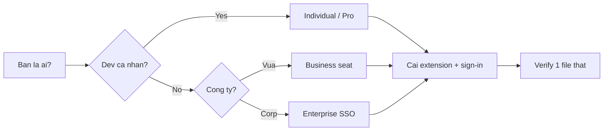

# FAQ 01 — Tài Khoản, Pricing & Cài Đặt

> Nhóm Tài khoản & Cài đặt · 10 câu hỏi deep-dive · Đọc xong tự chọn plan, xin seat, bật trial, cài sạch trong 10 phút

File này trả lời mọi câu hỏi "dùng Muse 2026 thì cần tài khoản gì, tốn bao nhiêu, cài sao cho sạch". Mỗi câu có giải thích + lệnh copy-paste + ví dụ + khi nào áp dụng.

---

## Sơ đồ tư duy nhanh (đọc 30 giây)



## Bảng tổng hợp: chọn đường vào nhanh

| Bạn là ai | Plan cần | Cài thế nào | Việc đầu tiên |
|---|---|---|---|
| Dev cá nhân | Individual ($10/tháng) hoặc Free | Extension VS Code / JetBrains / Neovim | Mở IDE → sign-in GitHub → check status bar |
| Dev Pro xài nhiều premium model | Pro ($39/tháng) | Extension + Copilot CLI | `gh copilot --help` test CLI |
| Dev công ty | Business ($19/user/tháng) seat do admin cấp | Extension, policy theo org | Xin admin assign seat, check policy |
| Team enterprise / compliance nặng | Enterprise (custom giá) | SSO/SAML + org policy + audit | Đọc SSO doc nội bộ, verify audit log |
| Muốn thử trước khi mua | Trial (Business 30 ngày / Individual free tier giới hạn) | Như plan tương ứng | Bật trial → set reminder trước ngày hết hạn |
| Repo mới tinh | Bất kỳ plan trên | Mở repo → copy `templates/` của tutorial này | Verify suggestions chạy trên 1 file thật |

---

## 1. Các plan Individual / Pro / Business / Enterprise khác nhau gì?

> **Hỏi ngắn gọn:** _Các plan Individual / Pro / Business / Enterprise khác nhau gì?_

**Trả lời 1 câu:** 

**Giải thích chi tiết + ví dụ:** GitHub chia 4 plan chính (giá 2026 có thể đổi, check `github.com/features/copilot` trước khi chốt):

- **Individual ($10/tháng):** 1 user, completions + chat cơ bản, giới hạn premium requests/tháng. Hợp dev cá nhân, side-project.
- **Pro ($39/tháng):** hạn mức premium requests cao hơn nhiều, ưu tiên model mới, dùng coding agent thoải mái hơn. Hợp dev dùng Copilot như pair-programmer full-time.
- **Business ($19/user/tháng):** thêm org management, policy control (content exclusion, model allowlist), audit cơ bản, IP indemnity. Seat do admin assign. Hợp công ty vừa.
- **Enterprise (giá custom):** thêm SSO/SAML bắt buộc, audit logs đầy đủ, data residency / ZDR tương đương, review & approve coding-agent PR, SLA. Hợp corp, bank, gov.

Điểm mấu chốt: **Individual/Pro = tự trả, tự quản; Business/Enterprise = admin quản, policy đè lên setting cá nhân.**

### Làm thế nào (steps copy-paste)

Copy từng bước theo thứ tự (dán vào terminal/IDE là chạy):

```bash
# Xem plan hiện tại của account (cần gh CLI đã login)
gh api user --jq '{login, plan: .plan.name}'
gh api /user/copilot_seat_details --jq . 2>/dev/null || echo "Chua co seat hoac API chua mo"
```

**Ví dụ cụ thể:** bạn trả Individual nhưng công ty mua Business. Khi join org, seat Business đè lên — policy org (VD chặn `*.pem`) thắng setting cá nhân của bạn.

> **Khi nào áp dụng:** luôn xác định plan NGAY từ đầu vì nó khóa quota (câu 2), policy (bài 05), và quyền riêng tư (bài 09).

> **Nếu vẫn lỗi thì...** thử theo thứ tự: (1) làm lại bước copy-paste với scope gọn hơn (1 file/selection), (2) đổi model (`/model`) rồi chạy lại, (3) tra “Vẫn lỗi thì sao?” cuối file này, (4) hỏi admin (policy/seat) hoặc mở issue với log + ảnh chụp lỗi.
---

## 2. Trial hoạt động thế nào, hết trial thì sao?

> **Hỏi ngắn gọn:** _Trial hoạt động thế nào, hết trial thì sao?_

**Trả lời 1 câu:** 

**Giải thích chi tiết + ví dụ:** GitHub thường cho 2 loại trial:

- **Individual free tier:** completions + chat giới hạn (VD 2.000 completions + 50 chat/tháng), không cần thẻ, hết quota thì chờ reset tháng sau.
- **Business trial (30 ngày):** full tính năng Business cho cả org, cần admin bật, hết 30 ngày tự chuyển sang trả phí nếu không hủy.

Hết trial: Individual free → suggestions dừng, chat báo quota; Business trial → org bị downgrade, seat mất, coding agent PR dở dang vẫn giữ nhưng không tạo mới được.

### Làm thế nào (steps copy-paste)

Copy từng bước theo thứ tự (dán vào terminal/IDE là chạy):

```bash
# Không có lệnh CLI xem trial; check trên web:
# https://github.com/settings/copilot -> xem "Trial ends on ..."
# Đặt reminder trước 3 ngày để quyết định mua/hủy
```

**Ví dụ cụ thể:** admin bật Business trial ngày 1/10 → set reminder 27/10 review: giữ thì add billing, không thì `Settings → Billing → Cancel trial` + export audit log trước khi mất.

> **Khi nào áp dụng:** trước khi onboarding team >5 người — luôn trial Business trước, đừng mua blind.

> **Nếu vẫn lỗi thì...** thử theo thứ tự: (1) làm lại bước copy-paste với scope gọn hơn (1 file/selection), (2) đổi model (`/model`) rồi chạy lại, (3) tra “Vẫn lỗi thì sao?” cuối file này, (4) hỏi admin (policy/seat) hoặc mở issue với log + ảnh chụp lỗi.
---

## 3. Seat là gì, admin assign / thu hồi seat thế nào?

> **Hỏi ngắn gọn:** _Seat là gì, admin assign / thu hồi seat thế nào?_

**Trả lời 1 câu:** 

**Giải thích chi tiết + ví dụ:** Seat = 1 ghế Copilot gắn với 1 GitHub user trong org. Org mua N seats → admin assign cho N người. Hết seat → người thứ N+1 thấy "No seat available" dù đã join org.

Admin quản seat ở `Org → Settings → Copilot → Access`. Có 2 chế độ: allow all members (tốn seat theo headcount) hoặc selected teams/users (tiết kiệm).

### Làm thế nào (steps copy-paste)

Copy từng bước theo thứ tự (dán vào terminal/IDE là chạy):

```bash
# Admin: xem ai đang giữ seat (cần org owner + gh CLI)
gh api orgs/<ORG>/copilot/billing/seats --jq '.seats[] | {login: .assignee.login, plan}'

# Admin: assign seat cho 1 team (via web UI hoặc API)
gh api -X POST orgs/<ORG>/copilot/billing/selected_teams \
  -f selected_teams='["team-slug"]'
```

**Ví dụ cụ thể:** org 50 dev nhưng chỉ mua 20 seats → tạo team `copilot-pilot` 20 người, assign seat cho team đó, còn lại chờ đợt 2.

> **Khi nào áp dụng:** khi có dev báo "Copilot đòi mua dù đã join org" — 90% là chưa được assign seat.

> **Nếu vẫn lỗi thì...** thử theo thứ tự: (1) làm lại bước copy-paste với scope gọn hơn (1 file/selection), (2) đổi model (`/model`) rồi chạy lại, (3) tra “Vẫn lỗi thì sao?” cuối file này, (4) hỏi admin (policy/seat) hoặc mở issue với log + ảnh chụp lỗi.
---

## 4. Cài đặt thế nào cho sạch: VS Code / JetBrains / Neovim / CLI?

> **Hỏi ngắn gọn:** _Cài đặt thế nào cho sạch: VS Code / JetBrains / Neovim / CLI?_

**Trả lời 1 câu:** 

**Giải thích chi tiết + ví dụ:** Chỉ giữ **1 extension Copilot + 1 Copilot Chat** mỗi IDE, đừng cài thêm fork "copilot-plus-plus" trôi nổi. Thứ tự khuyên dùng:

- **VS Code:** extension `GitHub Copilot` + `GitHub Copilot Chat` (chính chủ, update theo VS Code release).
- **JetBrains:** plugin `GitHub Copilot` từ Marketplace, login qua browser.
- **Neovim:** `github/copilot.vim` hoặc `zbirenbaum/copilot.lua`, auth bằng `:Copilot auth`.
- **CLI:** `gh extension install github/gh-copilot` → dùng `gh copilot suggest` / `gh copilot explain`.

### Làm thế nào (steps copy-paste)

Copy từng bước theo thứ tự (dán vào terminal/IDE là chạy):

```bash
# VS Code CLI: cài extension chính chủ
code --install-extension GitHub.copilot
code --install-extension GitHub.copilot-chat

# GitHub CLI + copilot extension
gh extension install github/gh-copilot
gh copilot --help

# Neovim (copilot.vim): trong nvim
# :Copilot setup  -> mở browser auth -> :Copilot status
```

**Ví dụ cụ thể:** máy mới → cài VS Code extensions + `gh` + `gh-copilot` là đủ 95% nhu cầu (IDE + terminal).

> **Khi nào áp dụng:** máy mới, hoặc khi suggestions chập chờn do cài 2 plugin đè nhau.

> **Nếu vẫn lỗi thì...** thử theo thứ tự: (1) làm lại bước copy-paste với scope gọn hơn (1 file/selection), (2) đổi model (`/model`) rồi chạy lại, (3) tra “Vẫn lỗi thì sao?” cuối file này, (4) hỏi admin (policy/seat) hoặc mở issue với log + ảnh chụp lỗi.
---

## 5. Sign-in / sign-out / đổi account (cá nhân ↔ công ty) thế nào?

> **Hỏi ngắn gọn:** _Sign-in / sign-out / đổi account (cá nhân ↔ công ty) thế nào?_

**Trả lời 1 câu:** 

**Giải thích chi tiết + ví dụ:** Copilot auth gắn với GitHub account đang login trong IDE. Lỗi kinh điển: máy công ty login nhầm account cá nhân → policy org không áp dụng, bill sai chỗ.

- **VS Code:** `Ctrl+Shift+P → "Sign out of GitHub"` rồi sign-in lại account đúng.
- **gh CLI:** `gh auth login` / `gh auth logout`, check bằng `gh auth status`.
- **JetBrains:** `Settings → GitHub → Remove account → Add lại`.

### Làm thế nào (steps copy-paste)

Copy từng bước theo thứ tự (dán vào terminal/IDE là chạy):

```bash
# Kiểm tra account đang dùng cho gh + copilot
gh auth status
gh api user --jq .login

# Đổi account: logout rồi login lại
gh auth logout
gh auth login --web -h github.com
```

**Ví dụ cụ thể:** freelancer có 2 account (cá nhân + client). Dùng `gh auth switch --user <login>` hoặc 2 VS Code profile riêng để khỏi lẫn seat/bill.

> **Khi nào áp dụng:** đầu mỗi máy mới, mỗi khi bill sai, và khi policy org "không ăn" (thường do sai account).

> **Nếu vẫn lỗi thì...** thử theo thứ tự: (1) làm lại bước copy-paste với scope gọn hơn (1 file/selection), (2) đổi model (`/model`) rồi chạy lại, (3) tra “Vẫn lỗi thì sao?” cuối file này, (4) hỏi admin (policy/seat) hoặc mở issue với log + ảnh chụp lỗi.
---

## 6. Policy của org đè lên setting cá nhân ra sao?

> **Hỏi ngắn gọn:** _Policy của org đè lên setting cá nhân ra sao?_

**Trả lời 1 câu:** 

**Giải thích chi tiết + ví dụ:** Với Business/Enterprise, admin set policy ở org level: model nào được dùng, có cho phép `*` exclusion, coding agent có chạy không... Policy org **luôn thắng** setting cá nhân — bạn bật trong IDE cũng bị ép tắt.

Triệu chứng: setting tự revert sau restart, model picker thiếu model, chat báo "disabled by your administrator".

### Làm thế nào (steps copy-paste)

Copy từng bước theo thứ tự (dán vào terminal/IDE là chạy):

```bash
# Không có lệnh xem policy từ client; check trên web:
# https://github.com/organizations/<ORG>/settings/copilot -> Policies tab
# Dev: nếu nghi bị policy đè, hỏi admin chụp màn hình Policies tab
```

**Ví dụ cụ thể:** bạn bật "Allow all models" nhưng picker chỉ hiện GPT, thiếu Claude — vì admin set model allowlist. Fix duy nhất: nhờ admin mở thêm.

> **Khi nào áp dụng:** mọi trường hợp "em bật rồi mà không có tác dụng" trong org Business/Enterprise. Chi tiết xem [bài 05](05-policies-guardrails-faq.md).

> **Nếu vẫn lỗi thì...** thử theo thứ tự: (1) làm lại bước copy-paste với scope gọn hơn (1 file/selection), (2) đổi model (`/model`) rồi chạy lại, (3) tra “Vẫn lỗi thì sao?” cuối file này, (4) hỏi admin (policy/seat) hoặc mở issue với log + ảnh chụp lỗi.
---

## 7. Lỗi cài đặt kinh điển: extension xung đột, version cũ, PATH thiếu `gh`?

> **Hỏi ngắn gọn:** _Lỗi cài đặt kinh điển: extension xung đột, version cũ, PATH thiếu `gh`?_

**Trả lời 1 câu:** 

**Giải thích chi tiết + ví dụ:** 3 lỗi gặp nhiều nhất:

1. **2 plugin Copilot đè nhau** (cũ `copilot` + fork) → gỡ hết, giữ 1 bản chính chủ.
2. **IDE quá cũ** → Copilot Chat yêu cầu VS Code ≥ bản N; update IDE trước.
3. **CLI thiếu `gh`** → `gh copilot` báo `command not found`; cài `gh` rồi mới add extension.

### Làm thế nào (steps copy-paste)

Copy từng bước theo thứ tự (dán vào terminal/IDE là chạy):

```bash
# VS Code: liệt kê extension copilot đang cài
code --list-extensions | grep -i copilot

# Gỡ bản lạ, giữ chính chủ
code --uninstall-extension <ten-la>
code --install-extension GitHub.copilot GitHub.copilot-chat

# Kiểm tra gh + copilot extension
gh --version && gh extension list | grep copilot
```

**Ví dụ cụ thể:** `code --list-extensions | grep -i copilot` ra 3 dòng (1 chính chủ + 2 fork) → gỡ 2 fork, reload IDE, suggestions chạy lại ngay.

> **Khi nào áp dụng:** khi suggestions/chat đột nhiên chết sau update IDE hoặc sau khi vọc extension.

> **Nếu vẫn lỗi thì...** thử theo thứ tự: (1) làm lại bước copy-paste với scope gọn hơn (1 file/selection), (2) đổi model (`/model`) rồi chạy lại, (3) tra “Vẫn lỗi thì sao?” cuối file này, (4) hỏi admin (policy/seat) hoặc mở issue với log + ảnh chụp lỗi.
---

## 8. Bắt đầu repo mới: 5 việc setup đầu repo là gì?

> **Hỏi ngắn gọn:** _Bắt đầu repo mới: 5 việc setup đầu repo là gì?_

**Trả lời 1 câu:** 

**Giải thích chi tiết + ví dụ:** Thứ tự chuẩn cho repo vừa clone / vừa tạo (làm 1 lần, hưởng cả dự án):

1. Mở repo trong IDE, verify Copilot suggestions chạy (gõ 1 hàm đơn giản).
2. Copy `.github/muse-instructions.md` từ `templates/` (bài này bước 9).
3. Thêm `.github/instructions/*.instructions.md` theo stack (backend/frontend...).
4. Thêm `.vscode/mcp.json` nếu cần data ngoài repo (DB, docs...).
5. Thêm `.vscode/settings.json` với content exclusion cho path nhạy cảm.

### Làm thế nào (steps copy-paste)

Copy từng bước theo thứ tự (dán vào terminal/IDE là chạy):

```bash
cd ~/code/my-repo && code .

# Trong IDE: gõ thử 1 hàm để verify suggestions
# def add(a, b):  -> chờ gợi ý xám -> Tab để nhận
```

```bash
# Copy khung templates (đứng ở root repo đích)
cp -r /path/to/tutorial-copilot/templates/.github ./
cp -r /path/to/tutorial-copilot/templates/.vscode ./
```

**Ví dụ repo trống:** chưa có code để Copilot học pattern → `muse-instructions.md` càng quan trọng (khai stack + conventions ngay từ đầu).

> **Khi nào áp dụng:** mọi repo chưa từng dùng Copilot. Team thì commit `.github/` + `.vscode/` để người sau khỏi setup lại.

> **Nếu vẫn lỗi thì...** thử theo thứ tự: (1) làm lại bước copy-paste với scope gọn hơn (1 file/selection), (2) đổi model (`/model`) rồi chạy lại, (3) tra “Vẫn lỗi thì sao?” cuối file này, (4) hỏi admin (policy/seat) hoặc mở issue với log + ảnh chụp lỗi.
---

## 9. Project mới tinh thì copy `templates/` thế nào?

> **Hỏi ngắn gọn:** _Project mới tinh thì copy `templates/` thế nào?_

**Trả lời 1 câu:** 

**Giải thích chi tiết + ví dụ:** Không như tool quét codebase, Copilot đọc instructions tĩnh — repo trống vẫn setup được full khung, chỉ cần sửa 20% cho khớp stack thật.

### Làm thế nào (steps copy-paste)

Copy từng bước theo thứ tự (dán vào terminal/IDE là chạy):

```bash
ls /path/to/tutorial-copilot/templates/
cp /path/to/tutorial-copilot/templates/.github/muse-instructions.md ./.github/muse-instructions.md
# Mở file, sửa: stack, lệnh test/lint/build, cấu trúc thư mục, quy ước branch
```

**Ví dụ cụ thể:** template ghi `npm test`; bạn dùng `pnpm` → sửa ngay dòng đó. Sai 1 dòng này, Copilot gợi ý sai lệnh cả tháng.

> **Khi nào áp dụng:** `git init` vừa xong, chưa có file nào. Sau khi code lên hình, bổ sung instructions theo path.

> **Nếu vẫn lỗi thì...** thử theo thứ tự: (1) làm lại bước copy-paste với scope gọn hơn (1 file/selection), (2) đổi model (`/model`) rồi chạy lại, (3) tra “Vẫn lỗi thì sao?” cuối file này, (4) hỏi admin (policy/seat) hoặc mở issue với log + ảnh chụp lỗi.
---

## 10. Báo lỗi / nhờ hỗ trợ từ GitHub thế nào?

> **Hỏi ngắn gọn:** _Báo lỗi / nhờ hỗ trợ từ GitHub thế nào?_

**Trả lời 1 câu:** 

**Giải thích chi tiết + ví dụ:** Kênh chính: `github.com/community` Discussions (Copilot category) hoặc Support ticket (Business/Enterprise). Report tốt = kèm 3 thứ: plan + IDE version + log.

### Làm thế nào (steps copy-paste)

Copy từng bước theo thứ tự (dán vào terminal/IDE là chạy):

```bash
# Thu thập info trước khi báo lỗi
gh --version
code --version
code --list-extensions | grep -i copilot
# VS Code: Output panel -> chọn "GitHub Copilot" -> copy đoạn lỗi
# + ghi rõ: plan (Individual/Business), file log: https://github.com/settings/copilot
```

**Ví dụ report chuẩn:**

```text
Tiêu đề: No suggestions in Python files after VS Code 1.9x update (Business seat)
Mô tả: suggestions dừng từ hôm update, JS vẫn có, Python không.
Kèm: extension versions + Output log đoạn lỗi + đã thử reload/re-login.
```

> **Khi nào áp dụng:** khi đã đi hết thứ tự debug ([bài 08](08-loi-thuong-gap-troubleshooting.md)) mà vẫn lỗi.

> **Nếu vẫn lỗi thì...** thử theo thứ tự: (1) làm lại bước copy-paste với scope gọn hơn (1 file/selection), (2) đổi model (`/model`) rồi chạy lại, (3) tra “Vẫn lỗi thì sao?” cuối file này, (4) hỏi admin (policy/seat) hoặc mở issue với log + ảnh chụp lỗi.
---

## Vẫn lỗi thì sao? (thứ tự debug chuẩn)

1. `gh auth status` — đúng account chưa, seat còn không.
2. `code --list-extensions | grep -i copilot` — chỉ còn bản chính chủ.
3. Update IDE + extension lên bản mới nhất.
4. Sign-out → sign-in lại GitHub trong IDE.
5. Check `github.com/settings/copilot` — quota/seat/policy có đỏ gì không.

```bash
gh auth status && gh --version && code --list-extensions | grep -i copilot
```

---

## Tham khảo chéo

- Bài tiếp theo: [02-model-context-premium.md](02-model-context-premium.md) (chọn model + giữ context), [bài 08](08-loi-thuong-gap-troubleshooting.md) (bảng lỗi full).
- Policy chi tiết: [bài 05](05-policies-guardrails-faq.md). Bảo mật: [bài 09](09-bao-mat-quyen-rieng-tu.md).
- Templates copy ngay: [../templates/README.md](../templates/README.md).

> Mẹo 1 dòng: _xác định plan trước, giữ đúng 1 extension chính chủ, và sai account là nguyên nhân của 50% lỗi "không chạy"._
