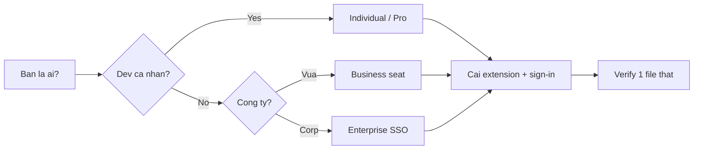

# FAQ 01 — Tài Khoản, Pricing & Cài Đặt

> **Dành cho:** dev cần chọn plan, xin seat, bật trial hoặc cài lại Copilot cho sạch — người mới lẫn người đã dùng.
> **Vấn đề:** "dùng GitHub Copilot 2026 thì cần tài khoản gì, tốn bao nhiêu, cài sao cho sạch" — trả lời theo 10 câu hỏi deep-dive.
> **Đọc xong:** tự chọn plan, xin seat, bật trial, cài sạch trong ~10 phút. **Thời gian:** ~10 phút đọc.

File này trả lời mọi câu hỏi "dùng GitHub Copilot 2026 thì cần tài khoản gì, tốn bao nhiêu, cài sao cho sạch". Mỗi câu có giải thích + lệnh copy-paste + ví dụ + khi nào áp dụng.

---

## Sơ đồ tư duy nhanh (đọc 30 giây)

Section này trả lời: bạn thuộc nhóm người nào → đi vào plan và đường cài nào cho đúng, không cần đọc cả bài.



## Bảng tổng hợp: chọn đường vào nhanh

Section này trả lời: bạn là ai → cần plan nào, cài thế nào, và việc đầu tiên phải làm là gì. Tra cứu nhanh, không cần đọc từ đầu.

| Bạn là ai | Plan cần | Cài thế nào | Việc đầu tiên |
|---|---|---|---|
| Dev cá nhân | Free ($0) hoặc Pro ($10/tháng) | Extension VS Code / JetBrains / Neovim | Mở IDE → sign-in GitHub → check status bar |
| Dev Pro xài nhiều model mạnh | Pro+ ($39/tháng) hoặc Max ($100/tháng) | Extension + Copilot CLI | `gh copilot --help` test CLI |
| Dev công ty | Business ($19/user/tháng) seat do admin cấp | Extension, policy theo org | Xin admin assign seat, check policy |
| Team enterprise / compliance nặng | Enterprise ($39/user/tháng) | SSO/SAML + org policy + audit | Đọc SSO doc nội bộ, verify audit log |
| Muốn thử trước khi mua | Trial (Business 30 ngày / plan Free giới hạn) | Như plan tương ứng | Bật trial → set reminder trước ngày hết hạn |
| Repo mới tinh | Bất kỳ plan trên | Mở repo → copy `templates/` của tutorial này | Verify suggestions chạy trên 1 file thật |

---

## 1. Các plan Individual / Pro / Business / Enterprise khác nhau gì?

Section này trả lời: các plan khác nhau ở đâu, giá và hạn mức Credits ra sao, và bạn nên chọn gói nào.

> **Hỏi ngắn gọn:** _Các plan Individual / Pro / Business / Enterprise khác nhau gì?_

**Trả lời 1 câu:** GitHub chia plan thành nhóm cá nhân Free / Pro / Pro+ / Max và nhóm tổ chức Business / Enterprise, tất cả đều dùng chung đơn vị thanh toán là AI Credits (1 credit = $0.01).

**Giải thích chi tiết + ví dụ:** Từ 01/06/2026 GitHub chuyển sang **usage-based billing** (tính tiền theo usage) — plan "Individual" cũ giờ gồm Free / Pro / Pro+ / Max. Giá tham khảo 10/2026 (check `github.com/features/copilot` trước khi chốt):

- **1 AI credit = $0.01 USD.** Chi phí mỗi lượt = giá mỗi token của model × số token, quy đổi ra credits.
- **Free ($0):** allowance credits (số cụ thể GitHub chưa công bố — cần verify), chỉ auto model selection, inline suggestions giới hạn 2.000 completions/tháng.
- **Student/Teacher ($0):** Free cho sinh viên/giáo viên, cần xác thực email trường.
- **Pro ($10/tháng):** 1.000 base + 500 flex = **1.500 credits**. Hợp dev cá nhân, side-project.
- **Pro+ ($39/tháng):** 3.900 + 3.100 = **7.000 credits**. Ưu tiên model mới, dùng coding agent thoải mái hơn.
- **Max ($100/tháng):** 10.000 + 10.000 = **20.000 credits**. Hợp dev dùng Copilot như pair-programmer full-time.
- **Business ($19/user/tháng):** 1.900 credits/seat/tháng, Credits **pooled cả org** (không chia cứng từng ghế). Thêm org management, policy control (content exclusion, model allowlist), audit cơ bản, IP indemnity (cần verify). Seat do admin assign. Hợp công ty vừa.
- **Enterprise ($39/user/tháng):** 3.900 credits/seat/tháng, pooled. Thêm SSO/SAML bắt buộc, audit logs đầy đủ, data residency / ZDR tương đương, review & approve coding-agent PR, SLA. Hợp corp, bank, gov.

Quy tắc tính tiền cần nhớ:

- **Code completions và next edit suggestions KHÔNG trừ AI Credits** — không giới hạn trên mọi plan trả phí.
- Plan trả phí dùng **auto model selection được giảm 10%** (Copilot Chat, CLI, Copilot app, cloud agent).
- Hết credits base + flex → dùng tiếp tính vào **additional usage budget** (spend cap cấu hình được). **Paid usage policy bật mặc định** — admin phải chủ động tắt để cắt chi tiêu.
- Hitting limit có thể xin owner/billing manager nâng budget (áp dụng Business/Enterprise dùng usage-based billing; GA 9/2026).
- Code review tốn thêm **GitHub Actions minutes** (không nằm trong ước tính credits).

Điểm mấu chốt: **Free/Pro/Pro+/Max = tự trả, tự quản; Business/Enterprise = admin quản, policy đè lên setting cá nhân.**

### Làm thế nào (steps copy-paste)

Copy từng bước theo thứ tự (dán vào terminal/IDE là chạy):

```bash
# Xem plan hiện tại của account (cần gh CLI đã login)
gh api user --jq '{login, plan: .plan.name}'
gh api /user/copilot_seat_details --jq . 2>/dev/null || echo "Chua co seat hoac API chua mo"
# Verify: kết quả cho thấy login + tên plan, không phải 404
```

**Ví dụ cụ thể:** bạn trả Pro nhưng công ty mua Business. Khi join org, seat Business đè lên — policy org (VD chặn `*.pem`) thắng setting cá nhân của bạn.

> **Khi nào áp dụng:** luôn xác định plan NGAY từ đầu vì nó khóa hạn mức Credits (câu 2), policy (bài 05), và quyền riêng tư (bài 09).

> **Nếu vẫn lỗi thì...** thử theo thứ tự: (1) làm lại bước copy-paste với scope gọn hơn (1 file/selection), (2) đổi model (`/model`) rồi chạy lại, (3) tra "Vẫn lỗi thì sao?" cuối file này, (4) hỏi admin (policy/seat) hoặc mở issue với log + ảnh chụp lỗi.
---

## 2. Trial hoạt động thế nào, hết trial thì sao?

Section này trả lời: dùng thử miễn phí được gì, và khi hạn mức dùng hết thì chuyện gì xảy ra.

> **Hỏi ngắn gọn:** _Trial hoạt động thế nào, hết trial thì sao?_

**Trả lời 1 câu:** Plan Free cho dùng thử không cần thẻ với giới hạn rõ ràng (2.000 completions/tháng), còn Business trial 30 ngày là full tính năng cho cả org và hết hạn thì tự chuyển sang trả phí nếu không hủy.

**Giải thích chi tiết + ví dụ:** GitHub cho 2 loại dùng thử:

- **Plan Free:** completions + chat giới hạn (2.000 completions/tháng; giới hạn chat hàng tháng trước đây là 50 tin — cần verify), không cần thẻ, hết hạn mức thì chờ chu kỳ mới.
- **Business trial (30 ngày):** full tính năng Business cho cả org, cần admin bật, hết 30 ngày tự chuyển sang trả phí nếu không hủy.

Hết trial: Free → suggestions dừng, chat báo hạn mức; Business trial → org bị downgrade, seat mất, coding agent PR dở dang vẫn giữ nhưng không tạo mới được.

### Làm thế nào (steps copy-paste)

Copy từng bước theo thứ tự (dán vào terminal/IDE là chạy):

```bash
# Không có lệnh CLI xem trial; check trên web:
# https://github.com/settings/copilot -> xem "Trial ends on ..."
# Đặt reminder trước 3 ngày để quyết định mua/hủy
# Verify: trang hiện "Trial ends on" + ngày cụ thể trước mắt bạn
```

**Ví dụ cụ thể:** admin bật Business trial ngày 1/10 → set reminder 27/10 review: giữ thì add billing, không thì `Settings → Billing → Cancel trial` + export audit log trước khi mất.

> **Khi nào áp dụng:** trước khi onboarding team >5 người — luôn trial Business trước, đừng mua blind.

> **Nếu vẫn lỗi thì...** thử theo thứ tự: (1) làm lại bước copy-paste với scope gọn hơn (1 file/selection), (2) đổi model (`/model`) rồi chạy lại, (3) tra "Vẫn lỗi thì sao?" cuối file này, (4) hỏi admin (policy/seat) hoặc mở issue với log + ảnh chụp lỗi.
---

## 3. Seat là gì, admin assign / thu hồi seat thế nào?

Section này trả lời: seat là gì, ai được cấp, và quản lý cấp/thu hồi ở đâu.

> **Hỏi ngắn gọn:** _Seat là gì, admin assign / thu hồi seat thế nào?_

**Trả lời 1 câu:** Seat là 1 ghế Copilot gắn với 1 GitHub user trong org, admin cấp ở `Org → Settings → Copilot → Access`, hết seat thì người kế tiếp báo "No seat available".

**Giải thích chi tiết + ví dụ:** Seat = 1 ghế Copilot gắn với 1 GitHub user trong org. Org mua N seats → admin assign cho N người. Hết seat → người thứ N+1 thấy "No seat available" dù đã join org.

Admin quản seat ở `Org → Settings → Copilot → Access`. Có 2 chế độ: allow all members (tốn seat theo headcount) hoặc selected teams/users (tiết kiệm).

Credits của org được **pooled ở mức billing entity** — không chia cứng từng seat, nên seat nào xài nhiều vẫn lấy chung hạn mức tổ chức.

### Làm thế nào (steps copy-paste)

Copy từng bước theo thứ tự (dán vào terminal/IDE là chạy):

```bash
# Admin: xem ai đang giữ seat (cần org owner + gh CLI)
gh api orgs/<ORG>/copilot/billing/seats --jq '.seats[] | {login: .assignee.login, plan}'
# Verify: mỗi dòng ra login của 1 dev + plan (Business/Enterprise)

# Admin: assign seat cho 1 team (via web UI hoặc API)
gh api -X POST orgs/<ORG>/copilot/billing/selected_teams \
  -f selected_teams='["team-slug"]'
# Verify: chạy lệnh trên, response không lỗi + dev trong team thấy copilot chạy
```

**Ví dụ cụ thể:** org 50 dev nhưng chỉ mua 20 seats → tạo team `copilot-pilot` 20 người, assign seat cho team đó, còn lại chờ đợt 2.

> **Khi nào áp dụng:** khi có dev báo "Copilot đòi mua dù đã join org" — 90% là chưa được assign seat.

> **Nếu vẫn lỗi thì...** thử theo thứ tự: (1) làm lại bước copy-paste với scope gọn hơn (1 file/selection), (2) đổi model (`/model`) rồi chạy lại, (3) tra "Vẫn lỗi thì sao?" cuối file này, (4) hỏi admin (policy/seat) hoặc mở issue với log + ảnh chụp lỗi.
---

## 4. Cài đặt thế nào cho sạch: VS Code / JetBrains / Neovim / CLI?

Section này trả lời: cài thứ tự gì, giữ extension nào, và làm sao để không cài trùng đè nhau.

> **Hỏi ngắn gọn:** _Cài đặt thế nào cho sạch: VS Code / JetBrains / Neovim / CLI?_

**Trả lời 1 câu:** Mỗi IDE chỉ giữ đúng 1 extension Copilot chính chủ, cài theo thứ tự VS Code → JetBrains → Neovim → CLI là sạch.

**Giải thích chi tiết + ví dụ:** Chỉ giữ **1 extension Copilot + 1 Copilot Chat** mỗi IDE, đừng cài thêm fork "copilot-plus-plus" trôi nổi. Thứ tự khuyên dùng:

- **VS Code:** extension `GitHub Copilot` + `GitHub Copilot Chat` (chính chủ, update theo VS Code release).
- **JetBrains:** plugin `GitHub Copilot` từ Marketplace, login qua browser.
- **Neovim:** `github/copilot.vim` hoặc `zbirenbaum/copilot.lua`, auth bằng `:Copilot auth`.
- **CLI:** `gh extension install github/gh-copilot` → dùng `gh copilot suggest` / `gh copilot explain`. Bản CLI độc lập 2026 là binary `copilot` (có `copilot init`, slash command `/mcp`, `/usage`) — xem [bài 10](10-ci-sdk-review-web.md).

### Làm thế nào (steps copy-paste)

Copy từng bước theo thứ tự (dán vào terminal/IDE là chạy):

```bash
# VS Code CLI: cài extension chính chủ
code --install-extension GitHub.copilot
code --install-extension GitHub.copilot-chat
# Verify: code --list-extensions | grep -i copilot ra đúng 2 dòng

# GitHub CLI + copilot extension
gh extension install github/gh-copilot
gh copilot --help
# Verify: ra giúp đỡ của gh copilot, không phải "command not found"

# Neovim (copilot.vim): trong nvim
# :Copilot setup  -> mở browser auth -> :Copilot status
# Verify: :Copilot status hiện "Authenticated as <login>"
```

**Ví dụ cụ thể:** máy mới → cài VS Code extensions + `gh` + `gh-copilot` là đủ 95% nhu cầu (IDE + terminal).

> **Khi nào áp dụng:** máy mới, hoặc khi suggestions chập chờn do cài 2 plugin đè nhau.

> **Nếu vẫn lỗi thì...** thử theo thứ tự: (1) làm lại bước copy-paste với scope gọn hơn (1 file/selection), (2) đổi model (`/model`) rồi chạy lại, (3) tra "Vẫn lỗi thì sao?" cuối file này, (4) hỏi admin (policy/seat) hoặc mở issue với log + ảnh chụp lỗi.
---

## 5. Sign-in / sign-out / đổi account (cá nhân ↔ công ty) thế nào?

Section này trả lời: đổi tài khoản GitHub đang dùng cho Copilot ở từng bề mặt, và khi nào cần đổi.

> **Hỏi ngắn gọn:** _Sign-in / sign-out / đổi account (cá nhân ↔ công ty) thế nào?_

**Trả lời 1 câu:** Copilot dùng đúng GitHub account đang login trong IDE, đổi bằng sign-out → sign-in lại (VS Code), `gh auth login/logout` (CLI) hoặc Remove/Add account (JetBrains).

**Giải thích chi tiết + ví dụ:** Copilot auth gắn với GitHub account đang login trong IDE. Lỗi kinh điển: máy công ty login nhầm account cá nhân → policy org không áp dụng, bill sai chỗ.

- **VS Code:** `Ctrl+Shift+P → "Sign out of GitHub"` rồi sign-in lại account đúng.
- **gh CLI:** `gh auth login` / `gh auth logout`, check bằng `gh auth status`.
- **JetBrains:** `Settings → GitHub → Remove account → Add lại`.

### Làm thế nào (steps copy-paste)

Copy từng bước theo thứ tự (dán vào terminal/IDE là chạy):

```bash
# Kiểm tra account đang dùng cho gh + copilot
gh auth status
gh api user --jq .login
# Verify: login hiện là account bạn MƯỢC muốn dùng (khác thì cần đổi)

# Đổi account: logout rồi login lại
gh auth logout
gh auth login --web -h github.com
# Verify: gh api user --jq .login ra login mới sau khi login xong
```

**Ví dụ cụ thể:** freelancer có 2 account (cá nhân + client). Dùng `gh auth switch --user <login>` hoặc 2 VS Code profile riêng để khỏi lẫn seat/bill.

> **Khi nào áp dụng:** đầu mỗi máy mới, mỗi khi bill sai, và khi policy org "không ăn" (thường do sai account).

> **Nếu vẫn lỗi thì...** thử theo thứ tự: (1) làm lại bước copy-paste với scope gọn hơn (1 file/selection), (2) đổi model (`/model`) rồi chạy lại, (3) tra "Vẫn lỗi thì sao?" cuối file này, (4) hỏi admin (policy/seat) hoặc mở issue với log + ảnh chụp lỗi.
---

## 6. Policy của org đè lên setting cá nhân ra sao?

Section này trả lời: setting cá nhân và policy org cái nào thắng, và cách kiểm tra mình có đang bị policy đè không.

> **Hỏi ngắn gọn:** _Policy của org đè lên setting cá nhân ra sao?_

**Trả lời 1 câu:** Với Business/Enterprise, policy org luôn thắng setting cá nhân — bạn bật trong IDE cũng bị ép tắt.

**Giải thích chi tiết + ví dụ:** Với Business/Enterprise, admin set policy ở org level: model nào được dùng, có cho phép `*` exclusion, coding agent có chạy không... Policy org **luôn thắng** setting cá nhân — bạn bật trong IDE cũng bị ép tắt.

Triệu chứng: setting tự revert sau restart, model picker thiếu model, chat báo "disabled by your administrator".

### Làm thế nào (steps copy-paste)

Copy từng bước theo thứ tự (dán vào terminal/IDE là chạy):

```bash
# Không có lệnh xem policy từ client; check trên web:
# https://github.com/organizations/<ORG>/settings/copilot -> Policies tab
# Dev: nếu nghi bị policy đè, hỏi admin chụp màn hình Policies tab
# Verify: Policies tab có list rule + toggle, không có "all members" bị tắt
```

**Ví dụ cụ thể:** bạn bật "Allow all models" nhưng picker chỉ hiện GPT, thiếu Claude — vì admin set model allowlist. Fix duy nhất: nhờ admin mở thêm.

> **Khi nào áp dụng:** mọi trường hợp "em bật rồi mà không có tác dụng" trong org Business/Enterprise. Chi tiết xem [bài 05](05-policies-guardrails-faq.md).

> **Nếu vẫn lỗi thì...** thử theo thứ tự: (1) làm lại bước copy-paste với scope gọn hơn (1 file/selection), (2) đổi model (`/model`) rồi chạy lại, (3) tra "Vẫn lỗi thì sao?" cuối file này, (4) hỏi admin (policy/seat) hoặc mở issue với log + ảnh chụp lỗi.
---

## 7. Lỗi cài đặt kinh điển: extension xung đột, version cũ, PATH thiếu `gh`?

Section này trả lời: 3 lỗi cài đặt gặp nhiều nhất và cách fix từng cái theo thứ tự.

> **Hỏi ngắn gọn:** _Lỗi cài đặt kinh điển: extension xung đột, version cũ, PATH thiếu `gh`?_

**Trả lời 1 câu:** 3 lỗi top là 2 plugin Copilot đè nhau, IDE quá cũ và máy chưa cài `gh` — gỡ bản lạ, update IDE, cài `gh` là chạy lại.

**Giải thích chi tiết + ví dụ:** 3 lỗi gặp nhiều nhất:

1. **2 plugin Copilot đè nhau** (cũ `copilot` + fork) → gỡ hết, giữ 1 bản chính chủ.
2. **IDE quá cũ** → Copilot Chat yêu cầu VS Code ≥ bản N; update IDE trước.
3. **CLI thiếu `gh`** → `gh copilot` báo `command not found`; cài `gh` rồi mới add extension.

### Làm thế nào (steps copy-paste)

Copy từng bước theo thứ tự (dán vào terminal/IDE là chạy):

```bash
# VS Code: liệt kê extension copilot đang cài
code --list-extensions | grep -i copilot
# Verify: nên ra đúng 2 dòng (GitHub.copilot + GitHub.copilot-chat), thêm = conflict

# Gỡ bản lạ, giữ chính chủ
code --uninstall-extension <ten-la>
code --install-extension GitHub.copilot GitHub.copilot-chat

# Kiểm tra gh + copilot extension
gh --version && gh extension list | grep copilot
# Verify: gh --version ra số, extension list có "github/gh-copilot"
```

**Ví dụ cụ thể:** `code --list-extensions | grep -i copilot` ra 3 dòng (1 chính chủ + 2 fork) → gỡ 2 fork, reload IDE, suggestions chạy lại ngay.

> **Khi nào áp dụng:** khi suggestions/chat đột nhiên chết sau update IDE hoặc sau khi vọc extension.

> **Nếu vẫn lỗi thì...** thử theo thứ tự: (1) làm lại bước copy-paste với scope gọn hơn (1 file/selection), (2) đổi model (`/model`) rồi chạy lại, (3) tra "Vẫn lỗi thì sao?" cuối file này, (4) hỏi admin (policy/seat) hoặc mở issue với log + ảnh chụp lỗi.
---

## 8. Bắt đầu repo mới: 5 việc setup đầu repo là gì?

Section này trả lời: vừa clone/ tạo repo xong thì phải làm 5 việc nào, theo đúng thứ tự.

> **Hỏi ngắn gọn:** _Bắt đầu repo mới: 5 việc setup đầu repo là gì?_

**Trả lời 1 câu:** 5 việc là verify suggestions chạy, copy file instructions chính, thêm instructions theo stack, thêm MCP nếu cần data ngoài repo, và thêm content exclusion cho path nhạy cảm.

**Giải thích chi tiết + ví dụ:** Thứ tự chuẩn cho repo vừa clone / vừa tạo (làm 1 lần, hưởng cả dự án):

1. Mở repo trong IDE, verify Copilot suggestions chạy (gõ 1 hàm đơn giản).
2. Copy `.github/copilot-instructions.md` từ `templates/` (bài này bước 9).
3. Thêm `.github/instructions/*.instructions.md` theo stack (backend/frontend...).
4. Thêm `.vscode/mcp.json` nếu cần data ngoài repo (DB, docs...).
5. Thêm `.vscode/settings.json` với content exclusion cho path nhạy cảm.

### Làm thế nào (steps copy-paste)

Copy từng bước theo thứ tự (dán vào terminal/IDE là chạy):

```bash
cd ~/code/my-repo && code .

# Trong IDE: gõ thử 1 hàm để verify suggestions
# def add(a, b):  -> chờ gợi ý xám -> Tab để nhận
# Verify: suggestions hiện + nhận Tab thành code thật

# Copy khung templates (đứng ở root repo đích)
cp -r /path/to/tutorial-copilot/templates/.github ./
cp -r /path/to/tutorial-copilot/templates/.vscode ./
# Verify: ls .github/ .vscode/ thấy đủ file, không thiếu
```

**Ví dụ repo trống:** chưa có code để Copilot học pattern → `copilot-instructions.md` càng quan trọng (khai stack + conventions ngay từ đầu).

> **Khi nào áp dụng:** mọi repo chưa từng dùng Copilot. Team thì commit `.github/` + `.vscode/` để người sau khỏi setup lại.

> **Nếu vẫn lỗi thì...** thử theo thứ tự: (1) làm lại bước copy-paste với scope gọn hơn (1 file/selection), (2) đổi model (`/model`) rồi chạy lại, (3) tra "Vẫn lỗi thì sao?" cuối file này, (4) hỏi admin (policy/seat) hoặc mở issue với log + ảnh chụp lỗi.
---

## 9. Project mới tinh thì copy `templates/` thế nào?

Section này trả lời: repo chưa có code thì copy template ra sao và phải sửa gì cho khớp stack thật.

> **Hỏi ngắn gọn:** _Project mới tinh thì copy `templates/` thế nào?_

**Trả lời 1 câu:** Repo trống vẫn copy được full khung `templates/`, chỉ cần sửa khoảng 20% cho khớp stack thật vì Copilot đọc instructions tĩnh chứ không quét dự án.

**Giải thích chi tiết + ví dụ:** Không như tool quét codebase, Copilot đọc instructions tĩnh — repo trống vẫn setup được full khung, chỉ cần sửa 20% cho khớp stack thật.

### Làm thế nào (steps copy-paste)

Copy từng bước theo thứ tự (dán vào terminal/IDE là chạy):

```bash
ls /path/to/tutorial-copilot/templates/
cp /path/to/tutorial-copilot/templates/.github/copilot-instructions.md ./.github/copilot-instructions.md
# Mở file, sửa: stack, lệnh test/lint/build, cấu trúc thư mục, quy ước branch
# Verify: grep "npm test" trong file → nếu repo bạn dùng pnpm, sửa dòng đó
```

**Ví dụ cụ thể:** template ghi `npm test`; bạn dùng `pnpm` → sửa ngay dòng đó. Sai 1 dòng này, Copilot gợi ý sai lệnh cả tháng.

> **Khi nào áp dụng:** `git init` vừa xong, chưa có file nào. Sau khi code lên hình, bổ sung instructions theo path.

> **Nếu vẫn lỗi thì...** thử theo thứ tự: (1) làm lại bước copy-paste với scope gọn hơn (1 file/selection), (2) đổi model (`/model`) rồi chạy lại, (3) tra "Vẫn lỗi thì sao?" cuối file này, (4) hỏi admin (policy/seat) hoặc mở issue với log + ảnh chụp lỗi.
---

## 10. Báo lỗi / nhờ hỗ trợ từ GitHub thế nào?

Section này trả lời: gửi báo lỗi ở đâu và phải kèm thông tin gì để được xử lý nhanh.

> **Hỏi ngắn gọn:** _Báo lỗi / nhờ hỗ trợ từ GitHub thế nào?_

**Trả lời 1 câu:** Báo qua GitHub Discussions hoặc Support ticket (Business/Enterprise), kèm plan + IDE version + log thì mới xử lý nhanh.

**Giải thích chi tiết + ví dụ:** Kênh chính: `github.com/community` Discussions (Copilot category) hoặc Support ticket (Business/Enterprise). Report tốt = kèm 3 thứ: plan + IDE version + log.

### Làm thế nào (steps copy-paste)

Copy từng bước theo thứ tự (dán vào terminal/IDE là chạy):

```bash
# Thu thập info trước khi báo lỗi
gh --version
code --version
code --list-extensions | grep -i copilot
# VS Code: Output panel -> chọn "GitHub Copilot" -> copy đoạn lỗi
# + ghi rõ: plan (Individual/Business), file log: https://github.com/settings/copilot
# Verify: đủ 3 dòng version + đoạn log → paste vào issue
```

**Ví dụ report chuẩn:**

```text
Tiêu đề: No suggestions in Python files after VS Code 1.9x update (Business seat)
Mô tả: suggestions dừng từ hôm update, JS vẫn có, Python không.
Kèm: extension versions + Output log đoạn lỗi + đã thử reload/re-login.
```

> **Khi nào áp dụng:** khi đã đi hết thứ tự debug ([bài 08](08-loi-thuong-gap-troubleshooting.md)) mà vẫn lỗi.

> **Nếu vẫn lỗi thì...** thử theo thứ tự: (1) làm lại bước copy-paste với scope gọn hơn (1 file/selection), (2) đổi model (`/model`) rồi chạy lại, (3) tra "Vẫn lỗi thì sao?" cuối file này, (4) hỏi admin (policy/seat) hoặc mở issue với log + ảnh chụp lỗi.
---

## Vẫn lỗi thì sao? (thứ tự debug chuẩn)

Section này trả lời: khi đã thử mọi cách ở trên mà vẫn kẹt thì chạy 5 bước nào, theo đúng thứ tự.

1. `gh auth status` — đúng account chưa, seat còn không.
2. `code --list-extensions | grep -i copilot` — chỉ còn bản chính chủ.
3. Update IDE + extension lên bản mới nhất.
4. Sign-out → sign-in lại GitHub trong IDE.
5. Check `github.com/settings/copilot` — hạn mức/seat/policy có đỏ gì không.

```bash
gh auth status && gh --version && code --list-extensions | grep -i copilot
# Verify: auth OK + version hiện tại + chỉ đúng 2 extension copilot
```

---

## Tham khảo chéo

Section này trả lời: đọc tiếp bài nào nếu cần đào sâu hơn chủ đề trong file này.

- Bài tiếp theo: [02-model-context-premium.md](02-model-context-premium.md) (chọn model + giữ context), [bài 08](08-loi-thuong-gap-troubleshooting.md) (bảng lỗi full).
- Policy chi tiết: [bài 05](05-policies-guardrails-faq.md). Bảo mật: [bài 09](09-bao-mat-quyen-rieng-tu.md).
- Templates copy ngay: [../templates/README.md](../templates/README.md).

> Mẹo 1 dòng: _xác định plan trước, giữ đúng 1 extension chính chủ, và sai account là nguyên nhân của 50% lỗi "không chạy"._
