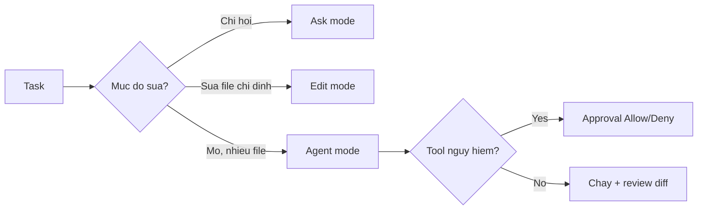

# FAQ 03 — Modes & Permissions

> Nhóm Chế độ & Quyền · 10 câu hỏi deep-dive · Đọc xong phân biệt Ask/Edit/Agent, hết bị approval chặn, biết exclusion

File này trả lời mọi câu hỏi "Ask/Edit/Agent khác gì, sao Copilot cứ hỏi approve, content exclusion là gì". Mỗi câu có giải thích + lệnh copy-paste + ví dụ + khi nào áp dụng.

---

## Sơ đồ tư duy nhanh (đọc 30 giây)



## Bảng tổng hợp: chọn mode nhanh

| Mode | Copilot được làm gì | Khi nào dùng |
|---|---|---|
| Ask (hỏi đáp) | Chỉ trả lời, đọc file bạn cho phép | Hỏi, giải thích, lên plan |
| Edit (chỉnh sửa) | Sửa file trong scope bạn chỉ định | Sửa 1 vài file cụ thể |
| Agent (tự hành động) | Đọc + sửa nhiều file + chạy lệnh (có approval) | Task multi-file, refactor, feature |

---

## 1. Ask / Edit / Agent khác nhau gì?

> **Hỏi ngắn gọn:** _Ask / Edit / Agent khác nhau gì?_

**Trả lời 1 câu:** 

**Giải thích chi tiết + ví dụ:** 3 mode là 3 mức "quyền hành động" tăng dần:

- **Ask:** Copilot là cố vấn — đọc code bạn attach, trả lời chữ. Không sửa file, không chạy lệnh. An toàn tuyệt đối.
- **Edit:** Copilot là thợ sửa — sửa trực tiếp file trong working set (file bạn mở/attach). Thường không chạy lệnh build/test trừ khi bạn bảo.
- **Agent:** Copilot là cộng sự — tự tìm file, sửa nhiều file, chạy terminal (lint/test/build), tạo file mới. Mỗi hành động nhạy cảm hiện **approval prompt** để bạn duyệt.

### Làm thế nào (steps copy-paste)

Copy từng bước theo thứ tự (dán vào terminal/IDE là chạy):

```bash
# Đổi mode trong VS Code: dropdown cạnh nút Send trong Chat view
# Ask -> Edit -> Agent (chọn trước khi gõ prompt)
# Phím tắt mở chat: Ctrl+Alt+I (VS Code), tùy IDE
```

**Ví dụ cụ thể:** hỏi "hàm này làm gì" → Ask. Sửa 1 hàm → Edit + attach file. Refactor auth 5 file + chạy test → Agent.

> **Khi nào áp dụng:** luôn chọn mode YẾU NHẤT làm được việc — đừng bật Agent cho việc Ask làm được (tốn quota + rủi ro).

> **Nếu vẫn lỗi thì...** thử theo thứ tự: (1) làm lại bước copy-paste với scope gọn hơn (1 file/selection), (2) đổi model (`/model`) rồi chạy lại, (3) tra “Vẫn lỗi thì sao?” cuối file này, (4) hỏi admin (policy/seat) hoặc mở issue với log + ảnh chụp lỗi.
---

## 2. Tool approval là gì, sao Copilot cứ hỏi "Allow" hoài?

> **Hỏi ngắn gọn:** _Tool approval là gì, sao Copilot cứ hỏi "Allow" hoài?_

**Trả lời 1 câu:** 

**Giải thích chi tiết + ví dụ:** Approval = Copilot xin phép trước khi làm việc nhạy cảm: chạy lệnh terminal, sửa file ngoài scope, truy cập mạng/MCP... Bạn có 3 lựa chọn: **Allow once** (1 lần), **Allow for session/workspace** (nhớ), **Deny** (cấm).

Hỏi hoài thường do: task agent rộng (nhiều tool calls), hoặc bạn chưa bật "allow for workspace" cho lệnh an toàn (VD `npm test`).

### Làm thế nào (steps copy-paste)

Copy từng bước theo thứ tự (dán vào terminal/IDE là chạy):

```bash
# Trong approval prompt: chọn "Allow for workspace" cho lệnh an toàn:
# npm test, npm run lint, git status, git diff
# KHÔNG bao giờ "allow always" cho: rm -rf, git push, kubectl delete, drop table
```

**Ví dụ cụ thể:** agent chạy `npm test` lần nào cũng hỏi → Allow for workspace 1 lần → các lần sau tự chạy.

> **Khi nào áp dụng:** đầu mỗi task agent — duyệt nhanh lệnh an toàn, giữ phê duyệt tay cho lệnh nguy hiểm.

> **Nếu vẫn lỗi thì...** thử theo thứ tự: (1) làm lại bước copy-paste với scope gọn hơn (1 file/selection), (2) đổi model (`/model`) rồi chạy lại, (3) tra “Vẫn lỗi thì sao?” cuối file này, (4) hỏi admin (policy/seat) hoặc mở issue với log + ảnh chụp lỗi.
---

## 3. Content exclusion là gì, cấu hình ở đâu?

> **Hỏi ngắn gọn:** _Content exclusion là gì, cấu hình ở đâu?_

**Trả lời 1 câu:** 

**Giải thích chi tiết + ví dụ:** Content exclusion = danh sách path Copilot **không được đọc/không gợi ý** (VD `*.pem`, `secrets/`, `contracts/`). Có 2 mức:

- **Cá nhân/IDE:** `settings.json` → `github.copilot.chat.exclude` hoặc content exclusion trong extension settings.
- **Org (admin, Business/Enterprise):** `Org Settings → Copilot → Content exclusion` — áp cho mọi member, thắng setting cá nhân.

### Làm thế nào (steps copy-paste)

Copy từng bước theo thứ tự (dán vào terminal/IDE là chạy):

```json
// .vscode/settings.json (mẫu repo, xem templates/)
{
  "github.copilot.chat.exclude": ["**/*.pem", "**/secrets/**", "**/.env*"]
}
```

```bash
# Admin org (web UI): Org Settings -> Copilot -> Content exclusion -> Add path
# VD: **/legal/**, **/*.key, **/credentials.json
```

**Ví dụ cụ thể:** repo có `secrets/stripe.key` → thêm vào exclusion cả 2 mức (repo settings + org policy) để Copilot không bao giờ đọc.

> **Khi nào áp dụng:** ngay khi repo có secret/key/hợp đồng — exclusion trước, code sau. Chi tiết [bài 09](09-bao-mat-quyen-rieng-tu.md).

> **Nếu vẫn lỗi thì...** thử theo thứ tự: (1) làm lại bước copy-paste với scope gọn hơn (1 file/selection), (2) đổi model (`/model`) rồi chạy lại, (3) tra “Vẫn lỗi thì sao?” cuối file này, (4) hỏi admin (policy/seat) hoặc mở issue với log + ảnh chụp lỗi.
---

## 4. Agent sửa nhầm file thì xử lý sao (undo / checkpoint)?

> **Hỏi ngắn gọn:** _Agent sửa nhầm file thì xử lý sao (undo / checkpoint)?_

**Trả lời 1 câu:** 

**Giải thích chi tiết + ví dụ:** 3 lớp cứu hộ theo thứ tự:

1. **Undo trong chat:** Edit mode hiện diff → nút Undo/Discard để hoàn tác từng change.
2. **Git:** `git diff` xem, `git checkout -- <file>` hoàn tác file, `git stash` giữ lại tạm.
3. **Checkpoint/session restore:** Agent mode có timeline — quay về checkpoint trước khi nó sửa sai.

### Làm thế nào (steps copy-paste)

Copy từng bước theo thứ tự (dán vào terminal/IDE là chạy):

```bash
# Xem agent đã sửa gì
git status --short
git diff --stat

# Hoàn tác 1 file bị sửa nhầm
git checkout -- src/wrong-file.ts

# Hoàn tác tất cả (cẩn thận: mất cả change đúng)
git stash -u
```

**Ví dụ cụ thể:** agent sửa nhầm `migrations/` → `git checkout -- db/migrations/` → thu hẹp prompt → chạy lại chỉ trong `src/`.

> **Khi nào áp dụng:** sau mỗi task agent — `git diff --stat` trước khi commit là thói quen bắt buộc.

> **Nếu vẫn lỗi thì...** thử theo thứ tự: (1) làm lại bước copy-paste với scope gọn hơn (1 file/selection), (2) đổi model (`/model`) rồi chạy lại, (3) tra “Vẫn lỗi thì sao?” cuối file này, (4) hỏi admin (policy/seat) hoặc mở issue với log + ảnh chụp lỗi.
---

## 5. Cho agent chạy lệnh terminal an toàn thế nào?

> **Hỏi ngắn gọn:** _Cho agent chạy lệnh terminal an toàn thế nào?_

**Trả lời 1 câu:** 

**Giải thích chi tiết + ví dụ:** Nguyên tắc: **allowlist lệnh đọc + test, blocklist lệnh phá hoại.**

- Luôn cho phép: `git status/diff/log`, `npm test`, `npm run lint`, `ls`, `cat`.
- Cân nhắc từng lần: `npm install`, `git commit`, `docker build`.
- Không bao giờ auto-allow: `rm -rf`, `git push --force`, `kubectl delete`, `drop/drop table`, `chmod 777`.

### Làm thế nào (steps copy-paste)

Copy từng bước theo thứ tự (dán vào terminal/IDE là chạy):

```bash
# Dặn agent ngay trong prompt đầu task:
# "Chỉ được chạy: npm test, npm run lint, git status, git diff.
#  Không chạy git push, rm, hay lệnh mạng khi chưa hỏi tôi."
```

**Ví dụ cụ thể:** prompt chuẩn mở đầu task agent: `"Refactor X trong src/auth/. Chỉ chạy npm test + git diff. Không commit, không push."`

> **Khi nào áp dụng:** mọi task agent — 1 dòng giới hạn lệnh trong prompt đầu tiết kiệm 10 lần approve sau.

> **Nếu vẫn lỗi thì...** thử theo thứ tự: (1) làm lại bước copy-paste với scope gọn hơn (1 file/selection), (2) đổi model (`/model`) rồi chạy lại, (3) tra “Vẫn lỗi thì sao?” cuối file này, (4) hỏi admin (policy/seat) hoặc mở issue với log + ảnh chụp lỗi.
---

## 6. Edit mode sửa lan sang file khác — chặn thế nào?

> **Hỏi ngắn gọn:** _Edit mode sửa lan sang file khác — chặn thế nào?_

**Trả lời 1 câu:** 

**Giải thích chi tiết + ví dụ:** Edit mode sửa trong **working set** = file đang mở + file attach. Nó lan ra ngoài khi: bạn attach cả folder, hoặc prompt viết chung chung ("refactor auth" mà attach cả `src/`).

Chặn bằng: attach đúng file cần sửa, nêu rõ file được/không được đụng trong prompt.

### Làm thế nào (steps copy-paste)

Copy từng bước theo thứ tự (dán vào terminal/IDE là chạy):

```bash
# Prompt Edit chuẩn (chỉ rõ phạm vi):
# "Chỉ sửa src/auth/login.ts (hàm login):
#  - chuyển sang async/await
#  - KHÔNG đụng session.ts, types.ts, tests"
```

**Ví dụ cụ thể:** muốn sửa 1 hàm mà Copilot sửa thêm 3 file → Undo → attach lại đúng 1 file → prompt ghi rõ "chỉ file này".

> **Khi nào áp dụng:** mỗi khi dùng Edit — scope hẹp = diff gọn = review nhanh.

> **Nếu vẫn lỗi thì...** thử theo thứ tự: (1) làm lại bước copy-paste với scope gọn hơn (1 file/selection), (2) đổi model (`/model`) rồi chạy lại, (3) tra “Vẫn lỗi thì sao?” cuối file này, (4) hỏi admin (policy/seat) hoặc mở issue với log + ảnh chụp lỗi.
---

## 7. Ask mode đọc được gì, có sợ lộ file nhạy cảm không?

> **Hỏi ngắn gọn:** _Ask mode đọc được gì, có sợ lộ file nhạy cảm không?_

**Trả lời 1 câu:** 

**Giải thích chi tiết + ví dụ:** Ask chỉ đọc: file bạn attach (`#file`, `#selection`, working set) + instructions. Nó KHÔNG tự quét cả repo. Nhưng nếu bạn attach nhầm file secret, nội dung đó vào context chat (gửi lên server model).

Vì vậy: đừng bao giờ `#file` secret vào chat, dù là Ask.

### Làm thế nào (steps copy-paste)

Copy từng bước theo thứ tự (dán vào terminal/IDE là chạy):

```bash
# Trước khi attach file vào chat, check nhanh:
git check-ignore secrets/stripe.key && echo "IGNORED" || echo "COI CHUNG: file nay dang track!"
# File secret track trong git + attach vào chat = 2 lớp rủi ro
```

**Ví dụ cụ thể:** debug lỗi Stripe → paste **đoạn code gọi API** (đã xóa key) thay vì `#file:secrets/stripe.ts` nguyên file.

> **Khi nào áp dụng:** mỗi lần attach file — 3 giây check tên file có chứa `secret/key/token/pem` không.

> **Nếu vẫn lỗi thì...** thử theo thứ tự: (1) làm lại bước copy-paste với scope gọn hơn (1 file/selection), (2) đổi model (`/model`) rồi chạy lại, (3) tra “Vẫn lỗi thì sao?” cuối file này, (4) hỏi admin (policy/seat) hoặc mở issue với log + ảnh chụp lỗi.
---

## 8. Permissions của MCP tools quản lý thế nào?

> **Hỏi ngắn gọn:** _Permissions của MCP tools quản lý thế nào?_

**Trả lời 1 câu:** 

**Giải thích chi tiết + ví dụ:** MCP server cung cấp tools ngoài (query DB, tạo ticket...) cho Copilot. Mỗi tool MCP khi agent gọi lần đầu đều hiện approval. Bạn có thể: allow once, allow workspace, hoặc tắt hẳn server trong `mcp.json` (xóa entry hoặc `disabled: true`).

Tool MCP nguy hiểm (VD `db.exec("DROP...")`, `github.merge_pr`) → không bao giờ allow always.

### Làm thế nào (steps copy-paste)

Copy từng bước theo thứ tự (dán vào terminal/IDE là chạy):

```json
// .vscode/mcp.json: tắt tạm 1 server nguy hiểm
{
  "servers": {
    "postgres-prod": { "command": "echo", "args": ["disabled - dung replicas"] }
  }
}
// Thực tế: xóa entry hoặc đổi env pointing sang read-replica
```

**Ví dụ cụ thể:** MCP postgres trỏ prod → đổi connection string sang **read-replica** (xem `templates/.vscode/mcp.json`), agent query thoải mái không sợ ghi nhầm.

> **Khi nào áp dụng:** khi thêm MCP server mới — luôn trỏ read-only/replica trước, mở write sau. Chi tiết [bài 04](04-mcp-faq.md).

> **Nếu vẫn lỗi thì...** thử theo thứ tự: (1) làm lại bước copy-paste với scope gọn hơn (1 file/selection), (2) đổi model (`/model`) rồi chạy lại, (3) tra “Vẫn lỗi thì sao?” cuối file này, (4) hỏi admin (policy/seat) hoặc mở issue với log + ảnh chụp lỗi.
---

## 9. Team thống nhất permissions baseline thế nào?

> **Hỏi ngắn gọn:** _Team thống nhất permissions baseline thế nào?_

**Trả lời 1 câu:** 

**Giải thích chi tiết + ví dụ:** Team nên có 1 baseline chung, đặt trong repo để mọi người giống nhau:

1. `.vscode/settings.json` — exclusion paths chuẩn team.
2. `.github/muse-instructions.md` — dòng "agent chỉ chạy lệnh X, không làm Y".
3. Org policy (admin) — model allowlist, coding agent bật/tắt.

### Làm thế nào (steps copy-paste)

Copy từng bước theo thứ tự (dán vào terminal/IDE là chạy):

```markdown
<!-- Đoạn mẫu trong .github/muse-instructions.md -->
## Permissions baseline (team)
- Agent được chạy: npm test, npm run lint, git status/diff.
- Agent KHÔNG: commit, push, sửa db/migrations, gọi API prod.
- File cấm đọc: **/*.pem, secrets/**, .env*.
```

**Ví dụ cụ thể:** member mới clone repo → mở IDE → settings + instructions tự áp → permissions giống cả team từ phút 1.

> **Khi nào áp dụng:** khi team >3 người dùng Copilot — baseline trong repo đỡ cãi nhau về "sao máy em nó tự push".

> **Nếu vẫn lỗi thì...** thử theo thứ tự: (1) làm lại bước copy-paste với scope gọn hơn (1 file/selection), (2) đổi model (`/model`) rồi chạy lại, (3) tra “Vẫn lỗi thì sao?” cuối file này, (4) hỏi admin (policy/seat) hoặc mở issue với log + ảnh chụp lỗi.
---

## 10. Khi nào KHÔNG nên dùng Agent mode?

> **Hỏi ngắn gọn:** _Khi nào KHÔNG nên dùng Agent mode?_

**Trả lời 1 câu:** 

**Giải thích chi tiết + ví dụ:** 5 trường hợp nên tránh Agent, dùng Ask/Edit hoặc làm tay:

1. **Sửa hotfix prod gấp** — agent chậm + khó kiểm soát, làm tay nhanh hơn.
2. **Migration DB / infra** — 1 lệnh sai mất data; review tay từng dòng.
3. **Code legal/compliance** — cần người chịu trách nhiệm, không ủy thác.
4. **Repo chưa có test** — agent không có lưới an toàn, dễ "sửa xong hỏng ngầm".
5. **Quota đỏ cuối tháng** — agent đốt premium nhanh nhất.

### Làm thế nào (steps copy-paste)

Copy từng bước theo thứ tự (dán vào terminal/IDE là chạy):

```bash
# Checklist trước khi bật Agent:
# [ ] Có test chạy được? (npm test xanh)
# [ ] Git sạch? (git status --short trống để dễ diff)
# [ ] Scope <10 file?
# Thiếu 1 trong 3 -> dùng Edit/tay thay vì Agent
```

**Ví dụ cụ thể:** hotfix thanh toán lỗi giữa đêm → Edit 1 file + chạy test tay, đừng bật agent quét cả repo.

> **Khi nào áp dụng:** trước nút bật Agent — 10 giây checklist tránh 1 giờ dọn hậu quả.

> **Nếu vẫn lỗi thì...** thử theo thứ tự: (1) làm lại bước copy-paste với scope gọn hơn (1 file/selection), (2) đổi model (`/model`) rồi chạy lại, (3) tra “Vẫn lỗi thì sao?” cuối file này, (4) hỏi admin (policy/seat) hoặc mở issue với log + ảnh chụp lỗi.
---

## Vẫn lỗi thì sao? (thứ tự debug chuẩn)

1. Check đang ở mode nào (Ask/Edit/Agent) — đúng mode chưa.
2. Xem approval history: có Deny nhầm lệnh cần thiết không.
3. Check org policy có đè setting không (hỏi admin).
4. Check content exclusion có chặn file bạn cần không.
5. Vẫn kẹt → chat mới + prompt ghi rõ phạm vi file + lệnh được chạy.

---

## Tham khảo chéo

- MCP tools approval: [bài 04](04-mcp-faq.md). Prompt/instructions scope: [bài 06](06-prompts-agents-instructions.md).
- Agent workflows: [bài 07](07-custom-agents-coding-agent-workflows.md). Bảo mật exclusion: [bài 09](09-bao-mat-quyen-rieng-tu.md).
- Templates: [../templates/README.md](../templates/README.md).

> Mẹo 1 dòng: _mode yếu nhất làm được việc + prompt ghi rõ file được đụng và lệnh được chạy._
