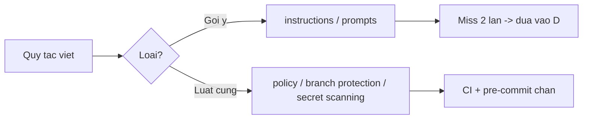

# FAQ 05 — Policies & Guardrails FAQ

> **Dành cho:** dev/admin muốn "ép buộc" được quy tắc — không chỉ khuyến nghị — khi Copilot không nghe instruction.
> **Vấn đề:** "instruction không ăn thì fix sao, dựng pre-commit + branch protection, guardrail lệnh nguy hiểm trong CI" — 10 câu hỏi, mỗi câu có giải thích + lệnh copy-paste + ví dụ + khi nào áp dụng.
> **Đọc xong:** biết instruction không ăn thì fix sao, dựng pre-commit + branch protection. **Thời gian:** ~15 phút đọc.

File này là "hooks + guardrails" của Copilot: instruction không ăn, Copilot hooks in-process (preview, Local — bài 17), pre-commit, branch protection. Mỗi câu có giải thích + lệnh copy-paste + ví dụ + khi nào áp dụng.

---

## Sơ đồ tư duy nhanh (đọc 30 giây)

Section này trả lời: quy tắc "cấm" của bạn viết ở tầng nào — khuyến nghị (instructions) hay luật cứng (policy/protection), và khi nào chuyển từ khuyến nghị sang luật.



## Bảng tổng hợp: guardrail nào chặn ở đâu

Section này trả lời: muốn chặn hành vi nào → công cụ nào, chặn ở tầng nào (IDE, local, GitHub server).

| Muốn chặn | Công cụ | Chặn ở tầng |
|---|---|---|
| Copilot đọc file nhạy cảm | Content exclusion | IDE + org policy |
| Commit sai chuẩn / dính secret | Pre-commit hooks + secret scanning | Local + GitHub |
| Push thẳng main | Branch protection ruleset | GitHub server |
| Agent làm việc cấm | Instructions "KHÔNG" + approval | Prompt + IDE |
| PR chưa review đã merge | Required reviewers + status checks | GitHub server |

---

## 1. Instruction "không ăn" — vì sao Copilot vẫn làm điều cấm?

Section này trả lời: 5 nguyên nhân "instruction không ăn", check theo thứ tự.

> **Hỏi ngắn gọn:** _Instruction "không ăn" — vì sao Copilot vẫn làm điều cấm?_

**Trả lời 1 câu:** 5 nguyên nhân: file đặt sai chỗ, `applyTo` sai glob, câu cấm mơ hồ, prompt đè instruction, context tràn — check theo đúng thứ tự.

**Giải thích chi tiết + ví dụ:** 5 nguyên nhân theo thứ tự kiểm tra:

1. **File đặt sai chỗ/tên:** `copilot-instructions.md` phải ở `.github/`, instructions con phải `*.instructions.md` trong `.github/instructions/`.
2. **`applyTo` sai glob** → file cần không khớp pattern (xem [bài 06](06-prompts-agents-instructions.md)).
3. **Câu cấm viết mơ hồ:** "cẩn thận với migrations" yếu hơn "KHÔNG sửa db/migrations/** dưới mọi hình thức".
4. **Prompt task đè instruction:** user bảo "sửa luôn migration" → model nghe prompt gần hơn.
5. **Context tràn** → instructions bị cắt khỏi window (xem [bài 02](02-model-context-premium.md)).

### Làm thế nào (steps copy-paste)

Copy từng bước theo thứ tự (dán vào terminal/IDE là chạy):

```bash
# Checklist file có đúng chỗ không
ls .github/copilot-instructions.md .github/instructions/
wc -l .github/copilot-instructions.md  # nên <200 dòng, dài quá bị cắt
# Verify: file tồn tại + số dòng <200

# Test instruction có ăn không: hỏi thẳng trong chat
# "Liệt kê 3 quy tắc quan trọng nhất trong copilot-instructions.md"
# Verify: copilot trả đúng 3 quy tắc, không bịa
```

**Ví dụ cụ thể:** cấm "không push main" mà agent vẫn push → kiểm tra thấy câu cấm nằm ở dòng 250/300 → model ít đọc tới → chuyển lên top 20 dòng + đổi thành "NEVER git push --force...".

> **Khi nào áp dụng:** mọi ca "em đã ghi rồi mà nó không nghe" — check vị trí + độ cụ thể trước.

> **Nếu vẫn lỗi thì...** thử theo thứ tự: (1) làm lại bước copy-paste với scope gọn hơn (1 file/selection), (2) đổi model (`/model`) rồi chạy lại, (3) tra "Vẫn lỗi thì sao?" cuối file này, (4) hỏi admin (policy/seat) hoặc mở issue với log + ảnh chụp lỗi.
---

## 2. Viết quy tắc "cấm" sao cho Copilot nghe lời?

Section này trả lời: công thức "động từ mạnh + phạm vi + hậu quả" cho câu cấm.

> **Hỏi ngắn gọn:** _Viết quy tắc "cấm" sao cho Copilot nghe lời?_

**Trả lời 1 câu:** Công thức: **động từ mạnh (ALWAYS/NEVER) + phạm vi chính xác + hậu quả/hướng thay thế** — câu mơ hồ copilot sẽ bỏ qua.

**Giải thích chi tiết + ví dụ:** Công thức: **động từ mạnh + phạm vi chính xác + hậu quả/hướng thay thế.**

- Yếu: "Cẩn thận khi sửa migrations."
- Mạnh: "NEVER sửa `db/migrations/**`. DB change → tạo file migration mới + chạy `npm run migrate:up`."
- Yếu: "Nhớ chạy test."
- Mạnh: "ALWAYS chạy `npm test -- <file-lien-quan>` sau mỗi sửa. Không báo PASS thì không kết luận xong."

### Làm thế nào (steps copy-paste)

Copy từng bước theo thứ tự (dán vào terminal/IDE là chạy):

```markdown
<!-- Mẫu block Rules trong .github/copilot-instructions.md -->
## Rules (bắt buộc)
- NEVER commit trực tiếp main. Luôn tạo branch `feat/<ten>`.
- NEVER sửa `db/migrations/**` đã merge. Tạo migration mới.
- NEVER hardcode secret. Secrets chỉ qua `process.env.*`.
- ALWAYS chạy focused test sau mỗi sửa, paste kết quả PASS/FAIL.
```

**Ví dụ cụ thể:** copy block trên vào `templates/.github/copilot-instructions.md` → sửa lệnh test cho khớp repo → quy tắc "ăn" ngay vì cụ thể + check được.

> **Khi nào áp dụng:** khi viết/sửa mọi instruction — mỗi quy tắc phải có động từ ALWAYS/NEVER + path/lệnh cụ thể.

> **Nếu vẫn lỗi thì...** thử theo thứ tự: (1) làm lại bước copy-paste với scope gọn hơn (1 file/selection), (2) đổi model (`/model`) rồi chạy lại, (3) tra "Vẫn lỗi thì sao?" cuối file này, (4) hỏi admin (policy/seat) hoặc mở issue với log + ảnh chụp lỗi.
---

## 3. Pre-commit tương đương: chặn commit xấu thế nào?

Section này trả lời: Copilot 2026 có hooks in-process nhưng chỉ preview Local — layer deterministic là git hooks + push protection.

> **Hỏi ngắn gọn:** _Pre-commit tương đương: chặn commit xấu thế nào?_

**Trả lời 1 câu:** Dựng 3 lớp deterministic: pre-commit framework (lint/test), gitleaks (secret scan), GitHub push protection (chặn secret khi push) — không model nào tắt được.

**Giải thích chi tiết + ví dụ:** Copilot 2026 có hooks in-process (`.github/hooks/*.json`, events `PreToolUse`/`PostToolUse`...) nhưng **preview + Local-only**, chưa phải security boundary (bài 07/17). Pre-commit ở đây = **git hooks local + GitHub push protection** — lớp deterministic không model tắt được. Dựng 3 lớp:

1. **pre-commit framework:** lint/format/test nhanh trước commit.
2. **gitleaks/trufflehog:** quét secret trong staged files.
3. **GitHub push protection:** chặn push chứa secret đã biết (secret scanning).

### Làm thế nào (steps copy-paste)

Copy từng bước theo thứ tự (dán vào terminal/IDE là chạy):

```bash
# Cài pre-commit + hook secret scan
pip install pre-commit gitleaks || brew install pre-commit gitleaks

# .pre-commit-config.yaml tối thiểu
cat > .pre-commit-config.yaml <<'YAML'
repos:
  - repo: https://github.com/pre-commit/pre-commit-hooks
    rev: v5.0.0
    hooks:
      - id: trailing-whitespace
      - id: end-of-file-fixer
      - id: check-added-large-files
YAML
pre-commit install
# Verify: git commit thử -> hook chạy + chặn file có trailing whitespace
```

```bash
# Quét secret trước commit (chạy tay khi chưa có hook)
gitleaks protect --staged --verbose
# Verify: ra "No leaks found" hoặc list đúng dòng dính secret
```

**Ví dụ cụ thể:** dev vô tình `export STRIPE_KEY=sk-live...` vào `.env.example` → `gitleaks protect --staged` chặn commit + chỉ đúng dòng.

> **Khi nào áp dụng:** setup repo mới (cùng đợt copy `templates/`), và bắt buộc cho repo có secret/thanh toán.

> **Nếu vẫn lỗi thì...** thử theo thứ tự: (1) làm lại bước copy-paste với scope gọn hơn (1 file/selection), (2) đổi model (`/model`) rồi chạy lại, (3) tra "Vẫn lỗi thì sao?" cuối file này, (4) hỏi admin (policy/seat) hoặc mở issue với log + ảnh chụp lỗi.
---

## 4. Branch protection: chặn push main + ép review thế nào?

Section này trả lời: tạo ruleset bảo vệ `main` bằng gh CLI.

> **Hỏi ngắn gọn:** _Branch protection: chặn push main + ép review thế nào?_

**Trả lời 1 câu:** Tạo ruleset `protect-main` ở `Repo → Settings → Rules → Rulesets` — require PR + status checks + block force push.

**Giải thích chi tiết + ví dụ:** Vào `Repo → Settings → Rules → Rulesets → New ruleset`: target `main`, bật:

- **Require pull request:** ít nhất 1 reviewer, dismiss stale approvals.
- **Require status checks:** CI xanh mới merge được.
- **Block force pushes + deletions:** chống mất history.
- (Nâng cao) **Require Copilot code review** (xem [bài 10](10-ci-sdk-review-web.md)).

### Làm thế nào (steps copy-paste)

Copy từng bước theo thứ tự (dán vào terminal/IDE là chạy):

```bash
# Tạo ruleset bằng gh CLI (thay <OWNER>/<REPO>)
gh api repos/<OWNER>/<REPO>/rulesets -X POST -f name='protect-main' \
  -f enforcement='active' -f target='branch' \
  --raw-field 'conditions={ "ref_name": { "include": ["refs/heads/main"], "exclude": [] } }' \
  --raw-field 'rules=[{"type":"deletion"},{"type":"non_fast_forward"},{"type":"pull_request","parameters":{"required_approving_review_count":1,"dismiss_stale_reviews_on_push":true}}]'
# Verify: gh api repos/<OWNER>/<REPO>/rulesets ra list có protect-main

# Kiểm tra ruleset hiện có
gh api repos/<OWNER>/<REPO>/rulesets --jq '.[].name'
```

**Ví dụ cụ thể:** ruleset `protect-main` + required check `ci` → agent hay người đều không push/merge bừa được; muốn merge phải qua PR xanh.

> **Khi nào áp dụng:** mọi repo team >1 người — dựng trước khi onboarding Copilot coding agent (nó cũng phải tuân ruleset).

> **Nếu vẫn lỗi thì...** thử theo thứ tự: (1) làm lại bước copy-paste với scope gọn hơn (1 file/selection), (2) đổi model (`/model`) rồi chạy lại, (3) tra "Vẫn lỗi thì sao?" cuối file này, (4) hỏi admin (policy/seat) hoặc mở issue với log + ảnh chụp lỗi.
---

## 5. Secret scanning + push protection bật thế nào?

Section này trả lời: 2 tính năng GitHub (Business/Enterprise full) — cách bật + xử lý khi lỡ commit secret.

> **Hỏi ngắn gọn:** _Secret scanning + push protection bật thế nào?_

**Trả lời 1 câu:** Bật ở `Repo/Org → Settings → Code security → Secret scanning + Push protection`; khi lỡ commit secret thì xoay key NGAY rồi mới xóa.

**Giải thích chi tiết + ví dụ:** 2 tính năng GitHub (Business/Enterprise có full):

- **Secret scanning:** quét repo tìm secret đã lộ → báo alert trong `Security → Secret scanning`.
- **Push protection:** chặn ngay lúc `git push` nếu phát hiện secret (hiện thông báo + link bypass có lý do).

Bật ở `Repo/Org → Settings → Code security → Secret scanning + Push protection`.

### Làm thế nào (steps copy-paste)

Copy từng bước theo thứ tự (dán vào terminal/IDE là chạy):

```bash
# Kiểm tra alerts secret đã lộ
gh api repos/<OWNER>/<REPO>/secret-scanning/alerts --jq '.[] | {number, secret_type, state}'
# Verify: list alert, state "open" = còn secret lộ

# Test push protection (trong repo thử nghiệm, KHÔNG làm ở prod):
echo "fake" | git commit --allow-empty -m test -q  # không liên quan; push protection tự chạy khi push
```

```bash
# Nếu lỡ commit secret: xoay key NGAY rồi mới xóa history
# 1. Revoke/rotate key trên dashboard provider
# 2. Xóa file + push (history vẫn còn -> cần rotate là chính)
git rm --cached secrets/leaked.key && git commit -m "chore: remove leaked secret"
# Verify: git log -p -- secrets/leaked.key không còn (đã xóa khỏi HEAD, history cũ vẫn còn -> rotate là chính)
```

**Ví dụ cụ thể:** push dính `ghp_...` → GitHub chặn + báo "Push blocked" → xóa key khỏi code → `git commit --amend` → push lại.

> **Khi nào áp dụng:** bật mặc định mọi repo; khi bị chặn push thì đọc kỹ thông báo (nó chỉ đúng file:dòng).

> **Nếu vẫn lỗi thì...** thử theo thứ tự: (1) làm lại bước copy-paste với scope gọn hơn (1 file/selection), (2) đổi model (`/model`) rồi chạy lại, (3) tra "Vẫn lỗi thì sao?" cuối file này, (4) hỏi admin (policy/seat) hoặc mở issue với log + ảnh chụp lỗi.
---

## 6. Ép conventional commits / lint trước khi agent commit?

Section này trả lời: kết hợp commitlint (local) + status check (CI) — agent commit sai thì hook chặn + CI đỏ.

> **Hỏi ngắn gọn:** _Ép conventional commits / lint trước khi agent commit?_

**Trả lời 1 câu:** Kết hợp commitlint hook local + status check CI — commit sai thì hook chặn ngay, lọt qua thì PR không merge được.

**Giải thích chi tiết + ví dụ:** Kết hợp: **commitlint hook local** + **status check CI**. Agent tạo commit message sai → hook local sửa/báo ngay; lọt qua local → CI check đỏ, PR không merge được.

### Làm thế nào (steps copy-paste)

Copy từng bước theo thứ tự (dán vào terminal/IDE là chạy):

```bash
# Thêm commitlint vào pre-commit (đoạn thêm vào .pre-commit-config.yaml)
cat >> .pre-commit-config.yaml <<'YAML'
  - repo: https://github.com/alorents/commitlint
    rev: v1.0.0
    hooks:
      - id: commitlint
        stages: [commit-msg]
YAML
```

```yaml
# .github/workflows/lint.yml (status check bắt buộc)
name: lint
on: [pull_request]
jobs:
  lint:
    runs-on: ubuntu-latest
    steps:
      - uses: actions/checkout@v4
      - run: npm ci && npm run lint
```

**Ví dụ cụ thể:** agent commit `fix stuff` → commitlint chặn → agent tự sửa thành `fix(auth): handle expired session` → commit qua.

> **Khi nào áp dụng:** khi log git của team loạn do agent + người commit kiểu khác nhau.

> **Nếu vẫn lỗi thì...** thử theo thứ tự: (1) làm lại bước copy-paste với scope gọn hơn (1 file/selection), (2) đổi model (`/model`) rồi chạy lại, (3) tra "Vẫn lỗi thì sao?" cuối file này, (4) hỏi admin (policy/seat) hoặc mở issue với log + ảnh chụp lỗi.
---

## 7. Giới hạn coding agent: chỉ cho nó đụng repo/branch nào?

Section này trả lời: admin cấu hình org policy + dev ghi rõ scope trong issue.

> **Hỏi ngắn gọn:** _Giới hạn coding agent: chỉ cho nó đụng repo/branch nào?_

**Trả lời 1 câu:** Admin (Enterprise) cấu hình ở org policy; dev tôn trọng bằng cách ghi rõ repo + branch trong prompt/issue.

**Giải thích chi tiết + ví dụ:** Admin (Enterprise) cấu hình ở org policy: coding agent bật cho repo nào, chạy trên branch nào, có tự tạo PR không. Dev thường: tôn trọng bằng cách assign task đúng repo + ghi rõ branch trong prompt/issue.

### Làm thế nào (steps copy-paste)

Copy từng bước theo thứ tự (dán vào terminal/IDE là chạy):

```bash
# Khi giao việc cho coding agent (trong issue), ghi rõ phạm vi:
# "Repo: acme/api. Branch base: develop (KHÔNG phải main).
#  Chỉ sửa src/payments/**. Không đụng infra/."
# Verify: agent tạo PR đúng repo + đúng branch, không lan ra ngoài
```

**Ví dụ cụ thể:** org có 50 repo, chỉ bật agent cho 5 repo pilot → member repo khác assign task cho agent sẽ báo "not enabled" → đúng ý admin.

> **Khi nào áp dụng:** khi mở rộng coding agent từ pilot ra toàn org — mở từng đợt + ruleset đi kèm.

> **Nếu vẫn lỗi thì...** thử theo thứ tự: (1) làm lại bước copy-paste với scope gọn hơn (1 file/selection), (2) đổi model (`/model`) rồi chạy lại, (3) tra "Vẫn lỗi thì sao?" cuối file này, (4) hỏi admin (policy/seat) hoặc mở issue với log + ảnh chụp lỗi.
---

## 8. Audit: biết ai/agent đã làm gì?

Section này trả lời: 3 nguồn log — git, GitHub audit log, PR timeline.

> **Hỏi ngắn gọn:** _Audit: biết ai/agent đã làm gì?_

**Trả lời 1 câu:** 3 nguồn: `git log` (commit agent có `Co-authored-by`), `Org audit log` (ai bật/tắt policy), PR timeline (agent ghi comment từng bước).

**Giải thích chi tiết + ví dụ:** 3 nguồn log:

- **Git history:** `git log` — commit của agent thường có `Co-authored-by: Copilot` hoặc author bot.
- **GitHub audit log (org):** `Org → Settings → Audit log` — ai bật/tắt policy, ai assign seat.
- **PR timeline:** coding agent ghi comment từng bước (plan → changes → test results).

### Làm thế nào (steps copy-paste)

Copy từng bước theo thứ tự (dán vào terminal/IDE là chạy):

```bash
# Tìm commit do agent tạo
git log --oneline --grep -i "copilot" -20
git log --format='%h %an %s' -20 | grep -i "bot\|copilot"
# Verify: list commit + author, "bot/copilot" = do agent tạo

# Audit log org qua API (cần admin)
gh api orgs/<ORG>/audit-log --jq '.[] | {action, actor, created_at}' | head -20
# Verify: list hành động, actor = ai + action = việc gì
```

**Ví dụ cụ thể:** PR lỗi không rõ ai sửa → `git log` thấy 3 commit `Co-authored-by: Copilot` → đọc PR timeline comment tương ứng để biết agent đã làm gì.

> **Khi nào áp dụng:** postmortem, review PR agent, và khi compliance hỏi "thay đổi này từ đâu ra".

> **Nếu vẫn lỗi thì...** thử theo thứ tự: (1) làm lại bước copy-paste với scope gọn hơn (1 file/selection), (2) đổi model (`/model`) rồi chạy lại, (3) tra "Vẫn lỗi thì sao?" cuối file này, (4) hỏi admin (policy/seat) hoặc mở issue với log + ảnh chụp lỗi.
---

## 9. Guardrail cho lệnh nguy hiểm trong CI (không dangerously-skip)?

Section này trả lời: workflow gọi Copilot CLI phải secrets qua `${{ secrets }}`, không skip-verification.

> **Hỏi ngắn gọn:** _Guardrail cho lệnh nguy hiểm trong CI (không dangerously-skip)?_

**Trả lời 1 câu:** Secrets qua `${{ secrets.* }}` → env, KHÔNG `echo` secret, KHÔNG skip-verification flag; job đụng prod dùng `environment:` + required reviewers.

**Giải thích chi tiết + ví dụ:** Workflow gọi Copilot CLI phải: secrets qua `${{ secrets.* }}` → env, KHÔNG `echo` secret, KHÔNG dùng flag skip-verification/bypass. Dùng `environment:` + required reviewers cho job đụng prod (xem mẫu `templates/.github/workflows/`).

### Làm thế nào (steps copy-paste)

Copy từng bước theo thứ tự (dán vào terminal/IDE là chạy):

```yaml
# Mẫu đúng (trích templates/.github/workflows/copilot-review.yml)
jobs:
  review:
    runs-on: ubuntu-latest
    environment: review  # ép approval nếu đụng prod
    steps:
      - uses: actions/checkout@v4
      - env:
          GH_TOKEN: ${{ secrets.GITHUB_TOKEN }}
          ANTHROPIC_API_KEY: ${{ secrets.ANTHROPIC_API_KEY }}  # nếu CLI cần
        run: gh copilot suggest "summarize changes" --no-interactive || true
```

**Ví dụ cụ thể:** workflow triage issue → chỉ đọc issue + comment gợi ý, không có quyền push (dùng `GITHUB_TOKEN` read-only + không checkout write).

> **Khi nào áp dụng:** mọi workflow có Copilot CLI — review quyền `permissions:` tối thiểu trước khi merge workflow.

> **Nếu vẫn lỗi thì...** thử theo thứ tự: (1) làm lại bước copy-paste với scope gọn hơn (1 file/selection), (2) đổi model (`/model`) rồi chạy lại, (3) tra "Vẫn lỗi thì sao?" cuối file này, (4) hỏi admin (policy/seat) hoặc mở issue với log + ảnh chụp lỗi.
---

## 10. Checklist guardrails cho repo mới (5 phút)?

Section này trả lời: 6 tick phải đủ trước khi bật coding agent.

> **Hỏi ngắn gọn:** _Checklist guardrails cho repo mới (5 phút)?_

**Trả lời 1 câu:** 6 tick: exclusion paths, Rules block, ruleset bảo vệ `main`, secret scanning bật, CI lint/test, `mcp.json` không hardcode.

**Giải thích chi tiết + ví dụ:** Chạy checklist này sau khi copy `templates/`:

1. [ ] `.vscode/settings.json` có exclusion paths.
2. [ ] `copilot-instructions.md` có block Rules ALWAYS/NEVER.
3. [ ] Ruleset bảo vệ `main` (block force push + require PR).
4. [ ] Secret scanning + push protection bật.
5. [ ] CI lint/test chạy trên PR (status check).
6. [ ] `mcp.json` không hardcode secret.

### Làm thế nào (steps copy-paste)

Copy từng bước theo thứ tự (dán vào terminal/IDE là chạy):

```bash
# Script check nhanh (đứng ở root repo)
ls .github/copilot-instructions.md .vscode/settings.json .vscode/mcp.json
grep -rn "ghp_\|sk-live\|xoxb-" .vscode/ .github/ 2>/dev/null && echo "CO SECRET HARDCODE!" || echo "secrets OK"
gh api repos/<OWNER>/<REPO>/rulesets --jq '.[].name'
# Verify: đủ 3 file + "secrets OK" + list ruleset có protect-main
```

**Ví dụ cụ thể:** chạy script trên cho repo mới → thấy thiếu ruleset → tạo theo câu 4 → đủ 6 tick mới onboarding team.

> **Khi nào áp dụng:** definition-of-done cho mọi repo mới trước khi bật coding agent.

> **Nếu vẫn lỗi thì...** thử theo thứ tự: (1) làm lại bước copy-paste với scope gọn hơn (1 file/selection), (2) đổi model (`/model`) rồi chạy lại, (3) tra "Vẫn lỗi thì sao?" cuối file này, (4) hỏi admin (policy/seat) hoặc mở issue với log + ảnh chụp lỗi.
---

## Vẫn lỗi thì sao? (thứ tự debug chuẩn)

Section này trả lời: 5 bước check khi mọi layer guardrail không ăn.

1. Instruction sai chỗ/sai glob? (`ls .github/`, xem [bài 06](06-prompts-agents-instructions.md)).
2. Quy tắc viết mơ hồ? → viết lại ALWAYS/NEVER + path cụ thể.
3. Hook local đã `pre-commit install` chưa.
4. Ruleset/push protection chặn? → đọc thông báo chặn (nó nói rõ lý do).
5. Vẫn lọt → nâng từ "khuyến nghị" lên "ép buộc server-side" (ruleset + required checks).

---

## Tham khảo chéo

Section này trả lời: đọc tiếp bài nào để đào sâu instructions, exclusion, secrets.

- Instructions viết đúng: [bài 06](06-prompts-agents-instructions.md). Content exclusion: [bài 03](03-modes-permissions.md).
- Secrets + audit sâu: [bài 09](09-bao-mat-quyen-rieng-tu.md). CI workflows mẫu: [bài 10](10-ci-sdk-review-web.md) + [../templates/README.md](../templates/README.md).

> Mẹo 1 dòng: _khuyến nghị để trong instructions, ép buộc để ở server (ruleset + checks + push protection)._
