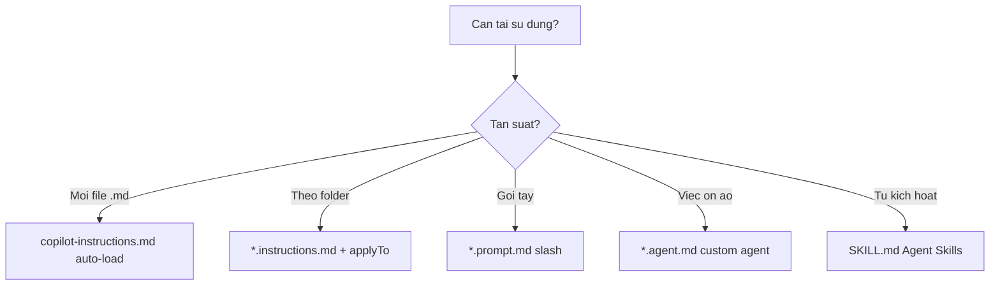

# FAQ 06 — Prompts, Agents & Instructions

> Nhóm Tùy biến tri thức · 10 câu hỏi deep-dive · Đọc xong fix mọi ca "không load, applyTo sai, frontmatter lỗi"

File này trả lời mọi câu hỏi "prompt files/agents/skills/instructions không load, applyTo sai, frontmatter lỗi". Mỗi câu có giải thích + lệnh copy-paste + ví dụ + khi nào áp dụng.

---

## Sơ đồ tư duy nhanh (đọc 30 giây)



## Bảng tổng hợp: file nào để ở đâu (2026)

| Loại file | Đường dẫn chuẩn | Kích hoạt | Trạng thái 2026 |
|---|---|---|---|
| Project instructions | `.github/copilot-instructions.md` | Tự động mọi chat/completion | Chính thức |
| Path instructions | `.github/instructions/*.instructions.md` | Tự động khi file khớp `applyTo` | Chính thức |
| Agent Skill | `.github/skills/<ten>/SKILL.md` | Model tự gọi khi khớp `description` | **KHUYÊN DUNG (chạy Local + Cloud + CLI)** |
| Custom agent | `.github/agents/*.agent.md` | Chọn trong agent picker | Chính thức |
| Prompt tái dùng (legacy) | `.github/prompts/*.prompt.md` | Gọi tay `/tên-prompt` | **Deprecated cho Agent Host** (Local vẫn chạy) |

---

## 1. File nào Copilot tự load, file nào phải gọi tay?

> **Hỏi ngắn gọn:** _File nào Copilot tự load, file nào phải gọi tay?_

**Trả lời 1 câu:** 

**Giải thích chi tiết + ví dụ:**

- **Tự load:** `copilot-instructions.md` (mọi lúc) + `*.instructions.md` khớp `applyTo` (khi đụng file tương ứng).
- **Gọi tay:** `*.prompt.md` (slash command trong chat — **legacy, deprecated cho Agent Host**), custom agent (chọn trong picker rồi chat).
- **Model tự quyết:** Skills (`SKILL.md` có `description`) — model đọc mô tả skill rồi tự gọi khi task khớp, bạn không cần nhớ tên. **Chuẩn khuyến nghị 2026 (chạy mọi harness).**

### Làm thế nào (steps copy-paste)

Copy từng bước theo thứ tự (dán vào terminal/IDE là chạy):

```bash
# Cây thư mục chuẩn (đứng ở root repo)
find .github -type f | sort
# Kỳ vọng:
# .github/copilot-instructions.md
# .github/instructions/backend-api.instructions.md
# .github/prompts/review-pr.prompt.md
# .github/agents/tester.agent.md
# .github/skills/review-pr/SKILL.md
```

**Ví dụ cụ thể:** hỏi về API mà Copilot không theo chuẩn backend → check `find .github` thấy thiếu `backend-api.instructions.md` → copy từ templates.

> **Khi nào áp dụng:** khi "đã tạo file mà Copilot không biết" — check đường dẫn + tên file trước tiên.

> **Nếu vẫn lỗi thì...** thử theo thứ tự: (1) làm lại bước copy-paste với scope gọn hơn (1 file/selection), (2) đổi model (`/model`) rồi chạy lại, (3) tra “Vẫn lỗi thì sao?” cuối file này, (4) hỏi admin (policy/seat) hoặc mở issue với log + ảnh chụp lỗi.
---

## 2. `applyTo` viết sao cho đúng (glob hay sai nhất)?

> **Hỏi ngắn gọn:** _`applyTo` viết sao cho đúng (glob hay sai nhất)?_

**Trả lời 1 câu:** 

**Giải thích chi tiết + ví dụ:** `applyTo` là glob quyết định instructions nào "ăn" vào file nào. Sai phổ biến:

- `applyTo: backend/**` nhưng code thật ở `apps/api/**` → không khớp.
- `applyTo: **/*.ts` muốn chỉ frontend nhưng ăn cả backend.
- Quên `**/` đầu → chỉ khớp root, không khớp sâu.

### Làm thế nào (steps copy-paste)

Copy từng bước theo thứ tự (dán vào terminal/IDE là chạy):

```yaml
# Đúng cho repo apps/api + apps/web:
# backend-api.instructions.md
applyTo: "apps/api/**/*"
# frontend-react.instructions.md
applyTo: "apps/web/**/*.{ts,tsx}"
```

```bash
# Test glob khớp file nào (bash): liệt kê file sẽ "ăn" instructions đó
ls apps/api/**/*.ts 2>/dev/null | head -5   # nếu rỗng -> glob sai
```

**Ví dụ cụ thể:** repo NestJS ở `services/api/src/**` → `applyTo: "services/api/**/*"` (lấy theo root thật, không đoán).

> **Khi nào áp dụng:** mỗi khi tạo/sửa `*.instructions.md` — đối chiếu glob với `ls`/`find` thật.

> **Nếu vẫn lỗi thì...** thử theo thứ tự: (1) làm lại bước copy-paste với scope gọn hơn (1 file/selection), (2) đổi model (`/model`) rồi chạy lại, (3) tra “Vẫn lỗi thì sao?” cuối file này, (4) hỏi admin (policy/seat) hoặc mở issue với log + ảnh chụp lỗi.
---

## 3. Frontmatter lỗi — các bẫy phổ biến?

> **Hỏi ngắn gọn:** _Frontmatter lỗi — các bẫy phổ biến?_

**Trả lời 1 câu:** 

**Giải thích chi tiết + ví dụ:** Frontmatter = block `---` đầu file chứa metadata (`mode`, `agent`, `tools`, `applyTo`, `description`). Bẫy top:

1. Thiếu `---` mở/đóng → cả file thành body, metadata mất.
2. Sai tên key (`applyto`, `ApplyTo`) → key đúng là `applyTo` (camelCase).
3. Quên quote glob có `*` → YAML parse sai (`applyTo: **/*` phải quote).
4. `tools:` liệt kê tool không tồn tại → agent lỗi lúc chạy.

### Làm thế nào (steps copy-paste)

Copy từng bước theo thứ tự (dán vào terminal/IDE là chạy):

```bash
# Check frontmatter 1 file: 5 dòng đầu phải là --- ... ---
head -8 .github/prompts/review-pr.prompt.md

# Validate YAML frontmatter bằng python (cắt block --- đầu)
python3 - <<'PY'
import re
text = open('.github/prompts/review-pr.prompt.md').read()
m = re.match(r'^---\n(.*?)\n---\n', text, re.S)
print("FRONTMATTER OK" if m else "THIEU/SAI frontmatter")
import yaml if False else None
PY
```

**Ví dụ mẫu đúng:**

```markdown

> **Nếu vẫn lỗi thì...** thử theo thứ tự: (1) làm lại bước copy-paste với scope gọn hơn (1 file/selection), (2) đổi model (`/model`) rồi chạy lại, (3) tra “Vẫn lỗi thì sao?” cuối file này, (4) hỏi admin (policy/seat) hoặc mở issue với log + ảnh chụp lỗi.
---
mode: agent
description: Review PR theo checklist correctness/security/tests
tools: [github-mcp, search, edit]
---
```

> **Khi nào áp dụng:** khi prompt/agent "không hiện trong picker" — 70% là frontmatter hỏng.

---

## 4. `copilot-instructions.md` bao nhiêu dòng là vừa, dài quá sao?

> **Hỏi ngắn gọn:** _`copilot-instructions.md` bao nhiêu dòng là vừa, dài quá sao?_

**Trả lời 1 câu:** 

**Giải thích chi tiết + ví dụ:** Giữ **<200 dòng**. Dài quá → context phình, phần cuối bị cắt, quan trọng chìm. Cách gọn:

- File chính: stack + lệnh verified + rules ALWAYS/NEVER (ngắn gọn).
- Chi tiết theo path → `instructions/*.instructions.md`.
- Procedure dài (deploy, add-table) → **`.github/skills/<ten>/SKILL.md`** (chuẩn 2026, khuyến nghị). `*.prompt.md` (legacy) vẫn chạy Local.

### Làm thế nào (steps copy-paste)

Copy từng bước theo thứ tự (dán vào terminal/IDE là chạy):

```bash
# Đo độ dài + tìm chỗ cắt
wc -l .github/copilot-instructions.md .github/instructions/*.md
# >200 dòng ở file chính -> tách bớt sang instructions con
```

**Ví dụ cụ thể:** file chính 350 dòng (cả chuẩn React + API + deploy) → tách React sang `frontend-react.instructions.md`, deploy sang `deploy.prompt.md` → chính còn 120 dòng.

> **Khi nào áp dụng:** mỗi quý review 1 lần, hoặc khi thêm stack mới vào repo.

> **Nếu vẫn lỗi thì...** thử theo thứ tự: (1) làm lại bước copy-paste với scope gọn hơn (1 file/selection), (2) đổi model (`/model`) rồi chạy lại, (3) tra “Vẫn lỗi thì sao?” cuối file này, (4) hỏi admin (policy/seat) hoặc mở issue với log + ảnh chụp lỗi.
---

## 5. Instructions không load — checklist 6 bước?

> **Hỏi ngắn gọn:** _Instructions không load — checklist 6 bước?_

**Trả lời 1 câu:** 

**Giải thích chi tiết + ví dụ:** Đi đúng thứ tự:

1. Tên file đúng `*.instructions.md` trong `.github/instructions/`?
2. Frontmatter có `applyTo` đúng glob?
3. File đang sửa có khớp glob? (test bằng `ls` ở câu 2)
4. IDE đã reload sau khi thêm file?
5. Chat mới hay chat cũ? (chat cũ giữ context cũ → mở chat mới)
6. Org policy có tắt custom instructions không? (hỏi admin)

### Làm thế nào (steps copy-paste)

Copy từng bước theo thứ tự (dán vào terminal/IDE là chạy):

```bash
# Chạy 1 lèo 4 check đầu
ls .github/instructions/*.instructions.md
head -6 .github/instructions/backend-api.instructions.md
ls apps/api/controller.ts 2>/dev/null || find . -name "*.ts" -path "*api*" | head -3
# Rồi: reload IDE + mở chat mới + hỏi "liệt kê quy tắc backend đang áp dụng"
```

**Ví dụ cụ thể:** thêm `backend-api.instructions.md` mà hỏi vẫn sai chuẩn → phát hiện chat cũ từ hôm qua → mở chat mới → instructions ăn ngay.

> **Khi nào áp dụng:** mọi ca instructions "không ăn" — 90% rơi vào 6 bước này.

> **Nếu vẫn lỗi thì...** thử theo thứ tự: (1) làm lại bước copy-paste với scope gọn hơn (1 file/selection), (2) đổi model (`/model`) rồi chạy lại, (3) tra “Vẫn lỗi thì sao?” cuối file này, (4) hỏi admin (policy/seat) hoặc mở issue với log + ảnh chụp lỗi.
---

## 6. Prompt files (`*.prompt.md`) gọi thế nào, khác gì chat thường? (**legacy**)

> **Hỏi ngắn gọn:** _Prompt files (`*.prompt.md`) gọi thế nào, khác gì chat thường?_

**Trả lời 1 câu:** 

**Giải thích chi tiết + ví dụ:** Prompt file = **kịch bản đóng gói**: frontmatter (`mode`, `agent`, `tools`) + body hướng dẫn từng bước. Gọi bằng `/tên-file` trong chat (không cần `.prompt.md`) hoặc nút Run trong editor.

> **Lưu ý 2026:** Prompt file **deprecated cho Agent Host** (Copilot/Cloud) — chỉ chạy Local/VS Code. Việc mới nên dùng **Agent Skill** (câu 8) vì chạy được mọi harness. Nếu repo bạn chỉ chạy Local và đã có prompt file ổn, giữ tạm — port dần (bài 05 mục 3.3).

Khác chat thường: prompt ép **mode + tools + steps cố định** → kết quả nhất quán giữa các lần, share được cả team.

### Làm thế nào (steps copy-paste)

Copy từng bước theo thứ tự (dán vào terminal/IDE là chạy):

```markdown

> **Nếu vẫn lỗi thì...** thử theo thứ tự: (1) làm lại bước copy-paste với scope gọn hơn (1 file/selection), (2) đổi model (`/model`) rồi chạy lại, (3) tra “Vẫn lỗi thì sao?” cuối file này, (4) hỏi admin (policy/seat) hoặc mở issue với log + ảnh chụp lỗi.
---
mode: agent
description: Review PR theo checklist
tools: [search, edit]
---
# Review PR
1. Lấy diff: `git diff main...HEAD --stat`
2. Check correctness / security / tests theo checklist
3. Trả về: Critical / Major / Minor + gợi ý sửa cụ thể
```

```bash
# Trong chat gọi: /review-pr  (không gõ đuôi .prompt.md)
```

**Ví dụ cụ thể:** `templates/.github/prompts/review-pr.prompt.md` → copy vào repo → chat `/review-pr` → mọi PR được review cùng 1 checklist.

> **Khi nào áp dụng:** việc lặp lại >3 lần/tuần (review, deploy, tạo table) → đóng gói thành prompt.

---

## 7. Custom agent (`*.agent.md`) viết sao, khi nào cần?

> **Hỏi ngắn gọn:** _Custom agent (`*.agent.md`) viết sao, khi nào cần?_

**Trả lời 1 câu:** 

**Giải thích chi tiết + ví dụ:** Custom agent = persona chuyên môn (explorer chỉ-đọc, tester chạy test, security-reviewer soi bảo mật) với `description` + `tools` giới hạn. Cần khi: muốn tách việc (đọc ồn giao explorer), hoặc ép kỷ luật (tester chỉ báo PASS/FAIL).

Không cần khi: task đơn giản 1-2 file — chat thường + instructions đủ.

### Làm thế nào (steps copy-paste)

Copy từng bước theo thứ tự (dán vào terminal/IDE là chạy):

```markdown

> **Nếu vẫn lỗi thì...** thử theo thứ tự: (1) làm lại bước copy-paste với scope gọn hơn (1 file/selection), (2) đổi model (`/model`) rồi chạy lại, (3) tra “Vẫn lỗi thì sao?” cuối file này, (4) hỏi admin (policy/seat) hoặc mở issue với log + ảnh chụp lỗi.
---
description: Trinh sát chỉ-đọc, trả về list files sẽ sửa/đọc
tools: [search]
---
# Explorer
- CHỈ đọc, KHÔNG sửa file, KHÔNG chạy lệnh ghi.
- Trả về: danh sách file liên quan + thứ tự đọc đề xuất.
```

```bash
ls .github/agents/  # explorer.agent.md tester.agent.md security-reviewer.agent.md
```

**Ví dụ cụ thể:** task refactor lớn → gọi explorer trước (lấy bản đồ file) → rồi mới agent sửa → ít lạc, ít tốn quota.

> **Khi nào áp dụng:** task multi-file hoặc cần kỷ luật đọc-trước-sửa-sau. Mẫu sẵn trong `templates/.github/agents/`.

---

## 8. Agent Skills 2026 (`SKILL.md`) khác gì prompt/agent? (chuẩn khuyến nghị)

> **Hỏi ngắn gọn:** _Agent Skills 2026 (`SKILL.md`) khác gì prompt/agent?_

**Trả lời 1 câu:** 

**Giải thích chi tiết + ví dụ:** Skill = gói **mô tả + procedure + tools** theo chuẩn Agent Skills 2026 (chuẩn mở), model **tự phát hiện và gọi** khi task khớp `description` — bạn không cần nhớ tên để gọi. Prompt phải gọi tay (và deprecated cho Cloud); skill thì model tự biết + chạy mọi harness.

Cấu trúc: `.github/skills/<ten>/SKILL.md` với frontmatter `name` + `description` rõ ràng (description càng cụ thể, model càng gọi đúng).

### Làm thế nào (steps copy-paste)

Copy từng bước theo thứ tự (dán vào terminal/IDE là chạy):

```markdown

> **Nếu vẫn lỗi thì...** thử theo thứ tự: (1) làm lại bước copy-paste với scope gọn hơn (1 file/selection), (2) đổi model (`/model`) rồi chạy lại, (3) tra “Vẫn lỗi thì sao?” cuối file này, (4) hỏi admin (policy/seat) hoặc mở issue với log + ảnh chụp lỗi.
---
name: review-pr
description: Dùng khi user nhờ review PR, diff, hoặc kiểm tra code trước merge. Không dùng cho việc viết feature mới.
---
# Review PR skill
...procedure + checklist + lệnh git diff...
```

**Ví dụ cụ thể:** user gõ "review giúp PR này" → model đọc descriptions các skills → tự nạp `review-pr` → chạy checklist chuẩn team mà user không cần gõ `/review-pr`.

> **Khi nào áp dụng:** procedure team muốn "tự động áp" mà không cần training member nhớ tên lệnh. Mẫu: `templates/.github/skills/review-pr/SKILL.md`.

---

## 9. Thứ tự ưu tiên khi nhiều instructions cùng khớp 1 file?

> **Hỏi ngắn gọn:** _Thứ tự ưu tiên khi nhiều instructions cùng khớp 1 file?_

**Trả lời 1 câu:** 

**Giải thích chi tiết + ví dụ:** Thứ tự (mạnh → yếu, gần thắng xa):

1. Prompt hiện tại bạn gõ (gần nhất, thắng hết).
2. `*.instructions.md` khớp path cụ thể (VD `apps/api/**` thắng `**/*`).
3. `copilot-instructions.md` (nền chung).
4. Org policy (trần cứng — cấm là cấm dù instructions cho phép).

Mâu thuẫn thì cái cụ thể + gần hơn thắng. Vì vậy đừng viết 2 instructions mâu thuẫn nhau cho cùng path.

### Làm thế nào (steps copy-paste)

Copy từng bước theo thứ tự (dán vào terminal/IDE là chạy):

```bash
# Tìm mọi instructions có thể ăn vào 1 file
grep -l "applyTo" .github/instructions/*.md
grep -h "applyTo" .github/instructions/*.md
# Nếu 2 file cùng khớp 1 path -> gộp hoặc làm rõ ranh giới glob
```

**Ví dụ cụ thể:** `backend-api.instructions.md` (`apps/api/**`) + `general.instructions.md` (`**/*`) cùng khớp `apps/api/x.ts` → quy tắc backend cụ thể được ưu tiên.

> **Khi nào áp dụng:** khi 2 instructions "đánh nhau" — thu hẹp glob để mỗi file chỉ bị 1 instructions chi phối mạnh.

> **Nếu vẫn lỗi thì...** thử theo thứ tự: (1) làm lại bước copy-paste với scope gọn hơn (1 file/selection), (2) đổi model (`/model`) rồi chạy lại, (3) tra “Vẫn lỗi thì sao?” cuối file này, (4) hỏi admin (policy/seat) hoặc mở issue với log + ảnh chụp lỗi.
---

## 10. Test instructions mới thêm có hiệu quả không?

> **Hỏi ngắn gọn:** _Test instructions mới thêm có hiệu quả không?_

**Trả lời 1 câu:** 

**Giải thích chi tiết + ví dụ:** 3 test nhanh sau khi thêm/sửa:

1. **Test load:** chat mới → "liệt kê quy tắc đang áp dụng cho `apps/api/x.ts`" → xem nó kể đúng không.
2. **Test hành vi:** giao task nhỏ vi phạm quy tắc → xem nó có tuân thủ (VD bảo sửa migration bị cấm → phải từ chối).
3. **Test nhiễu:** hỏi task ngoài scope → đảm bảo instructions hẹp không làm hỏng task khác.

### Làm thế nào (steps copy-paste)

Copy từng bước theo thứ tự (dán vào terminal/IDE là chạy):

```bash
# Test 1+3 trong 1 chat mới:
# "Liệt kê quy tắc áp dụng cho apps/api/auth.ts.
#  Sau đó giải thích hàm map trong JS (không liên quan backend)."
# Đạt: kể đúng rules backend + trả lời JS bình thường (không nhồi backend context)
```

**Ví dụ cụ thể:** thêm quy tắc "NEVER sửa migrations" → test: "sửa giúp migration 003" → Copilot phải từ chối + đề xuất tạo migration mới.

> **Khi nào áp dụng:** sau mọi lần sửa instructions — 2 phút test đỡ 2 tuần "sao nó không nghe".

> **Nếu vẫn lỗi thì...** thử theo thứ tự: (1) làm lại bước copy-paste với scope gọn hơn (1 file/selection), (2) đổi model (`/model`) rồi chạy lại, (3) tra “Vẫn lỗi thì sao?” cuối file này, (4) hỏi admin (policy/seat) hoặc mở issue với log + ảnh chụp lỗi.
---

## Vẫn lỗi thì sao? (thứ tự debug chuẩn)

1. `find .github -type f | sort` — đúng đường dẫn + tên file.
2. `head -8` từng file — frontmatter đủ `---` + key đúng.
3. Glob `applyTo` đối chiếu `ls` thật.
4. Reload IDE + mở chat mới.
5. Hỏi admin: org có tắt custom instructions không.

```bash
find .github -type f | sort && head -6 .github/instructions/*.md .github/prompts/*.md 2>/dev/null
```

---

## Tham khảo chéo

- Viết quy tắc ALWAYS/NEVER: [bài 05](05-policies-guardrails-faq.md). Context + nhiễu: [bài 02](02-model-context-premium.md).
- Custom agent workflows: [bài 07](07-custom-agents-coding-agent-workflows.md). Mẫu copy ngay: [../templates/README.md](../templates/README.md).

> Mẹo 1 dòng: _đúng chỗ, đúng tên, applyTo đối chiếu bằng ls thật, và luôn test bằng chat mới._
