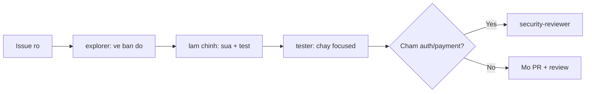

# FAQ 07 — Custom Agents & Coding Agent Workflows

> Nhóm Agent nâng cao · 10 câu hỏi deep-dive · Đọc xong hết agent loạn, coding agent PR sạch, không conflict

File này trả lời mọi câu hỏi "custom agent chạy loạn, coding agent conflict/PR fail". Mỗi câu có giải thích + lệnh copy-paste + ví dụ + khi nào áp dụng.

---

## Sơ đồ tư duy nhanh (đọc 30 giây)



## Bảng tổng hợp: agent nào việc nào

| Agent | Việc | Tools cho phép |
|---|---|---|
| explorer | Trinh sát chỉ-đọc, vẽ bản đồ file | search (đọc) |
| tester | Chạy test focused, báo PASS/FAIL | terminal test + đọc log |
| security-reviewer | Soi auth/input/crypto/secrets | search + đọc diff |
| coding agent (GitHub) | Làm task từ issue, mở PR | full trong sandbox + ruleset |

---

## 1. Custom agent "chạy loạn" — nguyên nhân và cách trị?

> **Hỏi ngắn gọn:** _Custom agent "chạy loạn" — nguyên nhân và cách trị?_

**Trả lời 1 câu:** Agent chạy loạn vì thiếu `tools` khóa quyền, thiếu ranh giới trong body, hoặc task quá to — trị bằng cách khóa tools + 3 dòng ranh giới + chia nhỏ task.

**Giải thích chi tiết + ví dụ:** Nôm na: agent không có ranh giới giống như thợ điện được giao "sửa cái này" mà chìa khóa toàn nhà trong túi — nó sửa luôn cái không được nhờ. "Loạn" = sửa file ngoài scope, chạy lệnh cấm, lặp vòng không xong. 3 nguyên nhân:

1. **Thiếu `tools` giới hạn** trong frontmatter → agent có full quyền.
2. **Thiếu ranh giới trong body:** không ghi "CHỈ đọc / KHÔNG sửa".
3. **Task quá to** → agent tự mở rộng scope để "cho xong".

2026: có thể ép thêm Agent Skills (chuẩn `SKILL.md`, thay prompt files legacy) để nạp đúng kiến thức cần, và hooks (preview, chỉ Local) để chặn lệnh ghi — nhưng hooks chưa phải security boundary, gate thật vẫn là `tools` + ranh giới trong issue.

### Làm thế nào (steps copy-paste)

Copy từng bước theo thứ tự (dán vào terminal/IDE là chạy):

```markdown
<!-- .github/agents/explorer.agent.md — trinh sat chi doc -->
---
description: Trinh sat chi doc, ve ban do file
tools: [search]
---
# Explorer — RANH GIỚI (đọc trước khi làm)
- CHỈ đọc file. KHÔNG sửa, KHÔNG chạy lệnh ghi, KHÔNG commit.
- Quá 10 file liên quan -> dừng, hỏi user chọn tiếp.
```

```bash
# Verify: agent chi doc, khong sua gi
gh pr list --author "app/copilot" --state open   # check PR moi (neu dung coding agent)
```

**Ví dụ cụ thể:** explorer không giới hạn tự sửa luôn code → thêm block `tools: [search]` + 3 dòng ranh giới trên → từ đó chỉ trả bản đồ file.

> **Khi nào áp dụng:** ngay khi tạo/sửa mọi `*.agent.md` — ranh giới viết trước procedure.

> **Nếu vẫn lỗi thì...** thử theo thứ tự: (1) làm lại bước copy-paste với scope gọn hơn (1 file/selection), (2) đổi model (`/model`) rồi chạy lại, (3) tra "Vẫn lỗi thì sao?" cuối file này, (4) hỏi admin (policy/seat) hoặc mở issue với log + ảnh chụp lỗi.
---

## 2. Bộ 3 explorer → làm → tester: workflow chuẩn?

> **Hỏi ngắn gọn:** _Bộ 3 explorer → làm → tester: workflow chuẩn?_

**Trả lời 1 câu:** Workflow chuẩn cho task lớn là 3 pha mỗi pha một chat: explorer vẽ bản đồ, pha làm sửa đúng list file, tester chạy test và báo PASS/FAIL.

**Giải thích chi tiết + ví dụ:** Nôm na: khảo sát → thi công → nghiệm thu, ba đoàn khác nhau, không gộp chung. Workflow 3 pha cho task >30 phút:

1. **Explorer:** "vẽ bản đồ" — file nào liên quan, thứ tự đọc, rủi ro.
2. **Làm (Edit/Agent):** sửa theo bản đồ, scope khóa theo list explorer.
3. **Tester:** chạy test focused + lint, báo PASS/FAIL + guess 1 dòng nếu đỏ.

Mỗi pha 1 chat (hoặc 1 agent call) để context gọn — tránh trường hợp agent tự lan sang "tránh chạy loạn" ở câu 1.

### Làm thế nào (steps copy-paste)

Copy từng bước theo thứ tự (dán vào terminal/IDE là chạy):

```bash
# Pha 1 (chat 1, agent explorer): "Ve ban do refactor login trong src/auth/, chua sua."
# Pha 2 (chat 2, edit/agent): "Sua theo list: <paste list explorer>. Chi cac file nay."
# Pha 3 (chat 3 hoac tester): "Chay npm test -- auth + npm run lint, bao PASS/FAIL."
# Verify: sau pha 3, test xanh thi moi commit
```

**Ví dụ cụ thể:** refactor auth 8 file → explorer trả list 8 file + thứ tự → pha 2 sửa đúng 8 file → tester chạy test xanh → commit.

> **Khi nào áp dụng:** mọi task multi-file. Task 1-2 file thì gộp pha 1+2.

> **Nếu vẫn lỗi thì...** thử theo thứ tự: (1) làm lại bước copy-paste với scope gọn hơn (1 file/selection), (2) đổi model (`/model`) rồi chạy lại, (3) tra "Vẫn lỗi thì sao?" cuối file này, (4) hỏi admin (policy/seat) hoặc mở issue với log + ảnh chụp lỗi.
---

## 3. Security-reviewer gọi khi nào, check gì?

> **Hỏi ngắn gọn:** _Security-reviewer gọi khi nào, check gì?_

**Trả lời 1 câu:** Gọi security-reviewer khi diff chạm auth/session, input validation, crypto, thanh toán, secrets, permissions hoặc SQL — nó chỉ đọc và comment, không sửa code.

**Giải thích chi tiết + ví dụ:** Nôm na: trước khi đóng cổng chính, cho lính gác soi lại 1 vòng. Checklist: injection (SQL/command), XSS, auth bypass, IDOR, secret lộ, crypto yếu, rate-limit.

Gọi sau pha làm, trước khi mở PR — reviewer này chỉ đọc + comment, không sửa. 2026: có thể đóng gói checklist này thành 1 Agent Skill (chuẩn `SKILL.md`) để agent nào cũng đọc được khi chạm auth/payment, thay prompt file legacy.

### Làm thế nào (steps copy-paste)

Copy từng bước theo thứ tự (dán vào terminal/IDE là chạy):

```bash
# Lay diff cho reviewer (trong chat attach hoac paste stat)
git diff main...HEAD --stat
git diff main...HEAD -- src/auth/ | head -100
# Verify: diff chua sua gi ngoai src/auth/
# Prompt: "Review security diff tren. Chi bao Critical/Major + dong cu the + cach fix."
```

**Ví dụ cụ thể:** PR thêm endpoint `/admin/export` → security-reviewer phát hiện thiếu check role → thêm middleware trước khi merge.

> **Khi nào áp dụng:** auto-trigger (quy ước team): diff chạm `auth|payment|crypto|admin` → bắt buộc qua security-reviewer. Mẫu agent trong `templates/.github/agents/security-reviewer.agent.md`.

> **Nếu vẫn lỗi thì...** thử theo thứ tự: (1) làm lại bước copy-paste với scope gọn hơn (1 file/selection), (2) đổi model (`/model`) rồi chạy lại, (3) tra "Vẫn lỗi thì sao?" cuối file này, (4) hỏi admin (policy/seat) hoặc mở issue với log + ảnh chụp lỗi.
---

## 4. Coding agent trên GitHub là gì, giao việc thế nào?

> **Hỏi ngắn gọn:** _Coding agent trên GitHub là gì, giao việc thế nào?_

**Trả lời 1 câu:** Coding agent là bot chạy trên cloud GitHub nhận việc từ issue (assign cho `copilot`), tự code + chạy test + mở PR trong ~10 phút, bạn review như review người thật.

**Giải thích chi tiết + ví dụ:** Nôm na: thuê đội thi công qua đêm — sáng dậy chỉ cần xem PR. Bạn giao việc qua 2 CLI: `gh copilot assign` (CLI chuẩn coding agent) hoặc web "Assign to Copilot". Giao việc chuẩn: issue mô tả **mục tiêu + phạm vi file + tiêu chí xong (acceptance criteria) + lệnh test**. 2026: AI Credits được trừ theo token model — task to tốn nhiều hơn, luôn ghi lệnh verify trong issue để agent tự check.

### Làm thế nào (steps copy-paste)

Copy từng bước theo thứ tự (dán vào terminal/IDE là chạy):

```markdown
<!-- Mau issue giao cho coding agent -->
## Mục tiêu
Thêm rate-limit 100 req/phút cho /api/login.

## Phạm vi
- Chỉ sửa: src/auth/**, tests/auth/**
- KHÔNG đụng: infra/, db/migrations/

## Xong khi
- [ ] npm test -- auth xanh
- [ ] Có test cho case vượt limit (expect 429)
- [ ] Mở PR về develop
```

```bash
# Verify: giao viec va theo doi PR
gh copilot assign 123 --repo acme/api
gh pr list --author "app/copilot" --state open
```

**Ví dụ cụ thể:** tạo issue trên → assign `copilot` → 10-20 phút sau có PR → bạn review diff + CI (xem [bài 10](10-ci-sdk-review-web.md)).

> **Khi nào áp dụng:** task rõ ràng, có test, scope hẹp — agent làm tốt. Task mơ hồ thì làm rõ issue trước.

> **Nếu vẫn lỗi thì...** thử theo thứ tự: (1) làm lại bước copy-paste với scope gọn hơn (1 file/selection), (2) đổi model (`/model`) rồi chạy lại, (3) tra "Vẫn lỗi thì sao?" cuối file này, (4) hỏi admin (policy/seat) hoặc mở issue với log + ảnh chụp lỗi.
---

## 5. Coding agent conflict / PR fail — xử lý sao?

> **Hỏi ngắn gọn:** _Coding agent conflict / PR fail — xử lý sao?_

**Trả lời 1 câu:** 3 ca phổ biến — conflict: rebase lên base mới; CI đỏ: đọc log job đầu tiên rồi comment `@copilot` bảo fix; PR sai scope: request changes hoặc checkout về sửa tay.

**Giải thích chi tiết + ví dụ:** Nôm na: PR của agent cũng "sập" như PR người thật — 3 kiểu hỏng:

1. **Conflict với main:** base branch trôi trong lúc agent làm → `gh` update branch hoặc bảo agent rebase.
2. **CI đỏ:** đọc log check đầu tiên đỏ → comment vào PR bảo agent fix ("fix `lint` job: ...").
3. **PR sai scope:** agent sửa lố → request changes liệt kê file cần revert, hoặc checkout PR về sửa tay.

### Làm thế nào (steps copy-paste)

Copy từng bước theo thứ tự (dán vào terminal/IDE là chạy):

```bash
# Xem PR cua agent + trang thai checks
gh pr view <NUM> --json title,state,mergeable,statusCheckRollup
gh pr checks <NUM>

# Verify: chi co job xanh thi moi merge

# Update branch cho PR (giai conflict don gian)
gh pr checkout <NUM>
git fetch origin && git rebase origin/main
git push --force-with-lease
```

**Ví dụ cụ thể:** PR agent CI đỏ job `test` → đọc log thấy thiếu import → comment trong PR: "@copilot thiếu import X ở file Y" → agent push fix.

> **Khi nào áp dụng:** mọi PR agent — review như review junior: check scope + CI + test trước khi merge.

> **Nếu vẫn lỗi thì...** thử theo thứ tự: (1) làm lại bước copy-paste với scope gọn hơn (1 file/selection), (2) đổi model (`/model`) rồi chạy lại, (3) tra "Vẫn lỗi thì sao?" cuối file này, (4) hỏi admin (policy/seat) hoặc mở issue với log + ảnh chụp lỗi.
---

## 6. Viết issue thế nào để coding agent làm đúng ngay lần 1?

> **Hỏi ngắn gọn:** _Viết issue thế nào để coding agent làm đúng ngay lần 1?_

**Trả lời 1 câu:** Viết issue đủ 5 phần — bối cảnh, mục tiêu, phạm vi file, acceptance criteria, lệnh verify — thì tỉ lệ PR xanh lần đầu cao gấp 3 lần issue 1 dòng.

**Giải thích chi tiết + ví dụ:** Nôm na: thiếu phần nào trong spec, agent tự đoán phần đó — và đoán sai. Công thức issue 5 phần: **Bối cảnh (1-2 câu) + Mục tiêu + Phạm vi file + Acceptance criteria + Lệnh verify.**

- Tốt: "Thêm 429 khi vượt 100 req/phút, chỉ src/auth/**, test expect 429, verify `npm test -- auth`."
- Dở: "Làm rate limit đi." (agent tự chọn lib, scope, không test)

2026: lệnh verify nên là lệnh đã ghi trong `.github/copilot-instructions.md` (khóa commands team) để agent dùng đúng test runner.

### Làm thế nào (steps copy-paste)

Copy từng bước theo thứ tự (dán vào terminal/IDE là chạy):

```markdown
## Bối cảnh
Login đang bị brute-force, cần rate-limit.

## Mục tiêu
... (như câu 4)

## Lệnh verify
npm test -- auth && npm run lint
```

```bash
# Verify: chay duoc lenh verify tren machine truoc khi giao issue
npm test -- auth
```

**Ví dụ cụ thể:** issue viết đủ 5 phần → agent ra PR xanh lần 1 (tỉ lệ cao gấp 3 lần issue 1 dòng, theo kinh nghiệm team).

> **Khi nào áp dụng:** trước khi assign — 5 phút viết issue kỹ đỡ 30 phút sửa PR.

> **Nếu vẫn lỗi thì...** thử theo thứ tự: (1) làm lại bước copy-paste với scope gọn hơn (1 file/selection), (2) đổi model (`/model`) rồi chạy lại, (3) tra "Vẫn lỗi thì sao?" cuối file này, (4) hỏi admin (policy/seat) hoặc mở issue với log + ảnh chụp lỗi.
---

## 7. Nhiều agents cùng làm 1 repo — tránh giẫm chân sao?

> **Hỏi ngắn gọn:** _Nhiều agents cùng làm 1 repo — tránh giẫm chân sao?_

**Trả lời 1 câu:** Áp dụng quy tắc 1 agent = 1 branch + 1 scope file không giao nhau; giao 2 agents cùng file thì conflict chắc chắn, phải chia theo module hoặc tầng.

**Giải thích chi tiết + ví dụ:** Nôm na: 2 đội thợ cùng 1 căn phòng thì đấm nhau vào đầu — mỗi đội nhận 1 phòng riêng. Quy tắc: **1 agent = 1 branch + 1 scope file không giao nhau.** Chia theo module (auth/payments) hoặc tầng (API/tests).

Theo dõi bằng PR list + branch prefix (`copilot/issue-<N>`). 2026: coding agent cloud và Copilot CLI chạy song song được trên các module khác nhau — chỉ cần scope rời.

### Làm thế nào (steps copy-paste)

Copy từng bước theo thứ tự (dán vào terminal/IDE là chạy):

```bash
# Xem agents dang lam gi (PR mo cua bot)
gh pr list --author "app/copilot" --state open

# Verify: 2 PR khong dong file chi nao
# Chia scope trong 2 issues:
# Issue A: "Chi src/auth/**"  |  Issue B: "Chi src/payments/**"
gh copilot assign 123 --repo acme/api
gh copilot assign 124 --repo acme/api
```

**Ví dụ cụ thể:** 2 features song song → 2 issues scope rời nhau → 2 PR riêng → merge từng cái, không conflict.

> **Khi nào áp dụng:** khi team chạy >1 coding agent cùng lúc — chia scope trong issue là bắt buộc.

> **Nếu vẫn lỗi thì...** thử theo thứ tự: (1) làm lại bước copy-paste với scope gọn hơn (1 file/selection), (2) đổi model (`/model`) rồi chạy lại, (3) tra "Vẫn lỗi thì sao?" cuối file này, (4) hỏi admin (policy/seat) hoặc mở issue với log + ảnh chụp lỗi.
---

## 8. Handoff người ↔ agent: tiếp tục dở dang thế nào?

> **Hỏi ngắn gọn:** _Handoff người ↔ agent: tiếp tục dở dang thế nào?_

**Trả lời 1 câu:** Hai chiều: người tiếp quản bằng `gh pr checkout` + sửa + push; agent tiếp quản bằng comment `@copilot` với yêu cầu cụ thể — luôn đọc PR timeline trước khi tiếp quản.

**Giải thích chi tiết + ví dụ:** Nôm na: bàn giao chìa khóa — người biết agent đã làm tới đâu, agent biết người đã sửa gì. 2 chiều:

- **Người tiếp quản agent:** `gh pr checkout <NUM>` → sửa tiếp → push (giữ branch agent).
- **Agent tiếp quản người:** comment `@copilot` trong PR/issue với yêu cầu cụ thể ("fix lint ở file X") → agent push thêm commit.

Luôn đọc PR timeline trước khi tiếp quản để biết agent đã làm tới đâu. 2026: cả 2 chiều đều chạy trên cùng 1 branch `copilot/issue-<N>`, không cần đổi tool.

### Làm thế nào (steps copy-paste)

Copy từng bước theo thứ tự (dán vào terminal/IDE là chạy):

```bash
# Nguoi tiep quan PR agent
gh pr checkout <NUM>
git log --oneline -5   # xem agent da lam gi
# ... sua tiep ...
git push

# Verify: da duoc push, agent bi dong

# Giao lai cho agent: comment trong PR (web hoac CLI)
gh pr comment <NUM> --body "@copilot fix loi lint o src/auth/login.ts dong 42"
```

**Ví dụ cụ thể:** agent làm 80% nhưng kẹt test khó → bạn checkout, fix 20% còn lại, merge — nhanh hơn chờ agent lặp.

> **Khi nào áp dụng:** khi agent lặp lần 3 không xong — người vào là hiệu quả nhất.

> **Nếu vẫn lỗi thì...** thử theo thứ tự: (1) làm lại bước copy-paste với scope gọn hơn (1 file/selection), (2) đổi model (`/model`) rồi chạy lại, (3) tra "Vẫn lỗi thì sao?" cuối file này, (4) hỏi admin (policy/seat) hoặc mở issue với log + ảnh chụp lỗi.
---

## 9. Đo chất lượng agent: khi nào tin, khi nào không?

> **Hỏi ngắn gọn:** _Đo chất lượng agent: khi nào tin, khi nào không?_

**Trả lời 1 câu:** Tin khi scope hẹp + test xanh + diff <300 dòng + không chạm auth/infra; không tin (review từng dòng) khi diff to, chạm migration/infra, không test, hoặc agent "sáng tạo" thêm scope.

**Giải thích chi tiết + ví dụ:** Nôm na: PR nhỏ + test xanh = tin được như đồng nghiệp đáng tin; PR to + không test = xem như junior mới vào. Tin khi: scope hẹp + có test xanh + diff nhỏ (<300 dòng) + không chạm auth/infra. Không tin (review kỹ từng dòng) khi: diff to, chạm migration/infra, không có test, agent tự "sáng tạo" thêm scope.

Thước đo team: tỉ lệ PR agent merge không sửa (target >60% sau 1 tháng fine-tune issue template). 2026: track bằng dashboard AI Credits ở `github.com/settings/copilot` — PR nào tốn nhiều credits nhất thì review kỹ trước.

### Làm thế nào (steps copy-paste)

Copy từng bước theo thứ tự (dán vào terminal/IDE là chạy):

```bash
# Danh gia nhanh PR agent truoc khi review sau
gh pr view <NUM> --json additions,deletions,files
git diff main...copilot/issue-N --stat
# Verify: additions >500 hoac files >10 -> review ky tung file
```

**Ví dụ cụ thể:** PR agent 40 dòng + test xanh → review 5 phút merge. PR 800 dòng chạm migrations → checkout review từng hunk.

> **Khi nào áp dụng:** mỗi PR agent — 30 giây xem stat trước khi đọc diff.

> **Nếu vẫn lỗi thì...** thử theo thứ tự: (1) làm lại bước copy-paste với scope gọn hơn (1 file/selection), (2) đổi model (`/model`) rồi chạy lại, (3) tra "Vẫn lỗi thì sao?" cuối file này, (4) hỏi admin (policy/seat) hoặc mở issue với log + ảnh chụp lỗi.
---

## 10. Dọn dẹp sau agent: branch, comment, log?

> **Hỏi ngắn gọn:** _Dọn dẹp sau agent: branch, comment, log?_

**Trả lời 1 câu:** Sau merge: xóa branch agent bằng `--delete-branch`, resolve comments, giữ issue + PR timeline làm tài liệu — không xóa issue vì đó là spec gốc.

**Giải thích chi tiết + ví dụ:** Nôm na: công trình xong — dỡ công trường, nhưng giữ hồ sơ thiết kế. Sau merge: xóa branch agent (`gh pr merge --delete-branch`), resolve comments, giữ lại issue + PR timeline làm tài liệu. Đừng xóa issue — đó là spec gốc.

2026: AI Credits đã trả cho agent nên log PR là bằng chứng việc làm — giữ làm audit khi cần justify chi phí.

### Làm thế nào (steps copy-paste)

Copy từng bước theo thứ tự (dán vào terminal/IDE là chạy):

```bash
# Merge + xoa branch 1 lenh
gh pr merge <NUM> --squash --delete-branch

# Verify: branch da thanh ly
git branch -r | grep "copilot/issue-"
gh pr list --author "app/copilot" --state closed --limit 20
```

**Ví dụ cụ thể:** cuối tuần dọn: merge 3 PR agent xanh → `--delete-branch` → repo còn mỗi `main/develop` sạch.

> **Khi nào áp dụng:** sau mỗi PR agent merge, và dọn định kỳ hàng tuần.

> **Nếu vẫn lỗi thì...** thử theo thứ tự: (1) làm lại bước copy-paste với scope gọn hơn (1 file/selection), (2) đổi model (`/model`) rồi chạy lại, (3) tra "Vẫn lỗi thì sao?" cuối file này, (4) hỏi admin (policy/seat) hoặc mở issue với log + ảnh chụp lỗi.
---

## Vẫn lỗi thì sao? (thứ tự debug chuẩn)

1. Agent loạn → check `tools` + ranh giới trong `*.agent.md`.
2. Scope lố → thu hẹp issue/prompt, chia task nhỏ.
3. PR fail → `gh pr checks` đọc log job đỏ đầu tiên.
4. Conflict → rebase lên base mới nhất.
5. Lặp 3 lần không xong → người checkout làm tiếp, đừng đốt quota.

```bash
# Verify: dua lenh chuan
gh pr checks <NUM> && git diff main...HEAD --stat
```

---

## Tham khảo chéo

- Viết agent đúng: [bài 06](06-prompts-agents-instructions.md). CI + review PR agent: [bài 10](10-ci-sdk-review-web.md).
- Permissions + approval: [bài 03](03-modes-permissions.md). Guardrails repo: [bài 05](05-policies-guardrails-faq.md).

> Mẹo 1 dòng: _1 agent 1 branch 1 scope, issue đủ 5 phần, và người vào ngay khi agent lặp lần 3._
