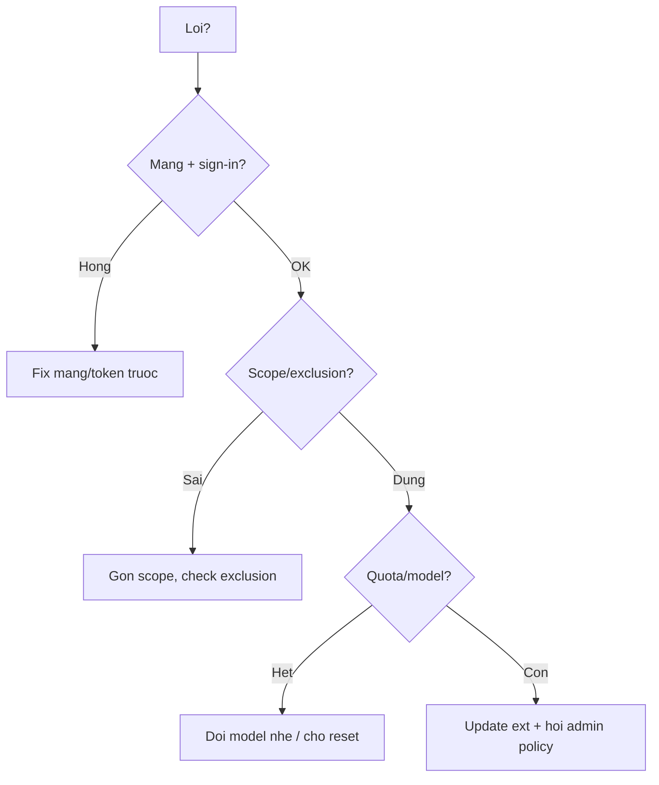

# FAQ 08 — Lỗi Thường Gặp & Troubleshooting

> Nhóm Sửa lỗi · 10 câu hỏi deep-dive · Đọc xong tự fix 90% ca, biết thứ tự debug chuẩn

File này trả lời mọi câu hỏi "Copilot offline, no suggestions, chat error, CLI fail, thứ tự debug". Mỗi câu có giải thích + lệnh copy-paste + ví dụ + khi nào áp dụng.

---

## Sơ đồ tư duy nhanh (đọc 30 giây)



## Bảng tổng hợp: lỗi nào đọc câu nào

| Triệu chứng | Câu | Fix 1 dòng |
|---|---|---|
| Status bar báo Offline | 1 | Check mạng + sign-in lại |
| Gõ không ra gợi ý xám | 2 | Check file type + exclusion + restart |
| Chat báo error / quota | 3 | Chat mới + check quota |
| `gh copilot` fail | 4 | Update gh + extension |
| MCP tools mất | 5 | Xem bài 04 |
| Instructions không ăn | 6 | Xem bài 06 |
| Agent lặp / đơ | 7 | Dừng + chia task |
| Sau update IDE thì hỏng | 8 | Update extension theo |
| Nghi policy chặn | 9 | Hỏi admin Policies tab |
| Không rõ nguyên nhân | 10 | Thứ tự debug tổng |

---

## 1. Copilot báo Offline — vì sao, fix sao?

> **Hỏi ngắn gọn:** _Copilot báo Offline — vì sao, fix sao?_

**Trả lời 1 câu:** "Offline" nghĩa là extension không nối được server GitHub — nguyên nhân luôn rơi vào 1 trong 4: mất mạng, proxy/firewall chặn, token hết hạn, GitHub incident.

**Giải thích chi tiết + ví dụ:** Nôm na: đèn 4G yếu mà bạn trách app — trước hết phải kiểm tra sóng. "Offline" = extension không nối được server GitHub. 4 nguyên nhân: mất mạng, proxy/firewall chặn, token hết hạn, GitHub incident.

> **Khi nào áp dụng:** ngay khi status bar đỏ Offline — check mạng trước, config sau. Khi status bar Offline, cả 2 CLI (gh copilot + binary copilot) + coding agent cloud vẫn hoạt động nếu có mạng — chỉ IDE bị ảnh hưởng.

```bash
# 1. Mang toi GitHub con khong
curl -s -m 10 -o /dev/null -w "%{http_code}\n" https://api.github.com
# Verify: tra ve 200 / 401 (200 = mang OK)

# 2. Proxy/firewall (may cong ty hay dinh): check env proxy
env | grep -i proxy

# 3. GitHub co incident khong: https://www.githubstatus.com
curl -s https://www.githubstatus.com/api/v2/status.json | head -c 300; echo
```

**Ví dụ cụ thể:** máy công ty qua proxy → `api.github.com` timeout dù web vẫn mở (proxy chỉ allow browser) → xin IT whitelist `*.github.com` + `*.githubcopilot.com`.

> **Khi nào áp dụng:** ngay khi status bar đỏ Offline — check mạng trước, config sau.

> **Nếu vẫn lỗi thì...** thử theo thứ tự: (1) làm lại bước copy-paste với scope gọn hơn (1 file/selection), (2) đổi model (`/model`) rồi chạy lại, (3) tra "Vẫn lỗi thì sao?" cuối file này, (4) hỏi admin (policy/seat) hoặc mở issue với log + ảnh chụp lỗi.
---

## 2. No suggestions (gõ không ra gợi ý xám)?

> **Hỏi ngắn gọn:** _No suggestions (gõ không ra gợi ý xám)?_

**Trả lời 1 câu:** Không ra gợi ý thường do 6 nguyên nhân có thứ tự — file type không hỗ trợ, bị exclusion, chưa bật completions, token hết hạn, extension xung đột, hoặc code "lạ" — chạy checklist 6 bước để khoanh vùng.

**Giải thích chi tiết + ví dụ:** Nôm na: gõ không ra gợi ý giống như gõ mà bàn phím tự tắt — lần lượt kiểm tra mỗi lớp. Checklist 6 bước theo thứ tự:

1. File có được hỗ trợ không (plaintext/log thì không gợi ý).
2. File có nằm trong exclusion không (`.vscode/settings.json`, org policy).
3. Copilot có bật cho file type đó không (check status bar: enable/disable).
4. Sign-in còn hạn không (token hết → silent fail).
5. Extension xung đột (2 plugin đè nhau).
6. Thử file mới hello-world để loại trừ "code quá lạ".

> **Khi nào áp dụng:** mọi ca "chỗ có chỗ không" — so sánh file lỗi vs file test để khoanh vùng. 2026: exclusion có 2 mức (file + content), xem [bài 03](03-modes-permissions.md) câu 3 — mức content chặn cả file nằm trong thư mục exclusion.

```bash
# Trong VS Code: Ctrl+Shift+P -> "Copilot: Check Status" / "Enable Completions"
# Test voi file moi:
printf 'def add(a, b):\n' > /tmp/copilot-test.py && code /tmp/copilot-test.py
# Verify: co goi y o file test ma file du an khong -> do exclusion/content file du an
```

**Ví dụ cụ thể:** chỉ file `secrets/` không gợi ý, chỗ khác có → đúng ý exclusion, không phải lỗi.

> **Khi nào áp dụng:** mọi ca "chỗ có chỗ không" — so sánh file lỗi vs file test để khoanh vùng.

> **Nếu vẫn lỗi thì...** thử theo thứ tự: (1) làm lại bước copy-paste với scope gọn hơn (1 file/selection), (2) đổi model (`/model`) rồi chạy lại, (3) tra "Vẫn lỗi thì sao?" cuối file này, (4) hỏi admin (policy/seat) hoặc mở issue với log + ảnh chụp lỗi.
---

## 3. Chat error / quota exhausted / model unavailable?

> **Hỏi ngắn gọn:** _Chat error / quota exhausted / model unavailable?_

**Trả lời 1 câu:** Đọc kỹ message trước khi kết luận sập — `quota exhausted` là hết AI Credits (đổi model nhẹ/đợi reset), `model unavailable` là incident hoặc org tắt model, `500` thì mở chat mới.

**Giải thích chi tiết + ví dụ:** Nôm na: 3 loại báo lỗi khác nhau giống 3 mã lỗi khác nhau trên dashboard — đọc mã đúng mới xử đúng. 3 loại:

- `quota exhausted` → hết premium (xem [bài 02](02-model-context-premium.md)): đổi model nhẹ, chờ reset. 2026: quota đo bằng **AI Credits** (1 credit = $0.01), xem dashboard `github.com/settings/copilot`.
- `model unavailable` → model đang incident hoặc org tắt: đổi model khác.
- `something went wrong / 500` → thử chat mới; còn lỗi thì chờ + báo GitHub status.

> **Khi nào áp dụng:** trước khi kết luận "Copilot sập" — đổi model + chat mới loại trừ 80% ca. Chat Agent mode (2026) tốn AI Credits theo turn — quota exhausted giữa task agent thì chuyển sang model nhẹ hơn thay vì đợi.

```bash
# Khong co CLI; thao tac:
# 1. Mo chat moi (Ctrl+Shift+P -> "Chat: New Chat")
# 2. Doi model trong picker sang model khac
# 3. Check quota: https://github.com/settings/copilot
# 4. Check incident: https://www.githubstatus.com
# Verify: chat moi + model khac chay duoc -> loi do model cu
```

**Ví dụ cụ thể:** chat báo `model unavailable` cho Claude → đổi sang GPT trong picker → chạy ngay → lỗi do model, không phải account.

> **Khi nào áp dụng:** trước khi kết luận "Copilot sập" — đổi model + chat mới loại trừ 80% ca.

> **Nếu vẫn lỗi thì...** thử theo thứ tự: (1) làm lại bước copy-paste với scope gọn hơn (1 file/selection), (2) đổi model (`/model`) rồi chạy lại, (3) tra "Vẫn lỗi thì sao?" cuối file này, (4) hỏi admin (policy/seat) hoặc mở issue với log + ảnh chụp lỗi.
---

## 4. `gh copilot` CLI fail (command not found / auth)?

> **Hỏi ngắn gọn:** _`gh copilot` CLI fail (command not found / auth)?_

**Trả lời 1 câu:** 3 lỗi top là chưa cài extension `gh-copilot`, chưa `gh auth login`, hoặc account không có seat — chạy 4 lệnh bên dưới để bắt đúng loại.

**Giải thích chi tiết + ví dụ:** Nôm na: CLI chết mà IDE sống (hoặc ngược lại) là 2 "thằng" có auth riêng — fix auth từng thằng. 3 lỗi top:

| Lỗi | Nghĩa | Fix |
|---|---|---|
| `unknown command "copilot"` | Chưa cài extension | `gh extension install github/gh-copilot` |
| `auth failed` | `gh` chưa login / token hết | `gh auth login --web` |
| `No seat` | Account không có seat | Xin admin assign (bài 01) |

| Lỗi | Nghĩa | Fix |
|---|---|---|
| `unknown command "copilot"` | Chưa cài extension | `gh extension install github/gh-copilot` |
| `auth failed` | `gh` chưa login / token hết | `gh auth login --web` |
| `No seat` | Account không có seat | Xin admin assign (bài 01) |

```bash
gh --version
gh extension list | grep -i copilot || gh extension install github/gh-copilot
gh auth status
# Verify: suggest chay duoc
gh copilot suggest "list files by size" --no-interactive 2>&1 | head -10
```

**Ví dụ cụ thể:** `gh copilot suggest` báo auth failed sau đổi pass GitHub → `gh auth login --web` lại → chạy. 2026: ngoài `gh copilot` (gh extension) còn có Copilot CLI binary độc lập (`copilot init`, 3 chế độ interactive/plan/autopilot) — 2 CLI, đọc lại [bài 12](../01-huong-dan-su-dung/12-copilot-sdk-ci-cd-automation.md) mục "Lưu ý 2026".

> **Khi nào áp dụng:** khi CLI chết mà IDE vẫn sống (hoặc ngược lại) — fix auth từng thằng riêng.

> **Nếu vẫn lỗi thì...** thử theo thứ tự: (1) làm lại bước copy-paste với scope gọn hơn (1 file/selection), (2) đổi model (`/model`) rồi chạy lại, (3) tra "Vẫn lỗi thì sao?" cuối file này, (4) hỏi admin (policy/seat) hoặc mở issue với log + ảnh chụp lỗi.
---

## 5. MCP tools đột nhiên mất — thứ tự check?

> **Hỏi ngắn gọn:** _MCP tools đột nhiên mất — thứ tự check?_

**Trả lời 1 câu:** MCP tools mất luôn theo thứ tự: validate JSON config, test transport (token/env), reload IDE, đọc Output log — không sửa config vội.

**Giải thích chi tiết + ví dụ:** Nôm na: ki-ốt (MCP server) ngoài siêu thị bị mất — lần lượt kiểm tra: hợp đồng (JSON), mạng (env/token), cửa hàng (IDE reload), rồi mới đọc nhật ký (log). Xem chi tiết [bài 04](04-mcp-faq.md). Tóm tắt 30 giây: validate JSON → test transport → check token → reload IDE → đọc Output log. 2026: Copilot CLI từ v1.0.39 **không còn đọc** `.vscode/mcp.json` (breaking) — CLI dùng `~/.mcp-config.json` + `.mcp.json`.

```bash
python3 -c "import json; json.load(open('.vscode/mcp.json')); print('JSON OK')"
# Verify: JSON OK roi moi sang buoi tiep
echo ${GITHUB_MCP_TOKEN:+TOKEN_OK}
node --version
# Roi: reload IDE -> View -> Output -> chon MCP server -> doc loi
```

**Ví dụ cụ thể:** sau restart máy tools mất → `echo $TOKEN` rỗng (env export trong session cũ mất) → export lại + mở IDE từ terminal.

> **Khi nào áp dụng:** mọi ca MCP đỏ — đừng sửa config vội, check env + JSON trước.

> **Nếu vẫn lỗi thì...** thử theo thứ tự: (1) làm lại bước copy-paste với scope gọn hơn (1 file/selection), (2) đổi model (`/model`) rồi chạy lại, (3) tra "Vẫn lỗi thì sao?" cuối file này, (4) hỏi admin (policy/seat) hoặc mở issue với log + ảnh chụp lỗi.
---

## 6. Completions gợi ý sai chuẩn team dù đã có instructions?

> **Hỏi ngắn gọn:** _Completions gợi ý sai chuẩn team dù đã có instructions?_

**Trả lời 1 câu:** Completions đọc ít context hơn chat nên dễ bỏ qua instructions dài — fix bằng cách rút ngắn quy tắc và đặt ví dụ code mẫu ngay trong `.github/copilot-instructions.md`.

**Giải thích chi tiết + ví dụ:** Nôm na: autocomplete là thợ tay nghề — nó học theo mẫu (pattern gần) chứ không đọc nội quy (quy tắc xa). Completions (gõ tay) đọc ít context hơn chat — nó có thể bỏ qua instructions dài. Fix: giữ quy tắc quan trọng NGẮN + đặt ví dụ code mẫu ngay trong instructions (model bắt chước pattern gần hơn là đọc quy tắc xa).

```markdown
<!-- Trong .github/copilot-instructions.md (chuẩn 2026, read moi chat)
     Vi cu the thuan Quy tac chung -->
## Chuẩn error (copy pattern này)
```ts
return res.status(400).json({ code: "BAD_INPUT", message, requestId });
```
```

> **Khi nào áp dụng:** khi chat đúng mà gõ tay sai — bổ sung ví dụ code, đừng viết thêm chữ. 2026: không nhét ví dụ vào prompt files (legacy, deprecated cho Agent Host) — đặt trong `copilot-instructions.md` hoặc Agent Skill (chuẩn 2026) để chạy mọi harness (xem [bài 05](05-prompt-files-custom-instructions.md)).

```markdown
<!-- Trong instructions: vi cu the thu Quy tac chung -->
## Chuẩn error (copy pattern này)
```ts
return res.status(400).json({ code: "BAD_INPUT", message, requestId });
```
```

```bash
# Verify: goi y xam da ra theo shape tren
# Gõ thử: return res.status(400).json({
```

**Ví dụ cụ thể:** quy tắc "dùng error shape chuẩn" không ăn ở completions → thêm đoạn code mẫu 3 dòng → gợi ý xám bắt đầu ra đúng shape.

> **Khi nào áp dụng:** khi chat đúng mà gõ tay sai — bổ sung ví dụ code, đừng viết thêm chữ.

> **Nếu vẫn lỗi thì...** thử theo thứ tự: (1) làm lại bước copy-paste với scope gọn hơn (1 file/selection), (2) đổi model (`/model`) rồi chạy lại, (3) tra "Vẫn lỗi thì sao?" cuối file này, (4) hỏi admin (policy/seat) hoặc mở issue với log + ảnh chụp lỗi.
---

## 7. Agent lặp vòng / đơ / chạy mãi không xong?

> **Hỏi ngắn gọn:** _Agent lặp vòng / đơ / chạy mãi không xong?_

**Trả lời 1 câu:** Agent lặp vòng khi cùng 1 lỗi lặp 3 lần hoặc task nhỏ chạy >20 phút — xử lý bằng cách Cancel → đọc log vòng cuối → chia task nhỏ → chạy lại từng phần, không để chạy tiếp.

**Giải thích chi tiết + ví dụ:** Nôm na: thợ cứ lặp 1 thao tác sai 3 lần là bạn đứng ra — không để thợ tự "biết đâu được". Dấu hiệu cần can thiệp: lặp cùng lỗi 3 lần, chạy >20 phút task nhỏ, tool calls toàn retry. Xử lý: **Dừng (Cancel) → đọc log vòng cuối → chia task → chạy lại từng phần.** Đừng để chạy tiếp "biết đâu được" — chỉ đốt AI Credits (2026: quota đo bằng credits, xem [bài 02](02-model-context-premium.md)).

```bash
# Sau khi Cancel agent:
git status --short   # xem no da sua gi truoc khi lap
git diff --stat      # danh gia: giu phan dung, bo phan loan
# Verify: giu duoc phan dung roi moi chia task
# Roi mo chat moi voi task da chia nho + scope khóa
```

**Ví dụ cụ thể:** agent migrate 10 file lặp ở file 7 → Cancel → giữ 6 file xong (`git stash` phần dở) → chat mới chỉ làm 4 file còn lại.

> **Khi nào áp dụng:** quy tắc "lặp 3 lần thì dừng" cho mọi agent (local lẫn coding agent).

> **Nếu vẫn lỗi thì...** thử theo thứ tự: (1) làm lại bước copy-paste với scope gọn hơn (1 file/selection), (2) đổi model (`/model`) rồi chạy lại, (3) tra "Vẫn lỗi thì sao?" cuối file này, (4) hỏi admin (policy/seat) hoặc mở issue với log + ảnh chụp lỗi.
---

## 8. Sau update IDE/extension thì hỏng?

> **Hỏi ngắn gọn:** _Sau update IDE/extension thì hỏng?_

**Trả lời 1 câu:** Hỏng sau update là do lệch version giữa IDE mới và extension cũ (hoặc ngược lại) — fix bằng cách update cả IDE + extension lên mới nhất, reload, sign-in lại.

**Giải thích chi tiết + ví dụ:** Nôm na: đổi motor mới mà gắn vào khung xe cũ — không khớp. Update lệch phiên bản: IDE mới + extension cũ (hoặc ngược lại) → API không khớp → suggestions/chat chết. Fix: update CẢ IDE + extension lên mới nhất, reload, sign-in lại.

```bash
code --version
code --list-extensions --show-versions | grep -i copilot
# Verify: 2 version dong khung noi dung voi IDE
# Update: VS Code (Help -> Check for Updates) + Extensions view -> Update All
# Roi: Ctrl+Shift+P -> "Reload Window", sign-in lai neu can
```

**Ví dụ cụ thể:** VS Code auto-update lên bản mới, Copilot Chat cũ không tương thích → chat trắng tinh → Update All extensions → chạy lại.

> **Khi nào áp dụng:** sau mọi đợt auto-update — nếu Copilot chết ngay sau update thì 99% do lệch version.

> **Nếu vẫn lỗi thì...** thử theo thứ tự: (1) làm lại bước copy-paste với scope gọn hơn (1 file/selection), (2) đổi model (`/model`) rồi chạy lại, (3) tra "Vẫn lỗi thì sao?" cuối file này, (4) hỏi admin (policy/seat) hoặc mở issue với log + ảnh chụp lỗi.
---

## 9. Nghi org policy chặn nhưng không chắc?

> **Hỏi ngắn gọn:** _Nghi org policy chặn nhưng không chắc?_

**Trả lời 1 câu:** Khi setting tự revert, model picker thiếu, chat báo "disabled by administrator" thì 99% là org policy chặn — dev không xem được policy, phải hỏi admin chụp Policies tab.

**Giải thích chi tiết + ví dụ:** Nôm na: bạn nghi công ty khóa ổ điện nhưng không thấy khóa — phải gọi điện hỏi điện. Dấu hiệu policy chặn: setting tự revert, model picker thiếu, chat báo "disabled by administrator", coding agent "not enabled". Dev không xem được policy — phải hỏi admin chụp `Org Settings → Copilot → Policies`. 2026: policy có thể khóa cả Agent Skills, MCP, hooks preview — hỏi admin đủ cả 3 (xem [bài 05](05-policies-guardrails-faq.md)).

```bash
# Dev tu check gian tiep:
gh api user --jq .login
# Roi no admin check + chup:
# Org Settings -> Copilot -> Policies (model allowlist, agent on/off, exclusions)
# Ho: "Seat cua em con khong? Em thuoc team nao duoc bat agent?"
# Verify: co chup Policies thi moi ket luan
```

**Ví dụ cụ thể:** coding agent báo not enabled ở repo A nhưng repo B chạy → admin check thấy policy chỉ bật 5 repo pilot gồm B không gồm A.

> **Khi nào áp dụng:** khi mọi fix local đều vô hiệu — chuyển sang kênh admin, đừng vọc tiếp.

> **Nếu vẫn lỗi thì...** thử theo thứ tự: (1) làm lại bước copy-paste với scope gọn hơn (1 file/selection), (2) đổi model (`/model`) rồi chạy lại, (3) tra "Vẫn lỗi thì sao?" cuối file này, (4) hỏi admin (policy/seat) hoặc mở issue với log + ảnh chụp lỗi.
---

## 10. Thứ tự debug tổng (không rõ nguyên nhân)?

> **Hỏi ngắn gọn:** _Thứ tự debug tổng (không rõ nguyên nhân)?_

**Trả lời 1 câu:** Chạy đúng 7 bước theo thứ tự — auth, mạng, version, sign-in, chat mới + file test, tắt custom, hỏi admin — dừng khi khỏi, không nhảy cóc.

**Giải thích chi tiết + ví dụ:** Nôm na: đi khám tổng quát theo trình tự — mạch nào hỏng thì dừng ở đó, không đo mạch khác vô nghĩa. Chạy đúng 7 bước, dừng khi khỏi:

1. `gh auth status` + status bar IDE (auth?).
2. Mạng: `curl api.github.com` + githubstatus.
3. Version: IDE + extension mới nhất.
4. Sign-out → sign-in lại.
5. Chat mới + file test hello-world (loại trừ context).
6. Tắt instructions/MCP custom tạm (loại trừ config — 2026: tạm tắt cả Agent Skills + hooks).
7. Hỏi admin (policy/seat) → báo GitHub Support kèm log.

```bash
gh auth status
curl -s -m 10 -o /dev/null -w "api:%{http_code}\n" https://api.github.com
# Verify: tra ve 200/401
gh --version; code --version
code --list-extensions --show-versions | grep -i copilot
python3 -c "import json; json.load(open('.vscode/mcp.json')); print('MCP JSON OK')"
```

**Ví dụ cụ thể:** chạy 1 lèo script trên → thấy `api:000` (mất mạng) → khỏi cần check 6 bước còn lại.

> **Khi nào áp dụng:** mọi ca "lỗi lạ" — chạy từ trên xuống, không nhảy cóc, ghi lại kết quả từng bước để báo admin/Support.

> **Nếu vẫn lỗi thì...** thử theo thứ tự: (1) làm lại bước copy-paste với scope gọn hơn (1 file/selection), (2) đổi model (`/model`) rồi chạy lại, (3) tra "Vẫn lỗi thì sao?" cuối file này, (4) hỏi admin (policy/seat) hoặc mở issue với log + ảnh chụp lỗi.
---

## Vẫn lỗi thì sao? (thứ tự debug chuẩn)

1. Chạy script câu 10, ghi kết quả từng dòng.
2. Thu thập: plan + IDE/extension version + Output log đoạn lỗi.
3. Hỏi admin (org) hoặc Discussions `github.com/community` (cá nhân).
4. Business/Enterprise → Support ticket kèm 3 thứ ở bước 2.

```bash
# Verify: da thu du 3 thu (plan + version + log) roi moi bao
gh auth status && code --version && code --list-extensions --show-versions | grep -i copilot
```

---

## Tham khảo chéo

- Auth/seat: [bài 01](01-tai-khoan-pricing-cai-dat.md). Quota/model: [bài 02](02-model-context-premium.md).
- MCP: [bài 04](04-mcp-faq.md). Instructions: [bài 06](06-prompts-agents-instructions.md). Policy: [bài 05](05-policies-guardrails-faq.md).

> Mẹo 1 dòng: _auth → mạng → version → sign-in lại → chat mới → tắt custom → hỏi admin — đúng thứ tự, không nhảy cóc._
