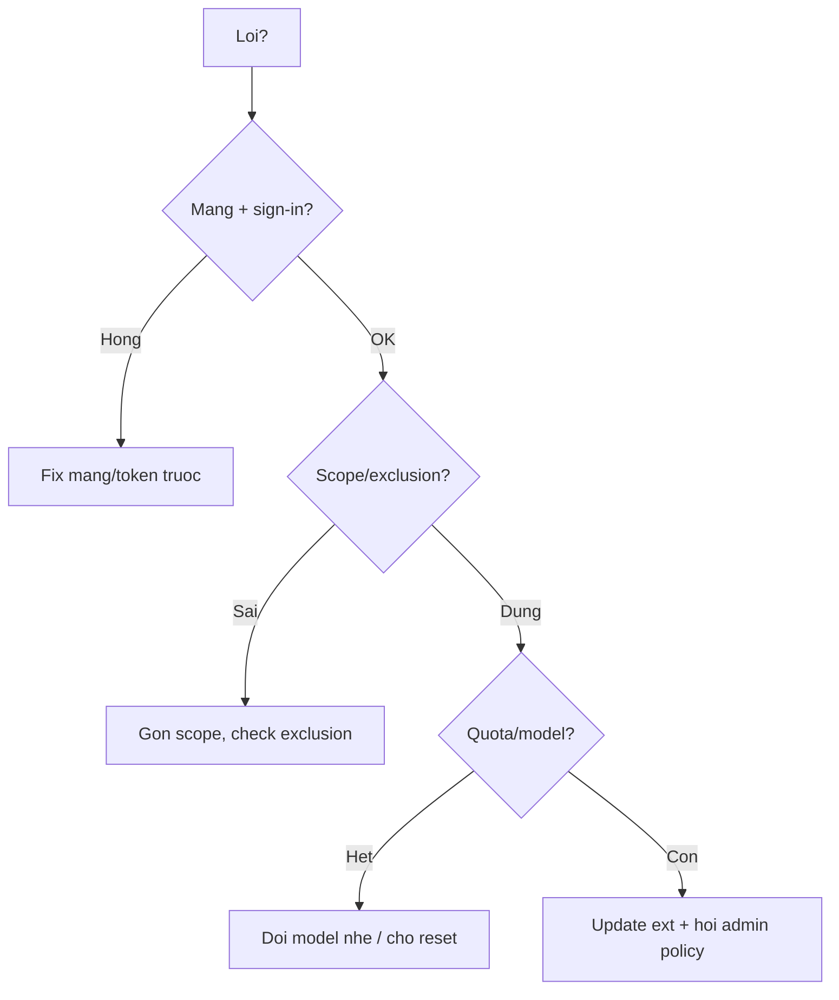

# FAQ 08 — Lỗi Thường Gặp & Troubleshooting

> Nhóm Sửa lỗi · 10 câu hỏi deep-dive · Đọc xong tự fix 90% ca, biết thứ tự debug chuẩn

File này trả lời mọi câu hỏi "Copilot offline, no suggestions, chat error, CLI fail, thứ tự debug". Mỗi câu có giải thích + lệnh copy-paste + ví dụ + khi nào áp dụng.

---

## Sơ đồ tư duy nhanh (đọc 30 giây)



## Bảng tổng hợp: lỗi nào đọc câu nào

| Triệu chứng | Câu | Fix 1 dòng |
|---|---|---|
| Status bar báo Offline | 1 | Check mạng + sign-in lại |
| Gõ không ra gợi ý xám | 2 | Check file type + exclusion + restart |
| Chat báo error / quota | 3 | Chat mới + check quota |
| `gh copilot` fail | 4 | Update gh + extension |
| MCP tools mất | 5 | Xem bài 04 |
| Instructions không ăn | 6 | Xem bài 06 |
| Agent lặp / đơ | 7 | Dừng + chia task |
| Sau update IDE thì hỏng | 8 | Update extension theo |
| Nghi policy chặn | 9 | Hỏi admin Policies tab |
| Không rõ nguyên nhân | 10 | Thứ tự debug tổng |

---

## 1. Copilot báo Offline — vì sao, fix sao?

> **Hỏi ngắn gọn:** _Copilot báo Offline — vì sao, fix sao?_

**Trả lời 1 câu:** 

**Giải thích chi tiết + ví dụ:** "Offline" = extension không nối được server GitHub. 4 nguyên nhân: mất mạng, proxy/firewall chặn, token hết hạn, GitHub incident.

### Làm thế nào (steps copy-paste)

Copy từng bước theo thứ tự (dán vào terminal/IDE là chạy):

```bash
# 1. Mạng tới GitHub còn không
curl -s -m 10 -o /dev/null -w "%{http_code}\n" https://api.github.com

# 2. Proxy/firewall (máy công ty hay dính): check env proxy
env | grep -i proxy

# 3. GitHub có incident không: https://www.githubstatus.com
curl -s https://www.githubstatus.com/api/v2/status.json | head -c 300; echo
```

**Ví dụ cụ thể:** máy công ty qua proxy → `api.github.com` timeout dù web vẫn mở (proxy chỉ allow browser) → xin IT whitelist `*.github.com` + `*.githubcopilot.com`.

> **Khi nào áp dụng:** ngay khi status bar đỏ Offline — check mạng trước, config sau.

> **Nếu vẫn lỗi thì...** thử theo thứ tự: (1) làm lại bước copy-paste với scope gọn hơn (1 file/selection), (2) đổi model (`/model`) rồi chạy lại, (3) tra “Vẫn lỗi thì sao?” cuối file này, (4) hỏi admin (policy/seat) hoặc mở issue với log + ảnh chụp lỗi.
---

## 2. No suggestions (gõ không ra gợi ý xám)?

> **Hỏi ngắn gọn:** _No suggestions (gõ không ra gợi ý xám)?_

**Trả lời 1 câu:** 

**Giải thích chi tiết + ví dụ:** Checklist 6 bước theo thứ tự:

1. File có được hỗ trợ không (plaintext/log thì không gợi ý).
2. File có nằm trong exclusion không (`.vscode/settings.json`, org policy).
3. Copilot có bật cho file type đó không (check status bar: enable/disable).
4. Sign-in còn hạn không (token hết → silent fail).
5. Extension xung đột (2 plugin đè nhau).
6. Thử file mới hello-world để loại trừ "code quá lạ".

### Làm thế nào (steps copy-paste)

Copy từng bước theo thứ tự (dán vào terminal/IDE là chạy):

```bash
# Trong VS Code: Ctrl+Shift+P -> "Copilot: Check Status" / "Enable Completions"
# Test với file mới:
printf 'def add(a, b):\n' > /tmp/copilot-test.py && code /tmp/copilot-test.py
# Có gợi ý ở file test mà file dự án không -> do exclusion/content file dự án
```

**Ví dụ cụ thể:** chỉ file `secrets/` không gợi ý, chỗ khác có → đúng ý exclusion, không phải lỗi.

> **Khi nào áp dụng:** mọi ca "chỗ có chỗ không" — so sánh file lỗi vs file test để khoanh vùng.

> **Nếu vẫn lỗi thì...** thử theo thứ tự: (1) làm lại bước copy-paste với scope gọn hơn (1 file/selection), (2) đổi model (`/model`) rồi chạy lại, (3) tra “Vẫn lỗi thì sao?” cuối file này, (4) hỏi admin (policy/seat) hoặc mở issue với log + ảnh chụp lỗi.
---

## 3. Chat error / quota exhausted / model unavailable?

> **Hỏi ngắn gọn:** _Chat error / quota exhausted / model unavailable?_

**Trả lời 1 câu:** 

**Giải thích chi tiết + ví dụ:** Đọc kỹ message — 3 loại khác nhau:

- `quota exhausted` → hết premium (xem [bài 02](02-model-context-premium.md)): đổi model nhẹ, chờ reset.
- `model unavailable` → model đang incident hoặc org tắt: đổi model khác.
- `something went wrong / 500` → thử chat mới; còn lỗi thì chờ + báo GitHub status.

### Làm thế nào (steps copy-paste)

Copy từng bước theo thứ tự (dán vào terminal/IDE là chạy):

```bash
# Không có CLI; thao tác:
# 1. Mở chat mới (Ctrl+Shift+P -> "Chat: New Chat")
# 2. Đổi model trong picker sang model khác
# 3. Check quota: https://github.com/settings/copilot
# 4. Check incident: https://www.githubstatus.com
```

**Ví dụ cụ thể:** chat báo `model unavailable` cho Claude → đổi sang GPT trong picker → chạy ngay → lỗi do model, không phải account.

> **Khi nào áp dụng:** trước khi kết luận "Copilot sập" — đổi model + chat mới loại trừ 80% ca.

> **Nếu vẫn lỗi thì...** thử theo thứ tự: (1) làm lại bước copy-paste với scope gọn hơn (1 file/selection), (2) đổi model (`/model`) rồi chạy lại, (3) tra “Vẫn lỗi thì sao?” cuối file này, (4) hỏi admin (policy/seat) hoặc mở issue với log + ảnh chụp lỗi.
---

## 4. `gh copilot` CLI fail (command not found / auth)?

> **Hỏi ngắn gọn:** _`gh copilot` CLI fail (command not found / auth)?_

**Trả lời 1 câu:** 

**Giải thích chi tiết + ví dụ:** 3 lỗi top:

| Lỗi | Nghĩa | Fix |
|---|---|---|
| `unknown command "copilot"` | Chưa cài extension | `gh extension install github/gh-copilot` |
| `auth failed` | `gh` chưa login / token hết | `gh auth login --web` |
| `No seat` | Account không có seat | Xin admin assign (bài 01) |

### Làm thế nào (steps copy-paste)

Copy từng bước theo thứ tự (dán vào terminal/IDE là chạy):

```bash
gh --version
gh extension list | grep -i copilot || gh extension install github/gh-copilot
gh auth status
gh copilot suggest "list files by size" --no-interactive 2>&1 | head -10
```

**Ví dụ cụ thể:** `gh copilot suggest` báo auth failed sau đổi pass GitHub → `gh auth login --web` lại → chạy.

> **Khi nào áp dụng:** khi CLI chết mà IDE vẫn sống (hoặc ngược lại) — fix auth từng thằng riêng.

> **Nếu vẫn lỗi thì...** thử theo thứ tự: (1) làm lại bước copy-paste với scope gọn hơn (1 file/selection), (2) đổi model (`/model`) rồi chạy lại, (3) tra “Vẫn lỗi thì sao?” cuối file này, (4) hỏi admin (policy/seat) hoặc mở issue với log + ảnh chụp lỗi.
---

## 5. MCP tools đột nhiên mất — thứ tự check?

> **Hỏi ngắn gọn:** _MCP tools đột nhiên mất — thứ tự check?_

**Trả lời 1 câu:** 

**Giải thích chi tiết + ví dụ:** Xem chi tiết [bài 04](04-mcp-faq.md). Tóm tắt 30 giây: validate JSON → test transport → check token → reload IDE → đọc Output log.

### Làm thế nào (steps copy-paste)

Copy từng bước theo thứ tự (dán vào terminal/IDE là chạy):

```bash
python3 -c "import json; json.load(open('.vscode/mcp.json')); print('JSON OK')"
echo ${GITHUB_MCP_TOKEN:+TOKEN_OK}
node --version
# Rồi: reload IDE -> View -> Output -> chọn MCP server -> đọc lỗi
```

**Ví dụ cụ thể:** sau restart máy tools mất → `echo $TOKEN` rỗng (env export trong session cũ mất) → export lại + mở IDE từ terminal.

> **Khi nào áp dụng:** mọi ca MCP đỏ — đừng sửa config vội, check env + JSON trước.

> **Nếu vẫn lỗi thì...** thử theo thứ tự: (1) làm lại bước copy-paste với scope gọn hơn (1 file/selection), (2) đổi model (`/model`) rồi chạy lại, (3) tra “Vẫn lỗi thì sao?” cuối file này, (4) hỏi admin (policy/seat) hoặc mở issue với log + ảnh chụp lỗi.
---

## 6. Completions gợi ý sai chuẩn team dù đã có instructions?

> **Hỏi ngắn gọn:** _Completions gợi ý sai chuẩn team dù đã có instructions?_

**Trả lời 1 câu:** 

**Giải thích chi tiết + ví dụ:** Completions (gõ tay) đọc ít context hơn chat — nó có thể bỏ qua instructions dài. Fix: giữ quy tắc quan trọng NGẮN + đặt ví dụ code mẫu ngay trong instructions (model bắt chước pattern gần hơn là đọc quy tắc xa).

### Làm thế nào (steps copy-paste)

Copy từng bước theo thứ tự (dán vào terminal/IDE là chạy):

```markdown
<!-- Trong instructions: ví dụ cụ thể thắng quy tắc chung -->
## Chuẩn error (copy pattern này)
```ts
return res.status(400).json({ code: "BAD_INPUT", message, requestId });
```
```

**Ví dụ cụ thể:** quy tắc "dùng error shape chuẩn" không ăn ở completions → thêm đoạn code mẫu 3 dòng → gợi ý xám bắt đầu ra đúng shape.

> **Khi nào áp dụng:** khi chat đúng mà gõ tay sai — bổ sung ví dụ code, đừng viết thêm chữ.

> **Nếu vẫn lỗi thì...** thử theo thứ tự: (1) làm lại bước copy-paste với scope gọn hơn (1 file/selection), (2) đổi model (`/model`) rồi chạy lại, (3) tra “Vẫn lỗi thì sao?” cuối file này, (4) hỏi admin (policy/seat) hoặc mở issue với log + ảnh chụp lỗi.
---

## 7. Agent lặp vòng / đơ / chạy mãi không xong?

> **Hỏi ngắn gọn:** _Agent lặp vòng / đơ / chạy mãi không xong?_

**Trả lời 1 câu:** 

**Giải thích chi tiết + ví dụ:** Dấu hiệu cần can thiệp: lặp cùng lỗi 3 lần, chạy >20 phút task nhỏ, tool calls toàn retry. Xử lý: **Dừng (Cancel) → đọc log vòng cuối → chia task → chạy lại từng phần.** Đừng để chạy tiếp "biết đâu được" — chỉ đốt quota.

### Làm thế nào (steps copy-paste)

Copy từng bước theo thứ tự (dán vào terminal/IDE là chạy):

```bash
# Sau khi Cancel agent:
git status --short   # xem nó đã sửa gì trước khi lặp
git diff --stat      # đánh giá: giữ phần đúng, bỏ phần loạn
# Rồi mở chat mới với task đã chia nhỏ + scope khóa
```

**Ví dụ cụ thể:** agent migrate 10 file lặp ở file 7 → Cancel → giữ 6 file xong (`git stash` phần dở) → chat mới chỉ làm 4 file còn lại.

> **Khi nào áp dụng:** quy tắc "lặp 3 lần thì dừng" cho mọi agent (local lẫn coding agent).

> **Nếu vẫn lỗi thì...** thử theo thứ tự: (1) làm lại bước copy-paste với scope gọn hơn (1 file/selection), (2) đổi model (`/model`) rồi chạy lại, (3) tra “Vẫn lỗi thì sao?” cuối file này, (4) hỏi admin (policy/seat) hoặc mở issue với log + ảnh chụp lỗi.
---

## 8. Sau update IDE/extension thì hỏng?

> **Hỏi ngắn gọn:** _Sau update IDE/extension thì hỏng?_

**Trả lời 1 câu:** 

**Giải thích chi tiết + ví dụ:** Update lệch phiên bản: IDE mới + extension cũ (hoặc ngược lại) → API không khớp → suggestions/chat chết. Fix: update CẢ IDE + extension lên mới nhất, reload, sign-in lại.

### Làm thế nào (steps copy-paste)

Copy từng bước theo thứ tự (dán vào terminal/IDE là chạy):

```bash
code --version
code --list-extensions --show-versions | grep -i copilot
# Update: VS Code (Help -> Check for Updates) + Extensions view -> Update All
# Rồi: Ctrl+Shift+P -> "Reload Window", sign-in lại nếu cần
```

**Ví dụ cụ thể:** VS Code auto-update lên bản mới, Copilot Chat cũ không tương thích → chat trắng tinh → Update All extensions → chạy lại.

> **Khi nào áp dụng:** sau mọi đợt auto-update — nếu Copilot chết ngay sau update thì 99% do lệch version.

> **Nếu vẫn lỗi thì...** thử theo thứ tự: (1) làm lại bước copy-paste với scope gọn hơn (1 file/selection), (2) đổi model (`/model`) rồi chạy lại, (3) tra “Vẫn lỗi thì sao?” cuối file này, (4) hỏi admin (policy/seat) hoặc mở issue với log + ảnh chụp lỗi.
---

## 9. Nghi org policy chặn nhưng không chắc?

> **Hỏi ngắn gọn:** _Nghi org policy chặn nhưng không chắc?_

**Trả lời 1 câu:** 

**Giải thích chi tiết + ví dụ:** Dấu hiệu policy chặn: setting tự revert, model picker thiếu, chat báo "disabled by administrator", coding agent "not enabled". Dev không xem được policy — phải hỏi admin chụp `Org Settings → Copilot → Policies`.

### Làm thế nào (steps copy-paste)

Copy từng bước theo thứ tự (dán vào terminal/IDE là chạy):

```bash
# Dev tự check gián tiếp:
gh api user --jq .login
# Rồi nhờ admin check + chụp:
# Org Settings -> Copilot -> Policies (model allowlist, agent on/off, exclusions)
# Hỏi thêm: "Seat của em còn không? Em thuộc team nào được bật agent?"
```

**Ví dụ cụ thể:** coding agent báo not enabled ở repo A nhưng repo B chạy → admin check thấy policy chỉ bật 5 repo pilot gồm B không gồm A.

> **Khi nào áp dụng:** khi mọi fix local đều vô hiệu — chuyển sang kênh admin, đừng vọc tiếp.

> **Nếu vẫn lỗi thì...** thử theo thứ tự: (1) làm lại bước copy-paste với scope gọn hơn (1 file/selection), (2) đổi model (`/model`) rồi chạy lại, (3) tra “Vẫn lỗi thì sao?” cuối file này, (4) hỏi admin (policy/seat) hoặc mở issue với log + ảnh chụp lỗi.
---

## 10. Thứ tự debug tổng (không rõ nguyên nhân)?

> **Hỏi ngắn gọn:** _Thứ tự debug tổng (không rõ nguyên nhân)?_

**Trả lời 1 câu:** 

**Giải thích chi tiết + ví dụ:** Chạy đúng 7 bước, dừng khi khỏi:

1. `gh auth status` + status bar IDE (auth?).
2. Mạng: `curl api.github.com` + githubstatus.
3. Version: IDE + extension mới nhất.
4. Sign-out → sign-in lại.
5. Chat mới + file test hello-world (loại trừ context).
6. Tắt instructions/MCP custom tạm (loại trừ config).
7. Hỏi admin (policy/seat) → báo GitHub Support kèm log.

### Làm thế nào (steps copy-paste)

Copy từng bước theo thứ tự (dán vào terminal/IDE là chạy):

```bash
gh auth status
curl -s -m 10 -o /dev/null -w "api:%{http_code}\n" https://api.github.com
gh --version; code --version
code --list-extensions --show-versions | grep -i copilot
python3 -c "import json; json.load(open('.vscode/mcp.json')); print('MCP JSON OK')"
```

**Ví dụ cụ thể:** chạy 1 lèo script trên → thấy `api:000` (mất mạng) → khỏi cần check 6 bước còn lại.

> **Khi nào áp dụng:** mọi ca "lỗi lạ" — chạy từ trên xuống, không nhảy cóc, ghi lại kết quả từng bước để báo admin/Support.

> **Nếu vẫn lỗi thì...** thử theo thứ tự: (1) làm lại bước copy-paste với scope gọn hơn (1 file/selection), (2) đổi model (`/model`) rồi chạy lại, (3) tra “Vẫn lỗi thì sao?” cuối file này, (4) hỏi admin (policy/seat) hoặc mở issue với log + ảnh chụp lỗi.
---

## Vẫn lỗi thì sao? (thứ tự debug chuẩn)

1. Chạy script câu 10, ghi kết quả từng dòng.
2. Thu thập: plan + IDE/extension version + Output log đoạn lỗi.
3. Hỏi admin (org) hoặc Discussions `github.com/community` (cá nhân).
4. Business/Enterprise → Support ticket kèm 3 thứ ở bước 2.

---

## Tham khảo chéo

- Auth/seat: [bài 01](01-tai-khoan-pricing-cai-dat.md). Quota/model: [bài 02](02-model-context-premium.md).
- MCP: [bài 04](04-mcp-faq.md). Instructions: [bài 06](06-prompts-agents-instructions.md). Policy: [bài 05](05-policies-guardrails-faq.md).

> Mẹo 1 dòng: _auth → mạng → version → sign-in lại → chat mới → tắt custom → hỏi admin — đúng thứ tự, không nhảy cóc._
