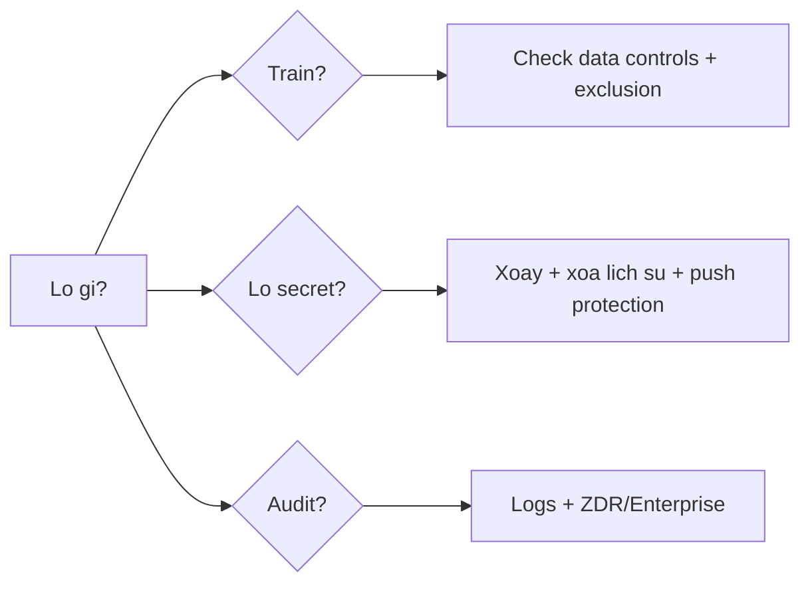

# FAQ 09 — Bảo Mật, Quyền & Riêng Tư

> Nhóm Security & Privacy · 10 câu hỏi deep-dive · Đọc xong trả lời được "code có bị train không, secret lộ thì sao, audit ở đâu"

File này trả lời mọi câu hỏi "training exclusion, duplication detection, secret scanning, audit logs, ZDR tương đương". Mỗi câu có giải thích + lệnh copy-paste + ví dụ + khi nào áp dụng.

---

## Sơ đồ tư duy nhanh (đọc 30 giây)



## Bảng tổng hợp: lo gì → đọc câu nào

| Lo ngại | Câu trả lời ngắn | Câu |
|---|---|---|
| Code bị dùng train model? | Individual: có thể (trừ khi opt-out); Business/Enterprise: không | 1 |
| Copilot gợi ý trúng code người khác? | Bật duplication detection filter | 2 |
| Secret lỡ lộ? | Xoay key + secret scanning + push protection | 3, 4 |
| Ai đã làm gì? | Audit log org + git history | 5 |
| ZDR tương đương? | Enterprise + data residency/Azure routing | 6 |
| File nhạy cảm? | Content exclusion 2 mức | 7 |

---

## 1. Code của tôi có bị dùng để train model không?

> **Hỏi ngắn gọn:** _Code của tôi có bị dùng để train model không?_

**Trả lời 1 câu:** Individual/Pro mặc định **có thể** được dùng train (trừ khi bạn opt-out), còn Business/Enterprise **không** dùng snippets để train — luôn verify lại ở `github.com/settings/copilot` vì policy đổi theo thời gian.

**Giải thích chi tiết + ví dụ:** Nôm na: cá nhân = gửi bài tập cho cô giáo (mặc định cô giữ), doanh nghiệp = hợp đồng không train (mặc định). Quy tắc 2026 (luôn verify lại ở `github.com/settings/copilot` vì policy có thể đổi):

- **Individual/Pro mặc định:** GitHub có thể dùng snippets để cải thiện model, TRỪ KHI bạn tắt "Allow GitHub to use my code snippets for product improvements".
- **Business/Enterprise:** snippets KHÔNG dùng để train (cam kết trong điều khoản thương mại).
- Dữ liệu truyền đi khi dùng vẫn qua TLS, giữ tạm để phục vụ request rồi xóa theo retention policy.

2026: AI Credits là đơn vị tính phí, không liên quan trực tiếp đến training — nhưng nếu tắt training thì quota AI Credits vẫn được giữ nguyên.

### Làm thế nào (steps copy-paste)

Copy từng bước theo thứ tự (dán vào terminal/IDE là chạy):

```bash
# Khong co CLI; check + tat tren web:
# https://github.com/settings/copilot
# -> Bo tick "Allow GitHub to use my code snippets..."
# -> Bat "Duplication detection filter" (cau 2)
# Verify: tick da bo, filter da bat
```

**Ví dụ cụ thể:** freelancer dùng Individual làm code client NDA → tắt snippet training ngay + bật duplication filter trước khi mở file NDA.

> **Khi nào áp dụng:** setup máy mới (check 1 lần), và trước khi làm code NDA/compliance.

> **Nếu vẫn lỗi thì...** thử theo thứ tự: (1) làm lại bước copy-paste với scope gọn hơn (1 file/selection), (2) đổi model (`/model`) rồi chạy lại, (3) tra "Vẫn lỗi thì sao?" cuối file này, (4) hỏi admin (policy/seat) hoặc mở issue với log + ảnh chụp lỗi.
---

## 2. Duplication detection là gì, bật sao?

> **Hỏi ngắn gọn:** _Duplication detection là gì, bật sao?_

**Trả lời 1 câu:** Duplication detection là filter chặn gợi ý trùng khớp dài (>150 ký tự) với public code — bật ở `github.com/settings/copilot` (cá nhân) hoặc ép bằng org policy (doanh nghiệp).

**Giải thích chi tiết + ví dụ:** Nôm na: chặn "nghĩ như người khác đã nghĩ" — đoạn code quá giống public thì Copilot không gợi ý. Filter chặn Copilot gợi ý đoạn code **trùng khớp dài** với public code (VD >150 ký tự quanh match) — giảm rủi ro dính license người khác. Bật ở `github.com/settings/copilot` (cá nhân) hoặc org policy (ép cả org).

Trade-off: bật → ít gợi ý dài "ngon ăn sẵn" hơn 1 chút; tắt → năng suất cao hơn nhưng tự chịu trách nhiệm license. 2026: repo có LICENSE nên cân nhắc bật Block khi product closed-source.

### Làm thế nào (steps copy-paste)

Copy từng bước theo thứ tự (dán vào terminal/IDE là chạy):

```bash
# Check nhanh repo co file LICENSE khong (lien quan trach nhem license)
ls LICENSE* 2>/dev/null || echo "Chua co LICENSE - them di"
# Web: github.com/settings/copilot -> bat "Suggestions matching public code: Block"
# Verify: filter Block da hieu luc, goi y duoi 150 ky tu van duoc tra
```

**Ví dụ cụ thể:** team enterprise làm sản phẩm closed-source → admin ép Block cho cả org → dev khỏi lo gợi ý dính GPL.

> **Khi nào áp dụng:** bật mặc định mọi account; org closed-source thì ép bằng policy.

> **Nếu vẫn lỗi thì...** thử theo thứ tự: (1) làm lại bước copy-paste với scope gọn hơn (1 file/selection), (2) đổi model (`/model`) rồi chạy lại, (3) tra "Vẫn lỗi thì sao?" cuối file này, (4) hỏi admin (policy/seat) hoặc mở issue với log + ảnh chụp lỗi.
---

## 3. Lỡ commit secret thì xử lý sao (xoay + xóa)?

> **Hỏi ngắn gọn:** _Lỡ commit secret thì xử lý sao (xoay + xóa)?_

**Trả lời 1 câu:** Thứ tự bắt buộc là **xoay/revoke key TRƯỚC, dọn history SAU** — xóa commit mà không xoay key thì key vẫn sống trong tay kẻ đã clone.

**Giải thích chi tiết + ví dụ:** Nôm na: chìa khóa rơi ngoài đường — phải đổi ổ khóa trước, sau đó mới lau sàn. Thứ tự BẮT BUỘC: **xoay/revoke key TRƯỚC, dọn history SAU.** Xóa commit mà không xoay key = key vẫn sống trong tay kẻ đã clone. Secret đã push lên GitHub coi như đã lộ. 2026: AI Credits không liên quan đến việc này — đây là quy trình bảo mật thuần.

### Làm thế nào (steps copy-paste)

Copy từng bước theo thứ tự (dán vào terminal/IDE là chạy):

```bash
# 1. Revoke/rotate TREN DASHBOARD provider truoc (Stripe/GitHub/AWS...) - lam bang tay ngay

# 2. Xoa file khoi tracking + commit moi
git rm --cached secrets/leaked.key
echo "secrets/" >> .gitignore
git commit -m "chore(security): remove leaked secret, rotated key"

# 3. Quet ca history xem con sot khong
gitleaks detect --verbose
gh api repos/<OWNER>/<REPO>/secret-scanning/alerts --jq '.[] | {secret_type, state}'
# Verify: gitleaks khong con bao ca
```

**Ví dụ cụ thể:** push nhầm `sk-live_...` → vào Stripe dashboard roll key (2 phút) → rồi mới `git rm + commit + push` → key cũ vô hiệu dù ai đã thấy.

> **Khi nào áp dụng:** ngay khi phát hiện — xoay key tính bằng phút, dọn history tính bằng giờ.

> **Nếu vẫn lỗi thì...** thử theo thứ tự: (1) làm lại bước copy-paste với scope gọn hơn (1 file/selection), (2) đổi model (`/model`) rồi chạy lại, (3) tra "Vẫn lỗi thì sao?" cuối file này, (4) hỏi admin (policy/seat) hoặc mở issue với log + ảnh chụp lỗi.
---

## 4. Secret scanning + push protection (nhắc lại, góc bảo mật)?

> **Hỏi ngắn gọn:** _Secret scanning + push protection (nhắc lại, góc bảo mật)?_

**Trả lời 1 câu:** Secret scanning chặn push có secret, push protection cho bypass có lý do (lưu audit log) — góc bảo mật: xử lý alert `validity: active` trước, còn lại dọn sau.

**Giải thích chi tiết + ví dụ:** Nôm na: bảo vệ cổng (scanning) + đồng ý cho người thật vào (bypass có lý do). Xem cấu hình ở [bài 05](05-policies-guardrails-faq.md) câu 5. Góc bảo mật bổ sung:

- **Push protection bypass:** khi bị chặn mà chắc là false positive (VD key test), GitHub cho bypass có lý do — lý do này vào audit log, admin thấy.
- **Validity check:** một số provider (Stripe, AWS...) GitHub tự check key còn sống không → alert `active` là ưu tiên xoay đầu tiên.

2026: org Enterprise có thể ép push protection cho mọi repo, không chỉ repo public.

### Làm thế nào (steps copy-paste)

Copy từng bước theo thứ tự (dán vào terminal/IDE là chạy):

```bash
# Uu tien xu ly alert con 'active' truoc
gh api repos/<OWNER>/<REPO>/secret-scanning/alerts \
  --jq '.[] | select(.state=="open") | {number, secret_type, validity}'

# Verify: alert active da xuong con 0

# Dong alert sau khi da xoay key
gh api repos/<OWNER>/<REPO>/secret-scanning/alerts/<N> -X PATCH -f state='resolved'
```

**Ví dụ cụ thể:** 5 alerts nhưng chỉ 1 `validity: active` → xoay cái active trước, còn lại dọn sau.

> **Khi nào áp dụng:** review Security tab hàng tuần; alert `active` = xử lý trong ngày.

> **Nếu vẫn lỗi thì...** thử theo thứ tự: (1) làm lại bước copy-paste với scope gọn hơn (1 file/selection), (2) đổi model (`/model`) rồi chạy lại, (3) tra "Vẫn lỗi thì sao?" cuối file này, (4) hỏi admin (policy/seat) hoặc mở issue với log + ảnh chụp lỗi.
---

## 5. Audit logs xem ở đâu (ai bật/tắt gì, khi nào)?

> **Hỏi ngắn gọn:** _Audit logs xem ở đâu (ai bật/tắt gì, khi nào)?_

**Trả lời 1 câu:** 3 tầng log: org audit log (ai đổi policy, assign seat, bypass — giữ 180 ngày đến 7 năm tùy plan), repo events (merge/dismiss), git history (ai/author từng commit).

**Giải thích chi tiết + ví dụ:** Nôm na: nhật ký 3 lớp — công ty (policy), phòng (events), cá nhân (commits). 3 tầng log:

- **Org audit log:** ai đổi policy Copilot, assign seat, bypass push protection (`Org → Settings → Audit log`, giữ 180 ngày–7 năm tùy plan).
- **Repo events:** ai merge/dismiss review (`gh api repos/.../events`, PR timeline).
- **Git history:** ai/author từng commit (kể cả bot agent).

2026: Enterprise có data residency + audit đầy đủ — Business có audit cơ bản.

### Làm thế nào (steps copy-paste)

Copy từng bước theo thứ tự (dán vào terminal/IDE là chạy):

```bash
# Org audit log qua API (can admin/org owner)
gh api orgs/<ORG>/audit-log --jq '.[] | {action, actor, created_at}' | head -20

# Loc rieng su kien Copilot
gh api "orgs/<ORG>/audit-log?phrase=action:copilot" --jq '.[] | {action, actor, created_at}'

# Verify: su kien bypass push protection co trong log
# Repo: ai dismiss review / force push gan day
gh api repos/<OWNER>/<REPO>/events --jq '.[] | {type, actor: .actor.login, created_at}' | head -20
```

**Ví dụ cụ thể:** có người bypass push protection → audit log hiện `secret_scanning.push_protection_bypass by @userX` → hỏi lý do + verify key đó đã xoay.

> **Khi nào áp dụng:** postmortem, compliance audit định kỳ, và khi policy "tự đổi" không rõ ai đổi.

> **Nếu vẫn lỗi thì...** thử theo thứ tự: (1) làm lại bước copy-paste với scope gọn hơn (1 file/selection), (2) đổi model (`/model`) rồi chạy lại, (3) tra "Vẫn lỗi thì sao?" cuối file này, (4) hỏi admin (policy/seat) hoặc mở issue với log + ảnh chụp lỗi.
---

## 6. ZDR tương đương trên Copilot/Enterprise là gì?

> **Hỏi ngắn gọn:** _ZDR tương đương trên Copilot/Enterprise là gì?_

**Trả lời 1 câu:** ZDR tương đương trên Copilot = combo Enterprise: no-training cam kết + data residency (EU/US) + retention ngắn + (tùy cấu hình) Azure OpenAI routing — trả lời khách hàng bằng văn bản, không đoán.

**Giải thích chi tiết + ví dụ:** Nôm na: "zero data retention" của Claude trên Enterprise = Copilot không giữ prompt + data lưu vùng bạn chọn + retention ngắn + (tùy config) Azure routing. ZDR (zero data retention — prompt không lưu lại) trên Claude tương đương với combo Enterprise: **no-training cam kết + data residency (EU/US region) + retention ngắn + (tùy cấu hình) Azure OpenAI routing giữ data trong tenant bạn.**

Cần thì hỏi admin 3 câu: (1) data residency region nào, (2) retention bao lâu, (3) có Azure routing không. Trả lời khách hàng bằng văn bản hợp đồng, không đoán. 2026: ZDR tương đương yêu cầu Enterprise plan + cấu hình Azure routing, không có trên Business.

### Làm thế nào (steps copy-paste)

Copy từng bước theo thứ tự (dán vào terminal/IDE là chạy):

```bash
# Dev khong tu check duoc; hoi admin va ghi vao ho so compliance:
# 1. Org plan: Business hay Enterprise?
# 2. Data residency: EU / US / default?
# 3. Snippet training: org-level off? (Enterprise mac dinh off)
# Verify: co screenshot admin xac nhan truoc khi ky cao
```

**Ví dụ cụ thể:** bid dự án bank yêu cầu "no training + EU data" → admin xác nhận Enterprise + EU residency bằng screenshot trước khi ký.

> **Khi nào áp dụng:** presales/compliance questionnaire — trả lời sau khi có xác nhận admin, không hứa miệng.

> **Nếu vẫn lỗi thì...** thử theo thứ tự: (1) làm lại bước copy-paste với scope gọn hơn (1 file/selection), (2) đổi model (`/model`) rồi chạy lại, (3) tra "Vẫn lỗi thì sao?" cuối file này, (4) hỏi admin (policy/seat) hoặc mở issue với log + ảnh chụp lỗi.
---

## 7. Content exclusion cho file nhạy cảm (nhắc lại, góc bảo mật)?

> **Hỏi ngắn gọn:** _Content exclusion cho file nhạy cảm (nhắc lại, góc bảo mật)?_

**Trả lời 1 câu:** Content exclusion là lớp phòng thủ, không thay `.gitignore` + secret manager — file đã vào git thì exclusion không cứu được (người khác vẫn đọc trên GitHub).

**Giải thích chi tiết + ví dụ:** Nôm na: cửa sổ chống đạn (exclusion) không giữ được nếu ai đó đã có chìa (file trong git). Xem cấu hình ở [bài 03](03-modes-permissions.md) câu 3. Góc bảo mật bổ sung: exclusion là **lớp phòng thủ**, không thay thế `.gitignore` + secret manager. File đã vào git thì exclusion không cứu được (người khác vẫn đọc được trên GitHub).

Thứ tự đúng: secret vào **manager (Vault/1Password/AWS Secrets)** → `.gitignore` → exclusion → scanning. 2026: có thể thêm exclusion cho cả Agent Skills, MCP config, hooks preview (`.github/skills/`, `.mcp.json`, `.github/hooks/`).

### Làm thế nào (steps copy-paste)

Copy từng bước theo thứ tự (dán vào terminal/IDE là chạy):

```bash
# Kiem tra file nhay cam co dang bi track khong
git ls-files | grep -Ei "pem$|key$|\.env$|credentials|secrets" || echo "Khong co file nhay cam bi track"

# Verify: neu co file nhay cam bi track thi gia lai buoi 3 (cau 3)

# Neu co -> go ngay (roi xoay key theo cau 3)
git rm --cached <file> && echo "<file>" >> .gitignore && git commit -m "chore(security): untrack sensitive file"
```

**Ví dụ cụ thể:** `git ls-files | grep env` ra `.env.production` → gỡ + xoay toàn bộ key trong đó + thêm exclusion.

> **Khi nào áp dụng:** audit nhanh mỗi sprint; gate trong CI càng tốt (fail nếu phát hiện file nhạy cảm bị track).

> **Nếu vẫn lỗi thì...** thử theo thứ tự: (1) làm lại bước copy-paste với scope gọn hơn (1 file/selection), (2) đổi model (`/model`) rồi chạy lại, (3) tra "Vẫn lỗi thì sao?" cuối file này, (4) hỏi admin (policy/seat) hoặc mở issue với log + ảnh chụp lỗi.
---

## 8. Token/PAT dùng cho Copilot/MCP quản lý sao cho an toàn?

> **Hỏi ngắn gọn:** _Token/PAT dùng cho Copilot/MCP quản lý sao cho an toàn?_

**Trả lời 1 câu:** Quy tắc: mỗi mục đích 1 token, quyền tối thiểu, hết hạn ngắn (30-90 ngày), lưu trong secret manager; không bao giờ paste token vào chat.

**Giải thích chi tiết + ví dụ:** Nôm na: chìa khóa mỗi phòng một cái — không dùng chìa master cho mọi phòng. Quy tắc: **mỗi mục đích 1 token, quyền tối thiểu, hết hạn ngắn, lưu trong manager.**

- PAT MCP GitHub: fine-grained, chỉ repo cần, hết hạn 30-90 ngày.
- Token CI: dùng `GITHUB_TOKEN` ephemeral của Actions, không dùng PAT cá nhân.
- Không bao giờ paste token vào chat (nó vào context server).

2026: Copilot CLI và coding agent cloud dùng `GITHUB_TOKEN` ephemeral; token cá nhân chỉ cho MCP local.

### Làm thế nào (steps copy-paste)

Copy từng bước theo thứ tự (dán vào terminal/IDE là chạy):

```bash
# Liệt kê token của bạn để dọn cái thừa/hết hạn
# Web: github.com/settings/tokens -> review + Revoke cai khong dung
# Nguyen tac: ten token ghi ro muc dich + ngay, VD: mcp-github-laptop-2026-10

# Check repo co ai hardcode token khong
grep -rEn "ghp_[A-Za-z0-9]{20,}|github_pat_[A-Za-z0-9_]{20,}|sk-live-[A-Za-z0-9]{10,}" --exclude-dir=node_modules --exclude-dir=.git . || echo "Sach"
# Verify: tra ve "Sach"
```

**Ví dụ cụ thể:** đặt lịch 90 ngày rotate PAT MCP 1 lần; CI chỉ dùng `GITHUB_TOKEN` tự cấp.

> **Khi nào áp dụng:** onboarding (cấp token đúng), offboarding (revoke), và định kỳ 90 ngày.

> **Nếu vẫn lỗi thì...** thử theo thứ tự: (1) làm lại bước copy-paste với scope gọn hơn (1 file/selection), (2) đổi model (`/model`) rồi chạy lại, (3) tra "Vẫn lỗi thì sao?" cuối file này, (4) hỏi admin (policy/seat) hoặc mở issue với log + ảnh chụp lỗi.
---

## 9. Review PR của coding agent về mặt bảo mật?

> **Hỏi ngắn gọn:** _Review PR của coding agent về mặt bảo mật?_

**Trả lời 1 câu:** PR agent phải qua cùng gate bảo mật như PR người — secret scan, required review, security-reviewer khi chạm auth/payment; riêng agent thêm 2 check: scope lố không + dependency lạ không.

**Giải thích chi tiết + ví dụ:** Nôm na: PR agent cũng phải qua cổng an ninh như PR người, chỉ thêm 2 check riêng: agent có sửa lố (file ngoài issue?) và có thêm lib lạ (không rõ nguồn?) không. PR agent phải qua cùng gate bảo mật như người: secret scan, required review, security-reviewer khi chạm auth/payment (xem [bài 07](07-custom-agents-coding-agent-workflows.md) câu 3). Thêm 2 check riêng cho agent: **scope có lố không** (file ngoài issue?) và **dependency mới có lạ không** (`package.json` thêm lib không rõ nguồn?). 2026: 2 CLI (`gh copilot` + binary `copilot`) đều có thể tạo PR — review không phụ thuộc CLI nào tạo.

### Làm thế nào (steps copy-paste)

Copy từng bước theo thứ tự (dán vào terminal/IDE là chạy):

```bash
# Check PR agent co them dependency/file la khong
gh pr diff <NUM> --name-only | head -30
git diff main...copilot/issue-N -- package.json pnpm-lock.yaml
# Verify: neu thay lib moi -> check nguon goc
# Thay lib moi -> check: npm view <lib> + doc diff code dung lib do
```

**Ví dụ cụ thể:** PR agent thêm `super-helper-utils` không ai biết → `npm view` thấy 50 downloads/tuần → yêu cầu thay bằng lib chuẩn team.

> **Khi nào áp dụng:** mọi PR agent — check dependency là bước riêng, đừng chỉ đọc code.

> **Nếu vẫn lỗi thì...** thử theo thứ tự: (1) làm lại bước copy-paste với scope gọn hơn (1 file/selection), (2) đổi model (`/model`) rồi chạy lại, (3) tra "Vẫn lỗi thì sao?" cuối file này, (4) hỏi admin (policy/seat) hoặc mở issue với log + ảnh chụp lỗi.
---

## 10. Checklist bảo mật trước khi public / mở rộng repo?

> **Hỏi ngắn gọn:** _Checklist bảo mật trước khi public / mở rộng repo?_

**Trả lời 1 câu:** 5 item: gitleaks sạch, không file nhạy cảm bị track, exclusion + ruleset + required checks bật, token đã xoay, LICENSE + duplication filter phù hợp — chạy 3 lệnh verify trước khi public.

**Giải thích chi tiết + ví dụ:** Nôm na: trước khi mở cửa hàng, kiểm tra ổ khóa, hóa đơn, biển hiệu. Trước khi public repo hoặc mở coding agent cho repo nội bộ:

1. [ ] `gitleaks detect` sạch + secret alerts resolved.
2. [ ] Không file nhạy cảm bị track (`git ls-files` check).
3. [ ] Exclusion + ruleset + required checks bật.
4. [ ] Token/keys trong code đã xoay nếu từng lộ.
5. [ ] LICENSE + duplication filter phù hợp (public → cân nhắc license gợi ý).

2026: thêm item 6 (tùy repo): Agent Skills + hooks preview (nếu có) phải được review trước khi public, vì chúng là code chạy trên máy dev.

### Làm thế nào (steps copy-paste)

Copy từng bước theo thứ tự (dán vào terminal/IDE là chạy):

```bash
gitleaks detect --verbose
# Verify: khong con alert

git ls-files | grep -Ei "pem$|key$|\.env$|credentials|secrets" || echo "OK: khong track file nhay cam"

# Verify: secret alerts co con open khong
gh api repos/<OWNER>/<REPO>/secret-scanning/alerts --jq '[.[] | select(.state=="open")] | length'
```

**Ví dụ cụ thể:** repo nội bộ mở public → chạy 3 lệnh trên → phát hiện 1 alert open → resolve xong mới public.

> **Khi nào áp dụng:** trước public, trước M&A due-diligence, và trước khi bật agent cho repo chứa data nhạy cảm.

> **Nếu vẫn lỗi thì...** thử theo thứ tự: (1) làm lại bước copy-paste với scope gọn hơn (1 file/selection), (2) đổi model (`/model`) rồi chạy lại, (3) tra "Vẫn lỗi thì sao?" cuối file này, (4) hỏi admin (policy/seat) hoặc mở issue với log + ảnh chụp lỗi.
---

## Vẫn lỗi thì sao? (thứ tự debug chuẩn)

1. Lộ secret → xoay key trước (phút), dọn sau (giờ).
2. Check `Security → Secret scanning` + audit log để biết phạm vi.
3. Gỡ file khỏi tracking + `.gitignore` + exclusion.
4. Báo admin/security team nếu liên quan prod/customer data.
5. Postmortem: thêm gate (push protection/CI check) để không lặp.

```bash
# Verify: secret con sot khong
gitleaks detect --verbose && git ls-files | grep -Ei "pem$|key$|\.env$"
```

---

## Tham khảo chéo

- Exclusion cấu hình: [bài 03](03-modes-permissions.md). Guardrails + scanning: [bài 05](05-policies-guardrails-faq.md).
- MCP secrets: [bài 04](04-mcp-faq.md). CI/review: [bài 10](10-ci-sdk-review-web.md).

> Mẹo 1 dòng: _xoay key trước dọn sau, secret vào manager chứ không vào git, và exclusion là lớp phụ sau gitignore._
