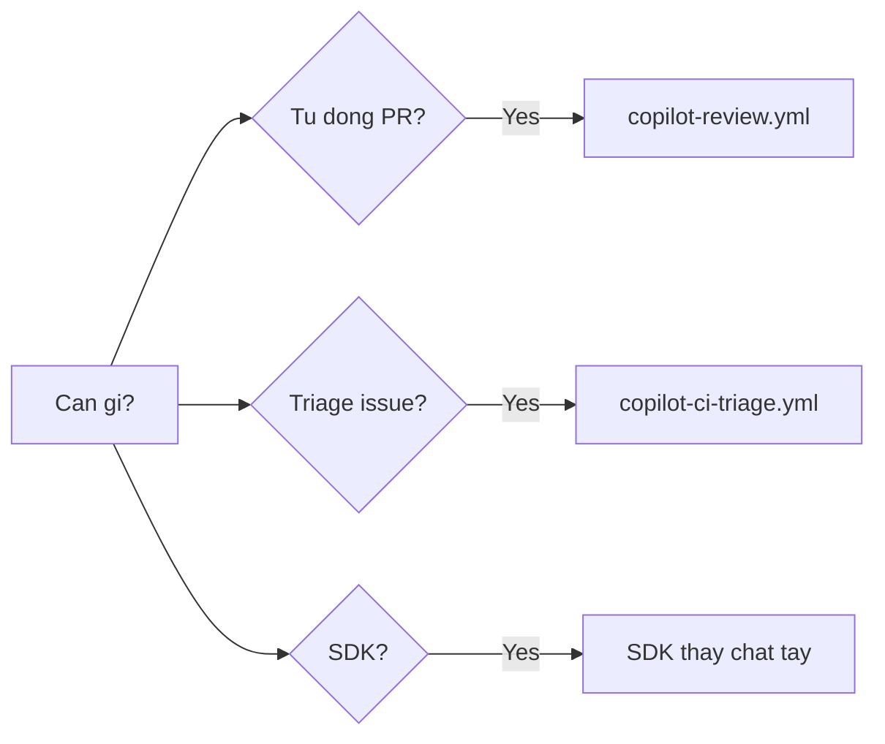

# FAQ 10 — CI, SDK, Review & Web

> Nhóm Tự động hóa & Nền tảng · 10 câu hỏi deep-dive · Đọc xong nối Actions + coding agent, dùng SDK, bật auto review, xài bản Web/Mobile

File này trả lời mọi câu hỏi "Actions + coding agent, SDK, code review auto, github.com/mobile". Mỗi câu có giải thích + lệnh copy-paste + ví dụ + khi nào áp dụng.

---

## Sơ đồ tư duy nhanh (đọc 30 giây)



## Bảng tổng hợp: automation nào dùng gì

| Muốn | Công cụ | Trigger |
|---|---|---|
| Review PR tự động | Copilot code review / workflow `copilot-review.yml` | PR opened/synchronize |
| Triage issue tự động | Workflow `copilot-ci-triage.yml` + label | Issue opened |
| Agent làm task từ issue | Coding agent (assign `copilot`) | Tay hoặc workflow |
| Gọi Copilot từ code | Copilot SDK / API | App của bạn |
| Dùng ngoài IDE | github.com/copilot, Mobile | Browser/app |

---

## 1. Actions + coding agent nối với nhau thế nào?

> **Hỏi ngắn gọn:** _Actions + coding agent nối với nhau thế nào?_

**Trả lời 1 câu:** Luồng chuẩn là issue → assign `copilot` → agent code + mở PR → Actions CI gate → review → merge, trong đó workflow không gọi agent trực tiếp mà chỉ đảm bảo CI xanh/đỏ đúng để gate PR agent.

**Giải thích chi tiết + ví dụ:** Nôm na: Actions là người gác cổng, coding agent là thợ xây — thợ xong việc thì qua cổng để kiểm tra, cổng không gọi thợ. Luồng chuẩn: **Issue (mô tả + acceptance criteria) → assign `copilot` → agent code + mở PR → Actions CI (lint/test) chạy → review → merge.** Workflow của bạn không cần gọi agent trực tiếp; agent tự lắng nghe assignment. Workflow chỉ cần đảm bảo CI xanh/đỏ đúng để gate PR agent. 2026: giao việc bằng 2 CLI — `gh copilot assign` (CLI coding agent chuẩn) hoặc binary `copilot` (CLI standalone, 3 chế độ interactive/plan/autopilot, xem [bài 12](../01-huong-dan-su-dung/12-copilot-sdk-ci-cd-automation.md)).

### Làm thế nào (steps copy-paste)

Copy từng bước theo thứ tự (dán vào terminal/IDE là chạy):

```bash
# Giao viec cho coding agent tu CLI (tao issue + assign)
gh issue create --title "feat(auth): them rate-limit login" \
  --body "Phạm vi: src/auth/**. Xong khi: npm test -- auth xanh + test 429." \
  -l "copilot"
# Verify: issue da tao + duoc label copilot
# Roi assign copilot tren web (hoac: gh issue edit <N> --add-assignee "copilot" neu org cho phep)
gh pr list --author "app/copilot" --state open
```

**Ví dụ cụ thể:** sáng tạo 3 issues + label copilot → trưa có 3 PR → chiều review + merge 2, trả lại 1 (xem [bài 07](07-custom-agents-coding-agent-workflows.md) câu 5).

> **Khi nào áp dụng:** task rõ ràng, có test — batch 2-3 issues/lần, đừng giao 10 cái cùng lúc.

> **Nếu vẫn lỗi thì...** thử theo thứ tự: (1) làm lại bước copy-paste với scope gọn hơn (1 file/selection), (2) đổi model (`/model`) rồi chạy lại, (3) tra "Vẫn lỗi thì sao?" cuối file này, (4) hỏi admin (policy/seat) hoặc mở issue với log + ảnh chụp lỗi.
---

## 2. Workflow `copilot-review.yml` mẫu làm gì?

> **Hỏi ngắn gọn:** _Workflow `copilot-review.yml` mẫu làm gì?_

**Trả lời 1 câu:** Workflow chạy khi PR mở/update: checkout code → chạy lint/test guardrailed → gọi Copilot CLI tóm tắt/review → post comment vào PR — secrets qua env, quyền tối thiểu, không flag bypass.

**Giải thích chi tiết + ví dụ:** Nôm na: tự động chạy lint + gọi Copilot "đọc cho tôi" — comment review ngay trên PR, không cần người đọc trước. Workflow chạy khi PR mở/update: checkout code → chạy lint/test guardrailed → gọi Copilot CLI tóm tắt/review → post comment vào PR. Secrets qua env, quyền tối thiểu, KHÔNG flag bypass nào (xem file mẫu trong `templates/.github/workflows/copilot-review.yml`). 2026: Copilot code review (tích hợp PR, câu 6) chạy song song với workflow custom — 1 lớp đọc code, 1 lớp chạy lệnh, cùng gate PR.

### Làm thế nào (steps copy-paste)

Copy từng bước theo thứ tự (dán vào terminal/IDE là chạy):

```yaml
# Kích hoat + quyen toi thieu (trich mau templates)
on:
  pull_request:
    types: [opened, synchronize]
permissions:
  contents: read
  pull-requests: write  # chi de comment review
```

```bash
# Copy mau vao repo
cp /path/to/tutorial-copilot/templates/.github/workflows/copilot-review.yml ./.github/workflows/
# Verify: mo PR thu -> xem comment review tu dong xuat hien
# Test: mo PR thu -> xem comment review tu dong xuat hien
```

**Ví dụ cụ thể:** PR agent mở → workflow chạy `npm run lint` đỏ → comment "lint fail ở file X" → agent đọc comment → push fix → workflow chạy lại xanh.

> **Khi nào áp dụng:** mọi repo dùng coding agent — review tự động là reviewer đầu tiên, người là reviewer cuối.

> **Nếu vẫn lỗi thì...** thử theo thứ tự: (1) làm lại bước copy-paste với scope gọn hơn (1 file/selection), (2) đổi model (`/model`) rồi chạy lại, (3) tra "Vẫn lỗi thì sao?" cuối file này, (4) hỏi admin (policy/seat) hoặc mở issue với log + ảnh chụp lỗi.
---

## 3. Workflow `copilot-ci-triage.yml` mẫu làm gì?

> **Hỏi ngắn gọn:** _Workflow `copilot-ci-triage.yml` mẫu làm gì?_

**Trả lời 1 câu:** Workflow chạy khi issue mới: đọc tiêu đề + body → phân loại (bug/feature/question) → gắn label + comment gợi ý (thiếu log? thiếu acceptance criteria?) → maintainer chỉ confirm; chỉ đọc + label, không sửa code.

**Giải thích chi tiết + ví dụ:** Nôm na: thư ký phòng khám — nhận bệnh nhân, phân loại, gọi tên, không kê đơn. Workflow chạy khi issue mới: đọc tiêu đề + body → phân loại (bug/feature/question) → gắn label + comment gợi ý (thiếu log? thiếu acceptance criteria?) → maintainer chỉ việc confirm. Chỉ đọc + label, không sửa code (xem `templates/.github/workflows/copilot-ci-triage.yml`). 2026: issue template chuẩn 5 phần (bài 07 câu 6) giúp triage bot ít phải comment "thiếu info".

### Làm thế nào (steps copy-paste)

Copy từng bước theo thứ tự (dán vào terminal/IDE là chạy):

```yaml
# Kích hoat (trich mau templates)
on:
  issues:
    types: [opened]
permissions:
  issues: write  # chi label + comment
  contents: read
```

```bash
cp /path/to/tutorial-copilot/templates/.github/workflows/copilot-ci-triage.yml ./.github/workflows/
# Verify: tao issue "Bug: login 500 khi..." -> xem label + comment tu gan
# Test: tao issue "Bug: login 500 khi..." -> xem label + comment tu gan
```

**Ví dụ cụ thể:** issue thiếu log → bot comment "vui lòng bổ sung: version, steps, log" + label `needs-info` → issue đủ info mới tới tay maintainer.

> **Khi nào áp dụng:** repo public/đông issue — triage bot đỡ 50% việc phân loại tay.

> **Nếu vẫn lỗi thì...** thử theo thứ tự: (1) làm lại bước copy-paste với scope gọn hơn (1 file/selection), (2) đổi model (`/model`) rồi chạy lại, (3) tra "Vẫn lỗi thì sao?" cuối file này, (4) hỏi admin (policy/seat) hoặc mở issue với log + ảnh chụp lỗi.
---

## 4. Secrets trong workflow truyền sao cho đúng (KHÔNG dangerously-skip)?

> **Hỏi ngắn gọn:** _Secrets trong workflow truyền sao cho đúng (KHÔNG dangerously-skip)?_

**Trả lời 1 câu:** 3 quy tắc sắt: secrets chỉ qua `${{ secrets.TEN }}` → `env` (không in log), permissions tối thiểu từng job, không dùng flag bypass — fix root cause thay vì bỏ gate.

**Giải thích chi tiết + ví dụ:** Nôm na: chìa khóa (secret) đưa qua cửa sổ (env), không đưa qua miệng (log), và không phá khóa để vào (bypass). 3 quy tắc sắt:

1. Secrets chỉ qua `${{ secrets.TEN }}` → `env:`, KHÔNG `echo`/`print` ra log.
2. `permissions:` tối thiểu từng job (read mặc định, write chỉ chỗ cần).
3. KHÔNG dùng flag skip-verification/bypass để "cho chạy được" — fix root cause (scope token, ruleset) thay vì bỏ gate.

2026: ruleset + branch protection (bài 05) là lớp chặn ngoài, không thể bypass bằng flag trong workflow.

### Làm thế nào (steps copy-paste)

Copy từng bước theo thứ tự (dán vào terminal/IDE là chạy):

```yaml
# Dung
jobs:
  review:
    permissions: { contents: read, pull-requests: write }
    steps:
      - env:
          GH_TOKEN: ${{ secrets.GITHUB_TOKEN }}
        run: gh pr view "$PR" --json title  # khong in token
```

```bash
# Quét workflow có lộ secret/skip nguy hiểm không
grep -rn "dangerously-skip\|skip-verification\|echo.*secrets\.\|print.*secrets\." .github/workflows/ || echo "Workflows sach"
# Verify: tra ve "Workflows sach"
```

**Ví dụ cụ thể:** workflow cần push comment nhưng fail permission → nâng đúng `pull-requests: write` thay vì cho `contents: write` toàn cục.

> **Khi nào áp dụng:** review mọi PR đụng `.github/workflows/` — grep trên là gate.

> **Nếu vẫn lỗi thì...** thử theo thứ tự: (1) làm lại bước copy-paste với scope gọn hơn (1 file/selection), (2) đổi model (`/model`) rồi chạy lại, (3) tra "Vẫn lỗi thì sao?" cuối file này, (4) hỏi admin (policy/seat) hoặc mở issue với log + ảnh chụp lỗi.
---

## 5. Copilot SDK là gì, khi nào dùng thay vì chat?

> **Hỏi ngắn gọn:** _Copilot SDK là gì, khi nào dùng thay vì chat?_

**Trả lời 1 câu:** SDK là thư viện để app của bạn gọi Copilot (completions/agent) từ code — dùng khi logic lặp lại, nhúng hệ thống, không cần mở IDE; không dùng cho task 1 lần ad-hoc.

**Giải thích chi tiết + ví dụ:** Nôm na: SDK là bộ động cơ + khung xe, bạn tự lắp robot Copilot riêng; chat là taxi — gọi khi cần, không cần bảo trì. SDK = thư viện để **app của bạn** gọi năng lực Copilot (completions/agent) từ code — VD bot Slack nội bộ, dashboard triage, tool migrate tự động. Dùng khi: logic lặp lại, cần nhúng vào hệ thống, không muốn người mở IDE.

Không dùng khi: task 1 lần, ad-hoc — mở chat nhanh hơn viết app. 2026: SDK bọc cả Copilot CLI và cung cấp sessions + permissions + custom tools + events; là nền của dynamic workflows (public preview 01/10/2026).

### Làm thế nào (steps copy-paste)

Copy từng bước theo thứ tự (dán vào terminal/IDE là chạy):

```bash
# Tim SDK moi nhat (ten/goi doi nhanh 2025-2026, verify truoc khi dung)
# Docs: https://docs.github.com/en/copilot/building-copilot-extensions
# Nguyen tac: token qua env, log request count de kiem soat quota/bill

# Khung app goi SDK (minh hoa): token CHI tu env
export COPILOT_SDK_TOKEN="${COPILOT_SDK_TOKEN:?thieu token}"
# Verify: in ra "thieu token" neu chua export
# node app.js  (trong code: process.env.COPILOT_SDK_TOKEN, khong hardcode)
```

**Ví dụ cụ thể:** bot Slack `#help-code`: dev hỏi → backend gọi SDK → trả lời trong Slack (quota tính chung, log theo user để tránh 1 người đốt hết AI Credits).

> **Khi nào áp dụng:** khi team muốn Copilot trong tool nội bộ — bắt đầu từ 1 endpoint thử nghiệm + quota log.

> **Nếu vẫn lỗi thì...** thử theo thứ tự: (1) làm lại bước copy-paste với scope gọn hơn (1 file/selection), (2) đổi model (`/model`) rồi chạy lại, (3) tra "Vẫn lỗi thì sao?" cuối file này, (4) hỏi admin (policy/seat) hoặc mở issue với log + ảnh chụp lỗi.
---

## 6. Code review tự động: bật ở đâu, tin được bao nhiêu?

> **Hỏi ngắn gọn:** _Code review tự động: bật ở đâu, tin được bao nhiêu?_

**Trả lời 1 câu:** 2 lớp — (a) Copilot code review tích hợp PR (bật Repo Settings → Code security), (b) workflow custom `copilot-review.yml` — tin ở mức "reviewer đầu tiên" (bắt style/null/missing test), quyết định merge vẫn do người.

**Giải thích chi tiết + ví dụ:** Nôm na: bot là đồng nghiệp đọc draft trước, bạn là reviewer cuối cùng — bot bắt lỗi nhỏ, bạn bắt lỗi lớn. 2 lớp: **(a)** GitHub Copilot code review (tích hợp PR → review từng diff, setting ở repo/org), **(b)** workflow custom `copilot-review.yml` (linh hoạt checklist team). Tin ở mức **reviewer đầu tiên**: bắt lỗi style, null-check, thiếu test; quyết định merge vẫn do người. 2026: chi phí review tính bằng GitHub Actions minutes (ngoài AI Credits, xem [bài 01](01-tai-khoan-pricing-cai-dat.md)).

### Làm thế nào (steps copy-paste)

Copy từng bước theo thứ tự (dán vào terminal/IDE là chạy):

```bash
# Bat review tu dong (web): Repo Settings -> Code security -> Copilot code review -> On
# Hoac ruleset: yeu cau review truoc merge (xem bai 05 cau 4)

# Verify: mo PR -> bot comment review tu dong
# Xem review cua bot tren PR
gh pr view <NUM> --comments | head -40
```

**Ví dụ cụ thể:** PR 200 dòng → bot comment 5 Minor (naming, null-check) → người chỉ cần soi 1 Major logic → review nhanh gấp đôi.

> **Khi nào áp dụng:** bật mặc định mọi repo team; custom checklist trong workflow khi team có chuẩn riêng (xem mẫu review-pr trong templates).

> **Nếu vẫn lỗi thì...** thử theo thứ tự: (1) làm lại bước copy-paste với scope gọn hơn (1 file/selection), (2) đổi model (`/model`) rồi chạy lại, (3) tra "Vẫn lỗi thì sao?" cuối file này, (4) hỏi admin (policy/seat) hoặc mở issue với log + ảnh chụp lỗi.
---

## 7. github.com/copilot (bản Web) dùng khi nào?

> **Hỏi ngắn gọn:** _github.com/copilot (bản Web) dùng khi nào?_

**Trả lời 1 câu:** Web dùng khi máy khác không có IDE, review nhanh PR trên web, hỏi về repo public chưa clone — không sửa multi-file mượt như IDE, không có MCP local, quota chung account.

**Giải thích chi tiết + ví dụ:** Nôm na: văn phòng mini trong browser — đọc được repo, tạo được PR, nhưng không cầm búa được (multi-file, MCP local). Web = chat Copilot trên browser, gắn với repo GitHub (đọc code trực tiếp, tạo PR từ chat). Dùng khi: máy khác không có IDE, review nhanh PR trên web, hỏi về repo public mà không muốn clone.

Giới hạn: không sửa multi-file mượt như IDE, không có MCP local, quota chung với account. 2026: Web có thể assign coding agent + xem coding agent status (xem [bài 07](07-custom-agents-coding-agent-workflows.md) câu 4).

### Làm thế nào (steps copy-paste)

Copy từng bước theo thứ tự (dán vào terminal/IDE là chạy):

```bash
# Khong can cai gi: mo https://github.com/copilot
# Chon repo context (go ten repo) roi ho:
# "Tom tat PR #123 trong acme/api: doei gi, rui ro gi?"
# Verify: PR #123 duoc tom tat, khong can clone
```

**Ví dụ cụ thể:** đang onsite bằng laptop mượn → mở `github.com/copilot` → hỏi + review PR → về máy chính mới code tiếp.

> **Khi nào áp dụng:** ngoài IDE, hoặc khi cần hỏi nhanh về repo chưa clone.

> **Nếu vẫn lỗi thì...** thử theo thứ tự: (1) làm lại bước copy-paste với scope gọn hơn (1 file/selection), (2) đổi model (`/model`) rồi chạy lại, (3) tra "Vẫn lỗi thì sao?" cuối file này, (4) hỏi admin (policy/seat) hoặc mở issue với log + ảnh chụp lỗi.
---

## 8. Copilot trên Mobile dùng được gì?

> **Hỏi ngắn gọn:** _Copilot trên Mobile dùng được gì?_

**Trả lời 1 câu:** Mobile dùng để **review + quyết định** (đọc issue/PR, hỏi về code, approve workflow runs) — không dùng để code (màn hình nhỏ, không IDE); hợp on-call/di chuyển.

**Giải thích chi tiết + ví dụ:** Nôm na: điện thoại là trạm giám sát công trường, không phải trạm thi công. GitHub Mobile app tích hợp Copilot Chat: đọc issue/PR, hỏi về code, approve workflow runs. Dùng để **review + quyết định** (đọc PR agent, merge khi CI xanh), không để code (màn hình nhỏ, không IDE). 2026: coding agent trên cloud (bài 07) + mobile approve = combo "giao việc khi làm việc, duyệt khi di chuyển".

### Làm thế nào (steps copy-paste)

Copy từng bước theo thứ tự (dán vào terminal/IDE là chạy):

```bash
# Khong co lenh; thao tac tren app:
# GitHub Mobile -> Copilot tab -> chon repo -> hoac ho hoac review PR
# Verify: PR agent duoc tom tat + checks xanh -> approve
# Merge tu mobile khi: CI xanh + da doc diff summary cua bot
```

**Ví dụ cụ thể:** agent mở PR lúc bạn đang di chuyển → mobile đọc summary + checks xanh → approve → về nhà merge hoặc auto-merge đã lo.

> **Khi nào áp dụng:** on-call / di chuyển — mobile để giám sát agent, IDE để làm việc nặng.

> **Nếu vẫn lỗi thì...** thử theo thứ tự: (1) làm lại bước copy-paste với scope gọn hơn (1 file/selection), (2) đổi model (`/model`) rồi chạy lại, (3) tra "Vẫn lỗi thì sao?" cuối file này, (4) hỏi admin (policy/seat) hoặc mở issue với log + ảnh chụp lỗi.
---

## 9. Auto-merge PR agent an toàn thế nào?

> **Hỏi ngắn gọn:** _Auto-merge PR agent an toàn thế nào?_

**Trả lời 1 câu:** Chỉ auto-merge khi đủ 4 điều kiện — scope trong issue + CI xanh hết + review bot không có Critical + không chạm migrations/infra — cấu hình bằng branch protection + `gh pr merge --auto`.

**Giải thích chi tiết + ví dụ:** Nôm na: 4 chốt cửa đều phải khóa thì mới cho xe tự chạy — thiếu 1 là dừng. Chỉ auto-merge khi đủ 4 điều kiện: **scope trong issue + CI xanh hết + review bot không có Critical + không chạm migrations/infra.** Cấu hình: branch protection (required checks) + `gh pr merge --auto --squash`. 2026: AI Credits của agent đã trả — auto-merge sai = trả tiền cho merge sai, vì vậy 4 điều kiện là gate cứng.

### Làm thế nào (steps copy-paste)

Copy từng bước theo thứ tự (dán vào terminal/IDE là chạy):

```bash
# Bat auto-merge cho PR du dieu kien
gh pr merge <NUM> --auto --squash --delete-branch

# Verify: kiem tra dieu kien truoc khi bat auto
gh pr checks <NUM>
gh pr diff <NUM> --name-only | grep -Ei "migrations|infra|terraform" && echo "KHONG auto-merge" || echo "OK auto"
```

**Ví dụ cụ thể:** PR agent docs/tests + CI xanh → `--auto` → merge khi đủ checks. PR chạm migrations → review tay, cấm auto.

> **Khi nào áp dụng:** repo có CI đầy đủ (lint+test+scan). Chưa có CI → không auto-merge bất kỳ PR nào.

> **Nếu vẫn lỗi thì...** thử theo thứ tự: (1) làm lại bước copy-paste với scope gọn hơn (1 file/selection), (2) đổi model (`/model`) rồi chạy lại, (3) tra "Vẫn lỗi thì sao?" cuối file này, (4) hỏi admin (policy/seat) hoặc mở issue với log + ảnh chụp lỗi.
---

## 10. Đo hiệu quả automation: metric nào đáng theo dõi?

> **Hỏi ngắn gọn:** _Đo hiệu quả automation: metric nào đáng theo dõi?_

**Trả lời 1 câu:** 4 metric/tháng — tỉ lệ PR agent merge không sửa, thời gian issue→merge, số comment bot có ích vs nhiễu, quota premium (AI Credits) tiêu thụ; metric đỏ thì tune issue template + checklist review.

**Giải thích chi tiết + ví dụ:** Nôm na: 4 kim chỉ nam đo hiệu quả "hệ thống agent" — bao nhiêu việc xong, bao lâu, bot nói có ích, tốn bao nhiêu. 4 metric/tháng: **tỉ lệ PR agent merge không sửa**, **thời gian issue→merge**, **số comment bot có ích vs nhiễu**, **quota premium tiêu thụ**. Metric đỏ → tune issue template + checklist review (xem [bài 07](07-custom-agents-coding-agent-workflows.md) câu 9). 2026: quota đo bằng **AI Credits** (1 credit = $0.01, xem [bài 01](01-tai-khoan-pricing-cai-dat.md)) — dashboard `github.com/settings/copilot`.

### Làm thế nào (steps copy-paste)

Copy từng bước theo thứ tự (dán vào terminal/IDE là chạy):

```bash
# Thong ke PR agent thang nay
gh pr list --author "app/copilot" --state merged --limit 50 --json number,title,mergedAt | wc -l
# Verify: so PR agent da merge
gh pr list --author "app/copilot" --state all --limit 50 --json number > /tmp/agent-prs.json
# + Check quota: https://github.com/settings/copilot -> so voi thang truoc
```

**Ví dụ cụ thể:** tháng 1: 20 PR agent, merge 8 (40%) → tune issue template → tháng 2: 20 PR, merge 13 (65%) → automation đáng tiền.

> **Khi nào áp dụng:** review hàng tháng cùng team — số liệu quyết định mở rộng hay thu hẹp agent.

> **Nếu vẫn lỗi thì...** thử theo thứ tự: (1) làm lại bước copy-paste với scope gọn hơn (1 file/selection), (2) đổi model (`/model`) rồi chạy lại, (3) tra "Vẫn lỗi thì sao?" cuối file này, (4) hỏi admin (policy/seat) hoặc mở issue với log + ảnh chụp lỗi.
---

## Vẫn lỗi thì sao? (thứ tự debug chuẩn)

1. Workflow fail → đọc log job đỏ đầu tiên (Actions tab).
2. Check `permissions:` + secrets (`grep` câu 4).
3. Test workflow trên PR thử trước khi đổ lỗi agent.
4. PR agent fail → `gh pr checks` + comment `@copilot` hướng fix.
5. SDK lỗi → check token env + docs mới nhất (gói đổi nhanh).

```bash
# Verify: log chu chay cuoi
gh run list --limit 5 && gh run view --log-failed 2>/dev/null | head -30
```

---

## Tham khảo chéo

- Viết issue cho agent: [bài 07](07-custom-agents-coding-agent-workflows.md). Guardrails CI: [bài 05](05-policies-guardrails-faq.md).
- Quota automation: [bài 02](02-model-context-premium.md). Mẫu workflows: [../templates/.github/workflows/](../templates/.github/workflows/).

> Mẹo 1 dòng: _agent làm, CI gate, bot review trước người review sau, và auto-merge chỉ khi đủ 4 điều kiện._
